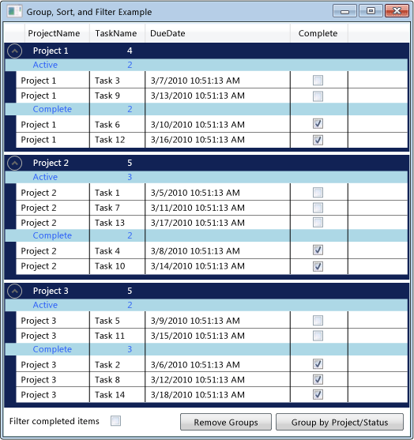

# Как группировать, сортировать и фильтровать данные в элементе управления DataGrid

Часто бывает удобно просматривать данные в <xref:System.Windows.Controls.DataGrid> различными способами путем группирования, сортировки и фильтрации данных. Чтобы группировать, сортировать и фильтровать данные в <xref:System.Windows.Controls.DataGrid>, привяжите их к <xref:System.Windows.Data.CollectionView>, который поддерживает эти функции. После этого можно работать с данными в <xref:System.Windows.Data.CollectionView>, не влияя на базовые исходные данные. Изменения в представлении коллекции отражаются в <xref:System.Windows.Controls.DataGrid> пользовательском интерфейсе (UI).

Класс <xref:System.Windows.Data.CollectionView> предоставляет функциональные возможности группирования и сортировки для источника данных, реализующего интерфейс <xref:System.Collections.IEnumerable>. Класс <xref:System.Windows.Data.CollectionViewSource> позволяет задавать свойства <xref:System.Windows.Data.CollectionView> из XAML.

В этом примере коллекция объектов `Task` привязана к <xref:System.Windows.Data.CollectionViewSource>. <xref:System.Windows.Data.CollectionViewSource> используется в качестве <xref:System.Windows.Controls.ItemsControl.ItemsSource%2A> для <xref:System.Windows.Controls.DataGrid>. Группирование, сортировка и фильтрация выполняются на <xref:System.Windows.Data.CollectionViewSource> и отображаются в пользовательском интерфейсе <xref:System.Windows.Controls.DataGrid>.

 Сгруппированные данные в элементе управления DataGrid

## Использование CollectionViewSource в качестве ItemsSource

Для группирования, сортировки и фильтрации данных в элементе управления <xref:System.Windows.Controls.DataGrid> необходимо привязать <xref:System.Windows.Controls.DataGrid> к <xref:System.Windows.Data.CollectionView>, поддерживающему эти функции. В этом примере <xref:System.Windows.Controls.DataGrid> привязан к <xref:System.Windows.Data.CollectionViewSource>, предоставляющей эти функции для <xref:System.Collections.Generic.List%601> объектов `Task`.

### Привязка элемента управления DataGrid к CollectionViewSource

1. Создайте коллекцию данных, которая реализует интерфейс <xref:System.Collections.IEnumerable>.

    Если для создания коллекции используется <xref:System.Collections.Generic.List%601>, следует создать новый класс, наследующий от <xref:System.Collections.Generic.List%601>, а не создавать экземпляр <xref:System.Collections.Generic.List%601>. Это позволяет привязывать данные к коллекции в XAML.

    > [!NOTE]
    > Объекты в коллекции должны реализовывать <xref:System.ComponentModel.INotifyPropertyChanged> измененный интерфейс и интерфейс <xref:System.ComponentModel.IEditableObject>, чтобы <xref:System.Windows.Controls.DataGrid> правильно реагировать на изменения свойств и их изменение. Дополнительные сведения см. в разделе [Реализация уведомления об изменении свойств](../data/how-to-implement-property-change-notification.md).

    [!code-csharp[DataGrid_GroupSortFilter#101](~/samples/snippets/csharp/VS_Snippets_Wpf/DataGrid_GroupSortFilter/CS/MainWindow.xaml.cs#101)]
    [!code-vb[DataGrid_GroupSortFilter#101](~/samples/snippets/visualbasic/VS_Snippets_Wpf/DataGrid_GroupSortFilter/VB/MainWindow.xaml.vb#101)]

2. В XAML создайте экземпляр класса Collection и задайте [директиву x:Key](../../xaml-services/x-key-directive.md).

3. В XAML создайте экземпляр класса <xref:System.Windows.Data.CollectionViewSource>, установите [директиву x:Key](../../xaml-services/x-key-directive.md)и задайте экземпляр класса коллекции в качестве <xref:System.Windows.Data.CollectionViewSource.Source%2A>.

    [!code-xaml[DataGrid_GroupSortFilter#201](~/samples/snippets/csharp/VS_Snippets_Wpf/DataGrid_GroupSortFilter/CS/WindowSnips1.xaml#201)]

4. Создайте экземпляр класса <xref:System.Windows.Controls.DataGrid> и задайте для свойства <xref:System.Windows.Controls.ItemsControl.ItemsSource%2A> значение <xref:System.Windows.Data.CollectionViewSource>.

    [!code-xaml[DataGrid_GroupSortFilter#002](~/samples/snippets/csharp/VS_Snippets_Wpf/DataGrid_GroupSortFilter/CS/MainWindow.xaml#002)]

5. Чтобы получить доступ к <xref:System.Windows.Data.CollectionViewSource> из кода, используйте метод <xref:System.Windows.Data.CollectionViewSource.GetDefaultView%2A> для получения ссылки на <xref:System.Windows.Data.CollectionViewSource>.

    [!code-csharp[DataGrid_GroupSortFilter#102](~/samples/snippets/csharp/VS_Snippets_Wpf/DataGrid_GroupSortFilter/CS/MainWindow.xaml.cs#102)]
    [!code-vb[DataGrid_GroupSortFilter#102](~/samples/snippets/visualbasic/VS_Snippets_Wpf/DataGrid_GroupSortFilter/VB/MainWindow.xaml.vb#102)]

## Группирование элементов в элементе управления DataGrid

Чтобы указать, как группируются элементы в <xref:System.Windows.Controls.DataGrid>, используйте тип <xref:System.Windows.Data.PropertyGroupDescription> для группировки элементов в представлении исходного кода.

### Группирование элементов в элементе управления DataGrid с помощью XAML

1. Создайте <xref:System.Windows.Data.PropertyGroupDescription>, указывающий свойство для группировки. Свойство можно указать в XAML или в коде.

   1. В XAML задайте <xref:System.Windows.Data.PropertyGroupDescription.PropertyName%2A> имя свойства, по которому будет группироваться.

   2. В коде передайте имя свойства, по которому выполняется группирование, в конструктор.

2. Добавьте <xref:System.Windows.Data.PropertyGroupDescription> в коллекцию <xref:System.Windows.Data.CollectionViewSource.GroupDescriptions%2A?displayProperty=nameWithType>.

3. Добавьте дополнительные экземпляры <xref:System.Windows.Data.PropertyGroupDescription> в коллекцию <xref:System.Windows.Data.CollectionViewSource.GroupDescriptions%2A>, чтобы добавить дополнительные уровни группировки.

    [!code-xaml[DataGrid_GroupSortFilter#012](~/samples/snippets/csharp/VS_Snippets_Wpf/DataGrid_GroupSortFilter/CS/MainWindow.xaml#012)]
    [!code-csharp[DataGrid_GroupSortFilter#112](~/samples/snippets/csharp/VS_Snippets_Wpf/DataGrid_GroupSortFilter/CS/MainWindow.xaml.cs#112)]
    [!code-vb[DataGrid_GroupSortFilter#112](~/samples/snippets/visualbasic/VS_Snippets_Wpf/DataGrid_GroupSortFilter/VB/MainWindow.xaml.vb#112)]

4. Чтобы удалить группу, удалите <xref:System.Windows.Data.PropertyGroupDescription> из коллекции <xref:System.Windows.Data.CollectionViewSource.GroupDescriptions%2A>.

5. Чтобы удалить все группы, вызовите метод <xref:System.Collections.ObjectModel.Collection%601.Clear%2A> коллекции <xref:System.Windows.Data.CollectionViewSource.GroupDescriptions%2A>.

    [!code-csharp[DataGrid_GroupSortFilter#114](~/samples/snippets/csharp/VS_Snippets_Wpf/DataGrid_GroupSortFilter/CS/MainWindow.xaml.cs#114)]
    [!code-vb[DataGrid_GroupSortFilter#114](~/samples/snippets/visualbasic/VS_Snippets_Wpf/DataGrid_GroupSortFilter/VB/MainWindow.xaml.vb#114)]

Если элементы группируются в <xref:System.Windows.Controls.DataGrid>, можно определить <xref:System.Windows.Controls.GroupStyle>, определяющие внешний вид каждой группы. Вы применяете <xref:System.Windows.Controls.GroupStyle>, добавив его в коллекцию <xref:System.Windows.Controls.ItemsControl.GroupStyle%2A> элемента управления DataGrid. При наличии нескольких уровней группировки можно применить различные стили к каждому уровню группировки. Стили применяются в том порядке, в котором они определены. Например, если определить два стиля, первый будет применяться к группам строк верхнего уровня. Второй стиль будет применен ко всем группам строк на втором уровне и ниже. <xref:System.Windows.FrameworkElement.DataContext%2A> <xref:System.Windows.Controls.GroupStyle> — <xref:System.Windows.Data.CollectionViewGroup>, которую представляет группа.

### Изменение внешнего вида заголовков групп строк

1. Создание <xref:System.Windows.Controls.GroupStyle>, определяющего внешний вид группы строк.

2. Вставьте <xref:System.Windows.Controls.GroupStyle> в теги `<DataGrid.GroupStyle>`.

    [!code-xaml[DataGrid_GroupSortFilter#003](~/samples/snippets/csharp/VS_Snippets_Wpf/DataGrid_GroupSortFilter/CS/MainWindow.xaml#003)]

## Сортировка элементов в элементе управления DataGrid

Чтобы указать порядок сортировки элементов в <xref:System.Windows.Controls.DataGrid>, используйте тип <xref:System.ComponentModel.SortDescription> для сортировки элементов в представлении исходного кода.

### Сортировка элементов в элементе управления DataGrid

1. Создайте <xref:System.ComponentModel.SortDescription>, указывающий свойство, по которому будет выполняться сортировка. Свойство можно указать в XAML или в коде.

    1. В XAML задайте <xref:System.ComponentModel.SortDescription.PropertyName%2A> имя свойства, по которому будет выполняться сортировка.

    2. В коде передайте имя свойства для сортировки, а <xref:System.ComponentModel.ListSortDirection> в конструктор.

2. Добавьте <xref:System.ComponentModel.SortDescription> в коллекцию <xref:System.Windows.Data.CollectionViewSource.SortDescriptions%2A?displayProperty=nameWithType>.

3. Добавьте дополнительные экземпляры <xref:System.ComponentModel.SortDescription> в коллекцию <xref:System.Windows.Data.CollectionViewSource.SortDescriptions%2A> для сортировки по дополнительным свойствам.

    [!code-xaml[DataGrid_GroupSortFilter#011](~/samples/snippets/csharp/VS_Snippets_Wpf/DataGrid_GroupSortFilter/CS/MainWindow.xaml#011)]
    [!code-csharp[DataGrid_GroupSortFilter#211](~/samples/snippets/csharp/VS_Snippets_Wpf/DataGrid_GroupSortFilter/CS/WindowSnips1.xaml.cs#211)]
    [!code-vb[DataGrid_GroupSortFilter#211](~/samples/snippets/visualbasic/VS_Snippets_Wpf/DataGrid_GroupSortFilter/VB/MainWindow.xaml.vb#211)]

## Фильтрация элементов в элементе управления DataGrid

Чтобы отфильтровать элементы в <xref:System.Windows.Controls.DataGrid> с помощью <xref:System.Windows.Data.CollectionViewSource>, необходимо предоставить логику фильтрации в обработчике события <xref:System.Windows.Data.CollectionViewSource.Filter?displayProperty=nameWithType>.

### Фильтрация элементов в элементе управления DataGrid

1. Добавьте обработчик для события <xref:System.Windows.Data.CollectionViewSource.Filter?displayProperty=nameWithType>.

2. В обработчике событий <xref:System.Windows.Data.CollectionViewSource.Filter> определите логику фильтрации.

    Фильтр будет применяться при каждом обновлении представления.

    [!code-xaml[DataGrid_GroupSortFilter#013](~/samples/snippets/csharp/VS_Snippets_Wpf/DataGrid_GroupSortFilter/CS/MainWindow.xaml#013)]
    [!code-csharp[DataGrid_GroupSortFilter#113](~/samples/snippets/csharp/VS_Snippets_Wpf/DataGrid_GroupSortFilter/CS/MainWindow.xaml.cs#113)]
    [!code-vb[DataGrid_GroupSortFilter#113](~/samples/snippets/visualbasic/VS_Snippets_Wpf/DataGrid_GroupSortFilter/VB/MainWindow.xaml.vb#113)]

Кроме того, можно отфильтровать элементы в <xref:System.Windows.Controls.DataGrid>, создав метод, предоставляющий логику фильтрации и установив свойство <xref:System.Windows.Data.CollectionView.Filter%2A?displayProperty=nameWithType>, чтобы применить фильтр. Пример этого метода см. в разделе [Фильтрация данных в представлении](../data/how-to-filter-data-in-a-view.md).

## Пример

В следующем примере показано группирование, сортировка и фильтрация `Task` данных в <xref:System.Windows.Data.CollectionViewSource> и отображение сгруппированных, отсортированных и отфильтрованных `Task` данных в <xref:System.Windows.Controls.DataGrid>. <xref:System.Windows.Data.CollectionViewSource> используется в качестве <xref:System.Windows.Controls.ItemsControl.ItemsSource%2A> для <xref:System.Windows.Controls.DataGrid>. Группирование, сортировка и фильтрация выполняются на <xref:System.Windows.Data.CollectionViewSource> и отображаются в пользовательском интерфейсе <xref:System.Windows.Controls.DataGrid>.

Чтобы протестировать этот пример, необходимо изменить имя Дгграупсортфилтерексампле в соответствии с именем проекта. Если используется Visual Basic, необходимо изменить имя класса для <xref:System.Windows.Window> следующим.

`<Window x:Class="MainWindow"`

[!code-xaml[DataGrid_GroupSortFilter#000](~/samples/snippets/csharp/VS_Snippets_Wpf/DataGrid_GroupSortFilter/CS/MainWindow.xaml#000)]
[!code-csharp[DataGrid_GroupSortFilter#100](~/samples/snippets/csharp/VS_Snippets_Wpf/DataGrid_GroupSortFilter/CS/MainWindow.xaml.cs#100)]
[!code-vb[DataGrid_GroupSortFilter#100](~/samples/snippets/visualbasic/VS_Snippets_Wpf/DataGrid_GroupSortFilter/VB/MainWindow.xaml.vb#100)]

## См. также

- [Общие сведения о привязке данных](../../../desktop-wpf/data/data-binding-overview.md)
- [Создание и привязка ObservableCollection](../data/how-to-create-and-bind-to-an-observablecollection.md)
- [Фильтрация данных в представлении](../data/how-to-filter-data-in-a-view.md)
- [Сортировка данных в представлении](../data/how-to-sort-data-in-a-view.md)
- [Сортировка и группировка данных с помощью представления в XAML](../data/how-to-sort-and-group-data-using-a-view-in-xaml.md)
