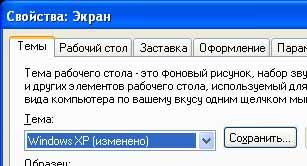

# Метка
<xref:System.Windows.Controls.Label> элементы управления обычно предоставляют информацию в [!INCLUDE[TLA#tla_ui](../../../../includes/tlasharptla-ui-md.md)].  Исторически сложилось так, что <xref:System.Windows.Controls.Label> содержал только текст, но поскольку <xref:System.Windows.Controls.Label> , поставляемый в комплекте с [!INCLUDE[TLA#tla_winclient](../../../../includes/tlasharptla-winclient-md.md)] — <xref:System.Windows.Controls.ContentControl>, он может содержать текст или <xref:System.Windows.UIElement>.  
  
 Объект <xref:System.Windows.Controls.Label> обеспечивает функциональную и визуальную поддержку клавиш доступа. Он часто используется для включения быстрый доступ к элементам управления, такие как <xref:System.Windows.Controls.TextBox>. Чтобы назначить <xref:System.Windows.Controls.Label> для <xref:System.Windows.Controls.Control>, задайте <xref:System.Windows.Controls.Label.Target%2A?displayProperty=nameWithType> свойство к элементу управления, который должен получить фокус, когда пользователь нажимает клавишу доступа.  
  
 На следующем рисунке показана <xref:System.Windows.Controls.Label> «Темы», указывающие <xref:System.Windows.Controls.ComboBox>.  Когда пользователь нажимает, <xref:System.Windows.Controls.ComboBox> получает фокус.  Дополнительные сведения см. в разделе [Как Установка целевого свойства метки](https://docs.microsoft.com/previous-versions/dotnet/netframework-3.5/ms752101(v=vs.90)).  
  
   
  
## В этом разделе  
 [Практическое руководство. Создание элемента управления, имеющего клавишу доступа и поддерживающего перенос текста](how-to-create-a-control-that-has-an-access-key-and-text-wrapping.md)  
  
## Ссылка  
 <xref:System.Windows.Controls.Label>
