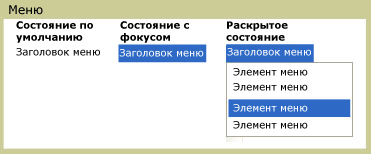

# Меню
Объект <xref:System.Windows.Controls.Menu> является элементом управления, который обеспечивает иерархическую организацию элементов, связанных с использованием команд или обработчиков событий. Каждый <xref:System.Windows.Controls.Menu> может содержать несколько <xref:System.Windows.Controls.MenuItem> элементов управления. Каждый <xref:System.Windows.Controls.MenuItem> можно вызвать команду или вызывают `Click` обработчик событий. Объект <xref:System.Windows.Controls.MenuItem> также может иметь несколько <xref:System.Windows.Controls.MenuItem> элементы как дочерние элементы, формирующие подменю.  
  
 Ниже показаны три различных состояний элемента управления меню. Состояние по умолчанию — когда нет устройства, такие как указатель мыши находится на <xref:System.Windows.Controls.Menu>. Состояние фокуса происходит, когда указатель мыши наведен на <xref:System.Windows.Controls.Menu> и состояние нажатия возникает при нажатии кнопки мыши над <xref:System.Windows.Controls.Menu>.  
  
   
Меню в различных состояниях  
  
## В этом разделе  
 [Обзор меню](menu-overview.md)  
  
## Ссылка  
 <xref:System.Windows.Controls.Menu>  
  <xref:System.Windows.Controls.MenuItem>  
  <xref:System.Windows.Controls.Primitives.MenuBase>  
  <xref:System.Windows.Controls.ContextMenu>  
  
## Связанные разделы
