# Поведение при размещении контекстного менюPopup Placement Behavior
Объект <xref:System.Windows.Controls.Primitives.Popup> управления отображает содержимое в отдельном окне, расположенном поверх приложения.A <xref:System.Windows.Controls.Primitives.Popup> control displays content in a separate window that floats over an application. Можно указать положение <xref:System.Windows.Controls.Primitives.Popup> по отношению к элементу управления, мыши или экрана с помощью <xref:System.Windows.Controls.Primitives.Popup.PlacementTarget%2A>, <xref:System.Windows.Controls.Primitives.Popup.Placement%2A>, <xref:System.Windows.Controls.Primitives.Popup.PlacementRectangle%2A>, <xref:System.Windows.Controls.Primitives.Popup.HorizontalOffset%2A>, и <xref:System.Windows.Controls.Primitives.Popup.VerticalOffset%2A> свойства.You can specify the position of a <xref:System.Windows.Controls.Primitives.Popup> relative to a control, the mouse, or the screen by using the <xref:System.Windows.Controls.Primitives.Popup.PlacementTarget%2A>, <xref:System.Windows.Controls.Primitives.Popup.Placement%2A>, <xref:System.Windows.Controls.Primitives.Popup.PlacementRectangle%2A>, <xref:System.Windows.Controls.Primitives.Popup.HorizontalOffset%2A>, and <xref:System.Windows.Controls.Primitives.Popup.VerticalOffset%2A> properties.  Эти свойства совместной работы позволяют гибко указывать положение <xref:System.Windows.Controls.Primitives.Popup>.These properties work together to give you flexibility in specifying the position of the <xref:System.Windows.Controls.Primitives.Popup>.  
  
> [!NOTE]
>  <xref:System.Windows.Controls.ToolTip> И <xref:System.Windows.Controls.ContextMenu> классы также определяют эти пять свойств и ведут себя точно так же.The <xref:System.Windows.Controls.ToolTip> and <xref:System.Windows.Controls.ContextMenu> classes also define these five properties and behave similarly.  
  

  
   
## Размещение всплывающего окнаPositioning the Popup  
 Размещение <xref:System.Windows.Controls.Primitives.Popup> может быть относительно <xref:System.Windows.UIElement> или на весь экран.The placement of a <xref:System.Windows.Controls.Primitives.Popup> can be relative to a <xref:System.Windows.UIElement> or to the entire screen.  В следующем примере создается четыре <xref:System.Windows.Controls.Primitives.Popup> элементов управления, относящихся к <xref:System.Windows.UIElement>— в данном случае это изображение.The following example creates four <xref:System.Windows.Controls.Primitives.Popup> controls that are relative to a <xref:System.Windows.UIElement>—in this case, an image. Все <xref:System.Windows.Controls.Primitives.Popup> элементы управления имеют <xref:System.Windows.Controls.Primitives.Popup.PlacementTarget%2A> свойство значение `image1`, но каждый <xref:System.Windows.Controls.Primitives.Popup> имеет другое значение свойства размещения.All of the <xref:System.Windows.Controls.Primitives.Popup> controls have the <xref:System.Windows.Controls.Primitives.Popup.PlacementTarget%2A> property set to `image1`, but each <xref:System.Windows.Controls.Primitives.Popup> has a different value for the placement property.  
  
 [!code-xaml[PopupPositionSnippet#3](../../../../samples/snippets/csharp/VS_Snippets_Wpf/PopupPositionSnippet/CS/Window1.xaml#3)]  
  
 На следующем рисунке показано изображение и <xref:System.Windows.Controls.Primitives.Popup> элементов управленияThe following illustration shows the image and the <xref:System.Windows.Controls.Primitives.Popup> controls  
  
   
Изображение с четырьмя всплывающими окнамиImage with four Popups  
  
 В этом простом примере показано, как задать <xref:System.Windows.Controls.Primitives.Popup.PlacementTarget%2A> и <xref:System.Windows.Controls.Primitives.Popup.Placement%2A> свойства, но с помощью <xref:System.Windows.Controls.Primitives.Popup.PlacementRectangle%2A>, <xref:System.Windows.Controls.Primitives.Popup.HorizontalOffset%2A>, и <xref:System.Windows.Controls.Primitives.Popup.VerticalOffset%2A> свойства, у вас есть еще большего контроля над where <xref:System.Windows.Controls.Primitives.Popup> находится.This simple example demonstrates how to set the <xref:System.Windows.Controls.Primitives.Popup.PlacementTarget%2A> and <xref:System.Windows.Controls.Primitives.Popup.Placement%2A> properties, but by using the <xref:System.Windows.Controls.Primitives.Popup.PlacementRectangle%2A>, <xref:System.Windows.Controls.Primitives.Popup.HorizontalOffset%2A>, and <xref:System.Windows.Controls.Primitives.Popup.VerticalOffset%2A> properties, you have even more control over where the <xref:System.Windows.Controls.Primitives.Popup> is positioned.  
  
   
## Определения терминов: Анатомия всплывающего окнаDefinitions of Terms: The Anatomy of a Popup  
 Следующие термины полезны в понимании того как <xref:System.Windows.Controls.Primitives.Popup.PlacementTarget%2A>, <xref:System.Windows.Controls.Primitives.Popup.Placement%2A>, <xref:System.Windows.Controls.Primitives.Popup.PlacementRectangle%2A>, <xref:System.Windows.Controls.Primitives.Popup.HorizontalOffset%2A>, и <xref:System.Windows.Controls.Primitives.Popup.VerticalOffset%2A> свойства связаны друг с другом и <xref:System.Windows.Controls.Primitives.Popup>:The following terms are useful in understanding how the <xref:System.Windows.Controls.Primitives.Popup.PlacementTarget%2A>, <xref:System.Windows.Controls.Primitives.Popup.Placement%2A>, <xref:System.Windows.Controls.Primitives.Popup.PlacementRectangle%2A>, <xref:System.Windows.Controls.Primitives.Popup.HorizontalOffset%2A>, and <xref:System.Windows.Controls.Primitives.Popup.VerticalOffset%2A> properties relate to each other and the <xref:System.Windows.Controls.Primitives.Popup>:  
  
-   Целевой объектTarget object  
  
-   Целевая областьTarget area  
  
-   Исходная точкаTarget origin  
  
-   Точка выравнивания всплывающего окнаPopup alignment point  
  
 Эти термины предоставляют удобный способ для ссылки на различные аспекты <xref:System.Windows.Controls.Primitives.Popup> элементов управления, связанного с ним.These terms provide a convenient way to refer to various aspects of the <xref:System.Windows.Controls.Primitives.Popup> and the control that it is associated with.  
  
### Целевой объектTarget Object  
 *Целевой объект* является элементом, <xref:System.Windows.Controls.Primitives.Popup> связан.The *target object* is the element that the <xref:System.Windows.Controls.Primitives.Popup> is associated with. Если <xref:System.Windows.Controls.Primitives.Popup.PlacementTarget%2A> свойство задано, оно указывает целевой объект.If the <xref:System.Windows.Controls.Primitives.Popup.PlacementTarget%2A> property is set, it specifies the target object.  Если <xref:System.Windows.Controls.Primitives.Popup.PlacementTarget%2A> не задано и <xref:System.Windows.Controls.Primitives.Popup> имеет родительский элемент, родительский объект — целевой объект.If <xref:System.Windows.Controls.Primitives.Popup.PlacementTarget%2A> is not set, and the <xref:System.Windows.Controls.Primitives.Popup> has a parent, the parent is the target object.  Если не <xref:System.Windows.Controls.Primitives.Popup.PlacementTarget%2A> значение и отсутствует родитель отсутствует целевой объект и <xref:System.Windows.Controls.Primitives.Popup> располагается относительно экрана.If there is no <xref:System.Windows.Controls.Primitives.Popup.PlacementTarget%2A> value and no parent, there is no target object, and the <xref:System.Windows.Controls.Primitives.Popup> is positioned relative to the screen.  
  
 В следующем примере создается <xref:System.Windows.Controls.Primitives.Popup> то есть дочерний <xref:System.Windows.Controls.Canvas>.The following example creates a <xref:System.Windows.Controls.Primitives.Popup> that is the child of a <xref:System.Windows.Controls.Canvas>.  В примере задается <xref:System.Windows.Controls.Primitives.Popup.PlacementTarget%2A> свойство <xref:System.Windows.Controls.Primitives.Popup>.The example does not set the <xref:System.Windows.Controls.Primitives.Popup.PlacementTarget%2A> property on the <xref:System.Windows.Controls.Primitives.Popup>. Значение по умолчанию для <xref:System.Windows.Controls.Primitives.Popup.Placement%2A> — <xref:System.Windows.Controls.Primitives.PlacementMode.Bottom?displayProperty=nameWithType>, поэтому <xref:System.Windows.Controls.Primitives.Popup> отображается под <xref:System.Windows.Controls.Canvas>.The default value for <xref:System.Windows.Controls.Primitives.Popup.Placement%2A> is <xref:System.Windows.Controls.Primitives.PlacementMode.Bottom?displayProperty=nameWithType>, so the <xref:System.Windows.Controls.Primitives.Popup> appears below the <xref:System.Windows.Controls.Canvas>.  
  
 [!code-xaml[PopupPositionSnippet#1](../../../../samples/snippets/csharp/VS_Snippets_Wpf/PopupPositionSnippet/CS/Window1.xaml#1)]  
  
 На следующем рисунке показано, что <xref:System.Windows.Controls.Primitives.Popup> расположено относительно <xref:System.Windows.Controls.Canvas>.The following illustration shows that the <xref:System.Windows.Controls.Primitives.Popup> is positioned relative to the <xref:System.Windows.Controls.Canvas>.  
  
   
Всплывающее окно без PlacementTargetPopup with no PlacementTarget  
  
 В следующем примере создается <xref:System.Windows.Controls.Primitives.Popup> то есть дочерний <xref:System.Windows.Controls.Canvas>, но на этот раз <xref:System.Windows.Controls.Primitives.Popup.PlacementTarget%2A> присваивается `ellipse1`, поэтому появится всплывающее окно под <xref:System.Windows.Shapes.Ellipse>.The following example creates a <xref:System.Windows.Controls.Primitives.Popup> that is the child of a <xref:System.Windows.Controls.Canvas>, but this time the <xref:System.Windows.Controls.Primitives.Popup.PlacementTarget%2A> is set to `ellipse1`, so the popup appears below the <xref:System.Windows.Shapes.Ellipse>.  
  
 [!code-xaml[PopupPositionSnippet#2](../../../../samples/snippets/csharp/VS_Snippets_Wpf/PopupPositionSnippet/CS/Window1.xaml#2)]  
  
 На следующем рисунке показано, что <xref:System.Windows.Controls.Primitives.Popup> расположено относительно <xref:System.Windows.Shapes.Ellipse>.The following illustration shows that the <xref:System.Windows.Controls.Primitives.Popup> is positioned relative to the <xref:System.Windows.Shapes.Ellipse>.  
  
   
Всплывающее окно с PlacementTargetPopup with PlacementTarget  
  
> [!NOTE]
>  Для <xref:System.Windows.Controls.ToolTip>, значение по умолчанию <xref:System.Windows.Controls.Primitives.Popup.Placement%2A> является <xref:System.Windows.Controls.Primitives.PlacementMode.Mouse>.For <xref:System.Windows.Controls.ToolTip>, the default value of <xref:System.Windows.Controls.Primitives.Popup.Placement%2A> is <xref:System.Windows.Controls.Primitives.PlacementMode.Mouse>.  Для <xref:System.Windows.Controls.ContextMenu>, значение по умолчанию <xref:System.Windows.Controls.Primitives.Popup.Placement%2A> является <xref:System.Windows.Controls.Primitives.PlacementMode.MousePoint>.For <xref:System.Windows.Controls.ContextMenu>, the default value of <xref:System.Windows.Controls.Primitives.Popup.Placement%2A> is <xref:System.Windows.Controls.Primitives.PlacementMode.MousePoint>. Эти значения описаны дальше, в разделе "Совместная работа свойств".These values are explained later, in "How the Properties Work Together."  
  
### Целевая областьTarget Area  
 *Целевая область* — это область на экране, <xref:System.Windows.Controls.Primitives.Popup> определяется относительно.The *target area* is the area on the screen that the <xref:System.Windows.Controls.Primitives.Popup> is relative to. В предыдущих примерах <xref:System.Windows.Controls.Primitives.Popup> выравнивается в пределах границ целевого объекта, но в некоторых случаях <xref:System.Windows.Controls.Primitives.Popup> выравнивается по другим границам, даже если <xref:System.Windows.Controls.Primitives.Popup> есть целевой объект.In the previous examples, the <xref:System.Windows.Controls.Primitives.Popup> is aligned with the bounds of the target object, but in some cases, the <xref:System.Windows.Controls.Primitives.Popup> is aligned to other bounds, even if the <xref:System.Windows.Controls.Primitives.Popup> has a target object.  Если <xref:System.Windows.Controls.Primitives.Popup.PlacementRectangle%2A> свойству, целевая область отличается от границ целевого объекта.If the <xref:System.Windows.Controls.Primitives.Popup.PlacementRectangle%2A> property is set, the target area is different than the bounds of the target object.  
  
 В следующем примере создается два <xref:System.Windows.Controls.Canvas> объектов, каждый из которых содержит <xref:System.Windows.Shapes.Rectangle> и <xref:System.Windows.Controls.Primitives.Popup>.The following example creates two <xref:System.Windows.Controls.Canvas> objects, each one containing a <xref:System.Windows.Shapes.Rectangle> and a <xref:System.Windows.Controls.Primitives.Popup>.  В обоих случаях целевым объектом для <xref:System.Windows.Controls.Primitives.Popup> является <xref:System.Windows.Controls.Canvas>.In both cases, the target object for the <xref:System.Windows.Controls.Primitives.Popup> is the <xref:System.Windows.Controls.Canvas>. <xref:System.Windows.Controls.Primitives.Popup> В первом <xref:System.Windows.Controls.Canvas> имеет <xref:System.Windows.Controls.Primitives.Popup.PlacementRectangle%2A> задано с помощью его <xref:System.Windows.Rect.X%2A>, <xref:System.Windows.Rect.Y%2A>, <xref:System.Windows.Rect.Width%2A>, и <xref:System.Windows.Rect.Height%2A> свойства, значение 50, 50, 50 и 100 соответственно.The <xref:System.Windows.Controls.Primitives.Popup> in the first <xref:System.Windows.Controls.Canvas> has the <xref:System.Windows.Controls.Primitives.Popup.PlacementRectangle%2A> set, with its <xref:System.Windows.Rect.X%2A>, <xref:System.Windows.Rect.Y%2A>, <xref:System.Windows.Rect.Width%2A>, and <xref:System.Windows.Rect.Height%2A> properties set to 50, 50, 50, and 100, respectively. <xref:System.Windows.Controls.Primitives.Popup> Во втором <xref:System.Windows.Controls.Canvas> имеет <xref:System.Windows.Controls.Primitives.Popup.PlacementRectangle%2A> значение.The <xref:System.Windows.Controls.Primitives.Popup> in the second <xref:System.Windows.Controls.Canvas> does not have the <xref:System.Windows.Controls.Primitives.Popup.PlacementRectangle%2A> set.  Таким образом первый <xref:System.Windows.Controls.Primitives.Popup> находится ниже <xref:System.Windows.Controls.Primitives.Popup.PlacementRectangle%2A> , а второй <xref:System.Windows.Controls.Primitives.Popup> находится ниже <xref:System.Windows.Controls.Canvas>.As a result, the first <xref:System.Windows.Controls.Primitives.Popup> is positioned below the <xref:System.Windows.Controls.Primitives.Popup.PlacementRectangle%2A> and the second <xref:System.Windows.Controls.Primitives.Popup> is positioned below the <xref:System.Windows.Controls.Canvas>. Каждый <xref:System.Windows.Controls.Canvas> также содержит <xref:System.Windows.Shapes.Rectangle> , имеет те же границы как <xref:System.Windows.Controls.Primitives.Popup.PlacementRectangle%2A> для первого <xref:System.Windows.Controls.Primitives.Popup>.Each <xref:System.Windows.Controls.Canvas> also contains a <xref:System.Windows.Shapes.Rectangle> that has the same bounds as the <xref:System.Windows.Controls.Primitives.Popup.PlacementRectangle%2A> for the first <xref:System.Windows.Controls.Primitives.Popup>.  Обратите внимание, что <xref:System.Windows.Controls.Primitives.Popup.PlacementRectangle%2A> не создает видимого элемента в приложении; в примере создается <xref:System.Windows.Shapes.Rectangle> для представления <xref:System.Windows.Controls.Primitives.Popup.PlacementRectangle%2A>.Note that the <xref:System.Windows.Controls.Primitives.Popup.PlacementRectangle%2A> does not create a visible element in the application; the example creates a <xref:System.Windows.Shapes.Rectangle> to represent the <xref:System.Windows.Controls.Primitives.Popup.PlacementRectangle%2A>.  
  
 [!code-xaml[PopupPositionSnippet#4](../../../../samples/snippets/csharp/VS_Snippets_Wpf/PopupPositionSnippet/CS/Window1.xaml#4)]  
  
 На следующем рисунке показан результат примера, приведенного выше.The following illustration shows the result of the preceding example.  
  
   
Всплывающее меню с PlacementRectangle и без негоPopup with and without PlacementRectangle  
  
### Исходная точка и точка выравнивания всплывающего окнаTarget Origin and Popup Alignment Point  
 *Исходная точка* и *точка выравнивания всплывающего окна* являются опорными точками на целевой области и всплывающем окне соответственно, которые используются для позиционирования.The *target origin* and *popup alignment point* are reference points on the target area and popup, respectively, that are used for positioning. Можно использовать <xref:System.Windows.Controls.Primitives.Popup.HorizontalOffset%2A> и <xref:System.Windows.Controls.Primitives.Popup.VerticalOffset%2A> свойства для смещения всплывающего окна из целевой области.You can use the <xref:System.Windows.Controls.Primitives.Popup.HorizontalOffset%2A> and <xref:System.Windows.Controls.Primitives.Popup.VerticalOffset%2A> properties to offset the popup from the target area.  <xref:System.Windows.Controls.Primitives.Popup.HorizontalOffset%2A> И <xref:System.Windows.Controls.Primitives.Popup.VerticalOffset%2A> относительны началом координат целевого объекта и точкой выравнивания всплывающего окна.The <xref:System.Windows.Controls.Primitives.Popup.HorizontalOffset%2A> and <xref:System.Windows.Controls.Primitives.Popup.VerticalOffset%2A> are relative to the target origin and the popup alignment point. Значение <xref:System.Windows.Controls.Primitives.Popup.Placement%2A> свойство определяет, где находятся точка выравнивания всплывающего окна целевой объект.The value of the <xref:System.Windows.Controls.Primitives.Popup.Placement%2A> property determines where the target origin and popup alignment point are located.  
  
 В следующем примере создается <xref:System.Windows.Controls.Primitives.Popup> и задает <xref:System.Windows.Controls.Primitives.Popup.HorizontalOffset%2A> и <xref:System.Windows.Controls.Primitives.Popup.VerticalOffset%2A> свойства до 20.The following example creates a <xref:System.Windows.Controls.Primitives.Popup> and sets the <xref:System.Windows.Controls.Primitives.Popup.HorizontalOffset%2A> and <xref:System.Windows.Controls.Primitives.Popup.VerticalOffset%2A> properties to 20.  <xref:System.Windows.Controls.Primitives.Popup.Placement%2A> Свойству <xref:System.Windows.Controls.Primitives.PlacementMode.Bottom> (по умолчанию), поэтому исходная точка расположена в левом нижнем углу целевой области, и точка выравнивания всплывающего окна находится в левом верхнем углу <xref:System.Windows.Controls.Primitives.Popup>.The <xref:System.Windows.Controls.Primitives.Popup.Placement%2A> property is set to <xref:System.Windows.Controls.Primitives.PlacementMode.Bottom> (the default), so the target origin is the bottom-left corner of the target area and the popup alignment point is the top-left corner of the <xref:System.Windows.Controls.Primitives.Popup>.  
  
 [!code-xaml[PopupPositionSnippet#5](../../../../samples/snippets/csharp/VS_Snippets_Wpf/PopupPositionSnippet/CS/Window1.xaml#5)]  
  
 На следующем рисунке показан результат примера, приведенного выше.The following illustration shows the result of the preceding example.  
  
 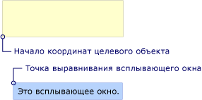  
Всплывающее окно с HorizontalOffset и VerticalOffsetPopup with HorizontalOffset and VerticalOffset  
  
   
## Совместная работа свойствHow the Properties Work Together  
 Значения <xref:System.Windows.Controls.Primitives.Popup.PlacementTarget%2A>, <xref:System.Windows.Controls.Primitives.Popup.PlacementRectangle%2A>, и <xref:System.Windows.Controls.Primitives.Popup.Placement%2A> следует учитывать друг с другом, чтобы выяснить, правильную целевую область, исходная точка и точка выравнивания всплывающего окна.The values of <xref:System.Windows.Controls.Primitives.Popup.PlacementTarget%2A>, <xref:System.Windows.Controls.Primitives.Popup.PlacementRectangle%2A>, and <xref:System.Windows.Controls.Primitives.Popup.Placement%2A> need to be considered together to figure out the correct target area, target origin, and popup alignment point.  Например если значение <xref:System.Windows.Controls.Primitives.Popup.Placement%2A> — <xref:System.Windows.Controls.Primitives.PlacementMode.Mouse>, отсутствует целевой объект <xref:System.Windows.Controls.Primitives.Popup.PlacementRectangle%2A> игнорируется, и целевая область находится в границах указателя мыши.For example, if the value of <xref:System.Windows.Controls.Primitives.Popup.Placement%2A> is <xref:System.Windows.Controls.Primitives.PlacementMode.Mouse>, there is no target object, the <xref:System.Windows.Controls.Primitives.Popup.PlacementRectangle%2A> is ignored, and the target area is the bounds of the mouse pointer. С другой стороны Если <xref:System.Windows.Controls.Primitives.Popup.Placement%2A> — <xref:System.Windows.Controls.Primitives.PlacementMode.Bottom>, <xref:System.Windows.Controls.Primitives.Popup.PlacementTarget%2A> или родительский элемент определяет целевой объект и <xref:System.Windows.Controls.Primitives.Popup.PlacementRectangle%2A> определяет целевую область.On the other hand, if <xref:System.Windows.Controls.Primitives.Popup.Placement%2A> is <xref:System.Windows.Controls.Primitives.PlacementMode.Bottom>, the <xref:System.Windows.Controls.Primitives.Popup.PlacementTarget%2A> or parent determines the target object and <xref:System.Windows.Controls.Primitives.Popup.PlacementRectangle%2A> determines the target area.  
  
 В следующей таблице описаны целевой объект, целевая область, исходная точка и точка выравнивания всплывающего окна и указывает ли <xref:System.Windows.Controls.Primitives.Popup.PlacementTarget%2A> и <xref:System.Windows.Controls.Primitives.Popup.PlacementRectangle%2A> используются для каждого <xref:System.Windows.Controls.Primitives.PlacementMode> значение перечисления.The following table describes the target object, target area, target origin, and popup alignment point and indicates whether <xref:System.Windows.Controls.Primitives.Popup.PlacementTarget%2A> and <xref:System.Windows.Controls.Primitives.Popup.PlacementRectangle%2A> are used for each <xref:System.Windows.Controls.Primitives.PlacementMode> enumeration value.  
  
|PlacementModePlacementMode|Целевой объектTarget object|Целевая областьTarget area|Исходная точкаTarget origin|Точка выравнивания всплывающего окнаPopup alignment point|  
|-------------------|-------------------|-----------------|-------------------|---------------------------|  
|<xref:System.Windows.Controls.Primitives.PlacementMode.Absolute>|Неприменимо.Not applicable. <xref:System.Windows.Controls.Primitives.Popup.PlacementTarget%2A> учитывается.<xref:System.Windows.Controls.Primitives.Popup.PlacementTarget%2A> is ignored.|Экран или <xref:System.Windows.Controls.Primitives.Popup.PlacementRectangle%2A> если он задан.The screen, or <xref:System.Windows.Controls.Primitives.Popup.PlacementRectangle%2A> if it is set.  <xref:System.Windows.Controls.Primitives.Popup.PlacementRectangle%2A> Расположен относительно экрана.The <xref:System.Windows.Controls.Primitives.Popup.PlacementRectangle%2A> is relative to the screen.|Левый верхний угол целевой области.The top-left corner of the target area.|В левом верхнем углу <xref:System.Windows.Controls.Primitives.Popup>.The top-left corner of the <xref:System.Windows.Controls.Primitives.Popup>.|  
|<xref:System.Windows.Controls.Primitives.PlacementMode.AbsolutePoint>|Неприменимо.Not applicable. <xref:System.Windows.Controls.Primitives.Popup.PlacementTarget%2A> учитывается.<xref:System.Windows.Controls.Primitives.Popup.PlacementTarget%2A> is ignored.|Экран или <xref:System.Windows.Controls.Primitives.Popup.PlacementRectangle%2A> если он задан.The screen, or <xref:System.Windows.Controls.Primitives.Popup.PlacementRectangle%2A> if it is set.  <xref:System.Windows.Controls.Primitives.Popup.PlacementRectangle%2A> Расположен относительно экрана.The <xref:System.Windows.Controls.Primitives.Popup.PlacementRectangle%2A> is relative to the screen.|Левый верхний угол целевой области.The top-left corner of the target area.|В левом верхнем углу <xref:System.Windows.Controls.Primitives.Popup>.The top-left corner of the <xref:System.Windows.Controls.Primitives.Popup>.|  
|<xref:System.Windows.Controls.Primitives.PlacementMode.Bottom>|<xref:System.Windows.Controls.Primitives.Popup.PlacementTarget%2A> или родительский элемент.<xref:System.Windows.Controls.Primitives.Popup.PlacementTarget%2A> or parent.|Целевой объект, или <xref:System.Windows.Controls.Primitives.Popup.PlacementRectangle%2A> если он задан.The target object, or <xref:System.Windows.Controls.Primitives.Popup.PlacementRectangle%2A> if it is set.  <xref:System.Windows.Controls.Primitives.Popup.PlacementRectangle%2A> Относительно целевого объекта.The <xref:System.Windows.Controls.Primitives.Popup.PlacementRectangle%2A> is relative to the target object.|Левый нижний угол целевой области.The bottom-left corner of the target area.|В левом верхнем углу <xref:System.Windows.Controls.Primitives.Popup>.The top-left corner of the <xref:System.Windows.Controls.Primitives.Popup>.|  
|<xref:System.Windows.Controls.Primitives.PlacementMode.Center>|<xref:System.Windows.Controls.Primitives.Popup.PlacementTarget%2A> или родительский элемент.<xref:System.Windows.Controls.Primitives.Popup.PlacementTarget%2A> or parent.|Целевой объект, или <xref:System.Windows.Controls.Primitives.Popup.PlacementRectangle%2A> если он задан.The target object, or <xref:System.Windows.Controls.Primitives.Popup.PlacementRectangle%2A> if it is set.  <xref:System.Windows.Controls.Primitives.Popup.PlacementRectangle%2A> Относительно целевого объекта.The <xref:System.Windows.Controls.Primitives.Popup.PlacementRectangle%2A> is relative to the target object.|Центр целевой области.The center of the target area.|Центр <xref:System.Windows.Controls.Primitives.Popup>.The center of the <xref:System.Windows.Controls.Primitives.Popup>.|  
|<xref:System.Windows.Controls.Primitives.PlacementMode.Custom>|<xref:System.Windows.Controls.Primitives.Popup.PlacementTarget%2A> или родительский элемент.<xref:System.Windows.Controls.Primitives.Popup.PlacementTarget%2A> or parent.|Целевой объект, или <xref:System.Windows.Controls.Primitives.Popup.PlacementRectangle%2A> если он задан.The target object, or <xref:System.Windows.Controls.Primitives.Popup.PlacementRectangle%2A> if it is set.  <xref:System.Windows.Controls.Primitives.Popup.PlacementRectangle%2A> Относительно целевого объекта.The <xref:System.Windows.Controls.Primitives.Popup.PlacementRectangle%2A> is relative to the target object.|Определяется <xref:System.Windows.Controls.Primitives.CustomPopupPlacementCallback>.Defined by the <xref:System.Windows.Controls.Primitives.CustomPopupPlacementCallback>.|Определяется <xref:System.Windows.Controls.Primitives.CustomPopupPlacementCallback>.Defined by the <xref:System.Windows.Controls.Primitives.CustomPopupPlacementCallback>.|  
|<xref:System.Windows.Controls.Primitives.PlacementMode.Left>|<xref:System.Windows.Controls.Primitives.Popup.PlacementTarget%2A> или родительский элемент.<xref:System.Windows.Controls.Primitives.Popup.PlacementTarget%2A> or parent.|Целевой объект, или <xref:System.Windows.Controls.Primitives.Popup.PlacementRectangle%2A> если он задан.The target object, or <xref:System.Windows.Controls.Primitives.Popup.PlacementRectangle%2A> if it is set.  <xref:System.Windows.Controls.Primitives.Popup.PlacementRectangle%2A> Относительно целевого объекта.The <xref:System.Windows.Controls.Primitives.Popup.PlacementRectangle%2A> is relative to the target object.|Левый верхний угол целевой области.The top-left corner of the target area.|В правом верхнем углу <xref:System.Windows.Controls.Primitives.Popup>.The top-right corner of the <xref:System.Windows.Controls.Primitives.Popup>.|  
|<xref:System.Windows.Controls.Primitives.PlacementMode.Mouse>|Неприменимо.Not applicable. <xref:System.Windows.Controls.Primitives.Popup.PlacementTarget%2A> учитывается.<xref:System.Windows.Controls.Primitives.Popup.PlacementTarget%2A> is ignored.|Границы указателя мыши.The bounds of the mouse pointer. <xref:System.Windows.Controls.Primitives.Popup.PlacementRectangle%2A> учитывается.<xref:System.Windows.Controls.Primitives.Popup.PlacementRectangle%2A> is ignored.|Левый нижний угол целевой области.The bottom-left corner of the target area.|В левом верхнем углу <xref:System.Windows.Controls.Primitives.Popup>.The top-left corner of the <xref:System.Windows.Controls.Primitives.Popup>.|  
|<xref:System.Windows.Controls.Primitives.PlacementMode.MousePoint>|Неприменимо.Not applicable. <xref:System.Windows.Controls.Primitives.Popup.PlacementTarget%2A> учитывается.<xref:System.Windows.Controls.Primitives.Popup.PlacementTarget%2A> is ignored.|Границы указателя мыши.The bounds of the mouse pointer. <xref:System.Windows.Controls.Primitives.Popup.PlacementRectangle%2A> учитывается.<xref:System.Windows.Controls.Primitives.Popup.PlacementRectangle%2A> is ignored.|Левый верхний угол целевой области.The top-left corner of the target area.|В левом верхнем углу <xref:System.Windows.Controls.Primitives.Popup>.The top-left corner of the <xref:System.Windows.Controls.Primitives.Popup>.|  
|<xref:System.Windows.Controls.Primitives.PlacementMode.Relative>|<xref:System.Windows.Controls.Primitives.Popup.PlacementTarget%2A> или родительский элемент.<xref:System.Windows.Controls.Primitives.Popup.PlacementTarget%2A> or parent.|Целевой объект, или <xref:System.Windows.Controls.Primitives.Popup.PlacementRectangle%2A> если он задан.The target object, or <xref:System.Windows.Controls.Primitives.Popup.PlacementRectangle%2A> if it is set.  <xref:System.Windows.Controls.Primitives.Popup.PlacementRectangle%2A> Относительно целевого объекта.The <xref:System.Windows.Controls.Primitives.Popup.PlacementRectangle%2A> is relative to the target object.|Левый верхний угол целевой области.The top-left corner of the target area.|В левом верхнем углу <xref:System.Windows.Controls.Primitives.Popup>.The top-left corner of the <xref:System.Windows.Controls.Primitives.Popup>.|  
|<xref:System.Windows.Controls.Primitives.PlacementMode.RelativePoint>|<xref:System.Windows.Controls.Primitives.Popup.PlacementTarget%2A> или родительский элемент.<xref:System.Windows.Controls.Primitives.Popup.PlacementTarget%2A> or parent.|Целевой объект, или <xref:System.Windows.Controls.Primitives.Popup.PlacementRectangle%2A> если он задан.The target object, or <xref:System.Windows.Controls.Primitives.Popup.PlacementRectangle%2A> if it is set.  <xref:System.Windows.Controls.Primitives.Popup.PlacementRectangle%2A> Относительно целевого объекта.The <xref:System.Windows.Controls.Primitives.Popup.PlacementRectangle%2A> is relative to the target object.|Левый верхний угол целевой области.The top-left corner of the target area.|В левом верхнем углу <xref:System.Windows.Controls.Primitives.Popup>.The top-left corner of the <xref:System.Windows.Controls.Primitives.Popup>.|  
|<xref:System.Windows.Controls.Primitives.PlacementMode.Right>|<xref:System.Windows.Controls.Primitives.Popup.PlacementTarget%2A> или родительский элемент.<xref:System.Windows.Controls.Primitives.Popup.PlacementTarget%2A> or parent.|Целевой объект, или <xref:System.Windows.Controls.Primitives.Popup.PlacementRectangle%2A> если он задан.The target object, or <xref:System.Windows.Controls.Primitives.Popup.PlacementRectangle%2A> if it is set.  <xref:System.Windows.Controls.Primitives.Popup.PlacementRectangle%2A> Относительно целевого объекта.The <xref:System.Windows.Controls.Primitives.Popup.PlacementRectangle%2A> is relative to the target object.|Правый верхний угол целевой области.The top-right corner of the target area.|В левом верхнем углу <xref:System.Windows.Controls.Primitives.Popup>.The top-left corner of the <xref:System.Windows.Controls.Primitives.Popup>.|  
|<xref:System.Windows.Controls.Primitives.PlacementMode.Top>|<xref:System.Windows.Controls.Primitives.Popup.PlacementTarget%2A> или родительский элемент.<xref:System.Windows.Controls.Primitives.Popup.PlacementTarget%2A> or parent.|Целевой объект, или <xref:System.Windows.Controls.Primitives.Popup.PlacementRectangle%2A> если он задан.The target object, or <xref:System.Windows.Controls.Primitives.Popup.PlacementRectangle%2A> if it is set.  <xref:System.Windows.Controls.Primitives.Popup.PlacementRectangle%2A> Относительно целевого объекта.The <xref:System.Windows.Controls.Primitives.Popup.PlacementRectangle%2A> is relative to the target object.|Левый верхний угол целевой области.The top-left corner of the target area.|В нижнем левом углу <xref:System.Windows.Controls.Primitives.Popup>.The bottom-left corner of the <xref:System.Windows.Controls.Primitives.Popup>.|  
  
 На следующих рисунках <xref:System.Windows.Controls.Primitives.Popup>, целевая область, исходная точка и выравнивания всплывающего окна точки для каждого <xref:System.Windows.Controls.Primitives.PlacementMode> значение.The following illustrations show the <xref:System.Windows.Controls.Primitives.Popup>, target area, target origin, and popup alignment point for each <xref:System.Windows.Controls.Primitives.PlacementMode> value. На каждом рисунке целевая область закрашена желтым, а <xref:System.Windows.Controls.Primitives.Popup> — синий.In each figure, the target area is yellow, and the <xref:System.Windows.Controls.Primitives.Popup> is blue.  
  
 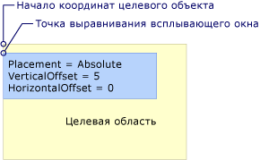  
Абсолютное размещение или размещение с помощью AbsolutePointPlacement is Absolute or AbsolutePoint  
  
 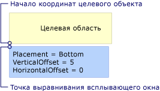  
Расположение снизуPlacement is Bottom  
  
 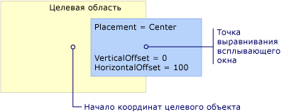  
Размещение в центреPlacement is Center  
  
 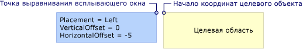  
Размещение слеваPlacement is Left  
  
 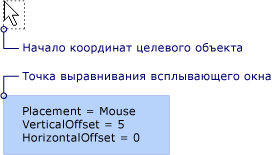  
Размещение относительно мышиPlacement is Mouse  
  
 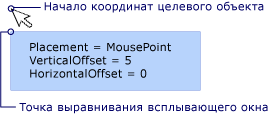  
Размещение относительно MousePointPlacement is MousePoint  
  
   
Относительное размещение или размещение с помощью RelativePointPlacement is Relative or RelativePoint  
  
 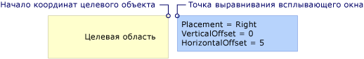  
Размещение справаPlacement is Right  
  
 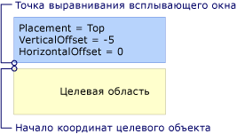  
Размещение сверхуPlacement is Top  
  
   
## Когда всплывающее окно достигает края экранаWhen the Popup Encounters the Edge of the Screen  
 По соображениям безопасности <xref:System.Windows.Controls.Primitives.Popup> не могут быть скрыты за краем экрана.For security reasons, a <xref:System.Windows.Controls.Primitives.Popup> cannot be hidden by the edge of a screen. Одно из следующих трех действий происходит при <xref:System.Windows.Controls.Primitives.Popup> края экрана:One of the following three things happens when the <xref:System.Windows.Controls.Primitives.Popup> encounters a screen edge:  
  
-   Всплывающее окно располагается вдоль края экрана, который мог бы скрыть <xref:System.Windows.Controls.Primitives.Popup>.The popup realigns itself along the screen edge that would obscure the <xref:System.Windows.Controls.Primitives.Popup>.  
  
-   Всплывающее окно использует другую точку выравнивания.The popup uses a different popup alignment point.  
  
-   Всплывающее окно использует другую исходную точку и точку выравнивания.The popup uses a different target origin and popup alignment point.  
  
 Эти параметры будут описаны далее в данном разделе.These options are described further later in this section.  
  
 Поведение <xref:System.Windows.Controls.Primitives.Popup> при обнаружении края экрана зависит от значения <xref:System.Windows.Controls.Primitives.Popup.Placement%2A> свойства, а какие граница, всплывающее окно достигают экрана.The behavior of the <xref:System.Windows.Controls.Primitives.Popup> when it encounters a screen edge depends on the value of the <xref:System.Windows.Controls.Primitives.Popup.Placement%2A> property and which screen edge the popup encounters. В следующей таблице представлены поведения при <xref:System.Windows.Controls.Primitives.Popup> края экрана для каждого <xref:System.Windows.Controls.Primitives.PlacementMode> значение.The following table summarizes the behavior when the <xref:System.Windows.Controls.Primitives.Popup> encounters a screen edge for each <xref:System.Windows.Controls.Primitives.PlacementMode> value.  
  
|PlacementModePlacementMode|Верхний крайTop edge|Нижний крайBottom edge|Левый крайLeft edge|Правый крайRight edge|  
|-------------------|--------------|-----------------|---------------|----------------|  
|<xref:System.Windows.Controls.Primitives.PlacementMode.Absolute>|Выравнивание по верхнему краю.Aligns to the top edge.|Выравнивание по нижнему краю.Aligns to the bottom edge.|Выравнивание по левому краю.Aligns to the left edge.|Выравнивание по правому краю.Aligns to the right edge.|  
|<xref:System.Windows.Controls.Primitives.PlacementMode.AbsolutePoint>|Выравнивание по верхнему краю.Aligns to the top edge.|Точка выравнивания всплывающего окна изменяется на нижний левый угол элемента <xref:System.Windows.Controls.Primitives.Popup>.The popup alignment point changes to the bottom-left corner of the <xref:System.Windows.Controls.Primitives.Popup>.|Выравнивание по левому краю.Aligns to the left edge.|Точка выравнивания всплывающего окна изменяется на верхний правый угол элемента <xref:System.Windows.Controls.Primitives.Popup>.The popup alignment point changes to the top-right corner of the <xref:System.Windows.Controls.Primitives.Popup>.|  
|<xref:System.Windows.Controls.Primitives.PlacementMode.Bottom>|Выравнивание по верхнему краю.Aligns to the top edge.|Началом координат целевого объекта изменяется в левый верхний угол целевой области, а точка выравнивания всплывающего окна изменяется в нижний левый угол <xref:System.Windows.Controls.Primitives.Popup>.The target origin changes to the top-left corner of the target area and the popup alignment point changes to the bottom-left corner of the <xref:System.Windows.Controls.Primitives.Popup>.|Выравнивание по левому краю.Aligns to the left edge.|Выравнивание по правому краю.Aligns to the right edge.|  
|<xref:System.Windows.Controls.Primitives.PlacementMode.Center>|Выравнивание по верхнему краю.Aligns to the top edge.|Выравнивание по нижнему краю.Aligns to the bottom edge.|Выравнивание по левому краю.Aligns to the left edge.|Выравнивание по правому краю.Aligns to the right edge.|  
|<xref:System.Windows.Controls.Primitives.PlacementMode.Left>|Выравнивание по верхнему краю.Aligns to the top edge.|Выравнивание по нижнему краю.Aligns to the bottom edge.|Исходная точка изменяется на верхний правый угол целевой области и точкой выравнивания всплывающего окна изменяется в верхний левый угол <xref:System.Windows.Controls.Primitives.Popup>.The target origin changes to the top-right corner of the target area and the popup alignment point changes to the top-left corner of the <xref:System.Windows.Controls.Primitives.Popup>.|Выравнивание по правому краю.Aligns to the right edge.|  
|<xref:System.Windows.Controls.Primitives.PlacementMode.Mouse>|Выравнивание по верхнему краю.Aligns to the top edge.|Началом координат целевого объекта изменяется в левый верхний угол целевой области (границы указателя мыши), а точка выравнивания всплывающего окна изменяется в нижний левый угол <xref:System.Windows.Controls.Primitives.Popup>.The target origin changes to the top-left corner of the target area (the bounds of the mouse pointer) and the popup alignment point changes to the bottom-left corner of the <xref:System.Windows.Controls.Primitives.Popup>.|Выравнивание по левому краю.Aligns to the left edge.|Выравнивание по правому краю.Aligns to the right edge.|  
|<xref:System.Windows.Controls.Primitives.PlacementMode.MousePoint>|Выравнивание по верхнему краю.Aligns to the top edge.|Точка выравнивания всплывающего окна изменяется на нижний левый угол элемента <xref:System.Windows.Controls.Primitives.Popup>.The popup alignment point changes to the bottom-left corner of the <xref:System.Windows.Controls.Primitives.Popup>.|Выравнивание по левому краю.Aligns to the left edge.|Точка выравнивания всплывающего окна переходит в верхний правый угол всплывающего окна.The popup alignment point changes to the top-right corner of the popup.|  
|<xref:System.Windows.Controls.Primitives.PlacementMode.Relative>|Выравнивание по верхнему краю.Aligns to the top edge.|Выравнивание по нижнему краю.Aligns to the bottom edge.|Выравнивание по левому краю.Aligns to the left edge.|Выравнивание по правому краю.Aligns to the right edge.|  
|<xref:System.Windows.Controls.Primitives.PlacementMode.RelativePoint>|Выравнивание по верхнему краю.Aligns to the top edge.|Точка выравнивания всплывающего окна изменяется на нижний левый угол элемента <xref:System.Windows.Controls.Primitives.Popup>.The popup alignment point changes to the bottom-left corner of the <xref:System.Windows.Controls.Primitives.Popup>.|Выравнивание по левому краю.Aligns to the left edge.|Точка выравнивания всплывающего окна переходит в верхний правый угол всплывающего окна.The popup alignment point changes to the top-right corner of the popup.|  
|<xref:System.Windows.Controls.Primitives.PlacementMode.Right>|Выравнивание по верхнему краю.Aligns to the top edge.|Выравнивание по нижнему краю.Aligns to the bottom edge.|Выравнивание по левому краю.Aligns to the left edge.|Началом координат целевого объекта изменяется в левый верхний угол целевой области, а точка выравнивания всплывающего окна изменяется в верхний правый угол <xref:System.Windows.Controls.Primitives.Popup>.The target origin changes to the top-left corner of the target area and the popup alignment point changes to the top-right corner of the <xref:System.Windows.Controls.Primitives.Popup>.|  
|<xref:System.Windows.Controls.Primitives.PlacementMode.Top>|Началом координат целевого объекта изменяется в левый нижний угол целевой области, а точка выравнивания всплывающего окна изменяется в верхний левый угол <xref:System.Windows.Controls.Primitives.Popup>.The target origin changes to the bottom-left corner of the target area and the popup alignment point changes to the top-left corner of the <xref:System.Windows.Controls.Primitives.Popup>. По сути, это то же самое, как и при <xref:System.Windows.Controls.Primitives.Popup.Placement%2A> является <xref:System.Windows.Controls.Primitives.PlacementMode.Bottom>.In effect, this is the same as when <xref:System.Windows.Controls.Primitives.Popup.Placement%2A> is <xref:System.Windows.Controls.Primitives.PlacementMode.Bottom>.|Выравнивание по нижнему краю.Aligns to the bottom edge.|Выравнивание по левому краю.Aligns to the left edge.|Выравнивание по правому краю.Aligns to the right edge.|  
  
### Выравнивание по краю экранаAligning to the Screen Edge  
 Объект <xref:System.Windows.Controls.Primitives.Popup> может выровняться по краю экрана путем изменения расположения, так что всего <xref:System.Windows.Controls.Primitives.Popup> отображается на экране.A <xref:System.Windows.Controls.Primitives.Popup> can align to the edge of the screen by repositioning itself so the entire <xref:System.Windows.Controls.Primitives.Popup> is visible on the screen.  В этом случае расстояние между точкой выравнивания всплывающего окна, целевой объект может отличаться от значения <xref:System.Windows.Controls.Primitives.Popup.HorizontalOffset%2A> и <xref:System.Windows.Controls.Primitives.Popup.VerticalOffset%2A>.When this occurs, the distance between the target origin and popup alignment point might differ from the values of <xref:System.Windows.Controls.Primitives.Popup.HorizontalOffset%2A> and <xref:System.Windows.Controls.Primitives.Popup.VerticalOffset%2A>. Когда <xref:System.Windows.Controls.Primitives.Popup.Placement%2A> — <xref:System.Windows.Controls.Primitives.PlacementMode.Absolute>, <xref:System.Windows.Controls.Primitives.PlacementMode.Center>, или <xref:System.Windows.Controls.Primitives.PlacementMode.Relative>, <xref:System.Windows.Controls.Primitives.Popup> выравнивается по каждому краю экрана.When <xref:System.Windows.Controls.Primitives.Popup.Placement%2A> is <xref:System.Windows.Controls.Primitives.PlacementMode.Absolute>, <xref:System.Windows.Controls.Primitives.PlacementMode.Center>, or <xref:System.Windows.Controls.Primitives.PlacementMode.Relative>, the <xref:System.Windows.Controls.Primitives.Popup> aligns itself to every screen edge.  Например, предположим, что <xref:System.Windows.Controls.Primitives.Popup> имеет <xref:System.Windows.Controls.Primitives.Popup.Placement%2A> присвоено <xref:System.Windows.Controls.Primitives.PlacementMode.Relative> и <xref:System.Windows.Controls.Primitives.Popup.VerticalOffset%2A> равным 100.For example, assume that a <xref:System.Windows.Controls.Primitives.Popup> has <xref:System.Windows.Controls.Primitives.Popup.Placement%2A> set to <xref:System.Windows.Controls.Primitives.PlacementMode.Relative> and <xref:System.Windows.Controls.Primitives.Popup.VerticalOffset%2A> set to 100.  Если нижний край экрана скрывает полностью или частично <xref:System.Windows.Controls.Primitives.Popup>, <xref:System.Windows.Controls.Primitives.Popup> выравнивается вдоль нижнего края экрана и расстояние по вертикали между началом координат целевого объекта и всплывающее окно точка выравнивания находится меньше 100.If the bottom edge of the screen hides all or part of the <xref:System.Windows.Controls.Primitives.Popup>, the <xref:System.Windows.Controls.Primitives.Popup> repositions itself along the bottom edge of the screen and the vertical distance between the target origin and popup alignment point is less than 100. Эта ситуация представлена на рисунке ниже.The following illustration demonstrates this.  
  
 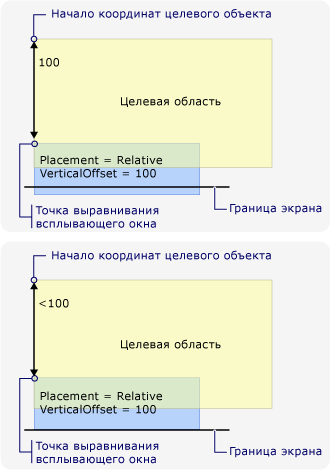  
Всплывающее окно выравнивается по краю экрана.Popup aligns to the edge of the screen  
  
### Изменение точки выравнивания всплывающего окнаChanging the Popup Alignment Point  
 Если <xref:System.Windows.Controls.Primitives.Popup.Placement%2A> — <xref:System.Windows.Controls.Primitives.PlacementMode.AbsolutePoint>, <xref:System.Windows.Controls.Primitives.PlacementMode.RelativePoint>, или <xref:System.Windows.Controls.Primitives.PlacementMode.MousePoint>, точка выравнивания всплывающего окна изменяется, когда всплывающее окно достигают нижнего или правого края экрана.If <xref:System.Windows.Controls.Primitives.Popup.Placement%2A> is <xref:System.Windows.Controls.Primitives.PlacementMode.AbsolutePoint>, <xref:System.Windows.Controls.Primitives.PlacementMode.RelativePoint>, or <xref:System.Windows.Controls.Primitives.PlacementMode.MousePoint>, the popup alignment point changes when the popup encounters the bottom or right screen edge.  
  
 На следующем рисунке показано, что если нижний край экрана скрывает полностью или частично <xref:System.Windows.Controls.Primitives.Popup>, точка выравнивания всплывающего окна находится в нижнем левом углу <xref:System.Windows.Controls.Primitives.Popup>.The following illustration demonstrates that when the bottom screen edge hides all or part of the <xref:System.Windows.Controls.Primitives.Popup>, the popup alignment point is the bottom-left corner of the <xref:System.Windows.Controls.Primitives.Popup>.  
  
 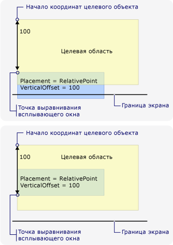  
Всплывающее окно достигает нижнего края экрана и меняет положение точки выравнивания.Popup encounters bottom edge of the screen and changes the popup alignment point  
  
 На следующем рисунке показано, что при <xref:System.Windows.Controls.Primitives.Popup> скрыт с правого края экрана, точка выравнивания всплывающего окна находится в правом верхнем углу <xref:System.Windows.Controls.Primitives.Popup>.The following illustration demonstrates that when the <xref:System.Windows.Controls.Primitives.Popup> is hidden by the right screen edge, the popup alignment point is the top-right corner of the <xref:System.Windows.Controls.Primitives.Popup>.  
  
 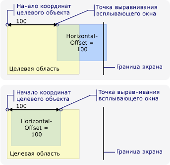  
Всплывающее окно достигает правого края экрана и меняет положение точки выравнивания.Popup encounters right edge of the screen and changes the popup alignment point  
  
 Если <xref:System.Windows.Controls.Primitives.Popup> достигает нижнего и правого краев экрана, точка выравнивания всплывающего окна находится в правом верхнем углу <xref:System.Windows.Controls.Primitives.Popup>.If the <xref:System.Windows.Controls.Primitives.Popup> encounters the bottom and right screen edges, the popup alignment point is the bottom-right corner of the <xref:System.Windows.Controls.Primitives.Popup>.  
  
### Изменение положения исходной точки и точки выравнивания всплывающего окнаChanging the Target Origin and Popup Alignment Point  
 Когда <xref:System.Windows.Controls.Primitives.Popup.Placement%2A> — <xref:System.Windows.Controls.Primitives.PlacementMode.Bottom>, <xref:System.Windows.Controls.Primitives.PlacementMode.Left>, <xref:System.Windows.Controls.Primitives.PlacementMode.Mouse>, <xref:System.Windows.Controls.Primitives.PlacementMode.Right>, или <xref:System.Windows.Controls.Primitives.PlacementMode.Top>, выравнивания всплывающего окна целевой точки изменений при обнаружении края экрана.When <xref:System.Windows.Controls.Primitives.Popup.Placement%2A> is <xref:System.Windows.Controls.Primitives.PlacementMode.Bottom>, <xref:System.Windows.Controls.Primitives.PlacementMode.Left>, <xref:System.Windows.Controls.Primitives.PlacementMode.Mouse>, <xref:System.Windows.Controls.Primitives.PlacementMode.Right>, or <xref:System.Windows.Controls.Primitives.PlacementMode.Top>, the target origin and popup alignment point change if a certain screen edge is encountered.  Зависит от края экрана, который вызывает изменение положения <xref:System.Windows.Controls.Primitives.PlacementMode> значение.The screen edge that causes the position to change depends on the <xref:System.Windows.Controls.Primitives.PlacementMode> value.  
  
 На следующем рисунке показано, что при <xref:System.Windows.Controls.Primitives.Popup.Placement%2A> — <xref:System.Windows.Controls.Primitives.PlacementMode.Bottom> и <xref:System.Windows.Controls.Primitives.Popup> достигает нижнего края экрана, исходная точка расположена в левом верхнем углу целевой области, и точка выравнивания всплывающего окна находится в нижнем левом углу <xref:System.Windows.Controls.Primitives.Popup>.The following illustration demonstrates that when <xref:System.Windows.Controls.Primitives.Popup.Placement%2A> is <xref:System.Windows.Controls.Primitives.PlacementMode.Bottom> and the <xref:System.Windows.Controls.Primitives.Popup> encounters the bottom screen edge, the target origin is the top-left corner of the target area and the popup alignment point is the bottom-left corner of the <xref:System.Windows.Controls.Primitives.Popup>.  
  
 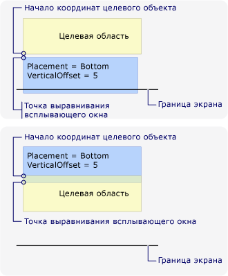  
Размещение по нижнему краю и всплывающее окно достигают нижнего края экранаPlacement is Bottom and the popup encounters the bottom edge of the screen  
  
 На следующем рисунке показано, что при <xref:System.Windows.Controls.Primitives.Popup.Placement%2A> — <xref:System.Windows.Controls.Primitives.PlacementMode.Left> и <xref:System.Windows.Controls.Primitives.Popup> встречает левый край экрана, исходная точка расположена в правом верхнем углу целевой области, и точка выравнивания всплывающего окна находится в левом верхнем углу <xref:System.Windows.Controls.Primitives.Popup>.The following illustration demonstrates that when <xref:System.Windows.Controls.Primitives.Popup.Placement%2A> is <xref:System.Windows.Controls.Primitives.PlacementMode.Left> and the <xref:System.Windows.Controls.Primitives.Popup> encounters the left screen edge, the target origin is the top-right corner of the target area and the popup alignment point is the top-left corner of the <xref:System.Windows.Controls.Primitives.Popup>.  
  
 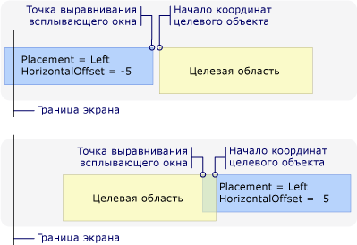  
Размещение по левому краю и всплывающее окно достигают левого края экрана.Placement is Left and the popup encounters the left edge of the screen  
  
 На следующем рисунке показано, что при <xref:System.Windows.Controls.Primitives.Popup.Placement%2A> — <xref:System.Windows.Controls.Primitives.PlacementMode.Right> и <xref:System.Windows.Controls.Primitives.Popup> встречает правый край экрана, исходная точка расположена в левом верхнем углу целевой области, и точка выравнивания всплывающего окна находится в правом верхнем углу <xref:System.Windows.Controls.Primitives.Popup>.The following illustration demonstrates that when <xref:System.Windows.Controls.Primitives.Popup.Placement%2A> is <xref:System.Windows.Controls.Primitives.PlacementMode.Right> and the <xref:System.Windows.Controls.Primitives.Popup> encounters the right screen edge, the target origin is the top-left corner of the target area and the popup alignment point is the top-right corner of the <xref:System.Windows.Controls.Primitives.Popup>.  
  
 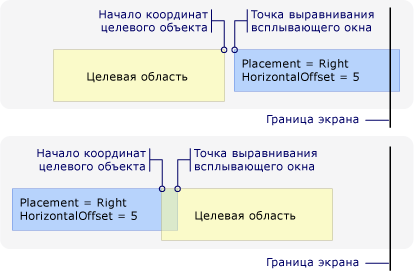  
Размещение по правому краю и всплывающее окно достигают правого края экрана.Placement is Right and the popup encounters the right edge of the screen  
  
 На следующем рисунке показано, что при <xref:System.Windows.Controls.Primitives.Popup.Placement%2A> — <xref:System.Windows.Controls.Primitives.PlacementMode.Top> и <xref:System.Windows.Controls.Primitives.Popup> встречает верхний край экрана, исходная точка расположена в левом нижнем углу целевой области, и точка выравнивания всплывающего окна находится в левом верхнем углу <xref:System.Windows.Controls.Primitives.Popup>.The following illustration demonstrates that when <xref:System.Windows.Controls.Primitives.Popup.Placement%2A> is <xref:System.Windows.Controls.Primitives.PlacementMode.Top> and the <xref:System.Windows.Controls.Primitives.Popup> encounters the top screen edge, the target origin is the bottom-left corner of the target area and the popup alignment point is the top-left corner of the <xref:System.Windows.Controls.Primitives.Popup>.  
  
 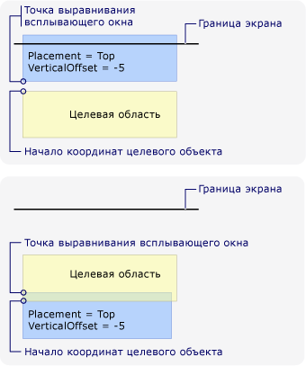  
Размещение по верхнему краю и всплывающее окно достигают верхнего края экрана.Placement is Top and the popup encounters the top edge of the screen  
  
 На следующем рисунке показано, что при <xref:System.Windows.Controls.Primitives.Popup.Placement%2A> — <xref:System.Windows.Controls.Primitives.PlacementMode.Mouse> и <xref:System.Windows.Controls.Primitives.Popup> достигает нижнего края экрана, исходная точка расположена в левом верхнем углу целевой области (границы указателя мыши), а также выравнивания всплывающего окна точка находится в нижнем левом углу <xref:System.Windows.Controls.Primitives.Popup>.The following illustration demonstrates that when <xref:System.Windows.Controls.Primitives.Popup.Placement%2A> is <xref:System.Windows.Controls.Primitives.PlacementMode.Mouse> and the <xref:System.Windows.Controls.Primitives.Popup> encounters the bottom screen edge, the target origin is the top-left corner of the target area (the bounds of the mouse pointer) and the popup alignment point is the bottom-left corner of the <xref:System.Windows.Controls.Primitives.Popup>.  
  
 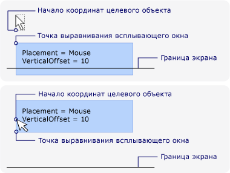  
Размещение относительно мыши и всплывающее окно достигают нижнего края экрана.Placement is Mouse and the popup encounters the bottom edge of the screen  
  
### Настройка размещения контекстного менюCustomizing Popup Placement  
 Точка выравнивания всплывающего окна целевой можно настроить, задав <xref:System.Windows.Controls.Primitives.Popup.Placement%2A> свойства <xref:System.Windows.Controls.Primitives.PlacementMode.Custom>.You can customize the target origin and popup alignment point by setting the <xref:System.Windows.Controls.Primitives.Popup.Placement%2A> property to <xref:System.Windows.Controls.Primitives.PlacementMode.Custom>. Затем определите <xref:System.Windows.Controls.Primitives.CustomPopupPlacementCallback> делегат, который возвращает набор возможных точек размещения и основные оси (в порядке предпочтения) для <xref:System.Windows.Controls.Primitives.Popup>.Then define a <xref:System.Windows.Controls.Primitives.CustomPopupPlacementCallback> delegate that returns a set of possible placement points and primary axes (in order of preference) for the <xref:System.Windows.Controls.Primitives.Popup>. Точка, в которой отображается наибольшую часть <xref:System.Windows.Controls.Primitives.Popup> выбран.The point that shows the largest portion of the <xref:System.Windows.Controls.Primitives.Popup> is selected.  Положение <xref:System.Windows.Controls.Primitives.Popup> изменяется автоматически в том случае, если <xref:System.Windows.Controls.Primitives.Popup> скрыто за краем экрана.The position of the <xref:System.Windows.Controls.Primitives.Popup> is automatically adjusted if the <xref:System.Windows.Controls.Primitives.Popup> is hidden by the edge of the screen. См. пример в разделе [Указание пользовательского расположения контекстного меню](../../../../docs/framework/wpf/controls/how-to-specify-a-custom-popup-position.md).For an example, see [Specify a Custom Popup Position](../../../../docs/framework/wpf/controls/how-to-specify-a-custom-popup-position.md).  
  
## См. такжеSee also
- [Пример размещения всплывающего окнаPopup Placement Sample](https://github.com/dotnet/samples/tree/master/snippets/csharp/VS_Snippets_Wpf/PopupPositionSnippet/CS)
