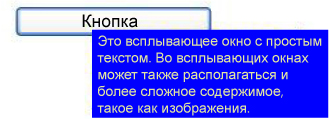

# Контекстное менюPopup
<xref:System.Windows.Controls.Primitives.Popup> Управления отображает содержимое в отдельном окне, расположенном поверх текущего окна приложения.The <xref:System.Windows.Controls.Primitives.Popup> control displays content in a separate window that floats over the current application window.  
  
 На следующем рисунке показано <xref:System.Windows.Controls.Primitives.Popup> управления, расположенный по отношению к <xref:System.Windows.Controls.Button> , являющимся его родителем.The following illustration shows a <xref:System.Windows.Controls.Primitives.Popup> control that is positioned with respect to a <xref:System.Windows.Controls.Button> that is its parent.  
  
   
  
## В этом разделеIn This Section  
 [Общие сведения о контекстном менюPopup Overview](popup-overview.md)  
 [Поведение при размещении контекстного менюPopup Placement Behavior](popup-placement-behavior.md)  
 [Разделы практического руководстваHow-to Topics](popup-how-to-topics.md)  
  
## СсылкаReference  
 <xref:System.Windows.Controls.Primitives.Popup>  
  
## Связанные разделыRelated Sections
