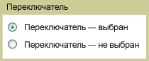

# RadioButton
<xref:System.Windows.Controls.RadioButton> элементы управления обычно сгруппированных можно предложить пользователям выбор одного из нескольких вариантов; можно выбрать только одну кнопку одновременно.  
  
 Ниже показан пример <xref:System.Windows.Controls.RadioButton> элемента управления.  
  
   
Типичные RadioButton  
  
## Ссылка  
 <xref:System.Windows.Controls.Primitives.ToggleButton>  
  
## Связанные разделы
