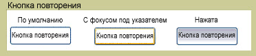

# RepeatButtonRepeatButton
<xref:System.Windows.Controls.Primitives.RepeatButton> Аналогичен <xref:System.Windows.Controls.Button>.The <xref:System.Windows.Controls.Primitives.RepeatButton> is similar to a <xref:System.Windows.Controls.Button>. Тем не менее <xref:System.Windows.Controls.Primitives.RepeatButton> обеспечивает элементы, можно контролировать, когда и как <xref:System.Windows.Controls.Primitives.ButtonBase.Click> событием.However, <xref:System.Windows.Controls.Primitives.RepeatButton> elements give you control over when and how the <xref:System.Windows.Controls.Primitives.ButtonBase.Click> event occurs.  
  
 На рисунке показан пример три состояния кнопок повтора управления, по умолчанию, PointerFocused и нажата кнопка.The following graphic shows an example of the three states of a repeat button control, Default, PointerFocused, and Pressed. Первая кнопка показывает состояние по умолчанию <xref:System.Windows.Controls.Primitives.RepeatButton>.The first button shows the default state of the <xref:System.Windows.Controls.Primitives.RepeatButton>. Во втором показан как внешний вид кнопки меняется при наведении указателя мыши на кнопку, предоставив ему фокус.The second shows how the appearance of the button changes when the mouse pointer hovers over the button, giving it focus. Последняя кнопка показывает внешний вид <xref:System.Windows.Controls.Primitives.RepeatButton> когда пользователь нажимает кнопку мыши над элементом управления.The last button shows the appearance of the <xref:System.Windows.Controls.Primitives.RepeatButton> when the user presses the mouse button over the control.  
  
   
Типичные RepeatButtonTypical RepeatButton  
  
## В этом разделеIn This Section  
  
## СсылкаReference  
 <xref:System.Windows.Controls.Primitives.RepeatButton>  
  
## Связанные разделыRelated Sections
