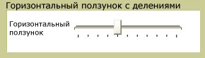

# Slider
<xref:System.Windows.Controls.Slider> Позволяет выбрать из диапазона значений путем перемещения <xref:System.Windows.Controls.Primitives.Thumb> вдоль <xref:System.Windows.Controls.Primitives.Track>.  
  
 Ниже показан пример горизонтального <xref:System.Windows.Controls.Slider> элемента управления.  
  
   
  
## В этом разделе  
 [Настройка делений на ползунке](how-to-customize-the-ticks-on-a-slider.md)  
  
## Ссылка  
 <xref:System.Windows.Controls.Slider>  
  <xref:System.Windows.Controls.Primitives.Track>  
  <xref:System.Windows.Controls.Primitives.Thumb>
