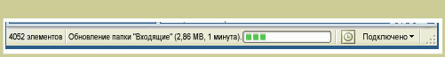

# StatusBarStatusBar
Объект <xref:System.Windows.Controls.Primitives.StatusBar> — это горизонтальная область в нижней части окна, где выводятся сведения о состоянии приложения.A <xref:System.Windows.Controls.Primitives.StatusBar> is a horizontal area at the bottom of a window where an application can display status information.  
  
 Ниже показан пример <xref:System.Windows.Controls.Primitives.StatusBar>.The following illustration shows an example of a <xref:System.Windows.Controls.Primitives.StatusBar>.  
  
   
  
## В этом разделеIn This Section  
  
## СсылкаReference  
 <xref:System.Windows.Controls.Primitives.StatusBar>  
  <xref:System.Windows.Controls.Primitives.StatusBarItem>  
  
## Связанные разделыRelated Sections
