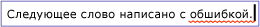
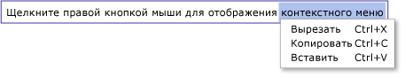

# Общие сведения о TextBox
Класс <xref:System.Windows.Controls.TextBox> позволяет отображать или отсеивать неформатированный текст. Общее использование <xref:System.Windows.Controls.TextBox> неформатного текста в форме. Например, форма с просьбой имя пользователя, номер телефона <xref:System.Windows.Controls.TextBox> и т.д. будет использовать элементы управления для ввода текста. Эта тема знакомит с классом <xref:System.Windows.Controls.TextBox> и приводит [!INCLUDE[TLA#tla_xaml](../../../../includes/tlasharptla-xaml-md.md)] примеры того, как использовать его как в, так и в C.  

## TextBox или RichTextBox?  
 Оба <xref:System.Windows.Controls.TextBox> <xref:System.Windows.Controls.RichTextBox> и позволяют пользователям ввода текста, но два элемента управления используются для различных сценариев. A <xref:System.Windows.Controls.TextBox> требует меньше системных <xref:System.Windows.Controls.RichTextBox> ресурсов, чем так, что он идеально подходит, когда только простой текст должен быть отредактирован (т.е. использование в форме). A <xref:System.Windows.Controls.RichTextBox> является лучшим выбором, когда пользователю необходимо отсеивать отформатированный текст, изображения, таблицы или другой поддерживаемый контент. Например, редактирование документа, статьи или блога, который требует форматирования, изображения и т.д. лучше всего выполняется с помощью <xref:System.Windows.Controls.RichTextBox>. В таблице ниже кратко излагаются основные особенности <xref:System.Windows.Controls.TextBox> и <xref:System.Windows.Controls.TextBox>.  
  
|Control|Проверка орфографии в режиме реального времени|Контекстное меню|Форматирование команд, <xref:System.Windows.Documents.EditingCommands.ToggleBold%2A> как (Ctr'B)|<xref:System.Windows.Documents.FlowDocument>содержание, как изображения, абзацы, таблицы и т.д.|  
|-------------|------------------------------|------------------|------------------------------------------------------------------------------------------------------------------------------------------------------------------------------------------------------|--------------------------------------------------------------------------------------------------------------------------------------------------------------------------------------------------|  
|<xref:System.Windows.Controls.TextBox>|Да|Да|нет|Нет.|  
|<xref:System.Windows.Controls.RichTextBox>|Да|Да|Да (см. раздел [Общие сведения о RichTextBox](richtextbox-overview.md))|Да (см. раздел [Общие сведения о RichTextBox](richtextbox-overview.md))|  
  
> [!NOTE]
> Хотя <xref:System.Windows.Controls.TextBox> не поддерживает форматирование связанных <xref:System.Windows.Documents.EditingCommands.ToggleBold%2A> команд редактирования, таких как (Ctr'B), <xref:System.Windows.Documents.EditingCommands.MoveToLineEnd%2A>многие основные команды поддерживаются обоими элементами управления, такими как . Подробнее см. в разделе <xref:System.Windows.Documents.EditingCommands>.  
  
 Функции, <xref:System.Windows.Controls.TextBox> поддерживаемые, описаны в разделах ниже. Для получения <xref:System.Windows.Controls.RichTextBox>дополнительной информации о , см [RichTextBox Обзор](richtextbox-overview.md).  
  
### Проверка орфографии в режиме реального времени  
 Вы можете включить проверку орфографии в режиме реального времени в <xref:System.Windows.Controls.TextBox> или <xref:System.Windows.Controls.RichTextBox>. При включенной проверке орфографии все слова с ошибками подчеркиваются красной линией (см. рисунок ниже).  
  
   
  
 Чтобы научиться включать проверку правописания, см. раздел [Включение проверки орфографии в элементе управления редактирования текста](how-to-enable-spell-checking-in-a-text-editing-control.md).  
  
### Контекстное меню  
 По умолчанию <xref:System.Windows.Controls.TextBox> <xref:System.Windows.Controls.RichTextBox> и у него есть контекстное меню, которое появляется, когда пользователь щелкает правыми внутри элемента управления. Контекстное меню дает пользователю возможность вырезания, копирования и вставки (см. рисунок ниже).  
  
   
  
 Можно создать собственное пользовательское контекстное меню, чтобы переопределить поведение по умолчанию. Дополнительные сведения см. в разделе [Использование пользовательского контекстного меню с элементом TextBox](how-to-use-a-custom-context-menu-with-a-textbox.md).  
  

## Создание элементов TextBox  
 A <xref:System.Windows.Controls.TextBox> может быть одной линией в высоту или состоять из нескольких линий. Одна строка <xref:System.Windows.Controls.TextBox> лучше всего подходит для ввода небольших количеств простого текста (т.е. "Имя", "Номер телефона" и т.д. в форме). Ниже приводится следующий пример, <xref:System.Windows.Controls.TextBox>как создать одну строку.  
  
 [!code-xaml[TextBoxMiscSnippets_snip#BasicTextBoxExampleWholePage](~/samples/snippets/csharp/VS_Snippets_Wpf/TextBoxMiscSnippets_snip/csharp/basictextboxexample.xaml#basictextboxexamplewholepage)]  
  
 Вы также можете <xref:System.Windows.Controls.TextBox> создать, что позволяет пользователю ввести несколько строк текста. Например, если в вашей форме запрашивался биографический эскиз пользователя, необходимо использовать <xref:System.Windows.Controls.TextBox> форму, поддерживающую несколько строк текста. В следующем примере [!INCLUDE[TLA#tla_xaml](../../../../includes/tlasharptla-xaml-md.md)] показано, <xref:System.Windows.Controls.TextBox> как использовать для определения элемента управления, который автоматически расширяется для размещения нескольких строк текста.  
  
 [!code-xaml[TextBox_MiscCode#_MultilineTextBoxXAML](~/samples/snippets/csharp/VS_Snippets_Wpf/TextBox_MiscCode/CSharp/Window1.xaml#_multilinetextboxxaml)]  
  
 Установка <xref:System.Windows.Controls.TextBox.TextWrapping%2A> атрибута `Wrap` на приводит к тому, что текст <xref:System.Windows.Controls.TextBox> обертывания к <xref:System.Windows.Controls.TextBox> новой строке, когда край элемента управления достигнут, автоматически расширяет элемент управления, чтобы включить пространство для новой строки, если это необходимо.  
  
 Установка <xref:System.Windows.Controls.Primitives.TextBoxBase.AcceptsReturn%2A> атрибута `true` для создания новой линии при нажатии клавиши RETURN, <xref:System.Windows.Controls.TextBox> еще раз автоматически расширяя, чтобы включить место для новой строки, если это необходимо.  
  
 Атрибут <xref:System.Windows.Controls.Primitives.TextBoxBase.VerticalScrollBarVisibility%2A> добавляет бар прокрутки к <xref:System.Windows.Controls.TextBox>, <xref:System.Windows.Controls.TextBox> так что содержимое <xref:System.Windows.Controls.TextBox> можно прокрутить, если расширяется за пределы размера кадра или окна, которое прикончит его.  
  
 Для получения дополнительной информации о <xref:System.Windows.Controls.TextBox>различных задачах, связанных с использованием, см. [How-to Topics](textbox-how-to-topics.md)  
  

## Определение изменения содержимого  
 Обычно <xref:System.Windows.Controls.Primitives.TextBoxBase.TextChanged> событие должно использоваться для обнаружения, <xref:System.Windows.Controls.TextBox> когда <xref:System.Windows.Controls.RichTextBox> текст в <xref:System.Windows.UIElement.KeyDown> или изменения, а затем, как вы могли бы ожидать. Пример см. в разделе [Определение изменения текста в TextBox](how-to-detect-when-text-in-a-textbox-has-changed.md).  
  
## См. также раздел

- [Как-к темам](textbox-how-to-topics.md)
- [Общие сведения о RichTextBox](richtextbox-overview.md)
