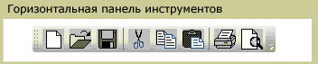
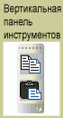

# ToolBarToolBar
<xref:System.Windows.Controls.ToolBar> Управления является контейнером для группы команд или элементов управления, которые обычно связаны по функциональности.The <xref:System.Windows.Controls.ToolBar> control is a container for a group of commands or controls that are typically related in their function.  
  
 На следующих рисунках горизонтальные и вертикальные <xref:System.Windows.Controls.ToolBar> элементов управления.The following illustrations show horizontal and vertical <xref:System.Windows.Controls.ToolBar> controls.  
  
   
Горизонтальная панель инструментовHorizontal Toolbar  
  
   
Вертикальная панель инструментовVertical Toolbar  
  
## В этом разделеIn This Section  
 [Общие сведения о панели инструментовToolBar Overview](../../../../docs/framework/wpf/controls/toolbar-overview.md)  
  [Определение стиля элементов управления на панели инструментовStyle Controls on a ToolBar](../../../../docs/framework/wpf/controls/how-to-style-controls-on-a-toolbar.md)  
  
## СсылкаReference  
 <xref:System.Windows.Controls.ToolBar>  
  <xref:System.Windows.Controls.ToolBarTray>  
  
## Связанные разделыRelated Sections
