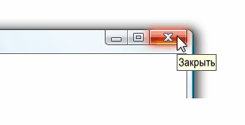

# ToolTipToolTip
Подсказка — это небольшое всплывающее окно, которое отображается, когда пользователь задерживает указатель мыши над элементом, например, на <xref:System.Windows.Controls.Button>.A tooltip is a small pop-up window that appears when a user pauses the mouse pointer over an element, such as over a <xref:System.Windows.Controls.Button>.  
  
 На следующем рисунке показан указатель мыши на **закрыть**<xref:System.Windows.Controls.Button>, который затем отображает ее определение <xref:System.Windows.Controls.ToolTip>.The following illustration shows a mouse pointer that points to the **Close**<xref:System.Windows.Controls.Button>, which then displays its identifying <xref:System.Windows.Controls.ToolTip>.  
  
 Кнопка "Закрыть" с всплывающей подсказкойClose button with its tooltip displayed  
  
   
  
## В этом разделеIn This Section  
 [Общие сведения о всплывающих подсказкахToolTip Overview](tooltip-overview.md)  
  [Практические руководстваHow-to Topics](tooltip-how-to-topics.md)  
  
## СсылкаReference  
 <xref:System.Windows.Controls.ToolTip>  
  <xref:System.Windows.Controls.ToolTipService>  
  <xref:System.Windows.Controls.Primitives.Popup>  
  
## Связанные разделыRelated Sections  
 [Общие сведения о контекстном менюPopup Overview](popup-overview.md)  
  [Практические руководстваHow-to Topics](popup-how-to-topics.md)
