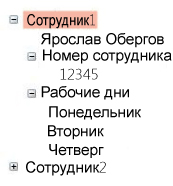

# TreeView
<xref:System.Windows.Controls.TreeView> Элемент управления отображает сведения в виде иерархической структуры с использованием свертываемых узлов.  
  
 Ниже приведен пример <xref:System.Windows.Controls.TreeView> управления, который имеет вложенные <xref:System.Windows.Controls.TreeViewItem> элементов управления.  
  
   
  
## В этом разделе  
 [Обзор элемента управления TreeView](../../../../docs/framework/wpf/controls/treeview-overview.md)  
 [Разделы практического руководства](../../../../docs/framework/wpf/controls/treeview-how-to-topics.md)  
  
## Ссылка  
 <xref:System.Windows.Controls.TreeView>  
  <xref:System.Windows.Controls.TreeViewItem>  
  
## Связанные разделы  
 [Общие сведения о привязке данных](../../../../docs/framework/wpf/data/data-binding-overview.md)  
  [Общие сведения о шаблонах данных](../../../../docs/framework/wpf/data/data-templating-overview.md)
