# Пошаговое руководство. Создание кнопки с помощью Microsoft Expression BlendWalkthrough: Create a Button by Using Microsoft Expression Blend

В этом пошаговом руководстве описывается процесс создания настраиваемой кнопки WPF с помощью Microsoft Expression Blend.This walkthrough steps you through the process of creating a WPF customized button using Microsoft Expression Blend.

> [!IMPORTANT]
> Microsoft Expression Blend работает путем создания [!INCLUDE[TLA#tla_xaml](../../../../includes/tlasharptla-xaml-md.md)], который затем компилируется для создания исполняемой программы.Microsoft Expression Blend works by generating [!INCLUDE[TLA#tla_xaml](../../../../includes/tlasharptla-xaml-md.md)] that is then compiled to make the executable program. Если вы предпочитаете работать непосредственно с XAML, то есть еще одно пошаговое руководство, которое создает то же приложение с помощью XAML в Visual Studio, а не Blend.If you would rather work with XAML directly, there is another walkthrough that creates the same application as this one using XAML with Visual Studio rather than Blend. Дополнительные сведения см. в разделе [Создание кнопки с помощью XAML](walkthrough-create-a-button-by-using-xaml.md) .See [Create a Button by Using XAML](walkthrough-create-a-button-by-using-xaml.md) for more information.

На следующем рисунке показана настраиваемая кнопка, которую вы создадите.The following illustration shows the customized button that you will create.

## Преобразование фигуры в кнопкуConvert a Shape to a Button

В первой части этого пошагового руководства вы создадите пользовательский вид пользовательской кнопки.In the first part of this walkthrough you create the custom look of the custom button. Для этого сначала преобразуйте прямоугольник в кнопку.To do this, you first convert a rectangle to a button. Затем добавьте дополнительные фигуры в шаблон кнопки, чтобы создать более сложную кнопку поиска.You then add additional shapes to the template of the button, creating a more complex looking button. Почему не стоит начинать с обычной кнопки и настраивать ее?Why not start with a regular button and customize it? Так как кнопка имеет встроенные функции, которые не нужны; для пользовательских кнопок проще начать с прямоугольника.Because a button has built-in functionality that you do not need; for custom buttons, it is easier to start with a rectangle.

### Создание нового проекта в Expression BlendTo create a new project in Expression Blend

1. Начало выражения Blend.Start Expression Blend. (Нажмите кнопку **Пуск**, наведите указатель на пункт **все программы**, затем на пункт **Microsoft Expression**и выберите пункт **Microsoft Expression Blend**.)(Click **Start**, point to **All Programs**, point to **Microsoft Expression**, and then click **Microsoft Expression Blend**.)

2. При необходимости разверните приложение.Maximize the application if needed.

3. В меню **Файл** выберите пункт **Создать проект**.On the **File** menu, click **New Project**.

4. Выберите **стандартное приложение (. exe)** .Select **Standard Application (.exe)**.

5. Присвойте проекту имя `CustomButton` и нажмите кнопку **ОК**.Name the project `CustomButton` and press **OK**.

На этом этапе у вас есть пустой проект WPF.At this point you have a blank WPF project. Можно нажать клавишу F5, чтобы запустить приложение.You can press F5 to run the application. Как вы можете ожидать, приложение состоит только из пустого окна.As you might expect, the application consists of only a blank window. Затем создайте скругленный прямоугольник и преобразуйте его в кнопку.Next, you create a rounded rectangle and convert it into a button.

### Преобразование прямоугольника в кнопкуTo convert a Rectangle to a Button

1. **Задайте для свойства фон окна значение черный:** Выберите окно, перейдите на **вкладку Свойства**и задайте для свойства <xref:System.Windows.Controls.Control.Background%2A> значение `Black`.**Set the Window Background property to black:** Select the Window, click the **Properties Tab**, and set the <xref:System.Windows.Controls.Control.Background%2A> property to `Black`.

    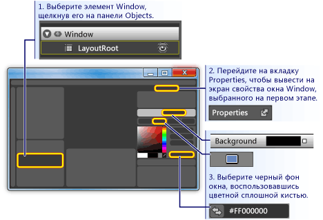

2. **Нарисуйте прямоугольник приблизительно в размере кнопки в окне:** Выберите инструмент прямоугольник на панели инструментов слева и перетащите прямоугольник на окно.**Draw a rectangle approximately the size of a button on the Window:** Select the rectangle tool on the left-hand tool panel and drag the rectangle onto the Window.

    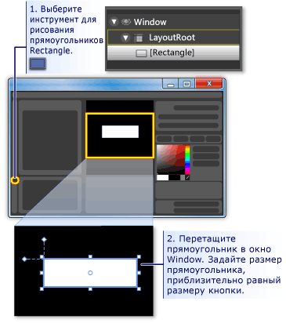

3. **Округлить углы прямоугольника:** Либо перетащите контрольные точки прямоугольника или напрямую задайте свойства <xref:System.Windows.Shapes.Rectangle.RadiusX%2A> и <xref:System.Windows.Shapes.Rectangle.RadiusY%2A>.**Round out the corners of the rectangle:** Either drag the control points of the rectangle or directly set the <xref:System.Windows.Shapes.Rectangle.RadiusX%2A> and <xref:System.Windows.Shapes.Rectangle.RadiusY%2A> properties. Задайте значения <xref:System.Windows.Shapes.Rectangle.RadiusX%2A> и <xref:System.Windows.Shapes.Rectangle.RadiusY%2A> равными 20.Set the values of <xref:System.Windows.Shapes.Rectangle.RadiusX%2A> and <xref:System.Windows.Shapes.Rectangle.RadiusY%2A> to 20.

    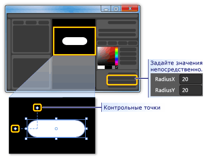

4. **Замените прямоугольник на кнопку:** Выберите прямоугольник.**Change the rectangle into a button:** Select the rectangle. В меню **Сервис** щелкните **создать**кнопку.On the **Tools** menu, click **Make Button**.

    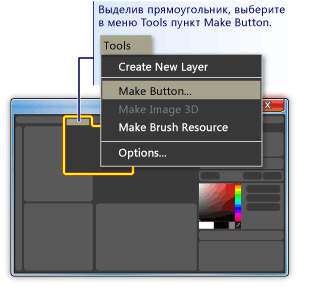

5. **Укажите область стиля или шаблона:** Появится диалоговое окно, как показано ниже.**Specify the scope of the style/template:** A dialog box like the following appears.

    

    Для параметра **имя ресурса (ключ)** выберите **Применить ко всем**.For **Resource name (Key)**, select **Apply to all**.  При этом итоговый стиль и шаблон кнопки будут применяться ко всем объектам, которые являются кнопками.This will make the resulting style and button template apply to all objects that are buttons. Для **определения в**выберите **приложение**.For **Define in**, select **Application**. При этом итоговый стиль и шаблон кнопки будут иметь область действия для всего приложения.This will make the resulting style and button template have scope over the entire application. Если задать значения в этих двух полях, стиль и шаблон кнопки будут применяться ко всем кнопкам во всем приложении, а любая кнопка, созданная в приложении, будет использовать этот шаблон по умолчанию.When you set the values in these two boxes, the button style and template apply to all buttons within the entire application and any button you create in the application will, by default, use this template.

## Изменение шаблона кнопкиEdit the Button Template

Теперь у вас есть прямоугольник, который был изменен на кнопку.You now have a rectangle that has been changed to a button. В этом разделе вы измените шаблон кнопки и сможете настроить его внешний вид.In this section, you'll modify the template of the button and further customize how it looks.

### Изменение шаблона кнопки для изменения внешнего вида кнопкиTo edit the button template to change the button appearance

1. **Перейти в представление "изменение шаблона":** Для дальнейшей настройки вида кнопки необходимо изменить шаблон кнопки.**Go into edit template view:** To further customize the look of our button, we need to edit the button template. Этот шаблон был создан при преобразовании прямоугольника в кнопку.This template was created when we converted the rectangle into a button. Чтобы изменить шаблон кнопки, щелкните правой кнопкой мыши кнопку и выберите **изменить элементы управления (шаблон)** , а затем **измените шаблон**.To edit the button template, right-click the button and select **Edit Control Parts (Template)** and then **Edit Template**.

    

    Обратите внимание, что в редакторе шаблонов кнопка теперь разделена на <xref:System.Windows.Shapes.Rectangle> и <xref:System.Windows.Controls.ContentPresenter>.In the template editor, notice that the button is now separated into a <xref:System.Windows.Shapes.Rectangle> and the <xref:System.Windows.Controls.ContentPresenter>. <xref:System.Windows.Controls.ContentPresenter> используется для представления содержимого на кнопке (например, строка "Button").The <xref:System.Windows.Controls.ContentPresenter> is used to present content within the button (for example, the string "Button"). Прямоугольник и <xref:System.Windows.Controls.ContentPresenter> размещаются внутри <xref:System.Windows.Controls.Grid>.Both the rectangle and <xref:System.Windows.Controls.ContentPresenter> are laid out inside of a <xref:System.Windows.Controls.Grid>.

    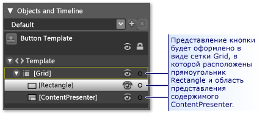

2. **Измените имена компонентов шаблона:** Щелкните правой кнопкой мыши прямоугольник в описи шаблона, измените имя <xref:System.Windows.Shapes.Rectangle> с "[Rectangle]" на "Аутерректангле" и замените "[ContentPresenter]" на "Миконтентпресентер".**Change the names of the template components:** Right-click the rectangle in the template inventory, change the <xref:System.Windows.Shapes.Rectangle> name from "[Rectangle]" to "outerRectangle", and change "[ContentPresenter]" to "myContentPresenter".

    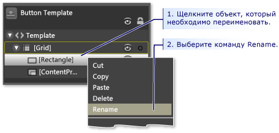

3. **Измените прямоугольник таким образом, чтобы он был пустым внутри (например, кольцо):** Выберите **аутерректангле** и задайте для <xref:System.Windows.Shapes.Shape.Fill%2A> значение "прозрачный", а <xref:System.Windows.Shapes.Shape.StrokeThickness%2A> — 5.**Alter the rectangle so that it is empty inside (like a donut):** Select **outerRectangle** and set <xref:System.Windows.Shapes.Shape.Fill%2A> to "Transparent" and <xref:System.Windows.Shapes.Shape.StrokeThickness%2A> to 5.

    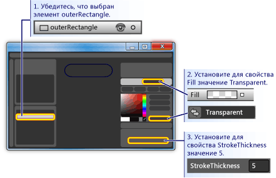

    Затем задайте для <xref:System.Windows.Shapes.Shape.Stroke%2A> цвет, который будет использоваться в шаблоне.Then set the <xref:System.Windows.Shapes.Shape.Stroke%2A> to the color of whatever the template will be. Для этого щелкните маленький белый прямоугольник рядом с **обводкой**, выберите **кустомекспрессион**и в диалоговом окне введите "{TemplateBinding фона}".To do this, click the small white box next to **Stroke**, select **CustomExpression**, and type "{TemplateBinding Background}" in the dialog box.

    

4. **Создайте внутренний прямоугольник:** Теперь создайте другой прямоугольник (назовите его "Иннерректангле") и разместите его симметрично внутри **аутерректангле** .**Create an inner rectangle:** Now, create another rectangle (name it "innerRectangle") and position it symmetrically on the inside of **outerRectangle** . Для такого рода работы вам, вероятно, потребуется увеличить масштаб, чтобы кнопка стала больше в области редактирования.For this kind of work, you will probably want to zoom to make the button larger in the editing area.

    > [!NOTE]
    > Прямоугольник может выглядеть иначе, чем на рисунке (например, у него могут быть скругленные углы).Your rectangle might look different than the one in the figure (for example, it might have rounded corners).

    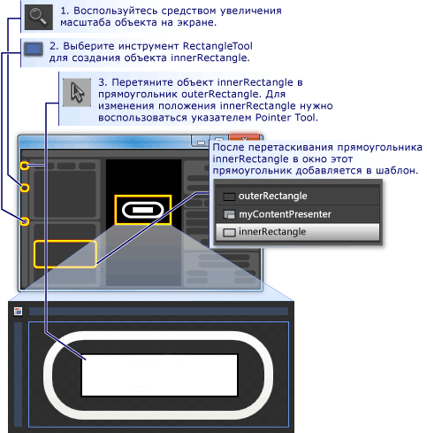

5. **Переместить ContentPresenter в начало:** На этом этапе текст "Кнопка" может не отображаться.**Move ContentPresenter to the top:** At this point, it is possible that the text "Button" will not be visible any longer. Если это так, это связано с тем, что **иннерректангле** находится поверх **миконтентпресентер**.If this is so, this is because **innerRectangle** is on top of the **myContentPresenter**. Чтобы устранить эту проблему, перетащите **миконтентпресентер** под **иннерректангле**.To fix this, drag **myContentPresenter** below **innerRectangle**. Переместите прямоугольники и **миконтентпресентер** , как показано ниже.Reposition rectangles and **myContentPresenter** to look similar to below.

    > [!NOTE]
    > Кроме того, можно также разместить **миконтентпресентер** в верхней части окна, щелкнув его правой кнопкой мыши и выбрав команду **отправить вперед**.Alternatively, you can also position **myContentPresenter** on top by right-clicking it and pressing **Send Forward**.

    

6. **Измените вид иннерректангле:** Задайте значения <xref:System.Windows.Shapes.Rectangle.RadiusX%2A>, <xref:System.Windows.Shapes.Rectangle.RadiusY%2A>и <xref:System.Windows.Shapes.Shape.StrokeThickness%2A> равными 20.**Change the look of innerRectangle:** Set the <xref:System.Windows.Shapes.Rectangle.RadiusX%2A>, <xref:System.Windows.Shapes.Rectangle.RadiusY%2A>, and <xref:System.Windows.Shapes.Shape.StrokeThickness%2A> values to 20. Кроме того, задайте для <xref:System.Windows.Shapes.Shape.Fill%2A> фон шаблона, используя пользовательское выражение "{TemplateBinding фона}") и задайте для <xref:System.Windows.Shapes.Shape.Stroke%2A> значение "Transparent".In addition, set the <xref:System.Windows.Shapes.Shape.Fill%2A> to the background of the template using the custom expression "{TemplateBinding Background}" ) and set <xref:System.Windows.Shapes.Shape.Stroke%2A> to "transparent". Обратите внимание, что параметры для <xref:System.Windows.Shapes.Shape.Fill%2A> и <xref:System.Windows.Shapes.Shape.Stroke%2A> **иннерректангле** являются противоположными для **аутерректангле**.Notice that the settings for the <xref:System.Windows.Shapes.Shape.Fill%2A> and <xref:System.Windows.Shapes.Shape.Stroke%2A> of **innerRectangle** are the opposite of those for **outerRectangle**.

    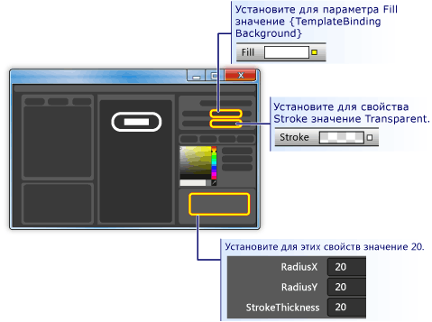

7. **Добавить слой с эффектом стекла поверх:** Заключительная часть настройки внешнего вида кнопки заключается в том, чтобы добавить прозрачный слой поверх остальных.**Add a glass layer on top:** The final piece of customizing the look of the button is to add a glass layer on top. Этот прозрачный слой состоит из третьего прямоугольника.This glass layer consists of a third rectangle. Так как прозрачный блок охватывает всю кнопку, прозрачный прямоугольник аналогичен в измерениях для **аутерректангле**.Because the glass will cover the entire button, the glass rectangle is similar in dimensions to the **outerRectangle**. Поэтому создайте прямоугольник, просто создав копию **аутерректангле**.Therefore, create the rectangle by simply making a copy of the **outerRectangle**. Выделите **аутерректангле** и используйте сочетание клавиш CTRL + C и CTRL + V для создания копии.Highlight **outerRectangle** and use CTRL+C and CTRL+V to make a copy. Назовите этот новый прямоугольник "Гласскубе".Name this new rectangle "glassCube".

8. **При необходимости изменить расположение гласскубе:** Если **гласскубе** еще не размещается, так что он охватывает всю кнопку, перетащите его в нужное расположение.**Reposition glassCube if necessary:** If **glassCube** is not already positioned so that it covers the entire button, drag it into position.

9. **Присвойте гласскубе немного другой форме, чем аутерректангле:** Измените свойства **гласскубе**.**Give glassCube a slightly different shape than outerRectangle:** Change the properties of **glassCube**. Начните с изменения <xref:System.Windows.Shapes.Rectangle.RadiusX%2A> и <xref:System.Windows.Shapes.Rectangle.RadiusY%2A> свойств на 10, а <xref:System.Windows.Shapes.Shape.StrokeThickness%2A> — на 2.Start off by changing the <xref:System.Windows.Shapes.Rectangle.RadiusX%2A> and <xref:System.Windows.Shapes.Rectangle.RadiusY%2A> properties to 10 and the <xref:System.Windows.Shapes.Shape.StrokeThickness%2A> to 2.

    

10. **Сделать гласскубе похожим на стекло:** Задайте для <xref:System.Windows.Shapes.Shape.Fill%2A> внешний вид с помощью линейного градиента, который равен 75% непрозрачен, и между белым цветом и прозрачностью более 6 приблизительно с равными промежутками времени.**Make glassCube look like glass:** Set the <xref:System.Windows.Shapes.Shape.Fill%2A> to a glassy look by  using a linear gradient that is 75% opaque and alternates between the color White and Transparent over 6 approximately evenly spaced intervals. Вот что нужно сделать для ограничителей градиента:This is what to set the gradient stops to:

    - Точка градиента 1: белый с альфа-значением 75%Gradient Stop 1: White with Alpha value of 75%

    - Градиентная точка 2: прозрачнаяGradient Stop 2: Transparent

    - Позиция градиента 3: белый с альфа-значением 75%Gradient Stop 3: White with Alpha value of 75%

    - Градиентная точка 4: прозрачнаяGradient Stop 4: Transparent

    - Градиентная позиция 5: белый с альфа-значением 75%Gradient Stop 5: White with Alpha value of 75%

    - Ограничитель градиента 6: прозрачныйGradient Stop 6: Transparent

    При этом создается «волнистое» стекло.This creates a "wavy" glass look.

    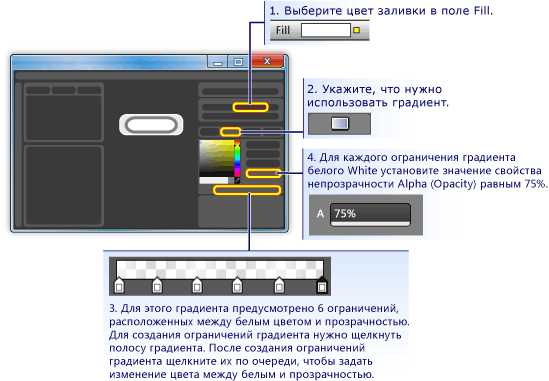

11. **Скрыть слой стекла:** Теперь, когда вы видите, как выглядит прозрачный слой, перейдите на **панель внешний вид** **панели свойства** и установите для параметра Opacity (прозрачность) значение 0%, чтобы скрыть его.**Hide the glass layer:** Now that you see what the glassy layer looks like, go into the **Appearance pane** of the **Properties panel** and set the Opacity to 0% to hide it. В разделах дальше мы будем использовать триггеры и события свойств для отображения и управления уровнем стекла.In the sections ahead, we'll use property triggers and events to show and manipulate the glass layer.

    

## Настройка поведения кнопкиCustomize the Button Behavior

На этом этапе вы настроили представление кнопки, отредактировав его шаблон, но кнопка не реагирует на действия пользователя, как обычные кнопки (например, изменение внешнего вида при переходе по щелчку мыши, получение фокуса и нажатие кнопки). В следующих двух процедурах показано, как построить подобные поведения в пользовательской кнопке.At this point, you have customized the presentation of the button by editing its template, but the button does not react to user actions as typical buttons do (for example, changing appearance upon mouse-over, receiving focus, and clicking.) The next two procedures show how to build behaviors like these into the custom button. Начнем с простых триггеров свойств, а затем добавим триггеры событий и анимации.We'll start with simple property triggers, and then add event triggers and animations.

### Установка триггеров свойствTo set property triggers

1. **Создать новый триггер свойства:** Выбрав **гласскубе** , щелкните **+ Property (+ свойство** ) на панели **триггеров** (см. рисунок, следующий за следующим шагом).**Create a new property trigger:** With **glassCube** selected, click **+ Property** in the **Triggers** panel (see the figure that follows the next step). При этом создается триггер свойства с триггером свойства по умолчанию.This creates a property trigger with a default property trigger.

2. **Сделайте свойство, используемое триггером:** Измените свойство на <xref:System.Windows.UIElement.IsMouseOver%2A>.**Make IsMouseOver the property used by the trigger:** Change the property to <xref:System.Windows.UIElement.IsMouseOver%2A>. Это приводит к активации триггера свойства, когда свойство <xref:System.Windows.UIElement.IsMouseOver%2A> `true` (когда пользователь наводит указатель мыши на кнопку).This makes the property trigger activate when the <xref:System.Windows.UIElement.IsMouseOver%2A> property is `true` (when the user points to the button with the mouse).

    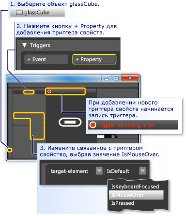

3. Параметр **onmouseover активирует непрозрачность 100% для гласскубе:** Обратите внимание, что **запись триггера включена** (см. предыдущий рисунок).**IsMouseOver triggers opacity of 100% for glassCube:** Notice that the **Trigger recording is on** (see the preceding figure). Это означает, что любые изменения, вносимые в значения свойств **гласскубе** при записи, будут иметь действие, которое выполняется, когда <xref:System.Windows.UIElement.IsMouseOver%2A> `true`.This means that any changes you make to the property values of **glassCube** while recording is on will become an action that takes place when <xref:System.Windows.UIElement.IsMouseOver%2A> is `true`. Во время записи измените <xref:System.Windows.UIElement.Opacity%2A> **гласскубе** на 100%.While recording, change the <xref:System.Windows.UIElement.Opacity%2A> of **glassCube** to 100%.

    

    Теперь вы создали первый триггер свойства.You have now created your first property trigger. Обратите внимание, что **панель триггеров** редактора записала <xref:System.Windows.UIElement.Opacity%2A> изменяется на 100%.Notice that the **Triggers panel** of the editor has recorded the <xref:System.Windows.UIElement.Opacity%2A> being changed to 100%.

    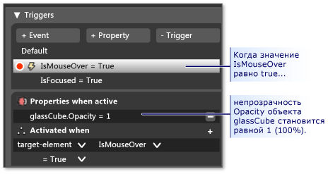

    Нажмите клавишу F5, чтобы запустить приложение, и наведите указатель мыши на кнопку.Press F5 to run the application, and move the mouse pointer over and off the button. Вы увидите, что слой стекла появляется при наведении указателя мыши на кнопку и исчезает при появлении указателя.You should see the glass layer appear when you mouse-over the button and disappear when the pointer leaves.

4. **Параметр onmouseover инициирует изменение значения Stroke:** Давайте свяжите некоторые другие действия с триггером <xref:System.Windows.UIElement.IsMouseOver%2A>.**IsMouseOver triggers stroke value change:** Let's associate some other actions with the <xref:System.Windows.UIElement.IsMouseOver%2A> trigger. Пока запись продолжится, переключите выбранный вариант с **гласскубе** на **аутерректангле**.While recording continues, switch your selection from **glassCube** to **outerRectangle**. Затем задайте <xref:System.Windows.Shapes.Shape.Stroke%2A> **аутерректангле** в пользовательском выражении {DynamicResource {x:Static SystemColors. хигхлигхтбрушкэй}}.Then set the <xref:System.Windows.Shapes.Shape.Stroke%2A> of **outerRectangle** to the custom expression of "{DynamicResource {x:Static SystemColors.HighlightBrushKey}}". Это устанавливает <xref:System.Windows.Shapes.Shape.Stroke%2A> на типичный цвет выделения, используемый кнопками.This sets the <xref:System.Windows.Shapes.Shape.Stroke%2A> to the typical highlight color used by buttons. Нажмите клавишу F5, чтобы увидеть результат при наведении указателя мыши на кнопку.Press F5 to see the effect when you mouse over the button.

    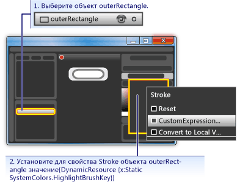

5. **Onmouseover запускает Размытый текст:** Давайте соберем еще одно действие с триггером свойства <xref:System.Windows.UIElement.IsMouseOver%2A>.**IsMouseOver triggers blurry text:** Let's associate one more action to the <xref:System.Windows.UIElement.IsMouseOver%2A> property trigger. Сделать содержимое кнопки нечетким при появлении стекла над ним.Make the content of the button appear a little blurry when the glass appears over it. Для этого можно применить <xref:System.Windows.Media.Effects.BitmapEffect> размытия к <xref:System.Windows.Controls.ContentPresenter> (**миконтентпресентер**).To do this, we can apply a blur <xref:System.Windows.Media.Effects.BitmapEffect> to the <xref:System.Windows.Controls.ContentPresenter> (**myContentPresenter**).

    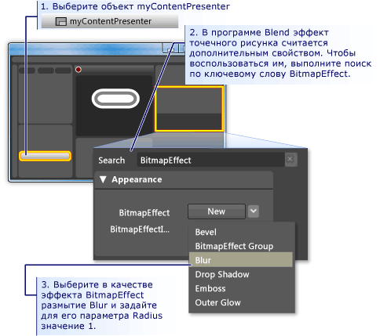

    > [!NOTE]
    > Чтобы вернуть **панель «Свойства»** к той, которая была перед поиском <xref:System.Windows.Media.Effects.BitmapEffect>, очистите текст из **поля поиска**.To return the **Properties panel** back to what it was before you did the search for <xref:System.Windows.Media.Effects.BitmapEffect>, clear the text from the **Search box**.

    На этом этапе мы использовали триггер свойства с несколькими связанными действиями для создания поведения выделения, когда указатель мыши попадает в область кнопки и выходит из нее.At this point, we have used a property trigger with several associated actions to create highlighting behavior for when the mouse pointer enters and leaves the button area. Другим типичным поведением кнопки является выделение при наличии фокуса (как после щелчка мышью).Another typical behavior for a button is to highlight when it has focus (as after it is clicked). Это поведение можно добавить, добавив еще один триггер свойства для свойства <xref:System.Windows.UIElement.IsFocused%2A>.We can add such behavior by adding another property trigger for the <xref:System.Windows.UIElement.IsFocused%2A> property.

6. **Создать триггер свойства для Focus:** Используя ту же процедуру, что и для <xref:System.Windows.UIElement.IsMouseOver%2A> (см. первый шаг этого раздела), создайте еще один триггер свойства для свойства <xref:System.Windows.UIElement.IsFocused%2A>.**Create property trigger for IsFocused:** Using the same procedure as for <xref:System.Windows.UIElement.IsMouseOver%2A> (see the first step of this section), create another property trigger for the <xref:System.Windows.UIElement.IsFocused%2A> property. Пока **запись триггера включена**, добавьте в триггер следующие действия:While **Trigger recording is on**, add the following actions to the trigger:

    - **гласскубе** получает <xref:System.Windows.UIElement.Opacity%2A> 100%.**glassCube** gets an <xref:System.Windows.UIElement.Opacity%2A> of 100%.

    - **аутерректангле** получает <xref:System.Windows.Shapes.Shape.Stroke%2A> значение настраиваемого выражения "{DynamicResource {x:Static SystemColors. хигхлигхтбрушкэй}}".**outerRectangle** gets a <xref:System.Windows.Shapes.Shape.Stroke%2A> custom expression value of "{DynamicResource {x:Static SystemColors.HighlightBrushKey}}".

В качестве последнего шага в этом пошаговом руководстве мы добавим анимацию к кнопке.As the final step in this walkthrough, we will add animations to the button. Эти анимации будут вызываться событиями, а именно событиями <xref:System.Windows.UIElement.MouseEnter> и <xref:System.Windows.Controls.Primitives.ButtonBase.Click>.These animations will be triggered by events—specifically, the <xref:System.Windows.UIElement.MouseEnter> and <xref:System.Windows.Controls.Primitives.ButtonBase.Click> events.

### Использование триггеров событий и анимации для добавления интерактивностиTo use event triggers and animations to add interactivity

1. **Создайте триггер события MouseEnter:** Добавьте новый триггер события и выберите <xref:System.Windows.UIElement.MouseEnter> в качестве события, которое будет использоваться в триггере.**Create a MouseEnter Event Trigger:** Add a new event trigger and select <xref:System.Windows.UIElement.MouseEnter> as the event to use in the trigger.

     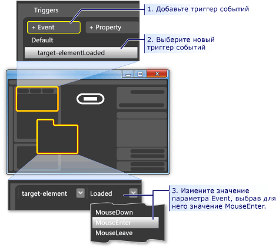

2. **Создать шкалу анимации:** Затем свяжите временную шкалу анимации с событием <xref:System.Windows.UIElement.MouseEnter>.**Create an animation timeline:** Next, associate an animation timeline to the <xref:System.Windows.UIElement.MouseEnter> event.

    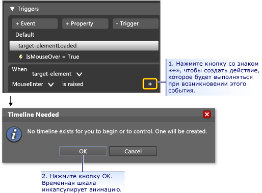

    После нажатия кнопки " **ОК** " для создания новой временной шкалы появляется **Панель временной шкалы** , а "запись временной шкалы" отображается на панели конструктора.After you press **OK** to create a new timeline, a **Timeline Panel** appears and "Timeline recording is on" is visible in the design panel. Это означает, что мы можем начать запись изменений свойств на временной шкале (изменения свойств анимации).This means we can start recording property changes in the timeline (animate property changes).

    > [!NOTE]
    > Возможно, потребуется изменить размер окна и (или) панелей, чтобы увидеть отображение.You may need to resize your window and/or panels to see the display.

    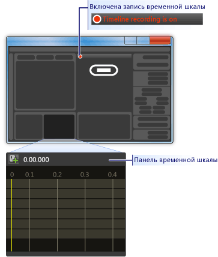

3. **Создайте опорный кадр:** Чтобы создать анимацию, выберите объект, который требуется анимировать, создайте на временной шкале два или более опорных кадра, а для этих опорных кадров задайте значения свойств, между которыми должна быть создана анимация анимации.**Create a keyframe:** To create an animation, select the object you want to animate, create two or more keyframes on the timeline, and for those keyframes, set the property values you want the animation to interpolate between. На следующем рисунке описывается создание опорного кадра.The following figure guides you through the creation of a keyframe.

    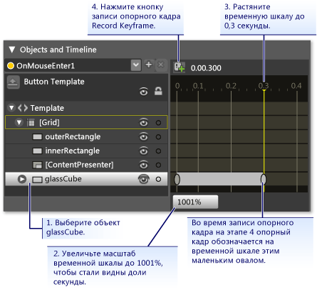

4. **Сжать гласскубе в этом опорном кадре:** Выбрав второй ключевой кадр, уменьшите размер **гласскубе** до 90% от его полного размера с помощью **преобразования размера**.**Shrink glassCube at this keyframe:** With the second keyframe selected, shrink the size of the **glassCube** to 90% of its full size using the **Size Transform**.

    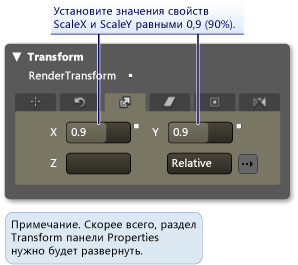

    Нажмите клавишу F5, чтобы запустить приложение.Press F5 to run the application. Наведите указатель мыши на кнопку.Move the mouse pointer over the button. Обратите внимание, что прозрачный слой сжимается поверх кнопки.Notice that the glass layer shrinks on top of the button.

5. **Создайте другой триггер события и свяжите с ним другую анимацию:** Давайте добавим еще одну анимацию.**Create another Event Trigger and associate a different animation with it:** Let's add one more animation. Используйте аналогичную процедуру, которая использовалась для создания предыдущей анимации триггера событий.Use a similar procedure to what you used to create the previous event trigger animation:

    1. Создайте новый триггер события с помощью события <xref:System.Windows.Controls.Primitives.ButtonBase.Click>.Create a new event trigger using the <xref:System.Windows.Controls.Primitives.ButtonBase.Click> event.

    2. Свяжите новую временную шкалу с событием <xref:System.Windows.Controls.Primitives.ButtonBase.Click>.Associate a new timeline with the <xref:System.Windows.Controls.Primitives.ButtonBase.Click> event.

        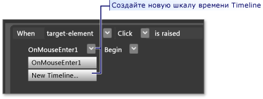

    3. Для этой временной шкалы создайте два опорных кадра, один из которых составляет 0,0 секунд, а второй — 0,3 секунд.For this timeline, create two keyframes, one at 0.0 seconds and the second one at 0.3 seconds.

    4. Выделив опорный кадр в 0,3 секунд, установите для параметра **угол поворота** значение 360 градусов.With the keyframe at 0.3 seconds highlighted, set the **Rotate Transform Angle** to 360 degrees.

        

    5. Нажмите клавишу F5, чтобы запустить приложение.Press F5 to run the application. Нажмите кнопку.Click the button. Обратите внимание, что прозрачный слой вращается вокруг.Notice that the glass layer spins around.

## ЗаключениеConclusion

Вы завершили настраиваемую кнопку.You have completed a customized button. Вы сделали это с помощью шаблона кнопки, который был применен ко всем кнопкам в приложении.You did this using a button template that was applied to all buttons in the application. Если выйти из режима редактирования шаблона (см. рисунок ниже) и создать дополнительные кнопки, вы увидите, что они выглядят и ведут себя как пользовательская кнопка, а не как кнопка по умолчанию.If you leave the template editing mode (see the following figure) and create more buttons, you will see that they look and behave like your custom button rather than like the default button.

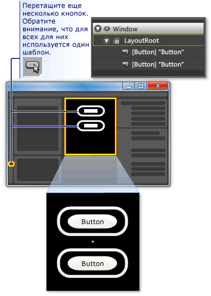

Нажмите клавишу F5, чтобы запустить приложение.Press F5 to run the application. Нажмите кнопки и обратите внимание на то, как все они ведут себя одинаково.Click the buttons and notice how they all behave the same.

Помните, что во время настройки шаблона вы задаете свойство <xref:System.Windows.Shapes.Shape.Fill%2A> **иннерректангле** , а <xref:System.Windows.Shapes.Shape.Stroke%2A> свойство **аутерректангле** — фон шаблона ({TemplateBinding Background}).Remember that while you were customizing the template, you set the <xref:System.Windows.Shapes.Shape.Fill%2A> property of **innerRectangle** and the <xref:System.Windows.Shapes.Shape.Stroke%2A> property **outerRectangle** to the template background ({TemplateBinding Background}). Поэтому при задании цвета фона для отдельных кнопок заданный фон будет использоваться для соответствующих свойств.Because of this, when you set the background color of the individual buttons, the background you set will be used for those respective properties. Попробуйте изменить фон сейчас.Try changing the backgrounds now. На следующем рисунке используются различные градиенты.In the following figure, different gradients are used. Таким образом, хотя шаблон полезен для общей настройки элементов управления, таких как Button, элементы управления с шаблонами можно изменять, чтобы они отличались друг от друга.Therefore, although a template is useful for overall customization of controls like button, controls with templates can still be modified to look different from each other.

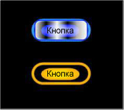

В заключение, в процессе настройки шаблона кнопки вы узнали, как выполнять следующие действия в Microsoft Expression Blend:In conclusion, in the process of customizing a button template you have learned how to do the following in Microsoft Expression Blend:

- Настройка вида элемента управления.Customize the look of a control.

- Задание триггеров свойств.Set property triggers. Триггеры свойств очень полезны, так как их можно использовать для большинства объектов, а не только для элементов управления.Property triggers are very useful because they can be used on most objects, not just controls.

- Задайте триггеры событий.Set event triggers. Триггеры событий очень полезны, так как их можно использовать для большинства объектов, а не только для элементов управления.Event triggers are very useful because they can be used on most objects, not just controls.

- Создание анимации.Create animations.

- Разное: создание градиентов, добавление Битмапеффектс, использование преобразований и задание основных свойств объектов.Miscellaneous: create gradients, add BitmapEffects, use transforms, and set basic properties of objects.

## См. также:See also

- [Создание кнопки с помощью XAMLCreate a Button by Using XAML](walkthrough-create-a-button-by-using-xaml.md)
- [Стилизация и использование шаблоновStyling and Templating](../../../desktop-wpf/fundamentals/styles-templates-overview.md)
- [Общие сведения об анимацииAnimation Overview](../graphics-multimedia/animation-overview.md)
- [Общие сведения о закраске сплошным цветом и градиентомPainting with Solid Colors and Gradients Overview](../graphics-multimedia/painting-with-solid-colors-and-gradients-overview.md)
- [Общие сведения об эффектах для точечных рисунковBitmap Effects Overview](../graphics-multimedia/bitmap-effects-overview.md)
