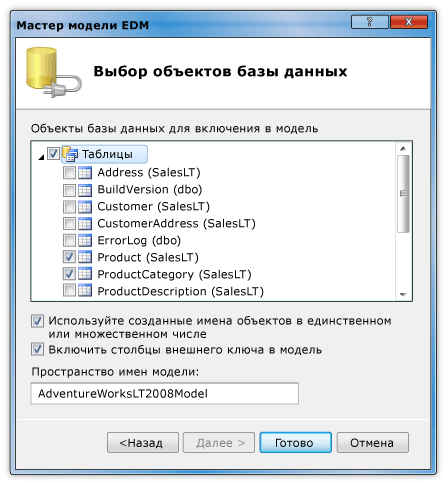
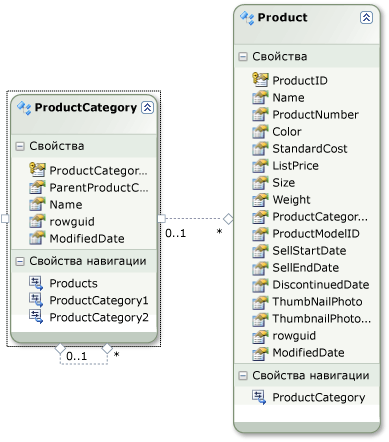
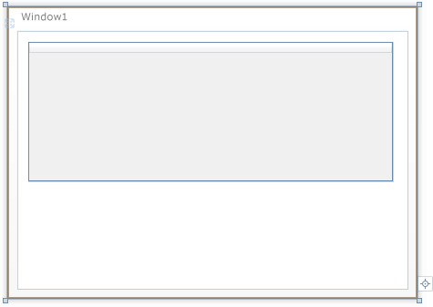

# Пошаговое руководство. Отображение данных из SQL Server базы данных в элементе управления DataGrid

В этом пошаговом руководстве вы получаете данные из базы данных SQL Server и отображает их в элементе управления <xref:System.Windows.Controls.DataGrid>. Entity Framework ADO.NET используется для создания классов сущностей, представляющих данные, и использования LINQ для написания запроса, который извлекает указанные данные из класса сущностей.

## предварительные требования

Для выполнения этого пошагового руководства требуются следующие компоненты:

- приведенному.

- Доступ к выполняющемуся экземпляру SQL Server или SQL Server Express, к которому присоединен образец базы данных AdventureWorks. Базу данных AdventureWorks можно загрузить с сайта [GitHub](https://github.com/Microsoft/sql-server-samples/releases).

## Создание классов сущностей

1. Создайте новый проект приложения WPF в Visual Basic или C#и присвойте ему имя `DataGridSQLExample`.

2. В обозреватель решений щелкните правой кнопкой мыши проект, наведите указатель на пункт **Добавить**и выберите пункт **создать элемент**.

     Будет открыто диалоговое окно Добавление нового элемента.

3. В области Установленные шаблоны выберите **данные** и в списке шаблонов выберите **ADO.NET EDM**.

     

4. Присвойте файлу имя `AdventureWorksModel.edmx` а затем нажмите кнопку **Добавить**.

     Появится Мастер моделей EDM.

5. На экране Выбор содержимого модели выберите **конструктор EF из базы данных** , а затем нажмите кнопку **Далее**.

6. На экране Выбор подключения к данным укажите подключение к базе данных AdventureWorksLT2008. Дополнительные сведения см. в разделе [диалоговое окно "Выбор подключения к данным"](https://docs.microsoft.com/previous-versions/dotnet/netframework-4.0/bb399244(v=vs.100)).

    Убедитесь, что имя `AdventureWorksLT2008Entities` и флажок **сохранить параметры подключения сущности в App. config** установлен, а затем нажмите кнопку **Далее**.

7. На экране Выбор объектов базы данных разверните узел таблицы и выберите таблицы **Product** и **ProductCategory** .

     Можно создавать классы сущностей для всех таблиц. Однако в этом примере данные извлекаются только из этих двух таблиц.

     

8. Нажмите кнопку **Готово**.

     Сущности Product и ProductCategory отображаются в Entity Designer.

     

## Получение и представление данных

1. Откройте файл MainWindow. XAML.

2. Задайте для свойства <xref:System.Windows.FrameworkElement.Width%2A> <xref:System.Windows.Window> значение 450.

3. В редакторе XAML добавьте следующий тег <xref:System.Windows.Controls.DataGrid> между тегами `<Grid>` и `</Grid>`, чтобы добавить <xref:System.Windows.Controls.DataGrid> с именем `dataGrid1`.

     [!code-xaml[DataGrid_SQL_EF_Walkthrough#3](~/samples/snippets/csharp/VS_Snippets_Wpf/DataGrid_SQL_EF_Walkthrough/CS/MainWindow.xaml#3)]

     

4. Выберите <xref:System.Windows.Window>.

5. С помощью окно свойств или редактора XAML Создайте обработчик событий для <xref:System.Windows.Window> с именем `Window_Loaded` для события <xref:System.Windows.FrameworkElement.Loaded>. Дополнительные сведения см. [в разделе инструкции. Создание простого обработчика событий](https://docs.microsoft.com/previous-versions/visualstudio/visual-studio-2010/bb675300(v=vs.100)).

     Ниже показан XAML для MainWindow. XAML.

    > [!NOTE]
    > При использовании Visual Basic в первой строке файла MainWindow. XAML замените `x:Class="DataGridSQLExample.MainWindow"` на `x:Class="MainWindow"`.

     [!code-xaml[DataGrid_SQL_EF_Walkthrough#1](~/samples/snippets/csharp/VS_Snippets_Wpf/DataGrid_SQL_EF_Walkthrough/CS/MainWindow.xaml#1)]

6. Откройте файл кода программной части (MainWindow. XAML. vb или MainWindow.xaml.cs) для <xref:System.Windows.Window>.

7. Добавьте следующий код, чтобы получить только определенные значения из соединяемых таблиц и задать для свойства <xref:System.Windows.Controls.ItemsControl.ItemsSource%2A> <xref:System.Windows.Controls.DataGrid> результаты запроса.

     [!code-csharp[DataGrid_SQL_EF_Walkthrough#2](~/samples/snippets/csharp/VS_Snippets_Wpf/DataGrid_SQL_EF_Walkthrough/CS/MainWindow.xaml.cs#2)]
     [!code-vb[DataGrid_SQL_EF_Walkthrough#2](~/samples/snippets/visualbasic/VS_Snippets_Wpf/DataGrid_SQL_EF_Walkthrough/VB/MainWindow.xaml.vb#2)]

8. Запустите пример.

     Вы должны увидеть <xref:System.Windows.Controls.DataGrid>, отображающий данные.

     

## См. также раздел

- <xref:System.Windows.Controls.DataGrid>
