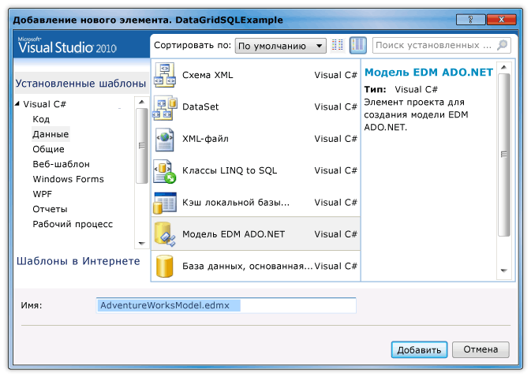
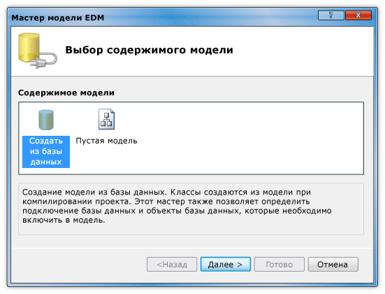
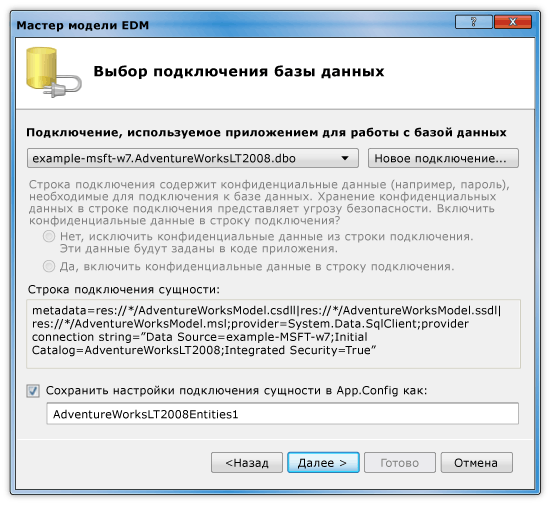

# Пошаговое руководство. Отображение данных из базы данных SQL Server в элементе управления DataGridWalkthrough: Display Data from a SQL Server Database in a DataGrid Control
В этом пошаговом руководстве, получения данных из базы данных SQL Server и отображение их в <xref:System.Windows.Controls.DataGrid> элемента управления.In this walkthrough, you retrieve data from a SQL Server database and display that data in a <xref:System.Windows.Controls.DataGrid> control. Использовать ADO.NET Entity Framework для создания классов сущностей, которые представляют данные, а также написать запрос, извлекающий указанные данные из класса сущностей с помощью LINQ.You use the ADO.NET Entity Framework to create the entity classes that represent the data, and use LINQ to write a query that retrieves the specified data from an entity class.  
  
## Предварительные требованияPrerequisites  
 Ниже приведены компоненты, необходимые для выполнения данного пошагового руководства.You need the following components to complete this walkthrough:  
  
-   [!INCLUDE[vs_dev11_long](../../../../includes/vs-dev11-long-md.md)]..  
  
-   Доступ к запущенному экземпляру SQL Server или SQL Server Express с подключенной образца базы данных AdventureWorks, присоединенные к нему.Access to a running instance of SQL Server or SQL Server Express that has the AdventureWorks sample database attached to it. Можно загрузить из базы данных AdventureWorks [GitHub](https://github.com/Microsoft/sql-server-samples/releases).You can download the AdventureWorks database from the [GitHub](https://github.com/Microsoft/sql-server-samples/releases).  
  
### Для создания классов сущностейTo create entity classes  
  
1.  Создание нового проекта приложения WPF в Visual Basic или C# и назовите его `DataGridSQLExample`.Create a new WPF Application project in Visual Basic or C#, and name it `DataGridSQLExample`.  
  
2.  В обозревателе решений щелкните проект правой кнопкой мыши **добавить**, а затем выберите **новый элемент**.In Solution Explorer, right-click your project, point to **Add**, and then select **New Item**.  
  
     Откроется диалоговое окно Добавление нового элемента.The Add New Item dialog box appears.  
  
3.  Выберите в области установленные шаблоны **данные** и в списке шаблонов выберите **режим данных ADO.NET Entity**l.In the Installed Templates pane, select **Data** and in the list of templates, select **ADO.NET Entity Data Mode**l.  
  
       
  
4.  Назовите файл `AdventureWorksModel.edmx` и нажмите кнопку **добавить**.Name the file `AdventureWorksModel.edmx` and then click **Add**.  
  
     Появится мастер модели EDM.The Entity Data Model Wizard appears.  
  
5.  В окне Выбор содержимого модели выберите **создать из базы данных** и нажмите кнопку **Далее**.In the Choose Model Contents screen, select **Generate from database** and then click **Next**.  
  
       
  
6.  На экране «Выбор подключения базы данных» укажите подключение к базе данных AdventureWorksLT2008.In the Choose Your Data Connection screen, provide the connection to your AdventureWorksLT2008 database. Дополнительные сведения см. в разделе [выберите ваш данных диалоговое окно подключения](http://go.microsoft.com/fwlink/?LinkId=160190).For more information, see [Choose Your Data Connection Dialog Box](http://go.microsoft.com/fwlink/?LinkId=160190).  
  
       
  
7.  Убедитесь, что имя указано `AdventureWorksLT2008Entities` и что **сохранить настройки подключения сущности в App.Config как** флажок установлен и нажмите кнопку **Далее**.Make sure that the name is `AdventureWorksLT2008Entities` and that the **Save entity connection settings in App.Config as** check box is selected, and then click **Next**.  
  
8.  На экране Выбор объектов базы данных, разверните узел таблицы и выберите **продукта** и **ProductCategory** таблиц.In the Choose Your Database Objects screen, expand the Tables node, and select the **Product** and **ProductCategory** tables.  
  
     Можно создать классы сущностей для всех таблиц. Однако в этом примере извлекаются данные только из этих двух таблиц.You can generate entity classes for all of the tables; however, in this example you only retrieve data from those two tables.  
  
       
  
9. Нажмите кнопку **Готово**.Click **Finish**.  
  
     Сущности Product и ProductCategory, отображаются в конструкторе сущностей.The Product and ProductCategory entities are displayed in the Entity Designer.  
  
       
  
### Для получения и представления данныхTo retrieve and present the data  
  
1.  Откройте файл MainWindow.xaml.Open the MainWindow.xaml file.  
  
2.  Задать <xref:System.Windows.FrameworkElement.Width%2A> свойство <xref:System.Windows.Window> в значение 450.Set the <xref:System.Windows.FrameworkElement.Width%2A> property on the <xref:System.Windows.Window> to 450.  
  
3.  В редакторе XAML добавьте следующие <xref:System.Windows.Controls.DataGrid> тег между `<Grid>` и `</Grid>` тегов, чтобы добавить <xref:System.Windows.Controls.DataGrid> с именем `dataGrid1`.In the XAML editor, add the following <xref:System.Windows.Controls.DataGrid> tag between the `<Grid>` and `</Grid>` tags to add a <xref:System.Windows.Controls.DataGrid> named `dataGrid1`.  
  
     [!code-xaml[DataGrid_SQL_EF_Walkthrough#3](../../../../samples/snippets/csharp/VS_Snippets_Wpf/DataGrid_SQL_EF_Walkthrough/CS/MainWindow.xaml#3)]  
  
       
  
4.  Выберите <xref:System.Windows.Window>.Select the <xref:System.Windows.Window>.  
  
5.  С помощью окна свойств или редактора XAML создайте обработчик событий для <xref:System.Windows.Window> с именем `Window_Loaded` для <xref:System.Windows.FrameworkElement.Loaded> события.Using the Properties window or XAML editor, create an event handler for the <xref:System.Windows.Window> named `Window_Loaded` for the <xref:System.Windows.FrameworkElement.Loaded> event. Дополнительные сведения см. в разделе [как: создание простого обработчика событий](http://msdn.microsoft.com/en-us/b1456e07-9dec-4354-99cf-18666b64f480).For more information, see [How to: Create a Simple Event Handler](http://msdn.microsoft.com/en-us/b1456e07-9dec-4354-99cf-18666b64f480).  
  
     Ниже показан код XAML для файла MainWindow.xaml.The following shows the XAML for MainWindow.xaml.  
  
    > [!NOTE]
    >  При использовании Visual Basic в первой строке файла MainWindow.XAML замените `x:Class="DataGridSQLExample.MainWindow"` с `x:Class="MainWindow"`.If you are using Visual Basic, in the first line of MainWindow.xaml, replace `x:Class="DataGridSQLExample.MainWindow"` with `x:Class="MainWindow"`.  
  
     [!code-xaml[DataGrid_SQL_EF_Walkthrough#1](../../../../samples/snippets/csharp/VS_Snippets_Wpf/DataGrid_SQL_EF_Walkthrough/CS/MainWindow.xaml#1)]  
  
6.  Откройте файл кода (файл MainWindow.xaml.vb или MainWindow.xaml.cs) для <xref:System.Windows.Window>.Open the code-behind file (MainWindow.xaml.vb or MainWindow.xaml.cs) for the <xref:System.Windows.Window>.  
  
7.  Добавьте следующий код для извлечения только конкретных значений из соединяемых таблиц и установки <xref:System.Windows.Controls.ItemsControl.ItemsSource%2A> свойство <xref:System.Windows.Controls.DataGrid> к результатам запроса.Add the following code to retrieve only specific values from the joined tables and set the <xref:System.Windows.Controls.ItemsControl.ItemsSource%2A> property of the <xref:System.Windows.Controls.DataGrid> to the results of the query.  
  
     [!code-csharp[DataGrid_SQL_EF_Walkthrough#2](../../../../samples/snippets/csharp/VS_Snippets_Wpf/DataGrid_SQL_EF_Walkthrough/CS/MainWindow.xaml.cs#2)]
     [!code-vb[DataGrid_SQL_EF_Walkthrough#2](../../../../samples/snippets/visualbasic/VS_Snippets_Wpf/DataGrid_SQL_EF_Walkthrough/VB/MainWindow.xaml.vb#2)]  
  
8.  Запустите пример.Run the example.  
  
     Вы увидите <xref:System.Windows.Controls.DataGrid> , отображающий данные.You should see a <xref:System.Windows.Controls.DataGrid> that displays data.  
  
       
  
## Дальнейшие действияNext Steps  
  
## См. такжеSee Also  
 <xref:System.Windows.Controls.DataGrid>  
 [Как получить работу I: с Entity Framework в приложениях WPF?How Do I: Get Started with Entity Framework in WPF Applications?](http://go.microsoft.com/fwlink/?LinkId=159868)
