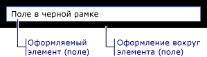

# Модель содержимого WPF
[!INCLUDE[TLA#tla_winclient](../../../../includes/tlasharptla-winclient-md.md)] — это презентационная платформа, которая предоставляет множество элементов и типов, схожих с элементами управления, основное предназначение которых — отображение различных типов содержимого. Чтобы определить, какой элемент управления использовать или от какого элемента управления выполнять наследование, вы должны понимать, какие виды объектов лучше всего может отображать конкретный элемент управления.  
  
 В этом разделе приводятся обобщенные сведения о модели содержимого для элементов управления [!INCLUDE[TLA2#tla_winclient](../../../../includes/tla2sharptla-winclient-md.md)] и типов, схожих с элементами управления. Модель содержимого описывает, какое содержимое может использоваться в элементе управления. Также в этом разделе перечисляются свойства содержимого для каждой модели содержимого. Свойство содержимого — это свойство, которое используется для хранения содержимого объекта.  

## Классы с произвольным содержимым  
 Некоторые элементы управления могут содержать объект любого <xref:System.DateTime> типа, например строку, объект или <xref:System.Windows.UIElement> контейнер для дополнительных элементов. Например, <xref:System.Windows.Controls.Button> может содержать изображение и текст; или <xref:System.Windows.Controls.CheckBox> может содержать значение <xref:System.DateTime.Now%2A?displayProperty=nameWithType>.  
  
 В [!INCLUDE[TLA2#tla_winclient](../../../../includes/tla2sharptla-winclient-md.md)] имеется четыре класса, которые могут иметь произвольное содержимое. В следующей таблице перечислены <xref:System.Windows.Controls.Control>классы, которые наследуются от .  
  
|Класс с произвольным содержимым|Содержимое|  
|-------------------------------------------|-------------|  
|<xref:System.Windows.Controls.ContentControl>|Один произвольный объект.|  
|<xref:System.Windows.Controls.HeaderedContentControl>|Заголовок и один элемент, которые являются произвольными объектами.|  
|<xref:System.Windows.Controls.ItemsControl>|Коллекция произвольных объектов.|  
|<xref:System.Windows.Controls.HeaderedItemsControl>|Заголовок и коллекция элементов, являющиеся произвольными объектами.|  
  
 Элементы управления, производные от этих классов, могут содержать тот же тип содержимого и обрабатывать содержимое аналогичным образом. На следующей иллюстрации показан один элемент управления от каждой модели содержимого, содержащий изображение, и текст:  
  
   
  
### Элементы управления, содержащие один произвольный объект  
 Класс <xref:System.Windows.Controls.ContentControl> содержит один кусок произвольного содержимого. Его содержание <xref:System.Windows.Controls.ContentControl.Content%2A>собственности . Следующие элементы <xref:System.Windows.Controls.ContentControl> управления наследуют и используют его модель содержимого:  
  
- <xref:System.Windows.Controls.Button>  
  
- <xref:System.Windows.Controls.Primitives.ButtonBase>  
  
- <xref:System.Windows.Controls.CheckBox>  
  
- <xref:System.Windows.Controls.ComboBoxItem>  
  
- <xref:System.Windows.Controls.ContentControl>  
  
- <xref:System.Windows.Controls.Frame>  
  
- <xref:System.Windows.Controls.GridViewColumnHeader>  
  
- <xref:System.Windows.Controls.GroupItem>  
  
- <xref:System.Windows.Controls.Label>  
  
- <xref:System.Windows.Controls.ListBoxItem>  
  
- <xref:System.Windows.Controls.ListViewItem>  
  
- <xref:System.Windows.Navigation.NavigationWindow>  
  
- <xref:System.Windows.Controls.RadioButton>  
  
- <xref:System.Windows.Controls.Primitives.RepeatButton>  
  
- <xref:System.Windows.Controls.ScrollViewer>  
  
- <xref:System.Windows.Controls.Primitives.StatusBarItem>  
  
- <xref:System.Windows.Controls.Primitives.ToggleButton>  
  
- <xref:System.Windows.Controls.ToolTip>  
  
- <xref:System.Windows.Controls.UserControl>  
  
- <xref:System.Windows.Window>  
  
 На следующей иллюстрации <xref:System.Windows.Controls.ContentControl.Content%2A> показаны четыре кнопки, которые <xref:System.Windows.Shapes.Rectangle>установлены <xref:System.Windows.Controls.Panel> на <xref:System.Windows.Shapes.Ellipse> строку, <xref:System.Windows.Controls.TextBlock> <xref:System.DateTime> объект, a, и a, который содержит и:  
  
   
  
 Пример того, как установить свойство, <xref:System.Windows.Controls.ContentControl.Content%2A> см. <xref:System.Windows.Controls.ContentControl>  
  
### Элементы управления, содержащие заголовок и один произвольный объект  
 Класс <xref:System.Windows.Controls.HeaderedContentControl> наследует <xref:System.Windows.Controls.ContentControl> от и отображает содержимое с заголовком. Он наследует свойство <xref:System.Windows.Controls.ContentControl.Content%2A>содержания, <xref:System.Windows.Controls.ContentControl> от <xref:System.Windows.Controls.HeaderedContentControl.Header%2A> и определяет <xref:System.Object>свойство которое типа; таким образом, оба могут быть произвольным объектом.  
  
 Следующие элементы <xref:System.Windows.Controls.HeaderedContentControl> управления наследуют и используют его модель содержимого:  
  
- <xref:System.Windows.Controls.Expander>  
  
- <xref:System.Windows.Controls.GroupBox>  
  
- <xref:System.Windows.Controls.TabItem>  
  
 На следующей <xref:System.Windows.Controls.TabItem> иллюстрации показаны два объекта. Первый <xref:System.Windows.Controls.TabItem> <xref:System.Windows.UIElement> имеет <xref:System.Windows.Controls.HeaderedContentControl.Header%2A> объекты, <xref:System.Windows.Controls.ContentControl.Content%2A>как и . Устанавливается <xref:System.Windows.Controls.HeaderedContentControl.Header%2A> на <xref:System.Windows.Controls.StackPanel> то, <xref:System.Windows.Shapes.Ellipse> что <xref:System.Windows.Controls.TextBlock>содержит и . Устанавливается <xref:System.Windows.Controls.ContentControl.Content%2A> на <xref:System.Windows.Controls.StackPanel> то, <xref:System.Windows.Controls.TextBlock> что <xref:System.Windows.Controls.Label>содержит a и a . Второй <xref:System.Windows.Controls.TabItem> имеет <xref:System.Windows.Controls.HeaderedContentControl.Header%2A> строку в <xref:System.Windows.Controls.TextBlock> и <xref:System.Windows.Controls.ContentControl.Content%2A>в .  
  
   
  
 Например, как создавать <xref:System.Windows.Controls.TabItem> объекты, см. <xref:System.Windows.Controls.HeaderedContentControl>  
  
### Элементы управления, содержащие коллекцию произвольных объектов  
 Класс <xref:System.Windows.Controls.ItemsControl> наследует <xref:System.Windows.Controls.Control> и может содержать несколько элементов, таких как строки, объекты или другие элементы. Свойства его <xref:System.Windows.Controls.ItemsControl.ItemsSource%2A> содержания являются и <xref:System.Windows.Controls.ItemsControl.Items%2A>. <xref:System.Windows.Controls.ItemsControl.ItemsSource%2A>обычно используется для заполнения <xref:System.Windows.Controls.ItemsControl> сбора данных. Если вы не хотите использовать коллекцию <xref:System.Windows.Controls.ItemsControl>для заполнения, вы можете <xref:System.Windows.Controls.ItemsControl.Items%2A> добавить элементы с помощью свойства.  
  
 Следующие элементы <xref:System.Windows.Controls.ItemsControl> управления наследуют и используют его модель содержимого:  
  
- <xref:System.Windows.Controls.Menu>  
  
- <xref:System.Windows.Controls.Primitives.MenuBase>  
  
- <xref:System.Windows.Controls.ContextMenu>  
  
- <xref:System.Windows.Controls.ComboBox>  
  
- <xref:System.Windows.Controls.ItemsControl>  
  
- <xref:System.Windows.Controls.ListBox>  
  
- <xref:System.Windows.Controls.ListView>  
  
- <xref:System.Windows.Controls.TabControl>  
  
- <xref:System.Windows.Controls.TreeView>  
  
- <xref:System.Windows.Controls.Primitives.Selector>  
  
- <xref:System.Windows.Controls.Primitives.StatusBar>  
  
 На следующей <xref:System.Windows.Controls.ListBox> иллюстрации показано, что содержит эти типы элементов:  
  
- Строка.  
  
- Объект <xref:System.DateTime> .  
  
- <xref:System.Windows.UIElement>.  
  
- A, <xref:System.Windows.Controls.Panel> который <xref:System.Windows.Shapes.Ellipse> содержит <xref:System.Windows.Controls.TextBlock>и .  
  
   
  
### Элементы управления, содержащие заголовок и коллекцию произвольных объектов  
 Класс <xref:System.Windows.Controls.HeaderedItemsControl> наследует <xref:System.Windows.Controls.ItemsControl> и может содержать несколько элементов, таких как строки, объекты или другие элементы, и заголовок. Он наследует <xref:System.Windows.Controls.ItemsControl> свойства <xref:System.Windows.Controls.ItemsControl.ItemsSource%2A>содержимого, и, <xref:System.Windows.Controls.ItemsControl.Items%2A>и <xref:System.Windows.Controls.HeaderedItemsControl.Header%2A> он определяет свойство, которое может быть произвольным объектом.  
  
 Следующие элементы <xref:System.Windows.Controls.HeaderedItemsControl> управления наследуют и используют его модель содержимого:  
  
- <xref:System.Windows.Controls.MenuItem>  
  
- <xref:System.Windows.Controls.ToolBar>  
  
- <xref:System.Windows.Controls.TreeViewItem>  
  

## Классы, содержащие коллекцию объектов UIElement  
 Класс <xref:System.Windows.Controls.Panel> позиционирует и <xref:System.Windows.UIElement> организует детские объекты. Его содержание <xref:System.Windows.Controls.Panel.Children%2A>собственности .  
  
 Следующие классы <xref:System.Windows.Controls.Panel> наследуют из класса и используют его модель содержимого:  
  
- <xref:System.Windows.Controls.Canvas>  
  
- <xref:System.Windows.Controls.DockPanel>  
  
- <xref:System.Windows.Controls.Grid>  
  
- <xref:System.Windows.Controls.Primitives.TabPanel>  
  
- <xref:System.Windows.Controls.Primitives.ToolBarOverflowPanel>  
  
- <xref:System.Windows.Controls.Primitives.ToolBarPanel>  
  
- <xref:System.Windows.Controls.Primitives.UniformGrid>  
  
- <xref:System.Windows.Controls.StackPanel>  
  
- <xref:System.Windows.Controls.VirtualizingPanel>  
  
- <xref:System.Windows.Controls.VirtualizingStackPanel>  
  
- <xref:System.Windows.Controls.WrapPanel>  
  
 Дополнительные сведения см. в разделе [Общие сведения о панелях](panels-overview.md).  
  

## Классы, влияющие на внешний вид объекта UIElement  
 Класс <xref:System.Windows.Controls.Decorator> применяет визуальные эффекты на одного <xref:System.Windows.UIElement>ребенка или вокруг них. Его содержание <xref:System.Windows.Controls.Decorator.Child%2A>собственности . Следующие классы <xref:System.Windows.Controls.Decorator> наследуют и используют его модель содержимого:  
  
- <xref:System.Windows.Documents.AdornerDecorator>  
  
- <xref:System.Windows.Controls.Border>  
  
- <xref:System.Windows.Controls.Primitives.BulletDecorator>  
  
- <xref:Microsoft.Windows.Themes.ButtonChrome>  
  
- <xref:Microsoft.Windows.Themes.ClassicBorderDecorator>  
  
- <xref:System.Windows.Controls.InkPresenter>  
  
- <xref:Microsoft.Windows.Themes.ListBoxChrome>  
  
- <xref:Microsoft.Windows.Themes.SystemDropShadowChrome>  
  
- <xref:System.Windows.Controls.Viewbox>  
  
 Следующая иллюстрация <xref:System.Windows.Controls.TextBox> показывает, что имеет <xref:System.Windows.Controls.Border> (украшен) вокруг него.  
  
   
Элемент управления TextBlock с границей вокруг него  
  

## Классы, предоставляющие визуальную обратную связь об объекте UIElement  
 Класс <xref:System.Windows.Documents.Adorner> предоставляет визуальные подсказки пользователю. Например, используйте функциональную <xref:System.Windows.Documents.Adorner> ручку к элементам или предоставьте сведения о состоянии элемента управления. Класс <xref:System.Windows.Documents.Adorner> предоставляет основу, чтобы вы могли создавать свои собственные украшения. [!INCLUDE[TLA2#tla_winclient](../../../../includes/tla2sharptla-winclient-md.md)] не предоставляет никаких реализованных декоративных элементов. Дополнительные сведения см. в разделе [Общие сведения о декоративных элементах](adorners-overview.md).  
  

## Классы, позволяющие пользователям вводить текст  
 WPF предоставляет три основных элемента управления, которые позволяют пользователям вводить текст. Каждый из этих элементов управления отображает текст по-разному. В следующей таблице приведены эти три элемента управления с поддержкой ввода текста, их возможности по отображению текста и свойства, которые содержат текст этого элемента управления.  
  
|Control|В каком виде отображается текст|Свойство содержимого|  
|-------------|--------------------------|----------------------|  
|<xref:System.Windows.Controls.TextBox>|с обычным текстом;|<xref:System.Windows.Controls.TextBox.Text%2A>|  
|<xref:System.Windows.Controls.RichTextBox>|Форматированный текст|<xref:System.Windows.Controls.RichTextBox.Document%2A>|  
|<xref:System.Windows.Controls.PasswordBox>|Скрытый текст (символы скрыты)|<xref:System.Windows.Controls.PasswordBox.Password%2A>|  
  

## Классы, отображающие пользовательский текст  
 Некоторые классы могут использоваться для отображения простого или форматированного текста. Можно использовать <xref:System.Windows.Controls.TextBlock> для отображения небольших объемов текста. Если вы хотите отобразить большое <xref:System.Windows.Controls.FlowDocumentPageViewer>количество <xref:System.Windows.Controls.FlowDocumentScrollViewer> текста, используйте элементы <xref:System.Windows.Controls.FlowDocumentReader>управления.  
  
 Имеет <xref:System.Windows.Controls.TextBlock> два свойства <xref:System.Windows.Controls.TextBlock.Text%2A> содержания: и <xref:System.Windows.Controls.TextBlock.Inlines%2A>. Если вы хотите отобразить текст, <xref:System.Windows.Controls.TextBlock.Text%2A> который использует последовательное форматирование, свойство часто является лучшим выбором. Если вы планируете использовать различные форматирования <xref:System.Windows.Controls.TextBlock.Inlines%2A> в течение всего текста, используйте свойство. Свойство <xref:System.Windows.Controls.TextBlock.Inlines%2A> представляет собой <xref:System.Windows.Documents.Inline> набор объектов, в которых указывается, как форматировать текст.  
  
 В следующей таблице перечислены <xref:System.Windows.Controls.FlowDocumentPageViewer>свойства <xref:System.Windows.Controls.FlowDocumentScrollViewer> содержимого для <xref:System.Windows.Controls.FlowDocumentReader>и классов.  
  
|Control|Свойство содержимого|Тип свойства содержимого|  
|-------------|----------------------|---------------------------|  
|<xref:System.Windows.Controls.FlowDocumentPageViewer>|Документ|<xref:System.Windows.Documents.IDocumentPaginatorSource>|  
|<xref:System.Windows.Controls.FlowDocumentReader>|Документ|<xref:System.Windows.Documents.FlowDocument>|  
|<xref:System.Windows.Controls.FlowDocumentScrollViewer>|Документ|<xref:System.Windows.Documents.FlowDocument>|  
  
 Реализует <xref:System.Windows.Documents.FlowDocument> <xref:System.Windows.Documents.IDocumentPaginatorSource> интерфейс; таким образом, все три <xref:System.Windows.Documents.FlowDocument> класса могут принимать как содержание.  
  

## Классы, выполняющие форматирование пользовательского текста  
 <xref:System.Windows.Documents.TextElement>и связанные с ним классы позволяют форматировать текст. <xref:System.Windows.Documents.TextElement>объекты содержат и <xref:System.Windows.Controls.TextBlock> <xref:System.Windows.Documents.FlowDocument> форматируют текст и объекты. Двумя основными типами объектов <xref:System.Windows.Documents.TextElement> являются элементы <xref:System.Windows.Documents.Block> и <xref:System.Windows.Documents.Inline> элементы. Элемент <xref:System.Windows.Documents.Block> представляет собой блок текста, например абзац или список. Элемент <xref:System.Windows.Documents.Inline> представляет часть текста в блоке. Многие <xref:System.Windows.Documents.Inline> классы указывают форматирование текста, к которому они применяются. Каждый из них <xref:System.Windows.Documents.TextElement> имеет свою собственную модель контента. Подробнее см. в разделе [Общие сведения о модели содержимого TextElement](../advanced/textelement-content-model-overview.md).  
  
## См. также раздел

- [Дополнительно](../advanced/index.md)
