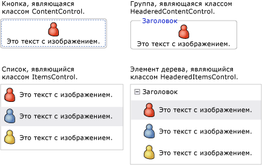
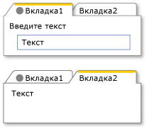
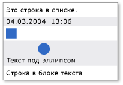

# Модель содержимого WPF
[!INCLUDE[TLA#tla_winclient](../../../../includes/tlasharptla-winclient-md.md)] – это презентационная платформа, которая предоставляет множество элементов управления и типов, схожих с элементами управления, главная цель которых состоит в отображении различных типов содержимого.  Для определения того, какие элементы следует использовать, и от каких элементов требуется наследовать, необходимо понимание того, какие виды объектов может лучше всего отображать конкретный элемент управления.  
  
 В этой теме обобщается модель содержимого для элементов управления [!INCLUDE[TLA2#tla_winclient](../../../../includes/tla2sharptla-winclient-md.md)] и типов, схожих с элементами управления.  Модель содержимого описывает содержимое, которое можно использовать в элементе управления. В этом разделе также приводятся свойства содержимого для каждой модели содержимого.  Свойство содержимого является свойством, которое используется для хранения содержимого объекта.  
  
   
  
   
## Классы с произвольным содержимым  
 Некоторые элементы управления могут содержать объекты любого типа, такие как строка, объект <xref:System.DateTime> или объект <xref:System.Windows.UIElement>, который является контейнером для дополнительных элементов.  Например, элемент управления <xref:System.Windows.Controls.Button> может содержать изображение и некоторый текст, а элемент управления <xref:System.Windows.Controls.CheckBox> может содержать значение <xref:System.DateTime.Now%2A?displayProperty=fullName>.  
  
 В [!INCLUDE[TLA2#tla_winclient](../../../../includes/tla2sharptla-winclient-md.md)] имеется четыре класса с произвольным содержимым.  В следующей таблице приведены классы, производные от <xref:System.Windows.Controls.Control>.  
  
|Классы с произвольным содержимым|Содержимое|  
|--------------------------------------|----------------|  
|<xref:System.Windows.Controls.ContentControl>|Один произвольный объект.|  
|<xref:System.Windows.Controls.HeaderedContentControl>|Заголовок и один элемент, оба являющиеся произвольными объектами.|  
|<xref:System.Windows.Controls.ItemsControl>|Коллекция произвольных объектов.|  
|<xref:System.Windows.Controls.HeaderedItemsControl>|Заголовок и коллекция элементов, являющиеся произвольными объектами.|  
  
 Элементы управления, производные от этих классов, могут иметь тот же тип содержимого и воспринимать его таким же образом.  На следующем рисунке показано по одному элементу управления из каждой модели содержимого, содержащему изображение и некоторый текст.  
  
   
  
### Элементы управления, содержащие один произвольный объект  
 Класс <xref:System.Windows.Controls.ContentControl> содержит один элемент произвольного содержимого.  Его свойство содержимого – <xref:System.Windows.Controls.ContentControl.Content%2A>.  Следующие элементы управления наследуют от элемента <xref:System.Windows.Controls.ContentControl> и используют его модель содержимого:  
  
-   <xref:System.Windows.Controls.Button>  
  
-   <xref:System.Windows.Controls.Primitives.ButtonBase>  
  
-   <xref:System.Windows.Controls.CheckBox>  
  
-   <xref:System.Windows.Controls.ComboBoxItem>  
  
-   <xref:System.Windows.Controls.ContentControl>  
  
-   <xref:System.Windows.Controls.Frame>  
  
-   <xref:System.Windows.Controls.GridViewColumnHeader>  
  
-   <xref:System.Windows.Controls.GroupItem>  
  
-   <xref:System.Windows.Controls.Label>  
  
-   <xref:System.Windows.Controls.ListBoxItem>  
  
-   <xref:System.Windows.Controls.ListViewItem>  
  
-   <xref:System.Windows.Navigation.NavigationWindow>  
  
-   <xref:System.Windows.Controls.RadioButton>  
  
-   <xref:System.Windows.Controls.Primitives.RepeatButton>  
  
-   <xref:System.Windows.Controls.ScrollViewer>  
  
-   <xref:System.Windows.Controls.Primitives.StatusBarItem>  
  
-   <xref:System.Windows.Controls.Primitives.ToggleButton>  
  
-   <xref:System.Windows.Controls.ToolTip>  
  
-   <xref:System.Windows.Controls.UserControl>  
  
-   <xref:System.Windows.Window>  
  
 На следующем рисунке показаны четыре кнопки, свойство <xref:System.Windows.Controls.ContentControl.Content%2A> которых задано как "string" \(строка\), объект <xref:System.DateTime>, а также элементы <xref:System.Windows.Shapes.Rectangle> и <xref:System.Windows.Controls.Panel>, которые содержат <xref:System.Windows.Shapes.Ellipse> и <xref:System.Windows.Controls.TextBlock>.  
  
   
Четыре кнопки, имеющие разный тип содержимого  
  
 Пример установки свойства <xref:System.Windows.Controls.ContentControl.Content%2A> см. в описании <xref:System.Windows.Controls.ContentControl>.  
  
### Элементы управления, содержащие заголовок и один произвольный объект  
 Класс <xref:System.Windows.Controls.HeaderedContentControl> наследует от <xref:System.Windows.Controls.ContentControl> и отображает содержимое с заголовком.  Он наследует свойство содержимого <xref:System.Windows.Controls.ContentControl.Content%2A> от <xref:System.Windows.Controls.ContentControl> и задает свойство <xref:System.Windows.Controls.HeaderedContentControl.Header%2A> типа <xref:System.Object>; поэтому оба объекта могли быть произвольными.  
  
 Следующие элементы управления наследуют от элемента <xref:System.Windows.Controls.HeaderedContentControl> и используют его модель содержимого:  
  
-   <xref:System.Windows.Controls.Expander>  
  
-   <xref:System.Windows.Controls.GroupBox>  
  
-   <xref:System.Windows.Controls.TabItem>  
  
 На следующем рисунке показаны два объекта <xref:System.Windows.Controls.TabItem>.  Первый объект <xref:System.Windows.Controls.TabItem> имеет объекты <xref:System.Windows.UIElement> со свойствами <xref:System.Windows.Controls.HeaderedContentControl.Header%2A> и <xref:System.Windows.Controls.ContentControl.Content%2A>.  Свойство <xref:System.Windows.Controls.HeaderedContentControl.Header%2A> установлено в значение <xref:System.Windows.Controls.StackPanel>; это объект, содержащий элементы <xref:System.Windows.Shapes.Ellipse> и <xref:System.Windows.Controls.TextBlock>.  Свойство <xref:System.Windows.Controls.ContentControl.Content%2A> установлено в значение <xref:System.Windows.Controls.StackPanel>; это объект, содержащий элементы <xref:System.Windows.Controls.TextBlock> и <xref:System.Windows.Controls.Label>.  Второй объект <xref:System.Windows.Controls.TabItem> имеет строку в свойстве <xref:System.Windows.Controls.HeaderedContentControl.Header%2A> и текст <xref:System.Windows.Controls.TextBlock> в свойстве <xref:System.Windows.Controls.ContentControl.Content%2A>.  
  
   
TabControl, использующий разные типы в свойстве Header  
  
 Пример создания объектов <xref:System.Windows.Controls.TabItem> см. в описании <xref:System.Windows.Controls.HeaderedContentControl>.  
  
### Элементы управления, содержащие коллекцию произвольных объектов.  
 Класс <xref:System.Windows.Controls.ItemsControl> наследует от <xref:System.Windows.Controls.Control> и может содержать несколько элементов, таких как строки, объекты и т.п.  Его свойства содержимого – <xref:System.Windows.Controls.ItemsControl.ItemsSource%2A> и <xref:System.Windows.Controls.ItemsControl.Items%2A>.  Свойство <xref:System.Windows.Controls.ItemsControl.ItemsSource%2A> обычно используется для заполнения <xref:System.Windows.Controls.ItemsControl> коллекцией данных.  Если для заполнения <xref:System.Windows.Controls.ItemsControl> не требуется использовать коллекцию, можно добавлять элементы с помощью свойства <xref:System.Windows.Controls.ItemsControl.Items%2A>.  
  
 Следующие элементы управления наследуют от элемента <xref:System.Windows.Controls.ItemsControl> и используют его модель содержимого:  
  
-   <xref:System.Windows.Controls.Menu>  
  
-   <xref:System.Windows.Controls.Primitives.MenuBase>  
  
-   <xref:System.Windows.Controls.ContextMenu>  
  
-   <xref:System.Windows.Controls.ComboBox>  
  
-   <xref:System.Windows.Controls.ItemsControl>  
  
-   <xref:System.Windows.Controls.ListBox>  
  
-   <xref:System.Windows.Controls.ListView>  
  
-   <xref:System.Windows.Controls.TabControl>  
  
-   <xref:System.Windows.Controls.TreeView>  
  
-   <xref:System.Windows.Controls.Primitives.Selector>  
  
-   <xref:System.Windows.Controls.Primitives.StatusBar>  
  
 На следующем рисунке показан элемент управления <xref:System.Windows.Controls.ListBox>, который содержит приведенные ниже типы элементов.  
  
-   Строка.  
  
-   Объект <xref:System.DateTime>.  
  
-   Объект <xref:System.Windows.UIElement>.  
  
-   Объект <xref:System.Windows.Controls.Panel>, который содержит объекты <xref:System.Windows.Shapes.Ellipse> и <xref:System.Windows.Controls.TextBlock>.  
  
   
ListBox, содержащий несколько типов объектов  
  
### Элементы управления, содержащие заголовок и коллекцию произвольных объектов.  
 Класс <xref:System.Windows.Controls.HeaderedItemsControl> является производным от класса <xref:System.Windows.Controls.ItemsControl> и может содержать несколько элементов, таких как строки, объекты, другие элементы и заголовок.  Он наследует от содержимого <xref:System.Windows.Controls.ItemsControl> свойства <xref:System.Windows.Controls.ItemsControl.ItemsSource%2A> и <xref:System.Windows.Controls.ItemsControl.Items%2A>, а также задает свойство <xref:System.Windows.Controls.HeaderedItemsControl.Header%2A>, которое может быть произвольным объектом.  
  
 Следующие элементы управления наследуют от элемента <xref:System.Windows.Controls.HeaderedItemsControl> и используют его модель содержимого:  
  
-   <xref:System.Windows.Controls.MenuItem>  
  
-   <xref:System.Windows.Controls.ToolBar>  
  
-   <xref:System.Windows.Controls.TreeViewItem>  
  
   
## Классы, содержащие коллекцию объектов UIElement  
 Класс <xref:System.Windows.Controls.Panel> размещает дочерние объекты <xref:System.Windows.UIElement>.  Его свойство содержимого – <xref:System.Windows.Controls.Panel.Children%2A>.  
  
 Следующие классы наследуют от класса <xref:System.Windows.Controls.Panel> и используют его модель содержимого:  
  
-   <xref:System.Windows.Controls.Canvas>  
  
-   <xref:System.Windows.Controls.DockPanel>  
  
-   <xref:System.Windows.Controls.Grid>  
  
-   <xref:System.Windows.Controls.Primitives.TabPanel>  
  
-   <xref:System.Windows.Controls.Primitives.ToolBarOverflowPanel>  
  
-   <xref:System.Windows.Controls.Primitives.ToolBarPanel>  
  
-   <xref:System.Windows.Controls.Primitives.UniformGrid>  
  
-   <xref:System.Windows.Controls.StackPanel>  
  
-   <xref:System.Windows.Controls.VirtualizingPanel>  
  
-   <xref:System.Windows.Controls.VirtualizingStackPanel>  
  
-   <xref:System.Windows.Controls.WrapPanel>  
  
 Дополнительные сведения см. в разделе [Общие сведения о панелях](../../../../docs/framework/wpf/controls/panels-overview.md).  
  
   
## Классы, которые влияют на внешний вид UIElement  
 Класс <xref:System.Windows.Controls.Decorator> применяет визуальные эффекты в одном дочернем элементе <xref:System.Windows.UIElement> или вокруг него.  Его свойство содержимого – <xref:System.Windows.Controls.Decorator.Child%2A>.  Следующие классы наследуют от класса <xref:System.Windows.Controls.Decorator> и используют его модель содержимого:  
  
-   <xref:System.Windows.Documents.AdornerDecorator>  
  
-   <xref:System.Windows.Controls.Border>  
  
-   <xref:System.Windows.Controls.Primitives.BulletDecorator>  
  
-   <xref:Microsoft.Windows.Themes.ButtonChrome>  
  
-   <xref:Microsoft.Windows.Themes.ClassicBorderDecorator>  
  
-   <xref:System.Windows.Controls.InkPresenter>  
  
-   <xref:Microsoft.Windows.Themes.ListBoxChrome>  
  
-   <xref:Microsoft.Windows.Themes.SystemDropShadowChrome>  
  
-   <xref:System.Windows.Controls.Viewbox>  
  
 На следующем рисунке показан объект <xref:System.Windows.Controls.TextBox>, окруженный границей <xref:System.Windows.Controls.Border>.  
  
   
TextBlock, имеющий границу  
  
   
## Классы, предоставляющие визуальный отзыв об элементе UIElement  
 Класс <xref:System.Windows.Documents.Adorner> предоставляет пользователю визуальные подсказки.  Например, с помощью <xref:System.Windows.Documents.Adorner> можно добавить в элементы функциональные обработчики или предоставить сведения о состоянии элемента управления.  Класс<xref:System.Windows.Documents.Adorner> предоставляет структуру, так что можно создавать свои собственные декоративные элементы.  [!INCLUDE[TLA2#tla_winclient](../../../../includes/tla2sharptla-winclient-md.md)] не предоставляет никакие реализованные декоративные элементы.  Дополнительные сведения см. в разделе [Общие сведения о декоративных элементах](../../../../docs/framework/wpf/controls/adorners-overview.md).  
  
   
## Классы, предоставляющие пользователям возможность ввести текст  
 WPF предоставляет три основных элемента управления, которые предоставляют пользователям возможность ввода текста.  Каждый элемент управления отображает этот текст по\-разному.  В следующей таблице приведены эти три элемента управления, их возможности при отображении текста, а также их свойства, содержащие их текст.  
  
|Элемент управления|Результат отображения текста|Свойство содержимого|  
|------------------------|----------------------------------|--------------------------|  
|<xref:System.Windows.Controls.TextBox>|Обычный текст|<xref:System.Windows.Controls.TextBox.Text%2A>|  
|<xref:System.Windows.Controls.RichTextBox>|Форматированный текст|<xref:System.Windows.Controls.RichTextBox.Document%2A>|  
|<xref:System.Windows.Controls.PasswordBox>|Скрытый текст \(символы скрыты\)|<xref:System.Windows.Controls.PasswordBox.Password%2A>|  
  
   
## Классы, отображающие текст пользователя  
 Некоторые классы можно использовать для отображения простого или форматированного текста.  Для отображения небольших объемов текста можно использовать <xref:System.Windows.Controls.TextBlock>.  Если требуется отображать большие объемы текста, следует использовать элементы управления <xref:System.Windows.Controls.FlowDocumentReader>, <xref:System.Windows.Controls.FlowDocumentPageViewer> и <xref:System.Windows.Controls.FlowDocumentScrollViewer>.  
  
 Элемент управления <xref:System.Windows.Controls.TextBlock> имеет два свойства содержимого: <xref:System.Windows.Controls.TextBlock.Text%2A> и <xref:System.Windows.Controls.TextBlock.Inlines%2A>.  Если требуется отображать текст, использующий последовательное форматирование, то обычно лучше всего подходит свойство <xref:System.Windows.Controls.TextBlock.Text%2A>.  Если предполагается использовать в тексте разное форматирование, то можно использовать свойство <xref:System.Windows.Controls.TextBlock.Inlines%2A>.  Свойство <xref:System.Windows.Controls.TextBlock.Inlines%2A> является коллекцией объектов <xref:System.Windows.Documents.Inline>, указывающих способ форматирования текста.  
  
 В следующей таблице перечислены свойства содержимого для классов <xref:System.Windows.Controls.FlowDocumentReader>, <xref:System.Windows.Controls.FlowDocumentPageViewer> и <xref:System.Windows.Controls.FlowDocumentScrollViewer>.  
  
|Элемент управления|Свойство содержимого|Тип свойства содержимого|  
|------------------------|--------------------------|------------------------------|  
|<xref:System.Windows.Controls.FlowDocumentPageViewer>|Document|<xref:System.Windows.Documents.IDocumentPaginatorSource>|  
|<xref:System.Windows.Controls.FlowDocumentReader>|Document|<xref:System.Windows.Documents.FlowDocument>|  
|<xref:System.Windows.Controls.FlowDocumentScrollViewer>|Document|<xref:System.Windows.Documents.FlowDocument>|  
  
 <xref:System.Windows.Documents.FlowDocument> реализует интерфейс <xref:System.Windows.Documents.IDocumentPaginatorSource>, следовательно все три класса могут принимать <xref:System.Windows.Documents.FlowDocument> в качестве содержимого.  
  
   
## Классы, форматирующие текст пользователя  
 Класс <xref:System.Windows.Documents.TextElement> и связанные с ним классы позволяют форматировать текст.  Объекты <xref:System.Windows.Documents.TextElement> содержат и форматируют текст в объектах <xref:System.Windows.Controls.TextBlock> и <xref:System.Windows.Documents.FlowDocument>.  Элементы <xref:System.Windows.Documents.Block> и элементы <xref:System.Windows.Documents.Inline> являются двумя основными типами объектов <xref:System.Windows.Documents.TextElement>.  Элемент <xref:System.Windows.Documents.Block> представляет блок текста, такой как параграф или список.  Элемент <xref:System.Windows.Documents.Inline> представляет часть текста в блоке.  Многие классы <xref:System.Windows.Documents.Inline> задают форматирование текста, к которому они применяются.  Каждый объект <xref:System.Windows.Documents.TextElement> имеет свою собственную модель содержимого.  Дополнительные сведения см. в разделе [Общие сведения о модели содержимого TextElement](../../../../docs/framework/wpf/advanced/textelement-content-model-overview.md).  
  
## См. также  
 [Дополнительно](../../../../docs/framework/wpf/advanced/index.md)