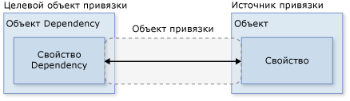
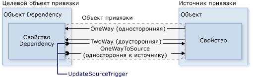
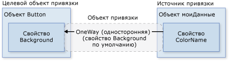
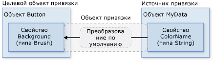
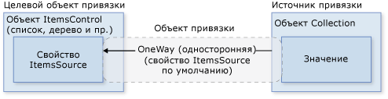

# <a name="data-binding-overview"></a>Общие сведения о привязке данных
Привязка данных [!INCLUDE[TLA#tla_winclient](../../../../includes/tlasharptla-winclient-md.md)] предоставляет приложениям простой и последовательный способ представления данных и взаимодействия с ними. Можно связывать элементы с данными из различных источников данных в виде объектов [!INCLUDE[TLA#tla_clr](../../../../includes/tlasharptla-clr-md.md)] и [!INCLUDE[TLA#tla_xml](../../../../includes/tlasharptla-xml-md.md)]. <xref:System.Windows.Controls.ContentControl>например <xref:System.Windows.Controls.Button> и <xref:System.Windows.Controls.ItemsControl>, например <xref:System.Windows.Controls.ListBox> и <xref:System.Windows.Controls.ListView> имеет встроенных функциональных возможностей для включения гибких стилей для отдельных элементов данных или коллекции элементов данных. Представления сортировки, фильтрации и группировки могут быть организованы поверх данных.  
  
 Функции привязки данных в [!INCLUDE[TLA2#tla_winclient](../../../../includes/tla2sharptla-winclient-md.md)] имеют несколько преимуществ перед традиционными моделями, включая широкий диапазон свойств, которые внутренне поддерживают привязку данных, гибкое представление данных [!INCLUDE[TLA2#tla_ui](../../../../includes/tla2sharptla-ui-md.md)] и четкое разделение бизнес-логики и [!INCLUDE[TLA2#tla_ui](../../../../includes/tla2sharptla-ui-md.md)].  
  
 Сначала в этом разделе рассматриваются основные понятия основа для [!INCLUDE[TLA2#tla_winclient](../../../../includes/tla2sharptla-winclient-md.md)] привязки данных, а затем — использование <xref:System.Windows.Data.Binding> классов и другие возможности привязки данных.  
  
  
<a name="what_is_data_binding"></a>   
## <a name="what-is-data-binding"></a>Понятие привязки данных  
 Привязка данных — это процесс установки соединения между [!INCLUDE[TLA2#tla_ui](../../../../includes/tla2sharptla-ui-md.md)] приложения и бизнес-логикой. Если для привязки заданы правильные настройки, а изменения значений данных сопровождаются правильными уведомлениями, привязанные к данным элементы автоматически отражают изменения. Привязка данных может также означать, что, если внешнее представление данных в элементе изменяется, то базовые данные могут автоматически обновляться для отражения изменений. Например, если пользователь изменяет значение в <xref:System.Windows.Controls.TextBox> элемент, базовое значение данных автоматически обновляется, чтобы отразить это изменение.  
  
 Привязка к данным обычно используется для того, чтобы поместить серверный или локальные данные конфигурации в формы или другие элементы управления [!INCLUDE[TLA2#tla_ui](../../../../includes/tla2sharptla-ui-md.md)]. В [!INCLUDE[TLA2#tla_winclient](../../../../includes/tla2sharptla-winclient-md.md)] эта концепция расширяется и уже включает привязку широкого диапазона свойств к различным источникам данных. В [!INCLUDE[TLA2#tla_winclient](../../../../includes/tla2sharptla-winclient-md.md)] свойства зависимости элементов могут быть привязаны к объектам [!INCLUDE[TLA2#tla_clr](../../../../includes/tla2sharptla-clr-md.md)] (включая объекты [!INCLUDE[TLA#tla_adonet](../../../../includes/tlasharptla-adonet-md.md)] или объекты, связанные с веб-службами и веб-свойства) и к данным [!INCLUDE[TLA2#tla_xml](../../../../includes/tla2sharptla-xml-md.md)].  
  
 Привязку данных можно рассмотреть на примере следующего [!INCLUDE[TLA2#tla_ui](../../../../includes/tla2sharptla-ui-md.md)] приложения со страницы [примера привязки данных](http://go.microsoft.com/fwlink/?LinkID=163703).  
  
   
  
 Выше приведен [!INCLUDE[TLA2#tla_ui](../../../../includes/tla2sharptla-ui-md.md)] приложения, который отображает список лотов аукциона. Приложение демонстрирует следующие возможности привязки данных.  
  
-   Содержимое <xref:System.Windows.Controls.ListBox> привязан к коллекции *AuctionItem* объектов. Объект *AuctionItem* имеет такие свойства, как *Description*, *StartPrice*, *StartDate*, *Category*, *SpecialFeatures* и т. д.  
  
-   Данные (*AuctionItem* объектов) в <xref:System.Windows.Controls.ListBox> является шаблоном, чтобы отображались описание и текущая цена для каждого элемента. Это делается с помощью <xref:System.Windows.DataTemplate>. Кроме того, внешний вид каждого элемента зависит от значения *SpecialFeatures* отображаемого объекта *AuctionItem*. Если значением *SpecialFeatures* объекта *AuctionItem* является *Color*, элемент имеет синюю границу. Если значением является *Highlight*, элемент имеет оранжевые границы и помечается звездочкой. Раздел [Создание шаблонов данных](#data_templating) содержит сведения о создании шаблонов данных.  
  
-   Пользователю можно группировать, фильтровать и сортировать данные с помощью <xref:System.Windows.Controls.CheckBox>предоставленных. В приведенном выше рисунке, «Группировать по категориям» и «Сортировка по категориям и дате» <xref:System.Windows.Controls.CheckBox>выбраны. Можно увидеть, что данные группируются по категориям продуктов, а имена категорий приводятся в алфавитном порядке. Из рисунка трудно заметить, что элементы в каждой категории также сортируются по начальной дате. Это делается с помощью *представления коллекции*. Представления коллекций рассматриваются в разделе [Привязка к коллекциям](#binding_to_collections).  
  
-   Когда пользователь выбирает элемент, <xref:System.Windows.Controls.ContentControl> со сведениями о выбранного элемента. Это называется *Сценарий привязки "основной-подробности"*. Сведения об этом типе скрипта привязки см. в разделе [Сценарий привязки "основной-подробности"](#master_detail_scenario).  
  
-   Тип *StartDate* свойство <xref:System.DateTime>, который возвращает дату, включая время с точностью до миллисекунды. В этом приложении пользовательский преобразователь использовался для отображения даты в укороченном формате. Сведения о преобразователях см. в разделе [Преобразование данных](#data_conversion).  
  
 При нажатии кнопки *Добавить продукт* появляется следующая форма.  
  
   
  
 Пользователь может изменить поля формы, просмотреть список продуктов с помощью панелей краткого предварительного просмотра и подробного предварительного просмотра и нажать кнопку *Отправить*, для добавления данных нового продукта. К новой записи будут применимы все существующие функциональные возможности группировки, фильтрации и сортировки. В этом конкретном случае элемент, введенный на приведенном выше рисунке, будет отображаться как второй элемент в категории *Компьютер*.  
  
 Не на этом рисунке приведена логика проверки, предоставленная в *Дата начала* <xref:System.Windows.Controls.TextBox>. Если пользователь вводит недопустимую дату (недопустимый формат или прошедшую дату), пользователь будет уведомлен <xref:System.Windows.Controls.ToolTip> и красным восклицательным знаком рядом с <xref:System.Windows.Controls.TextBox>. Сведения о создании логики проверки см. в разделе [Проверка данных](#data_validation).  
  
 Прежде чем перейти к другим описанным выше возможностям связывания данных, в следующем разделе обсудим основные понятия, важные для понимания привязки данных [!INCLUDE[TLA2#tla_winclient](../../../../includes/tla2sharptla-winclient-md.md)].  
  
## <a name="basic-data-binding-concepts"></a>Основные понятия привязки данных  
  
 Независимо от того, какой элемент привязывается и какой источник данных используется, каждая привязка всегда соответствует модели, показанной на следующем рисунке.  
  
   
  
 Как показано на приведенном выше рисунке, привязка данных является по существу мостом между целью привязки и источником привязки. На рисунке представлены следующие основные концепции привязки данных [!INCLUDE[TLA2#tla_winclient](../../../../includes/tla2sharptla-winclient-md.md)].  
  
-   Как правило, каждая привязка имеет четыре компонента: объект цели привязки, свойство цели, источник привязки и путь к значению используемого источника привязки. Например, если требуется связать содержимое <xref:System.Windows.Controls.TextBox> для *имя* свойство *сотрудника* объекта, целевой объект является <xref:System.Windows.Controls.TextBox>, имеет свойство target <xref:System.Windows.Controls.TextBox.Text%2A> свойство, используемое значение является *имя*, и исходный объект не *сотрудника* объекта.  
  
-   Целевое свойство должно быть свойством зависимостей. Большинство <xref:System.Windows.UIElement> свойства являются свойствами зависимостей и большинства свойств зависимостей, за исключением того, доступных только для чтения, по умолчанию поддерживает привязку данных. (Только <xref:System.Windows.DependencyObject> типы могут определять свойства зависимостей и все <xref:System.Windows.UIElement>s являются производными от <xref:System.Windows.DependencyObject>.)  
  
-   Несмотря на то что это не указано на рисунке, следует отметить, что источник привязки не обязан быть пользовательским объектом [!INCLUDE[TLA2#tla_clr](../../../../includes/tla2sharptla-clr-md.md)]. Привязка данных [!INCLUDE[TLA2#tla_winclient](../../../../includes/tla2sharptla-winclient-md.md)] поддерживает данные в виде объектов [!INCLUDE[TLA2#tla_clr](../../../../includes/tla2sharptla-clr-md.md)] и [!INCLUDE[TLA2#tla_xml](../../../../includes/tla2sharptla-xml-md.md)]. Представлены некоторые, возможно, источник привязки <xref:System.Windows.UIElement>, любой объект списка [!INCLUDE[TLA2#tla_clr](../../../../includes/tla2sharptla-clr-md.md)] объекта, с которым связан [!INCLUDE[TLA#tla_adonet](../../../../includes/tlasharptla-adonet-md.md)] данных или веб-служб и XmlNode, содержащий ваш [!INCLUDE[TLA2#tla_xml](../../../../includes/tla2sharptla-xml-md.md)] данных. Дополнительные сведения см. в разделе [Общие сведения об источниках привязки](../../../../docs/framework/wpf/data/binding-sources-overview.md).  
  
 В процессе чтения других разделов [!INCLUDE[TLA#tla_sdk](../../../../includes/tlasharptla-sdk-md.md)] важно помнить, что при связывании цель привязки *привязывается к* источнику привязки. Например, при отображении некоторых базовых [!INCLUDE[TLA2#tla_xml](../../../../includes/tla2sharptla-xml-md.md)] данные в <xref:System.Windows.Controls.ListBox> с использованием привязки данных, выполняется привязка к <xref:System.Windows.Controls.ListBox> для [!INCLUDE[TLA2#tla_xml](../../../../includes/tla2sharptla-xml-md.md)] данных.  
  
 Чтобы установить привязку, используйте <xref:System.Windows.Data.Binding> объекта. В остальной части этого раздела обсуждаются многие понятия, связанные с некоторых свойств и использование <xref:System.Windows.Data.Binding> объекта.  
  
<a name="direction_of_data_flow"></a>   
### <a name="direction-of-the-data-flow"></a>Направление потока данных  
 Как упоминалось ранее и как показывает стрелка на приведенном выше рисунке, поток данных привязки можно перейти от целевого объекта привязки к источнику привязки (например, исходное значение изменяется, если пользователь изменяет значение <xref:System.Windows.Controls.TextBox>) и (или) из источника привязки целевой объект привязки (например, ваш <xref:System.Windows.Controls.TextBox> содержимое обновляется с изменениями в источнике привязки), если источник привязки предоставляет соответствующие уведомления.  
  
 Возможно, требуется, чтобы в приложении пользователи могли изменить данные и передать их обратно объекту источника. Или может потребоваться не предоставлять пользователям возможности обновления источника данных. Этим можно управлять, задав <xref:System.Windows.Data.Binding.Mode%2A> свойство вашей <xref:System.Windows.Data.Binding> объекта. На следующем рисунке показаны различные типы потоков данных.  
  
   
  
-   <xref:System.Windows.Data.BindingMode.OneWay> Привязка никак не влияет на свойство источника для автоматического обновления целевого свойства, но изменения в свойство цели не передаются обратно в исходное свойство. Этот тип привязки подходит, если привязываемый элемент управления неявно доступен только для чтения. Например, можно привязаться к источнику, такому как биржевые сводки, или, возможно, свойство цели не имеет интерфейса для внесения изменений, например цвета фона привязанной к данным таблицы. Если нет необходимости отслеживать изменения целевого свойства, с помощью <xref:System.Windows.Data.BindingMode.OneWay> режим привязки избежать дополнительной нагрузки <xref:System.Windows.Data.BindingMode.TwoWay> режим привязки.  
  
-   <xref:System.Windows.Data.BindingMode.TwoWay> Привязка никак не влияет на свойства источника или целевого свойства для автоматического обновления другого. Этот тип привязки подходит для изменяемых форм или других полностью интерактивных сценариев [!INCLUDE[TLA2#tla_ui](../../../../includes/tla2sharptla-ui-md.md)]. Большинство свойств по умолчанию <xref:System.Windows.Data.BindingMode.OneWay> привязки, но некоторые свойства зависимостей (обычно свойства изменяемые пользователем элементы управления, такие как <xref:System.Windows.Controls.TextBox.Text%2A> свойство <xref:System.Windows.Controls.TextBox> и <xref:System.Windows.Controls.Primitives.ToggleButton.IsChecked%2A> свойство <xref:System.Windows.Controls.CheckBox>) по умолчанию для <xref:System.Windows.Data.BindingMode.TwoWay> привязки. Существует способ определить программно, использует ли свойство зависимостей односторонние или двухсторонние привязки по умолчанию: для этого нужно получить метаданные этого свойства, воспользовавшись методом <xref:System.Windows.DependencyProperty.GetMetadata%2A>, а затем проверить логическое значение свойства <xref:System.Windows.FrameworkPropertyMetadata.BindsTwoWayByDefault%2A>.  
  
-   <xref:System.Windows.Data.BindingMode.OneWayToSource> является обратным <xref:System.Windows.Data.BindingMode.OneWay> связывание; он обновляет свойство источника при изменении целевого свойства. Одним из примеров является пересчет исходного значения из [!INCLUDE[TLA2#tla_ui](../../../../includes/tla2sharptla-ui-md.md)].  
  
-   Не показано на рисунке является <xref:System.Windows.Data.BindingMode.OneTime> привязки, который вызывает инициализировать целевое свойство источника, но последующие изменения не распространяются. Это означает, что, если в контексте данных производятся изменения или меняется объект, это изменение не отражается в целевом свойстве. Этот тип привязки подходит при использовании данных там, где приемлемо использовать снимок текущего состояния или данные действительно являются статичными. Этот тип привязки также является полезным, если нужно инициализировать целевое свойство с использованием какого-либо значения из исходного свойства, а контекст данных заранее неизвестен. Это по сути, упрощенная форма <xref:System.Windows.Data.BindingMode.OneWay> привязки, которая обеспечивает более высокую производительность в случаях, когда исходное значение не меняется.  
  
 Обратите внимание, что для обнаружения изменений в источнике (применимо к <xref:System.Windows.Data.BindingMode.OneWay> и <xref:System.Windows.Data.BindingMode.TwoWay> привязок), источник должен применять механизм уведомлений об изменениях подходящего свойства <xref:System.ComponentModel.INotifyPropertyChanged>. В разделе [реализуют уведомления об изменении свойства](../../../../docs/framework/wpf/data/how-to-implement-property-change-notification.md) пример <xref:System.ComponentModel.INotifyPropertyChanged> реализации.  
  
 <xref:System.Windows.Data.Binding.Mode%2A> Страницу свойств содержатся дополнительные сведения о режимах привязки и пример того, как указать направление привязки.  
  
<a name="what_triggers_source_updates"></a>   
### <a name="what-triggers-source-updates"></a>Что инициирует обновления источника  
 Привязки типов <xref:System.Windows.Data.BindingMode.TwoWay> или <xref:System.Windows.Data.BindingMode.OneWayToSource> отслеживать изменения в свойство цели и распространять их в источнике. Это называется обновлением источника. Например, можно изменять текст элемента TextBox для изменения базового значение источника. Как описано в предыдущем разделе, направление потока данных определяется по значению <xref:System.Windows.Data.Binding.Mode%2A> свойства привязки.  
  
 Однако обновляется ли значение источника при изменении текста или после завершения изменения текста и отвода указателя мыши от элемента TextBox? <xref:System.Windows.Data.Binding.UpdateSourceTrigger%2A> Привязки определяет, что инициирует обновление источника. Точки стрелок вправо на следующем рисунке показаны роли <xref:System.Windows.Data.Binding.UpdateSourceTrigger%2A> свойство:  
  
   
  
 Если <xref:System.Windows.Data.Binding.UpdateSourceTrigger%2A> значение <xref:System.Windows.Data.UpdateSourceTrigger.PropertyChanged>, затем значение указывает правую стрелку действия <xref:System.Windows.Data.BindingMode.TwoWay> или <xref:System.Windows.Data.BindingMode.OneWayToSource> привязки обновляется как можно скорее изменении целевого свойства. Тем не менее если <xref:System.Windows.Data.Binding.UpdateSourceTrigger%2A> значение <xref:System.Windows.Data.UpdateSourceTrigger.LostFocus>, то это значение обновляется только новое значение когда фокус целевого свойства.  
  
 Аналогично <xref:System.Windows.Data.Binding.Mode%2A> свойств, разных зависимостей свойства имеют различное <xref:System.Windows.Data.Binding.UpdateSourceTrigger%2A> значения. Значение по умолчанию для большинства свойств зависимостей — <xref:System.Windows.Data.UpdateSourceTrigger.PropertyChanged>, а свойство <xref:System.Windows.Controls.TextBox.Text%2A> имеет значение по умолчанию <xref:System.Windows.Data.UpdateSourceTrigger.LostFocus>. Это означает, что источник обновления обычно происходят при изменении изменения свойства цели, что подходит для <xref:System.Windows.Controls.CheckBox>es и других простых элементов управления. Однако для текстовых полей обновления после каждого нажатия клавиши уменьшают производительность и не дают пользователю обычной возможности удаления предыдущего символа и исправления ошибок ввода до того, как новое значение будет зафиксировано. Вот почему <xref:System.Windows.Controls.TextBox.Text%2A> свойство имеет значение по умолчанию <xref:System.Windows.Data.UpdateSourceTrigger.LostFocus> вместо <xref:System.Windows.Data.UpdateSourceTrigger.PropertyChanged>.  
  
 В разделе <xref:System.Windows.Data.Binding.UpdateSourceTrigger%2A> сведения о том, как найти значение по умолчанию <xref:System.Windows.Data.Binding.UpdateSourceTrigger%2A> значение для свойства зависимостей.  
  
 Следующая таблица содержит пример сценария для каждого <xref:System.Windows.Data.Binding.UpdateSourceTrigger%2A> с использованием <xref:System.Windows.Controls.TextBox> в качестве примера:  
  
|Значение UpdateSourceTrigger|Когда обновляется значение источника|Пример сценария для TextBox|  
|-------------------------------|----------------------------------------|----------------------------------|  
|Потеря фокуса (по умолчанию для <xref:System.Windows.Controls.TextBox.Text%2A?displayProperty=nameWithType>)|Возникает при потере фокуса элементом управления TextBox|Объект <xref:System.Windows.Controls.TextBox> , связан с логикой проверки (см. в разделе Проверка данных)|  
|Свойство изменено|При вводе в <xref:System.Windows.Controls.TextBox>|<xref:System.Windows.Controls.TextBox> элементы управления в окне чата|  
|Явные|Когда приложение вызывает <xref:System.Windows.Data.BindingExpression.UpdateSource%2A>|<xref:System.Windows.Controls.TextBox> элементы управления в редактируемой форме (обновляет значения источника только при нажатии кнопки "Отправить")|  
  
 Пример см. в разделе [Практическое руководство. Управление обновлением источника из поля TextBox](../../../../docs/framework/wpf/data/how-to-control-when-the-textbox-text-updates-the-source.md).  
  
<a name="creating_a_binding"></a>   
## <a name="creating-a-binding"></a>Создание привязки  
  
 Подводя некоторые концепции, описанные в предыдущих разделах, установить привязку с помощью <xref:System.Windows.Data.Binding> объекта и каждая привязка обычно состоит из четырех компонентов: привязка целевой, целевого свойства, источник привязки и путь к исходным значением, чтобы использовать. Этот раздел описывает установку привязки.  
  
 Рассмотрим следующий пример, в котором объектом источника привязки является класс с именем *MyData*, определенный в пространстве имен *SDKSample*. В качестве демонстрационного примера класс *MyData* имеет строковое свойство с именем *ColorName* со значением Red. Таким образом, в этом примере создается кнопка с красным фоном.  
  
 [!code-xaml[BindNonTextProperty#1](../../../../samples/snippets/csharp/VS_Snippets_Wpf/BindNonTextProperty/CS/Page1.xaml#1)]  
  
 Дополнительные сведения о синтаксисе объявления привязки и примеры настройки привязки в коде см. в разделе [Общие сведения об объявлении привязок](../../../../docs/framework/wpf/data/binding-declarations-overview.md).  
  
 Если применить этот пример к основной диаграмме, полученное изображение будет выглядеть следующим образом. Это <xref:System.Windows.Data.BindingMode.OneWay> привязки, так как свойство фона поддерживает <xref:System.Windows.Data.BindingMode.OneWay> привязки по умолчанию.  
  
   
  
 Может возникнуть вопрос, как это работает, даже если *ColorName* свойство имеет тип string при <xref:System.Windows.Controls.Control.Background%2A> свойство относится к типу <xref:System.Windows.Media.Brush>. Это происходит в результате преобразования типов по умолчанию, которое обсуждается в разделе [Преобразование данных](#data_conversion).  
  
<a name="specifying_the_binding_source"></a>   
### <a name="specifying-the-binding-source"></a>Указание источника привязки  
 Обратите внимание, что в предыдущем примере указан источник привязки, задав <xref:System.Windows.FrameworkElement.DataContext%2A> свойства <xref:System.Windows.Controls.DockPanel> элемента. <xref:System.Windows.Controls.Button> Затем наследует <xref:System.Windows.FrameworkElement.DataContext%2A> значение из <xref:System.Windows.Controls.DockPanel>, который является его родительского элемента. Повторим, что объект источника привязки является одним из четырех необходимых компонентов привязки. Таким образом, без указания объекта источника привязки эта привязка не имела бы смысла.  
  
 Есть несколько способов для указания объекта источника привязки. С помощью <xref:System.Windows.FrameworkElement.DataContext%2A> свойство в родительском элементе можно использовать при связывании несколько свойств с одним источником. Однако иногда удобнее указывать источник привязки в отдельных объявлениях привязки. В предыдущем примере вместо использования <xref:System.Windows.FrameworkElement.DataContext%2A> свойства, можно указать источник привязки, задав <xref:System.Windows.Data.Binding.Source%2A> свойства непосредственно в объявлении привязки кнопки, как показано в следующем примере:  
  
 [!code-xaml[BindNonTextProperty#BackgroundBindingCompact](../../../../samples/snippets/csharp/VS_Snippets_Wpf/BindNonTextProperty/CS/Page2.xaml#backgroundbindingcompact)]  
  
 Кроме установки <xref:System.Windows.FrameworkElement.DataContext%2A> свойство на элементе напрямую, наследующие <xref:System.Windows.FrameworkElement.DataContext%2A> от предка (например, кнопки в первом примере) и явного указания источника привязки, задав <xref:System.Windows.Data.Binding.Source%2A> свойство <xref:System.Windows.Data.Binding> (например, кнопки в последнем примере), можно также использовать <xref:System.Windows.Data.Binding.ElementName%2A> свойство или <xref:System.Windows.Data.Binding.RelativeSource%2A> свойство, чтобы указать источник привязки. <xref:System.Windows.Data.Binding.ElementName%2A> Свойство можно использовать при связывании с другими элементами приложения, например при использовании ползунка для настройки ширины кнопки. <xref:System.Windows.Data.Binding.RelativeSource%2A> Свойство полезно, когда привязка, указанная в <xref:System.Windows.Controls.ControlTemplate> или <xref:System.Windows.Style>. Дополнительные сведения см. в разделе [Указание источника привязки](../../../../docs/framework/wpf/data/how-to-specify-the-binding-source.md).  
  
<a name="specifying_the_path_to_the_value"></a>   
### <a name="specifying-the-path-to-the-value"></a>Указание пути к значению  
 Если источник привязки является объектом, используйте <xref:System.Windows.Data.Binding.Path%2A> свойство, чтобы указать значение, используемое для привязки. Если выполняется привязка к [!INCLUDE[TLA2#tla_xml](../../../../includes/tla2sharptla-xml-md.md)] данных, использовать <xref:System.Windows.Data.Binding.XPath%2A> свойство, чтобы указать значение. В некоторых случаях могут быть применимы для использования <xref:System.Windows.Data.Binding.Path%2A> свойство даже в том случае, когда данные имеют [!INCLUDE[TLA2#tla_xml](../../../../includes/tla2sharptla-xml-md.md)]. Например, для доступа к свойству имя возвращаемого XmlNode (в результате запроса XPath) следует использовать <xref:System.Windows.Data.Binding.Path%2A> в дополнение к свойству <xref:System.Windows.Data.Binding.XPath%2A> свойство.  
  
 Сведения о синтаксисе и примеры см. в разделе <xref:System.Windows.Data.Binding.Path%2A> и <xref:System.Windows.Data.Binding.XPath%2A> страницы свойств.  
  
 Обратите внимание, что, несмотря на то, что мы подчеркнуть, <xref:System.Windows.Data.Binding.Path%2A> к используемому значению является одним из четырех необходимых компонентов связывания, в сценариях, которые вы хотите привязать ко всему объекту, используемое значение будет таким же, как объект источника привязки. В таких случаях применяется не указывайте <xref:System.Windows.Data.Binding.Path%2A>. Рассмотрим следующий пример.  
  
 [!code-xaml[MasterDetail#EmptyBinding](../../../../samples/snippets/csharp/VS_Snippets_Wpf/MasterDetail/CSharp/Page1.xaml#emptybinding)]  
  
 В приведенном выше примере используется синтаксис пустой привязки: {Binding}. В этом случае <xref:System.Windows.Controls.ListBox> наследует DataContext от родительского элемента DockPanel (не показано в следующем примере). Если путь не указан, по умолчанию производится привязка ко всему объекту. Другими словами, в этом примере путь был указан, так как выполняется привязка <xref:System.Windows.Controls.ItemsControl.ItemsSource%2A> свойство на весь объект. (Подробное описание см. в разделе [Привязка к коллекциям](#binding_to_collections).)  
  
 Кроме привязки к коллекции, этот сценарий полезен также для привязки ко всему объекту, а не только к одному свойству объекта. Например, если объект источника является объектом строкового типа и всего лишь нужна привязка к самой строке. Другим распространенным сценарием является необходимость привязки элемента к объекту с несколькими свойствами.  
  
 Обратите внимание, что может потребоваться применить пользовательскую логику, чтобы данные имели смысл для свойства целевого объекта привязки. Пользовательская логика может иметь вид пользовательского преобразователя (если тип преобразования по умолчанию не существует). Сведения о преобразователях см. в разделе [Преобразование данных](#data_conversion).  
  
<a name="binding_bindingexpression"></a>   
### <a name="binding-and-bindingexpression"></a>Привязка и класс BindingExpression  
 До разъяснения других функций и использования привязки данных, было бы полезно рассказать <xref:System.Windows.Data.BindingExpression> класса. Как видно в предыдущих разделах, <xref:System.Windows.Data.Binding> класс является классом высокого уровня для объявления привязки; <xref:System.Windows.Data.Binding> класс предоставляет множество свойств, которые позволяют указать характеристики привязки. Связанный класс, <xref:System.Windows.Data.BindingExpression>, является базовым объектом, поддерживающим связь между источником и целью. Привязка содержит всю информацию, которая может использоваться совместно в нескольких выражениях привязки. Объект <xref:System.Windows.Data.BindingExpression> выражение экземпляра, не могут быть доступны и содержит все сведения об экземплярах <xref:System.Windows.Data.Binding>.  
  
 Например, рассмотрим следующую команду, где *myDataObject* является экземпляром класса *MyData* класса *myBinding* является источником <xref:System.Windows.Data.Binding> объекта и *MyData* класс является определенный класс, который содержит строковое свойство с именем *MyDataProperty*. В этом примере привязывает текстовое содержимое *mytext*, экземпляр <xref:System.Windows.Controls.TextBlock>в *MyDataProperty*.  
  
 [!code-csharp[CodeOnlyBinding#1](../../../../samples/snippets/csharp/VS_Snippets_Wpf/CodeOnlyBinding/CSharp/binding.cs#1)]
 [!code-vb[CodeOnlyBinding#1](../../../../samples/snippets/visualbasic/VS_Snippets_Wpf/CodeOnlyBinding/VisualBasic/App.vb#1)]  
  
 Один и тот же объект *myBinding* можно использовать для создания других привязок. Например, можно использовать объект *myBinding* для привязки текстового содержимого флажка к *MyDataProperty*. В этом случае будет два экземпляра <xref:System.Windows.Data.BindingExpression> совместное использование *myBinding* объекта.  
  
 Объект <xref:System.Windows.Data.BindingExpression> объекта можно получить с помощью возвращаемого значения метода <xref:System.Windows.Data.BindingOperations.GetBindingExpression%2A> на объект с привязкой к данным. В следующих разделах описываются некоторые примеры использования <xref:System.Windows.Data.BindingExpression> класса:  
  
-   [Практическое руководство. Получение объекта привязки из свойства целевого объекта привязки](../../../../docs/framework/wpf/data/how-to-get-the-binding-object-from-a-bound-target-property.md)  
  
-   [Практическое руководство. Управление обновлением источника из поля TextBox](../../../../docs/framework/wpf/data/how-to-control-when-the-textbox-text-updates-the-source.md)  
  
<a name="data_conversion"></a>   
## <a name="data-conversion"></a>Преобразование данных  
 В предыдущем примере имеет красный цвет кнопки из-за его <xref:System.Windows.Controls.Control.Background%2A> свойство привязано к строковому свойству со значением «Red». Это работает, поскольку преобразователя типов на <xref:System.Windows.Media.Brush> типа, чтобы преобразовать строковое значение, которое <xref:System.Windows.Media.Brush>.  
  
 Если добавить эти сведения в рисунок из раздела [Создание привязки](#creating_a_binding), схема будет выглядеть следующим образом.  
  
   
  
 Однако, что делать, если вместо свойства строкового типа объект источника привязки имеет *цвет* свойство типа <xref:System.Windows.Media.Color>? В этом случае в порядке привязки для работы потребуется включить первый *цвет* значение свойства в нечто, <xref:System.Windows.Controls.Control.Background%2A> значение свойства. Необходимо создать пользовательский преобразователь значений, реализовав <xref:System.Windows.Data.IValueConverter> интерфейс, как показано в следующем примере:  
  
 [!code-csharp[ColorPicker_snip#16](../../../../samples/snippets/csharp/VS_Snippets_Wpf/ColorPicker_snip/CSharp/ColorPickerLib/ColorPicker.cs#16)]
 [!code-vb[ColorPicker_snip#16](../../../../samples/snippets/visualbasic/VS_Snippets_Wpf/ColorPicker_snip/visualbasic/colorpickerlib/colorpicker.vb#16)]  
  
 <xref:System.Windows.Data.IValueConverter> Справочной странице предоставляет дополнительные сведения.  
  
 Теперь пользовательский преобразователь используется вместо преобразования по умолчанию и схема выглядит следующим образом.  
  
   
  
 Таким образом, преобразования по умолчанию могут быть доступны благодаря преобразователям типов, присутствующим в типе, к которому производится привязка. Такое поведение будет зависеть от того, какие преобразователи типов доступны в целевом объекте. Если существуют какие-то сомнением, создайте свой собственный преобразователь.  
  
 Ниже приведены некоторые типовые сценарии, где имеет смысл реализация преобразователя данных.  
  
-   Данные должны отображаться по-разному в зависимости от региональных стандартов. Например, можно реализовать преобразователь валюты или преобразователь даты/времени в календаре на основе значений или стандартов, используемых в определенных региональных стандартах.  
  
-   Используемые данные не обязательно предназначены для изменения текстового значения свойства, а предназначены для изменения некоторых других значений, например источника изображения, цвета или стиля отображаемого текста. Преобразователи могут использоваться в данном экземпляре для преобразования привязки неподходящего свойства, например привязки текстового поля к свойству Background ячейки таблицы.  
  
-   К одним и тем же данным может быть привязано несколько элементов управления или несколько свойств элементов управления. В этом случае основная привязка может просто отображать текст, тогда как другие привязки обрабатывают специфичные проблемы отображения, но они по-прежнему используют одну и ту же привязку в качестве исходных данных.  
  
-   До сих пор мы не еще обсуждали <xref:System.Windows.Data.MultiBinding>, где целевое свойство имеет коллекцию привязок. В случае использования <xref:System.Windows.Data.MultiBinding>, следует использовать пользовательский <xref:System.Windows.Data.IMultiValueConverter> для получения окончательного значения из значений привязок. Например, цвет может быть вычислен из соотношения красного, синего и зеленого значений, которые могут быть значениями одних и тех же или разных объектов источника привязки. В разделе <xref:System.Windows.Data.MultiBinding> странице класса примеры и сведения.  
  
<a name="binding_to_collections"></a>   
## <a name="binding-to-collections"></a>Привязка к коллекциям  
  
 Объект источника привязки может рассматриваться как отдельный объект, свойства которого содержат данные, или как коллекция данных полиморфных объектов, часто группируемых вместе (например, в результате запроса к базе данных). Пока еще мы обсуждали привязку только к одному объекту, однако привязка к коллекции данных является распространенным сценарием. Например, распространенным сценарием является использование <xref:System.Windows.Controls.ItemsControl> например <xref:System.Windows.Controls.ListBox>, <xref:System.Windows.Controls.ListView>, или <xref:System.Windows.Controls.TreeView> отображающую коллекцию данных, например в приложении, показанном в [возможности привязки данных?](#what_is_data_binding) раздела.  
  
 К счастью, наша основная схема по-прежнему применима. При связывании <xref:System.Windows.Controls.ItemsControl> коллекции, то диаграмма будет выглядеть следующим образом:  
  
   
  
 Как показано на этой диаграмме для привязки <xref:System.Windows.Controls.ItemsControl> в объект коллекции <xref:System.Windows.Controls.ItemsControl.ItemsSource%2A> свойством является свойство для использования. Можно представить <xref:System.Windows.Controls.ItemsControl.ItemsSource%2A> свойство как содержимое <xref:System.Windows.Controls.ItemsControl>. Обратите внимание, что привязка <xref:System.Windows.Data.BindingMode.OneWay> из-за <xref:System.Windows.Controls.ItemsControl.ItemsSource%2A> поддерживает свойство <xref:System.Windows.Data.BindingMode.OneWay> привязки по умолчанию.  
  
<a name="how_to_implement_collections"></a>   
### <a name="how-to-implement-collections"></a>Способы реализации коллекций  
 Можно перечислить любой коллекции, реализующей <xref:System.Collections.IEnumerable> интерфейса. Тем не менее чтобы настроить динамические привязки, чтобы обновить вставки и удаления элементов в коллекции [!INCLUDE[TLA2#tla_ui](../../../../includes/tla2sharptla-ui-md.md)] автоматически, необходимо реализовать коллекции <xref:System.Collections.Specialized.INotifyCollectionChanged> интерфейса. Этот интерфейс предоставляет событие, которое должно вызываться при каждом изменении коллекции.  
  
 [!INCLUDE[TLA2#tla_winclient](../../../../includes/tla2sharptla-winclient-md.md)] предоставляет <xref:System.Collections.ObjectModel.ObservableCollection%601> класс, который является встроенной реализацией коллекции данных, предоставляющей <xref:System.Collections.Specialized.INotifyCollectionChanged> интерфейса. Обратите внимание, что для полной поддержки передачи значений данных от источника объектов для целевых объектов, каждый объект в коллекции, который поддерживает свойства связывания должны также реализовать <xref:System.ComponentModel.INotifyPropertyChanged> интерфейса. Дополнительные сведения см. в разделе [Общие сведения об источниках привязки](../../../../docs/framework/wpf/data/binding-sources-overview.md).  
  
 Перед реализацией свою собственную коллекцию, рассмотрите возможность использования <xref:System.Collections.ObjectModel.ObservableCollection%601> или один из существующей коллекции классов, таких как <xref:System.Collections.Generic.List%601>, <xref:System.Collections.ObjectModel.Collection%601>, и <xref:System.ComponentModel.BindingList%601>, многие другие. Если имеется расширенный сценарий и требуется реализовать свою собственную коллекцию, рассмотрите возможность использования <xref:System.Collections.IList>, который предоставляет неуниверсальную коллекцию объектов, которые можно получить индивидуальный доступ по индексу и, следовательно, повышения производительности.  
  
<a name="collection_views"></a>   
### <a name="collection-views"></a>Представления коллекций  
 Один раз на <xref:System.Windows.Controls.ItemsControl> привязан к набору данных может потребоваться сортировки, фильтрации или группы данных. Чтобы сделать это, используйте представления коллекций, которые являются классами, реализующими <xref:System.ComponentModel.ICollectionView> интерфейса.  
  
  
#### <a name="what-are-collection-views"></a>Понятие о представлениях коллекций  
 Представление коллекции — это слой, расположенный в верхней части связанной исходной коллекции, с помощью которого можно перемещаться по исходной коллекции и просматривать ее содержимое на основе запросов сортировки, фильтрации и группировки, не изменяя саму коллекцию. В представлении коллекции также поддерживается указатель на текущий элемент коллекции. Если в исходной коллекции реализован <xref:System.Collections.Specialized.INotifyCollectionChanged> интерфейс изменения, вызванные <xref:System.Collections.Specialized.INotifyCollectionChanged.CollectionChanged> распространения событий для просмотра.  
  
 Так как представления не меняют базовые исходные коллекции, каждая исходная коллекция может иметь несколько связанных с ней представлений. Например, имеется коллекция объектов *Task*. С помощью представлений можно отображать одни и те же данные различными способами. Например, в левой части страницы можно отображать задачи, отсортированные по приоритету, а справа — сгруппированные по областям.  
  
<a name="how_to_create_a_view"></a>   
#### <a name="how-to-create-a-view"></a>Создание представления  
 Одним из способов создания и использования представления является непосредственное создание объекта представления и затем использование его в качестве источника привязки. В качестве примера рассмотрим приложение [Пример привязки данных](http://go.microsoft.com/fwlink/?LinkID=163703), показанное в подразделе [Понятие привязки данных](#what_is_data_binding). Реализации приложения таким образом, что <xref:System.Windows.Controls.ListBox> привязывается к представлению коллекции данных, а не набор данных напрямую. Следующий пример извлекается из приложения [Пример привязки данных](http://go.microsoft.com/fwlink/?LinkID=163703). <xref:System.Windows.Data.CollectionViewSource> Класс [!INCLUDE[TLA#tla_xaml](../../../../includes/tlasharptla-xaml-md.md)] прокси-сервера, который наследует от класса <xref:System.Windows.Data.CollectionView>. В данном конкретном примере <xref:System.Windows.Data.CollectionViewSource.Source%2A> представления, привязанного к *AuctionItems* коллекции (типа <xref:System.Collections.ObjectModel.ObservableCollection%601>) объекта приложения.  
  
 [!code-xaml[DataBindingLab#WindowResources1](../../../../samples/snippets/csharp/VS_Snippets_Wpf/DataBindingLab/CSharp/MainWindow.xaml#windowresources1)]  
[!code-xaml[DataBindingLab#CollectionViewSource](../../../../samples/snippets/csharp/VS_Snippets_Wpf/DataBindingLab/CSharp/MainWindow.xaml#collectionviewsource)]  
[!code-xaml[DataBindingLab#WindowResources2](../../../../samples/snippets/csharp/VS_Snippets_Wpf/DataBindingLab/CSharp/MainWindow.xaml#windowresources2)]  
  
 Ресурс *listingDataView* затем служит в качестве источника привязки для элементов в приложении, такие как <xref:System.Windows.Controls.ListBox>:  
  
 [!code-xaml[DataBindingLab#Master1](../../../../samples/snippets/csharp/VS_Snippets_Wpf/DataBindingLab/CSharp/MainWindow.xaml#master1)]  
[!code-xaml[DataBindingLab#Master2](../../../../samples/snippets/csharp/VS_Snippets_Wpf/DataBindingLab/CSharp/MainWindow.xaml#master2)]  
  
 Чтобы создать другое представление для той же коллекции, можно создать другое <xref:System.Windows.Data.CollectionViewSource> экземпляра и присвоить ему другое `x:Key` имя.  
  
 В следующей таблице показано, какие типы данных представления создаются по умолчанию коллекции или с <xref:System.Windows.Data.CollectionViewSource> на основе типа исходной коллекции.  
  
|Тип исходной коллекции|Тип представления коллекции|Примечания|  
|----------------------------|--------------------------|-----------|  
|<xref:System.Collections.IEnumerable>|Внутренний тип, основанный на <xref:System.Windows.Data.CollectionView>|Невозможно группировать элементы.|  
|<xref:System.Collections.IList>|<xref:System.Windows.Data.ListCollectionView>|Самый быстрый.|  
|<xref:System.ComponentModel.IBindingList>|<xref:System.Windows.Data.BindingListCollectionView>||  
  
##### <a name="using-a-default-view"></a>Использование представления по умолчанию  
 Один из способов создания и использования представления коллекции заключается в указании представления коллекции в качестве источника привязки. WPF также создает представление коллекции по умолчанию для каждой коллекции, используемой в качестве источника привязки. Если выполнить привязку непосредственно к коллекции, WPF выполняет привязку к представлению коллекции по умолчанию. Обратите внимание, что данное представление по умолчанию совместно используется всеми привязками к одной и той же коллекции, поэтому изменения, внесенные в представление по умолчанию одним привязанным элементом управления либо кодом (например, сортировка или изменение указателя на текущий элемент, что будет рассмотрено ниже), распространяются на все привязки к одной коллекции.  
  
 Чтобы получить представление по умолчанию, используйте <xref:System.Windows.Data.CollectionViewSource.GetDefaultView%2A> метод. Пример см. в разделе [Практическое руководство. Получение представления по умолчанию для коллекции данных](../../../../docs/framework/wpf/data/how-to-get-the-default-view-of-a-data-collection.md).  
  
##### <a name="collection-views-with-adonet-datatables"></a>Использование представлений коллекций с таблицами данных ADO.NET  
 Для повышения производительности представления коллекций для ADO.NET <xref:System.Data.DataTable> или <xref:System.Data.DataView> объектов делегировать сортировку и фильтрацию <xref:System.Data.DataView>. При этом функции сортировки и фильтрации совместно используются всеми представлениями коллекции для источника данных. Чтобы включить возможность сортировки и фильтрации независимо друг от друга, инициализируйте каждое представление коллекции с собственным <xref:System.Data.DataView> объекта.  
  
#### <a name="sorting"></a>Сортировка  
 Как уже отмечалось ранее, представления могут применять сортировку для коллекции. Так как данные находятся в базовой коллекции, они могут иметь или не иметь некий порядок следования. Представление коллекции позволяет установить порядок или изменить порядок, используемый по умолчанию, на основе введенных признаков сравнения. Так как это представление данных на стороне клиента, распространенным скриптом является сортировка пользователем столбцов табличных данных по значениям, содержащимся в столбце. С использованием представлений управляемая пользователем сортировка может применяться еще раз без необходимости внесения изменений в основную коллекцию или создания повторного запроса к содержимому коллекции. Пример см. в разделе [Практическое руководство. Сортировка столбцов GridView при нажатии на заголовок](../../../../docs/framework/wpf/controls/how-to-sort-a-gridview-column-when-a-header-is-clicked.md).  
  
 В следующем примере показано логику сортировки «Сортировка по категориям и дате» <xref:System.Windows.Controls.CheckBox> приложения [!INCLUDE[TLA2#tla_ui](../../../../includes/tla2sharptla-ui-md.md)] в [возможности привязки данных?](#what_is_data_binding) раздела:  
  
 [!code-csharp[DataBindingLab#8](../../../../samples/snippets/csharp/VS_Snippets_Wpf/DataBindingLab/CSharp/MainWindow.xaml.cs#8)]
 [!code-vb[DataBindingLab#8](../../../../samples/snippets/visualbasic/VS_Snippets_Wpf/DataBindingLab/VisualBasic/MainWindow.xaml.vb#8)]  
  
#### <a name="filtering"></a>Фильтрация  
 Представления могут применять к коллекции фильтр. Это означает, что несмотря на то что элемент может существовать в коллекции, его конкретное представление предназначено для отображения только некоторого подмножества полной коллекции. Возможна фильтрация по условию в данных. Например, как это выполняется приложением в [возможности привязки данных?](#what_is_data_binding) статьи «Показать только товары по сниженным ценам» <xref:System.Windows.Controls.CheckBox> содержит логику для фильтрации элементов, которые стоят 25 долл. Следующий код выполняется для установки *ShowOnlyBargainsFilter* как <xref:System.Windows.Data.CollectionViewSource.Filter> обработчик событий при, <xref:System.Windows.Controls.CheckBox> установлен:  
  
 [!code-csharp[DataBindingLab#10](../../../../samples/snippets/csharp/VS_Snippets_Wpf/DataBindingLab/CSharp/MainWindow.xaml.cs#10)]
 [!code-vb[DataBindingLab#10](../../../../samples/snippets/visualbasic/VS_Snippets_Wpf/DataBindingLab/VisualBasic/MainWindow.xaml.vb#10)]  
  
 Обработчик события *ShowOnlyBargainsFilter* реализуется следующим образом.  
  
 [!code-csharp[DataBindingLab#5](../../../../samples/snippets/csharp/VS_Snippets_Wpf/DataBindingLab/CSharp/MainWindow.xaml.cs#5)]
 [!code-vb[DataBindingLab#5](../../../../samples/snippets/visualbasic/VS_Snippets_Wpf/DataBindingLab/VisualBasic/MainWindow.xaml.vb#5)]  
  
 Если вы используете один из <xref:System.Windows.Data.CollectionView> классы напрямую вместо того <xref:System.Windows.Data.CollectionViewSource>, следует использовать <xref:System.Windows.Data.CollectionView.Filter%2A> свойство, чтобы указать обратный вызов. Пример см. в разделе [Практическое руководство. Фильтрация данных в представлении](../../../../docs/framework/wpf/data/how-to-filter-data-in-a-view.md).  
  
#### <a name="grouping"></a>Группирование  
 За исключением внутреннего класса, в котором <xref:System.Collections.IEnumerable> коллекции, все представления коллекций поддерживают функциональные возможности группировки, которая позволяет пользователю секционировать коллекцию в представлении коллекции на логические группы. Группы могут быть явными, если пользователь предоставляет список групп, или неявными, если эти группы создаются динамически в зависимости от данных.  
  
 В следующем примере показано логику «Группировать по категориям» <xref:System.Windows.Controls.CheckBox>:  
  
 [!code-csharp[DataBindingLab#6](../../../../samples/snippets/csharp/VS_Snippets_Wpf/DataBindingLab/CSharp/MainWindow.xaml.cs#6)]
 [!code-vb[DataBindingLab#6](../../../../samples/snippets/visualbasic/VS_Snippets_Wpf/DataBindingLab/VisualBasic/MainWindow.xaml.vb#6)]  
  
 Другой пример группировки см. в разделе [Практическое руководство. Группировка элементов в объекте ListView, реализующем GridView](../../../../docs/framework/wpf/controls/how-to-group-items-in-a-listview-that-implements-a-gridview.md).  
  
#### <a name="current-item-pointers"></a>Указатели на текущий элемент  
 В представлениях также присутствует понятие текущего элемента. Существует возможность перемещаться по объектам в представлении коллекции. При переходе перемещается указатель элемента, позволяющий извлечь объект, расположенный в определенном месте в коллекции. Пример см. в разделе [Перемещение по объектам в Data CollectionView](../../../../docs/framework/wpf/data/how-to-navigate-through-the-objects-in-a-data-collectionview.md).  
  
 Поскольку WPF выполняет привязку к коллекции только с помощью представления (либо указанного пользователем, либо представления коллекции по умолчанию), для всех привязок к коллекциям имеется указатель на текущий элемент. При привязке к представлению символ косой черты ("/") в значении `Path` указывает на текущий элемент представления. В следующем примере контекст данных является представлением коллекции. В первой строке выполняется привязка к коллекции. Во второй строке выполняется привязка к текущему элементу коллекции. В третьей строке выполняется привязка к свойству `Description` текущего элемента коллекции.  
  
```xaml  
<Button Content="{Binding }" />  
<Button Content="{Binding Path=/}" />  
<Button Content="{Binding Path=/Description}" />   
```  
  
 Косую черту и синтаксис свойства также можно комбинировать для обработки иерархии коллекций. В приведенном ниже примере выполняется привязка к текущему элементу коллекции `Offices`, который является свойством текущего элемента исходной коллекции.  
  
```xaml  
<Button Content="{Binding /Offices/}" />  
```  
  
 На указатель текущего элемента влияют примененные к коллекции операции сортировки и фильтрации. При сортировке указатель текущего элемента устанавливается на последний выбранный элемент, однако представление коллекции перестраивается относительно его. (Возможно, до этого выбранный элемент был в начале списка, но теперь выбранный элемент может оказаться где-нибудь в середине.) При фильтрации выбранный элемент сохраняется, если данный выбор остается в представлении после фильтрации. В противном случае указатель текущего элемента устанавливается на первый элемент отфильтрованного представления коллекции.  
  
<a name="master_detail_scenario"></a>   
#### <a name="master-detail-binding-scenario"></a>Сценарий "основной — подробности"  
 Понятие текущего элемента применимо не только для перемещения элементов в коллекции, но также для сценария привязки "основной — подробности". Еще раз рассмотрим [!INCLUDE[TLA2#tla_ui](../../../../includes/tla2sharptla-ui-md.md)] приложения из подраздела [Понятие привязки данных](#what_is_data_binding). В этом приложении выделенного фрагмента в <xref:System.Windows.Controls.ListBox> определяет содержимое, отображаемое в <xref:System.Windows.Controls.ContentControl>. Вставить в другим способом, при <xref:System.Windows.Controls.ListBox> выбран элемент, <xref:System.Windows.Controls.ContentControl> подробными сведениями выбранного элемента.  
  
 Для реализации этого сценария необходимо наличие двух или более элементов управления, привязанных к одному и тому же представлению. В следующем примере из [Демонстрация привязки данных](http://go.microsoft.com/fwlink/?LinkID=163703) показана разметка для <xref:System.Windows.Controls.ListBox> и <xref:System.Windows.Controls.ContentControl> см в приложении [!INCLUDE[TLA2#tla_ui](../../../../includes/tla2sharptla-ui-md.md)] в [возможности привязки данных?](#what_is_data_binding) раздела:  
  
 [!code-xaml[DataBindingLab#Master1](../../../../samples/snippets/csharp/VS_Snippets_Wpf/DataBindingLab/CSharp/MainWindow.xaml#master1)]  
[!code-xaml[DataBindingLab#Master2](../../../../samples/snippets/csharp/VS_Snippets_Wpf/DataBindingLab/CSharp/MainWindow.xaml#master2)]  
[!code-xaml[DataBindingLab#Detail](../../../../samples/snippets/csharp/VS_Snippets_Wpf/DataBindingLab/CSharp/MainWindow.xaml#detail)]  
  
 Обратите внимание, что оба элемента управления привязаны к одному источнику, статическому ресурсу *listingDataView* (просмотреть определение этого ресурса можно в подразделе [Создание представления](#how_to_create_a_view)). Это работает, поскольку при одноэлементный объект ( <xref:System.Windows.Controls.ContentControl> в этом случае) связан с представлением коллекции, он автоматически привязывается к <xref:System.Windows.Data.CollectionView.CurrentItem%2A> представления. Обратите внимание, что <xref:System.Windows.Data.CollectionViewSource> объектов автоматически синхронизировать денежного формата и выделение. Если элемент управления списка не привязан к <xref:System.Windows.Data.CollectionViewSource> объекта как в этом примере, то необходимо задать его <xref:System.Windows.Controls.Primitives.Selector.IsSynchronizedWithCurrentItem%2A> свойства `true` для правильной работы.  
  
 Другие примеры см. в разделах [Практическое руководство. Привязка к коллекции и вывод сведений в зависимости от выделенного элемента](../../../../docs/framework/wpf/data/how-to-bind-to-a-collection-and-display-information-based-on-selection.md) и [Практическое руководство. Использование шаблона "главный — подчиненный" с иерархическими данными](../../../../docs/framework/wpf/data/how-to-use-the-master-detail-pattern-with-hierarchical-data.md).  
  
 Можно заметить, что в приведенном выше примере используется шаблон. В действительности данные не отображались способом без использования шаблонов (явно используется элементом <xref:System.Windows.Controls.ContentControl> и неявно используется <xref:System.Windows.Controls.ListBox>). К шаблонам данных мы перейдем в следующем разделе.  
  
<a name="data_templating"></a>   
## <a name="data-templating"></a>Шаблоны данных  
 Без использования шаблонов данных [!INCLUDE[TLA2#tla_ui](../../../../includes/tla2sharptla-ui-md.md)] приложения в подразделе [Понятие привязки данных](#what_is_data_binding) будет выглядеть следующим образом.  
  
   
  
 Как показано в примере в предыдущем разделе, как <xref:System.Windows.Controls.ListBox> управления и <xref:System.Windows.Controls.ContentControl> привязаны к объекту коллекции или представления в частности, объекта коллекции *AuctionItem*s. Без определенных инструкций отображение коллекции данных <xref:System.Windows.Controls.ListBox> отображает строковое представление каждого объекта в базовой коллекции и <xref:System.Windows.Controls.ContentControl> отображает строковое представление объекта, он привязан.  
  
 Чтобы решить эту проблему, приложение определяет <xref:System.Windows.DataTemplate>s. Как показано в примере в предыдущем разделе <xref:System.Windows.Controls.ContentControl> явно использует *detailsProductListingTemplate*<xref:System.Windows.DataTemplate>. <xref:System.Windows.Controls.ListBox> Управления неявно использует следующие <xref:System.Windows.DataTemplate> при отображении *AuctionItem* объектов в коллекции:  
  
 [!code-xaml[DataBindingLab#AuctionItemDataTemplate](../../../../samples/snippets/csharp/VS_Snippets_Wpf/DataBindingLab/CSharp/DataBindingLabApp.xaml#auctionitemdatatemplate)]  
  
 С помощью этих двух <xref:System.Windows.DataTemplate>, полученный пользовательский Интерфейс имеет показанному на [возможности привязки данных?](#what_is_data_binding) раздела. Как видно из этого моментального снимка, помимо информирующее поместить данные в элементах управления, <xref:System.Windows.DataTemplate>s позволяют определять подходящие визуальные элементы для данных. Например <xref:System.Windows.DataTrigger>s используются выше <xref:System.Windows.DataTemplate> , чтобы *AuctionItem*s с *SpecialFeatures* значение *выделите* отображались с Оранжевые границы и помечается звездочкой.  
  
 Дополнительные сведения о шаблонах данных см. в разделе [Общие сведения о шаблонах данных](../../../../docs/framework/wpf/data/data-templating-overview.md).  
  
<a name="data_validation"></a>   
## <a name="data-validation"></a>Проверка данных  
  
 Для большинства приложений, принимающих входные данные от пользователя, необходима логика проверки, чтобы убедиться, что пользователь ввел ожидаемые данные. Проверка может основываться на типе, диапазоне, формате или других требованиях конкретного приложения. В этом разделе рассматривается, как работает проверка данных в [!INCLUDE[TLA2#tla_winclient](../../../../includes/tla2sharptla-winclient-md.md)].  
  
### <a name="associating-validation-rules-with-a-binding"></a>Связь правил проверки и привязки  
 [!INCLUDE[TLA2#tla_winclient](../../../../includes/tla2sharptla-winclient-md.md)] Модель привязки данных позволяет связать <xref:System.Windows.Data.Binding.ValidationRules%2A> с вашей <xref:System.Windows.Data.Binding> объекта. Например, следующий пример привязывает <xref:System.Windows.Controls.TextBox> к свойству с именем `StartPrice` и добавляет <xref:System.Windows.Controls.ExceptionValidationRule> объект <xref:System.Windows.Data.Binding.ValidationRules%2A?displayProperty=nameWithType> свойство.  
  
 [!code-xaml[DataBindingLab#DefaultValidation](../../../../samples/snippets/csharp/VS_Snippets_Wpf/DataBindingLab/CSharp/AddProductWindow.xaml#defaultvalidation)]  
  
 Объект <xref:System.Windows.Controls.ValidationRule> объект проверяет, допустимо ли значение свойства. [!INCLUDE[TLA2#tla_winclient](../../../../includes/tla2sharptla-winclient-md.md)] имеет две следующие типы встроенных <xref:System.Windows.Controls.ValidationRule> объектов:  
  
-   Объект <xref:System.Windows.Controls.ExceptionValidationRule> проверяет для исключений, возникающих во время обновления свойства источника привязки. В предыдущем примере `StartPrice` имеет тип integer. Когда пользователь вводит значение, которое невозможно преобразовать в целое число, создается исключение, приводящее к тому, что привязка будет помечена как недопустимая. Альтернативный синтаксис параметра <xref:System.Windows.Controls.ExceptionValidationRule> явным образом заключается в задании <xref:System.Windows.Data.Binding.ValidatesOnExceptions%2A> свойства `true` на ваш <xref:System.Windows.Data.Binding> или <xref:System.Windows.Data.MultiBinding> объекта.  
  
-   Объект <xref:System.Windows.Controls.DataErrorValidationRule> выполняет проверку ошибок, которые вызываются объекты, реализующие <xref:System.ComponentModel.IDataErrorInfo> интерфейса. Пример использования этого правила проверки см. в разделе <xref:System.Windows.Controls.DataErrorValidationRule>. Альтернативный синтаксис параметра <xref:System.Windows.Controls.DataErrorValidationRule> явным образом заключается в задании <xref:System.Windows.Data.Binding.ValidatesOnDataErrors%2A> свойства `true` на ваш <xref:System.Windows.Data.Binding> или <xref:System.Windows.Data.MultiBinding> объекта.  
  
 Можно также создать свои собственные правила проверки путем наследования от <xref:System.Windows.Controls.ValidationRule> класса и реализация <xref:System.Windows.Controls.ValidationRule.Validate%2A> метода. В следующем примере показано правилу, используемому *добавления списка продуктов* «Дата начала» <xref:System.Windows.Controls.TextBox> из [возможности привязки данных?](#what_is_data_binding) раздела:  
  
 [!code-csharp[DataBindingLab#2](../../../../samples/snippets/csharp/VS_Snippets_Wpf/DataBindingLab/CSharp/FutureDateRule.cs#2)]
 [!code-vb[DataBindingLab#2](../../../../samples/snippets/visualbasic/VS_Snippets_Wpf/DataBindingLab/VisualBasic/FutureDateRule.vb#2)]  
  
 *StartDateEntryForm* <xref:System.Windows.Controls.TextBox> использует это *FutureDateRule*, как показано в следующем примере:  
  
 [!code-xaml[DataBindingLab#CustomValidation](../../../../samples/snippets/csharp/VS_Snippets_Wpf/DataBindingLab/CSharp/AddProductWindow.xaml#customvalidation)]  
  
 Обратите внимание, что поскольку <xref:System.Windows.Data.Binding.UpdateSourceTrigger%2A> значение <xref:System.Windows.Data.UpdateSourceTrigger.PropertyChanged>, механизм привязки обновляет значение источника при каждом нажатии клавиши, то есть он также проверяет каждое правило в <xref:System.Windows.Data.Binding.ValidationRules%2A> коллекцию при каждом нажатии клавиши. Это будет обсуждаться далее в разделе "Процесс проверки".  
  
<a name="invalidation_feedback"></a>   
### <a name="providing-visual-feedback"></a>Предоставление визуального отклика  
 Если пользователь вводит недопустимое значение, можно сформировать отклик приложения [!INCLUDE[TLA2#tla_ui](../../../../includes/tla2sharptla-ui-md.md)] на ошибку. Один из способов обеспечения такого отклика является установление <xref:System.Windows.Controls.Validation.ErrorTemplate%2A?displayProperty=nameWithType> присоединенного свойства для пользовательского <xref:System.Windows.Controls.ControlTemplate>. Как показано в предыдущем подразделе, *StartDateEntryForm* <xref:System.Windows.Controls.TextBox> использует <xref:System.Windows.Controls.Validation.ErrorTemplate%2A> вызывается *шаблон проверки*. В следующем примере показано определение элемента *validationTemplate*.  
  
 [!code-xaml[DataBindingLab#1](../../../../samples/snippets/csharp/VS_Snippets_Wpf/DataBindingLab/CSharp/AddProductWindow.xaml#1)]  
  
 <xref:System.Windows.Controls.AdornedElementPlaceholder> Элемент указывает, где должны размещаться оформляемого элемента управления.  
  
 Кроме того, можно также использовать <xref:System.Windows.Controls.ToolTip> для отображения сообщения об ошибке. Оба *StartDateEntryForm* и *StartPriceEntryForm*<xref:System.Windows.Controls.TextBox>es используется стиль *textStyleTextBox*, которая создает <xref:System.Windows.Controls.ToolTip> , Отображает сообщение об ошибке. В следующем примере показано определение элемента *textStyleTextBox*. Вложенное свойство <xref:System.Windows.Controls.Validation.HasError%2A?displayProperty=nameWithType> — `true` при одного или нескольких привязок для свойств связанного элемента, по ошибке.  
  
 [!code-xaml[DataBindingLab#14](../../../../samples/snippets/csharp/VS_Snippets_Wpf/DataBindingLab/CSharp/DataBindingLabApp.xaml#14)]  
  
 С помощью пользовательского <xref:System.Windows.Controls.Validation.ErrorTemplate%2A> и <xref:System.Windows.Controls.ToolTip>, *StartDateEntryForm* <xref:System.Windows.Controls.TextBox> при ошибке проверки выглядит следующим образом:  
  
   
  
 Если ваш <xref:System.Windows.Data.Binding> имеет правила проверки, но не указывается <xref:System.Windows.Controls.Validation.ErrorTemplate%2A> на связанный элемент управления, значение по умолчанию <xref:System.Windows.Controls.Validation.ErrorTemplate%2A> будет использоваться для уведомления пользователей при ошибке проверки. Значение по умолчанию <xref:System.Windows.Controls.Validation.ErrorTemplate%2A> — шаблон элемента управления, который задает красную границу в слое графических элементов. По умолчанию <xref:System.Windows.Controls.Validation.ErrorTemplate%2A> и <xref:System.Windows.Controls.ToolTip>, [!INCLUDE[TLA2#tla_ui](../../../../includes/tla2sharptla-ui-md.md)] из *StartPriceEntryForm* <xref:System.Windows.Controls.TextBox> при ошибке проверки выглядит следующим образом:  
  
   
  
 Пример предоставления логики проверки всех элементов управления в диалоговом окне см. в подразделе "Пользовательские диалоговые окна" раздела [Общие сведения о диалоговых окнах](../../../../docs/framework/wpf/app-development/dialog-boxes-overview.md).  
  
### <a name="validation-process"></a>Процесс проверки  
 Проверка обычно выполняется, когда целевое значение передается свойству источника привязки. Эта операция выполняется по <xref:System.Windows.Data.BindingMode.TwoWay> и <xref:System.Windows.Data.BindingMode.OneWayToSource> привязки. Таким образом, что причина обновления источника зависит от значения <xref:System.Windows.Data.Binding.UpdateSourceTrigger%2A> свойства, как описано в [что инициирует обновления источника](#what_triggers_source_updates) раздела.  
  
 Ниже описан процесс *проверки*. Обратите внимание, что при возникновении ошибки проверки или ошибки другого типа на любом этапе данного процесса процесс будет прерван.  
  
1.  Механизм привязки проверяет наличие настраиваемых <xref:System.Windows.Controls.ValidationRule> объекты, определенные которого <xref:System.Windows.Controls.ValidationRule.ValidationStep%2A> задано значение <xref:System.Windows.Controls.ValidationStep.RawProposedValue> для этого <xref:System.Windows.Data.Binding>, в этом случае он вызывает <xref:System.Windows.Controls.ValidationRule.Validate%2A> метод на каждом <xref:System.Windows.Controls.ValidationRule> до их выполнения произошла ошибка или только после прохождения всех из них.  
  
2.  Обработчик привязки вызывает преобразователь, если таковой существует.  
  
3.  Если преобразователь завершается успешно, механизм привязки проверяет наличие настраиваемых <xref:System.Windows.Controls.ValidationRule> объекты, определенные которого <xref:System.Windows.Controls.ValidationRule.ValidationStep%2A> задано значение <xref:System.Windows.Controls.ValidationStep.ConvertedProposedValue> для этого <xref:System.Windows.Data.Binding>, в этом случае он вызывает <xref:System.Windows.Controls.ValidationRule.Validate%2A> метод на каждом <xref:System.Windows.Controls.ValidationRule> с <xref:System.Windows.Controls.ValidationRule.ValidationStep%2A> значение <xref:System.Windows.Controls.ValidationStep.ConvertedProposedValue> до одного из них возникли ошибки или передать их все.  
  
4.  Обработчик привязки присваивает значение исходному свойству.  
  
5.  Механизм привязки проверяет наличие настраиваемых <xref:System.Windows.Controls.ValidationRule> объекты, определенные которого <xref:System.Windows.Controls.ValidationRule.ValidationStep%2A> задано значение <xref:System.Windows.Controls.ValidationStep.UpdatedValue> для этого <xref:System.Windows.Data.Binding>, в этом случае он вызывает <xref:System.Windows.Controls.ValidationRule.Validate%2A> метод на каждом <xref:System.Windows.Controls.ValidationRule> с <xref:System.Windows.Controls.ValidationRule.ValidationStep%2A> значение <xref:System.Windows.Controls.ValidationStep.UpdatedValue> до одного из них возникли ошибки или передать их все. Если <xref:System.Windows.Controls.DataErrorValidationRule> связан с привязкой и его <xref:System.Windows.Controls.ValidationRule.ValidationStep%2A> задано значение по умолчанию, <xref:System.Windows.Controls.ValidationStep.UpdatedValue>, <xref:System.Windows.Controls.DataErrorValidationRule> установлен на этом этапе. Это также является точкой при привязки, в которых <xref:System.Windows.Data.Binding.ValidatesOnDataErrors%2A> значение `true` проверяются.  
  
6.  Механизм привязки проверяет наличие настраиваемых <xref:System.Windows.Controls.ValidationRule> объекты, определенные которого <xref:System.Windows.Controls.ValidationRule.ValidationStep%2A> задано значение <xref:System.Windows.Controls.ValidationStep.CommittedValue> для этого <xref:System.Windows.Data.Binding>, в этом случае он вызывает <xref:System.Windows.Controls.ValidationRule.Validate%2A> метод на каждом <xref:System.Windows.Controls.ValidationRule> с <xref:System.Windows.Controls.ValidationRule.ValidationStep%2A> значение <xref:System.Windows.Controls.ValidationStep.CommittedValue> до одного из них возникли ошибки или передать их все.  
  
 Если <xref:System.Windows.Controls.ValidationRule> не проходит в любой момент во время этого процесса, обработчик привязки создает <xref:System.Windows.Controls.ValidationError> объекта и добавляет его в <xref:System.Windows.Controls.Validation.Errors%2A?displayProperty=nameWithType> коллекции связанного элемента. Перед привязкой запускается ядро <xref:System.Windows.Controls.ValidationRule> объектов на любом этапе, удаляет все <xref:System.Windows.Controls.ValidationError> , добавленный <xref:System.Windows.Controls.Validation.Errors%2A?displayProperty=nameWithType> присоединенного свойства связанного элемента во время выполнения этого шага. Например если <xref:System.Windows.Controls.ValidationRule> которого <xref:System.Windows.Controls.ValidationRule.ValidationStep%2A> задано значение <xref:System.Windows.Controls.ValidationStep.UpdatedValue> сбой, в следующий раз, процесс проверки в этом случае обработчик привязки удалит <xref:System.Windows.Controls.ValidationError> непосредственно перед вызовом любого <xref:System.Windows.Controls.ValidationRule> с <xref:System.Windows.Controls.ValidationRule.ValidationStep%2A> значение <xref:System.Windows.Controls.ValidationStep.UpdatedValue>.  
  
 Когда <xref:System.Windows.Controls.Validation.Errors%2A?displayProperty=nameWithType> не пустое, <xref:System.Windows.Controls.Validation.HasError%2A?displayProperty=nameWithType> вложенное свойство элемента имеет значение `true`. Кроме того Если <xref:System.Windows.Data.Binding.NotifyOnValidationError%2A> свойство <xref:System.Windows.Data.Binding> задано значение `true`, а затем вызывает механизм привязки <xref:System.Windows.Controls.Validation.Error?displayProperty=nameWithType> вложенное событие для элемента.  
  
 Также Обратите внимание, что передаче допустимого значения в любом направлении (от цели к источнику или источника к целевому объекту) очищает <xref:System.Windows.Controls.Validation.Errors%2A?displayProperty=nameWithType> вложенное свойство.  
  
 Если привязка, либо имеет <xref:System.Windows.Controls.ExceptionValidationRule> связанные с ним или имели <xref:System.Windows.Data.Binding.ValidatesOnExceptions%2A> свойству `true` и создается исключение при механизм привязки задает источник, механизм привязки проверяет, существует ли <xref:System.Windows.Data.Binding.UpdateSourceExceptionFilter%2A>. У вас есть возможность использовать <xref:System.Windows.Data.Binding.UpdateSourceExceptionFilter%2A> обратного вызова, чтобы предоставить настраиваемый обработчик для обработки исключений. Если <xref:System.Windows.Data.Binding.UpdateSourceExceptionFilter%2A> не указан в <xref:System.Windows.Data.Binding>, обработчик привязки создает <xref:System.Windows.Controls.ValidationError> с исключением и добавляет его в <xref:System.Windows.Controls.Validation.Errors%2A?displayProperty=nameWithType> коллекции связанного элемента.  
  
## <a name="debugging-mechanism"></a>Механизм отладки  
 Можно задать присоединенное свойство <xref:System.Diagnostics.PresentationTraceSources.TraceLevel%2A?displayProperty=nameWithType> объекта связанные с привязкой для получения сведений о состоянии конкретной привязки.  
  
## <a name="see-also"></a>См. также  
 <xref:System.Windows.Controls.DataErrorValidationRule>  
 [Новые возможности в WPF версии 4.5](../../../../docs/framework/wpf/getting-started/whats-new.md)  
 [Привязка к результатам запроса LINQ](../../../../docs/framework/wpf/data/how-to-bind-to-the-results-of-a-linq-query.md)  
 [Привязка данных](../../../../docs/framework/wpf/advanced/optimizing-performance-data-binding.md)  
 [Пример привязки данных](http://go.microsoft.com/fwlink/?LinkID=163703)  
 [Разделы практического руководства](../../../../docs/framework/wpf/data/data-binding-how-to-topics.md)  
 [Привязка к источнику данных ADO.NET](../../../../docs/framework/wpf/data/how-to-bind-to-an-ado-net-data-source.md)
