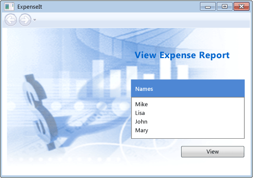
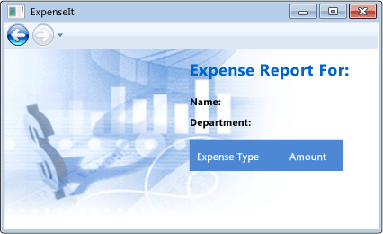
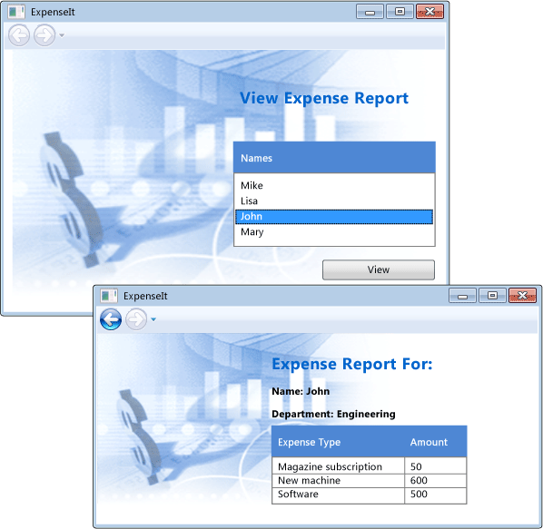

# <a name="walkthrough-my-first-wpf-desktop-application"></a>Пошаговое руководство. Создание классического приложения WPF

В этой статье показано, как разработать простое приложение Windows Presentation Foundation (WPF), которое включает элементы, которые являются общими для большинства приложений WPF: Расширяемый язык разметки приложений (XAML) разметки, кода, определения приложений, элементы управления, макет, привязки данных и стили.

В этом пошаговом руководстве включает следующие шаги:

- Используйте XAML для разработки приложения пользовательского интерфейса (UI).

- Напишите код для создания поведения приложения.

- Создайте определение приложения для управления приложением.

- Добавление элементов управления и создание макета для создания пользовательского интерфейса приложения.

- Создания таблиц стилей для согласованное отображение пользовательского интерфейса в приложении.

- Пользовательский Интерфейс привязку к данным для заполнения пользовательского интерфейса на основе данных и сохранить данные и пользовательский Интерфейс.

В конце пошагового руководства будет создать автономное приложение Windows, которое позволяет пользователям просматривать отчеты о расходах для выбранных пользователей. Приложение состоит из нескольких страниц WPF, размещаемых в окне обозревателя.

> [!TIP]
> Пример кода, который используется в этом пошаговом руководстве доступен для Visual Basic и C# в [Общие сведения о сборке приложений WPF](https://go.microsoft.com/fwlink/?LinkID=160008).

## <a name="prerequisites"></a>Предварительные требования

- Visual Studio 2017 или более поздней версии

   Дополнительные сведения об установке последней версии Visual Studio, см. в разделе [установка Visual Studio](/visualstudio/install/install-visual-studio).

## <a name="create-the-application-project"></a>Создание проекта приложения

Первым шагом является создание инфраструктуры приложений, который включает в себя определение приложения, две страницы и изображение.

1. Создание нового проекта приложения WPF в Visual Basic или Visual C# с именем **`ExpenseIt`**:

   1. Откройте Visual Studio и выберите **файл** > **New** > **проекта**.

      **Новый проект** откроется диалоговое окно.

   2. В разделе **установленные** категории, разверните **Visual C#**  или **Visual Basic** узел, а затем выберите **Windows Desktop**.

   3. Выберите **приложение WPF (.NET Framework)** шаблона. Введите имя **`ExpenseIt`** , а затем выберите **ОК**.

      

      Visual Studio создаст проект и открывает конструктор для окна приложения по умолчанию с именем **MainWindow.xaml**.

   > [!NOTE]
   > В этом пошаговом руководстве использует <xref:System.Windows.Controls.DataGrid> элемент управления, доступных в .NET Framework 4 и более поздних версиях. Быть в том, что проект предназначен для .NET Framework 4 или более поздней версии. Дополнительные сведения см. в разделе [Как определить целевую версию .NET Framework](/visualstudio/ide/how-to-target-a-version-of-the-dotnet-framework).

2. Откройте *Application.xaml* (Visual Basic) или *App.xaml* (C#).

    Этот файл XAML определяет WPF-приложение и все его ресурсы. Этот файл также используется для указания пользовательского интерфейса, автоматически отображаемого при запуске приложения; в этом случае *MainWindow.xaml*.

    В Visual Basic в XAML должен выглядеть следующим образом:

    [!code-xaml[ExpenseIt#1_A](~/samples/snippets/visualbasic/VS_Snippets_Wpf/ExpenseIt/VB/ExpenseIt1_A/Application.xaml#1_a)]

    В C# он должен выглядеть следующим образом.

    [!code-xaml[ExpenseIt#1](~/samples/snippets/csharp/VS_Snippets_Wpf/ExpenseIt/CSharp/ExpenseIt/App.xaml#1)]

3. Откройте *MainWindow.xaml*.

    Этот файл XAML представляет главное окно приложения и отображает созданное содержимое страниц. <xref:System.Windows.Window> Класс определяет свойства окна, такие как заголовок, размер и значок и обрабатывает события, такие как открытие и закрытие окна.

4. Изменение <xref:System.Windows.Window> элемент <xref:System.Windows.Navigation.NavigationWindow>, как показано в следующем XAML:

   ```xaml
   <NavigationWindow x:Class="ExpenseIt.MainWindow"
        xmlns="http://schemas.microsoft.com/winfx/2006/xaml/presentation"
        xmlns:x="http://schemas.microsoft.com/winfx/2006/xaml"
        ...
   </NavigationWindow>
   ```

   Это приложение переходит к различному содержимому вводимых пользователем данных. Вот почему основной <xref:System.Windows.Window> должно быть изменено <xref:System.Windows.Navigation.NavigationWindow>. <xref:System.Windows.Navigation.NavigationWindow> наследует все свойства <xref:System.Windows.Window>. <xref:System.Windows.Navigation.NavigationWindow> В файле XAML создает экземпляр класса <xref:System.Windows.Navigation.NavigationWindow> класса. Дополнительные сведения см. в разделе [Общие сведения о переходах](../app-development/navigation-overview.md).

5. Измените следующие свойства на <xref:System.Windows.Navigation.NavigationWindow> элемент:

    - Задайте <xref:System.Windows.Window.Title%2A> свойства "`ExpenseIt`«.

    - Задайте <xref:System.Windows.FrameworkElement.Width%2A> значение 500 пикселей.

    - Задайте <xref:System.Windows.FrameworkElement.Height%2A> свойство значение 350 пикселей.

    - Удалить <xref:System.Windows.Controls.Grid> элементов между <xref:System.Windows.Navigation.NavigationWindow> теги.

    В Visual Basic в XAML должен выглядеть следующим образом:

    [!code-xaml[ExpenseIt#2_A](~/samples/snippets/visualbasic/VS_Snippets_Wpf/ExpenseIt/VB/ExpenseIt/MainWindow.xaml#2_a)]

    В C# он должен выглядеть следующим образом.

    [!code-xaml[ExpenseIt#2](~/samples/snippets/csharp/VS_Snippets_Wpf/ExpenseIt/CSharp/ExpenseIt/MainWindow.xaml#2)]

6. Откройте *MainWindow.xaml.vb* или *MainWindow.xaml.cs*.

    Этот файл является файлом кода, который содержит код для обработки событий, объявленных в *MainWindow.xaml*. Этот файл содержит разделяемый класс для окна, определенного в XAML-коде.

7. Если вы используете C#, измените `MainWindow` класса для наследования от <xref:System.Windows.Navigation.NavigationWindow>. (В Visual Basic это происходит автоматически при изменении окна в XAML.)

   Код должен выглядеть следующим образом:

   [!code-csharp[ExpenseIt#3](~/samples/snippets/csharp/VS_Snippets_Wpf/ExpenseIt/CSharp/ExpenseIt/MainWindow.xaml.cs#3)]
   [!code-vb[ExpenseIt#3](~/samples/snippets/visualbasic/VS_Snippets_Wpf/ExpenseIt/VB/ExpenseIt1_A/MainWindow.xaml.vb#3)]

   > [!TIP]
   > Можно переключать язык кода примера кода между C# и Visual Basic в **языка** раскрывающееся меню в верхней правой части в этой статье.

## <a name="add-files-to-the-application"></a>Добавление файлов в приложение

В этом разделе вы добавите в приложение две страницы и изображение.

1. Добавьте новую страницу WPF в проект и назовите его *`ExpenseItHome.xaml`*:

   1. В **обозревателе решений**, щелкните правой кнопкой мыши **`ExpenseIt`** узел проекта и выберите **добавить** > **страницы**.

   1. В **Добавление нового элемента** диалоговое окно, **страницу (WPF)** шаблон уже выбран. Введите имя **`ExpenseItHome`**, а затем выберите **добавить**.

    Эта страница является первой страницей, которое отображается при запуске приложения. Появится список пользователей для выбора, чтобы просмотреть отчет о расходах для.

2. Откройте *`ExpenseItHome.xaml`*.

3. Задайте <xref:System.Windows.Controls.Page.Title%2A> для "`ExpenseIt - Home`«.

    В Visual Basic в XAML должен выглядеть следующим образом:

    [!code-xaml[ExpenseIt#6_A](~/samples/snippets/visualbasic/VS_Snippets_Wpf/ExpenseIt/VB/ExpenseIt1_A/ExpenseItHome.xaml#6_a)]

    А в C# он должен выглядеть следующим образом.

    [!code-xaml[ExpenseIt#6](~/samples/snippets/csharp/VS_Snippets_Wpf/ExpenseIt/CSharp/ExpenseIt2/ExpenseItHome.xaml#6)]

4. Откройте *MainWindow.xaml*.

5. Задайте <xref:System.Windows.Navigation.NavigationWindow.Source%2A> свойство <xref:System.Windows.Navigation.NavigationWindow> для "`ExpenseItHome.xaml`«.

    Этот параметр задает *`ExpenseItHome.xaml`* в качестве первой страницы, открываемой при запуске приложения. В Visual Basic в XAML должен выглядеть следующим образом:

    [!code-xaml[ExpenseIt#7_A](~/samples/snippets/visualbasic/VS_Snippets_Wpf/ExpenseIt/VB/ExpenseIt1_A/MainWindow.xaml#7_a)]

    А в C# он должен выглядеть следующим образом.

    [!code-xaml[ExpenseIt#7](~/samples/snippets/csharp/VS_Snippets_Wpf/ExpenseIt/CSharp/ExpenseIt2/MainWindow.xaml#7)]

   > [!TIP]
   > Можно также задать **источника** свойство в **Разное** категории **свойства** окна.
   >
   > 

6. Добавьте другую новую страницу WPF в проект и назовите его *ExpenseReportPage.xaml*::

   1. В **обозревателе решений**, щелкните правой кнопкой мыши **`ExpenseIt`** узел проекта и выберите **добавить** > **страницы**.

   1. В **Добавление нового элемента** диалоговое окно, **страницу (WPF)** шаблон уже выбран. Введите имя **ExpenseReportPage**, а затем выберите **добавить**.

    Эта страница будет отображаться отчет по расходам для человека, выбранного на **`ExpenseItHome`** страницы.

7. Откройте файл *ExpenseReportPage.xaml*.

8. Задайте <xref:System.Windows.Controls.Page.Title%2A> для "`ExpenseIt - View Expense`«.

    В Visual Basic в XAML должен выглядеть следующим образом:

    [!code-xaml[ExpenseIt#4_A](~/samples/snippets/visualbasic/VS_Snippets_Wpf/ExpenseIt/VB/ExpenseIt1_A/ExpenseReportPage.xaml#4_a)]

    А в C# он должен выглядеть следующим образом.

    [!code-xaml[ExpenseIt#4](~/samples/snippets/csharp/VS_Snippets_Wpf/ExpenseIt/CSharp/ExpenseIt/ExpenseReportPage.xaml#4)]

9. Откройте *ExpenseItHome.xaml.vb* и *ExpenseReportPage.xaml.vb*, или *ExpenseItHome.xaml.cs* и *ExpenseReportPage.xaml.cs*.

    При создании нового файла страницы Visual Studio автоматически создает *кода* файл. Эти файлы кода программной части обрабатывают логику, реагирующую на действия пользователя.

    Код должен выглядеть следующим образом для **`ExpenseItHome`**:

    [!code-csharp[ExpenseIt#2_5](~/samples/snippets/csharp/VS_Snippets_Wpf/ExpenseIt/CSharp/ExpenseIt2/ExpenseItHome.xaml.cs#2_5)]
    [!code-vb[ExpenseIt#2_5](~/samples/snippets/visualbasic/VS_Snippets_Wpf/ExpenseIt/VB/ExpenseIt1_A/ExpenseItHome.xaml.vb#2_5)]

    И следующим образом для **ExpenseReportPage**:

    [!code-csharp[ExpenseIt#5](~/samples/snippets/csharp/VS_Snippets_Wpf/ExpenseIt/CSharp/ExpenseIt/ExpenseReportPage.xaml.cs#5)]
    [!code-vb[ExpenseIt#5](~/samples/snippets/visualbasic/VS_Snippets_Wpf/ExpenseIt/VB/ExpenseIt1_A/ExpenseReportPage.xaml.vb#5)]

10. Добавить образ с именем *watermark.png* в проект. Можно создать собственный образ, скопируйте файл из образца кода или его [здесь](https://github.com/dotnet/docs/blob/master/docs/framework/wpf/getting-started/./media/watermark.png).

    1. Щелкните правой кнопкой мыши узел проекта и выберите **добавить** > **существующий элемент**, или нажмите клавишу **Shift**+**Alt** + **Объект**.

    2. В **добавить существующий элемент** диалоговое окно, перейдите к файлу изображения, который вы хотите использовать, а затем выберите **добавить**.

## <a name="build-and-run-the-application"></a>Построение и запуск приложения

1. Чтобы построить и запустить приложение, нажмите клавишу **F5** или выберите **начать отладку** из **Отладка** меню.

    На следующем рисунке показано приложение с помощью <xref:System.Windows.Navigation.NavigationWindow> кнопки:

    

2. Закройте приложение, чтобы вернуться в Visual Studio.

## <a name="create-the-layout"></a>Создание макета

Макет позволяет упорядочивать размещение элементов пользовательского интерфейса и также управлять их размером и положением при изменении размера пользовательского интерфейса. Обычно макет создается с одним из следующих элементов управления макетом.

- <xref:System.Windows.Controls.Canvas>
- <xref:System.Windows.Controls.DockPanel>
- <xref:System.Windows.Controls.Grid>
- <xref:System.Windows.Controls.StackPanel>
- <xref:System.Windows.Controls.VirtualizingStackPanel>
- <xref:System.Windows.Controls.WrapPanel>

Каждый из этих элементов управления макетом поддерживает специальный тип макета дочерних элементов. `ExpenseIt` размер страницы может быть изменен, и каждая страница имеет элементы, которые упорядочены по горизонтали и вертикали рядом с другими элементами. Следовательно <xref:System.Windows.Controls.Grid> является идеальным элементом макета для приложения.

> [!TIP]
> Дополнительные сведения о <xref:System.Windows.Controls.Panel> элементов, см. в разделе [Общие сведения о панелях](../controls/panels-overview.md). Дополнительные сведения о макете см. в разделе [макета](../advanced/layout.md).

В разделе создается таблица с одним столбцом с тремя строками и полями шириной 10 пикселей путем добавления определений столбцов и строк для <xref:System.Windows.Controls.Grid> в *`ExpenseItHome.xaml`*.

1. Откройте *`ExpenseItHome.xaml`*.

2. Задайте <xref:System.Windows.FrameworkElement.Margin%2A> свойство <xref:System.Windows.Controls.Grid> элемент «10,0,10,10», который соответствует слева, сверху, справа и нижнего полей:

   ```xaml
   <Grid Margin="10,0,10,10">
   ```

   > [!TIP]
   > Можно также задать **Margin** значения в **свойства** окна в разделе **макета** категории:
   >
   > 

3. Добавьте следующий XAML между <xref:System.Windows.Controls.Grid> теги, чтобы создать определения строк и столбцов:

    [!code-xaml[ExpenseIt#8](~/samples/snippets/csharp/VS_Snippets_Wpf/ExpenseIt/CSharp/ExpenseIt3/ExpenseItHome.xaml#8)]

    <xref:System.Windows.Controls.RowDefinition.Height%2A> Двух строк имеет значение <xref:System.Windows.GridLength.Auto%2A>, означающее, что размер строки на основе содержимого в строках. Значение по умолчанию <xref:System.Windows.Controls.RowDefinition.Height%2A> является <xref:System.Windows.GridUnitType.Star> изменения размера, это означает, что высота строки — это взвешенная пропорция доступного пространства. Например, если две строки имеют <xref:System.Windows.Controls.RowDefinition.Height%2A> из «*», каждый из них имеет высоту, половина доступного пространства.

    Ваш <xref:System.Windows.Controls.Grid> теперь должен выглядеть как следующий XAML:

    [!code-xaml[ExpenseIt#9](~/samples/snippets/csharp/VS_Snippets_Wpf/ExpenseIt/CSharp/ExpenseIt3/ExpenseItHome.xaml#9)]

## <a name="add-controls"></a>Добавление элементов управления

В этом разделе вы обновите пользовательский Интерфейс для отображения списка пользователей, для которых пользователь может выводиться отчет по расходам для домашней страницы. Элементы управления — это объекты пользовательского интерфейса, позволяющие пользователям взаимодействовать с приложением. Более подробную информацию см. в разделе [Элементы управления](../controls/index.md).

Чтобы создать этот пользовательский Интерфейс, нужно добавить следующие элементы для *`ExpenseItHome.xaml`*:

- <xref:System.Windows.Controls.ListBox> (для получения списка пользователей).
- <xref:System.Windows.Controls.Label> (для заголовков списка).
- <xref:System.Windows.Controls.Button> (чтобы щелкните, чтобы просмотреть отчет по расходам для человека, выбранного в списке).

Каждый элемент управления помещается в строке <xref:System.Windows.Controls.Grid> , задав <xref:System.Windows.Controls.Grid.Row%2A?displayProperty=nameWithType> вложенного свойства зависимостей. Дополнительные сведения о вложенных свойствах см. в разделе [зависимостей](../advanced/attached-properties-overview.md).

1. Откройте *`ExpenseItHome.xaml`*.

2. Добавьте следующий XAML где-то между <xref:System.Windows.Controls.Grid> теги:

   [!code-xaml[ExpenseIt#10](~/samples/snippets/csharp/VS_Snippets_Wpf/ExpenseIt/CSharp/ExpenseIt4/ExpenseItHome.xaml#10)]

   > [!TIP]
   > Также можно создать элементы управления, перетащив их из **элементов** окна в окне конструктора, а затем задав их свойства в **свойства** окна.

3. Выполните сборку и запуск приложения.

На следующем рисунке показано элементы управления, что вы только что создали:


## <a name="add-an-image-and-a-title"></a>Добавить изображение и заголовок

В этом разделе вы обновите интерфейсе пользователя домашней страницы изображение и заголовок страницы.

1. Откройте *`ExpenseItHome.xaml`*.

2. Добавьте еще один столбец для <xref:System.Windows.Controls.Grid.ColumnDefinitions%2A> с фиксированным <xref:System.Windows.Controls.ColumnDefinition.Width%2A> 230 пикселей:

    [!code-xaml[ExpenseIt#11](~/samples/snippets/csharp/VS_Snippets_Wpf/ExpenseIt/CSharp/ExpenseIt5/ExpenseItHome.xaml#11)]

3. Добавить другую строку для <xref:System.Windows.Controls.Grid.RowDefinitions%2A>, всего четыре строки:

    [!code-xaml[ExpenseIt#11b](~/samples/snippets/csharp/VS_Snippets_Wpf/ExpenseIt/CSharp/ExpenseIt5/ExpenseItHome.xaml#11b)]

4. Переместите элементы управления во второй столбец, задав <xref:System.Windows.Controls.Grid.Column%2A?displayProperty=nameWithType> свойство в значение 1, в каждом из трех элементов управления (границы, ListBox и кнопка).

5. Переместите каждый элемент управления вниз на одну строку, увеличивая его <xref:System.Windows.Controls.Grid.Row%2A?displayProperty=nameWithType> значение на 1.

   XAML для трех элементов управления теперь выглядит следующим образом:

    [!code-xaml[ExpenseIt#12](~/samples/snippets/csharp/VS_Snippets_Wpf/ExpenseIt/CSharp/ExpenseIt5/ExpenseItHome.xaml#12)]

6. Задайте <xref:System.Windows.Controls.Panel.Background%2A> из <xref:System.Windows.Controls.Grid> быть *watermark.png* файл изображения, добавив следующий XAML где-то между `<Grid>` и `</Grid>` теги:

    [!code-xaml[ExpenseIt#14](~/samples/snippets/csharp/VS_Snippets_Wpf/ExpenseIt/CSharp/ExpenseIt5/ExpenseItHome.xaml#14)]

7. Прежде чем <xref:System.Windows.Controls.Border> элемента, добавьте <xref:System.Windows.Controls.Label> с содержимым «View Expense Report». Это заголовок страницы.

    [!code-xaml[ExpenseIt#13](~/samples/snippets/csharp/VS_Snippets_Wpf/ExpenseIt/CSharp/ExpenseIt5/ExpenseItHome.xaml#13)]

8. Выполните сборку и запуск приложения.

На следующем рисунке показано только что добавленную результаты:



## <a name="add-code-to-handle-events"></a>Добавьте код для обработки событий

1. Откройте *`ExpenseItHome.xaml`*.

2. Добавить <xref:System.Windows.Controls.Primitives.ButtonBase.Click> в обработчике событий <xref:System.Windows.Controls.Button> элемент. Дополнительные сведения см. в разделе [Как Создание простого обработчика событий](https://docs.microsoft.com/previous-versions/visualstudio/visual-studio-2010/bb675300(v=vs.100)).

    [!code-xaml[ExpenseIt#15](~/samples/snippets/csharp/VS_Snippets_Wpf/ExpenseIt/CSharp/ExpenseIt6/ExpenseItHome.xaml#15)]

3. Откройте *`ExpenseItHome.xaml.vb`* или *`ExpenseItHome.xaml.cs`*.

4. Добавьте следующий код, чтобы `ExpenseItHome` класс, чтобы добавить кнопку обработчик события щелчка. Обработчик событий открывает **ExpenseReportPage** страницы.

    [!code-csharp[ExpenseIt#16](~/samples/snippets/csharp/VS_Snippets_Wpf/ExpenseIt/CSharp/ExpenseIt6/ExpenseItHome.xaml.cs#16)]
    [!code-vb[ExpenseIt#16](~/samples/snippets/visualbasic/VS_Snippets_Wpf/ExpenseIt/VB/ExpenseIt6/ExpenseItHome.xaml.vb#16)]

## <a name="create-the-ui-for-expensereportpage"></a>Создание пользовательского интерфейса для страницы ExpenseReportPage

*ExpenseReportPage.xaml* отображается отчет по расходам для человека, выбранного на **`ExpenseItHome`** страницы. В этом разделе вы создадите пользовательский Интерфейс для **ExpenseReportPage**. Вы также добавите фона и цвета для различных элементов пользовательского интерфейса заливки.

1. Откройте файл *ExpenseReportPage.xaml*.

2. Добавьте следующий XAML между <xref:System.Windows.Controls.Grid> теги:

    [!code-xaml[ExpenseIt#17](~/samples/snippets/csharp/VS_Snippets_Wpf/ExpenseIt/CSharp/ExpenseIt6/ExpenseReportPage.xaml#17)]

    Этот пользовательский Интерфейс аналогичен *`ExpenseItHome.xaml`*, за исключением, что данные отчета отображаются в <xref:System.Windows.Controls.DataGrid>.

3. Выполните сборку и запуск приложения.

    > [!NOTE]
    > Если отобразится сообщение об ошибке, <xref:System.Windows.Controls.DataGrid> не найден или не существует, убедитесь, что ваш проект предназначен для .NET Framework 4 или более поздней версии. Дополнительные сведения см. в разделе [Как определить целевую версию .NET Framework](/visualstudio/ide/how-to-target-a-version-of-the-dotnet-framework).

4. Выберите **представление** кнопки.

    Появится страница отчета по расходам. Также Обратите внимание на то, что кнопка возврата включено.

На следующем рисунке показан элементы пользовательского интерфейса, добавленные *ExpenseReportPage.xaml*.



## <a name="style-controls"></a>Определение стиля элементов управления

Внешний вид различных элементов часто является одинаковым для всех элементов одного типа в пользовательском Интерфейсе. Пользовательский Интерфейс использует [стили](../controls/styling-and-templating.md) чтобы варианты внешнего вида многократного использования для нескольких элементов. Повторное использование стилей помогает упростить создание XAML и управление ими. В этом разделе атрибуты, установленные ранее для каждого элемента, заменяются стилями.

1. Откройте *Application.xaml* или *App.xaml*.

2. Добавьте следующий XAML между <xref:System.Windows.Application.Resources%2A?displayProperty=nameWithType> теги:

    [!code-xaml[ExpenseIt#18](~/samples/snippets/csharp/VS_Snippets_Wpf/ExpenseIt/CSharp/ExpenseIt7/App.xaml#18)]

    Этот код XAML добавляет следующие стили:

    - `headerTextStyle`: Для форматирования заголовка страницы <xref:System.Windows.Controls.Label>.

    - `labelStyle`: Для форматирования <xref:System.Windows.Controls.Label> элементов управления.

    - `columnHeaderStyle`: Для форматирования <xref:System.Windows.Controls.Primitives.DataGridColumnHeader>.

    - `listHeaderStyle`: Форматирование заголовка списка <xref:System.Windows.Controls.Border> элементов управления.

    - `listHeaderTextStyle`: Форматирование заголовка списка <xref:System.Windows.Controls.Label>.

    - `buttonStyle`: Для форматирования <xref:System.Windows.Controls.Button> на `ExpenseItHome.xaml`.

    Обратите внимание на то, что стили представляют собой ресурсы и являются дочерними <xref:System.Windows.Application.Resources%2A?displayProperty=nameWithType> элемент свойства. Здесь стили применяются ко всем элементам в приложении. Пример использования ресурсов в приложении .NET Framework, см. в разделе [использование ресурсов приложения](../advanced/how-to-use-application-resources.md).

3. Откройте *`ExpenseItHome.xaml`*.

4. Замените весь код между <xref:System.Windows.Controls.Grid> элементов при помощи следующих XAML:

    [!code-xaml[ExpenseIt#19](~/samples/snippets/csharp/VS_Snippets_Wpf/ExpenseIt/CSharp/ExpenseIt7/ExpenseItHome.xaml#19)]

    Свойства, определяющие внешний вид элементов управления, такие как <xref:System.Windows.VerticalAlignment> и <xref:System.Windows.Media.FontFamily> , при применении стилей удаляются и заменяются. Например `headerTextStyle` применяется к «View Expense Report» <xref:System.Windows.Controls.Label>.

5. Откройте файл *ExpenseReportPage.xaml*.

6. Замените весь код между <xref:System.Windows.Controls.Grid> элементов при помощи следующих XAML:

    [!code-xaml[ExpenseIt#20](~/samples/snippets/csharp/VS_Snippets_Wpf/ExpenseIt/CSharp/ExpenseIt7/ExpenseReportPage.xaml#20)]

    В элементы <xref:System.Windows.Controls.Label> и <xref:System.Windows.Controls.Border> будут добавлены стили.

## <a name="bind-data-to-a-control"></a>Привязка данных к элементу управления

В этом разделе вы создадите XML-данных, привязанный к различным элементам управления.

1. Откройте *`ExpenseItHome.xaml`*.

2. После открывающего <xref:System.Windows.Controls.Grid> элемента, добавьте следующий XAML для создания <xref:System.Windows.Data.XmlDataProvider> , содержащий данные для каждого пользователя:

    [!code-xaml[ExpenseIt#21](~/samples/snippets/csharp/VS_Snippets_Wpf/ExpenseIt/CSharp/ExpenseIt8/ExpenseItHome.xaml#21)]
    [!code-xaml[ExpenseIt#23](~/samples/snippets/csharp/VS_Snippets_Wpf/ExpenseIt/CSharp/ExpenseIt8/ExpenseItHome.xaml#23)]
    [!code-xaml[ExpenseIt#22](~/samples/snippets/csharp/VS_Snippets_Wpf/ExpenseIt/CSharp/ExpenseIt8/ExpenseItHome.xaml#22)]

    Данные создаются как <xref:System.Windows.Controls.Grid> ресурсов. Обычно такие данные загружаются в виде файла, но для простоты в этом примере они добавляются в коде.

3. В рамках `<Grid.Resources>` элемента, добавьте следующий <xref:System.Windows.DataTemplate>, который определяет способ отображения данных в <xref:System.Windows.Controls.ListBox>:

    [!code-xaml[ExpenseIt#21](~/samples/snippets/csharp/VS_Snippets_Wpf/ExpenseIt/CSharp/ExpenseIt8/ExpenseItHome.xaml#21)]
    [!code-xaml[ExpenseIt#24](~/samples/snippets/csharp/VS_Snippets_Wpf/ExpenseIt/CSharp/ExpenseIt8/ExpenseItHome.xaml#24)]
    [!code-xaml[ExpenseIt#22](~/samples/snippets/csharp/VS_Snippets_Wpf/ExpenseIt/CSharp/ExpenseIt8/ExpenseItHome.xaml#22)]

    Дополнительные сведения о шаблонах данных см. в разделе [Общие сведения о шаблонах данных](../data/data-templating-overview.md).

4. Замените существующий <xref:System.Windows.Controls.ListBox> с следующем XAML:

    [!code-xaml[ExpenseIt#25](~/samples/snippets/csharp/VS_Snippets_Wpf/ExpenseIt/CSharp/ExpenseIt8/ExpenseItHome.xaml#25)]

    Этот XAML привязывает <xref:System.Windows.Controls.ItemsControl.ItemsSource%2A> свойство <xref:System.Windows.Controls.ListBox> к источнику данных и применяет шаблон данных как <xref:System.Windows.Controls.ItemsControl.ItemTemplate%2A>.

## <a name="connect-data-to-controls"></a>Подключение данных к элементам управления

Далее добавим код для извлечения имени, выбранного на **`ExpenseItHome`** странице и передать его конструктору **ExpenseReportPage**. **ExpenseReportPage** задает контекст данных для переданного элемента, который является то, что элементы управления, определенные в *ExpenseReportPage.xaml* привязки.

1. Откройте файл *ExpenseReportPage.xaml.vb* или *ExpenseReportPage.xaml.cs*.

2. Добавьте конструктор, принимающий объект, чтобы можно было передавать данные отчета о затратах выбранного человека.

    [!code-csharp[ExpenseIt#26](~/samples/snippets/csharp/VS_Snippets_Wpf/ExpenseIt/CSharp/ExpenseIt8/ExpenseReportPage.xaml.cs#26)]
    [!code-vb[ExpenseIt#26](~/samples/snippets/visualbasic/VS_Snippets_Wpf/ExpenseIt/VB/ExpenseIt8/ExpenseReportPage.xaml.vb#26)]

3. Откройте *`ExpenseItHome.xaml.vb`* или *`ExpenseItHome.xaml.cs`*.

4. Изменение <xref:System.Windows.Controls.Primitives.ButtonBase.Click> обработчик событий для вызова новый конструктор, передавая отчета о затратах выбранного человека.

    [!code-csharp[ExpenseIt#27](~/samples/snippets/csharp/VS_Snippets_Wpf/ExpenseIt/CSharp/ExpenseIt8/ExpenseItHome.xaml.cs#27)]
    [!code-vb[ExpenseIt#27](~/samples/snippets/visualbasic/VS_Snippets_Wpf/ExpenseIt/VB/ExpenseIt8/ExpenseItHome.xaml.vb#27)]

## <a name="style-data-with-data-templates"></a>Стиль данных с помощью шаблонов данных

В этом разделе вы обновите пользовательский Интерфейс для каждого элемента в списках с привязкой к данным с помощью шаблонов данных.

1. Откройте файл *ExpenseReportPage.xaml*.

2. Привяжите содержимое «Name» и «Отдел» <xref:System.Windows.Controls.Label> свойство источника элементов, соответствующих данных. Дополнительные сведения о привязке данных см. в разделе [Общие сведения о привязке данных](../data/data-binding-overview.md).

    [!code-xaml[ExpenseIt#31](~/samples/snippets/csharp/VS_Snippets_Wpf/ExpenseIt/CSharp/ExpenseIt9/ExpenseReportPage.xaml#31)]

3. После открывающего <xref:System.Windows.Controls.Grid> элемента, добавьте следующие шаблоны данных, которые определяют способ отображения данных отчета о расходах:

    [!code-xaml[ExpenseIt#30](~/samples/snippets/csharp/VS_Snippets_Wpf/ExpenseIt/CSharp/ExpenseIt9/ExpenseReportPage.xaml#30)]

4. Замените <xref:System.Windows.Controls.DataGridTextColumn> элементов при помощи <xref:System.Windows.Controls.DataGridTemplateColumn> под <xref:System.Windows.Controls.DataGrid> элемента и примените шаблоны к ним.

    [!code-xaml[ExpenseIt#32](~/samples/snippets/csharp/VS_Snippets_Wpf/ExpenseIt/CSharp/ExpenseIt9/ExpenseReportPage.xaml#32)]

5. Выполните сборку и запуск приложения.

6. Выберите "person", а затем выберите **представление** кнопки.

На следующем рисунке показан обе страницы `ExpenseIt` приложения с помощью элементов управления, макет, стили, привязку данных и примененными шаблонами данных:



> [!NOTE]
> В этом примере демонстрируется конкретная функциональная возможность WPF и не выполните все рекомендации по безопасности, локализации и специальных возможностей. Исчерпывающая информация о WPF и рекомендации по разработке приложений .NET Framework см. в следующих разделах:
>
> - [Специальные возможности](../../ui-automation/accessibility-best-practices.md)
>
> - [Безопасность](../security-wpf.md)
>
> - [Глобализация и локализация WPF](../advanced/wpf-globalization-and-localization-overview.md)
>
> - [Производительности WPF](../advanced/optimizing-wpf-application-performance.md)

## <a name="next-steps"></a>Следующие шаги

В этом пошаговом руководстве вы узнали ряд методов для создания пользовательского интерфейса с помощью Windows Presentation Foundation (WPF). Теперь вы должны основные стандартные блоки приложения .NET Framework с данными. Более подробную информацию об архитектуре и моделях программирования WPF см. в следующих разделах:

- [Архитектура WPF](../advanced/wpf-architecture.md)
- [Обзор XAML (WPF)](../advanced/xaml-overview-wpf.md)
- [Общие сведения о свойствах зависимости](../advanced/dependency-properties-overview.md)
- [Макет](../advanced/layout.md)

Более подробную информацию о создании приложений см. в следующих разделах:

- [Разработка приложений](../app-development/index.md)
- [Элементы управления](../controls/index.md)
- [Общие сведения о привязке данных](../data/data-binding-overview.md)
- [Графика и мультимедиа](../graphics-multimedia/index.md)
- [Документы в WPF](../advanced/documents-in-wpf.md)

## <a name="see-also"></a>См. также

- [Общие сведения о панелях](../controls/panels-overview.md)
- [Общие сведения о шаблонах данных](../data/data-templating-overview.md)
- [Построение приложения WPF](../app-development/building-a-wpf-application-wpf.md)
- [Стили и шаблоны](../controls/styles-and-templates.md)
