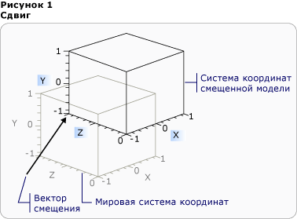

# Обзор 3D трансформаций3D Transformations Overview
Эта тема описывает, как применять преобразования к [!INCLUDE[TLA#tla_winclient](../../../../includes/tlasharptla-winclient-md.md)] 3D-моделям в графической системе.This topic describes how to apply transformations to 3D models in the [!INCLUDE[TLA#tla_winclient](../../../../includes/tlasharptla-winclient-md.md)] graphics system. Преобразования позволяют разработчикам перемещать модели, изменять их размер и направление, при этом не затрагивая их базовые определяющие значения.Transformations allow the developer to reposition, resize, and reorient models without changing the base values that define them.  

## 3D Координация пространства3D Coordinate Space  
 3D графический [!INCLUDE[TLA#tla_winclient](../../../../includes/tlasharptla-winclient-md.md)] контент в инкапсулируется в элементе, <xref:System.Windows.Controls.Viewport3D>который может участвовать в двухмерной структуре элемента.3D graphics content in [!INCLUDE[TLA#tla_winclient](../../../../includes/tlasharptla-winclient-md.md)] is encapsulated in an element, <xref:System.Windows.Controls.Viewport3D>, that can participate in the two-dimensional element structure. Графическая система рассматривает Viewport3D как двумерный визуальный элемент, подобный многим другим в [!INCLUDE[TLA#tla_winclient](../../../../includes/tlasharptla-winclient-md.md)].The graphics system treats Viewport3D as a two-dimensional visual element like many others in [!INCLUDE[TLA#tla_winclient](../../../../includes/tlasharptla-winclient-md.md)]. Viewport3D функционирует как окно — окно просмотра — трехмерной сцены.Viewport3D functions as a window—a viewport—into a three-dimensional scene. Точнее, это поверхность, на которой проецируется 3D-сцена.More accurately, it is a surface on which a 3D scene is projected.  Хотя вы можете использовать Viewport3D с другими 2D-объектами рисования на том же графике сцены, вы не можете пересекать 2D и 3D объекты внутри Viewport3D.Although you can use Viewport3D with other 2D drawing objects in the same scene graph, you cannot interpenetrate 2D and 3D objects within a Viewport3D. В следующем обсуждении описанное координатное пространство расположено в элементе Viewport3D.In the following discussion, the coordinate space described is contained by the Viewport3D element.  
  
 Система [!INCLUDE[TLA#tla_winclient](../../../../includes/tlasharptla-winclient-md.md)] координат для 2D графики находит происхождение в верхнем левом углу поверхности рендеринга (обычно экран).The [!INCLUDE[TLA#tla_winclient](../../../../includes/tlasharptla-winclient-md.md)] coordinate system for 2D graphics locates the origin in the upper left of the rendering surface (typically the screen). В 2D-системе положительные значения x-оси идут вправо, а положительные значения y-оси продолжаются вниз.In the 2D system, positive x-axis values proceed to the right and positive y-axis values proceed downward. В системе 3D-координат, однако, происхождение находится в центре экрана, с положительными значениями x-оси, протекающими вправо, но положительные значения y-оси, протекающие вверх, и положительные значения z-оси, исходящими наружу от происхождения, к зритель.In the 3D coordinate system, however, the origin is located in the center of the screen, with positive x-axis values proceeding to the right but positive y-axis values proceeding upward instead, and positive z-axis values proceeding outward from the origin, toward the viewer.  
  
   
Сравнение системы координатCoordinate System Comparison  
  
 Пространство, определяемое этими осями, является [!INCLUDE[TLA#tla_winclient](../../../../includes/tlasharptla-winclient-md.md)]стационарной рамкой отсчета для 3D-объектов в .The space defined by these axes is the stationary frame of reference for 3D objects in [!INCLUDE[TLA#tla_winclient](../../../../includes/tlasharptla-winclient-md.md)]. При построении моделей в этом пространстве и создании источников света и камер для их отображения необходимо отличать стационарную систему отсчета координат ("мировую систему координат") от локальной системы отсчета, которая создается для каждой модели при применении к ней преобразований.As you build models in this space and create lights and cameras to view them, it's helpful to distinguish this stationary frame of reference, or "world space," from the local frame of reference you create for each model when you apply transformations to it. Помните, что в зависимости от освещения и настроек камеры объекты в мировой системе координат могут выглядеть различным образом или быть полностью невидимыми. При этом положение камеры не изменяет расположения объектов в мировой системе координат.Remember also that objects in world space might look entirely different, or not be visible at all, depending on light and camera settings, but the position of the camera does not change the location of objects in world space.  
  
## Преобразование моделейTransforming Models  
 При создании моделей в сцене им задается определенное местоположение.When you create models, they have a particular location in the scene. Для поворота моделей, изменения их размера или перемещения внутри сцены не следует изменять вершины, определяющие сами модели.To move those models around in the scene, to rotate them, or to change their size, it's not practical to change the vertices that define the models themselves. Вместо этого, как и в 2D, вы применяете преобразования к моделям.Instead, just as in 2D, you apply transformations to models.  
  
 Каждый объект <xref:System.Windows.Media.Media3D.Model3D.Transform%2A> модели имеет свойство, с помощью которого можно перемещать, переориентировать или изменить размер модели.Each model object has a <xref:System.Windows.Media.Media3D.Model3D.Transform%2A> property with which you can move, re-orient, or resize the model. При применении преобразования все точки модели фактически смещаются с помощью определенного вектора или значения, заданного преобразованием.When you apply a transform, you effectively offset all the points of the model by whatever vector or value is specified by the transform. Другими словами, выполняется преобразование координатного пространства, в котором определена модель ("пространство модели"), при этом значения, составляющие геометрию модели в системе координат всей сцены ("мировое пространство"), не изменяются.In other words, you've transformed the coordinate space in which the model is defined ("model space"), but you haven't changed the values that make up the model's geometry in the coordinate system of the entire scene ("world space").  
  
## Преобразования переводаTranslation Transformations  
 3D-преобразования наследуют от <xref:System.Windows.Media.Media3D.Transform3D>абстрактного базового класса; они включают в себя <xref:System.Windows.Media.Media3D.TranslateTransform3D> <xref:System.Windows.Media.Media3D.ScaleTransform3D>классы <xref:System.Windows.Media.Media3D.RotateTransform3D>преобразования affine, и .3D transformations inherit from the abstract base class <xref:System.Windows.Media.Media3D.Transform3D>; these include the affine transform classes <xref:System.Windows.Media.Media3D.TranslateTransform3D>, <xref:System.Windows.Media.Media3D.ScaleTransform3D>, and <xref:System.Windows.Media.Media3D.RotateTransform3D>. 3D-система [!INCLUDE[TLA#tla_winclient](../../../../includes/tlasharptla-winclient-md.md)] также <xref:System.Windows.Media.Media3D.MatrixTransform3D> предоставляет класс, который позволяет указывать те же преобразования в более кратких матричных операциях.The [!INCLUDE[TLA#tla_winclient](../../../../includes/tlasharptla-winclient-md.md)] 3D system also provides a <xref:System.Windows.Media.Media3D.MatrixTransform3D> class that lets you specify the same transformations in more concise matrix operations.  
  
 <xref:System.Windows.Media.Media3D.TranslateTransform3D>перемещает все точки в Model3D в направлении офсетного <xref:System.Windows.Media.Media3D.TranslateTransform3D.OffsetX%2A> <xref:System.Windows.Media.Media3D.TranslateTransform3D.OffsetY%2A>вектора, указанного с помощью, и <xref:System.Windows.Media.Media3D.TranslateTransform3D.OffsetZ%2A> свойств.<xref:System.Windows.Media.Media3D.TranslateTransform3D> moves all the points in the Model3D in the direction of the offset vector you specify with the <xref:System.Windows.Media.Media3D.TranslateTransform3D.OffsetX%2A>, <xref:System.Windows.Media.Media3D.TranslateTransform3D.OffsetY%2A>, and <xref:System.Windows.Media.Media3D.TranslateTransform3D.OffsetZ%2A> properties. Например, если задать вершине куба с координатами (2, 2, 2) вектор смещения (0, 1,6, 1), то вершина (2, 2, 2) будет перемещена в точку (2, 3,6, 3).For example, given one vertex of a cube at (2,2,2), an offset vector of (0,1.6,1) would move that vertex (2,2,2) to (2,3.6,3). В пространстве модели вершина куба останется в точке (2, 2, 2), но, поскольку связь пространства модели с мировым пространством изменилась, координата пространства модели (2, 2, 2) будет находиться в точке (2, 3,6, 3) мирового пространства.The cube's vertex is still (2,2,2) in model space, but now that model space has changed its relationship to world space so that (2,2,2) in model space is (2,3.6,3) in world space.  
  
   
Перевод со смещениемTranslation with Offset  
  
 В следующем примере кода показано, как применить перевод.The following code examples show how to apply a translation.  
  
 [!code-xaml[animation3dgallery_snip#Translation3DAnimationExampleWholePage](~/samples/snippets/csharp/VS_Snippets_Wpf/Animation3DGallery_snip/CS/Translation3DAnimationExample.xaml#translation3danimationexamplewholepage)]  
  
## Преобразования масштабаScale Transformations  
 <xref:System.Windows.Media.Media3D.ScaleTransform3D>изменение масштаба модели на определенный вектор масштаба со ссылкой на центральную точку.<xref:System.Windows.Media.Media3D.ScaleTransform3D> changes the model's scale by a specified scale vector with reference to a center point. Укажите единый масштаб, который масштабирует модель по осям X, Y и Z для пропорционального изменения ее размера.Specify a uniform scale, which scales the model by the same value in the X, Y, and Z axes, to change the model's size proportionally. Например, установка преобразования <xref:System.Windows.Media.ScaleTransform.ScaleX%2A> <xref:System.Windows.Media.ScaleTransform.ScaleY%2A>и <xref:System.Windows.Media.Media3D.ScaleTransform3D.ScaleZ%2A> свойств на 0,5 половины размера модели; установка одних и тех же свойств до 2 удваивает его масштаб во всех трех осях.For example, setting the transform's <xref:System.Windows.Media.ScaleTransform.ScaleX%2A>, <xref:System.Windows.Media.ScaleTransform.ScaleY%2A>, and <xref:System.Windows.Media.Media3D.ScaleTransform3D.ScaleZ%2A> properties to 0.5 halves the size of the model; setting the same properties to 2 doubles its scale in all three axes.  
  
   
Пример ScaleVectorScaleVector Example  
  
 Указание преобразования неоднородной шкалы (т. е. шкалы, значения X, Y и Z которой отличаются) может привести к растягиванию или сжатию модели в одном или двух измерениях без изменения по остальным.By specifying a non-uniform scale transformation—a scale transformation whose X, Y, and Z values are not all the same—you can cause a model to stretch or contract in one or two dimensions without affecting the others. Например, <xref:System.Windows.Media.ScaleTransform.ScaleX%2A> установка до <xref:System.Windows.Media.ScaleTransform.ScaleY%2A> 1, <xref:System.Windows.Media.Media3D.ScaleTransform3D.ScaleZ%2A> до 2 и 1 приведет к удвоению модели в высоту, но останется неизменной вдоль осей X и No.For example, setting <xref:System.Windows.Media.ScaleTransform.ScaleX%2A> to 1, <xref:System.Windows.Media.ScaleTransform.ScaleY%2A> to 2, and <xref:System.Windows.Media.Media3D.ScaleTransform3D.ScaleZ%2A> to 1 would cause the transformed model to double in height but remain unchanged along the X and Z axes.  
  
 По умолчанию ScaleTransform3D растягивает или сжимает вершины по отношению к началу координат (0, 0, 0).By default, ScaleTransform3D causes vertices to expand or contract about the origin (0,0,0). Но если преобразуемая модель строится не от начала координат, то при ее масштабировании от начала координат она будет находиться "не на своем месте"If the model you want to transform is not drawn from the origin, however, scaling the model from the origin will not scale the model "in place." В то же время, если вершины модели умножаются на вектор масштабирования, операция масштабирования приведет и к преобразованию модели, и к ее масштабированию.Instead, when the model's vertices are multiplied by the scale vector, the scale operation will have the effect of translating the model as well as scaling it.  
  
   
Пример центра масштабированияScale Center Example  
  
 Чтобы масштабировать модель "на месте", укажите центр модели, установив <xref:System.Windows.Media.ScaleTransform.CenterX%2A>ScaleTransform3D, <xref:System.Windows.Media.ScaleTransform.CenterY%2A>и <xref:System.Windows.Media.Media3D.ScaleTransform3D.CenterZ%2A> свойства.To scale a model "in place," specify the center of the model by setting the ScaleTransform3D's <xref:System.Windows.Media.ScaleTransform.CenterX%2A>, <xref:System.Windows.Media.ScaleTransform.CenterY%2A>, and <xref:System.Windows.Media.Media3D.ScaleTransform3D.CenterZ%2A> properties. Это гарантирует, что графическая система масштабирует пространство модели, а <xref:System.Windows.Media.Media3D.Point3D>затем переводит его в центр указанного.This ensures that the graphics system scales the model space and then translates it to center on the specified <xref:System.Windows.Media.Media3D.Point3D>. В обратном случае, если для построенной относительно начала координат модели указана другая центральная точка, модель будет преобразована из начала координат.Conversely, if you've built the model about the origin and specify a different center point, expect to see the model translated away from the origin.  
  
## Преобразования поворотаRotation Transformations  
 Можно повернуть модель в 3D несколькими способами.You can rotate a model in 3D in several different ways. При обычном преобразовании поворота указываются ось и угол поворота вокруг этой оси.A typical rotation transformation specifies an axis and an angle of rotation around that axis. Класс <xref:System.Windows.Media.Media3D.RotateTransform3D> позволяет определить с <xref:System.Windows.Media.Media3D.Rotation3D> его <xref:System.Windows.Media.Media3D.RotateTransform3D.Rotation%2A> свойством.The <xref:System.Windows.Media.Media3D.RotateTransform3D> class allows you to define a <xref:System.Windows.Media.Media3D.Rotation3D> with its <xref:System.Windows.Media.Media3D.RotateTransform3D.Rotation%2A> property. Затем вы <xref:System.Windows.Media.Media3D.AxisAngleRotation3D.Axis%2A> <xref:System.Windows.Media.Media3D.AxisAngleRotation3D.Angle%2A> указываете и свойства на Rotation3D, в данном <xref:System.Windows.Media.Media3D.AxisAngleRotation3D>случае, для определения преобразования.You then specify <xref:System.Windows.Media.Media3D.AxisAngleRotation3D.Axis%2A> and <xref:System.Windows.Media.Media3D.AxisAngleRotation3D.Angle%2A> properties on the Rotation3D, in this case an <xref:System.Windows.Media.Media3D.AxisAngleRotation3D>, to define the transformation. В следующих примерах модель поворачивается на 60 градусов вокруг оси Y.The following examples rotate a model by 60 degrees around the Y axis.  
  
 [!code-xaml[animation3dgallery_snip#Rotate3DUsingAxisAngleRotation3DExampleWholePage](~/samples/snippets/csharp/VS_Snippets_Wpf/Animation3DGallery_snip/CS/Rotat3DUsingAxisAngleRotation3DExample.xaml#rotate3dusingaxisanglerotation3dexamplewholepage)]  
  
 Примечание:[!INCLUDE[TLA#tla_winclient](../../../../includes/tlasharptla-winclient-md.md)] 3D является правой системой, что означает, что положительное значение угла для вращения приводит к вращению против часовой стрелки вокруг оси.Note:[!INCLUDE[TLA#tla_winclient](../../../../includes/tlasharptla-winclient-md.md)] 3D is a right-handed system, which means that a positive angle value for a rotation results in a counter-clockwise rotation about the axis.  
  
 Вращения axis-angle предполагают вращение о происхождении, <xref:System.Windows.Media.Media3D.RotateTransform3D.CenterY%2A>если <xref:System.Windows.Media.Media3D.RotateTransform3D.CenterZ%2A> значение не определено для <xref:System.Windows.Media.Media3D.RotateTransform3D.CenterX%2A>, и свойства на RotateTransform3D.Axis-angle rotations assume rotation about the origin if a value is not specified for the <xref:System.Windows.Media.Media3D.RotateTransform3D.CenterX%2A>, <xref:System.Windows.Media.Media3D.RotateTransform3D.CenterY%2A>, and <xref:System.Windows.Media.Media3D.RotateTransform3D.CenterZ%2A> properties on RotateTransform3D. Как и при масштабировании, следует помнить, что при повороте преобразуется все координатное пространство модели целиком.As with scaling, it's helpful to remember that the rotation transforms the model's entire coordinate space. Если модель была создана не от начала координат или была преобразована ранее, то поворот может быть произведен относительно начала координат, а не относительно местоположения модели.If the model was not created about the origin, or has been translated previously, the rotation might "pivot" about the origin instead of rotating in place.  
  
   
Поворот с указанием новой центральной точкиRotation with new center specified  
  
 Чтобы повернуть модель "на месте", следует указать фактический центр модели в качестве центра поворота.To rotate the model "in place," specify the model's actual center as the center of rotation. Геометрия обычно моделируется от начала координат, поэтому для получения ожидаемого результата от набора преобразований необходимо вначале изменить размер модели (т. е. отмасштабировать), задать ее направление (повернуть), а затем перенести ее в нужное место (преобразовать).Because geometry is typically modeled about the origin, you can most often get the expected result of a set of transformations by first sizing the model (scaling it), then setting its orientation (rotating it), and finally moving it to the desired location (translating it).  
  
   
Пример поворотаRotation Example  
  
 Осе-угловой поворот подходит для статических преобразований и некоторых анимаций.Axis-angle rotations work well for static transformations and some animations. Тем не менее рассмотрим поворот модели куба на 60 градусов вокруг оси X, а затем на 45 градусов вокруг оси Z.However, consider rotating a cube model 60 degrees around the X axis, then 45 degrees around the Z axis. Это преобразование можно описать как два отдельных аффинных преобразования или как матрицу.You can describe this transformation as two discrete affine transformations, or as a matrix. Тем не менее плавно анимировать поворот, определенный таким образом, может быть достаточно трудно.However, it might be difficult to smoothly animate a rotation defined this way. Несмотря на то что начальные и конечные позиции вычисляемой модели совпадают, промежуточные положения модели не определены при вычислении.Although the beginning and ending positions of the model computed by either approach are the same, the intermediate positions taken by the model are computationally uncertain. Кватернионы представляют собой альтернативный способ вычисления интерполяции между начальной и конечной точками поворота.Quaternions represent an alternative way to compute the interpolation between the start and end of a rotation.  
  
 Кватернион представляет ось в 3D-пространстве и поворот вокруг этой оси.A quaternion represents an axis in 3D space and a rotation around that axis. Например, кватернион может быть представлен осью (1, 1, 2) и поворотом на 50 градусов.For example, a quaternion might represent a (1,1,2) axis and a rotation of 50 degrees. Возможности определения поворотов с помощью кватернионов зависят от двух операций, которые могут быть выполнены над ними: композиции и интерполяции.Quaternions’ power in defining rotations comes from the two operations that you can perform on them: composition and interpolation. Композиция из двух кватернионов, применяемая к геометрическому объекту, означает "поворот геометрического объекта вокруг axis2 на угол rotation2, затем — вокруг axis1 на угол rotation1".The composition of two quaternions applied to a geometry means "rotate the geometry around axis2 by rotation2, then rotate it around axis1 by rotation1." С помощью композиции можно объединить два поворота геометрического объекта для получения одного квантериона, представляющего собой результат.By using composition, you can combine the two rotations on the geometry to get a single quaternion that represents the result. Поскольку интерполяция кватернионов позволяет вычислить плавный и наиболее подходящий путь от одной оси и ориентацию относительно другой, разработчик может выполнить интерполяцию из исходного кватерниона в результирующий для достижения плавного перехода от одного к другому. Это позволит анимировать преобразование.Because quaternion interpolation can calculate a smooth and reasonable path from one axis and orientation to another, you can interpolate from the original to the composed quaternion to achieve a smooth transition from one to the other, enabling you to animate the transformation. Для моделей, которые вы хотите анимировать, вы можете указать пункт назначения <xref:System.Windows.Media.Media3D.Quaternion> для вращения, используя <xref:System.Windows.Media.Media3D.QuaternionRotation3D> для <xref:System.Windows.Media.Media3D.RotateTransform3D.Rotation%2A> свойства.For models that you want to animate, you can specify a destination <xref:System.Windows.Media.Media3D.Quaternion> for the rotation by using a <xref:System.Windows.Media.Media3D.QuaternionRotation3D> for the <xref:System.Windows.Media.Media3D.RotateTransform3D.Rotation%2A> property.  
  
## Использование коллекции преобразованийUsing Transformation Collections  
 При построении сцены обычно применяется несколько преобразований модели.When building a scene, it's common to apply more than one transformation to a model. Добавьте преобразования <xref:System.Windows.Media.Media3D.Transform3DGroup.Children%2A> в коллекцию <xref:System.Windows.Media.Media3D.Transform3DGroup> класса, чтобы группировать преобразования удобно для применения к различным моделям в сцене.Add transforms to the <xref:System.Windows.Media.Media3D.Transform3DGroup.Children%2A> collection of the <xref:System.Windows.Media.Media3D.Transform3DGroup> class to group transforms conveniently to apply to various models in the scene. Часто удобно повторно использовать преобразование в нескольких различных группах (подобно повторному использованию модели путем применения разных наборов преобразований к экземплярам).It's often convenient to reuse a transformation in several different groups, in much the way that you can reuse a model by applying a different set of transforms to each instance. Обратите внимание, что порядок добавления преобразований в коллекцию имеет значение: преобразования в коллекции применяются начиная с первого.Note that order in which the transformations are added to the collection is significant: transforms in the collection are applied from first to last.  
  
## Анимация преобразованийAnimating Transformations  
 3D-реализация [!INCLUDE[TLA#tla_winclient](../../../../includes/tlasharptla-winclient-md.md)] участвует в той же системе синхронизации и анимации, что и 2D-графика.The [!INCLUDE[TLA#tla_winclient](../../../../includes/tlasharptla-winclient-md.md)] 3D implementation participates in the same timing and animation system as 2D graphics. Другими словами, чтобы оживить 3D-сцену, оживить свойства своих моделей.In other words, to animate a 3D scene, animate the properties of its models. Можно непосредственно анимировать свойства примитивов, но обычно проще анимировать преобразования, изменяющие позицию или внешний вид моделей.It's possible to animate properties of primitives directly, but it's typically easier to animate transformations that change the position or appearance of models. Поскольку преобразования могут <xref:System.Windows.Media.Media3D.Model3DGroup> быть применены как к объектам, так и к отдельным моделям, можно применить один набор анимаций к детям Model3Dgroup и другой набор анимаций к группе объектов.Because transformations can be applied to <xref:System.Windows.Media.Media3D.Model3DGroup> objects as well as individual models, it's possible to apply one set of animations to the children of a Model3Dgroup and another set of animations to a group of objects.  Дополнительные сведения о системе времени и анимации [!INCLUDE[TLA#tla_winclient](../../../../includes/tlasharptla-winclient-md.md)] см. в разделах [Общие сведения об эффектах анимации](animation-overview.md) и [Общие сведения о Storyboard](storyboards-overview.md).For background information on the [!INCLUDE[TLA#tla_winclient](../../../../includes/tlasharptla-winclient-md.md)] timing and animation system, see [Animation Overview](animation-overview.md) and [Storyboards Overview](storyboards-overview.md).  
  
 Для анимации объекта в приложении [!INCLUDE[TLA#tla_winclient](../../../../includes/tlasharptla-winclient-md.md)] создайте временную шкалу, определите анимацию (которая изменяет значение некоторого свойства во времени) и укажите свойство, к которому применяется анимация.To animate an object in [!INCLUDE[TLA#tla_winclient](../../../../includes/tlasharptla-winclient-md.md)], create a timeline, define an animation (which is really a change in some property value over time), and specify the property to which to apply the animation. Это свойство должно быть свойством элемента FrameworkElement.This property must be a property of a FrameworkElement. Поскольку все объекты в 3D-сцене являются детьми Viewport3D, свойства, на которые нацелена любая анимация, которую вы хотите применить к сцене, являются свойствами свойств Viewport3D.Because all the objects in a 3D scene are children of Viewport3D, the properties targeted by any animation you want to apply to the scene are properties of properties of Viewport3D. Важно правильно указать путь к свойству для анимации, так как синтаксис может быть подробным.It's important to work out the property path for the animation carefully, because the syntax can be verbose.  
  
 Предположим, требуется повернуть объект на месте, а также применить качательное движение, чтобы лучше показать объект.Suppose you want to rotate an object in place, but also to apply a swinging motion to expose more of the object to view. Можно применить к модели класс RotateTransform3D и анимировать ее ось вращения от одного вектора к другому.You might choose to apply a RotateTransform3D to the model, and animate the axis of its rotation from one vector to another. Следующий пример кода демонстрирует <xref:System.Windows.Media.Animation.Vector3DAnimation> применение к свойству Axis вращения 3D преобразования, предполагая, что RotateTransform3D будет одним <xref:System.Windows.Media.TransformGroup>из нескольких преобразований, применяемых к модели с помощью .The following code example demonstrates applying a <xref:System.Windows.Media.Animation.Vector3DAnimation> to the Axis property of the transformation's Rotation3D, assuming the RotateTransform3D to be one of several transforms applied to the model with a <xref:System.Windows.Media.TransformGroup>.  
  
 [!code-csharp[3doverview#3DOverview3DN1](~/samples/snippets/csharp/VS_Snippets_Wpf/3DOverview/CSharp/Window1.xaml.cs#3doverview3dn1)]
 [!code-vb[3doverview#3DOverview3DN1](~/samples/snippets/visualbasic/VS_Snippets_Wpf/3DOverview/visualbasic/window1.xaml.vb#3doverview3dn1)]  
  
 [!code-csharp[3doverview#3DOverview3DN3](~/samples/snippets/csharp/VS_Snippets_Wpf/3DOverview/CSharp/Window1.xaml.cs#3doverview3dn3)]
 [!code-vb[3doverview#3DOverview3DN3](~/samples/snippets/visualbasic/VS_Snippets_Wpf/3DOverview/visualbasic/window1.xaml.vb#3doverview3dn3)]  
  
 Используйте аналогичный синтаксис для других свойств преобразования, чтобы переместить или отмасштабировать объект.Use a similar syntax to target other transformation properties to move or scale the object.  Например, можно применить <xref:System.Windows.Media.Animation.Point3DAnimation> свойство ScaleCenter в преобразовании масштаба, чтобы заставить модель плавно исказить ее форму.For example, you might apply a <xref:System.Windows.Media.Animation.Point3DAnimation> to the ScaleCenter property on a scale transform to cause a model to smoothly distort its shape.  
  
 Хотя предыдущие примеры преобразуют <xref:System.Windows.Media.Media3D.GeometryModel3D>свойства, также возможно трансформировать свойства других моделей в сцене.Although the preceding examples transform the properties of <xref:System.Windows.Media.Media3D.GeometryModel3D>, it’s also possible to transform the properties of other models in the scene.  Например, применяя преобразования анимации к объектам Light, можно создать перемещение световых и теневых эффектов, которые могут значительным образом изменить внешний вид модели.By animating translations applied to Light objects, for example, you can create moving light and shadow effects that can dramatically change the appearance of your models.  
  
 Поскольку камеры также являются моделями, их свойства также могут быть преобразованы.Because cameras are also models, it’s possible to transform camera properties as well.  Хотя внешний вид сцены можно изменить путем преобразования местоположения камеры или расстояний на плоскости (т. е. преобразованием всей проекции сцены целиком), обратите внимание, что многие эффекты, созданные таким способом, не создадут такого же впечатления, как преобразования, примененные к расположению или положению моделей в сцене.While you can certainly change the appearance of the scene by transforming the camera location or plane distances—in effect, transforming the entire scene projection—note that many of the effects you achieve this way may not make as much "visual sense" to the viewer as transformations applied to the location or position of the models in the scene.  
  
## См. также разделSee also

- [3D Графика Обзор3D Graphics Overview](3-d-graphics-overview.md)
- [Общие сведения о классах TransformTransforms Overview](transforms-overview.md)
- [2D Преобразует образец2D Transforms Sample](https://github.com/Microsoft/WPF-Samples/tree/master/Graphics/2DTransforms)
