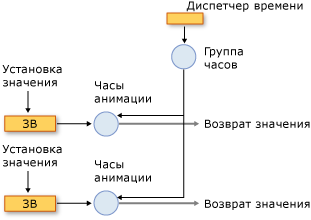
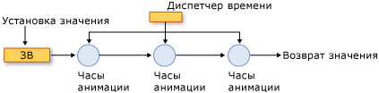

# Общие сведения об анимации и системе управления временемAnimation and Timing System Overview
В этой теме описывается, <xref:System.Windows.Media.Animation.Timeline>как <xref:System.Windows.Media.Animation.Clock> система синхронизации использует анимацию и классы для анимации свойств.This topic describes how the timing system uses the animation, <xref:System.Windows.Media.Animation.Timeline>, and <xref:System.Windows.Media.Animation.Clock> classes to animate properties.  
  

## Предварительные требованияPrerequisites  
 Чтобы понять содержимое этого раздела, необходимо знать, как использовать анимацию [!INCLUDE[TLA2#tla_winclient](../../../../includes/tla2sharptla-winclient-md.md)] для анимации свойств, как описано в разделе [Общие сведения об эффектах анимации](animation-overview.md).To understand this topic, you should be able to use [!INCLUDE[TLA2#tla_winclient](../../../../includes/tla2sharptla-winclient-md.md)] animations to animate properties, as described in the [Animation Overview](animation-overview.md). В нем также можно ознакомиться со свойствами зависимостей. Дополнительные сведения см. в разделе [Общие сведения о свойствах зависимостей](../advanced/dependency-properties-overview.md).It also helps to be familiar with dependency properties; for more information, see the [Dependency Properties Overview](../advanced/dependency-properties-overview.md).  
  

## Временные шкалы и часыTimelines and Clocks  
 [Обзор анимации](animation-overview.md) описал, <xref:System.Windows.Media.Animation.Timeline> как а представляет собой сегмент времени, <xref:System.Windows.Media.Animation.Timeline> а анимация — это тип, который производит значения вывода.The [Animation Overview](animation-overview.md) described how a <xref:System.Windows.Media.Animation.Timeline> represents a segment of time, and an animation is a type of <xref:System.Windows.Media.Animation.Timeline> that produces output values. Сам по <xref:System.Windows.Media.Animation.Timeline>себе, не делает ничего, кроме просто описать сегмент времени.By itself, a <xref:System.Windows.Media.Animation.Timeline>, doesn't do anything other than just describe a segment of time. Это объект Временной шкалы, <xref:System.Windows.Media.Animation.Clock> который делает реальную работу.It's the timeline's <xref:System.Windows.Media.Animation.Clock> object that does the real work. Аналогичным образом, анимация на самом деле не оживляет свойства: класс анимации описывает, как должны быть вычисляются значения вывода, но это то, <xref:System.Windows.Media.Animation.Clock> что было создано для анимации, которая управляет выходом анимации и применяет его к свойствам.Likewise, animation doesn't actually animate properties: an animation class describes how output values should be calculated, but it’s the <xref:System.Windows.Media.Animation.Clock> that was created for the animation that drives the animation output and applies it to properties.  
  
 A <xref:System.Windows.Media.Animation.Clock> — это особый тип объекта, который поддерживает состояние <xref:System.Windows.Media.Animation.Timeline>времени выполнения для .A <xref:System.Windows.Media.Animation.Clock> is a special type of object that maintains timing-related run-time state for the <xref:System.Windows.Media.Animation.Timeline>. Он предоставляет три бита информации, которые имеют <xref:System.Windows.Media.Animation.Clock.CurrentTime%2A>важное значение для анимации и системы синхронизации: , <xref:System.Windows.Media.Animation.Clock.CurrentProgress%2A>и <xref:System.Windows.Media.Animation.Clock.CurrentState%2A>.It provides three bits of information that are essential to the animation and timing system: <xref:System.Windows.Media.Animation.Clock.CurrentTime%2A>, <xref:System.Windows.Media.Animation.Clock.CurrentProgress%2A>, and <xref:System.Windows.Media.Animation.Clock.CurrentState%2A>. A <xref:System.Windows.Media.Animation.Clock> определяет его текущее время, прогресс и состояние, используя <xref:System.Windows.Media.Animation.Timeline> <xref:System.Windows.Media.Animation.Timeline.Duration%2A>поведение <xref:System.Windows.Media.Animation.Timeline.RepeatBehavior%2A> <xref:System.Windows.Media.Animation.Timeline.AutoReverse%2A>времени, описанное его : , и так далее.A <xref:System.Windows.Media.Animation.Clock> determines its current time, progress, and state by using the timing behaviors described by its <xref:System.Windows.Media.Animation.Timeline>: <xref:System.Windows.Media.Animation.Timeline.Duration%2A>, <xref:System.Windows.Media.Animation.Timeline.RepeatBehavior%2A>, <xref:System.Windows.Media.Animation.Timeline.AutoReverse%2A>, and so on.  
  
 В большинстве <xref:System.Windows.Media.Animation.Clock> случаев a создается автоматически для вашей Временной шкалы.In most cases, a <xref:System.Windows.Media.Animation.Clock> is created automatically for your timeline. При анимации с помощью <xref:System.Windows.Media.Animation.Storyboard> <xref:System.Windows.Media.Animation.Animatable.BeginAnimation%2A> или метода часы автоматически создаются для ваших временных линий и анимаций и применяются к их целевым свойствам.When you animate by using a <xref:System.Windows.Media.Animation.Storyboard> or the <xref:System.Windows.Media.Animation.Animatable.BeginAnimation%2A> method, clocks are automatically created for your timelines and animations and applied to their targeted properties. Вы также можете <xref:System.Windows.Media.Animation.Clock> создать явно <xref:System.Windows.Media.Animation.Timeline.CreateClock%2A> с помощью метода вашего <xref:System.Windows.Media.Animation.Timeline>.You can also create a <xref:System.Windows.Media.Animation.Clock> explicitly by using the <xref:System.Windows.Media.Animation.Timeline.CreateClock%2A> method of your <xref:System.Windows.Media.Animation.Timeline>. Метод <xref:System.Windows.Media.MediaTimeline.CreateClock%2A?displayProperty=nameWithType> создает часы соответствующего типа, <xref:System.Windows.Media.Animation.Timeline> для которого он называется.The <xref:System.Windows.Media.MediaTimeline.CreateClock%2A?displayProperty=nameWithType> method creates a clock of the appropriate type for the <xref:System.Windows.Media.Animation.Timeline> on which it is called. Если <xref:System.Windows.Media.Animation.Timeline> в графике ребенка <xref:System.Windows.Media.Animation.Clock> содержатся детские сроки, он создает объекты и для них.If the <xref:System.Windows.Media.Animation.Timeline> contains child timelines, it creates <xref:System.Windows.Media.Animation.Clock> objects for them as well. Полученные <xref:System.Windows.Media.Animation.Clock> объекты расположены на деревьях, которые соответствуют структуре <xref:System.Windows.Media.Animation.Timeline> дерева объектов, из которых они создаются.The resulting <xref:System.Windows.Media.Animation.Clock> objects are arranged in trees that match the structure of the <xref:System.Windows.Media.Animation.Timeline> objects tree from which they are created.  
  
 Существует различных типа часов для различных типов шкал времени.There are different types of clocks for different types of timelines. В следующей <xref:System.Windows.Media.Animation.Clock> таблице показаны типы, <xref:System.Windows.Media.Animation.Timeline> соответствующие некоторым типам.The following table shows the <xref:System.Windows.Media.Animation.Clock> types that correspond to some of the different <xref:System.Windows.Media.Animation.Timeline> types.  
  
|Тип временной шкалыTimeline type|Тип часовClock type|Назначение часовClock purpose|  
|-------------------|----------------|-------------------|  
|Анимация (наследует от <xref:System.Windows.Media.Animation.AnimationTimeline>)Animation (inherits from <xref:System.Windows.Media.Animation.AnimationTimeline>)|<xref:System.Windows.Media.Animation.AnimationClock>|Создает выходные значения для свойства зависимостей.Generates output values for a dependency property.|  
|<xref:System.Windows.Media.MediaTimeline>|<xref:System.Windows.Media.MediaClock>|Обрабатывает файл мультимедиа.Processes a media file.|  
|<xref:System.Windows.Media.Animation.ParallelTimeline>|<xref:System.Windows.Media.Animation.ClockGroup>|Группы и <xref:System.Windows.Media.Animation.Clock> управление своими детскими объектамиGroups and controls its child <xref:System.Windows.Media.Animation.Clock> objects|  
|<xref:System.Windows.Media.Animation.Storyboard>|<xref:System.Windows.Media.Animation.ClockGroup>|Группы и <xref:System.Windows.Media.Animation.Clock> управление своими детскими объектамиGroups and controls its child <xref:System.Windows.Media.Animation.Clock> objects|  
  
 Вы можете <xref:System.Windows.Media.Animation.AnimationClock> применить любые объекты, которые вы <xref:System.Windows.Media.Animation.IAnimatable.ApplyAnimationClock%2A> создаете, к совместимым свойствам зависимости с помощью метода.You can apply any <xref:System.Windows.Media.Animation.AnimationClock> objects you create to compatible dependency properties by using the <xref:System.Windows.Media.Animation.IAnimatable.ApplyAnimationClock%2A> method.  
  
 В сценариях, связанных с производительностью, таких как анимация большого количества подобных объектов, управление собственным <xref:System.Windows.Media.Animation.Clock> использованием может обеспечить преимущества производительности.In performance-intensive scenarios, such as animating large numbers of similar objects, managing your own <xref:System.Windows.Media.Animation.Clock> use can provide performance benefits.  
  

## Часы и диспетчер времениClocks and the Time Manager  
 Когда вы оживляют [!INCLUDE[TLA2#tla_winclient](../../../../includes/tla2sharptla-winclient-md.md)]объекты в, это менеджер <xref:System.Windows.Media.MediaPlayer.Clock%2A> времени, который управляет объектами, созданными для ваших временных линий.When you animate objects in [!INCLUDE[TLA2#tla_winclient](../../../../includes/tla2sharptla-winclient-md.md)], it’s the time manager that manages the <xref:System.Windows.Media.MediaPlayer.Clock%2A> objects created for your timelines. Диспетчер времени — это корень дерева объектов <xref:System.Windows.Media.MediaPlayer.Clock%2A>, который управляет потоком времени в этом дереве.The time manager is the root of a tree of <xref:System.Windows.Media.MediaPlayer.Clock%2A> objects and controls the flow of time in that tree.  Диспетчер времени создается автоматически для каждого приложения [!INCLUDE[TLA2#tla_winclient](../../../../includes/tla2sharptla-winclient-md.md)] и остается невидимым для разработчика приложения.A time manager is automatically created for each [!INCLUDE[TLA2#tla_winclient](../../../../includes/tla2sharptla-winclient-md.md)] application and is invisible to the application developer. Диспетчер времени "тикает" много раз в секунду; фактическое число тактов, возникающих каждую секунду, зависит от доступных системных ресурсов.The time manager "ticks" many times per second; the actual number of ticks that occur each second varies depending on available system resources. Во время каждого из этих тиков диспетчер времени <xref:System.Windows.Media.Animation.ClockState.Active> <xref:System.Windows.Media.Animation.Clock> вычисляет состояние всех объектов в дереве синхронизации.During each one of these ticks, the time manager computes the state of all <xref:System.Windows.Media.Animation.ClockState.Active> <xref:System.Windows.Media.Animation.Clock> objects in the timing tree.  
  
 На следующей иллюстрации показаны отношения <xref:System.Windows.Media.Animation.AnimationClock>между диспетчером времени и анимированным свойством зависимости.The following illustration shows the relationship between the time manager, and <xref:System.Windows.Media.Animation.AnimationClock>, and an animated dependency property.  
  
   
Анимирование свойстваAnimating a property  
  
 Когда диспетчер времени тикает, он обновляет <xref:System.Windows.Media.Animation.ClockState.Active> <xref:System.Windows.Media.Animation.Clock> время каждого в приложении.When the time manager ticks, it updates the time of every <xref:System.Windows.Media.Animation.ClockState.Active> <xref:System.Windows.Media.Animation.Clock> in the application. Если <xref:System.Windows.Media.Animation.Clock> это <xref:System.Windows.Media.Animation.AnimationClock>, он <xref:System.Windows.Media.Animation.AnimationTimeline.GetCurrentValue%2A> использует метод, <xref:System.Windows.Media.Animation.AnimationTimeline> из которого он был создан для расчета его текущего значения вывода.If the <xref:System.Windows.Media.Animation.Clock> is an <xref:System.Windows.Media.Animation.AnimationClock>, it uses the <xref:System.Windows.Media.Animation.AnimationTimeline.GetCurrentValue%2A> method of the <xref:System.Windows.Media.Animation.AnimationTimeline> from which it was created to calculate its current output value. Поставляет <xref:System.Windows.Media.Animation.AnimationClock> <xref:System.Windows.Media.Animation.AnimationTimeline> с текущим местным временем, входное значение, которое, как правило, базовое значение свойства, и значение назначения по умолчанию.The <xref:System.Windows.Media.Animation.AnimationClock> supplies the <xref:System.Windows.Media.Animation.AnimationTimeline> with the current local time, an input value, which is typically the base value of the property, and a default destination value. При получении значения анимированного свойства <xref:System.Windows.DependencyObject.GetValue%2A> с помощью метода или его аксессуара CLR вы получаете выход его. <xref:System.Windows.Media.Animation.AnimationClock>When you retrieve the value of an animated by property using the <xref:System.Windows.DependencyObject.GetValue%2A> method or its CLR accessor, you get the output of its <xref:System.Windows.Media.Animation.AnimationClock>.  
  
#### Группы часовClock Groups  
 В предыдущем разделе описано, <xref:System.Windows.Media.Animation.Clock> как существуют различные типы объектов для различных типов временных линий.The preceding section described how there are different types of <xref:System.Windows.Media.Animation.Clock> objects for different types of timelines. На следующей иллюстрации показаны отношения <xref:System.Windows.Media.Animation.ClockGroup>между <xref:System.Windows.Media.Animation.AnimationClock>временной менеджером, а, и анимированным свойством зависимости.The following illustration shows the relationship between the time manager, a <xref:System.Windows.Media.Animation.ClockGroup>, an <xref:System.Windows.Media.Animation.AnimationClock>, and an animated dependency property. A <xref:System.Windows.Media.Animation.ClockGroup> создается для временных линий, которые <xref:System.Windows.Media.Animation.Storyboard> группируют другие временные линии, такие как класс, который группирует анимацию и другие временные линии.A <xref:System.Windows.Media.Animation.ClockGroup> is created for timelines that group other timelines, such as the <xref:System.Windows.Media.Animation.Storyboard> class, which groups animations and other timelines.  
  
   
ClockGroupA ClockGroup  
  
#### СозданиеComposition  
 Можно связать несколько часов с одним свойством. При этом каждые часы используют выходное значение предыдущих часов в качестве своего базового значения.It's possible to associate multiple clocks with a single property, in which case each clock uses the output value of the preceding clock as its base value. На следующей <xref:System.Windows.Media.Animation.AnimationClock> иллюстрации показаны три объекта, применяемые к тому же свойству.The following illustration shows three <xref:System.Windows.Media.Animation.AnimationClock> objects applied to the same property. Clock1 использует базовое значение анимируемого свойства в качестве входных данных и для создания выходных данных.Clock1 uses the base value of the animated property as its input and uses it to generate output. Clock2 принимает выходные данные от Clock1 в качестве входных данных и использует их для создания выходных данных.Clock2 takes the output from Clock1 as its input and uses it to generate output. Clock3 принимает выходные данные от Clock2 в качестве входных данных и использует их для создания выходных данных.Clock3 takes the output from Clock2 as its input and uses it to generate output. Когда несколько часов влияют на одно и то же свойство одновременно, считается, что они находятся в цепочке композиции.When multiple clocks affect the same property simultaneously, they are said to be in a composition chain.  
  
   
Цепочка композицииA composition chain  
  
 Обратите внимание, что, хотя связь создается <xref:System.Windows.Media.Animation.AnimationClock> между входным и выходным объектов в цепочке композиции, их поведение времени не влияет; <xref:System.Windows.Media.Animation.Clock> объекты <xref:System.Windows.Media.Animation.AnimationClock> (включая объекты) имеют иерархическую зависимость от родительских <xref:System.Windows.Media.Animation.Clock> объектов.Note that although a relationship is created among the input and output of the <xref:System.Windows.Media.Animation.AnimationClock> objects in the composition chain, their timing behaviors are not affected; <xref:System.Windows.Media.Animation.Clock> objects (including <xref:System.Windows.Media.Animation.AnimationClock> objects) have a hierarchical dependency on their parent <xref:System.Windows.Media.Animation.Clock> objects.  
  
 Чтобы применить несколько часов к тому <xref:System.Windows.Media.Animation.HandoffBehavior.Compose> <xref:System.Windows.Media.Animation.HandoffBehavior> же свойству, используйте при <xref:System.Windows.Media.Animation.Storyboard>применении, анимация, или. <xref:System.Windows.Media.Animation.AnimationClock>To apply multiple clocks to the same property, use the <xref:System.Windows.Media.Animation.HandoffBehavior.Compose> <xref:System.Windows.Media.Animation.HandoffBehavior> when applying a <xref:System.Windows.Media.Animation.Storyboard>, animation, or <xref:System.Windows.Media.Animation.AnimationClock>.  
  
#### Такты и объединение событийTicks and Event Consolidation  
 В дополнение к расчету выходных значений тикающий диспетчер времени выполняет и другие операции: он определяет состояние всех часов и вызывает соответствующие события.In addition to calculating output values, the time manager does other work every time it ticks: it determines the state of each clock and raises events as appropriate.  
  
 Хотя такты меняются часто, между ними может возникать множество событий.While ticks occur frequently, it's possible for a lot of things to happen between ticks. Например, <xref:System.Windows.Media.Animation.Clock> может быть остановлен, запущен и остановлен снова, и в этом случае его <xref:System.Windows.Media.Animation.Clock.CurrentState%2A> значение изменится три раза.For example, a <xref:System.Windows.Media.Animation.Clock> might be stopped, started, and stopped again, in which case its <xref:System.Windows.Media.Animation.Clock.CurrentState%2A> value will have changed three times. <xref:System.Windows.Media.Animation.Clock.CurrentStateInvalidated> Теоретически, событие может быть поднято несколько раз одним тиком; однако, механизм синхронизации консолидирует события, так что <xref:System.Windows.Media.Animation.Clock.CurrentStateInvalidated> событие может быть поднято не чаще одного раза за тик.In theory, the <xref:System.Windows.Media.Animation.Clock.CurrentStateInvalidated> event could be raised multiple times in a single tick; however, the timing engine consolidates events, so that the <xref:System.Windows.Media.Animation.Clock.CurrentStateInvalidated> event can be raised at most once per tick. Это относится ко всем событиям синхронизации: не более одного <xref:System.Windows.Media.Animation.Clock> события каждого типа поднимается для данного объекта.This is true for all timing events: at most one event of each type is raised for a given <xref:System.Windows.Media.Animation.Clock> object.  
  
 Когда <xref:System.Windows.Media.Animation.Clock> коммутирует состояния и возвращается обратно в исходное <xref:System.Windows.Media.Animation.ClockState.Active> <xref:System.Windows.Media.Animation.ClockState.Stopped> состояние между <xref:System.Windows.Media.Animation.ClockState.Active>тиками (например, изменение от вкл и обратно к), связанное событие все еще происходит.When a <xref:System.Windows.Media.Animation.Clock> switches states and returns back to its original state between ticks (such as changing from <xref:System.Windows.Media.Animation.ClockState.Active> to <xref:System.Windows.Media.Animation.ClockState.Stopped> and back to <xref:System.Windows.Media.Animation.ClockState.Active>), the associated event still occurs.  
  
 Дополнительные сведения о временных событиях см. в разделе [Общие сведения о временных событиях](timing-events-overview.md).For more information about timing events, see the [Timing Events Overview](timing-events-overview.md).  
  

## Текущие и базовые значения свойствCurrent Values and Base Values of Properties  
 Анимированное свойство может иметь два значения: базовое значение и текущее.An animatable property can have two values: a base value and a current value. При установке свойства с помощью <xref:System.Windows.DependencyObject.SetValue%2A> аксессуара CLR или метода вы устанавливаете его базовое значение.When you set property using its CLR accessor or the <xref:System.Windows.DependencyObject.SetValue%2A> method, you set its base value. Если свойство не анимировано, его базовое и текущее значения совпадают.When a property is not animated, its base and current values are the same.  
  
 При анимировать свойство <xref:System.Windows.Media.Animation.AnimationClock> *устанавливается текущая* стоимость свойства.When you animate a property, the <xref:System.Windows.Media.Animation.AnimationClock> sets the property's *current* value. Получение стоимости свойства через его clR-аксессуар <xref:System.Windows.DependencyObject.GetValue%2A> или метод возвращает <xref:System.Windows.Media.Animation.AnimationClock> выход, <xref:System.Windows.Media.Animation.ClockState.Active> <xref:System.Windows.Media.Animation.ClockState.Filling>когда <xref:System.Windows.Media.Animation.AnimationClock> является или .Retrieving the property's value through its CLR accessor or the <xref:System.Windows.DependencyObject.GetValue%2A> method returns the output of the <xref:System.Windows.Media.Animation.AnimationClock> when the <xref:System.Windows.Media.Animation.AnimationClock> is <xref:System.Windows.Media.Animation.ClockState.Active> or <xref:System.Windows.Media.Animation.ClockState.Filling>. Вы можете получить базовое значение свойства <xref:System.Windows.Media.Animation.IAnimatable.GetAnimationBaseValue%2A> с помощью метода.You can retrieve the property's base value by using the <xref:System.Windows.Media.Animation.IAnimatable.GetAnimationBaseValue%2A> method.  
  
## См. также разделSee also

- [Общие сведения об эффектах анимацииAnimation Overview](animation-overview.md)
- [Общие сведения о временных событияхTiming Events Overview](timing-events-overview.md)
- [Общие сведения о характере поведения во времениTiming Behaviors Overview](timing-behaviors-overview.md)
