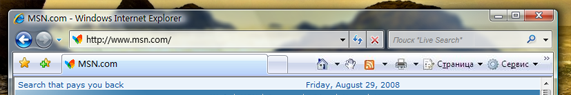

# <a name="extend-glass-frame-into-a-wpf-application"></a><span data-ttu-id="85f71-102">Использование стеклянной рамки в приложении WPF</span><span class="sxs-lookup"><span data-stu-id="85f71-102">Extend Glass Frame Into a WPF Application</span></span>
<span data-ttu-id="85f71-103">В этом разделе показано, как расширить [!INCLUDE[TLA#tla_winvista](../../../../includes/tlasharptla-winvista-md.md)] стеклянную рамку на клиентскую область приложения Windows Presentation Foundation (WPF).</span><span class="sxs-lookup"><span data-stu-id="85f71-103">This topic demonstrates how to extend the [!INCLUDE[TLA#tla_winvista](../../../../includes/tlasharptla-winvista-md.md)] glass frame into the client area of a Windows Presentation Foundation (WPF) application.</span></span>  
  
> [!NOTE]
>  <span data-ttu-id="85f71-104">Этот пример будет работать только на компьютере под управлением [!INCLUDE[TLA2#tla_winvista](../../../../includes/tla2sharptla-winvista-md.md)], где работает диспетчер окон рабочего стола (DWM) с включенным эффектом прозрачного стекла.</span><span class="sxs-lookup"><span data-stu-id="85f71-104">This example will only work on a [!INCLUDE[TLA2#tla_winvista](../../../../includes/tla2sharptla-winvista-md.md)] machine running the Desktop Window Manager (DWM) with glass enabled.</span></span> [!INCLUDE[TLA2#tla_winvista](../../../../includes/tla2sharptla-winvista-md.md)]<span data-ttu-id="85f71-105"> Home Basic edition не поддерживает эффект прозрачного стекла.</span><span class="sxs-lookup"><span data-stu-id="85f71-105"> Home Basic edition does not support the transparent glass effect.</span></span> <span data-ttu-id="85f71-106">Области, которые обычно отображаются с эффектом прозрачного стекла, в других выпусках [!INCLUDE[TLA2#tla_winvista](../../../../includes/tla2sharptla-winvista-md.md)] отображаются непрозрачными.</span><span class="sxs-lookup"><span data-stu-id="85f71-106">Areas that would typically render with the transparent glass effect on other editions of [!INCLUDE[TLA2#tla_winvista](../../../../includes/tla2sharptla-winvista-md.md)] are rendered opaque.</span></span>  
  
## <a name="example"></a><span data-ttu-id="85f71-107">Пример</span><span class="sxs-lookup"><span data-stu-id="85f71-107">Example</span></span>  
 <span data-ttu-id="85f71-108">На следующем рисунке показана стеклянная рамка, расширенная на адресную строку Internet Explorer 7.</span><span class="sxs-lookup"><span data-stu-id="85f71-108">The following image illustrates the glass frame extended into the address bar of Internet Explorer 7.</span></span>  
  
 <span data-ttu-id="85f71-109">**Internet Explorer со стеклянной рамкой, расширенной за адресной строкой.**</span><span class="sxs-lookup"><span data-stu-id="85f71-109">**Internet Explorer with extended glass frame behind address bar.**</span></span>  
  
 <span data-ttu-id="85f71-110"></span><span class="sxs-lookup"><span data-stu-id="85f71-110"></span></span>  
  
 <span data-ttu-id="85f71-111">Чтобы расширить стеклянную рамку в приложении [!INCLUDE[TLA2#tla_wpf](../../../../includes/tla2sharptla-wpf-md.md)], требуется доступ к неуправляемому [!INCLUDE[TLA#tla_api](../../../../includes/tlasharptla-api-md.md)].</span><span class="sxs-lookup"><span data-stu-id="85f71-111">To extend the glass frame on a [!INCLUDE[TLA2#tla_wpf](../../../../includes/tla2sharptla-wpf-md.md)] application, access to unmanaged [!INCLUDE[TLA#tla_api](../../../../includes/tlasharptla-api-md.md)] is needed.</span></span> <span data-ttu-id="85f71-112">В следующем примере кода выполняется платформенный вызов (pinvoke) для двух [!INCLUDE[TLA2#tla_api](../../../../includes/tla2sharptla-api-md.md)], необходимых для расширения рамки на клиентскую область.</span><span class="sxs-lookup"><span data-stu-id="85f71-112">The following code example does a Platform Invoke (pinvoke) for the two [!INCLUDE[TLA2#tla_api](../../../../includes/tla2sharptla-api-md.md)] needed to extend the frame into the client area.</span></span> <span data-ttu-id="85f71-113">Каждый из этих [!INCLUDE[TLA2#tla_api](../../../../includes/tla2sharptla-api-md.md)] объявляется в классе с именем **NonClientRegionAPI**.</span><span class="sxs-lookup"><span data-stu-id="85f71-113">Each of these [!INCLUDE[TLA2#tla_api](../../../../includes/tla2sharptla-api-md.md)] are declared in a class called **NonClientRegionAPI**.</span></span>  
  
```csharp  
[StructLayout(LayoutKind.Sequential)]  
public struct MARGINS  
{  
    public int cxLeftWidth;      // width of left border that retains its size  
    public int cxRightWidth;     // width of right border that retains its size  
    public int cyTopHeight;      // height of top border that retains its size  
    public int cyBottomHeight;   // height of bottom border that retains its size  
};  
  
[DllImport("DwmApi.dll")]  
public static extern int DwmExtendFrameIntoClientArea(  
    IntPtr hwnd,  
    ref MARGINS pMarInset);  
```  
  
```vb  
<StructLayout(LayoutKind.Sequential)>  
        Public Structure MARGINS  
            Public cxLeftWidth As Integer ' width of left border that retains its size  
            Public cxRightWidth As Integer ' width of right border that retains its size  
            Public cyTopHeight As Integer ' height of top border that retains its size  
            Public cyBottomHeight As Integer ' height of bottom border that retains its size  
        End Structure  
  
        <DllImport("DwmApi.dll")>  
        Public Shared Function DwmExtendFrameIntoClientArea(ByVal hwnd As IntPtr, ByRef pMarInset As MARGINS) As Integer  
        End Function  
```  
  
 <span data-ttu-id="85f71-114">[DwmExtendFrameIntoClientArea](/windows/desktop/api/dwmapi/nf-dwmapi-dwmextendframeintoclientarea) — функция DWM, которая расширяет рамку на клиентскую область.</span><span class="sxs-lookup"><span data-stu-id="85f71-114">[DwmExtendFrameIntoClientArea](/windows/desktop/api/dwmapi/nf-dwmapi-dwmextendframeintoclientarea) is the DWM function that extends the frame into the client area.</span></span> <span data-ttu-id="85f71-115">Она принимает два параметра — дескриптор окна и структуру [MARGINS](/windows/desktop/api/uxtheme/ns-uxtheme-_margins).</span><span class="sxs-lookup"><span data-stu-id="85f71-115">It takes two parameters; a window handle and a [MARGINS](/windows/desktop/api/uxtheme/ns-uxtheme-_margins) structure.</span></span> <span data-ttu-id="85f71-116">[MARGINS](/windows/desktop/api/uxtheme/ns-uxtheme-_margins) используется для сообщения DWM, насколько следует расширить рамку в клиентской области.</span><span class="sxs-lookup"><span data-stu-id="85f71-116">[MARGINS](/windows/desktop/api/uxtheme/ns-uxtheme-_margins) is used to tell the DWM how much extra the frame should be extended into the client area.</span></span>  
  
## <a name="example"></a><span data-ttu-id="85f71-117">Пример</span><span class="sxs-lookup"><span data-stu-id="85f71-117">Example</span></span>  
 <span data-ttu-id="85f71-118">Для использования функции [DwmExtendFrameIntoClientArea](/windows/desktop/api/dwmapi/nf-dwmapi-dwmextendframeintoclientarea) необходимо получить дескриптор окна.</span><span class="sxs-lookup"><span data-stu-id="85f71-118">To use the [DwmExtendFrameIntoClientArea](/windows/desktop/api/dwmapi/nf-dwmapi-dwmextendframeintoclientarea) function, a window handle must be obtained.</span></span> <span data-ttu-id="85f71-119">В [!INCLUDE[TLA2#tla_wpf](../../../../includes/tla2sharptla-wpf-md.md)], дескриптор окна может быть получен из <xref:System.Windows.Interop.HwndSource.Handle%2A> свойство <xref:System.Windows.Interop.HwndSource>.</span><span class="sxs-lookup"><span data-stu-id="85f71-119">In [!INCLUDE[TLA2#tla_wpf](../../../../includes/tla2sharptla-wpf-md.md)], the window handle can be obtained from the <xref:System.Windows.Interop.HwndSource.Handle%2A> property of an <xref:System.Windows.Interop.HwndSource>.</span></span> <span data-ttu-id="85f71-120">В следующем примере рамка расширяется на клиентскую область на <xref:System.Windows.FrameworkElement.Loaded> событий окна.</span><span class="sxs-lookup"><span data-stu-id="85f71-120">In the following example, the frame is extended into the client area on the <xref:System.Windows.FrameworkElement.Loaded> event of the window.</span></span>  
  
```csharp  
void OnLoaded(object sender, RoutedEventArgs e)  
{  
   try  
   {  
      // Obtain the window handle for WPF application  
      IntPtr mainWindowPtr = new WindowInteropHelper(this).Handle;  
      HwndSource mainWindowSrc = HwndSource.FromHwnd(mainWindowPtr);  
      mainWindowSrc.CompositionTarget.BackgroundColor = Color.FromArgb(0, 0, 0, 0);  
  
      // Get System Dpi  
      System.Drawing.Graphics desktop = System.Drawing.Graphics.FromHwnd(mainWindowPtr);  
      float DesktopDpiX = desktop.DpiX;  
      float DesktopDpiY = desktop.DpiY;  
  
      // Set Margins  
      NonClientRegionAPI.MARGINS margins = new NonClientRegionAPI.MARGINS();  
  
      // Extend glass frame into client area  
      // Note that the default desktop Dpi is 96dpi. The  margins are  
      // adjusted for the system Dpi.  
      margins.cxLeftWidth = Convert.ToInt32(5 * (DesktopDpiX / 96));  
      margins.cxRightWidth = Convert.ToInt32(5 * (DesktopDpiX / 96));  
      margins.cyTopHeight = Convert.ToInt32(((int)topBar.ActualHeight + 5) * (DesktopDpiX / 96));  
      margins.cyBottomHeight = Convert.ToInt32(5 * (DesktopDpiX / 96));  
  
      int hr = NonClientRegionAPI.DwmExtendFrameIntoClientArea(mainWindowSrc.Handle, ref margins);  
      //  
      if (hr < 0)  
      {  
         //DwmExtendFrameIntoClientArea Failed  
      }  
   }  
   // If not Vista, paint background white.  
   catch (DllNotFoundException)  
   {  
      Application.Current.MainWindow.Background = Brushes.White;  
   }  
}  
```  
  
## <a name="example"></a><span data-ttu-id="85f71-121">Пример</span><span class="sxs-lookup"><span data-stu-id="85f71-121">Example</span></span>  
 <span data-ttu-id="85f71-122">В следующем примере показано простое окно, в котором рамка расширяется на клиентскую область.</span><span class="sxs-lookup"><span data-stu-id="85f71-122">The following example shows a simple window in which the frame is extended into the client area.</span></span> <span data-ttu-id="85f71-123">Рамка расширяется за пределы верхней границы, содержащей два <xref:System.Windows.Controls.TextBox> объектов.</span><span class="sxs-lookup"><span data-stu-id="85f71-123">The frame is extended behind the top border that contains the two <xref:System.Windows.Controls.TextBox> objects.</span></span>  
  
```xaml  
<Window x:Class="SDKSample.Window1"  
    xmlns="http://schemas.microsoft.com/winfx/2006/xaml/presentation"  
    xmlns:x="http://schemas.microsoft.com/winfx/2006/xaml"  
    Title="Extended Glass in WPF" Height="300" Width="400"   
    Loaded="OnLoaded" Background="Transparent"  
    >  
  <Grid ShowGridLines="True">  
    <DockPanel Name="mainDock">  
      <!-- The border is used to compute the rendered height with margins.  
           topBar contents will be displayed on the extended glass frame.-->  
      <Border Name="topBar" DockPanel.Dock="Top" >  
        <Grid Name="grid">  
          <Grid.ColumnDefinitions>  
            <ColumnDefinition MinWidth="100" Width="*"/>  
            <ColumnDefinition Width="Auto"/>  
          </Grid.ColumnDefinitions>  
          <TextBox Grid.Column="0" MinWidth="100" Margin="0,0,10,5">Path</TextBox>  
          <TextBox Grid.Column="1" MinWidth="75" Margin="0,0,0,5">Search</TextBox>  
        </Grid>  
      </Border>  
      <Grid DockPanel.Dock="Top" >  
        <Grid.ColumnDefinitions>  
          <ColumnDefinition/>  
        </Grid.ColumnDefinitions>  
        <TextBox Grid.Column="0" AcceptsReturn="True"/>  
      </Grid>  
    </DockPanel>  
  </Grid>  
</Window>  
```  
  
 <span data-ttu-id="85f71-124">На следующем рисунке показана стеклянная рамка, расширенная на приложение [!INCLUDE[TLA2#tla_wpf](../../../../includes/tla2sharptla-wpf-md.md)].</span><span class="sxs-lookup"><span data-stu-id="85f71-124">The following image illustrates the glass frame extended into a [!INCLUDE[TLA2#tla_wpf](../../../../includes/tla2sharptla-wpf-md.md)] application.</span></span>  
  
 <span data-ttu-id="85f71-125">**Прозрачная рамка, расширенная на**  [!INCLUDE[TLA2#tla_wpf](../../../../includes/tla2sharptla-wpf-md.md)] приложение **.**</span><span class="sxs-lookup"><span data-stu-id="85f71-125">**Glass Frame Extended into a**  [!INCLUDE[TLA2#tla_wpf](../../../../includes/tla2sharptla-wpf-md.md)]  **Application.**</span></span>  
  
 <span data-ttu-id="85f71-126"></span><span class="sxs-lookup"><span data-stu-id="85f71-126"></span></span>  
  
## <a name="see-also"></a><span data-ttu-id="85f71-127">См. также</span><span class="sxs-lookup"><span data-stu-id="85f71-127">See Also</span></span>  
 [<span data-ttu-id="85f71-128">Общие сведения о диспетчере окон рабочего стола</span><span class="sxs-lookup"><span data-stu-id="85f71-128">Desktop Window Manager Overview</span></span>](/windows/desktop/dwm/dwm-overview)  
 [<span data-ttu-id="85f71-129">Общие сведения о размытии для диспетчера окон рабочего стола</span><span class="sxs-lookup"><span data-stu-id="85f71-129">Desktop Window Manager Blur Overview</span></span>](/windows/desktop/dwm/blur-ovw)  
 [<span data-ttu-id="85f71-130">DwmExtendFrameIntoClientArea</span><span class="sxs-lookup"><span data-stu-id="85f71-130">DwmExtendFrameIntoClientArea</span></span>](/windows/desktop/api/dwmapi/nf-dwmapi-dwmextendframeintoclientarea)
