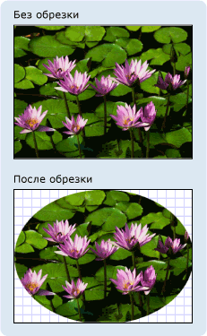

# Общие сведения о классе Geometry
В этом обзоре описывается, как использовать классы [!INCLUDE[TLA#tla_winclient](../../../../includes/tlasharptla-winclient-md.md)] <xref:System.Windows.Media.Geometry> для описания форм. Эта тема также противопоставляет различия между <xref:System.Windows.Media.Geometry> объектами и <xref:System.Windows.Shapes.Shape> элементами.  

## Что такое класс Geometry?  
 Класс и классы, которые вытекают <xref:System.Windows.Media.EllipseGeometry> <xref:System.Windows.Media.PathGeometry>из него, такие как , и <xref:System.Windows.Media.CombinedGeometry>, позволяют описать геометрию 2D формы. <xref:System.Windows.Media.Geometry> Данные геометрические описания имеют множество применений, например определение фигуры для рисования на экране или определение областей проверки нажатия и областей обрезки. Геометрию можно даже использовать для определения пути анимации.  
  
 <xref:System.Windows.Media.Geometry>объекты могут быть простыми, такими как прямоугольники и круги, или композитные, созданные из двух или более объектов геометрии.  Более сложные геометрии могут быть <xref:System.Windows.Media.PathGeometry> <xref:System.Windows.Media.StreamGeometry> созданы с помощью и классов, которые позволяют описать дуги и кривые.  
  
 Поскольку <xref:System.Windows.Media.Geometry> a является <xref:System.Windows.Freezable> <xref:System.Windows.Media.Geometry> типом, объекты предоставляют несколько специальных функций: они могут быть объявлены в качестве [ресурсов,](../../../desktop-wpf/fundamentals/xaml-resources-define.md)совместно распределенных между несколькими объектами, сделанные только для чтения только для повышения производительности, клонированы и сделаны безопасными для потоков. Для получения дополнительной информации <xref:System.Windows.Freezable> о различных [Freezable Objects Overview](../advanced/freezable-objects-overview.md)функциях, предоставляемых объектами, см.  
  

## Геометрия против фигур  
 И <xref:System.Windows.Media.Geometry> <xref:System.Windows.Shapes.Shape> классы кажутся похожими в том, <xref:System.Windows.Media.EllipseGeometry> что <xref:System.Windows.Shapes.Ellipse> они оба описывают 2D формы (сравните и, например), но есть важные различия.  
  
 С одной <xref:System.Windows.Media.Geometry> стороны, класс <xref:System.Windows.Freezable> наследует <xref:System.Windows.Shapes.Shape> от класса, в то время как класс наследует от <xref:System.Windows.FrameworkElement>. Поскольку они <xref:System.Windows.Shapes.Shape> являются элементами, объекты могут визуализировать себя и участвовать в системе компоновки, в то время как <xref:System.Windows.Media.Geometry> объекты не могут.  
  
 Хотя <xref:System.Windows.Shapes.Shape> объекты более легко <xref:System.Windows.Media.Geometry> пригодны <xref:System.Windows.Media.Geometry> для удонастных, чем объекты, объекты более универсальны. В <xref:System.Windows.Shapes.Shape> то время как объект используется <xref:System.Windows.Media.Geometry> для визуализации 2D-графики, объект может быть использован для определения геометрической области для 2D графики, определения области для отсечения или определения области для тестирования хита, например.  
  
### Форма контура  
 Один <xref:System.Windows.Shapes.Shape>из <xref:System.Windows.Shapes.Path> них, класс, на самом деле использует <xref:System.Windows.Media.Geometry> для описания его содержимого. <xref:System.Windows.Shapes.Path.Data%2A> Установив свойство <xref:System.Windows.Shapes.Path> с <xref:System.Windows.Media.Geometry> и настройки <xref:System.Windows.Shapes.Shape.Fill%2A> <xref:System.Windows.Shapes.Shape.Stroke%2A> его и свойств, <xref:System.Windows.Media.Geometry>вы можете визуализировать.  
  

## Общие свойства, принимающие объект класса Geometry  
 В предыдущих разделах упоминалось, что объекты класса Geometry могут использоваться с другими объектами для различных целей, например для рисования фигур, анимации и обрезки. В следующей таблице перечислены несколько <xref:System.Windows.Media.Geometry> классов, которые имеют свойства, которые принимают объект.  
  
|Тип|Свойство|  
|----------|--------------|  
|<xref:System.Windows.Media.Animation.DoubleAnimationUsingPath>|<xref:System.Windows.Media.Animation.DoubleAnimationUsingPath.PathGeometry%2A>|  
|<xref:System.Windows.Media.DrawingGroup>|<xref:System.Windows.Media.DrawingGroup.ClipGeometry%2A>|  
|<xref:System.Windows.Media.GeometryDrawing>|<xref:System.Windows.Media.GeometryDrawing.Geometry%2A>|  
|<xref:System.Windows.Shapes.Path>|<xref:System.Windows.Shapes.Path.Data%2A>|  
|<xref:System.Windows.UIElement>|<xref:System.Windows.UIElement.Clip%2A>|  
  

## Простые геометрические типы  
 Базовым классом для всех геометрий является абстрактный класс. <xref:System.Windows.Media.Geometry>  Классы, которые <xref:System.Windows.Media.Geometry> вытекают из класса, могут быть примерно сгруппированы в три категории: простые геометрии, геометрии путей и композитные геометрии.  
  
 Простые классы <xref:System.Windows.Media.LineGeometry> <xref:System.Windows.Media.RectangleGeometry>геометрии <xref:System.Windows.Media.EllipseGeometry> включают в себя, и используются для создания основных геометрических фигур, таких как линии, прямоугольники и круги.  
  
- A <xref:System.Windows.Media.LineGeometry> определяется путем указания начальной точки строки и конечной точки.  
  
- A <xref:System.Windows.Media.RectangleGeometry> определяется <xref:System.Windows.Rect> со структурой, которая определяет его относительное положение и его высоту и ширину. Можно создать закругленный прямоугольник, установив <xref:System.Windows.Media.RectangleGeometry.RadiusX%2A> <xref:System.Windows.Media.RectangleGeometry.RadiusY%2A> и свойства.  
  
- А <xref:System.Windows.Media.EllipseGeometry> определяется центральной точкой, x-радиусом и y-радиусом.  Следующие примеры показывают, как создать простые геометрические объекты для отображения и для обрезки.  
  
 Эти же фигуры, а также более сложные фигуры <xref:System.Windows.Media.PathGeometry> могут быть созданы с помощью или путем объединения объектов геометрии вместе, но эти классы обеспечивают более простое средство для производства этих основных геометрических фигур.  
  
 Ниже приводится следующий <xref:System.Windows.Media.LineGeometry>пример, как создать и визуализировать.  Как отмечалось <xref:System.Windows.Media.Geometry> ранее, объект не может рисовать <xref:System.Windows.Shapes.Path> сам, поэтому пример использует форму для визуализации линии.  Поскольку линия не имеет <xref:System.Windows.Shapes.Shape.Fill%2A> области, <xref:System.Windows.Shapes.Path> установление свойства не имеет никакого эффекта; вместо этого <xref:System.Windows.Shapes.Shape.Stroke%2A> указаны только свойства и <xref:System.Windows.Shapes.Shape.StrokeThickness%2A> свойства. На следующем рисунке показан результат выполнения этого примера.  
  
   
Объект LineGeometry, соединяющий точки (10,20) и (100,130)  
  
 [!code-xaml[GeometryOverviewSamples_snip#GraphicsMMLineGeometryExample](~/samples/snippets/csharp/VS_Snippets_Wpf/GeometryOverviewSamples_snip/CS/GeometryExamples.xaml#graphicsmmlinegeometryexample)]  
  
 [!code-csharp[GeometryOverviewSamples_procedural_snip#GraphicsMMLineGeometryExample](~/samples/snippets/csharp/VS_Snippets_Wpf/GeometryOverviewSamples_procedural_snip/CSharp/GeometryExamples.cs#graphicsmmlinegeometryexample)]
 [!code-vb[GeometryOverviewSamples_procedural_snip#GraphicsMMLineGeometryExample](~/samples/snippets/visualbasic/VS_Snippets_Wpf/GeometryOverviewSamples_procedural_snip/visualbasic/geometryexamples.vb#graphicsmmlinegeometryexample)]  
  
 Следующий пример показывает, как <xref:System.Windows.Media.EllipseGeometry>создать и визуализировать.  Примеры устанавливает <xref:System.Windows.Media.EllipseGeometry.Center%2A> установленный <xref:System.Windows.Media.EllipseGeometry> к пункту `50,50` и радиус x и y-радиус оба `50`установлены к, который создает круг с диаметром 100.  Интерьер эллипса окрашен путем присвоения значения свойству Заполнения элемента <xref:System.Windows.Media.Brushes.Gold%2A>Пути, в данном случае. На следующем рисунке показан результат выполнения этого примера.  
  
   
Объект EllipseGeometry, нарисованный в точке (50,50)  
  
 [!code-xaml[GeometryOverviewSamples_snip#GraphicsMMEllipseGeometryExample](~/samples/snippets/csharp/VS_Snippets_Wpf/GeometryOverviewSamples_snip/CS/GeometryExamples.xaml#graphicsmmellipsegeometryexample)]  
  
 [!code-csharp[GeometryOverviewSamples_procedural_snip#GraphicsMMEllipseGeometryExample](~/samples/snippets/csharp/VS_Snippets_Wpf/GeometryOverviewSamples_procedural_snip/CSharp/GeometryExamples.cs#graphicsmmellipsegeometryexample)]
 [!code-vb[GeometryOverviewSamples_procedural_snip#GraphicsMMEllipseGeometryExample](~/samples/snippets/visualbasic/VS_Snippets_Wpf/GeometryOverviewSamples_procedural_snip/visualbasic/geometryexamples.vb#graphicsmmellipsegeometryexample)]  
  
 Ниже приводится следующий <xref:System.Windows.Media.RectangleGeometry>пример, как создать и визуализировать.  Положение и размеры прямоугольника определяются структурой. <xref:System.Windows.Rect> Положение — `50,50`, высота и ширина — `25`. В результате получается квадрат. На следующем рисунке показан результат выполнения этого примера.  
  
   
Объект RectangleGeometry, нарисованный в точке 50,50  
  
 [!code-xaml[GeometryOverviewSamples_snip#GraphicsMMRectangleGeometryExample](~/samples/snippets/csharp/VS_Snippets_Wpf/GeometryOverviewSamples_snip/CS/GeometryExamples.xaml#graphicsmmrectanglegeometryexample)]  
  
 [!code-csharp[GeometryOverviewSamples_procedural_snip#GraphicsMMRectangleGeometryExample](~/samples/snippets/csharp/VS_Snippets_Wpf/GeometryOverviewSamples_procedural_snip/CSharp/GeometryExamples.cs#graphicsmmrectanglegeometryexample)]
 [!code-vb[GeometryOverviewSamples_procedural_snip#GraphicsMMRectangleGeometryExample](~/samples/snippets/visualbasic/VS_Snippets_Wpf/GeometryOverviewSamples_procedural_snip/visualbasic/geometryexamples.vb#graphicsmmrectanglegeometryexample)]  
  
 Ниже приводится следующий <xref:System.Windows.Media.EllipseGeometry> пример, как использовать область клипа для изображения.  Объект <xref:System.Windows.Controls.Image> определяется с <xref:System.Windows.FrameworkElement.Width%2A> 200 и <xref:System.Windows.FrameworkElement.Height%2A> 150.  Значение <xref:System.Windows.Media.EllipseGeometry> значение <xref:System.Windows.Media.EllipseGeometry.RadiusX%2A> 100, <xref:System.Windows.Media.EllipseGeometry.RadiusY%2A> значение 75 и <xref:System.Windows.Media.EllipseGeometry.Center%2A> значение 100,75 устанавливается на <xref:System.Windows.UIElement.Clip%2A> свойство изображения.  Будет отображаться только часть изображения, находящаяся внутри эллипса. На следующем рисунке показан результат выполнения этого примера.  
  
   
Использование объекта EllipseGeometry для обрезки элемента управления Image  
  
 [!code-xaml[GeometryOverviewSamples_snip#GraphicsMMImageClipGeometryExample](~/samples/snippets/csharp/VS_Snippets_Wpf/GeometryOverviewSamples_snip/CS/GeometryExamples.xaml#graphicsmmimageclipgeometryexample)]  
  
 [!code-csharp[GeometryOverviewSamples_procedural_snip#GraphicsMMImageClipGeometryExample](~/samples/snippets/csharp/VS_Snippets_Wpf/GeometryOverviewSamples_procedural_snip/CSharp/GeometryExamples.cs#graphicsmmimageclipgeometryexample)]
 [!code-vb[GeometryOverviewSamples_procedural_snip#GraphicsMMImageClipGeometryExample](~/samples/snippets/visualbasic/VS_Snippets_Wpf/GeometryOverviewSamples_procedural_snip/visualbasic/geometryexamples.vb#graphicsmmimageclipgeometryexample)]  
  

## Геометрические объекты-контуры  
 Класс <xref:System.Windows.Media.PathGeometry> и его легкий <xref:System.Windows.Media.StreamGeometry> эквивалент, класс, предоставляют средства для описания нескольких сложных фигур, состоящих из дуг, кривых и линий.  
  
 В основе <xref:System.Windows.Media.PathGeometry> коллекции объектов, <xref:System.Windows.Media.PathFigure> так назвал, потому что каждая <xref:System.Windows.Media.PathGeometry>фигура описывает дискретную форму в . Каждый из них <xref:System.Windows.Media.PathFigure> сам <xref:System.Windows.Media.PathSegment> состоит из одного или нескольких объектов, каждый из которых описывает сегмент фигуры.  
  
 Существует несколько типов сегментов.  
  
|Тип сегмента|Описание|Пример|  
|------------------|-----------------|-------------|  
|<xref:System.Windows.Media.ArcSegment>|Создает эллиптическую дугу между двумя точками.|[Создайте эллиптической дуги](how-to-create-an-elliptical-arc.md).|  
|<xref:System.Windows.Media.BezierSegment>|Создает кривую Безье третьего порядка между двумя точками.|[Создайте кубическую кривую Безье.](how-to-create-a-cubic-bezier-curve.md)|  
|<xref:System.Windows.Media.LineSegment>|Создает линию между двумя точками.|[Создание LineSegment в PathGeometry](how-to-create-a-linesegment-in-a-pathgeometry.md)|  
|<xref:System.Windows.Media.PolyBezierSegment>|Создает набор кривых Безье третьего порядка.|Посмотреть <xref:System.Windows.Media.PolyBezierSegment> страницу типа.|  
|<xref:System.Windows.Media.PolyLineSegment>|Создает набор линий.|Посмотреть <xref:System.Windows.Media.PolyLineSegment> страницу типа.|  
|<xref:System.Windows.Media.PolyQuadraticBezierSegment>|Создает набор кривых Безье второго порядка.|Смотрите <xref:System.Windows.Media.PolyQuadraticBezierSegment> страницу.|  
|<xref:System.Windows.Media.QuadraticBezierSegment>|Создает кривую Безье второго порядка.|[Создайте квадратную кривую Безье.](how-to-create-a-quadratic-bezier-curve.md)|  
  
 Сегменты внутри <xref:System.Windows.Media.PathFigure> аме объединены в единую геометрическая форму, конечная точка каждого сегмента является отправной точкой следующего сегмента. Свойство <xref:System.Windows.Media.PathFigure.StartPoint%2A> <xref:System.Windows.Media.PathFigure> определяет точку, из которой обращается первый сегмент. Каждый последующий сегмент начинается в конечной точке предыдущего сегмента. Например, вертикальная `10,50` `10,150` линия от к <xref:System.Windows.Media.PathFigure.StartPoint%2A> может `10,50` быть определена путем установки свойства и создания <xref:System.Windows.Media.LineSegment> с параметром <xref:System.Windows.Media.LineSegment.Point%2A> `10,150`свойства.  
  
 Следующий пример создает <xref:System.Windows.Media.PathGeometry> простой состоит <xref:System.Windows.Media.PathFigure> из <xref:System.Windows.Media.LineSegment> одного с и <xref:System.Windows.Shapes.Path> отображает его с помощью элемента. Объект <xref:System.Windows.Media.PathFigure> <xref:System.Windows.Media.PathFigure.StartPoint%2A> установлен `10,20` и <xref:System.Windows.Media.LineSegment> определяется с конечной точкой. `100,130` Следующая иллюстрация <xref:System.Windows.Media.PathGeometry> показывает созданный этим примером.  
  
   
Контур PathGeometry, содержащий один LineSegment  
  
 [!code-xaml[GeometryOverviewSamples_snip#GraphicsMMPathGeometryLineExample](~/samples/snippets/csharp/VS_Snippets_Wpf/GeometryOverviewSamples_snip/CS/GeometryExamples.xaml#graphicsmmpathgeometrylineexample)]  
  
 [!code-csharp[GeometryOverviewSamples_procedural_snip#GraphicsMMPathGeometryLineExample](~/samples/snippets/csharp/VS_Snippets_Wpf/GeometryOverviewSamples_procedural_snip/CSharp/GeometryExamples.cs#graphicsmmpathgeometrylineexample)]
 [!code-vb[GeometryOverviewSamples_procedural_snip#GraphicsMMPathGeometryLineExample](~/samples/snippets/visualbasic/VS_Snippets_Wpf/GeometryOverviewSamples_procedural_snip/visualbasic/geometryexamples.vb#graphicsmmpathgeometrylineexample)]  
  
 Стоит противопоставить этот пример <xref:System.Windows.Media.LineGeometry> предыдущему примеру.  Синтаксис, используемый для <xref:System.Windows.Media.PathGeometry> a, гораздо более <xref:System.Windows.Media.LineGeometry>многословен, чем тот, <xref:System.Windows.Media.LineGeometry> который используется для простого, и в <xref:System.Windows.Media.PathGeometry> данном случае, возможно, имеет смысл использовать класс, но многословный синтаксис позволяет использовать чрезвычайно сложные и сложные геометрические области.  
  
 Более сложные геометрии могут быть созданы с помощью комбинации объектов. <xref:System.Windows.Media.PathSegment>  
  
 Следующий пример <xref:System.Windows.Media.BezierSegment>использует <xref:System.Windows.Media.LineSegment>, a <xref:System.Windows.Media.ArcSegment> , и для создания формы. Пример сначала создает кубическую кривую Безье, определяя четыре точки: стартовую точку, которая является конечной точкой предыдущего сегмента, конечную точку (),<xref:System.Windows.Media.BezierSegment.Point3%2A>и две контрольные точки (и<xref:System.Windows.Media.BezierSegment.Point1%2A> <xref:System.Windows.Media.BezierSegment.Point2%2A>).  Две контрольные точки кривой Безье третьего порядка ведут себя как магниты, притягивая к себе то, что без них было бы прямой линией. В результате получается кривая. Первая контрольная <xref:System.Windows.Media.BezierSegment.Point1%2A>точка, влияет на начальную часть кривой; вторая контрольная <xref:System.Windows.Media.BezierSegment.Point2%2A>точка, влияет на окончание части кривой.  
  
 Затем пример добавляет <xref:System.Windows.Media.LineSegment>, который нарисован между <xref:System.Windows.Media.BezierSegment> конечной точкой предыдущего, <xref:System.Windows.Media.LineSegment> которая предшествовала ему, к точке, указанной его свойством.  
  
 Затем пример добавляет <xref:System.Windows.Media.ArcSegment>, который нарисован от <xref:System.Windows.Media.LineSegment> конечной точки предыдущего до точки, указанной его <xref:System.Windows.Media.ArcSegment.Point%2A> свойством. В примере также указывается x- и y-радиус<xref:System.Windows.Media.ArcSegment.Size%2A>дуги (<xref:System.Windows.Media.ArcSegment.RotationAngle%2A>), угол вращения ( ), флаг, указывающий, насколько велик угол результирующей дуги<xref:System.Windows.Media.ArcSegment.IsLargeArc%2A>(), и значение, указывающее, в каком направлении нарисована дуга ().<xref:System.Windows.Media.ArcSegment.SweepDirection%2A> На следующей иллюстрации показана фигура, полученная в результате выполнения этого примера.  
  
   
Объект PathGeometry  
  
 [!code-xaml[GeometryOverviewSamples_snip#GraphicsMMPathGeometryComplexExample](~/samples/snippets/csharp/VS_Snippets_Wpf/GeometryOverviewSamples_snip/CS/GeometryExamples.xaml#graphicsmmpathgeometrycomplexexample)]  
  
 [!code-csharp[GeometryOverviewSamples_procedural_snip#GraphicsMMPathGeometryComplexExample](~/samples/snippets/csharp/VS_Snippets_Wpf/GeometryOverviewSamples_procedural_snip/CSharp/GeometryExamples.cs#graphicsmmpathgeometrycomplexexample)]
 [!code-vb[GeometryOverviewSamples_procedural_snip#GraphicsMMPathGeometryComplexExample](~/samples/snippets/visualbasic/VS_Snippets_Wpf/GeometryOverviewSamples_procedural_snip/visualbasic/geometryexamples.vb#graphicsmmpathgeometrycomplexexample)]  
  
 Еще более сложные геометрии могут <xref:System.Windows.Media.PathFigure> быть созданы с помощью нескольких объектов в пределах <xref:System.Windows.Media.PathGeometry>.  
  
 Следующий пример <xref:System.Windows.Media.PathGeometry> создает <xref:System.Windows.Media.PathFigure> два объекта, каждый <xref:System.Windows.Media.PathSegment> из которых содержит несколько объектов.  Из <xref:System.Windows.Media.PathFigure> приведенного выше <xref:System.Windows.Media.PathFigure> примера <xref:System.Windows.Media.PolyLineSegment> и <xref:System.Windows.Media.QuadraticBezierSegment> с a и a использованы.  A <xref:System.Windows.Media.PolyLineSegment> определяется с массивом <xref:System.Windows.Media.QuadraticBezierSegment> точек и определяется с контрольной точкой и конечной точкой. На следующей иллюстрации показана фигура, полученная в результате выполнения этого примера.  
  
   
Объект PathGeometry из нескольких фигур  
  
 [!code-xaml[GeometryOverviewSamples_snip#GraphicsMMPathGeometryComplexMultiExample](~/samples/snippets/csharp/VS_Snippets_Wpf/GeometryOverviewSamples_snip/CS/GeometryExamples.xaml#graphicsmmpathgeometrycomplexmultiexample)]  
  
 [!code-csharp[GeometryOverviewSamples_procedural_snip#GraphicsMMPathGeometryComplexMultiExample](~/samples/snippets/csharp/VS_Snippets_Wpf/GeometryOverviewSamples_procedural_snip/CSharp/GeometryExamples.cs#graphicsmmpathgeometrycomplexmultiexample)]
 [!code-vb[GeometryOverviewSamples_procedural_snip#GraphicsMMPathGeometryComplexMultiExample](~/samples/snippets/visualbasic/VS_Snippets_Wpf/GeometryOverviewSamples_procedural_snip/visualbasic/geometryexamples.vb#graphicsmmpathgeometrycomplexmultiexample)]  
  
### StreamGeometry  
 Как <xref:System.Windows.Media.PathGeometry> и класс, a <xref:System.Windows.Media.StreamGeometry> определяет сложную геометрическая форму, которая может содержать кривые, дуги и линии. В <xref:System.Windows.Media.PathGeometry>отличие от содержимого <xref:System.Windows.Media.StreamGeometry> не поддерживают привязку данных, анимацию или модификацию. Используйте, <xref:System.Windows.Media.StreamGeometry> когда вам нужно описать сложную геометрию, но не хотите накладные расходы на поддержку связывания данных, анимации или модификации. Из-за своей <xref:System.Windows.Media.StreamGeometry> эффективности, класс является хорошим выбором для описания украшений.  
  
 Пример см. в разделе [Создание фигуры с помощью класса StreamGeometry](how-to-create-a-shape-using-a-streamgeometry.md).  
  
### Синтаксис разметки пути  
 <xref:System.Windows.Media.PathGeometry> Типы <xref:System.Windows.Media.StreamGeometry> и [!INCLUDE[TLA#tla_xaml](../../../../includes/tlasharptla-xaml-md.md)] типы поддерживают синтаксис атрибута, используя специальную серию команд перемещения и рисования. Дополнительные сведения см. в разделе [Синтаксис разметки пути](path-markup-syntax.md).  
  

## Составные геометрические объекты  
 Композитные объекты геометрии <xref:System.Windows.Media.GeometryGroup>могут <xref:System.Windows.Media.CombinedGeometry>быть созданы с <xref:System.Windows.Media.Geometry> <xref:System.Windows.Media.Geometry.Combine%2A>помощью, a , или по вызову статического метода.  
  
- Объект <xref:System.Windows.Media.CombinedGeometry> и <xref:System.Windows.Media.Geometry.Combine%2A> метод выполняет операцию Boolean, чтобы объединить область, определяемую двумя геометриями. <xref:System.Windows.Media.Geometry>объекты, не имеюющие области, отбрасываются. Только <xref:System.Windows.Media.Geometry> два объекта могут быть объединены (хотя эти две геометрии также могут быть составной геометрии).  
  
- Класс <xref:System.Windows.Media.GeometryGroup> создает объединение объектов, <xref:System.Windows.Media.Geometry> которые он содержит, не объединяя их область. Любое <xref:System.Windows.Media.Geometry> количество объектов может <xref:System.Windows.Media.GeometryGroup>быть добавлено в . Пример см. в разделе [Создание составной фигуры](how-to-create-a-composite-shape.md).  
  
 Поскольку они не выполняют комбинированную операцию, <xref:System.Windows.Media.GeometryGroup> <xref:System.Windows.Media.CombinedGeometry> использование объектов обеспечивает преимущества производительности по сравнению с использованием объектов или метода. <xref:System.Windows.Media.Geometry.Combine%2A>  
  

## Объединенные геометрические объекты  
 В предыдущем разделе <xref:System.Windows.Media.CombinedGeometry> упоминается <xref:System.Windows.Media.Geometry.Combine%2A> объект, и метод объединяет область, определяемую содержащейся в них геометриями. В <xref:System.Windows.Media.GeometryCombineMode> перечислении указывается, как сочетаются геометрии. Возможные значения для <xref:System.Windows.Media.CombinedGeometry.GeometryCombineMode%2A> свойства: <xref:System.Windows.Media.GeometryCombineMode.Union> <xref:System.Windows.Media.GeometryCombineMode.Intersect>, <xref:System.Windows.Media.GeometryCombineMode.Exclude>, <xref:System.Windows.Media.GeometryCombineMode.Xor>и .  
  
 В следующем примере <xref:System.Windows.Media.CombinedGeometry> a определяется с комбинированным режимом Союза.  Оба <xref:System.Windows.Media.CombinedGeometry.Geometry1%2A> и <xref:System.Windows.Media.CombinedGeometry.Geometry2%2A> определяются как круги одного радиуса, но с центрами, смещенными на 50.  
  
 [!code-xaml[GeometrySample#23](~/samples/snippets/csharp/VS_Snippets_Wpf/GeometrySample/CS/combininggeometriesexample.xaml#23)]  
  
   
  
 В следующем примере <xref:System.Windows.Media.CombinedGeometry> определяется режим <xref:System.Windows.Media.GeometryCombineMode.Xor>комбайна.  Оба <xref:System.Windows.Media.CombinedGeometry.Geometry1%2A> и <xref:System.Windows.Media.CombinedGeometry.Geometry2%2A> определяются как круги одного радиуса, но с центрами, смещенными на 50.  
  
 [!code-xaml[GeometrySample#24](~/samples/snippets/csharp/VS_Snippets_Wpf/GeometrySample/CS/combininggeometriesexample.xaml#24)]  
  
   
  
 Дополнительные примеры см. в разделах [Создание составной фигуры](how-to-create-a-composite-shape.md) и [Создание сочетаний геометрических объектов](how-to-create-a-combined-geometry.md).  
  

## Возможности объектов Freezable  
 Поскольку класс наследует <xref:System.Windows.Freezable> из <xref:System.Windows.Media.Geometry> класса, он <xref:System.Windows.Media.Geometry> предоставляет несколько специальных функций: объекты могут быть объявлены [XAML Resources,](../../../desktop-wpf/fundamentals/xaml-resources-define.md)общими между несколькими объектами, сделанными только для чтения, чтобы повысить производительность, клонировать и сделать потокбезопасным. Для получения дополнительной информации <xref:System.Windows.Freezable> о различных [Freezable Objects Overview](../advanced/freezable-objects-overview.md)функциях, предоставляемых объектами, см.  
  

## Другие функции класса Geometry  
 Класс <xref:System.Windows.Media.Geometry> также предоставляет полезные утилиты, такие как:  
  
- <xref:System.Windows.Media.Geometry.GetArea%2A>- Получает площадь <xref:System.Windows.Media.Geometry>.  
  
- <xref:System.Windows.Media.Geometry.FillContains%2A>- Определяет, содержит ли <xref:System.Windows.Media.Geometry>геометрия другую.  
  
- <xref:System.Windows.Media.Geometry.StrokeContains%2A>- Определяет, содержит ли <xref:System.Windows.Media.Geometry> штрих а.  
  
 Ознакомьтесь с классом <xref:System.Windows.Media.Geometry> для полного перечисления его методов.  
  
## См. также раздел

- <xref:System.Windows.Media.Geometry>
- <xref:System.Windows.Media.PathGeometry>
- <xref:System.Windows.Shapes.Path>
- <xref:System.Windows.Media.GeometryDrawing>
- [Двумерная графика и изображения](../advanced/optimizing-performance-2d-graphics-and-imaging.md)
- [Синтаксис разметки пути](path-markup-syntax.md)
- [Как-к темам](geometries-how-to-topics.md)
- [Общие сведения об эффектах анимации](animation-overview.md)
- [Общие сведения о фигурах и базовых средствах рисования в WPF](shapes-and-basic-drawing-in-wpf-overview.md)
- [Общие сведения об объектах Drawing](drawing-objects-overview.md)
