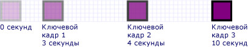

# Практическое руководство. Распределение времени для анимации с ключевыми кадрами

В этом примере показано, как управлять временем ключевых кадров в анимации с ключевым и образом. Как и другие анимации, анимация ключей-кадров имеет свойство. <xref:System.Windows.Media.Animation.Timeline.Duration%2A> Помимо указания продолжительности анимации, необходимо указать, какая часть этой продолжительности отведена каждому из ключевых кадров. Чтобы выделить время, вы <xref:System.Windows.Media.Animation.KeyTime> указываете для каждого ключевого кадра в анимации.

Для <xref:System.Windows.Media.Animation.KeyTime> каждого ключевого кадра указывается, когда заканчивается ключ кадра (в нем не указывается продолжительность времени воспроизведения ключевого кадра). Вы можете <xref:System.Windows.Media.Animation.KeyTime> указать <xref:System.TimeSpan> значение в процентах, <xref:System.Windows.Media.Animation.KeyTime.Uniform%2A> или <xref:System.Windows.Media.Animation.KeyTime.Paced%2A> как или специальное значение.

## Пример

В следующем примере <xref:System.Windows.Media.Animation.DoubleAnimationUsingKeyFrames> используется для анимировать прямоугольник по экрану. Ключевые времена ключевых кадров <xref:System.TimeSpan> устанавливаются значениями.

[!code-csharp[keyframes_snip#KeyTimesTimeSpanExample](~/samples/snippets/csharp/VS_Snippets_Wpf/keyframes_snip/CSharp/KeyTimesExample.cs#keytimestimespanexample)]
[!code-vb[keyframes_snip#KeyTimesTimeSpanExample](~/samples/snippets/visualbasic/VS_Snippets_Wpf/keyframes_snip/visualbasic/keytimesexample.vb#keytimestimespanexample)]
[!code-xaml[keyframes_snip#KeyTimesTimeSpanExample](~/samples/snippets/xaml/VS_Snippets_Wpf/keyframes_snip/XAML/KeyTimesExample.xaml#keytimestimespanexample)]

Следующая иллюстрация показывает, когда значение каждого ключевого кадра достигается.

Следующий пример показывает идентичную анимацию, за исключением того, что ключевые времена ключевых кадров установлены с значениями в процентах.

[!code-csharp[keyframes_snip#KeyTimesPercentageExample](~/samples/snippets/csharp/VS_Snippets_Wpf/keyframes_snip/CSharp/KeyTimesExample.cs#keytimespercentageexample)]
[!code-vb[keyframes_snip#KeyTimesPercentageExample](~/samples/snippets/visualbasic/VS_Snippets_Wpf/keyframes_snip/visualbasic/keytimesexample.vb#keytimespercentageexample)]
[!code-xaml[keyframes_snip#KeyTimesPercentageExample](~/samples/snippets/xaml/VS_Snippets_Wpf/keyframes_snip/XAML/KeyTimesExample.xaml#keytimespercentageexample)]

Следующая иллюстрация показывает, когда значение каждого ключевого кадра достигается.

В следующем <xref:System.Windows.Media.Animation.KeyTime.Uniform%2A> примере используются ключевые значения времени.

[!code-csharp[keyframes_snip#KeyTimesUniformExample](~/samples/snippets/csharp/VS_Snippets_Wpf/keyframes_snip/CSharp/KeyTimesExample.cs#keytimesuniformexample)]
[!code-vb[keyframes_snip#KeyTimesUniformExample](~/samples/snippets/visualbasic/VS_Snippets_Wpf/keyframes_snip/visualbasic/keytimesexample.vb#keytimesuniformexample)]
[!code-xaml[keyframes_snip#KeyTimesUniformExample](~/samples/snippets/xaml/VS_Snippets_Wpf/keyframes_snip/XAML/KeyTimesExample.xaml#keytimesuniformexample)]

Следующая иллюстрация показывает, когда значение каждого ключевого кадра достигается.

В заключительном <xref:System.Windows.Media.Animation.KeyTime.Paced%2A> примере используются ключевые значения времени.

[!code-csharp[keyframes_snip#KeyTimesPacedExample](~/samples/snippets/csharp/VS_Snippets_Wpf/keyframes_snip/CSharp/KeyTimesExample.cs#keytimespacedexample)]
[!code-vb[keyframes_snip#KeyTimesPacedExample](~/samples/snippets/visualbasic/VS_Snippets_Wpf/keyframes_snip/visualbasic/keytimesexample.vb#keytimespacedexample)]
[!code-xaml[keyframes_snip#KeyTimesPacedExample](~/samples/snippets/xaml/VS_Snippets_Wpf/keyframes_snip/XAML/KeyTimesExample.xaml#keytimespacedexample)]

Следующая иллюстрация показывает, когда значение каждого ключевого кадра достигается.

Для простоты в кодовых версиях этого примера используются локальные анимации, а не раскадровки, поскольку к одному свойству применяется только одна анимация, но вместо этого примеры могут быть изменены для использования раскадровок. Например, с указанием того, как [Animate a Property by Using a Storyboard](how-to-animate-a-property-by-using-a-storyboard.md)объявить раскадровку в коде, см.

Описание полного примера см. в разделе [Пример анимации по ключевым кадрам](https://github.com/microsoft/WPF-Samples/tree/master/Animation/KeyFrameAnimation). Для получения дополнительной информации о ключевых анимациях кадра [см.](key-frame-animations-overview.md)

## См. также

- [Общие сведения об анимации по ключевым кадрам](key-frame-animations-overview.md)
- [Общие сведения об эффектах анимации](animation-overview.md)
- [Практические руководства](animation-and-timing-how-to-topics.md)
