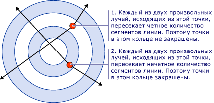
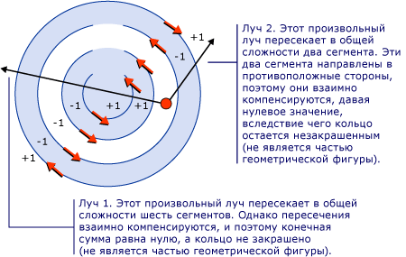
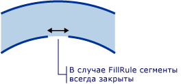

# Практическое руководство. Управление заливкой составных фигур
<xref:System.Windows.Media.GeometryGroup.FillRule%2A> свойство <xref:System.Windows.Media.GeometryGroup> или <xref:System.Windows.Media.PathGeometry>, задает «правило», которое составные фигуры используют, чтобы определить, является ли заданная точка частью геометрии. Существует два возможных значения для <xref:System.Windows.Media.FillRule>: <xref:System.Windows.Media.FillRule> и <xref:System.Windows.Media.FillRule>. Следующие разделы описывают использование этих двух правил.  
  
 **EvenOdd:** это правило определяет, является ли точка в области заполнения путем рисования луча от этой точки до бесконечности в любом направлении и подсчета количества сегментов контура в пределах заданной фигуры, которые пересекает луч. Если это число нечетное, точка находится внутри; если четное — точка находится снаружи.  
  
 Например, приведенный ниже XAML создает составной фигуры, состоящий из ряда концентрических колец (цель) с <xref:System.Windows.Media.GeometryGroup.FillRule%2A> значение <xref:System.Windows.Media.FillRule>.  
  
 [!code-xml[GeometriesMiscSnippets_snip#FillRuleEvenOddValue](../../../../samples/snippets/xaml/VS_Snippets_Wpf/GeometriesMiscSnippets_snip/XAML/FillRuleExample.xaml#fillruleevenoddvalue)]  
  
 На следующем рисунке фигура, созданная в предыдущем примере.  
  
   
  
 В приведенном выше рисунке Обратите внимание, что центр и третье кольцо не заполнены. Это потому, что луч, нарисованный из любой точки в одном из этих двух колец проходит через четное число сегментов. См. рисунок ниже:  
  
   
  
 **Ненулевое значение:** это правило определяет, является ли точка в области заполнения пути путем рисования луча от этой точки до бесконечности в любом направлении и проверкой мест, в которых сегмент фигуры пересекает луч. Начиная с нуля, добавляется единица каждый раз сегмент пересекает луч слева направо, и вычитается единица каждый раз, когда сегмент пересекает луч справа налево. Если после подсчета пересечений результат равен нулю, то точка находится снаружи пути. В противном случае — она находится внутри.  
  
 [!code-xml[GeometriesMiscSnippets_snip#FillRuleNonZeroValueEllipseGeometry](../../../../samples/snippets/xaml/VS_Snippets_Wpf/GeometriesMiscSnippets_snip/XAML/FillRuleExample.xaml#fillrulenonzerovalueellipsegeometry)]  
  
 В примере выше значение <xref:System.Windows.Media.FillRule> для <xref:System.Windows.Media.GeometryGroup.FillRule%2A> дает в результате следующей иллюстрации:  
  
   
  
 Как можно видеть, все кольца заполнены. Это потому, что все сегменты идут в одном направлении и поэтому луч, рисуемый из любой точки, будут пересекать один или несколько сегментов и сумма пересечения не будет равна нулю. Например на следующем рисунке красные стрелки обозначают направление рисуются сегменты и белая стрелка показывают произвольный луч, идущий от точки во внутреннем кольце. Начиная с нуля, для каждого сегмента, который пересекает луч, значение&1; добавляется, так как сегмент пересекает луч слева направо.  
  
   
  
 Чтобы лучше продемонстрировать поведение <xref:System.Windows.Media.FillRule> более сложные фигуры с сегментами в разных направлениях правило является обязательным. Приведенный ниже код XAML создает фигуру, аналогичную в предыдущем примере, за исключением того, что она создается с <xref:System.Windows.Media.PathGeometry> а не <xref:System.Windows.Media.EllipseGeometry> которого создает четыре концентрических дуги а не полностью замкнутые концентрических окружностей.  
  
 [!code-xml[GeometriesMiscSnippets_snip#FillRuleNonZeroValuePathGeometry](../../../../samples/snippets/xaml/VS_Snippets_Wpf/GeometriesMiscSnippets_snip/XAML/FillRuleExample.xaml#fillrulenonzerovaluepathgeometry)]  
  
 На следующем рисунке фигура, созданная в предыдущем примере.  
  
   
  
 Обратите внимание, что третья дуга от центра не заполняется. На приведенном ниже рисунке показана причина этого. На рисунке красные стрелки обозначают направление рисуются сегменты. Две белые стрелки показывают два произвольных луча, которые выходят из точки в «незаполненной» области. Как видно из рисунка, сумма значений из данного луча, пересекающего сегментов в пути равно нулю. Как указано выше, сумма ноль означает, что точка частью геометрии (не является частью заливки) при сумма, которая *не* нулю, в том числе отрицательное значение, является частью геометрии.  
  
   
  
 **Примечание:** в целях <xref:System.Windows.Media.FillRule>, все фигуры считаются замкнутыми. Если имеется разрыв в сегменте, нарисуйте воображаемую линию, чтобы закрыть его. В приведенном выше примере имеются небольшие разрывы в колец. Учитывая это, можно предположить, что луч, проходящий через разрыв, даст результата луча, проходящего в другом направлении. Ниже приведен увеличенный рисунок одного из этих разрывов и «воображаемый сегмент» (сегмент, нарисованный для применения <xref:System.Windows.Media.FillRule>), закрывает его.  
  
   
  
## Пример  
  
## См. также  
 [Создание составной фигуры](../../../../docs/framework/wpf/graphics-multimedia/how-to-create-a-composite-shape.md)   
 [Общие сведения о геометрии](../../../../docs/framework/wpf/graphics-multimedia/geometry-overview.md)