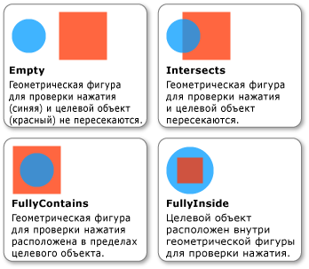

# Практическое руководство. Проверка нажатия с использованием геометрического объекта в качестве параметра
В этом примере показано, как выполнять проверки нажатия визуального объекта при помощи <xref:System.Windows.Media.Geometry> параметра проверки нажатия.  
  
## Пример  
 Приведенный ниже показано, как настроить нажатия, используя <xref:System.Windows.Media.GeometryHitTestParameters> для <xref:System.Windows.Media.VisualTreeHelper.HitTest%2A> метод. <xref:System.Windows.Point> Значение, передаваемое `OnMouseDown` метод используется для создания <xref:System.Windows.Media.Geometry> объекта, чтобы расширить диапазон проверки нажатия.  
  
 [!code-csharp[HitTestingOverview#HitTestingOverviewSnippet10](../../../../samples/snippets/csharp/VS_Snippets_Wpf/HitTestingOverview/CSharp/GeometryHitTest.cs#hittestingoverviewsnippet10)]
 [!code-vb[HitTestingOverview#HitTestingOverviewSnippet10](../../../../samples/snippets/visualbasic/VS_Snippets_Wpf/HitTestingOverview/visualbasic/geometryhittest.vb#hittestingoverviewsnippet10)]  
  
 <xref:System.Windows.Media.GeometryHitTestResult.IntersectionDetail%2A> Свойство <xref:System.Windows.Media.GeometryHitTestResult> предоставляет сведения о результатах проверки нажатия, который использует <xref:System.Windows.Media.Geometry> параметра проверки нажатия. На следующем рисунке показана связь между геометрическим объектом проверки нажатия (синий круг) и отображенным содержимым целевого визуального объекта (красный квадрат).  
  
   
Пересечение между геометрическим объектом проверки попадания и целевым визуальным объектом  
  
 В следующем примере показано, как для реализации обратного вызова проверки нажатия при <xref:System.Windows.Media.Geometry> используется в качестве параметра проверки нажатия. `result` Параметр приведен к <xref:System.Windows.Media.GeometryHitTestResult> для извлечения значения <xref:System.Windows.Media.GeometryHitTestResult.IntersectionDetail%2A> свойство. Значение свойства позволяет определить, если <xref:System.Windows.Media.Geometry> параметра проверки нажатия полностью или частично находится в пределах отображаемого содержимого целевой объект проверки нажатия. В этом случае пример кода только добавляет результаты проверки попадания в список визуальных объектов, которые полностью содержатся в пределах границ целевого объекта.  
  
 [!code-csharp[HitTestingOverview#HitTestingOverviewSnippet11](../../../../samples/snippets/csharp/VS_Snippets_Wpf/HitTestingOverview/CSharp/GeometryHitTest.cs#hittestingoverviewsnippet11)]
 [!code-vb[HitTestingOverview#HitTestingOverviewSnippet11](../../../../samples/snippets/visualbasic/VS_Snippets_Wpf/HitTestingOverview/visualbasic/geometryhittest.vb#hittestingoverviewsnippet11)]  
  
> [!NOTE]
>  <xref:System.Windows.Media.HitTestResult> Обратного вызова не должен вызываться, если пересечение подробные <xref:System.Windows.Media.IntersectionDetail.Empty>.  
  
## См. также  
 [Проверка нажатия на визуальном уровне](../../../../docs/framework/wpf/graphics-multimedia/hit-testing-in-the-visual-layer.md)  
 [Проверка попадания геометрического объекта в визуальный объект](../../../../docs/framework/wpf/graphics-multimedia/how-to-hit-test-geometry-in-a-visual.md)
