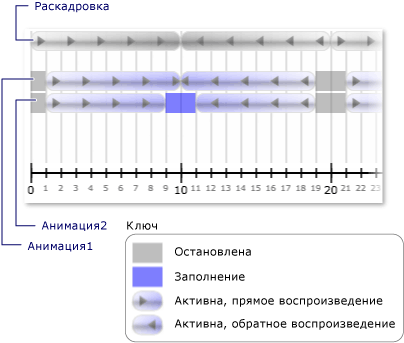

# Практическое руководство. Получение уведомлений при изменениях состояния часов
Часов <xref:System.Windows.Media.Animation.Clock.CurrentStateInvalidated> событие возникает при его <xref:System.Windows.Media.Animation.Clock.CurrentState%2A> становится недействительным, например при запуске или остановке часов. Можно зарегистрировать для этого события напрямую, используя <xref:System.Windows.Media.Animation.Clock>, или с помощью <xref:System.Windows.Media.Animation.Timeline>.  
  
 В следующем примере <xref:System.Windows.Media.Animation.Storyboard> и два <xref:System.Windows.Media.Animation.DoubleAnimation> объекты используются для анимации ширины двух прямоугольников. <xref:System.Windows.Media.Animation.Timeline.CurrentStateInvalidated> Событие используется для прослушивания изменений состояния часов.  
  
## Пример  
 [!code-xaml[timingbehaviors_snip#_graphicsmm_StateExampleMarkupWholePage](~/samples/snippets/csharp/VS_Snippets_Wpf/timingbehaviors_snip/CSharp/StateExample.xaml#_graphicsmm_stateexamplemarkupwholepage)]  
  
 [!code-csharp[timingbehaviors_snip#_graphicsmm_StateEventHandlers](~/samples/snippets/csharp/VS_Snippets_Wpf/timingbehaviors_snip/CSharp/StateExample.xaml.cs#_graphicsmm_stateeventhandlers)]
 [!code-vb[timingbehaviors_snip#_graphicsmm_StateEventHandlers](~/samples/snippets/visualbasic/VS_Snippets_Wpf/timingbehaviors_snip/visualbasic/stateexample.xaml.vb#_graphicsmm_stateeventhandlers)]  
  
 На следующем рисунке показаны различные состояния анимаций введите в качестве родительской временной шкалы (*раскадровки*) продвижения.  
  
   
  
 В следующей таблице показаны значения времени, по которому *Animation1*в <xref:System.Windows.Media.Animation.Timeline.CurrentStateInvalidated> вызывает событие:  
  
||||||||  
|-|-|-|-|-|-|-|  
|Время (в секундах)|1|10|19|21|30|39|  
|Регион|Активная|Активная|Остановлено|Активная|Активная|Остановлено|  
  
 В следующей таблице показаны значения времени, по которому *Animation2*в <xref:System.Windows.Media.Animation.Timeline.CurrentStateInvalidated> вызывает событие:  
  
||||||||||  
|-|-|-|-|-|-|-|-|-|  
|Время (в секундах)|1|9|11|19|21|29|31|39|  
|Регион|Активная|Заполнение|Активная|Остановлено|Активная|Заполнение|Активная|Остановлено|  
  
 Обратите внимание, что *Animation1* <xref:System.Windows.Media.Animation.Timeline.CurrentStateInvalidated> событие запускается в 10 секунд, несмотря на то, что его состояние остается <xref:System.Windows.Media.Animation.ClockState.Active>. Это потому, что ее состояние изменилось на 10 секунд, но изменилось из <xref:System.Windows.Media.Animation.ClockState.Active> для <xref:System.Windows.Media.Animation.ClockState.Filling> и затем обратно до <xref:System.Windows.Media.Animation.ClockState.Active> в одном такте.
