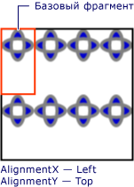

# Практическое руководство. Установка горизонтального и вертикального выравнивания объекта TileBrush
В этом примере показано, как управлять горизонтальным и вертикальным выравниванием содержимого фрагмента мозаики. Для управления горизонтальным и вертикальным выравниванием <xref:System.Windows.Media.TileBrush>, использовать его <xref:System.Windows.Media.TileBrush.AlignmentX%2A> и <xref:System.Windows.Media.TileBrush.AlignmentY%2A> свойства.  
  
 <xref:System.Windows.Media.TileBrush.AlignmentX%2A> И <xref:System.Windows.Media.TileBrush.AlignmentY%2A> свойства <xref:System.Windows.Media.TileBrush> используются при любой из следующих условий верно:  
  
-   <xref:System.Windows.Media.TileBrush.Stretch%2A> Свойство <xref:System.Windows.Media.Stretch.Uniform> или <xref:System.Windows.Media.Stretch.UniformToFill> и <xref:System.Windows.Media.TileBrush.Viewbox%2A> и <xref:System.Windows.Media.TileBrush.Viewport%2A> имеют разные пропорции.  
  
-   <xref:System.Windows.Media.TileBrush.Stretch%2A> Свойство <xref:System.Windows.Media.Stretch.None> и <xref:System.Windows.Media.TileBrush.Viewbox%2A> и <xref:System.Windows.Media.TileBrush.Viewport%2A> имеют разный размер.  
  
## Пример  
 В следующем примере выполняется выравнивание содержимое <xref:System.Windows.Media.DrawingBrush>, который представляет собой разновидность <xref:System.Windows.Media.TileBrush>, в левом верхнем углу его фрагмента мозаики. Выравнивать содержимое, в примере задается <xref:System.Windows.Media.TileBrush.AlignmentX%2A> свойство <xref:System.Windows.Media.DrawingBrush> для <xref:System.Windows.Media.AlignmentX.Left> и <xref:System.Windows.Media.TileBrush.AlignmentY%2A> свойства <xref:System.Windows.Media.AlignmentY.Top>. В этом примере формируются следующие данные:  
  
   
Объект TileBrush с содержимым, выровненным по левому верхнему углу  
  
 [!code-csharp[brushoverviewexamples_snip#TileBrushTopLeftAlignmentInline](~/samples/snippets/csharp/VS_Snippets_Wpf/BrushOverviewExamples_snip/CSharp/TileBrushAlignmentExample.cs#tilebrushtopleftalignmentinline)]
 [!code-vb[brushoverviewexamples_snip#TileBrushTopLeftAlignmentInline](~/samples/snippets/visualbasic/VS_Snippets_Wpf/BrushOverviewExamples_snip/visualbasic/tilebrushalignmentexample.vb#tilebrushtopleftalignmentinline)]
 [!code-xaml[brushoverviewexamples_snip#TileBrushTopLeftAlignmentInline](~/samples/snippets/xaml/VS_Snippets_Wpf/BrushOverviewExamples_snip/XAML/TileBrushAlignmentExample.xaml#tilebrushtopleftalignmentinline)]  
  
## Пример  
 В следующем примере выполняется выравнивание содержимого <xref:System.Windows.Media.DrawingBrush> в правом нижнем углу его фрагмента мозаики, задав <xref:System.Windows.Media.TileBrush.AlignmentX%2A> свойства <xref:System.Windows.Media.AlignmentX.Right> и <xref:System.Windows.Media.TileBrush.AlignmentY%2A> свойства <xref:System.Windows.Media.AlignmentY.Bottom>. В этом примере выводятся следующие данные.  
  
   
Объект TileBrush с содержимым, выровненным по правому нижнему углу  
  
 [!code-csharp[brushoverviewexamples_snip#TileBrushBottomRightAlignmentInline](~/samples/snippets/csharp/VS_Snippets_Wpf/BrushOverviewExamples_snip/CSharp/TileBrushAlignmentExample.cs#tilebrushbottomrightalignmentinline)]
 [!code-vb[brushoverviewexamples_snip#TileBrushBottomRightAlignmentInline](~/samples/snippets/visualbasic/VS_Snippets_Wpf/BrushOverviewExamples_snip/visualbasic/tilebrushalignmentexample.vb#tilebrushbottomrightalignmentinline)]
 [!code-xaml[brushoverviewexamples_snip#TileBrushBottomRightAlignmentInline](~/samples/snippets/xaml/VS_Snippets_Wpf/BrushOverviewExamples_snip/XAML/TileBrushAlignmentExample.xaml#tilebrushbottomrightalignmentinline)]  
  
## Пример  
 В следующем примере выполняется выравнивание содержимого <xref:System.Windows.Media.DrawingBrush> в левом верхнем углу его фрагмента мозаики, задав <xref:System.Windows.Media.TileBrush.AlignmentX%2A> свойства <xref:System.Windows.Media.AlignmentX.Left> и <xref:System.Windows.Media.TileBrush.AlignmentY%2A> свойства <xref:System.Windows.Media.AlignmentY.Top>. Он также задает <xref:System.Windows.Media.TileBrush.Viewport%2A> и <xref:System.Windows.Media.TileBrush.TileMode%2A> из <xref:System.Windows.Media.DrawingBrush> для создания шаблона мозаики. В этом примере выводятся следующие данные.  
  
   
Шаблон мозаики с содержимым, выровненным по левому верхнему углу базового фрагмента мозаики  
  
 На рисунке базовый фрагмент мозаики выделен цветом, чтобы можно было увидеть, как выравнивается содержимое. Обратите внимание, что <xref:System.Windows.Media.TileBrush.AlignmentX%2A> параметр не действует так как содержимое <xref:System.Windows.Media.DrawingBrush> полностью заполняет базовый элемент мозаики по горизонтали.  
  
 [!code-csharp[brushoverviewexamples_snip#TileBrushTopLeftAlignmentTiledInline](~/samples/snippets/csharp/VS_Snippets_Wpf/BrushOverviewExamples_snip/CSharp/TileBrushAlignmentExample.cs#tilebrushtopleftalignmenttiledinline)]
 [!code-vb[brushoverviewexamples_snip#TileBrushTopLeftAlignmentTiledInline](~/samples/snippets/visualbasic/VS_Snippets_Wpf/BrushOverviewExamples_snip/visualbasic/tilebrushalignmentexample.vb#tilebrushtopleftalignmenttiledinline)]
 [!code-xaml[brushoverviewexamples_snip#TileBrushTopLeftAlignmentTiledInline](~/samples/snippets/xaml/VS_Snippets_Wpf/BrushOverviewExamples_snip/XAML/TileBrushAlignmentExample.xaml#tilebrushtopleftalignmenttiledinline)]  
  
## Пример  
 В последнем примере выполняется выравнивание содержимого мозаичного <xref:System.Windows.Media.DrawingBrush> в правом нижнем углу его базового фрагмента мозаики, задав <xref:System.Windows.Media.TileBrush.AlignmentX%2A> свойства <xref:System.Windows.Media.AlignmentX.Right> и <xref:System.Windows.Media.TileBrush.AlignmentY%2A> свойства <xref:System.Windows.Media.AlignmentY.Bottom>. В этом примере выводятся следующие данные.  
  
   
Шаблон мозаики с содержимым, выровненным по правому нижнему углу базового фрагмента мозаики  
  
 Опять же <xref:System.Windows.Media.TileBrush.AlignmentX%2A> параметр не действует так как содержимое <xref:System.Windows.Media.DrawingBrush> полностью заполняет базовый элемент мозаики по горизонтали.  
  
 [!code-csharp[brushoverviewexamples_snip#TileBrushBottomRightAlignmentInline](~/samples/snippets/csharp/VS_Snippets_Wpf/BrushOverviewExamples_snip/CSharp/TileBrushAlignmentExample.cs#tilebrushbottomrightalignmentinline)]
 [!code-vb[brushoverviewexamples_snip#TileBrushBottomRightAlignmentInline](~/samples/snippets/visualbasic/VS_Snippets_Wpf/BrushOverviewExamples_snip/visualbasic/tilebrushalignmentexample.vb#tilebrushbottomrightalignmentinline)]
 [!code-xaml[brushoverviewexamples_snip#TileBrushBottomRightAlignmentInline](~/samples/snippets/xaml/VS_Snippets_Wpf/BrushOverviewExamples_snip/XAML/TileBrushAlignmentExample.xaml#tilebrushbottomrightalignmentinline)]  
  
 В примерах используется <xref:System.Windows.Media.DrawingBrush> объектов, чтобы продемонстрировать, каким образом <xref:System.Windows.Media.TileBrush.AlignmentX%2A> и <xref:System.Windows.Media.TileBrush.AlignmentY%2A> используются свойства. Эти свойства работают одинаково со всеми мозаичными кистями: <xref:System.Windows.Media.DrawingBrush>, <xref:System.Windows.Media.ImageBrush>, и <xref:System.Windows.Media.VisualBrush>. Дополнительные сведения о мозаичных кистях для рисования см. в разделе [Рисование с помощью объектов Image, Drawing и Visual](painting-with-images-drawings-and-visuals.md).  
  
## См. также

- <xref:System.Windows.Media.DrawingBrush>
- <xref:System.Windows.Media.ImageBrush>
- <xref:System.Windows.Media.VisualBrush>
- [Рисование с помощью объектов Image, Drawing и Visual](painting-with-images-drawings-and-visuals.md)
