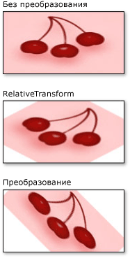

# Практическое руководство. Преобразование кистиHow to: Transform a Brush
В этом примере <xref:System.Windows.Media.Brush> показано, как преобразовывать объекты, используя два их свойства преобразования: <xref:System.Windows.Media.Brush.RelativeTransform%2A> и <xref:System.Windows.Media.Brush.Transform%2A>.This example shows how to transform <xref:System.Windows.Media.Brush> objects by using their two transformation properties: <xref:System.Windows.Media.Brush.RelativeTransform%2A> and <xref:System.Windows.Media.Brush.Transform%2A>.  
  
 В следующих <xref:System.Windows.Media.RotateTransform> примерах используется для <xref:System.Windows.Media.ImageBrush> вращения содержимого на 45 градусов.The following examples use a <xref:System.Windows.Media.RotateTransform> to rotate the content of an <xref:System.Windows.Media.ImageBrush> by 45 degrees.  
  
 Следующая иллюстрация <xref:System.Windows.Media.ImageBrush> показывает <xref:System.Windows.Media.RotateTransform>без <xref:System.Windows.Media.RotateTransform> , с <xref:System.Windows.Media.Brush.RelativeTransform%2A> применяется к <xref:System.Windows.Media.RotateTransform> собственности, и с применяется к собственности. <xref:System.Windows.Media.Brush.Transform%2A>The following illustration shows the <xref:System.Windows.Media.ImageBrush> without a <xref:System.Windows.Media.RotateTransform>, with the <xref:System.Windows.Media.RotateTransform> applied to the <xref:System.Windows.Media.Brush.RelativeTransform%2A> property, and with the <xref:System.Windows.Media.RotateTransform> applied to the <xref:System.Windows.Media.Brush.Transform%2A> property.  
  
   
  
## ПримерExample  
 Первый пример применяется <xref:System.Windows.Media.RotateTransform> <xref:System.Windows.Media.Brush.RelativeTransform%2A> к свойству <xref:System.Windows.Media.ImageBrush>.The first example applies a <xref:System.Windows.Media.RotateTransform> to the <xref:System.Windows.Media.Brush.RelativeTransform%2A> property of an <xref:System.Windows.Media.ImageBrush>. Свойства <xref:System.Windows.Media.RotateTransform.CenterX%2A> <xref:System.Windows.Media.RotateTransform.CenterY%2A> объекта <xref:System.Windows.Media.RotateTransform> установлены на 0,5, что является относительной координатой центральной точки этого содержимого.The <xref:System.Windows.Media.RotateTransform.CenterX%2A> and <xref:System.Windows.Media.RotateTransform.CenterY%2A> properties of a <xref:System.Windows.Media.RotateTransform> object are both set to 0.5, which is the relative coordinate of the center point of this content. В результате содержимое <xref:System.Windows.Media.ImageBrush> вращается вокруг его центра.As a result, the <xref:System.Windows.Media.ImageBrush> content rotates about its center.  
  
 [!code-csharp[BrushesIntroduction_snip#ImageBrushRelativeTransformExample](~/samples/snippets/csharp/VS_Snippets_Wpf/BrushesIntroduction_snip/CSharp/BrushTransformExample.cs#imagebrushrelativetransformexample)]
 [!code-vb[BrushesIntroduction_snip#ImageBrushRelativeTransformExample](~/samples/snippets/visualbasic/VS_Snippets_Wpf/BrushesIntroduction_snip/visualbasic/brushtransformexample.vb#imagebrushrelativetransformexample)]
 [!code-xaml[BrushesIntroduction_snip#ImageBrushRelativeTransformExample](~/samples/snippets/xaml/VS_Snippets_Wpf/BrushesIntroduction_snip/XAML/BrushTransformExample.xaml#imagebrushrelativetransformexample)]  
  
 Второй пример также <xref:System.Windows.Media.RotateTransform> применяется <xref:System.Windows.Media.ImageBrush>к ; однако в этом <xref:System.Windows.Media.Brush.Transform%2A> примере <xref:System.Windows.Media.Brush.RelativeTransform%2A> используется свойство вместо свойства.The second example also applies a <xref:System.Windows.Media.RotateTransform> to an <xref:System.Windows.Media.ImageBrush>; however, this example uses the <xref:System.Windows.Media.Brush.Transform%2A> property instead of the <xref:System.Windows.Media.Brush.RelativeTransform%2A> property.  
  
 Чтобы повернуть кисть вокруг ее центра, <xref:System.Windows.Media.RotateTransform.CenterY%2A> пример <xref:System.Windows.Media.RotateTransform> устанавливает <xref:System.Windows.Media.RotateTransform.CenterX%2A> и свойства объекта к абсолютным координатам.To rotate the brush about its center, the example sets the <xref:System.Windows.Media.RotateTransform.CenterX%2A> and <xref:System.Windows.Media.RotateTransform.CenterY%2A> properties of the <xref:System.Windows.Media.RotateTransform> object to absolute coordinates. Так как эта кисть рисует прямоугольник размером 175 на 90 пикселей, центральная точка прямоугольника имеет координаты (87,5, 45).Because the brush paints a rectangle that is 175 by 90 pixels, the center point of the rectangle is (87.5, 45).  
  
 [!code-csharp[BrushesIntroduction_snip#ImageBrushTransformExample](~/samples/snippets/csharp/VS_Snippets_Wpf/BrushesIntroduction_snip/CSharp/BrushTransformExample.cs#imagebrushtransformexample)]
 [!code-vb[BrushesIntroduction_snip#ImageBrushTransformExample](~/samples/snippets/visualbasic/VS_Snippets_Wpf/BrushesIntroduction_snip/visualbasic/brushtransformexample.vb#imagebrushtransformexample)]
 [!code-xaml[BrushesIntroduction_snip#ImageBrushTransformExample](~/samples/snippets/xaml/VS_Snippets_Wpf/BrushesIntroduction_snip/XAML/BrushTransformExample.xaml#imagebrushtransformexample)]  
  
 Описание того, как <xref:System.Windows.Media.Brush.RelativeTransform%2A> <xref:System.Windows.Media.Brush.Transform%2A> работают и как работают свойства, можно ознакомьтесь с [обзором трансформации кисти.](brush-transformation-overview.md)For a description of how the <xref:System.Windows.Media.Brush.RelativeTransform%2A> and <xref:System.Windows.Media.Brush.Transform%2A> properties work, see the [Brush Transformation Overview](brush-transformation-overview.md).  
  
 Полный пример см. в разделе [Примеры кистей](https://github.com/Microsoft/WPF-Samples/tree/master/Graphics/Brushes).For the complete sample, see [Brushes Sample](https://github.com/Microsoft/WPF-Samples/tree/master/Graphics/Brushes). Дополнительные сведения о кистях см. в разделе [Общие сведения о закраске сплошным цветом и градиентом](painting-with-solid-colors-and-gradients-overview.md).For more information about brushes, see [Painting with Solid Colors and Gradients Overview](painting-with-solid-colors-and-gradients-overview.md).  
  
## См. также разделSee also

- [Общие сведения о преобразованиях кистейBrush Transformation Overview](brush-transformation-overview.md)
- [Общие сведения о закраске сплошным цветом и градиентомPainting with Solid Colors and Gradients Overview](painting-with-solid-colors-and-gradients-overview.md)
- [Общие сведения о классах TransformTransforms Overview](transforms-overview.md)
