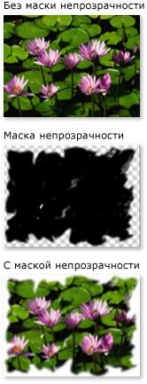
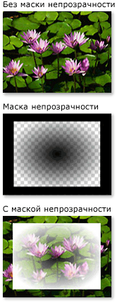

# Общие сведения о масках непрозрачностиOpacity Masks Overview
Маски непрозрачности позволяют делать части элемента или визуального элемента прозрачными или частично прозрачными.Opacity masks enable you to make portions of an element or visual either transparent or partially transparent. Чтобы создать маску непрозрачности, <xref:System.Windows.Media.Brush> вы <xref:System.Windows.UIElement.OpacityMask%2A> применяете свойство элемента или <xref:System.Windows.Media.Visual>.To create an opacity mask, you apply a <xref:System.Windows.Media.Brush> to the <xref:System.Windows.UIElement.OpacityMask%2A> property of an element or <xref:System.Windows.Media.Visual>.  Кисть сопоставляется с элементом или визуальным элементом, а значение непрозрачности каждого пикселя кисти используется для определения результирующей непрозрачности каждого соответствующего пикселя элемента или визуального элемента.The brush is mapped to the element or visual, and the opacity value of each brush pixel is used to determine the resulting opacity of each corresponding pixel of the element or visual.  
  

## Предварительные требованияPrerequisites  
 Этот обзор предполагает, что вы <xref:System.Windows.Media.Brush> знакомы с объектами.This overview assumes that you are familiar with <xref:System.Windows.Media.Brush> objects. Общие сведения об использовании кистей см. в разделе [Общие сведения о закрашивании сплошным цветом и градиентом](painting-with-solid-colors-and-gradients-overview.md).For an introduction to using brushes, see [Painting with Solid Colors and Gradients Overview](painting-with-solid-colors-and-gradients-overview.md). Для получения <xref:System.Windows.Media.ImageBrush> <xref:System.Windows.Media.DrawingBrush>информации о и , см. [Картина с изображениями, рисунки и визуальные эффекты](painting-with-images-drawings-and-visuals.md).For information about <xref:System.Windows.Media.ImageBrush> and <xref:System.Windows.Media.DrawingBrush>, see [Painting with Images, Drawings, and Visuals](painting-with-images-drawings-and-visuals.md).  
  

## Создание визуальных эффектов с помощью маски непрозрачностиCreating Visual Effects with Opacity Masks  
 Маска непрозрачности работает путем сопоставления своего содержимого с элементом или визуальным элементом.An opacity mask works by mapping its contents to the element or visual. Затем используются альфа-канал каждой из точек кисти для определения результирующей непрозрачности элемента или визуального элемента соответствующих точек. Фактический цвет кисти игнорируется.The alpha channel of each of the brush's pixels are then used to determine the resulting opacity of the element or visual's corresponding pixels; the actual color of the brush is ignored. Если данная часть кисти является прозрачной, соответствующая часть элемента или визуального элемента тоже становится прозрачной.If a given portion of the brush is transparent, the corresponding portion of the element or visual becomes transparent. Если данная часть кисти является непрозрачной, непрозрачность соответствующей части элемента или визуального элемента не меняется.If a given portion of the brush is opaque, the opacity of the corresponding portion of the element or visual is unchanged. Непрозрачность, заданная маской непрозрачности, объединяется со всеми параметрами непрозрачности, заданными в элементе или визуальном элементе.The opacity specified by the opacity mask is combined with any opacity settings present in the element or visual. Например, если элемент является непрозрачным на 25 процентов и применяется маска непрозрачности с диапазоном от полной непрозрачности до полной прозрачности, в результате получится элемент с диапазоном от коэффициента непрозрачности 25 процентов до полной прозрачности.For example, if an element is 25 percent opaque and an opacity mask is applied that transitions from fully opaque to fully transparent, the result is an element that transitions from 25 percent opacity to fully transparent.  
  
> [!NOTE]
> Хотя примеры этого обзора демонстрируют использование непрозрачности масок на элементах изображения, маска непрозрачности может быть применена к любому элементу или, <xref:System.Windows.Media.Visual>включая панели и элементы управления.Although the examples in this overview demonstrate the use of opacity masks on image elements, an opacity mask may be applied to any element or <xref:System.Windows.Media.Visual>, including panels and controls.  
  
 Маски непрозрачности используются для создания интересных визуальных эффектов, таких как изображения или кнопки, которые исчезают из виду, для добавления текстур элементов или для объединения градиентов с целью создания стеклянных поверхностей.Opacity masks are used to create interesting visual effects, such as to create images or buttons that fade from view, to add textures to elements, or to combine gradients to produce glass-like surfaces. На следующем рисунке показано использование маски непрозрачности.The following illustration demonstrates the use of an opacity mask. Клетчатый фон используется для отображения прозрачных частей маски.A checkered background is used to show the transparent portions of the mask.  
  
   
Пример использования маски непрозрачностиOpacity masking example  
  

## Создание маски непрозрачностиCreating an Opacity Mask  
 Чтобы создать маску непрозрачности, <xref:System.Windows.Media.Brush> вы создаете <xref:System.Windows.UIElement.OpacityMask%2A> и применяете ее к свойству элемента или визуального.To create an opacity mask, you create a <xref:System.Windows.Media.Brush> and apply it to the <xref:System.Windows.UIElement.OpacityMask%2A> property of an element or visual. Вы можете использовать <xref:System.Windows.Media.Brush> любой тип в качестве непрозрачности маски.You can use any type of <xref:System.Windows.Media.Brush> as an opacity mask.  
  
- <xref:System.Windows.Media.LinearGradientBrush>, <xref:System.Windows.Media.RadialGradientBrush>: Используется, чтобы сделать элемент или визуальный исчезают из поля зрения.<xref:System.Windows.Media.LinearGradientBrush>, <xref:System.Windows.Media.RadialGradientBrush>: Used to make an element or visual fade from view.  
  
     На следующем изображении показана используемая <xref:System.Windows.Media.LinearGradientBrush> в качестве непрозрачности маска.The following image shows a <xref:System.Windows.Media.LinearGradientBrush> used as an opacity mask.  
  
       
Пример применения маски непрозрачности LinearGradientBrushLinearGradientBrush Opacity Masking Example  
  
- <xref:System.Windows.Media.ImageBrush>: Используется для создания текстуры и мягких или разорванных эффектов края.<xref:System.Windows.Media.ImageBrush>: Used to create texture and soft or torn edge effects.  
  
     На следующем изображении показана используемая <xref:System.Windows.Media.ImageBrush> в качестве непрозрачности маска.The following image shows an <xref:System.Windows.Media.ImageBrush> used as an opacity mask.  
  
       
Пример применения маски непрозрачности LinearGradientBrushLinearGradientBrush opacity masking example  
  
- <xref:System.Windows.Media.DrawingBrush>: Используется для создания сложных непрозрачности маски из моделей форм, изображений и градиентов.<xref:System.Windows.Media.DrawingBrush>: Used to create complex opacity masks from patterns of shapes, images, and gradients.  
  
     На следующем изображении показана используемая <xref:System.Windows.Media.DrawingBrush> в качестве непрозрачности маска.The following image shows a <xref:System.Windows.Media.DrawingBrush> used as an opacity mask.  
  
       
Пример применения маски непрозрачности DrawingBrushDrawingBrush opacity masking example  
  
 Кисти градиента (и<xref:System.Windows.Media.LinearGradientBrush> <xref:System.Windows.Media.RadialGradientBrush>) особенно хорошо подходят для использования в качестве непрозрачности маски.The gradient brushes (<xref:System.Windows.Media.LinearGradientBrush> and <xref:System.Windows.Media.RadialGradientBrush>) are particularly well-suited for use as an opacity mask. Потому <xref:System.Windows.Media.SolidColorBrush> что заполняет область с однородным цветом, они делают плохие маски непрозрачности; <xref:System.Windows.Media.SolidColorBrush> использование элемента эквивалентно настройке свойства элемента или визуального. <xref:System.Windows.UIElement.OpacityMask%2A>Because a <xref:System.Windows.Media.SolidColorBrush> fills an area with a uniform color, they make poor opacity masks; using a <xref:System.Windows.Media.SolidColorBrush> is equivalent to setting the element's or visual's <xref:System.Windows.UIElement.OpacityMask%2A> property.  
  

## Использование градиента в качестве маски непрозрачностиUsing a Gradient as an Opacity Mask  
 Чтобы создать градиентную заливку, необходимо указать два или несколько ограничений градиента.To create a gradient fill, you specify two or more gradient stops. Каждое ограничение градиента содержит описание цвета и положения. (Дополнительные сведения о создании и использовании градиентов см. в разделе [Общие сведения о закрашивании сплошным цветом и градиентом](painting-with-solid-colors-and-gradients-overview.md).)Each gradient stop contains describes a color and a position (see [Painting with Solid Colors and Gradients Overview](painting-with-solid-colors-and-gradients-overview.md) for more information about creating and using gradients). Использование градиента аналогично использованию маски непрозрачности за исключением того, что вместо смешения цветов, градиент маски непрозрачности смешивает значения альфа-канала.The process is the same when using a gradient as an opacity mask, except that, instead of blending colors, the opacity mask gradient blends alpha channel values. Поэтому фактический цвет содержимого градиента не имеет значения. Имеет значение только альфа-канал или непрозрачность каждого цвета.So the actual color of the gradient's contents do not matter; only the alpha channel, or opacity, of each color matters. Пример приведен ниже.The following is an example.  
  
 [!code-xaml[OpacityMasksSnippet#LinearGradientOpacityMaskonImage](~/samples/snippets/csharp/VS_Snippets_Wpf/OpacityMasksSnippet/CS/GradientBrushExample.xaml#lineargradientopacitymaskonimage)]  
  

## Задание ограничений градиента для маски непрозрачностиSpecifying Gradient Stops for an Opacity Mask  
 В предыдущем примере в качестве <xref:System.Windows.Media.Colors.Black%2A> стартового цвета градиента используется определяемый системой цвет.In the previous example, the system-defined color <xref:System.Windows.Media.Colors.Black%2A> is used as the starting color of the gradient. Поскольку все цвета <xref:System.Windows.Media.Colors> в классе, за исключением, <xref:System.Windows.Media.Colors.Transparent%2A>полностью непрозрачны, они могут быть использованы для простого определения стартового цвета для градиентной непрозрачности маски.Because all of the colors in the <xref:System.Windows.Media.Colors> class, except <xref:System.Windows.Media.Colors.Transparent%2A>, are fully opaque, they can be used to simply define a starting color for a gradient opacity mask.  
  
 Для дополнительного контроля над альфа-значениями при определении непрозрачности маски можно указать альфа-канал цветов с помощью гексадециальной обозначения ARGB в разметке или с помощью метода. <xref:System.Windows.Media.Color.FromScRgb%2A?displayProperty=nameWithType>For additional control over alpha values when defining an opacity mask, you can specify the alpha channel of colors using ARGB hexadecimal notation in markup or using the <xref:System.Windows.Media.Color.FromScRgb%2A?displayProperty=nameWithType> method.  
  

### Задание непрозрачности цвета в XAMLSpecifying Color Opacity in "XAML"  
 В [!INCLUDE[TLA#tla_xaml](../../../../includes/tlasharptla-xaml-md.md)], вы используете ARGB гексадецимальной обозначения, чтобы указать непрозрачность отдельных цветов.In [!INCLUDE[TLA#tla_xaml](../../../../includes/tlasharptla-xaml-md.md)], you use  ARGB hexadecimal notation to specify the opacity of individual colors. АРГБ гексадецимальная нотация использует следующий синтаксис:ARGB hexadecimal notation uses the following syntax:  
  
 `#` **aa** *rrggbb*`#` **aa** *rrggbb*  
  
 Здесь *aa* — двузначное шестнадцатеричное значение, используемое для указания непрозрачности цвета.The *aa* in the previous line represents a two-digit hexadecimal value used to specify the opacity of the color. *rr*, *gg* и *bb* — двузначные шестнадцатеричные значения, используемые для указания насыщенности красного, зеленого и синего цветов.The *rr*, *gg*, and *bb* each represent a two digit hexadecimal value used to specify the amount of red, green, and blue in the color. Шестнадцатеричная цифра может принимать значения от 0 до F (сначала цифры от 0 до 9, затем буквы от A до F).Each hexadecimal digit may have a value from 0-9 or A-F. Наименьшее значение — 0, наибольшее — F.0 is the smallest value, and F is the greatest. Альфа-значение 00 задает полностью прозрачный цвет, а альфа-значение FF — полностью непрозрачный цвет.An alpha value of 00 specifies a color that is completely transparent, while an alpha value of FF creates a color that is fully opaque.  В следующем примере для обозначения двух цветов используется гексадецичная нотация ARGB.In the following example, hexadecimal ARGB notation is used to specify two colors. Первый — полностью непрозрачный, второй — полностью прозрачный.The first is fully opaque, while the second is completely transparent.  
  
 [!code-xaml[OpacityMasksSnippet#AARRGGBBValueonOpacityMask](~/samples/snippets/csharp/VS_Snippets_Wpf/OpacityMasksSnippet/CS/GradientBrushExample.xaml#aarrggbbvalueonopacitymask)]  
  

## Использование изображения в качестве маски непрозрачностиUsing an Image as an Opacity Mask  
 Изображения также могут использоваться в качестве масок непрозрачности.Images can also be used as an opacity mask. Пример приведен на следующем рисунке.The following image shows an example. Клетчатый фон используется для отображения прозрачных частей маски.A checkered background is used to show the transparent portions of the mask.  
  
   
Пример использования маски непрозрачностиOpacity masking example  
  
 Чтобы использовать изображение в качестве маски <xref:System.Windows.Media.ImageBrush> непрозрачности, используйте для содержания изображения.To use an image as an opacity mask, use an <xref:System.Windows.Media.ImageBrush> to contain the image. При создании изображения, которое будет использоваться в качестве маски непрозрачности, сохраните изображение в формате, поддерживающем несколько уровней прозрачности, таких как Portable Network Graphics (PNG).When creating an image to be used as an opacity mask, save the image in a format that supports multiple levels of transparency, such as Portable Network Graphics (PNG). В следующем примере показан код, используемый для создания предыдущей иллюстрации.The following example shows the code used to create the previous illustration.  
  
 [!code-xaml[OpacityMasksSnippet#UIElementOpacityMask](~/samples/snippets/csharp/VS_Snippets_Wpf/OpacityMasksSnippet/CS/ImageBrushExample.xaml#uielementopacitymask)]  
  

### Использование мозаичного изображения в качестве маски непрозрачностиUsing a Tiled Image as an Opacity Mask  
 В следующем примере то же изображение <xref:System.Windows.Media.ImageBrush>используется с другим, но функции плитки кисти используются для получения плитки изображения площадью 50 пикселей.In the following example, the same image is used with another <xref:System.Windows.Media.ImageBrush>, but the brush's tiling features are used to produce tiles of the image 50 pixels square.  
  
 [!code-xaml[OpacityMasksSnippet#TiledImageasOpacityMask](~/samples/snippets/csharp/VS_Snippets_Wpf/OpacityMasksSnippet/CS/ImageBrushExample.xaml#tiledimageasopacitymask)]  
  

## Создание маски непрозрачности из рисункаCreating an Opacity Mask from a Drawing  
 Рисунки могут быть использованы как маски непрозрачности.Drawings can be used an opacity mask. Фигуры, содержащиеся в рисунке, могут быть сами заполнены градиентом, сплошным цветом, изображением или даже другим рисунком.The shapes contained within the drawing can themselves be filled with gradients, solid colors, images, or even other drawings. На следующем рисунке приведен пример рисунка, используемого в качестве маски непрозрачности.The following image shows an example of a drawing used as an opacity mask. Клетчатый фон используется для отображения прозрачных частей маски.A checkered background is used to show the transparent portions of the mask.  
  
   
Пример применения маски непрозрачности DrawingBrushDrawingBrush opacity masking example  
  
 Чтобы использовать рисунок в качестве непрозрачности маски, используйте, <xref:System.Windows.Media.DrawingBrush> чтобы содержать рисунок.To use a drawing as an opacity mask, use a <xref:System.Windows.Media.DrawingBrush> to contain the drawing. В следующем примере показан код, используемый для создания предыдущей иллюстрации.The following example shows the code used to create the previous illustration:  
  
 [!code-xaml[OpacityMasksSnippet#OpacityMaskfromDrawing](~/samples/snippets/csharp/VS_Snippets_Wpf/OpacityMasksSnippet/CS/DrawingBrushExample.xaml#opacitymaskfromdrawing)]  
  

### Использование мозаичного рисунка в качестве маски непрозрачностиUsing a Tiled Drawing as an Opacity Mask  
 <xref:System.Windows.Media.ImageBrush>Как, как <xref:System.Windows.Media.DrawingBrush> , может быть сделано, чтобы плитка его рисунок.Like the <xref:System.Windows.Media.ImageBrush>, the <xref:System.Windows.Media.DrawingBrush> can be made to tile its drawing. В следующем примере кисть рисунка используется для создания мозаичной маски непрозрачности.In the following example, a drawing brush is used to create a tiled opacity mask.  
  
 [!code-xaml[OpacityMasksSnippet#TiledDrawingasOpacityMask](~/samples/snippets/csharp/VS_Snippets_Wpf/OpacityMasksSnippet/CS/DrawingBrushExample.xaml#tileddrawingasopacitymask)]  
  
## См. также разделSee also

- [Заполнение с использованием изображений, рисунков и визуальных элементовPainting with Images, Drawings, and Visuals](painting-with-images-drawings-and-visuals.md)
- [Общие сведения о закраске сплошным цветом и градиентомPainting with Solid Colors and Gradients Overview](painting-with-solid-colors-and-gradients-overview.md)
