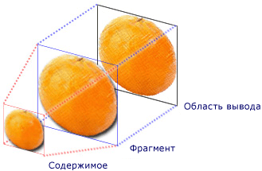
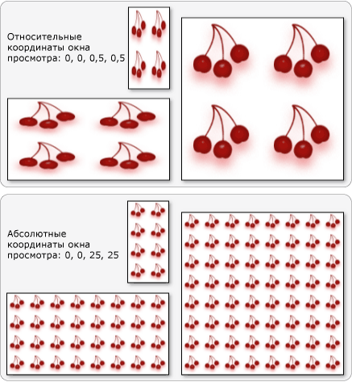

# Общие сведения о TileBrush
<xref:System.Windows.Media.TileBrush>объекты предоставляют вам большой контроль над тем, как <xref:System.Windows.Media.Drawing>область <xref:System.Windows.Media.Visual>окрашена с изображением, или . Эта тема описывает, <xref:System.Windows.Media.TileBrush> как использовать функции, <xref:System.Windows.Media.ImageBrush> <xref:System.Windows.Media.DrawingBrush>чтобы <xref:System.Windows.Media.VisualBrush> получить больше контроля над тем, как , или краски области.  

## Предварительные требования  
 Чтобы понять эту тему, полезно понять, как использовать <xref:System.Windows.Media.ImageBrush> <xref:System.Windows.Media.DrawingBrush>основные <xref:System.Windows.Media.VisualBrush> особенности, или класс. Для введения в эти типы, см [Картина с изображениями, рисунки и визуальные эффекты](painting-with-images-drawings-and-visuals.md).  
  

## Заполнение области с помощью мозаики  
 <xref:System.Windows.Media.ImageBrush>, <xref:System.Windows.Media.DrawingBrush>являются <xref:System.Windows.Media.VisualBrush> типами <xref:System.Windows.Media.TileBrush> объектов. Мозаичная кисть позволяет тщательно контролировать заполнение области для изображений, рисунков и визуальных элементов. Например, можно заполнить область не одним растянутым изображением, а элементами мозаики, которые образуют узор.  
  
 Заполнение области с помощью мозаичной кисти включает три компонента: содержимое, базовый элемент мозаики и область вывода.  
  
   
Компоненты TileBrush с одним элементом мозаики  
  
   
Компоненты TileBrush с TileMode, имеющим значение Tile  
  
 Выходной области является область окрашены, <xref:System.Windows.Shapes.Shape.Fill%2A> такие <xref:System.Windows.Shapes.Ellipse> как <xref:System.Windows.Controls.Control.Background%2A> или <xref:System.Windows.Controls.Button>. В следующих разделах описаны <xref:System.Windows.Media.TileBrush>два других компонента .  
  

## Содержимое кисти  
 Есть три различных <xref:System.Windows.Media.TileBrush> типа и каждая краска с различным типом содержания.  
  
- Если кисть <xref:System.Windows.Media.ImageBrush>является, это содержание <xref:System.Windows.Media.ImageBrush.ImageSource%2A> является изображением Свойство определяет <xref:System.Windows.Media.ImageBrush>содержимое .  
  
- Если кисть <xref:System.Windows.Media.DrawingBrush>, это содержание является чертежом. Свойство <xref:System.Windows.Media.DrawingBrush.Drawing%2A> определяет содержимое <xref:System.Windows.Media.DrawingBrush>.  
  
- Если <xref:System.Windows.Media.VisualBrush>кисть, это содержание является визуальным. Свойство <xref:System.Windows.Media.VisualBrush.Visual%2A> определяет содержание <xref:System.Windows.Media.VisualBrush>.  
  
 Вы можете указать положение <xref:System.Windows.Media.TileBrush> и размеры <xref:System.Windows.Media.TileBrush.Viewbox%2A> содержимого с помощью <xref:System.Windows.Media.TileBrush.Viewbox%2A> свойства, хотя обычно он оставляет набор на его значение по умолчанию. По умолчанию <xref:System.Windows.Media.TileBrush.Viewbox%2A> настроен, чтобы полностью содержать содержимое кисти. Для получения дополнительной информации <xref:System.Windows.Controls.Viewbox>о <xref:System.Windows.Controls.Viewbox> настройке — см.  
  

## Базовый элемент мозаики  
 Проектирует <xref:System.Windows.Media.TileBrush> его содержимое на базовую плитку. Свойство <xref:System.Windows.Media.TileBrush.Stretch%2A> контролирует, как <xref:System.Windows.Media.TileBrush> содержимое растягивается, чтобы заполнить базовую плитку. Свойство <xref:System.Windows.Media.TileBrush.Stretch%2A> принимает следующие значения, определяемые перечислением: <xref:System.Windows.Media.Stretch>  
  
- <xref:System.Windows.Media.Stretch.None>: Содержимое кисти не растягивается, чтобы заполнить плитку.  
  
- <xref:System.Windows.Media.Stretch.Fill>: Содержимое кисти масштабируется в соответствии с плиткой. Поскольку высота и ширина содержимого масштабируются независимо друг от друга, исходные пропорции содержимого могут не сохраняться. То есть содержимое кисти может быть деформировано для полного заполнения выводимого элемента.  
  
- <xref:System.Windows.Media.Stretch.Uniform>: Содержимое кисти масштабируется так, что она полностью вписывается в плитку. Пропорции содержимого сохраняются.  
  
- <xref:System.Windows.Media.Stretch.UniformToFill>Содержимое кисти масштабируется таким образом, что она полностью заполняет область вывода, сохраняя при этом исходное соотношение сторон содержимого.  
  
 Следующее изображение иллюстрирует <xref:System.Windows.Media.TileBrush.Stretch%2A> различные настройки.  
  
   
  
 В следующем примере содержимое <xref:System.Windows.Media.ImageBrush> а устанавливается таким образом, чтобы оно не растягивалось для заполнения выходной области.  
  
 [!code-xaml[BrushOverviewExamples_snip#GraphicsMMNoStretchExample](~/samples/snippets/xaml/VS_Snippets_Wpf/BrushOverviewExamples_snip/XAML/StretchExample.xaml#graphicsmmnostretchexample)]  
  
 [!code-csharp[BrushOverviewExamples_procedural_snip#GraphicsMMNoStretchExample](~/samples/snippets/csharp/VS_Snippets_Wpf/BrushOverviewExamples_procedural_snip/CSharp/StretchExample.cs#graphicsmmnostretchexample)]
 [!code-vb[BrushOverviewExamples_procedural_snip#GraphicsMMNoStretchExample](~/samples/snippets/visualbasic/VS_Snippets_Wpf/BrushOverviewExamples_procedural_snip/visualbasic/stretchexample.vb#graphicsmmnostretchexample)]  
  
 По умолчанию, <xref:System.Windows.Media.TileBrush> генерирует одну плитку (базовая плитка) и растягивает эту плитку, чтобы полностью заполнить выходную область. Вы можете изменить размер и положение базовой <xref:System.Windows.Media.TileBrush.Viewport%2A> <xref:System.Windows.Media.TileBrush.ViewportUnits%2A> плитки, установив и свойства.  
  

### Размер базового элемента мозаики  
 Свойство <xref:System.Windows.Media.TileBrush.Viewport%2A> определяет размер и положение базовой плитки, а <xref:System.Windows.Media.TileBrush.ViewportUnits%2A> <xref:System.Windows.Media.TileBrush.Viewport%2A> указанное ли свойство с использованием абсолютных или относительных координат. Относительные координаты задаются относительно размера области вывода. Точка (0, 0) представляет левый верхний угол области вывода, а точка (1, 1) — правый нижний угол области вывода. Чтобы указать, что свойство <xref:System.Windows.Media.TileBrush.Viewport%2A> использует <xref:System.Windows.Media.TileBrush.ViewportUnits%2A> абсолютные координаты, установите свойство на <xref:System.Windows.Media.BrushMappingMode.Absolute>.  
  
 Ниже приведена иллюстрация, на <xref:System.Windows.Media.TileBrush> примере <xref:System.Windows.Media.TileBrush.ViewportUnits%2A>просеиваемого между относительно-относительной и абсолютной. Обратите внимание, что на каждом рисунке показан шаблон мозаики. В следующем разделе описано, как задать шаблон заполнения.  
  
   
  
 В следующем примере с помощью изображения создается элемент с шириной и высотой 50 %. Базовый элемент мозаики расположен в точке (0, 0) области вывода.  
  
 [!code-xaml[BrushOverviewExamples_snip#GraphicsMMRelativeViewportUnitsExample1](~/samples/snippets/xaml/VS_Snippets_Wpf/BrushOverviewExamples_snip/XAML/TileSizeExample.xaml#graphicsmmrelativeviewportunitsexample1)]  
  
 [!code-csharp[BrushOverviewExamples_procedural_snip#GraphicsMMRelativeViewportUnitsExample1](~/samples/snippets/csharp/VS_Snippets_Wpf/BrushOverviewExamples_procedural_snip/CSharp/TileSizeExample.cs#graphicsmmrelativeviewportunitsexample1)]
 [!code-vb[BrushOverviewExamples_procedural_snip#GraphicsMMRelativeViewportUnitsExample1](~/samples/snippets/visualbasic/VS_Snippets_Wpf/BrushOverviewExamples_procedural_snip/visualbasic/tilesizeexample.vb#graphicsmmrelativeviewportunitsexample1)]  
  
 Следующий пример устанавливает плитки <xref:System.Windows.Media.ImageBrush> до 25 на 25 устройств независимых пикселей. Поскольку <xref:System.Windows.Media.TileBrush.ViewportUnits%2A> <xref:System.Windows.Media.ImageBrush> эти плитки являются абсолютными, плитки всегда 25 на 25 пикселей, независимо от размера окрашенной площади.  
  
 [!code-xaml[BrushOverviewExamples_snip#GraphicsMMAbsoluteViewportUnitsExample1](~/samples/snippets/xaml/VS_Snippets_Wpf/BrushOverviewExamples_snip/XAML/TileSizeExample.xaml#graphicsmmabsoluteviewportunitsexample1)]  
  
 [!code-csharp[BrushOverviewExamples_procedural_snip#GraphicsMMAbsoluteViewportUnitsExample1](~/samples/snippets/csharp/VS_Snippets_Wpf/BrushOverviewExamples_procedural_snip/CSharp/TileSizeExample.cs#graphicsmmabsoluteviewportunitsexample1)]
 [!code-vb[BrushOverviewExamples_procedural_snip#GraphicsMMAbsoluteViewportUnitsExample1](~/samples/snippets/visualbasic/VS_Snippets_Wpf/BrushOverviewExamples_procedural_snip/visualbasic/tilesizeexample.vb#graphicsmmabsoluteviewportunitsexample1)]  
  

### Поведение элементов при заполнении  
 A <xref:System.Windows.Media.TileBrush> производит черепичную узор, когда его базовая плитка не <xref:System.Windows.Media.TileMode.None> полностью заполняет выходную область, а другой режим плитки указывается. Когда плитка плитки плитки не полностью <xref:System.Windows.Media.TileBrush.TileMode%2A> заполняет выходную область, ее свойство определяет, следует ли дублировать базовую плитку для заполнения выходной области и, если да, то как базовая плитка должна быть дублирована. Свойство <xref:System.Windows.Media.TileBrush.TileMode%2A> принимает следующие значения, определяемые перечислением: <xref:System.Windows.Media.TileMode>  
  
- <xref:System.Windows.Media.TileMode.None>: Нарисована только базовая плитка.  
  
- <xref:System.Windows.Media.TileMode.Tile>: Базовая плитка нарисована, а остальная область заполняется, повторяя базовую плитку таким образом, что правый край одной плитки примыкает к левому краю следующей, и аналогично для нижней и верхней.  
  
- <xref:System.Windows.Media.TileMode.FlipX>: Так <xref:System.Windows.Media.TileMode.Tile>же, как, но альтернативные столбцы плитки переворачиваются горизонтально.  
  
- <xref:System.Windows.Media.TileMode.FlipY>: То <xref:System.Windows.Media.TileMode.Tile>же самое, что, но альтернативные ряды плиток переворачиваются вертикально.  
  
- <xref:System.Windows.Media.TileMode.FlipXY>: Сочетание <xref:System.Windows.Media.TileMode.FlipX> и <xref:System.Windows.Media.TileMode.FlipY>.  
  
 На следующем рисунке показаны различные режимы заполнения.  
  
   
  
 В следующем примере изображение используется для заполнения прямоугольника размерами 100 на 100 пикселей. При установке кисти <xref:System.Windows.Media.TileBrush.Viewport%2A> была установлена на 0,0,0,0,25,0,25, базовая плитка кисти сделана на 1/4 от выходной области. Кисть <xref:System.Windows.Media.TileBrush.TileMode%2A> установлена на <xref:System.Windows.Media.TileMode.FlipXY>. Таким образом прямоугольник заполняется строками из элементов мозаики.  
  
 [!code-xaml[BrushOverviewExamples_snip#GraphicsMMFlipXYExample](~/samples/snippets/xaml/VS_Snippets_Wpf/BrushOverviewExamples_snip/XAML/TilingExample.xaml#graphicsmmflipxyexample)]  
  
 [!code-csharp[BrushOverviewExamples_procedural_snip#GraphicsMMFlipXYExample](~/samples/snippets/csharp/VS_Snippets_Wpf/BrushOverviewExamples_procedural_snip/CSharp/TilingExample.cs#graphicsmmflipxyexample)]
 [!code-vb[BrushOverviewExamples_procedural_snip#GraphicsMMFlipXYExample](~/samples/snippets/visualbasic/VS_Snippets_Wpf/BrushOverviewExamples_procedural_snip/visualbasic/tilingexample.vb#graphicsmmflipxyexample)]  
  
## См. также раздел

- <xref:System.Windows.Media.ImageBrush>
- <xref:System.Windows.Media.DrawingBrush>
- <xref:System.Windows.Media.VisualBrush>
- <xref:System.Windows.Media.TileBrush>
- [Заполнение с использованием изображений, рисунков и визуальных элементов](painting-with-images-drawings-and-visuals.md)
- [Как-к темам](brushes-how-to-topics.md)
- [Общие сведения об объектах класса Freezable](../advanced/freezable-objects-overview.md)
- [Пример использования ImageBrush](https://github.com/Microsoft/WPF-Samples/tree/master/Graphics/ImageBrush)
- [Пример использования VisualBrush](https://github.com/Microsoft/WPF-Samples/tree/master/Graphics/VisualBrush)
