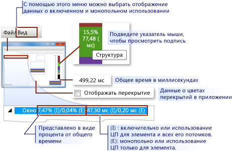
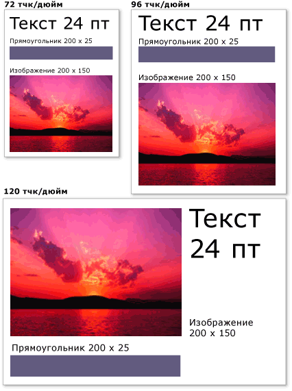

# Общие сведения об отрисовке графики в WPF
В этом разделе приведены общие сведения о визуальном слое [!INCLUDE[TLA2#tla_winclient](../../../../includes/tla2sharptla-winclient-md.md)]. Основное внимание в нем <xref:System.Windows.Media.Visual> уделяется роли класса [!INCLUDE[TLA2#tla_winclient](../../../../includes/tla2sharptla-winclient-md.md)] для оказания поддержки в модели.  

## Роль визуального объекта  
 Класс <xref:System.Windows.Media.Visual> является основной абстракцией, из которой происходит каждый <xref:System.Windows.FrameworkElement> объект. Эта абстракция также служит точкой входа для написания новых элементов управления [!INCLUDE[TLA2#tla_winclient](../../../../includes/tla2sharptla-winclient-md.md)], и во многих случаях ее можно рассматривать в качестве дескриптора окна (HWND) в модели приложения Win32.  
  
 Объект <xref:System.Windows.Media.Visual> является основным [!INCLUDE[TLA2#tla_winclient](../../../../includes/tla2sharptla-winclient-md.md)] объектом, основная роль которого заключается в предоставлении поддержки рендеринга. Элементы управления интерфейсом <xref:System.Windows.Controls.TextBox>пользователя, <xref:System.Windows.Media.Visual> такие как <xref:System.Windows.Controls.Button> и, вытекают из класса, и используют его для сохранения своих рендеринга данных. Объект <xref:System.Windows.Media.Visual> обеспечивает поддержку:  
  
- Отображение выходных данных: визуализация сохраненного, сериализованного содержимого визуального элемента.  
  
- Преобразование: поддерживает преобразование визуального элемента.  
  
- Отсечение: позволяет указать область отсечения для визуального элемента.  
  
- Проверка нажатия: определяет, содержится ли координата или геометрическая фигура в границах визуального объекта.  
  
- Вычисление ограничивающего прямоугольника: определение ограничивающего прямоугольника визуального объекта.  
  
 Однако <xref:System.Windows.Media.Visual> объект не включает поддержку нерентарентирующих функций, таких как:  
  
- Обработка событий  
  
- Макет  
  
- Стили  
  
- привязка данных,  
  
- Глобализация  
  
 <xref:System.Windows.Media.Visual>подвергается как публичный абстрактный класс, из которого должны быть выведены детские классы. На следующем рисунке показана иерархия визуальных объектов, которые предоставляются в [!INCLUDE[TLA2#tla_winclient](../../../../includes/tla2sharptla-winclient-md.md)].  
  
 
  
### Класс DrawingVisual  
 Это <xref:System.Windows.Media.DrawingVisual> легкий класс рисования, который используется для визуализации форм, изображений или текста. Этот класс считается упрощенным, так как не предоставляет средств для работы с разметкой и обработку событий, что повышает его производительность. Поэтому этот класс идеально подходит для фоновых рисунков или клипов. Можно <xref:System.Windows.Media.DrawingVisual> использовать для создания пользовательского визуального объекта. Дополнительные сведения см. в разделе [Использование объектов DrawingVisual](using-drawingvisual-objects.md).  
  
### Класс Viewport3DVisual  
 Мост <xref:System.Windows.Media.Media3D.Viewport3DVisual> между 2D <xref:System.Windows.Media.Visual> и <xref:System.Windows.Media.Media3D.Visual3D> объектами. Класс <xref:System.Windows.Media.Media3D.Visual3D> является базовым классом для всех 3D визуальных элементов. Требуется <xref:System.Windows.Media.Media3D.Viewport3DVisual> определить <xref:System.Windows.Media.Media3D.Viewport3DVisual.Camera%2A> значение и <xref:System.Windows.Media.Media3D.Viewport3DVisual.Viewport%2A> значение. Камера позволяет просмотреть сцену. Окно просмотра определяет, где проекция преобразуется в двумерную поверхность. Для получения дополнительной информации о 3D в [!INCLUDE[TLA2#tla_winclient](../../../../includes/tla2sharptla-winclient-md.md)], см. [3D Graphics Overview](3-d-graphics-overview.md)  
  
### Класс ContainerVisual  
 Класс <xref:System.Windows.Media.ContainerVisual> используется в качестве контейнера <xref:System.Windows.Media.Visual> для сбора объектов. Класс <xref:System.Windows.Media.DrawingVisual> происходит от <xref:System.Windows.Media.ContainerVisual> класса, что позволяет ему содержать коллекцию визуальных объектов.  
  
### Рисование содержимого в объектах Visual  
 Объект <xref:System.Windows.Media.Visual> хранит свои данные рендеринга в виде **списка инструкций по векторной графике.** Каждый элемент в списке инструкций представляет низкоуровневый набор графических данных и связанных ресурсов в сериализованном формате. Существует четыре различных типа данных отрисовки, которые могут включать графическое содержимое.  
  
|Тип содержимого для отрисовки|Описание|  
|--------------------------|-----------------|  
|Векторная графика|Представляет векторные графические <xref:System.Windows.Media.Brush> <xref:System.Windows.Media.Pen> данные, а также любую связанную и информацию.|  
|Образ —|Представляет изображение в пределах <xref:System.Windows.Rect>области, определяемой .|  
|Глиф|Представляет <xref:System.Windows.Media.GlyphRun>рисунок, который отображает , который представляет собой последовательность глифов из указанного ресурса шрифта. Таким образом представляется текст.|  
|Видеоролик|Представляет рисунок, отображающий видео.|  
  
 Позволяет <xref:System.Windows.Media.DrawingContext> заполнить с визуальным <xref:System.Windows.Media.Visual> содержанием. При использовании <xref:System.Windows.Media.DrawingContext> команд рисования объекта фактически хранился набор данных рендеринга, которые позже будут использоваться графической системой; вы не рисуете на экране в режиме реального времени.  
  
 При создании [!INCLUDE[TLA2#tla_winclient](../../../../includes/tla2sharptla-winclient-md.md)] элемента управления, <xref:System.Windows.Controls.Button>например, элемент управления, неявно генерирует рендерные данные для самого рисования. Например, установка <xref:System.Windows.Controls.ContentControl.Content%2A> свойства <xref:System.Windows.Controls.Button> причин элемента управления для хранения рендеринга представления глифа.  
  
 A <xref:System.Windows.Media.Visual> описывает его содержимое <xref:System.Windows.Media.Drawing> как один <xref:System.Windows.Media.DrawingGroup>или несколько объектов, содержащихся в . Также <xref:System.Windows.Media.DrawingGroup> описывает непрозрачность масок, преобразований, эффектов биткарты и других операций, которые применяются к ее содержимому. <xref:System.Windows.Media.DrawingGroup>операции применяются в следующем порядке, когда <xref:System.Windows.Media.DrawingGroup.OpacityMask%2A> <xref:System.Windows.Media.DrawingGroup.Opacity%2A>содержимое <xref:System.Windows.Media.DrawingGroup.GuidelineSet%2A>отображается: <xref:System.Windows.Media.DrawingGroup.Transform%2A>, , <xref:System.Windows.Media.DrawingGroup.BitmapEffect%2A> <xref:System.Windows.Media.DrawingGroup.ClipGeometry%2A>, , и затем .  
  
 На следующей иллюстрации <xref:System.Windows.Media.DrawingGroup> показан порядок, в котором операции применяются во время последовательности рендеринга.  
  
   
Порядок операций DrawingGroup  
  
 Дополнительные сведения см. в разделе [Обзор объектов Drawing](drawing-objects-overview.md).  
  
#### Отображение содержимого на визуальном уровне  
 Вы никогда непосредственно мгновенного <xref:System.Windows.Media.DrawingContext>; вы можете, однако, приобрести контекст чертежа из определенных методов, таких как <xref:System.Windows.Media.DrawingGroup.Open%2A?displayProperty=nameWithType> и <xref:System.Windows.Media.DrawingVisual.RenderOpen%2A?displayProperty=nameWithType>. Следующий пример извлекает <xref:System.Windows.Media.DrawingContext> <xref:System.Windows.Media.DrawingVisual> из a и использует его для рисования прямоугольника.  
  
 [!code-csharp[drawingvisualsample#101](~/samples/snippets/csharp/VS_Snippets_Wpf/DrawingVisualSample/CSharp/Window1.xaml.cs#101)]
 [!code-vb[drawingvisualsample#101](~/samples/snippets/visualbasic/VS_Snippets_Wpf/DrawingVisualSample/visualbasic/window1.xaml.vb#101)]  
  
#### Перечисление содержимого рисования на визуальном уровне  
 В дополнение к другим <xref:System.Windows.Media.Drawing> видам использования, объекты также предоставляют объектную модель для перечисления <xref:System.Windows.Media.Visual>содержимого.  
  
> [!NOTE]
> При перечислении содержимого визуального изображения вы извлекаете <xref:System.Windows.Media.Drawing> объекты, а не основное представление данных рендеринга в виде списка инструкций по векторной графике.  
  
 В следующем примере <xref:System.Windows.Media.VisualTreeHelper.GetDrawing%2A> используется метод <xref:System.Windows.Media.DrawingGroup> для <xref:System.Windows.Media.Visual> получения значения и перечисления его.  
  
 [!code-csharp[DrawingMiscSnippets_snip#GraphicsMMRetrieveDrawings](~/samples/snippets/csharp/VS_Snippets_Wpf/DrawingMiscSnippets_snip/CSharp/EnumerateDrawingsExample.xaml.cs#graphicsmmretrievedrawings)]  
  

## Использование визуальных объектов для создания элементов управления  
 Многие из объектов в [!INCLUDE[TLA2#tla_winclient](../../../../includes/tla2sharptla-winclient-md.md)] состоят из других визуальных объектов, то есть они могут содержать различные иерархии объектов-потомков. Многие элементы пользовательского интерфейса в [!INCLUDE[TLA2#tla_winclient](../../../../includes/tla2sharptla-winclient-md.md)], например элементы управления, состоят из нескольких визуальных объектов, которые представляют различные типы прорисовываемых элементов. Например, <xref:System.Windows.Controls.Button> элемент управления может содержать ряд <xref:Microsoft.Windows.Themes.ClassicBorderDecorator>других <xref:System.Windows.Controls.ContentPresenter>объектов, в том числе <xref:System.Windows.Controls.TextBlock>и.  
  
 Следующий код <xref:System.Windows.Controls.Button> показывает элемент управления, определенный в разметке.  
  
 [!code-xaml[VisualsOverview#VisualsOverviewSnippet1](~/samples/snippets/csharp/VS_Snippets_Wpf/VisualsOverview/CSharp/Window1.xaml#visualsoverviewsnippet1)]  
  
 Если перечислить визуальные объекты, составляющие <xref:System.Windows.Controls.Button> элемент управления по умолчанию, можно найти иерархию визуальных объектов, иллюстрированную ниже:  
  
 
  
 Элемент <xref:System.Windows.Controls.Button> содержит <xref:Microsoft.Windows.Themes.ClassicBorderDecorator> элемент, который, в <xref:System.Windows.Controls.ContentPresenter> свою очередь, содержит элемент. Элемент <xref:Microsoft.Windows.Themes.ClassicBorderDecorator> отвечает за рисование границы <xref:System.Windows.Controls.Button>и фона для . Элемент <xref:System.Windows.Controls.ContentPresenter> отвечает за отображение <xref:System.Windows.Controls.Button>содержимого. В этом случае, поскольку вы <xref:System.Windows.Controls.ContentPresenter> отображаете <xref:System.Windows.Controls.TextBlock> текст, элемент содержит элемент. Тот факт, <xref:System.Windows.Controls.Button> что <xref:System.Windows.Controls.ContentPresenter> элемент управления использует средства, что содержимое может <xref:System.Windows.Controls.Image> быть представлено другими <xref:System.Windows.Media.EllipseGeometry>элементами, такими как или геометрия, такие как .  
  
### Шаблоны элементов управления  
 Ключом к расширению элемента управления в иерархию элементов управления является <xref:System.Windows.Controls.ControlTemplate>. Шаблон элемента управления определяет визуальную иерархию по умолчанию для элемента управления. При явной ссылке на элемент управления вы неявно ссылаетесь на его визуальную иерархию. Для изменения внешнего вида элемента управления вы можете переопределить значения по умолчанию для шаблона элемента управления. Например, можно изменить значение фонового <xref:System.Windows.Controls.Button> цвета элемента управления таким образом, чтобы он использует линейное значение цвета градиента вместо твердого цветового значения. Дополнительные сведения см. в разделе [Стили и шаблоны кнопок](../controls/button-styles-and-templates.md).  
  
 Элемент пользовательского интерфейса, <xref:System.Windows.Controls.Button> например элемент управления, содержит несколько списков инструкций по векторной графике, описывающих все определение рендеринга элемента управления. Следующий код <xref:System.Windows.Controls.Button> показывает элемент управления, определенный в разметке.  
  
 [!code-xaml[VisualsOverview#VisualsOverviewSnippet2](~/samples/snippets/csharp/VS_Snippets_Wpf/VisualsOverview/CSharp/Window1.xaml#visualsoverviewsnippet2)]  
  
 Если перечислить визуальные объекты и списки инструкций <xref:System.Windows.Controls.Button> по векторной графике, составляющие элемент управления, вы обнаружите иерархию объектов, иллюстрированную ниже:  
  
   
  
 Элемент <xref:System.Windows.Controls.Button> содержит <xref:Microsoft.Windows.Themes.ClassicBorderDecorator> элемент, который, в <xref:System.Windows.Controls.ContentPresenter> свою очередь, содержит элемент. Элемент <xref:Microsoft.Windows.Themes.ClassicBorderDecorator> отвечает за рисование всех дискретных графических элементов, которые составляют границу и фон кнопки. Элемент <xref:System.Windows.Controls.ContentPresenter> отвечает за отображение <xref:System.Windows.Controls.Button>содержимого. В этом случае, поскольку вы отображаете изображение, <xref:System.Windows.Controls.ContentPresenter> элемент содержит <xref:System.Windows.Controls.Image> элемент.  
  
 При работе с иерархией визуальных объектов и списками инструкций векторной графики следует учитывать несколько моментов.  
  
- Порядок иерархии представляет порядок отрисовки графической информации. От корневого визуального элемента дочерние элементы распространяются слева направо и сверху вниз. Если у элемента есть дочерние визуальные элементы, они распространяются до элементов того же уровня.  
  
- Элементы нелистовых узлов в иерархии, такие как, <xref:System.Windows.Controls.ContentPresenter>используются для содержащих элементы ребенка — они не содержат списков инструкций.  
  
- Если визуальный элемент содержит как список инструкций векторной графики, так и визуальные дочерние объекты, то список инструкций в родительском визуальном элементе выполняется перед тем, как будут прорисованы любые визуальные дочерние объекты.  
  
- Элементы в списке инструкций векторной графики обрабатываются слева направо.  
  

## Видимое дерево  
 Визуальное дерево содержит все визуальные элементы, которые используются в пользовательском интерфейсе приложения. Поскольку визуальный элемент содержит постоянную графическую информацию, визуальное дерево можно представить как граф сцены, содержащий все необходимые сведения об отрисовке, необходимые для формирования выходных данных для устройства отображения. Это дерево представляет собой совокупность всех визуальных элементов, созданных непосредственно в приложении (в коде или в разметке). Визуальное дерево также содержит все визуальные элементы, созданные путем расширения шаблона элементов, таких как элементы управления и объекты данных.  
  
 Следующий код <xref:System.Windows.Controls.StackPanel> показывает элемент, определенный в разметке.  
  
 [!code-xaml[VisualsOverview#VisualsOverviewSnippet3](~/samples/snippets/csharp/VS_Snippets_Wpf/VisualsOverview/CSharp/Window1.xaml#visualsoverviewsnippet3)]  
  
 Если перечислить визуальные объекты, составляющие <xref:System.Windows.Controls.StackPanel> элемент в примере разметки, можно найти иерархию визуальных объектов, иллюстрированную ниже:  
  
   
  
### Порядок отрисовки  
 Визуальное дерево определяет порядок отрисовки визуальных элементов и графических объектов [!INCLUDE[TLA2#tla_winclient](../../../../includes/tla2sharptla-winclient-md.md)]. Обработка начинается с корневого визуального элемента, самого верхнего узла в визуальном дереве. Затем обрабатываются дочерние элементы корневого визуального элемента слева направо. Если у визуального элемента есть дочерние элементы, они обрабатываются перед элементами, находящимися на одном уровне с визуальным элементом. Это означает, что содержимое дочерних визуальных элементов отображается перед содержимым самого визуального элемента.  
  
 
  
### Корневой визуальный элемент  
 **Корневой визуальный элемент** — это самый верхний элемент в иерархии визуального дерева. В большинстве приложений базовый класс <xref:System.Windows.Window> корневого визуального является либо <xref:System.Windows.Navigation.NavigationWindow>. Однако при размещении визуальных объектов в приложении Win32 в качестве корневого визуального элемента использовался бы самый верхний визуальный элемент в окне Win32. Дополнительные сведения см. в разделе [Руководство по размещению визуальных объектов в приложении Win32](tutorial-hosting-visual-objects-in-a-win32-application.md).  
  
### Связь с логическом деревом  
 Логическое дерево в [!INCLUDE[TLA2#tla_winclient](../../../../includes/tla2sharptla-winclient-md.md)] представляет элементы приложения во время выполнения. Хотя этим деревом нельзя управлять напрямую, с помощью этой схемы удобно представить наследование свойств и маршрутизацию событий. В отличие от визуального дерева, логическое дерево <xref:System.Windows.Documents.ListItem>может представлять невизуальные объекты данных, такие как . Во многих случаях логическое дерево приближается к определению разметки приложения. Следующий код <xref:System.Windows.Controls.DockPanel> показывает элемент, определенный в разметке.  
  
 [!code-xaml[VisualsOverview#VisualsOverviewSnippet5](~/samples/snippets/csharp/VS_Snippets_Wpf/VisualsOverview/CSharp/Window1.xaml#visualsoverviewsnippet5)]  
  
 Если перечислить логические объекты, составляющие <xref:System.Windows.Controls.DockPanel> элемент в примере разметки, можно найти иерархию логических объектов, иллюстрированных ниже:  
  
   
Схема логического дерева  
  
 Визуальное дерево и логическое дерево синхронизируются с текущим набором элементов приложения, отражая добавление, удаление или изменение элементов. Однако эти деревья отражают различные представления приложения. В отличие от визуального дерева, логическое <xref:System.Windows.Controls.ContentPresenter> дерево не расширяет элемент элемента управления. Это означает, что между логическим деревом и визуальным деревом для одного и того же набора объектов нет прямого однозначного соответствия. На самом деле, ссылаясь на <xref:System.Windows.LogicalTreeHelper.GetChildren%2A> метод **объекта LogicalTreeHelper** и <xref:System.Windows.Media.VisualTreeHelper.GetChild%2A> метод **VisualTreeHelper,** используя тот же элемент, что и параметр дает разные результаты.  
  
 Дополнительные сведения о логическом дереве см. в разделе [Деревья в WPF](../advanced/trees-in-wpf.md).  
  
### Просмотр визуального дерева с помощью XamlPad  
 Инструмент, [!INCLUDE[TLA2#tla_winclient](../../../../includes/tla2sharptla-winclient-md.md)] XamlPad, предоставляет возможность для просмотра и изучения визуального дерева, которое соответствует в настоящее время определены XAML содержание. Для отображения визуального дерева нажмите кнопку **Показать визуальное дерево**. Ниже иллюстрируется расширение содержимого XAML в визуальные узлы деревьев в панели **Visual Tree Explorer** XamlPad:  
  
   

 Обратите <xref:System.Windows.Controls.Label>внимание, <xref:System.Windows.Controls.TextBox>как <xref:System.Windows.Controls.Button> , и контролирует каждый дисплей отдельной визуальной иерархии объектов в **панели Visual Tree Explorer** XamlPad. Это потому, [!INCLUDE[TLA2#tla_winclient](../../../../includes/tla2sharptla-winclient-md.md)] <xref:System.Windows.Controls.ControlTemplate> что элементы управления имеют, что содержит визуальное дерево, что контроль. При явной ссылке на элемент управления вы неявно ссылаетесь на его визуальную иерархию.  
  
### Профилирование производительности для объекта Visual  
 В состав [!INCLUDE[TLA2#tla_winclient](../../../../includes/tla2sharptla-winclient-md.md)] входит пакет инструментов для профилирования производительности, с помощью которых можно проанализировать поведение приложения во время выполнения и определить, каким образом можно повысить производительность. Средство Visual Profiler предоставляет подробные данные о производительности в удобном графическом формате, сопоставляя их напрямую с визуальным деревом приложения. На этом снимке экрана показан раздел **Использование ЦП** средства Visual Profiler. В этом разделе вы можете получить точное представление об использовании объектом служб [!INCLUDE[TLA2#tla_winclient](../../../../includes/tla2sharptla-winclient-md.md)], таких как отрисовка и разметка.  
  
   
Отображение данных Visual Profiler  
  

## Поведение отрисовки для объекта Visual  
 [!INCLUDE[TLA2#tla_winclient](../../../../includes/tla2sharptla-winclient-md.md)] включает несколько возможностей, влияющих на отрисовку визуальных объектов: графика, векторная графика и аппаратно независимая графика.  
  
### Абстрактный графический режим  
 Для понимания роли объекта Visual необходимо хорошо представлять различие между системами с **непосредственным** и **абстрактным** графическими режимами. В стандартном приложении Win32 на основе GDI или GDI+ используется непосредственный графический режим. Это означает, что приложение отвечает за перерисовку той части клиентской области, которая стала недействительной из-за таких действий, как изменение размера окна или изменение внешнего вида объекта.  
  
   
  
 В [!INCLUDE[TLA2#tla_winclient](../../../../includes/tla2sharptla-winclient-md.md)], напротив, используется абстрактный графический режим. Это означает, что в объектах приложения, у которых есть внешний облик, определяется набор сериализованных графических данных. После определения графических данных система отвечает на все запросы перерисовки для отрисовки объектов приложения. Даже во время выполнения можно изменять или создавать объекты приложения, при этом система будет обрабатывать запросы на перерисовку. Преимущество абстрактного режима состоит в том, что данные отрисовки всегда сохраняются приложением в сериализованном виде, при этом за отрисовку отвечает система. На следующей схеме показано, как приложение полагается на [!INCLUDE[TLA2#tla_winclient](../../../../includes/tla2sharptla-winclient-md.md)] для обработки запросов на отрисовку.  
  
   

#### Интеллектуальная перерисовка  
 Одним из основных преимуществ использования абстрактного графического режима является то, что [!INCLUDE[TLA2#tla_winclient](../../../../includes/tla2sharptla-winclient-md.md)] может эффективно оптимизировать элементы приложения, которые требуют перерисовки. Даже при наличии сложной сцены с различными уровнями прозрачности разработчикам обычно не нужно писать специальный код для оптимизации перерисовки. Сравните это с программированием для Win32, в котором можно потратить значительные усилия на оптимизацию приложения, уменьшая объем перерисовки в области обновления. Пример сложного случая оптимизации перерисовки для приложений Win32 см. в разделе [Перерисовка в области обновления](/windows/desktop/gdi/redrawing-in-the-update-region).  
  
### Векторная графика  
 [!INCLUDE[TLA2#tla_winclient](../../../../includes/tla2sharptla-winclient-md.md)] использует **векторную графику** качестве формата данных отрисовки. Векторная графика, к которой относятся масштабируемые векторные рисунки (SVG), метафайлы Windows (WMF) и шрифты TrueType, хранит данные отрисовки и передает их в виде списка инструкций, которые описывают, как воссоздать изображение с помощью графических примитивов. Например, шрифты TrueType — это контурные шрифты, которые описывают набор линий, кривых и команд, а не массив точек. Одним из основных преимуществ векторной графики является возможность масштабирования до любого размера и разрешения.  
  
 В отличие от векторной графики в растровой графике данные отрисовки представлены в попиксельном виде для определенного разрешения. Одним из ключевых различий между растровой и векторной графикой является соответствие исходному изображению. Например, при изменении размера исходного изображения в растровой графике изображение растягивается, тогда как в векторной — масштабируется с сохранением качества.  
  
 На следующем рисунке показано исходное изображение, которое было увеличено в 3 раза (масштаб 300 %). Обратите внимание на искажения, которые появляются при растяжении исходного изображения в растровом формате по сравнению с векторным.  
  
   
  
 Следующая разметка <xref:System.Windows.Shapes.Path> показывает два определенных элемента. Второй элемент использует <xref:System.Windows.Media.ScaleTransform> для того чтобы изменить инструкции чертежа первого элемента 300%. Обратите внимание, что инструкции по рисованию в элементах остаются неизменными. <xref:System.Windows.Shapes.Path>  
  
 [!code-xaml[VectorGraphicsSnippets#VectorGraphicsSnippet1](~/samples/snippets/csharp/VS_Snippets_Wpf/VectorGraphicsSnippets/CS/PageOne.xaml#vectorgraphicssnippet1)]  
  
### О разрешении и аппаратно независимой графике  
 Существуют два фактора, которые определяют размер текста и графики на экране: разрешение и количество точек на дюйм. Разрешение определяет число пикселей, отображаемых на экране. Чем выше разрешение, тем меньше размер пикселей и тем меньше отображаемые объекты и текст. Изображение на мониторе с разрешением 1024 x 768 значительно уменьшится, если изменить разрешение на 1600 x 1200.  
  
 Другой системный параметр, количество точек на дюйм, описывает размер дюйма экрана в пикселях. Большинство систем Windows имеют DPI 96, что означает, что экран дюйма составляет 96 пикселей. При повышении количества точек на дюйм экранный дюйм увеличивается, при понижении — уменьшается. Это означает, что дюйм экрана не совпадает с размером настоящего дюйма, по крайней мере в большинстве систем. При увеличении количества точек на дюйм изображения и текст становятся больше, так как увеличивается размер экранного дюйма. Увеличение количества точек на дюйм может сделать текст более удобным для чтения, особенно при высоких разрешениях.  
  
 Не все приложения поддерживают количество точек на дюйм: в некоторых приложениях в качестве основной единицы измерения используются аппаратно зависимые пиксели, и изменение количества точек на дюйм не влияет на такие приложения. Во многих других приложениях количество точек на дюйм используется при описании размеров шрифта, но для остальных элементов используются пиксели. Слишком маленькое или слишком большое количество точек на дюйм может вызвать проблемы с разметкой для этих приложений, так как размер текста приложения будет изменяться с изменением системного количества точек на дюйм, тогда как интерфейс приложения изменяться не будет. Для приложений, разработанных с помощью [!INCLUDE[TLA2#tla_winclient](../../../../includes/tla2sharptla-winclient-md.md)], эта проблема устранена.  
  
 [!INCLUDE[TLA2#tla_winclient](../../../../includes/tla2sharptla-winclient-md.md)] поддерживает автоматическое масштабирование с помощью аппаратно независимых пикселей вместо аппаратно зависимых пикселей; изображения и текст масштабируются правильно без дополнительных действий со стороны разработчика приложения. На следующем рисунке показан пример отображения текста и графики [!INCLUDE[TLA2#tla_winclient](../../../../includes/tla2sharptla-winclient-md.md)] с различными параметрами количества точек на дюйм.  
  
   
Изображения и текст с различными параметрами количества точек на дюйм  
  

## Класс VisualTreeHelper  
 Класс <xref:System.Windows.Media.VisualTreeHelper> представляет собой статический класс помощников, который обеспечивает низкоуровневую функциональность для программирования на уровне визуального объекта, что полезно в очень конкретных сценариях, таких как разработка высокопроизводительных пользовательских элементов управления. В большинстве случаев [!INCLUDE[TLA2#tla_winclient](../../../../includes/tla2sharptla-winclient-md.md)] объекты инфраструктуры <xref:System.Windows.Controls.Canvas> <xref:System.Windows.Controls.TextBlock>более высокого уровня, такие как и, обеспечивают большую гибкость и простоту использования.  
  
### Проверка нажатия  
 Класс <xref:System.Windows.Media.VisualTreeHelper> предоставляет методы для тестирования навизуальных объектах, когда поддержка теста по умолчанию не отвечает вашим потребностям. Можно использовать <xref:System.Windows.Media.VisualTreeHelper.HitTest%2A> методы в <xref:System.Windows.Media.VisualTreeHelper> классе, чтобы определить, находится ли значение геометрии или координации точки в пределах границы данного объекта, например элемент управления или графический элемент. Например, с помощью проверки нажатия можно определить, попадает ли щелчок мыши в пределах ограничивающего прямоугольника объекта в окружность. Также можно переопределить реализацию проверки нажатия по умолчанию и выполнять собственные вычисления для проверки нажатия.  
  
 Дополнительные сведения о проверке нажатия см. в разделе [Проверка нажатия на визуальном уровне](hit-testing-in-the-visual-layer.md).  
  
### Перечисление визуального дерева  
 Класс <xref:System.Windows.Media.VisualTreeHelper> предоставляет функциональность для перечисления элементов визуального дерева. Чтобы получить родительский метод, позвоните по методу. <xref:System.Windows.Media.VisualTreeHelper.GetParent%2A> Чтобы получить ребенка или прямого потомка визуального <xref:System.Windows.Media.VisualTreeHelper.GetChild%2A> объекта, позвоните в метод. Этот метод возвращает <xref:System.Windows.Media.Visual> ребенка родителя в указанном индексе.  
  
 В следующем примере показано, как перечислить всех потомков визуального объекта. Этот метод можно использовать для сериализации всех данных отрисовки в иерархии визуального объекта.  
  
 [!code-csharp[VisualsOverview#101](~/samples/snippets/csharp/VS_Snippets_Wpf/VisualsOverview/CSharp/Window1.xaml.cs#101)]
 [!code-vb[VisualsOverview#101](~/samples/snippets/visualbasic/VS_Snippets_Wpf/VisualsOverview/visualbasic/window1.xaml.vb#101)]  
  
 В большинстве случаев логическое дерево более удобно для представления элементов приложения [!INCLUDE[TLA2#tla_winclient](../../../../includes/tla2sharptla-winclient-md.md)]. Хотя логическое дерево нельзя изменить напрямую, с помощью этой схемы удобно представить наследование свойств и маршрутизацию событий. В отличие от визуального дерева, логическое дерево <xref:System.Windows.Documents.ListItem>может представлять невизуальные объекты данных, такие как . Дополнительные сведения о логическом дереве см. в разделе [Деревья в WPF](../advanced/trees-in-wpf.md).  
  
 Класс <xref:System.Windows.Media.VisualTreeHelper> предоставляет методы для возвращения связующего прямоугольника визуальных объектов. Вы можете вернуть ограничивающий прямоугольник визуального объекта, позвонив. <xref:System.Windows.Media.VisualTreeHelper.GetContentBounds%2A> Вы можете вернуть ограничивающий прямоугольник всех потомков визуального объекта, включая сам визуальный объект, позвонив. <xref:System.Windows.Media.VisualTreeHelper.GetDescendantBounds%2A> В следующем коде показано, как вычислить ограничивающие прямоугольники для визуального объекта и всех его потомков.  
  
 [!code-csharp[VisualsOverview#102](~/samples/snippets/csharp/VS_Snippets_Wpf/VisualsOverview/CSharp/Window1.xaml.cs#102)]
 [!code-vb[VisualsOverview#102](~/samples/snippets/visualbasic/VS_Snippets_Wpf/VisualsOverview/visualbasic/window1.xaml.vb#102)]  
  
## См. также раздел

- <xref:System.Windows.Media.Visual>
- <xref:System.Windows.Media.VisualTreeHelper>
- <xref:System.Windows.Media.DrawingVisual>
- [Двумерная графика и изображения](../advanced/optimizing-performance-2d-graphics-and-imaging.md)
- [Проверка попадания на визуальном уровне](hit-testing-in-the-visual-layer.md)
- [Использование объектов DrawingVisual](using-drawingvisual-objects.md)
- [Руководство по размещению визуальных объектов в приложении Win32](tutorial-hosting-visual-objects-in-a-win32-application.md)
- [Улучшение производительности приложений WPF](../advanced/optimizing-wpf-application-performance.md)
