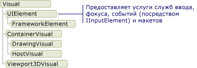
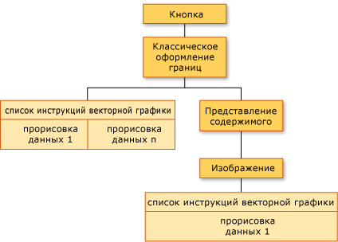
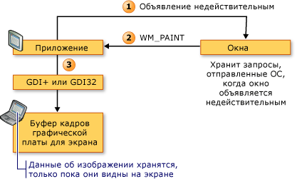
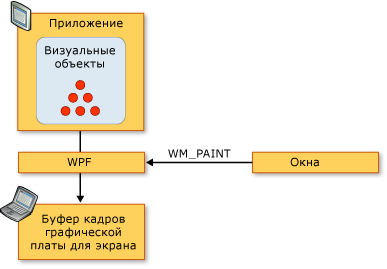
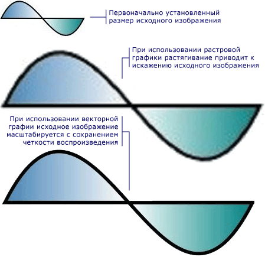

# Общие сведения об отрисовке графики в WPFWPF Graphics Rendering Overview
В этом разделе приведены общие сведения о визуальном слое [!INCLUDE[TLA2#tla_winclient](../../../../includes/tla2sharptla-winclient-md.md)].This topic provides an overview of the [!INCLUDE[TLA2#tla_winclient](../../../../includes/tla2sharptla-winclient-md.md)] visual layer. Этот раздел посвящен роль <xref:System.Windows.Media.Visual> класс поддержке отрисовки в [!INCLUDE[TLA2#tla_winclient](../../../../includes/tla2sharptla-winclient-md.md)] модели.It focuses on the role of the <xref:System.Windows.Media.Visual> class for rendering support in the [!INCLUDE[TLA2#tla_winclient](../../../../includes/tla2sharptla-winclient-md.md)] model.  
  
  
   
## Роль визуального объектаRole of the Visual Object  
 <xref:System.Windows.Media.Visual> Класс — это базовая абстракция, из которого каждый <xref:System.Windows.FrameworkElement> объект является производным.The <xref:System.Windows.Media.Visual> class is the basic abstraction from which every <xref:System.Windows.FrameworkElement> object derives. Эта абстракция также служит точкой входа для написания новых элементов управления [!INCLUDE[TLA2#tla_winclient](../../../../includes/tla2sharptla-winclient-md.md)], и во многих случаях ее можно рассматривать в качестве дескриптора окна (HWND) в модели приложения Win32.It also serves as the entry point for writing new controls in [!INCLUDE[TLA2#tla_winclient](../../../../includes/tla2sharptla-winclient-md.md)], and in many ways can be thought of as the window handle (HWND) in the Win32 application model.  
  
 <xref:System.Windows.Media.Visual> Объект — это основное [!INCLUDE[TLA2#tla_winclient](../../../../includes/tla2sharptla-winclient-md.md)] объекта, Главная роль которого заключается в поддержке отрисовки.The <xref:System.Windows.Media.Visual> object is a core [!INCLUDE[TLA2#tla_winclient](../../../../includes/tla2sharptla-winclient-md.md)] object, whose primary role is to provide rendering support. Элементы управления пользовательского интерфейса, такие как <xref:System.Windows.Controls.Button> и <xref:System.Windows.Controls.TextBox>, являются производными от <xref:System.Windows.Media.Visual> класса и использовать его для сохранения данных отрисовки.User interface controls, such as <xref:System.Windows.Controls.Button> and <xref:System.Windows.Controls.TextBox>, derive from the <xref:System.Windows.Media.Visual> class, and use it for persisting their rendering data. <xref:System.Windows.Media.Visual> Объект обеспечивает поддержку:The <xref:System.Windows.Media.Visual> object provides support for:  
  
-   Отображение выходных данных: визуализация сохраненного, сериализованного содержимого визуального элемента.Output display: Rendering the persisted, serialized drawing content of a visual.  
  
-   Преобразование: поддерживает преобразование визуального элемента.Transformations: Performing transformations on a visual.  
  
-   Отсечение: позволяет указать область отсечения для визуального элемента.Clipping: Providing clipping region support for a visual.  
  
-   Проверка нажатия: определяет, содержится ли координата или геометрическая фигура в границах визуального объекта.Hit testing: Determining whether a coordinate or geometry is contained within the bounds of a visual.  
  
-   Вычисление ограничивающего прямоугольника: определение ограничивающего прямоугольника визуального объекта.Bounding box calculations: Determining the bounding rectangle of a visual.  
  
 Тем не менее <xref:System.Windows.Media.Visual> объект, не включает поддержку функций без подготовки отчетов, такие как:However, the <xref:System.Windows.Media.Visual> object does not include support for non-rendering features, such as:  
  
-   Обработка событийEvent handling  
  
-   МакетLayout  
  
-   СтилиStyles  
  
-   привязка данных,Data binding  
  
-   ГлобализацияGlobalization  
  
 <xref:System.Windows.Media.Visual> указывается в виде открытого абстрактный класс, из которого должны наследоваться дочерние классы.<xref:System.Windows.Media.Visual> is exposed as a public abstract class from which child classes must be derived. На следующем рисунке показана иерархия визуальных объектов, которые предоставляются в [!INCLUDE[TLA2#tla_winclient](../../../../includes/tla2sharptla-winclient-md.md)].The following illustration shows the hierarchy of the visual objects that are exposed in [!INCLUDE[TLA2#tla_winclient](../../../../includes/tla2sharptla-winclient-md.md)].  
  
   
Иерархия класса VisualVisual class hierarchy  
  
### Класс DrawingVisualDrawingVisual Class  
 <xref:System.Windows.Media.DrawingVisual> — Упрощенный класс, используемый для отрисовки фигур, изображений и текста.The <xref:System.Windows.Media.DrawingVisual> is a lightweight drawing class that is used to render shapes, images, or text. Этот класс считается упрощенным, так как не предоставляет средств для работы с разметкой и обработку событий, что повышает его производительность.This class is considered lightweight because it does not provide layout or event handling, which improves its runtime performance. Поэтому этот класс идеально подходит для фоновых рисунков или клипов.For this reason, drawings are ideal for backgrounds and clip art. <xref:System.Windows.Media.DrawingVisual> Может быть использован для создания пользовательского визуального объекта.The <xref:System.Windows.Media.DrawingVisual> can be used to create a custom visual object. Дополнительные сведения см. в разделе [Использование объектов DrawingVisual](../../../../docs/framework/wpf/graphics-multimedia/using-drawingvisual-objects.md).For more information, see [Using DrawingVisual Objects](../../../../docs/framework/wpf/graphics-multimedia/using-drawingvisual-objects.md).  
  
### Класс Viewport3DVisualViewport3DVisual Class  
 <xref:System.Windows.Media.Media3D.Viewport3DVisual> Обеспечивает связь между 2D <xref:System.Windows.Media.Visual> и <xref:System.Windows.Media.Media3D.Visual3D> объектов.The <xref:System.Windows.Media.Media3D.Viewport3DVisual> provides a bridge between 2D <xref:System.Windows.Media.Visual> and <xref:System.Windows.Media.Media3D.Visual3D> objects. <xref:System.Windows.Media.Media3D.Visual3D> Класс является базовым классом для всех трехмерных визуальных элементов.The <xref:System.Windows.Media.Media3D.Visual3D> class is the base class for all 3D visual elements. <xref:System.Windows.Media.Media3D.Viewport3DVisual> Необходимо определить <xref:System.Windows.Media.Media3D.Viewport3DVisual.Camera%2A> значение и <xref:System.Windows.Media.Media3D.Viewport3DVisual.Viewport%2A> значение.The <xref:System.Windows.Media.Media3D.Viewport3DVisual> requires that you define a <xref:System.Windows.Media.Media3D.Viewport3DVisual.Camera%2A> value and a <xref:System.Windows.Media.Media3D.Viewport3DVisual.Viewport%2A> value. Камера позволяет просмотреть сцену.The camera allows you to view the scene. Окно просмотра определяет, где проекция преобразуется в двумерную поверхность.The viewport establishes where the projection maps onto the 2D surface. Дополнительные сведения о трехмерной графике в [!INCLUDE[TLA2#tla_winclient](../../../../includes/tla2sharptla-winclient-md.md)] см. в разделе [Общие сведения о трехмерной графике](../../../../docs/framework/wpf/graphics-multimedia/3-d-graphics-overview.md).For more information on 3D in [!INCLUDE[TLA2#tla_winclient](../../../../includes/tla2sharptla-winclient-md.md)], see [3-D Graphics Overview](../../../../docs/framework/wpf/graphics-multimedia/3-d-graphics-overview.md).  
  
### Класс ContainerVisualContainerVisual Class  
 <xref:System.Windows.Media.ContainerVisual> Класс используется как контейнер для коллекции <xref:System.Windows.Media.Visual> объектов.The <xref:System.Windows.Media.ContainerVisual> class is used as a container for a collection of <xref:System.Windows.Media.Visual> objects. <xref:System.Windows.Media.DrawingVisual> Класс является производным от <xref:System.Windows.Media.ContainerVisual> класса, поэтому он может содержать коллекцию визуальных объектов.The <xref:System.Windows.Media.DrawingVisual> class derives from the <xref:System.Windows.Media.ContainerVisual> class, allowing it to contain a collection of visual objects.  
  
### Рисование содержимого в объектах VisualDrawing Content in Visual Objects  
 Объект <xref:System.Windows.Media.Visual> объект сохраняет данные его отрисовки в виде **списка инструкций векторной графики**.A <xref:System.Windows.Media.Visual> object stores its render data as a **vector graphics instruction list**. Каждый элемент в списке инструкций представляет низкоуровневый набор графических данных и связанных ресурсов в сериализованном формате.Each item in the instruction list represents a low-level set of graphics data and associated resources in a serialized format. Существует четыре различных типа данных отрисовки, которые могут включать графическое содержимое.There are four different types of render data that can contain drawing content.  
  
|Тип содержимого для отрисовкиDrawing content type|ОписаниеDescription|  
|--------------------------|-----------------|  
|Векторная графикаVector graphics|Представляет векторные графические данные и все связанные <xref:System.Windows.Media.Brush> и <xref:System.Windows.Media.Pen> сведения.Represents vector graphics data, and any associated <xref:System.Windows.Media.Brush> and <xref:System.Windows.Media.Pen> information.|  
|ИзображениеImage|Представляет изображение в пределах области, определяемой <xref:System.Windows.Rect>.Represents an image within a region defined by a <xref:System.Windows.Rect>.|  
|ГлифGlyph|Представляет рисунок, отображающий <xref:System.Windows.Media.GlyphRun>, который представляет собой последовательность глифов для ресурса указанного шрифта.Represents a drawing that renders a <xref:System.Windows.Media.GlyphRun>, which is a sequence of glyphs from a specified font resource. Таким образом представляется текст.This is how text is represented.|  
|ВидеоVideo|Представляет рисунок, отображающий видео.Represents a drawing that renders video.|  
  
 <xref:System.Windows.Media.DrawingContext> Позволяет заполнять <xref:System.Windows.Media.Visual> визуальным содержимым.The <xref:System.Windows.Media.DrawingContext> allows you to populate a <xref:System.Windows.Media.Visual> with visual content. При использовании <xref:System.Windows.Media.DrawingContext> команд рисования объекта, вы фактически происходит сохранение набора данных отрисовки, которые позже будут использоваться графической системой; рисование на экране в режиме реального времени не выполняется.When you use a <xref:System.Windows.Media.DrawingContext> object's draw commands, you are actually storing a set of render data that will later be used by the graphics system; you are not drawing to the screen in real-time.  
  
 При создании [!INCLUDE[TLA2#tla_winclient](../../../../includes/tla2sharptla-winclient-md.md)] управления, такие как <xref:System.Windows.Controls.Button>, элемент управления неявно создает данные отрисовки для своей отрисовки.When you create a [!INCLUDE[TLA2#tla_winclient](../../../../includes/tla2sharptla-winclient-md.md)] control, such as a <xref:System.Windows.Controls.Button>, the control implicitly generates render data for drawing itself. Например, установка <xref:System.Windows.Controls.ContentControl.Content%2A> свойство <xref:System.Windows.Controls.Button> заставляет элемент управления сохраняет представление отрисовки для глифа.For example, setting the <xref:System.Windows.Controls.ContentControl.Content%2A> property of the <xref:System.Windows.Controls.Button> causes the control to store a rendering representation of a glyph.  
  
 Объект <xref:System.Windows.Media.Visual> описывает свое содержимое в виде одной или нескольких <xref:System.Windows.Media.Drawing> объектов, содержащихся в <xref:System.Windows.Media.DrawingGroup>.A <xref:System.Windows.Media.Visual> describes its content as one or more <xref:System.Windows.Media.Drawing> objects contained within a <xref:System.Windows.Media.DrawingGroup>. Объект <xref:System.Windows.Media.DrawingGroup> также описывает маски непрозрачности, преобразования, эффекты для точечных рисунков и другие операции, которые применяются к его содержимому.A <xref:System.Windows.Media.DrawingGroup> also describes opacity masks, transforms, bitmap effects, and other operations that are applied to its contents. <xref:System.Windows.Media.DrawingGroup> При отрисовке содержимого операции, применяются в следующем порядке: <xref:System.Windows.Media.DrawingGroup.OpacityMask%2A>, <xref:System.Windows.Media.DrawingGroup.Opacity%2A>, <xref:System.Windows.Media.DrawingGroup.BitmapEffect%2A>, <xref:System.Windows.Media.DrawingGroup.ClipGeometry%2A>, <xref:System.Windows.Media.DrawingGroup.GuidelineSet%2A>, а затем <xref:System.Windows.Media.DrawingGroup.Transform%2A>.<xref:System.Windows.Media.DrawingGroup> operations are applied in the following order when content is rendered: <xref:System.Windows.Media.DrawingGroup.OpacityMask%2A>, <xref:System.Windows.Media.DrawingGroup.Opacity%2A>, <xref:System.Windows.Media.DrawingGroup.BitmapEffect%2A>, <xref:System.Windows.Media.DrawingGroup.ClipGeometry%2A>, <xref:System.Windows.Media.DrawingGroup.GuidelineSet%2A>, and then <xref:System.Windows.Media.DrawingGroup.Transform%2A>.  
  
 Ниже показан порядок, в котором <xref:System.Windows.Media.DrawingGroup> операции применяются при отрисовке.The following illustration shows the order in which <xref:System.Windows.Media.DrawingGroup> operations are applied during the rendering sequence.  
  
   
Порядок операций для DrawingGroupOrder of DrawingGroup operations  
  
 Дополнительные сведения см. в разделе [Обзор объектов Drawing](../../../../docs/framework/wpf/graphics-multimedia/drawing-objects-overview.md).For more information, see [Drawing Objects Overview](../../../../docs/framework/wpf/graphics-multimedia/drawing-objects-overview.md).  
  
#### Отображение содержимого на визуальном уровнеDrawing Content at the Visual Layer  
 Вы никогда не непосредственно создать экземпляр <xref:System.Windows.Media.DrawingContext>; тем не менее, можно получить контекст рисования с помощью определенных методов, таких как <xref:System.Windows.Media.DrawingGroup.Open%2A?displayProperty=nameWithType> и <xref:System.Windows.Media.DrawingVisual.RenderOpen%2A?displayProperty=nameWithType>.You never directly instantiate a <xref:System.Windows.Media.DrawingContext>; you can, however, acquire a drawing context from certain methods, such as <xref:System.Windows.Media.DrawingGroup.Open%2A?displayProperty=nameWithType> and <xref:System.Windows.Media.DrawingVisual.RenderOpen%2A?displayProperty=nameWithType>. В следующем примере извлекается <xref:System.Windows.Media.DrawingContext> из <xref:System.Windows.Media.DrawingVisual> и используется для рисования прямоугольника.The following example retrieves a <xref:System.Windows.Media.DrawingContext> from a <xref:System.Windows.Media.DrawingVisual> and uses it to draw a rectangle.  
  
 [!code-csharp[drawingvisualsample#101](../../../../samples/snippets/csharp/VS_Snippets_Wpf/DrawingVisualSample/CSharp/Window1.xaml.cs#101)]
 [!code-vb[drawingvisualsample#101](../../../../samples/snippets/visualbasic/VS_Snippets_Wpf/DrawingVisualSample/visualbasic/window1.xaml.vb#101)]  
  
#### Перечисление содержимого рисования на визуальном уровнеEnumerating Drawing Content at the Visual Layer  
 Наряду с другими <xref:System.Windows.Media.Drawing> объекты также предоставляют объектную модель для перечисления содержимого <xref:System.Windows.Media.Visual>.In addition to their other uses, <xref:System.Windows.Media.Drawing> objects also provide an object model for enumerating the contents of a <xref:System.Windows.Media.Visual>.  
  
> [!NOTE]
>  При перечислении содержимого визуального элемента, извлекаются <xref:System.Windows.Media.Drawing> объектов, а не базовое представление данных отрисовки в виде списка инструкций векторной графики.When you are enumerating the contents of the visual, you are retrieving <xref:System.Windows.Media.Drawing> objects, and not the underlying representation of the render data as a vector graphics instruction list.  
  
 В следующем примере используется <xref:System.Windows.Media.VisualTreeHelper.GetDrawing%2A> метод для извлечения <xref:System.Windows.Media.DrawingGroup> значение <xref:System.Windows.Media.Visual> и для его перечисления.The following example uses the <xref:System.Windows.Media.VisualTreeHelper.GetDrawing%2A> method to retrieve the <xref:System.Windows.Media.DrawingGroup> value of a <xref:System.Windows.Media.Visual> and enumerate it.  
  
 [!code-csharp[DrawingMiscSnippets_snip#GraphicsMMRetrieveDrawings](../../../../samples/snippets/csharp/VS_Snippets_Wpf/DrawingMiscSnippets_snip/CSharp/EnumerateDrawingsExample.xaml.cs#graphicsmmretrievedrawings)]  
  
   
## Использование визуальных объектов для создания элементов управленияHow Visual Objects are Used to Build Controls  
 Многие из объектов в [!INCLUDE[TLA2#tla_winclient](../../../../includes/tla2sharptla-winclient-md.md)] состоят из других визуальных объектов, то есть они могут содержать различные иерархии объектов-потомков.Many of the objects in [!INCLUDE[TLA2#tla_winclient](../../../../includes/tla2sharptla-winclient-md.md)] are composed of other visual objects, meaning they can contain varying hierarchies of descendant objects. Многие элементы пользовательского интерфейса в [!INCLUDE[TLA2#tla_winclient](../../../../includes/tla2sharptla-winclient-md.md)], например элементы управления, состоят из нескольких визуальных объектов, которые представляют различные типы прорисовываемых элементов.Many of the user interface elements in [!INCLUDE[TLA2#tla_winclient](../../../../includes/tla2sharptla-winclient-md.md)], such as controls, are composed of multiple visual objects, representing different types of rendering elements. Например <xref:System.Windows.Controls.Button> элемент управления может содержать ряд других объектов, в том числе <xref:Microsoft.Windows.Themes.ClassicBorderDecorator>, <xref:System.Windows.Controls.ContentPresenter>, и <xref:System.Windows.Controls.TextBlock>.For example, the <xref:System.Windows.Controls.Button> control can contain a number of other objects, including <xref:Microsoft.Windows.Themes.ClassicBorderDecorator>, <xref:System.Windows.Controls.ContentPresenter>, and <xref:System.Windows.Controls.TextBlock>.  
  
 В следующем коде показан <xref:System.Windows.Controls.Button> элемента управления, определенного в разметке.The following code shows a <xref:System.Windows.Controls.Button> control defined in markup.  
  
 [!code-xaml[VisualsOverview#VisualsOverviewSnippet1](../../../../samples/snippets/csharp/VS_Snippets_Wpf/VisualsOverview/CSharp/Window1.xaml#visualsoverviewsnippet1)]  
  
 Если бы пришлось перечислить визуальные объекты, составляющие значение по умолчанию <xref:System.Windows.Controls.Button> элемента управления, необходимо найти иерархии визуальных объектов, как показано ниже:If you were to enumerate the visual objects that comprise the default <xref:System.Windows.Controls.Button> control, you would find the hierarchy of visual objects illustrated below:  
  
   
Схема иерархии визуального дереваDiagram of visual tree hierarchy  
  
 <xref:System.Windows.Controls.Button> Элемент управления содержит <xref:Microsoft.Windows.Themes.ClassicBorderDecorator> элемент, который в свою очередь, содержит <xref:System.Windows.Controls.ContentPresenter> элемент.The <xref:System.Windows.Controls.Button> control contains a <xref:Microsoft.Windows.Themes.ClassicBorderDecorator> element, which in turn, contains a <xref:System.Windows.Controls.ContentPresenter> element. <xref:Microsoft.Windows.Themes.ClassicBorderDecorator> Элемент отвечает за рисование границ и фона для <xref:System.Windows.Controls.Button>.The <xref:Microsoft.Windows.Themes.ClassicBorderDecorator> element is responsible for drawing a border and a background for the <xref:System.Windows.Controls.Button>. <xref:System.Windows.Controls.ContentPresenter> Элемент отвечает за отображение содержимого <xref:System.Windows.Controls.Button>.The <xref:System.Windows.Controls.ContentPresenter> element is responsible for displaying the contents of the <xref:System.Windows.Controls.Button>. В этом случае, поскольку отображается текст, <xref:System.Windows.Controls.ContentPresenter> элемент содержит <xref:System.Windows.Controls.TextBlock> элемент.In this case, since you are displaying text, the <xref:System.Windows.Controls.ContentPresenter> element contains a <xref:System.Windows.Controls.TextBlock> element. Тот факт, <xref:System.Windows.Controls.Button> управления использует <xref:System.Windows.Controls.ContentPresenter> означает, что содержимое можно представить с помощью других элементов, таких как <xref:System.Windows.Controls.Image> или геометрическим объектом, таких как <xref:System.Windows.Media.EllipseGeometry>.The fact that the <xref:System.Windows.Controls.Button> control uses a <xref:System.Windows.Controls.ContentPresenter> means that the content could be represented by other elements, such as an <xref:System.Windows.Controls.Image> or a geometry, such as an <xref:System.Windows.Media.EllipseGeometry>.  
  
### Шаблоны элементов управленияControl Templates  
 Развертывание элемента управления в иерархии элементов управления лежат <xref:System.Windows.Controls.ControlTemplate>.The key to the expansion of a control into a hierarchy of controls is the <xref:System.Windows.Controls.ControlTemplate>. Шаблон элемента управления определяет визуальную иерархию по умолчанию для элемента управления.A control template specifies the default visual hierarchy for a control. При явной ссылке на элемент управления вы неявно ссылаетесь на его визуальную иерархию.When you explicitly reference a control, you implicitly reference its visual hierarchy. Для изменения внешнего вида элемента управления вы можете переопределить значения по умолчанию для шаблона элемента управления.You can override the default values for a control template to create a customized visual appearance for a control. Например, можно изменить значение цвета фона <xref:System.Windows.Controls.Button> управления так, чтобы использовалось значение линейного градиента цвета вместо значения сплошным цветом.For example, you could modify the background color value of the <xref:System.Windows.Controls.Button> control so that it uses a linear gradient color value instead of a solid color value. Дополнительные сведения см. в разделе [Стили и шаблоны кнопок](../../../../docs/framework/wpf/controls/button-styles-and-templates.md).For more information, see [Button Styles and Templates](../../../../docs/framework/wpf/controls/button-styles-and-templates.md).  
  
 Элемент пользовательского интерфейса, такие как <xref:System.Windows.Controls.Button> управления, содержит несколько списков инструкций векторной графики, которые описывают полностью определяют отрисовку элемента управления.A user interface element, such as a <xref:System.Windows.Controls.Button> control, contains several vector graphics instruction lists that describe the entire rendering definition of a control. В следующем коде показан <xref:System.Windows.Controls.Button> элемента управления, определенного в разметке.The following code shows a <xref:System.Windows.Controls.Button> control defined in markup.  
  
 [!code-xaml[VisualsOverview#VisualsOverviewSnippet2](../../../../samples/snippets/csharp/VS_Snippets_Wpf/VisualsOverview/CSharp/Window1.xaml#visualsoverviewsnippet2)]  
  
 Если нужно перечислить визуальные объекты и списки инструкций векторной графики, которые составляют <xref:System.Windows.Controls.Button> элемента управления, необходимо найти иерархию объектов, как показано ниже:If you were to enumerate the visual objects and vector graphics instruction lists that comprise the <xref:System.Windows.Controls.Button> control, you would find the hierarchy of objects illustrated below:  
  
   
Схема визуального дерева и отрисовки данныхDiagram of visual tree and rendering data  
  
 <xref:System.Windows.Controls.Button> Элемент управления содержит <xref:Microsoft.Windows.Themes.ClassicBorderDecorator> элемент, который в свою очередь, содержит <xref:System.Windows.Controls.ContentPresenter> элемент.The <xref:System.Windows.Controls.Button> control contains a <xref:Microsoft.Windows.Themes.ClassicBorderDecorator> element, which in turn, contains a <xref:System.Windows.Controls.ContentPresenter> element. <xref:Microsoft.Windows.Themes.ClassicBorderDecorator> Элемент отвечает за рисование всех отдельных графических элементов, составляющих границу и фон кнопки.The <xref:Microsoft.Windows.Themes.ClassicBorderDecorator> element is responsible for drawing all the discrete graphic elements that make up the border and background of a button. <xref:System.Windows.Controls.ContentPresenter> Элемент отвечает за отображение содержимого <xref:System.Windows.Controls.Button>.The <xref:System.Windows.Controls.ContentPresenter> element is responsible for displaying the contents of the <xref:System.Windows.Controls.Button>. В этом случае, поскольку выполняется отображение изображения, <xref:System.Windows.Controls.ContentPresenter> элемент содержит <xref:System.Windows.Controls.Image> элемент.In this case, since you are displaying an image, the <xref:System.Windows.Controls.ContentPresenter> element contains a <xref:System.Windows.Controls.Image> element.  
  
 При работе с иерархией визуальных объектов и списками инструкций векторной графики следует учитывать несколько моментов.There are a number of points to note about the hierarchy of visual objects and vector graphics instruction lists:  
  
-   Порядок иерархии представляет порядок отрисовки графической информации.The ordering in the hierarchy represents the rendering order of the drawing information. От корневого визуального элемента дочерние элементы распространяются слева направо и сверху вниз.From the root visual element, child elements are traversed, left to right, top to bottom. Если у элемента есть дочерние визуальные элементы, они распространяются до элементов того же уровня.If an element has visual child elements, they are traversed before the element’s siblings.  
  
-   Неконечных элементов в иерархии, таких как <xref:System.Windows.Controls.ContentPresenter>, используются дочерние элементы — они не содержат списков инструкций.Non-leaf node elements in the hierarchy, such as <xref:System.Windows.Controls.ContentPresenter>, are used to contain child elements—they do not contain instruction lists.  
  
-   Если визуальный элемент содержит как список инструкций векторной графики, так и визуальные дочерние объекты, то список инструкций в родительском визуальном элементе выполняется перед тем, как будут прорисованы любые визуальные дочерние объекты.If a visual element contains both a vector graphics instruction list and visual children, the instruction list in the parent visual element is rendered before drawings in any of the visual child objects.  
  
-   Элементы в списке инструкций векторной графики обрабатываются слева направо.The items in the vector graphics instruction list are rendered left to right.  
  
   
## Видимое деревоVisual Tree  
 Визуальное дерево содержит все визуальные элементы, которые используются в пользовательском интерфейсе приложения.The visual tree contains all visual elements used in an application's user interface. Поскольку визуальный элемент содержит постоянную графическую информацию, визуальное дерево можно представить как граф сцены, содержащий все необходимые сведения об отрисовке, необходимые для формирования выходных данных для устройства отображения.Since a visual element contains persisted drawing information, you can think of the visual tree as a scene graph, containing all the rendering information needed to compose the output to the display device. Это дерево представляет собой совокупность всех визуальных элементов, созданных непосредственно в приложении (в коде или в разметке).This tree is the accumulation of all visual elements created directly by the application, whether in code or in markup. Визуальное дерево также содержит все визуальные элементы, созданные путем расширения шаблона элементов, таких как элементы управления и объекты данных.The visual tree also contains all visual elements created by the template expansion of elements such as controls and data objects.  
  
 В следующем коде показан <xref:System.Windows.Controls.StackPanel> элемент, определенный в разметке.The following code shows a <xref:System.Windows.Controls.StackPanel> element defined in markup.  
  
 [!code-xaml[VisualsOverview#VisualsOverviewSnippet3](../../../../samples/snippets/csharp/VS_Snippets_Wpf/VisualsOverview/CSharp/Window1.xaml#visualsoverviewsnippet3)]  
  
 Если бы пришлось перечислить визуальные объекты, которые составляют <xref:System.Windows.Controls.StackPanel> элемент в примере разметки, необходимо найти иерархии визуальных объектов, как показано ниже:If you were to enumerate the visual objects that comprise the <xref:System.Windows.Controls.StackPanel> element in the markup example, you would find the hierarchy of visual objects illustrated below:  
  
   
Схема иерархии визуального дереваDiagram of visual tree hierarchy  
  
### Порядок отрисовкиRendering Order  
 Визуальное дерево определяет порядок отрисовки визуальных элементов и графических объектов [!INCLUDE[TLA2#tla_winclient](../../../../includes/tla2sharptla-winclient-md.md)].The visual tree determines the rendering order of [!INCLUDE[TLA2#tla_winclient](../../../../includes/tla2sharptla-winclient-md.md)] visual and drawing objects. Обработка начинается с корневого визуального элемента, самого верхнего узла в визуальном дереве.The order of traversal starts with the root visual, which is the top-most node in the visual tree. Затем обрабатываются дочерние элементы корневого визуального элемента слева направо.The root visual’s children are then traversed, left to right. Если у визуального элемента есть дочерние элементы, они обрабатываются перед элементами, находящимися на одном уровне с визуальным элементом.If a visual has children, its children are traversed before the visual’s siblings. Это означает, что содержимое дочерних визуальных элементов отображается перед содержимым самого визуального элемента.This means that the content of a child visual is rendered in front of the visual's own content.  
  
   
Схема порядка отрисовки визуального дереваDiagram of visual tree rendering order  
  
### Корневой визуальный элементRoot Visual  
 **Корневой визуальный элемент** — это самый верхний элемент в иерархии визуального дерева.The **root visual** is the top-most element in a visual tree hierarchy. В большинстве приложений базовым классом корневого визуального является либо <xref:System.Windows.Window> или <xref:System.Windows.Navigation.NavigationWindow>.In most applications, the base class of the root visual is either <xref:System.Windows.Window> or <xref:System.Windows.Navigation.NavigationWindow>. Однако при размещении визуальных объектов в приложении Win32 в качестве корневого визуального элемента использовался бы самый верхний визуальный элемент в окне Win32.However, if you were hosting visual objects in a Win32 application, the root visual would be the top-most visual you were hosting in the Win32 window. Дополнительные сведения см. в разделе [Руководство по размещению визуальных объектов в приложении Win32](../../../../docs/framework/wpf/graphics-multimedia/tutorial-hosting-visual-objects-in-a-win32-application.md).For more information, see [Tutorial: Hosting Visual Objects in a Win32 Application](../../../../docs/framework/wpf/graphics-multimedia/tutorial-hosting-visual-objects-in-a-win32-application.md).  
  
### Связь с логическом деревомRelationship to the Logical Tree  
 Логическое дерево в [!INCLUDE[TLA2#tla_winclient](../../../../includes/tla2sharptla-winclient-md.md)] представляет элементы приложения во время выполнения.The logical tree in [!INCLUDE[TLA2#tla_winclient](../../../../includes/tla2sharptla-winclient-md.md)] represents the elements of an application at run time. Хотя этим деревом нельзя управлять напрямую, с помощью этой схемы удобно представить наследование свойств и маршрутизацию событий.Although you do not manipulate this tree directly, this view of the application is useful for understanding property inheritance and event routing. В отличие от визуального дерева, логическое дерево может представлять данные по невизуальных объектов, таких как <xref:System.Windows.Documents.ListItem>.Unlike the visual tree, the logical tree can represent non-visual data objects, such as <xref:System.Windows.Documents.ListItem>. Во многих случаях логическое дерево приближается к определению разметки приложения.In many cases, the logical tree maps very closely to an application's markup definitions. В следующем коде показан <xref:System.Windows.Controls.DockPanel> элемент, определенный в разметке.The following code shows a <xref:System.Windows.Controls.DockPanel> element defined in markup.  
  
 [!code-xaml[VisualsOverview#VisualsOverviewSnippet5](../../../../samples/snippets/csharp/VS_Snippets_Wpf/VisualsOverview/CSharp/Window1.xaml#visualsoverviewsnippet5)]  
  
 Если бы пришлось перечислить логические объекты, которые составляют <xref:System.Windows.Controls.DockPanel> элемент в примере разметки вы обратитесь к иерархии логических объектов, как показано ниже:If you were to enumerate the logical objects that comprise the <xref:System.Windows.Controls.DockPanel> element in the markup example, you would find the hierarchy of logical objects illustrated below:  
  
   
Схема логического дереваDiagram of logical tree  
  
 Визуальное дерево и логическое дерево синхронизируются с текущим набором элементов приложения, отражая добавление, удаление или изменение элементов.Both the visual tree and logical tree are synchronized with the current set of application elements, reflecting any addition, deletion, or modification of elements. Однако эти деревья отражают различные представления приложения.However, the trees present different views of the application. В отличие от визуального дерева, логическое дерево не расширяет элемент управления <xref:System.Windows.Controls.ContentPresenter> элемент.Unlike the visual tree, the logical tree does not expand a control's <xref:System.Windows.Controls.ContentPresenter> element. Это означает, что между логическим деревом и визуальным деревом для одного и того же набора объектов нет прямого однозначного соответствия.This means there is not a direct one-to-one correspondence between a logical tree and a visual tree for the same set of objects. На самом деле, вызов **LogicalTreeHelper** объекта <xref:System.Windows.LogicalTreeHelper.GetChildren%2A> метод и **VisualTreeHelper** объекта <xref:System.Windows.Media.VisualTreeHelper.GetChild%2A> метод, используя тот же элемент, как параметр дает разные результаты .In fact, invoking the **LogicalTreeHelper** object's <xref:System.Windows.LogicalTreeHelper.GetChildren%2A> method and the **VisualTreeHelper** object's <xref:System.Windows.Media.VisualTreeHelper.GetChild%2A> method using the same element as a parameter yields differing results.  
  
 Дополнительные сведения о логическом дереве см. в разделе [Деревья в WPF](../../../../docs/framework/wpf/advanced/trees-in-wpf.md).For more information on the logical tree, see [Trees in WPF](../../../../docs/framework/wpf/advanced/trees-in-wpf.md).  
  
### Просмотр визуального дерева с помощью XamlPadViewing the Visual Tree with XamlPad  
 Средство [!INCLUDE[TLA2#tla_winclient](../../../../includes/tla2sharptla-winclient-md.md)], XamlPad, позволяет просматривать и изучать визуальное дерево, соответствующее текущему содержимому [!INCLUDE[TLA#tla_titlexaml](../../../../includes/tlasharptla-titlexaml-md.md)].The [!INCLUDE[TLA2#tla_winclient](../../../../includes/tla2sharptla-winclient-md.md)] tool, XamlPad, provides an option for viewing and exploring the visual tree that corresponds to the currently defined [!INCLUDE[TLA#tla_titlexaml](../../../../includes/tlasharptla-titlexaml-md.md)] content. Для отображения визуального дерева нажмите кнопку **Показать визуальное дерево**.Click the **Show Visual Tree** button on the menu bar to display the visual tree. Ниже показано расширение содержимого [!INCLUDE[TLA#tla_titlexaml](../../../../includes/tlasharptla-titlexaml-md.md)] в узлы визуального дерева на панели **обозревателя визуального дерева** XamlPad.The following illustrates the expansion of [!INCLUDE[TLA#tla_titlexaml](../../../../includes/tlasharptla-titlexaml-md.md)] content into visual tree nodes in the **Visual Tree Explorer** panel of XamlPad:  
  
   
Панель обозревателя визуального дерева в XamlPadVisual Tree Explorer panel in XamlPad  
  
 Обратите внимание, что как <xref:System.Windows.Controls.Label>, <xref:System.Windows.Controls.TextBox>, и <xref:System.Windows.Controls.Button> каждого отображают отдельная иерархия визуальных объектов в **обозревателя визуального дерева** панели XamlPad.Notice how the <xref:System.Windows.Controls.Label>, <xref:System.Windows.Controls.TextBox>, and <xref:System.Windows.Controls.Button> controls each display a separate visual object hierarchy in the **Visual Tree Explorer** panel of XamlPad. Это обусловлено [!INCLUDE[TLA2#tla_winclient](../../../../includes/tla2sharptla-winclient-md.md)] элементы управления имеют <xref:System.Windows.Controls.ControlTemplate> , содержит визуальное дерево этого элемента управления.This is because [!INCLUDE[TLA2#tla_winclient](../../../../includes/tla2sharptla-winclient-md.md)] controls have a <xref:System.Windows.Controls.ControlTemplate> that contains the visual tree of that control. При явной ссылке на элемент управления вы неявно ссылаетесь на его визуальную иерархию.When you explicitly reference a control, you implicitly reference its visual hierarchy.  
  
### Профилирование производительности для объекта VisualProfiling Visual Performance  
 В состав [!INCLUDE[TLA2#tla_winclient](../../../../includes/tla2sharptla-winclient-md.md)] входит пакет инструментов для профилирования производительности, с помощью которых можно проанализировать поведение приложения во время выполнения и определить, каким образом можно повысить производительность.[!INCLUDE[TLA2#tla_winclient](../../../../includes/tla2sharptla-winclient-md.md)] provides a suite of performance profiling tools that allow you to analyze the run-time behavior of your application and determine the types of performance optimizations you can apply. Средство Visual Profiler предоставляет подробные данные о производительности в удобном графическом формате, сопоставляя их напрямую с визуальным деревом приложения.The Visual Profiler tool provides a rich, graphical view of performance data by mapping directly to the application's visual tree. На этом снимке экрана показан раздел **Использование ЦП** средства Visual Profiler. В этом разделе вы можете получить точное представление об использовании объектом служб [!INCLUDE[TLA2#tla_winclient](../../../../includes/tla2sharptla-winclient-md.md)], таких как отрисовка и разметка.In this screenshot, the **CPU Usage** section of the Visual Profiler gives you a precise breakdown of an object's use of [!INCLUDE[TLA2#tla_winclient](../../../../includes/tla2sharptla-winclient-md.md)] services, such as rendering and layout.  
  
   
Отображение данных Visual ProfilerVisual Profiler display output  
  
   
## Поведение отрисовки для объекта VisualVisual Rendering Behavior  
 [!INCLUDE[TLA2#tla_winclient](../../../../includes/tla2sharptla-winclient-md.md)] включает несколько возможностей, влияющих на отрисовку визуальных объектов: графика, векторная графика и аппаратно независимая графика. introduces several features that affect the rendering behavior of visual objects: retained mode graphics, vector graphics, and device independent graphics.  
  
### Абстрактный графический режимRetained Mode Graphics  
 Для понимания роли объекта Visual необходимо хорошо представлять различие между системами с **непосредственным** и **абстрактным** графическими режимами.One of the keys to understanding the role of the Visual object is to understand the difference between **immediate mode** and **retained mode** graphics systems. В стандартном приложении Win32 на основе GDI или GDI+ используется непосредственный графический режим.A standard Win32 application based on GDI or GDI+ uses an immediate mode graphics system. Это означает, что приложение отвечает за перерисовку той части клиентской области, которая стала недействительной из-за таких действий, как изменение размера окна или изменение внешнего вида объекта.This means that the application is responsible for repainting the portion of the client area that is invalidated, due to an action such as a window being resized, or an object changing its visual appearance.  
  
   
Схема последовательности отрисовки Win32Diagram of Win32 rendering sequence  
  
 В [!INCLUDE[TLA2#tla_winclient](../../../../includes/tla2sharptla-winclient-md.md)], напротив, используется абстрактный графический режим.In contrast, [!INCLUDE[TLA2#tla_winclient](../../../../includes/tla2sharptla-winclient-md.md)] uses a retained mode system. Это означает, что в объектах приложения, у которых есть внешний облик, определяется набор сериализованных графических данных.This means application objects that have a visual appearance define a set of serialized drawing data. После определения графических данных система отвечает на все запросы перерисовки для отрисовки объектов приложения.Once the drawing data is defined, the system is responsible thereafter for responding to all repaint requests for rendering the application objects. Даже во время выполнения можно изменять или создавать объекты приложения, при этом система будет обрабатывать запросы на перерисовку.Even at run time, you can modify or create application objects, and still rely on the system for responding to paint requests. Преимущество абстрактного режима состоит в том, что данные отрисовки всегда сохраняются приложением в сериализованном виде, при этом за отрисовку отвечает система.The power in a retained mode graphics system is that drawing information is always persisted in a serialized state by the application, but rendering responsibility left to the system. На следующей схеме показано, как приложение полагается на [!INCLUDE[TLA2#tla_winclient](../../../../includes/tla2sharptla-winclient-md.md)] для обработки запросов на отрисовку.The following diagram shows how the application relies on [!INCLUDE[TLA2#tla_winclient](../../../../includes/tla2sharptla-winclient-md.md)] for responding to paint requests.  
  
   
Схема последовательности отрисовки WPFDiagram of WPF rendering sequence  
  
#### Интеллектуальная перерисовкаIntelligent Redrawing  
 Одним из основных преимуществ использования абстрактного графического режима является то, что [!INCLUDE[TLA2#tla_winclient](../../../../includes/tla2sharptla-winclient-md.md)] может эффективно оптимизировать элементы приложения, которые требуют перерисовки.One of the biggest benefits in using retained mode graphics is that [!INCLUDE[TLA2#tla_winclient](../../../../includes/tla2sharptla-winclient-md.md)] can efficiently optimize what needs to be redrawn in the application. Даже при наличии сложной сцены с различными уровнями прозрачности разработчикам обычно не нужно писать специальный код для оптимизации перерисовки.Even if you have a complex scene with varying levels of opacity, you generally do not need to write special-purpose code to optimize redrawing. Сравните это с программированием для Win32, в котором можно потратить значительные усилия на оптимизацию приложения, уменьшая объем перерисовки в области обновления.Compare this with Win32 programming in which you can spend a great deal of effort in optimizing your application by minimizing the amount of redrawing in the update region. Пример сложного случая оптимизации перерисовки для приложений Win32 см. в разделе [Перерисовка в области обновления](/windows/desktop/gdi/redrawing-in-the-update-region).See [Redrawing in the Update Region](/windows/desktop/gdi/redrawing-in-the-update-region) for an example of the type of complexity involved in optimizing redrawing in Win32 applications.  
  
### Векторная графикаVector Graphics  
 [!INCLUDE[TLA2#tla_winclient](../../../../includes/tla2sharptla-winclient-md.md)] использует *\*векторную графику** качестве формата данных отрисовки. uses *\*vector graphics** as its rendering data format. Векторная графика, к которой относятся масштабируемые векторные рисунки (SVG), метафайлы Windows (WMF) и шрифты TrueType, хранит данные отрисовки и передает их в виде списка инструкций, которые описывают, как воссоздать изображение с помощью графических примитивов.Vector graphics—which include Scalable Vector Graphics (SVG), Windows metafiles (.wmf), and TrueType fonts—store rendering data and transmit it as a list of instructions that describe how to recreate an image using graphics primitives. Например, шрифты TrueType — это контурные шрифты, которые описывают набор линий, кривых и команд, а не массив точек.For example, TrueType fonts are outline fonts that describe a set of lines, curves, and commands, rather than an array of pixels. Одним из основных преимуществ векторной графики является возможность масштабирования до любого размера и разрешения.One of the key benefits of vector graphics is the ability to scale to any size and resolution.  
  
 В отличие от векторной графики в растровой графике данные отрисовки представлены в попиксельном виде для определенного разрешения.Unlike vector graphics, bitmap graphics store rendering data as a pixel-by-pixel representation of an image, pre-rendered for a specific resolution. Одним из ключевых различий между растровой и векторной графикой является соответствие исходному изображению.One of the key differences between bitmap and vector graphic formats is fidelity to the original source image. Например, при изменении размера исходного изображения в растровой графике изображение растягивается, тогда как в векторной — масштабируется с сохранением качества.For example, when the size of a source image is modified, bitmap graphics systems stretch the image, whereas vector graphics systems scale the image, preserving the image fidelity.  
  
 На следующем рисунке показано исходное изображение, которое было увеличено в 3 раза (масштаб 300 %).The following illustration shows a source image that has been resized by 300%. Обратите внимание на искажения, которые появляются при растяжении исходного изображения в растровом формате по сравнению с векторным.Notice the distortions that appear when the source image is stretched as a bitmap graphics image rather than scaled as a vector graphics image.  
  
   
Различия между растровой и векторной графикойDifferences between raster and vector graphics  
  
 В следующем примере показано два <xref:System.Windows.Shapes.Path> элементов, определенных.The following markup shows two <xref:System.Windows.Shapes.Path> elements defined. Во втором элементе используется <xref:System.Windows.Media.ScaleTransform> для изменения размера инструкции отрисовке первого элемента на 300%.The second element uses a <xref:System.Windows.Media.ScaleTransform> to resize the drawing instructions of the first element by 300%. Обратите внимание, что инструкции по прорисовке <xref:System.Windows.Shapes.Path> элементы остаются без изменений.Notice that the drawing instructions in the <xref:System.Windows.Shapes.Path> elements remain unchanged.  
  
 [!code-xaml[VectorGraphicsSnippets#VectorGraphicsSnippet1](../../../../samples/snippets/csharp/VS_Snippets_Wpf/VectorGraphicsSnippets/CS/PageOne.xaml#vectorgraphicssnippet1)]  
  
### О разрешении и аппаратно независимой графикеAbout Resolution and Device-Independent Graphics  
 Существуют два фактора, которые определяют размер текста и графики на экране: разрешение и количество точек на дюйм.There are two system factors that determine the size of text and graphics on your screen: resolution and DPI. Разрешение определяет число пикселей, отображаемых на экране.Resolution describes the number of pixels that appear on the screen. Чем выше разрешение, тем меньше размер пикселей и тем меньше отображаемые объекты и текст.As the resolution gets higher, pixels get smaller, causing graphics and text to appear smaller. Изображение на мониторе с разрешением 1024 x 768 значительно уменьшится, если изменить разрешение на 1600 x 1200.A graphic displayed on a monitor set to 1024 x 768 will appear much smaller when the resolution is changed to 1600 x 1200.  
  
 Другой системный параметр, количество точек на дюйм, описывает размер дюйма экрана в пикселях.The other system setting, DPI, describes the size of a screen inch in pixels. Для большинства систем [!INCLUDE[TLA#tla_mswin](../../../../includes/tlasharptla-mswin-md.md)] количество точек на дюйм составляет 96, т. е. на одном дюйме экрана находится 96 пикселей.Most [!INCLUDE[TLA#tla_mswin](../../../../includes/tlasharptla-mswin-md.md)] systems have a DPI of 96, which means a screen inch is 96 pixels. При повышении количества точек на дюйм экранный дюйм увеличивается, при понижении — уменьшается.Increasing the DPI setting makes the screen inch larger; decreasing the DPI makes the screen inch smaller. Это означает, что дюйм экрана не совпадает с размером настоящего дюйма, по крайней мере в большинстве систем.This means that a screen inch isn't the same size as a real-world inch; on most systems, it's probably not. При увеличении количества точек на дюйм изображения и текст становятся больше, так как увеличивается размер экранного дюйма.As you increase the DPI, DPI-aware graphics and text become larger because you've increased the size of the screen inch. Увеличение количества точек на дюйм может сделать текст более удобным для чтения, особенно при высоких разрешениях.Increasing the DPI can make text easier to read, especially at high resolutions.  
  
 Не все приложения поддерживают количество точек на дюйм: в некоторых приложениях в качестве основной единицы измерения используются аппаратно зависимые пиксели, и изменение количества точек на дюйм не влияет на такие приложения.Not all applications are DPI-aware: some use hardware pixels as the primary unit of measurement; changing the system DPI has no effect on these applications. Во многих других приложениях количество точек на дюйм используется при описании размеров шрифта, но для остальных элементов используются пиксели.Many other applications use DPI-aware units to describe font sizes, but use pixels to describe everything else. Слишком маленькое или слишком большое количество точек на дюйм может вызвать проблемы с разметкой для этих приложений, так как размер текста приложения будет изменяться с изменением системного количества точек на дюйм, тогда как интерфейс приложения изменяться не будет.Making the DPI too small or too large can cause layout problems for these applications, because the applications' text scales with the system's DPI setting, but the applications' UI does not. Для приложений, разработанных с помощью [!INCLUDE[TLA2#tla_winclient](../../../../includes/tla2sharptla-winclient-md.md)], эта проблема устранена.This problem has been eliminated for applications developed using [!INCLUDE[TLA2#tla_winclient](../../../../includes/tla2sharptla-winclient-md.md)].  
  
 [!INCLUDE[TLA2#tla_winclient](../../../../includes/tla2sharptla-winclient-md.md)] поддерживает автоматическое масштабирование с помощью аппаратно независимых пикселей вместо аппаратно зависимых пикселей; изображения и текст масштабируются правильно без дополнительных действий со стороны разработчика приложения. supports automatic scaling by using the device independent pixel as its primary unit of measurement, instead of hardware pixels; graphics and text scale properly without any extra work from the application developer. На следующем рисунке показан пример отображения текста и графики [!INCLUDE[TLA2#tla_winclient](../../../../includes/tla2sharptla-winclient-md.md)] с различными параметрами количества точек на дюйм.The following illustration shows an example of how [!INCLUDE[TLA2#tla_winclient](../../../../includes/tla2sharptla-winclient-md.md)] text and graphics are appear at different DPI settings.  
  
   
Изображения и текст с различными параметрами количества точек на дюймGraphics and text at different DPI settings  
  
   
## Класс VisualTreeHelperVisualTreeHelper Class  
 <xref:System.Windows.Media.VisualTreeHelper> Класс является статический вспомогательный класс, предоставляющий низкоуровневые функции для программирования на уровне визуального объекта, что полезно в определенных случаях, таких как разработка пользовательских элементов управления высокой производительности.The <xref:System.Windows.Media.VisualTreeHelper> class is a static helper class that provides low-level functionality for programming at the visual object level, which is useful in very specific scenarios, such as developing high-performance custom controls. В большинстве случае высокого уровня [!INCLUDE[TLA2#tla_winclient](../../../../includes/tla2sharptla-winclient-md.md)] framework объекты, такие как <xref:System.Windows.Controls.Canvas> и <xref:System.Windows.Controls.TextBlock>, обладают большей гибкостью и простота использования.In most case, the higher-level [!INCLUDE[TLA2#tla_winclient](../../../../includes/tla2sharptla-winclient-md.md)] framework objects, such as <xref:System.Windows.Controls.Canvas> and <xref:System.Windows.Controls.TextBlock>, offer greater flexibility and ease of use.  
  
### Проверка нажатияHit Testing  
 <xref:System.Windows.Media.VisualTreeHelper> Класс предоставляет методы проверки нажатия визуальных объектов, если поддержка проверки нажатия по умолчанию не соответствует вашим потребностям.The <xref:System.Windows.Media.VisualTreeHelper> class provides methods for hit testing on visual objects when the default hit test support does not meet your needs. Можно использовать <xref:System.Windows.Media.VisualTreeHelper.HitTest%2A> методы в <xref:System.Windows.Media.VisualTreeHelper> класс, чтобы определить, является ли геометрический объект или точка координат значение в пределах границ заданного объекта, например элемента управления или графического элемента.You can use the <xref:System.Windows.Media.VisualTreeHelper.HitTest%2A> methods in the <xref:System.Windows.Media.VisualTreeHelper> class to determine whether a geometry or point coordinate value is within the boundary of a given object, such as a control or graphic element. Например, с помощью проверки нажатия можно определить, попадает ли щелчок мыши в пределах ограничивающего прямоугольника объекта в окружность. Также можно переопределить реализацию проверки нажатия по умолчанию и выполнять собственные вычисления для проверки нажатия.For example, you could use hit testing to determine whether a mouse click within the bounding rectangle of an object falls within the geometry of a circle You can also choose to override the default implementation of hit testing to perform your own custom hit test calculations.  
  
 Дополнительные сведения о проверке нажатия см. в разделе [Проверка нажатия на визуальном уровне](../../../../docs/framework/wpf/graphics-multimedia/hit-testing-in-the-visual-layer.md).For more information on hit testing, see [Hit Testing in the Visual Layer](../../../../docs/framework/wpf/graphics-multimedia/hit-testing-in-the-visual-layer.md).  
  
### Перечисление визуального дереваEnumerating the Visual Tree  
 <xref:System.Windows.Media.VisualTreeHelper> Класс предоставляет функциональные возможности для перечисления элементов визуального дерева.The <xref:System.Windows.Media.VisualTreeHelper> class provides functionality for enumerating the members of a visual tree. Чтобы извлечь родительский объект, вызовите <xref:System.Windows.Media.VisualTreeHelper.GetParent%2A> метод.To retrieve a parent, call the <xref:System.Windows.Media.VisualTreeHelper.GetParent%2A> method. Чтобы получить дочерние или прямого потомка визуального объекта, вызовите <xref:System.Windows.Media.VisualTreeHelper.GetChild%2A> метод.To retrieve a child, or direct descendant, of a visual object, call the <xref:System.Windows.Media.VisualTreeHelper.GetChild%2A> method. Этот метод возвращает дочерний элемент <xref:System.Windows.Media.Visual> родительского элемента по указанному индексу.This method returns a child <xref:System.Windows.Media.Visual> of the parent at the specified index.  
  
 В следующем примере показано, как перечислить всех потомков визуального объекта. Этот метод можно использовать для сериализации всех данных отрисовки в иерархии визуального объекта.The following example shows how to enumerate all the descendants of a visual object, which is a technique you might want to use if you were interested in serializing all the rendering information of a visual object hierarchy.  
  
 [!code-csharp[VisualsOverview#101](../../../../samples/snippets/csharp/VS_Snippets_Wpf/VisualsOverview/CSharp/Window1.xaml.cs#101)]
 [!code-vb[VisualsOverview#101](../../../../samples/snippets/visualbasic/VS_Snippets_Wpf/VisualsOverview/visualbasic/window1.xaml.vb#101)]  
  
 В большинстве случаев логическое дерево более удобно для представления элементов приложения [!INCLUDE[TLA2#tla_winclient](../../../../includes/tla2sharptla-winclient-md.md)].In most cases, the logical tree is a more useful representation of the elements in a [!INCLUDE[TLA2#tla_winclient](../../../../includes/tla2sharptla-winclient-md.md)] application. Хотя логическое дерево нельзя изменить напрямую, с помощью этой схемы удобно представить наследование свойств и маршрутизацию событий.Although you do not modify the logical tree directly, this view of the application is useful for understanding property inheritance and event routing. В отличие от визуального дерева, логическое дерево может представлять данные по невизуальных объектов, таких как <xref:System.Windows.Documents.ListItem>.Unlike the visual tree, the logical tree can represent non-visual data objects, such as <xref:System.Windows.Documents.ListItem>. Дополнительные сведения о логическом дереве см. в разделе [Деревья в WPF](../../../../docs/framework/wpf/advanced/trees-in-wpf.md).For more information on the logical tree, see [Trees in WPF](../../../../docs/framework/wpf/advanced/trees-in-wpf.md).  
  
 <xref:System.Windows.Media.VisualTreeHelper> Класс предоставляет методы для получения ограничивающего прямоугольника визуальных объектов.The <xref:System.Windows.Media.VisualTreeHelper> class provides methods for returning the bounding rectangle of visual objects. Может возвращать ограничивающий прямоугольник визуального объекта путем вызова <xref:System.Windows.Media.VisualTreeHelper.GetContentBounds%2A>.You can return the bounding rectangle of a visual object by calling <xref:System.Windows.Media.VisualTreeHelper.GetContentBounds%2A>. Может возвращать ограничивающий прямоугольник всех потомков визуального объекта, включая сам визуальный объект, путем вызова <xref:System.Windows.Media.VisualTreeHelper.GetDescendantBounds%2A>.You can return the bounding rectangle of all the descendants of a visual object, including the visual object itself, by calling <xref:System.Windows.Media.VisualTreeHelper.GetDescendantBounds%2A>. В следующем коде показано, как вычислить ограничивающие прямоугольники для визуального объекта и всех его потомков.The following code shows how you would calculate the bounding rectangle of a visual object and all its descendants.  
  
 [!code-csharp[VisualsOverview#102](../../../../samples/snippets/csharp/VS_Snippets_Wpf/VisualsOverview/CSharp/Window1.xaml.cs#102)]
 [!code-vb[VisualsOverview#102](../../../../samples/snippets/visualbasic/VS_Snippets_Wpf/VisualsOverview/visualbasic/window1.xaml.vb#102)]  
  
## См. такжеSee Also  
 <xref:System.Windows.Media.Visual>  
 <xref:System.Windows.Media.VisualTreeHelper>  
 <xref:System.Windows.Media.DrawingVisual>  
 [Двумерная графика и изображения2D Graphics and Imaging](../../../../docs/framework/wpf/advanced/optimizing-performance-2d-graphics-and-imaging.md)  
 [Проверка нажатия на визуальном уровнеHit Testing in the Visual Layer](../../../../docs/framework/wpf/graphics-multimedia/hit-testing-in-the-visual-layer.md)  
 [Использование объектов DrawingVisualUsing DrawingVisual Objects](../../../../docs/framework/wpf/graphics-multimedia/using-drawingvisual-objects.md)  
 [Руководство по размещению визуальных объектов в приложении Win32Tutorial: Hosting Visual Objects in a Win32 Application](../../../../docs/framework/wpf/graphics-multimedia/tutorial-hosting-visual-objects-in-a-win32-application.md)  
 [Улучшение производительности приложений WPFOptimizing WPF Application Performance](../../../../docs/framework/wpf/advanced/optimizing-wpf-application-performance.md)
