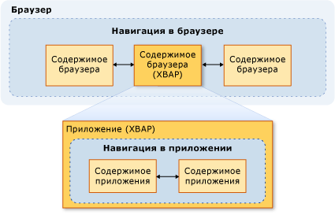
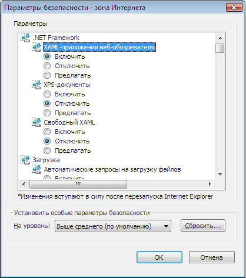

# Безопасность (WPF)Security (WPF)
 При разработке Windows Presentation Foundation (WPF) автономных приложений и приложений, размещенных в веб-браузере, необходимо учитывать модели безопасности.When developing Windows Presentation Foundation (WPF) standalone and browser-hosted applications, you must consider the security model. [!INCLUDE[TLA2#tla_wpf](../../../includes/tla2sharptla-wpf-md.md)] Автономные приложения выполняются с неограниченными разрешениями ( [!INCLUDE[TLA2#tla_cas](../../../includes/tla2sharptla-cas-md.md)] **FullTrust** набор разрешений) независимо от способа развертывания с помощью установщика Windows (.msi) XCopy, или [!INCLUDE[TLA2#tla_clickonce](../../../includes/tla2sharptla-clickonce-md.md)]. standalone applications execute with unrestricted permissions ( [!INCLUDE[TLA2#tla_cas](../../../includes/tla2sharptla-cas-md.md)]**FullTrust** permission set), whether deployed using Windows Installer (.msi), XCopy, or [!INCLUDE[TLA2#tla_clickonce](../../../includes/tla2sharptla-clickonce-md.md)]. Развертывание автономных приложений WPF с частичным доверием с помощью ClickOnce не поддерживается.Deploying partial-trust, standalone WPF applications with ClickOnce is unsupported. Тем не менее, ведущее приложение с полным доверием можно создать с частичным доверием <xref:System.AppDomain> с помощью модели надстроек .NET Framework.However, a full-trust host application can create a partial-trust <xref:System.AppDomain> using the .NET Framework Add-in model. Дополнительные сведения см. в разделе [Общие сведения о надстройках WPF](../../../docs/framework/wpf/app-development/wpf-add-ins-overview.md).For more information, see [WPF Add-Ins Overview](../../../docs/framework/wpf/app-development/wpf-add-ins-overview.md).  
  
 [!INCLUDE[TLA2#tla_wpf](../../../includes/tla2sharptla-wpf-md.md)] размещенные приложения, размещенные в браузере на [!INCLUDE[TLA#tla_iegeneric](../../../includes/tlasharptla-iegeneric-md.md)] или Firefox, и может быть как [!INCLUDE[TLA#tla_xbap#plural](../../../includes/tlasharptla-xbapsharpplural-md.md)] или свободно [!INCLUDE[TLA#tla_xaml](../../../includes/tlasharptla-xaml-md.md)] документы, Дополнительные сведения см. в разделе [Обзор приложений браузера XAML WPF](../../../docs/framework/wpf/app-development/wpf-xaml-browser-applications-overview.md). browser-hosted applications are hosted by [!INCLUDE[TLA#tla_iegeneric](../../../includes/tlasharptla-iegeneric-md.md)] or Firefox, and can be either [!INCLUDE[TLA#tla_xbap#plural](../../../includes/tlasharptla-xbapsharpplural-md.md)] or loose [!INCLUDE[TLA#tla_xaml](../../../includes/tlasharptla-xaml-md.md)] documents For more information, see [WPF XAML Browser Applications Overview](../../../docs/framework/wpf/app-development/wpf-xaml-browser-applications-overview.md).  
  
 [!INCLUDE[TLA2#tla_wpf](../../../includes/tla2sharptla-wpf-md.md)] выполнение приложений веб-браузера в песочнице с частичным уровнем доверия по умолчанию, который ограничен по умолчанию [!INCLUDE[TLA2#tla_cas](../../../includes/tla2sharptla-cas-md.md)] **Internet** набора разрешений зоны. browser-hosted applications execute within a partial trust security sandbox, by default, which is limited to the default [!INCLUDE[TLA2#tla_cas](../../../includes/tla2sharptla-cas-md.md)]**Internet** zone permission set. Это эффективно изолирует [!INCLUDE[TLA2#tla_wpf](../../../includes/tla2sharptla-wpf-md.md)] от клиентского компьютера таким же образом, можно ожидать обычные веб-приложения, чтобы изолировать приложения, размещенные в браузере.This effectively isolates [!INCLUDE[TLA2#tla_wpf](../../../includes/tla2sharptla-wpf-md.md)] browser-hosted applications from the client computer in the same way that you would expect typical Web applications to be isolated. Приложение XBAP может повысить привилегии вплоть до полного доверия в зависимости от зоны безопасности URL-адреса развертывания и конфигурации безопасности клиента.An XBAP can elevate privileges, up to Full Trust, depending on the security zone of the deployment URL and the client's security configuration. Дополнительные сведения см. в разделе [Безопасность частичного доверия в WPF](../../../docs/framework/wpf/wpf-partial-trust-security.md).For more information, see [WPF Partial Trust Security](../../../docs/framework/wpf/wpf-partial-trust-security.md).  
  
 Здесь описывается модель безопасности для Windows Presentation Foundation (WPF) автономных приложений и приложений, размещенных в веб-браузере.This topic discusses the security model for Windows Presentation Foundation (WPF) standalone and browser-hosted applications.  
  
 В этом разделе содержатся следующие подразделы.This topic contains the following sections:  
  
-   [Безопасная навигацияSafe Navigation](#SafeTopLevelNavigation)  
  
-   [Параметры безопасности программного обеспечения для просмотра веб-страницWeb Browsing Software Security Settings](#InternetExplorerSecuritySettings)  
  
-   [Элемент управления WebBrowser и элементы управления функциямиWebBrowser Control and Feature Controls](#webbrowser_control_and_feature_controls)  
  
-   [Отключение сборок APTCA для клиентских приложений с частичным довериемDisabling APTCA Assemblies for Partially Trusted Client Applications](#APTCA)  
  
-   [Режим песочницы для свободных файлов XAMLSandbox Behavior for Loose XAML Files](#LooseContentSandboxing)  
  
-   [Ресурсы для разработки приложений WPF, обеспечивающих безопасностьResources for Developing WPF Applications that Promote Security](#BestPractices)  
  
   
## Безопасная навигацияSafe Navigation  
 Для [!INCLUDE[TLA2#tla_xbap#plural](../../../includes/tla2sharptla-xbapsharpplural-md.md)], [!INCLUDE[TLA2#tla_wpf](../../../includes/tla2sharptla-wpf-md.md)] различает два типа переходов: приложение и браузера.For [!INCLUDE[TLA2#tla_xbap#plural](../../../includes/tla2sharptla-xbapsharpplural-md.md)], [!INCLUDE[TLA2#tla_wpf](../../../includes/tla2sharptla-wpf-md.md)] distinguishes two types of navigation: application and browser.  
  
 *Навигация в приложении* — это навигация между элементами содержимого в пределах приложения, размещенного в браузере.*Application navigation* is navigation between items of content within an application that is hosted by a browser. *Навигация в браузере* — это навигация, изменяющая содержимое и URL-адрес расположения самого браузера.*Browser navigation* is navigation that changes the content and location URL of a browser itself. Связь между навигации приложения (обычно XAML) и переход в браузере (как правило, HTML) показана на следующем рисунке:The relationship between application navigation (typically XAML) and browser navigation (typically HTML) is shown in the following illustration:
  
   
  
 Тип содержимого, которое считается безопасным для [!INCLUDE[TLA2#tla_xbap](../../../includes/tla2sharptla-xbap-md.md)] для перехода к главным образом определяется использование переход в приложении или в браузере.The type of content that is considered safe for an [!INCLUDE[TLA2#tla_xbap](../../../includes/tla2sharptla-xbap-md.md)] to navigate to is primarily determined by whether application navigation or browser navigation is used.  
  
   
### Безопасность навигации в приложенияхApplication Navigation Security  
 Переход в приложении считается безопасным, если его можно с помощью пакета [!INCLUDE[TLA2#tla_uri](../../../includes/tla2sharptla-uri-md.md)], который поддерживает четыре типа содержимого:Application navigation is considered safe if it can be identified with a pack [!INCLUDE[TLA2#tla_uri](../../../includes/tla2sharptla-uri-md.md)], which supports four types of content:  
  
|Тип содержимогоContent Type|ОписаниеDescription|Пример URIURI Example|  
|------------------|-----------------|-----------------|  
|РесурсResource|Файлы, добавленные в проект с типом построения **ресурсов**.Files that are added to a project with a build type of **Resource**.|`pack://application:,,,/MyResourceFile.xaml`|  
|ContentContent|Файлы, добавленные в проект с типом построения **содержимого**.Files that are added to a project with a build type of **Content**.|`pack://application:,,,/MyContentFile.xaml`|  
|Исходный веб-сайтSite of origin|Файлы, добавленные в проект с типом построения **нет**.Files that are added to a project with a build type of **None**.|`pack://siteoforigin:,,,/MySiteOfOriginFile.xaml`|  
|Код приложенияApplication code|Ресурсы XAML, имеющие скомпилированный код программной части.XAML resources that have a compiled code-behind.   - или --or-   XAML-файлов, которые были добавлены в проект с типом построения **страницы**.XAML files that are added to a project with a build type of **Page**.|`pack://application:,,,/MyResourceFile` `.xaml``pack://application:,,,/MyResourceFile` `.xaml`|  
  
> [!NOTE]
>  Дополнительные сведения о файлах данных и пакет [!INCLUDE[TLA2#tla_uri#plural](../../../includes/tla2sharptla-urisharpplural-md.md)], в разделе [ресурса приложения WPF, содержимое и файлы данных](../../../docs/framework/wpf/app-development/wpf-application-resource-content-and-data-files.md).For more information about application data files and pack [!INCLUDE[TLA2#tla_uri#plural](../../../includes/tla2sharptla-urisharpplural-md.md)], see [WPF Application Resource, Content, and Data Files](../../../docs/framework/wpf/app-development/wpf-application-resource-content-and-data-files.md).  
  
 Файлы этих типов содержимого поддерживают навигацию, выполняемую пользователем или программно.Files of these content types can be navigated to by either the user or programmatically:  
  
-   **Навигация, выполняемая пользователем**.**User Navigation**. Пользователь переходит, щелкнув <xref:System.Windows.Documents.Hyperlink> элемента.The user navigates by clicking a <xref:System.Windows.Documents.Hyperlink> element.  
  
-   **Программная навигация**.**Programmatic Navigation**. Приложение может выполнить переход без участия пользователя, например, установив <xref:System.Windows.Navigation.NavigationWindow.Source%2A?displayProperty=nameWithType> свойство.The application navigates without involving the user, for example, by setting the <xref:System.Windows.Navigation.NavigationWindow.Source%2A?displayProperty=nameWithType> property.  
  
   
### Безопасность навигации в браузереBrowser Navigation Security  
 Навигация в браузере считается безопасной только при выполнении следующих условий.Browser navigation is considered safe only under the following conditions:  
  
-   **Навигация, выполняемая пользователем**.**User Navigation**. Пользователь переходит, нажав кнопку <xref:System.Windows.Documents.Hyperlink> элемент, расположенный в главном <xref:System.Windows.Navigation.NavigationWindow>, но не во вложенных <xref:System.Windows.Controls.Frame>.The user navigates by clicking a <xref:System.Windows.Documents.Hyperlink> element that is within the main <xref:System.Windows.Navigation.NavigationWindow>, not in a nested <xref:System.Windows.Controls.Frame>.  
  
-   **Зона**.**Zone**. Содержимое, к которому выполняется переход, находится в Интернете или в локальной интрасети.The content being navigated to is located on the Internet or the local intranet.  
  
-   **Протокол**.**Protocol**. Используемый протокол является либо **http**, **https**, **файл**, или **mailto**.The protocol being used is either **http**, **https**, **file**, or **mailto**.  
  
 Если [!INCLUDE[TLA2#tla_xbap](../../../includes/tla2sharptla-xbap-md.md)] пытается перейти к содержимому таким способом, который не соответствует этим условиям, <xref:System.Security.SecurityException> возникает исключение.If an [!INCLUDE[TLA2#tla_xbap](../../../includes/tla2sharptla-xbap-md.md)] attempts to navigate to content in a manner that does not comply with these conditions, a <xref:System.Security.SecurityException> is thrown.  
  
   
## Параметры безопасности программного обеспечения для просмотра веб-страницWeb Browsing Software Security Settings  
 Параметры безопасности компьютера определяют уровень доступа, который предоставляется программному обеспечению для просмотра веб-страниц.The security settings on your computer determine the access that any Web browsing software is granted. Веб-обозреватель включает все приложение или компонент, который использует [WinINet](http://go.microsoft.com/fwlink/?LinkId=179379) или [UrlMon](http://go.microsoft.com/fwlink/?LinkId=179383) API, в том числе Internet Explorer и PresentationHost.exe.Web browsing software includes any application or component that uses the [WinINet](http://go.microsoft.com/fwlink/?LinkId=179379) or [UrlMon](http://go.microsoft.com/fwlink/?LinkId=179383) APIs, including Internet Explorer and PresentationHost.exe.  
  
 [!INCLUDE[TLA2#tla_iegeneric](../../../includes/tla2sharptla-iegeneric-md.md)] предоставляет механизм, с помощью которого можно настроить функциональные возможности которого может выполняться в [!INCLUDE[TLA2#tla_iegeneric](../../../includes/tla2sharptla-iegeneric-md.md)], включая следующие: provides a mechanism by which you can configure the functionality that is allowed to be executed by or from [!INCLUDE[TLA2#tla_iegeneric](../../../includes/tla2sharptla-iegeneric-md.md)], including the following:  
  
-   .NET framework относящиеся компоненты.NET Framework-reliant components  
  
-   элементы управления ActiveX и подключаемые модули;ActiveX controls and plug-ins  
  
-   ЗагрузкиDownloads  
  
-   СкриптыScripting  
  
-   проверка подлинности пользователя.User Authentication  
  
 Коллекция функциональных возможностей, которые могут быть защищены таким образом настраивается отдельно для каждой зоны для **Internet**, **интрасети**, **надежных узлов**, и  **Ограниченные узлы** зоны.The collection of functionality that can be secured in this way is configured on a per-zone basis for the **Internet**, **Intranet**, **Trusted Sites**, and **Restricted Sites** zones. Ниже приведена процедура для настройки параметров безопасности.The following steps describe how to configure your security settings:  
  
1.  Откройте **панель управления**.Open **Control Panel**.  
  
2.  Нажмите кнопку **сеть и Интернет** и нажмите кнопку **обозревателя**.Click **Network and Internet** and then click **Internet Options**.  
  
     Откроется диалоговое окно «Свойства веб-обозревателя».The Internet Options dialog box appears.  
  
3.  На **безопасности** выберите зону для настройки параметров безопасности.On the **Security** tab, select the zone to configure the security settings for.  
  
4.  Нажмите кнопку **другой** кнопки.Click the **Custom Level** button.  
  
     **Параметры безопасности** откроется диалоговое окно, и можно настроить параметры безопасности для выбранной зоны.The **Security Settings** dialog box appears and you can configure the security settings for the selected zone.  
  
       
  
> [!NOTE]
>  К диалоговому окну "Свойства обозревателя" можно также перейти из Internet Explorer.You can also get to the Internet Options dialog box from Internet Explorer. Нажмите кнопку **средства** и нажмите кнопку **обозревателя**.Click **Tools** and then click **Internet Options**.  
  
 Начиная с [!INCLUDE[TLA#tla_ie7](../../../includes/tlasharptla-ie7-md.md)], включены следующие параметры безопасности специально для .NET Framework:Starting with [!INCLUDE[TLA#tla_ie7](../../../includes/tlasharptla-ie7-md.md)], the following security settings specifically for .NET Framework are included:  
  
-   **Свободный XAML**.**Loose XAML**. Элементы управления ли [!INCLUDE[TLA2#tla_iegeneric](../../../includes/tla2sharptla-iegeneric-md.md)] можно перейти, отменив [!INCLUDE[TLA2#tla_xaml](../../../includes/tla2sharptla-xaml-md.md)] файлов.Controls whether [!INCLUDE[TLA2#tla_iegeneric](../../../includes/tla2sharptla-iegeneric-md.md)] can navigate to and loose [!INCLUDE[TLA2#tla_xaml](../../../includes/tla2sharptla-xaml-md.md)] files. (Варианты: "Включить", "Отключить" и "Запрашивать".)(Enable, Disable, and Prompt options).  
  
-   **XAML-приложения браузера**.**XAML browser applications**. Элементы управления ли [!INCLUDE[TLA2#tla_iegeneric](../../../includes/tla2sharptla-iegeneric-md.md)] можно переходить к и запустить [!INCLUDE[TLA2#tla_xbap#plural](../../../includes/tla2sharptla-xbapsharpplural-md.md)].Controls whether [!INCLUDE[TLA2#tla_iegeneric](../../../includes/tla2sharptla-iegeneric-md.md)] can navigate to and run [!INCLUDE[TLA2#tla_xbap#plural](../../../includes/tla2sharptla-xbapsharpplural-md.md)]. (Варианты: "Включить", "Отключить" и "Запрашивать".)(Enable, Disable, and Prompt options).  
  
 По умолчанию эти параметры все включены для **Internet**, **Местная интрасеть**, и **надежные сайты** зоны и отключен для **Ограниченные узлы**  зоны.By default, these settings are all enabled for the **Internet**, **Local intranet**, and **Trusted sites** zones, and disabled for the **Restricted sites** zone.  
  
   
### Параметры реестра WPF, связанные с безопасностьюSecurity-related WPF Registry Settings  
 Помимо параметров безопасности, доступных в окне "Свойства обозревателя", для избирательного отключения некоторых функций WPF, влияющих на безопасность, предусмотрены перечисленные далее значения реестра.In addition to the security settings available through the Internet Options, the following registry values are available for selectively blocking a number of security-sensitive WPF features. Значения определяются в следующем разделе.The values are defined under the following key:  
  
 `HKEY_LOCAL_MACHINE\SOFTWARE\Microsoft\.NETFramework\Windows Presentation Foundation\Features`  
  
 В таблице ниже перечислены возможные задаваемые значения.The following table lists the values that can be set.  
  
|Имя значенияValue Name|Тип значенияValue Type|Данные значенияValue Data|  
|----------------|----------------|----------------|  
|XBAPDisallowXBAPDisallow|REG_DWORDREG_DWORD|1, чтобы запретить; 0, чтобы разрешить.1 to disallow; 0 to allow.|  
|LooseXamlDisallowLooseXamlDisallow|REG_DWORDREG_DWORD|1, чтобы запретить; 0, чтобы разрешить.1 to disallow; 0 to allow.|  
|WebBrowserDisallowWebBrowserDisallow|REG_DWORDREG_DWORD|1, чтобы запретить; 0, чтобы разрешить.1 to disallow; 0 to allow.|  
|MediaAudioDisallowMediaAudioDisallow|REG_DWORDREG_DWORD|1, чтобы запретить; 0, чтобы разрешить.1 to disallow; 0 to allow.|  
|MediaImageDisallowMediaImageDisallow|REG_DWORDREG_DWORD|1, чтобы запретить; 0, чтобы разрешить.1 to disallow; 0 to allow.|  
|MediaVideoDisallowMediaVideoDisallow|REG_DWORDREG_DWORD|1, чтобы запретить; 0, чтобы разрешить.1 to disallow; 0 to allow.|  
|ScriptInteropDisallowScriptInteropDisallow|REG_DWORDREG_DWORD|1, чтобы запретить; 0, чтобы разрешить.1 to disallow; 0 to allow.|  
  
   
## Элемент управления WebBrowser и элементы управления функциямиWebBrowser Control and Feature Controls  
 WPF <xref:System.Windows.Controls.WebBrowser> элемент управления может использоваться для размещения веб-содержимого.The WPF <xref:System.Windows.Controls.WebBrowser> control can be used to host Web content. WPF <xref:System.Windows.Controls.WebBrowser> перенос управления базового элемента управления WebBrowser ActiveX.The WPF <xref:System.Windows.Controls.WebBrowser> control wraps the underlying WebBrowser ActiveX control. WPF предоставляет некоторую поддержку для обеспечения безопасности приложения при использовании WPF <xref:System.Windows.Controls.WebBrowser> управления для размещения ненадежных веб-содержимого.WPF provides some support for securing your application when you use the WPF <xref:System.Windows.Controls.WebBrowser> control to host untrusted Web content. Тем не менее, некоторые функции безопасности должны применяться непосредственно приложением с помощью <xref:System.Windows.Controls.WebBrowser> элемента управления.However, some security features must be applied directly by the applications using the <xref:System.Windows.Controls.WebBrowser> control. Дополнительные сведения об элементе управления WebBrowser ActiveX см. в разделе [Обзор элемента управления WebBrowser и учебники по](http://go.microsoft.com/fwlink/?LinkId=179388).For more information about the WebBrowser ActiveX control, see [WebBrowser Control Overviews and Tutorials](http://go.microsoft.com/fwlink/?LinkId=179388).  
  
> [!NOTE]
>  Этот раздел также относится к <xref:System.Windows.Controls.Frame> управления, поскольку он использует <xref:System.Windows.Controls.WebBrowser> для перехода к HTML-содержимого.This section also applies to the <xref:System.Windows.Controls.Frame> control since it uses the <xref:System.Windows.Controls.WebBrowser> to navigate to HTML content.  
  
 Если WPF <xref:System.Windows.Controls.WebBrowser> управления используется для размещения ненадежного веб-содержимого, в приложении следует использовать с частичным доверием <xref:System.AppDomain> для изоляции кода приложения от потенциально вредоносного кода HTML-скриптов.If the WPF <xref:System.Windows.Controls.WebBrowser> control is used to host untrusted Web content, your application should use a partial-trust <xref:System.AppDomain> to help insulate your application code from potentially malicious HTML script code. Это особенно важно в том случае, если приложение взаимодействует с размещенным скриптом с помощью <xref:System.Windows.Controls.WebBrowser.InvokeScript%2A> метод и <xref:System.Windows.Controls.WebBrowser.ObjectForScripting%2A> свойства.This is especially true if your application is interacting with the hosted script by using the <xref:System.Windows.Controls.WebBrowser.InvokeScript%2A> method and the <xref:System.Windows.Controls.WebBrowser.ObjectForScripting%2A> property. Дополнительные сведения см. в разделе [Общие сведения о надстройках WPF](../../../docs/framework/wpf/app-development/wpf-add-ins-overview.md).For more information, see [WPF Add-Ins Overview](../../../docs/framework/wpf/app-development/wpf-add-ins-overview.md).  
  
 Если приложение использует WPF <xref:System.Windows.Controls.WebBrowser> является еще одним способом повышения уровня безопасности и снизить угрозу атак управление, чтобы включить элементы управления функциями Internet Explorer.If your application uses the WPF <xref:System.Windows.Controls.WebBrowser> control, another way to increase security and mitigate attacks is to enable Internet Explorer feature controls. Функции элементов управления являются дополнениями к Internet Explorer, позволяют администраторам и разработчикам настраивать функции Internet Explorer и приложений, в которых размещается элемент управления WebBrowser ActiveX, который WPF <xref:System.Windows.Controls.WebBrowser> формирует оболочку для элемента управления.Feature controls are additions to Internet Explorer that allow administrators and developers to configure features of Internet Explorer and applications that host the WebBrowser ActiveX control, which the WPF <xref:System.Windows.Controls.WebBrowser> control wraps. Функции элементов управления можно настроить с помощью [CoInternetSetFeatureEnabled](http://go.microsoft.com/fwlink/?LinkId=179394) функцию или путем изменения значения в реестре.Feature controls can be configured by using the [CoInternetSetFeatureEnabled](http://go.microsoft.com/fwlink/?LinkId=179394) function or by changing values in the registry. Дополнительные сведения о функции элементов управления см. в разделе [Знакомство с элементами управления компонент](http://go.microsoft.com/fwlink/?LinkId=179390) и [элементы управления функциями Internet](http://go.microsoft.com/fwlink/?LinkId=179392).For more information about feature controls, see [Introduction to Feature Controls](http://go.microsoft.com/fwlink/?LinkId=179390) and [Internet Feature Controls](http://go.microsoft.com/fwlink/?LinkId=179392).  
  
 Если вы разрабатываете автономного приложения WPF, в котором используется WPF <xref:System.Windows.Controls.WebBrowser> управления WPF автоматически включает следующие элементы управления функциями для вашего приложения.If you are developing a standalone WPF application that uses the WPF <xref:System.Windows.Controls.WebBrowser> control, WPF automatically enables the following feature controls for your application.  
  
|Элемент управления функциейFeature Control|  
|---------------------|  
|FEATURE_MIME_HANDLINGFEATURE_MIME_HANDLING|  
|FEATURE_MIME_SNIFFINGFEATURE_MIME_SNIFFING|  
|FEATURE_OBJECT_CACHINGFEATURE_OBJECT_CACHING|  
|FEATURE_SAFE_BINDTOOBJECTFEATURE_SAFE_BINDTOOBJECT|  
|FEATURE_WINDOW_RESTRICTIONSFEATURE_WINDOW_RESTRICTIONS|  
|FEATURE_ZONE_ELEVATIONFEATURE_ZONE_ELEVATION|  
|FEATURE_RESTRICT_FILEDOWNLOADFEATURE_RESTRICT_FILEDOWNLOAD|  
|FEATURE_RESTRICT_ACTIVEXINSTALLFEATURE_RESTRICT_ACTIVEXINSTALL|  
|FEATURE_ADDON_MANAGEMENTFEATURE_ADDON_MANAGEMENT|  
|FEATURE_HTTP_USERNAME_PASSWORD_DISABLEFEATURE_HTTP_USERNAME_PASSWORD_DISABLE|  
|FEATURE_SECURITYBANDFEATURE_SECURITYBAND|  
|FEATURE_UNC_SAVEDFILECHECKFEATURE_UNC_SAVEDFILECHECK|  
|FEATURE_VALIDATE_NAVIGATE_URLFEATURE_VALIDATE_NAVIGATE_URL|  
|FEATURE_DISABLE_TELNET_PROTOCOLFEATURE_DISABLE_TELNET_PROTOCOL|  
|FEATURE_WEBOC_POPUPMANAGEMENTFEATURE_WEBOC_POPUPMANAGEMENT|  
|FEATURE_DISABLE_LEGACY_COMPRESSIONFEATURE_DISABLE_LEGACY_COMPRESSION|  
|FEATURE_SSLUXFEATURE_SSLUX|  
  
 Поскольку эти элементы управления функциями включаются безусловно, они могут нарушать работу приложения с полным доверием.Since these feature controls are enabled unconditionally, a full-trust application might be impaired by them. В этом случае, если нет риска безопасности для конкретного приложения и содержимого, размещенного в нем, можно отключить соответствующий элемент управления функцией.In this case, if there is no security risk for the specific application and the content it is hosting, the corresponding feature control can be disabled.  
  
 Элементы управления функциями применяются процессом создания экземпляра объекта WebBrowser ActiveX.Feature controls are applied by the process instantiating the WebBrowser ActiveX object. Таким образом, при создании автономного приложения, которое может переходить к ненадежному содержимому, следует рассмотреть возможность включения дополнительных элементов управления функциями.Therefore, if you are creating a stand-alone application that can navigate to untrusted content, you should seriously consider enabling additional feature controls.  
  
> [!NOTE]
>  Эта рекомендация основана на общих рекомендациях по безопасности узлов MSHTML и SHDOCVW.This recommendation is based on general recommendations for MSHTML and SHDOCVW host security. Дополнительные сведения см. в разделе [узла безопасности MSHTML часто задаваемые вопросы об: первая из II](http://go.microsoft.com/fwlink/?LinkId=179396) и [узла безопасности MSHTML часто задаваемые вопросы об: часть II II](http://go.microsoft.com/fwlink/?LinkId=179415).For more information, see [The MSHTML Host Security FAQ: Part I of II](http://go.microsoft.com/fwlink/?LinkId=179396) and [The MSHTML Host Security FAQ: Part II of II](http://go.microsoft.com/fwlink/?LinkId=179415).  
  
 Для исполняемого файла можно включить следующие элементы управления функциями путем установки значения реестра равным 1.For your executable, consider enabling the following feature controls by setting the registry value to 1.  
  
|Элемент управления функциейFeature Control|  
|---------------------|  
|FEATURE_ACTIVEX_REPURPOSEDETECTIONFEATURE_ACTIVEX_REPURPOSEDETECTION|  
|FEATURE_BLOCK_LMZ_IMGFEATURE_BLOCK_LMZ_IMG|  
|FEATURE_BLOCK_LMZ_OBJECTFEATURE_BLOCK_LMZ_OBJECT|  
|FEATURE_BLOCK_LMZ_SCRIPTFEATURE_BLOCK_LMZ_SCRIPT|  
|FEATURE_RESTRICT_RES_TO_LMZFEATURE_RESTRICT_RES_TO_LMZ|  
|FEATURE_RESTRICT_ABOUT_PROTOCOL_IE7FEATURE_RESTRICT_ABOUT_PROTOCOL_IE7|  
|FEATURE_SHOW_APP_PROTOCOL_WARN_DIALOGFEATURE_SHOW_APP_PROTOCOL_WARN_DIALOG|  
|FEATURE_LOCALMACHINE_LOCKDOWNFEATURE_LOCALMACHINE_LOCKDOWN|  
|FEATURE_FORCE_ADDR_AND_STATUSFEATURE_FORCE_ADDR_AND_STATUS|  
|FEATURE_RESTRICTED_ZONE_WHEN_FILE_NOT_FOUNDFEATURE_RESTRICTED_ZONE_WHEN_FILE_NOT_FOUND|  
  
 Для исполняемого файла можно отключить следующие элементы управления функциями путем установки значения реестра равным 0.For your executable, consider disabling the following feature control by setting the registry value to 0.  
  
|Элемент управления функциейFeature Control|  
|---------------------|  
|FEATURE_ENABLE_SCRIPT_PASTE_URLACTION_IF_PROMPTFEATURE_ENABLE_SCRIPT_PASTE_URLACTION_IF_PROMPT|  
  
 При выполнении с частичным доверием [!INCLUDE[TLA#tla_xbap](../../../includes/tlasharptla-xbap-md.md)] , включающего WPF <xref:System.Windows.Controls.WebBrowser> управления [!INCLUDE[TLA#tla_iegeneric](../../../includes/tlasharptla-iegeneric-md.md)], WPF размещает элемент управления WebBrowser ActiveX в адресном пространстве процесса Internet Explorer.If you run a partial-trust [!INCLUDE[TLA#tla_xbap](../../../includes/tlasharptla-xbap-md.md)] that includes a WPF <xref:System.Windows.Controls.WebBrowser> control in [!INCLUDE[TLA#tla_iegeneric](../../../includes/tlasharptla-iegeneric-md.md)], WPF hosts the WebBrowser ActiveX control in the address space of the Internet Explorer process. Поскольку элемент управления WebBrowser ActiveX размещается в [!INCLUDE[TLA2#tla_iegeneric](../../../includes/tla2sharptla-iegeneric-md.md)] процесса, все элементы управления функциями для Internet Explorer также включены для элемента управления WebBrowser ActiveX.Since the WebBrowser ActiveX control is hosted in the [!INCLUDE[TLA2#tla_iegeneric](../../../includes/tla2sharptla-iegeneric-md.md)] process, all of the feature controls for Internet Explorer are also enabled for the WebBrowser ActiveX control.  
  
 XBAP-приложения, выполняющиеся в Internet Explorer, также получают более высокий уровень безопасности по сравнению с обычными автономными приложениями.XBAPs running in Internet Explorer also get an additional level of security compared to normal standalone applications. — Этот повышенный уровень безопасности, так как Internet Explorer и, следовательно, элемент управления WebBrowser ActiveX, выполняется в защищенном режиме по умолчанию на [!INCLUDE[TLA#tla_winvista](../../../includes/tlasharptla-winvista-md.md)] и [!INCLUDE[win7](../../../includes/win7-md.md)].This additional security is because Internet Explorer, and therefore the WebBrowser ActiveX control, runs in protected mode by default on [!INCLUDE[TLA#tla_winvista](../../../includes/tlasharptla-winvista-md.md)] and [!INCLUDE[win7](../../../includes/win7-md.md)]. Дополнительные сведения о защищенном режиме см. в разделе [понимании и работе в защищенный режим Internet Explorer](http://go.microsoft.com/fwlink/?LinkId=179393).For more information about protected mode, see [Understanding and Working in Protected Mode Internet Explorer](http://go.microsoft.com/fwlink/?LinkId=179393).  
  
> [!NOTE]
>  При попытке запуска XBAP, содержащего WPF <xref:System.Windows.Controls.WebBrowser> управления в Firefox в зоне Интернета <xref:System.Security.SecurityException> будет создано.If you try to run an XBAP that includes a WPF <xref:System.Windows.Controls.WebBrowser> control in Firefox, while in the Internet zone, a <xref:System.Security.SecurityException> will be thrown. Это связано с политикой безопасности WPF.This is due to WPF security policy.  
  
   
## Отключение сборок APTCA для клиентских приложений с частичным довериемDisabling APTCA Assemblies for Partially Trusted Client Applications  
 При установке в управляемых сборках [!INCLUDE[TLA#tla_gac](../../../includes/tlasharptla-gac-md.md)], они становятся полностью доверенных, так как пользователь должен предоставить явное разрешение на их установку.When managed assemblies are installed into the [!INCLUDE[TLA#tla_gac](../../../includes/tlasharptla-gac-md.md)], they become fully trusted because the user must provide explicit permission to install them. Поскольку они пользуются полным доверием, их могут использовать только полностью доверенные управляемые клиентские приложения.Because they are fully trusted, only fully trusted managed client applications can use them. Чтобы разрешить частично доверенным приложениям использовать их, они должны быть отмечены <xref:System.Security.AllowPartiallyTrustedCallersAttribute> (APTCA).To allow partially trusted applications to use them, they must be marked with the <xref:System.Security.AllowPartiallyTrustedCallersAttribute> (APTCA). Этим атрибутом могут быть помечены только сборки, которые были протестированы для подтверждения безопасности при выполнении в режиме частичного доверия.Only assemblies that have been tested to be safe for execution in partial trust should be marked with this attribute.  
  
 Тем не менее, существует возможность уязвимости безопасности сборки APTCA после установки в [!INCLUDE[TLA2#tla_gac](../../../includes/tla2sharptla-gac-md.md)].However, it is possible for an APTCA assembly to exhibit a security flaw after being installed into the [!INCLUDE[TLA2#tla_gac](../../../includes/tla2sharptla-gac-md.md)]. После обнаружения уязвимости безопасности издатели сборок могут создавать обновления безопасности для решения проблем существующих установок и защиты установок, которые могут выполняться после выявления проблемы.Once a security flaw is discovered, assembly publishers can produce a security update to fix the problem on existing installations, and to protect against installations that may occur after the problem is discovered. Одним из вариантов обновления является удаление сборки, хотя это может нарушить работу других полностью доверенных клиентских приложений, использующих сборку.One option for the update is to uninstall the assembly, although that may break other fully trusted client applications that use the assembly.  
  
 [!INCLUDE[TLA2#tla_wpf](../../../includes/tla2sharptla-wpf-md.md)] предоставляет механизм, с помощью которого можно отключить сборку APTCA, для частично доверенных [!INCLUDE[TLA2#tla_xbap#plural](../../../includes/tla2sharptla-xbapsharpplural-md.md)] без удаления сборки APTCA. provides a mechanism by which an APTCA assembly can be disabled for partially trusted [!INCLUDE[TLA2#tla_xbap#plural](../../../includes/tla2sharptla-xbapsharpplural-md.md)] without uninstalling the APTCA assembly.  
  
 Чтобы отключить сборку APTCA, необходимо создать специальный раздел реестра.To disable an APTCA assembly, you have to create a special registry key:  
  
 `HKEY_LOCAL_MACHINE\SOFTWARE\Microsoft\.NETFramework\policy\APTCA\<AssemblyFullName>, FileVersion=<AssemblyFileVersion>`  
  
 Пример приведен ниже.The following shows an example:  
  
 `HKEY_LOCAL_MACHINE\SOFTWARE\Microsoft\.NETFramework\policy\APTCA\aptcagac, Version=1.0.0.0, Culture=neutral, PublicKeyToken=215e3ac809a0fea7, FileVersion=1.0.0.0`  
  
 Этот раздел содержит запись для сборки APTCA.This key establishes an entry for the APTCA assembly. Вам также потребуется создать значение в этом разделе, включающее или отключающее сборку.You also have to create a value in this key that enables or disables the assembly. Ниже приведены сведения об этом значении.The following are the details of the value:  
  
-   Имя параметра: **APTCA_FLAG**.Value Name: **APTCA_FLAG**.  
  
-   Тип значения: **REG_DWORD**.Value Type: **REG_DWORD**.  
  
-   Данные значения: **1** для отключения; **0** для включения.Value Data: **1** to disable; **0** to enable.  
  
 Если сборку необходимо отключить для клиентских приложений с частичным доверием, можно написать обновление, создающее раздел реестра и значение.If an assembly has to be disabled for partially trusted client applications, you can write an update that creates the registry key and value.  
  
> [!NOTE]
>  Базовые сборки .NET Framework не затрагивается отключения их таким образом, так как они необходимы для запуска управляемых приложений.Core .NET Framework assemblies are not affected by disabling them in this way because they are required for managed applications to run. Поддержка отключения сборок APTCA в основном ориентирована на сторонние приложения.Support for disabling APTCA assemblies is primarily targeted to third-party applications.  
  
   
## Режим песочницы для свободных файлов XAMLSandbox Behavior for Loose XAML Files  
 Свободные [!INCLUDE[TLA2#tla_xaml](../../../includes/tla2sharptla-xaml-md.md)] файлы являются только разметку XAML-файлов, которые не зависят от любого кода, обработчик событий или сборка конкретного приложения.Loose [!INCLUDE[TLA2#tla_xaml](../../../includes/tla2sharptla-xaml-md.md)] files are markup-only XAML files that do not depend on any code-behind, event handler, or application-specific assembly. Когда переход к свободным [!INCLUDE[TLA2#tla_xaml](../../../includes/tla2sharptla-xaml-md.md)] файлов осуществляется непосредственно из браузера, они загружаются в изолированной среде безопасности, в зависимости от набора разрешений зоны Интернета по умолчанию.When loose [!INCLUDE[TLA2#tla_xaml](../../../includes/tla2sharptla-xaml-md.md)] files are navigated to directly from the browser, they are loaded in a security sandbox based on the default Internet zone permission set.  
  
 Тем не менее, поведение безопасности изменяется при свободные [!INCLUDE[TLA2#tla_xaml](../../../includes/tla2sharptla-xaml-md.md)] файлов осуществляется либо из <xref:System.Windows.Navigation.NavigationWindow> или <xref:System.Windows.Controls.Frame> в автономном приложении.However, the security behavior is different when loose [!INCLUDE[TLA2#tla_xaml](../../../includes/tla2sharptla-xaml-md.md)] files are navigated to from either a <xref:System.Windows.Navigation.NavigationWindow> or <xref:System.Windows.Controls.Frame> in a standalone application.  
  
 В обоих случаях свободный [!INCLUDE[TLA2#tla_xaml](../../../includes/tla2sharptla-xaml-md.md)] файла, к которому осуществляется переход, наследует разрешения от главного приложения.In both cases, the loose [!INCLUDE[TLA2#tla_xaml](../../../includes/tla2sharptla-xaml-md.md)] file that is navigated to inherits the permissions of its host application. Однако такое поведение может быть нежелательно с точки зрения безопасности, особенно в том случае, если свободный [!INCLUDE[TLA2#tla_xaml](../../../includes/tla2sharptla-xaml-md.md)] файл был создан с помощью объекта, который является доверенным или неизвестное.However, this behavior may be undesirable from a security perspective, particularly if a loose [!INCLUDE[TLA2#tla_xaml](../../../includes/tla2sharptla-xaml-md.md)] file was produced by an entity that is either not trusted or unknown. Этот тип содержимого известен как *внешнее содержимое*и оба <xref:System.Windows.Controls.Frame> и <xref:System.Windows.Navigation.NavigationWindow> можно настроить, чтобы изолировать его при переходе.This type of content is known as *external content*, and both <xref:System.Windows.Controls.Frame> and <xref:System.Windows.Navigation.NavigationWindow> can be configured to isolate it when navigated to. Изоляция достигается путем установки **SandboxExternalContent** для свойства значение true, как показано в следующих примерах для <xref:System.Windows.Controls.Frame> и <xref:System.Windows.Navigation.NavigationWindow>:Isolation is achieved by setting the **SandboxExternalContent** property to true, as shown in the following examples for <xref:System.Windows.Controls.Frame> and <xref:System.Windows.Navigation.NavigationWindow>:  
  
 [!code-xaml[SecurityOverviewSnippets#FrameMARKUP](../../../samples/snippets/csharp/VS_Snippets_Wpf/SecurityOverviewSnippets/CS/Window2.xaml#framemarkup)]  
  
 [!code-xaml[SecurityOverviewSnippets#NavigationWindowMARKUP](../../../samples/snippets/csharp/VS_Snippets_Wpf/SecurityOverviewSnippets/CS/Window1.xaml#navigationwindowmarkup)]  
  
 Этот параметр позволяет загружать внешнее содержимое в процесс, который отделен от процесса, содержащего приложение.With this setting, external content will be loaded into a process that is separate from the process that is hosting the application. Этот процесс ограничен набором разрешений зоны Интернета по умолчанию, что эффективно изолирует его от ведущего приложения и клиентского компьютера.This process is restricted to the default Internet zone permission set, effectively isolating it from the hosting application and the client computer.  
  
> [!NOTE]
>  Несмотря на то что переход к свободным файлам [!INCLUDE[TLA2#tla_xaml](../../../includes/tla2sharptla-xaml-md.md)] файлов из любого <xref:System.Windows.Navigation.NavigationWindow> или <xref:System.Windows.Controls.Frame> в автономном приложении реализован на основе обозревателя WPF, размещающая инфраструктура, включающий процесс PresentationHost, уровень безопасности при немного меньше, чем при загрузке содержимого непосредственно в Internet Explorer на [!INCLUDE[wiprlhext](../../../includes/wiprlhext-md.md)] и [!INCLUDE[win7](../../../includes/win7-md.md)] (которая все равно выполняется через процесс PresentationHost).Even though navigation to loose [!INCLUDE[TLA2#tla_xaml](../../../includes/tla2sharptla-xaml-md.md)] files from either a <xref:System.Windows.Navigation.NavigationWindow> or <xref:System.Windows.Controls.Frame> in a standalone application is implemented based on the WPF browser hosting infrastructure, involving the PresentationHost process, the security level is slightly less than when the content is loaded directly in Internet Explorer on [!INCLUDE[wiprlhext](../../../includes/wiprlhext-md.md)] and [!INCLUDE[win7](../../../includes/win7-md.md)] (which would still be through PresentationHost). Это обусловлено тем, что автономное приложение WPF, использующее веб-браузер, не предоставляет дополнительную функцию безопасности "Защищенный режим" Internet Explorer.This is because a standalone WPF application using a Web browser does not provide the additional Protected Mode security feature of Internet Explorer.  
  
   
## Ресурсы для разработки приложений WPF, обеспечивающих безопасностьResources for Developing WPF Applications that Promote Security  
 Ниже приведены некоторые дополнительные ресурсы, помогающие при разработке [!INCLUDE[TLA2#tla_wpf](../../../includes/tla2sharptla-wpf-md.md)] приложений, обеспечивающих безопасность:The following are some additional resources to help develop [!INCLUDE[TLA2#tla_wpf](../../../includes/tla2sharptla-wpf-md.md)] applications that promote security:  
  
|ОбластьArea|РесурсResource|  
|----------|--------------|  
|Управляемый кодManaged code|[Шаблоны и рекомендации по обеспечению безопасности приложенийPatterns and Practices Security Guidance for Applications](http://go.microsoft.com/fwlink/?LinkId=117426)|  
|[!INCLUDE[TLA2#tla_cas](../../../includes/tla2sharptla-cas-md.md)]|[Управление доступом для кодаCode Access Security](../../../docs/framework/misc/code-access-security.md)|  
|[!INCLUDE[TLA2#tla_clickonce](../../../includes/tla2sharptla-clickonce-md.md)]|[Развертывание и безопасность технологии ClickOnceClickOnce Security and Deployment](/visualstudio/deployment/clickonce-security-and-deployment)|  
|[!INCLUDE[TLA2#tla_wpf](../../../includes/tla2sharptla-wpf-md.md)]|[Безопасность частичного доверия в WPFWPF Partial Trust Security](../../../docs/framework/wpf/wpf-partial-trust-security.md)|  
  
## См. такжеSee Also  
 [Безопасность частичного доверия в WPFWPF Partial Trust Security](../../../docs/framework/wpf/wpf-partial-trust-security.md)  
 [Стратегия безопасности WPF — безопасность платформыWPF Security Strategy - Platform Security](../../../docs/framework/wpf/wpf-security-strategy-platform-security.md)  
 [Стратегия безопасности WPF — проектирование безопасностиWPF Security Strategy - Security Engineering](../../../docs/framework/wpf/wpf-security-strategy-security-engineering.md)  
 [Шаблоны и рекомендации по обеспечению безопасности приложенийPatterns and Practices Security Guidance for Applications](http://go.microsoft.com/fwlink/?LinkId=117426)  
 [Управление доступом для кодаCode Access Security](../../../docs/framework/misc/code-access-security.md)  
 [Развертывание и безопасность технологии ClickOnceClickOnce Security and Deployment](/visualstudio/deployment/clickonce-security-and-deployment)  
 [Общие сведения о языке XAML (WPF)XAML Overview (WPF)](../../../docs/framework/wpf/advanced/xaml-overview-wpf.md)
