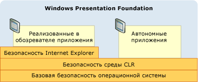
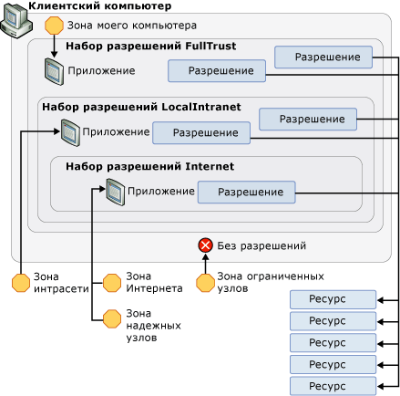

# Стратегия безопасности WPF — безопасность платформыWPF Security Strategy - Platform Security
Хотя Windows Presentation Foundation (WPF) предоставляет широкий набор служб безопасности, предусмотрена также возможность средства безопасности базовой платформы, включая операционную систему, [!INCLUDE[TLA2#tla_clr](../../../includes/tla2sharptla-clr-md.md)], и [!INCLUDE[TLA2#tla_ie](../../../includes/tla2sharptla-ie-md.md)].While Windows Presentation Foundation (WPF) provides a variety of security services, it also leverages the security features of the underlying platform, which includes the operating system, the [!INCLUDE[TLA2#tla_clr](../../../includes/tla2sharptla-clr-md.md)], and [!INCLUDE[TLA2#tla_ie](../../../includes/tla2sharptla-ie-md.md)]. Эти уровни объединяются для обеспечения в [!INCLUDE[TLA2#tla_wpf](../../../includes/tla2sharptla-wpf-md.md)] надежной модели безопасности с глубокой защитой, которая пытается исключить любые точки сбоя, как показано на следующем рисунке.These layers combine to provide [!INCLUDE[TLA2#tla_wpf](../../../includes/tla2sharptla-wpf-md.md)] a strong, defense-in-depth security model that attempts to avoid any single point of failure, as shown in the following figure:  
  
   
  
 В остальной части этого раздела рассматриваются компоненты на каждом из этих уровней, относящихся к [!INCLUDE[TLA2#tla_wpf](../../../includes/tla2sharptla-wpf-md.md)].The remainder of this topic discusses the features in each of these layers that pertain to [!INCLUDE[TLA2#tla_wpf](../../../includes/tla2sharptla-wpf-md.md)] specifically.  
  

  
   
## Безопасность операционной системыOperating System Security  
 Минимальный уровень операционной системы, требуемой для [!INCLUDE[TLA2#tla_wpf](../../../includes/tla2sharptla-wpf-md.md)] — [!INCLUDE[TLA2#tla_winxpsp2](../../../includes/tla2sharptla-winxpsp2-md.md)].The minimum level of operating system that is required by [!INCLUDE[TLA2#tla_wpf](../../../includes/tla2sharptla-wpf-md.md)] is [!INCLUDE[TLA2#tla_winxpsp2](../../../includes/tla2sharptla-winxpsp2-md.md)]. Ядро [!INCLUDE[TLA2#tla_winxpsp2](../../../includes/tla2sharptla-winxpsp2-md.md)] предоставляет несколько функций безопасности, которые формируют основу безопасности для всех приложений Windows, включая созданные с помощью [!INCLUDE[TLA2#tla_wpf](../../../includes/tla2sharptla-wpf-md.md)].The core of [!INCLUDE[TLA2#tla_winxpsp2](../../../includes/tla2sharptla-winxpsp2-md.md)] provides several security features that form the security foundation for all Windows applications, including those built with [!INCLUDE[TLA2#tla_wpf](../../../includes/tla2sharptla-wpf-md.md)]. [!INCLUDE[TLA#tla_longhorn](../../../includes/tlasharptla-longhorn-md.md)] включает в себя функции безопасности [!INCLUDE[TLA2#tla_wpf](../../../includes/tla2sharptla-wpf-md.md)] и расширяет их возможности.incorporates the security features of [!INCLUDE[TLA2#tla_wpf](../../../includes/tla2sharptla-wpf-md.md)] and extends them further. В этом разделе рассматривается широкий спектр этих функций безопасности, которые важны для [!INCLUDE[TLA2#tla_wpf](../../../includes/tla2sharptla-wpf-md.md)], а также интеграция [!INCLUDE[TLA2#tla_wpf](../../../includes/tla2sharptla-wpf-md.md)] с ними для обеспечения дальнейшей глубокой защиты.This topic discusses the breadth of these security features that are important to [!INCLUDE[TLA2#tla_wpf](../../../includes/tla2sharptla-wpf-md.md)], as well as how [!INCLUDE[TLA2#tla_wpf](../../../includes/tla2sharptla-wpf-md.md)] integrates with them to provide further defense-in-depth.  
  
   
### Microsoft Windows XP с пакетом обновления 2 (SP2)Microsoft Windows XP Service Pack 2 (SP2)  
 В дополнение к общему обзору и усилению Windows, существуют три ключевых компонента из [!INCLUDE[TLA2#tla_winxpsp2](../../../includes/tla2sharptla-winxpsp2-md.md)] , которые будут рассмотрены в этом разделе:In addition to a general review and strengthening of Windows, there are three key features from [!INCLUDE[TLA2#tla_winxpsp2](../../../includes/tla2sharptla-winxpsp2-md.md)] that we will discuss in this topic:  
  
-   Компиляция /GS/GS compilation  
  
-   [!INCLUDE[TLA#tla_win_update](../../../includes/tlasharptla-win-update-md.md)]..  
  
#### Компиляция /GS/GS Compilation  
 [!INCLUDE[TLA2#tla_winxpsp2](../../../includes/tla2sharptla-winxpsp2-md.md)] обеспечивает защиту путем перекомпиляции многих системных библиотек ядра, включая все зависимости [!INCLUDE[TLA2#tla_wpf](../../../includes/tla2sharptla-wpf-md.md)], такие как [!INCLUDE[TLA2#tla_clr](../../../includes/tla2sharptla-clr-md.md)], чтобы снизить вероятность переполнения буфера.provides protection by recompiling many core system libraries, including all of the [!INCLUDE[TLA2#tla_wpf](../../../includes/tla2sharptla-wpf-md.md)] dependencies such as the [!INCLUDE[TLA2#tla_clr](../../../includes/tla2sharptla-clr-md.md)], to help mitigate buffer overruns. Это достигается путем использования параметра /GS с компилятором командной строки C/C++.This is achieved by using the /GS parameter with the C/C++ command-line compiler. Несмотря на то, что следует явно избегать переполнения буфера, компиляция /GS представляет пример глубокой защиты против потенциальных угроз, созданных случайно или злонамеренно.Although buffer overruns should be explicitly avoided, /GS compilation provides an example of a defense-in-depth against potential vulnerabilities that are inadvertently or maliciously created by them.  
  
 Ранее переполнения буфера были причиной многих эксплойтов безопасности с высокой степенью воздействия.Historically, buffer overruns have been the cause of many high-impact security exploits. Переполнение буфера возникает, когда злоумышленник использует уязвимость кода, которая позволяет внедрить вредоносный код, выполняющий записи за границами буфера.A buffer overrun occurs when an attacker takes advantage of a code vulnerability that allows the injection of malicious code that writes past the boundaries of a buffer. Затем это позволяет злоумышленнику перехватить процесс, в котором выполняется код, путем перезаписи адреса возврата функции, чтобы вызвать выполнение кода злоумышленника.This then allows an attacker to hijack the process in which the code is executing by overwriting the return address of a function to cause the execution of the attacker's code. Результатом является вредоносный код, выполняющий произвольный код с привилегиями перехваченного процесса.The result is malicious code that executes arbitrary code with the same privileges as the hijacked process.  
  
 На высоком уровне флаг компилятора /GS защищает от некоторых потенциальных переполнений буфера путем добавления специального cookie безопасности для защиты адреса возврата функции, которая содержит буферы локальных строк.At a high level, the /GS compiler flag protects against some potential buffer overruns by injecting a special security cookie to protect the return address of a function that has local string buffers. После возврата функции cookie безопасности сравнивается со своим предыдущим значением.After a function returns, the security cookie is compared with its previous value. Если значение изменилось, то возможно, произошло переполнение буфера, и процесс будет остановлен с состоянием ошибки.If the value has changed, a buffer overrun may have occurred and the process is stopped with an error condition. Остановка процесса предотвращает выполнение потенциально вредоносного кода.Stopping the process prevents the execution of potentially malicious code. См. в разделе [/GS (проверка безопасности буфера)](/cpp/build/reference/gs-buffer-security-check) для получения дополнительных сведений.See [/GS (Buffer Security Check)](/cpp/build/reference/gs-buffer-security-check) for more details.  
  
 [!INCLUDE[TLA2#tla_wpf](../../../includes/tla2sharptla-wpf-md.md)] компилируется с флагом /GS, чтобы добавить еще один уровень защиты для приложений [!INCLUDE[TLA2#tla_wpf](../../../includes/tla2sharptla-wpf-md.md)].is compiled with the /GS flag to add yet another layer of defense to [!INCLUDE[TLA2#tla_wpf](../../../includes/tla2sharptla-wpf-md.md)] applications.  
  
#### Усовершенствования Microsoft Windows UpdateMicrosoft Windows Update Enhancements  
 В [!INCLUDE[TLA2#tla_winxpsp2](../../../includes/tla2sharptla-winxpsp2-md.md)] также были внесены усовершенствования в [!INCLUDE[TLA#tla_win_update](../../../includes/tlasharptla-win-update-md.md)] для упрощения процесса загрузки и установки обновлений.[!INCLUDE[TLA#tla_win_update](../../../includes/tlasharptla-win-update-md.md)] was also improved in [!INCLUDE[TLA2#tla_winxpsp2](../../../includes/tla2sharptla-winxpsp2-md.md)] to simplify the process for downloading and installing updates. Эти изменения значительно улучшили безопасность для клиентов [!INCLUDE[TLA2#tla_wpf](../../../includes/tla2sharptla-wpf-md.md)], помогая обеспечить актуальность версий их систем, особенно в отношении обновлений для системы безопасности.These changes significantly enhance security for [!INCLUDE[TLA2#tla_wpf](../../../includes/tla2sharptla-wpf-md.md)] customers by helping to ensure that their systems are up-to-date, particularly with respect to security updates.  
  
   
### Windows VistaWindows Vista  
 Пользователи [!INCLUDE[TLA2#tla_wpf](../../../includes/tla2sharptla-wpf-md.md)] в [!INCLUDE[TLA#tla_longhorn](../../../includes/tlasharptla-longhorn-md.md)] получают преимущества дополнительных улучшений безопасности операционной системы, включая доступ пользователей с наименьшими привилегиями, проверки целостности кода и ограничение привилегий.[!INCLUDE[TLA2#tla_wpf](../../../includes/tla2sharptla-wpf-md.md)] users on [!INCLUDE[TLA#tla_longhorn](../../../includes/tlasharptla-longhorn-md.md)] will benefit from the operating system's additional security enhancements, including "Least-Privilege User Access", code integrity checks, and privilege isolation.  
  
#### Контроль учетных записей (UAC)User Account Control (UAC)  
 В настоящее время пользователи Windows предпочитают работать с правами администратора, поскольку многие приложения требуют их для установки или выполнения или оба.Today, Windows users tend to run with administrator privileges because many applications require them for either installation or execution, or both. Одним из примеров является возможность записи в реестр параметров приложения по умолчанию.Being able to write default application settings to the Registry is one example.  
  
 Работа с правами администратора в действительности означает, что приложения выполняются из процессов, которым предоставлены права администратора.Running with administrator privileges really means that applications execute from processes that are granted administrator privileges. Влияние этого на безопасность заключается в том, что любой вредоносный код, перехвативший процесс с правами администратора, автоматически наследует эти права, включая доступ к критически важным системным ресурсам.The security impact of this is that any malicious code that hijacks a process running with administrator privileges will automatically inherit those privileges, including access to critical system resources.  
  
 Один из способов защиты от этой угрозы безопасности состоит в запуске приложений с наименьшим количеством требуемых им привилегий.One way to protect against this security threat is to run applications with the least amount of privileges that are required. Этот способ называется принципом наименьших привилегий и является базовой функцией операционной системы [!INCLUDE[TLA#tla_longhorn](../../../includes/tlasharptla-longhorn-md.md)].This is known as the principle of least privilege, and is a core feature of the [!INCLUDE[TLA#tla_longhorn](../../../includes/tlasharptla-longhorn-md.md)] operating system. Эта функция вызывается контролем учетных записей (UAC) и используется [!INCLUDE[TLA#tla_longhorn](../../../includes/tlasharptla-longhorn-md.md)] UAC в двух основных случаях.This feature is called User Account Control (UAC), and is used by [!INCLUDE[TLA#tla_longhorn](../../../includes/tlasharptla-longhorn-md.md)] UAC in two key ways:  
  
-   Для запуска большинства приложений с правами UAC по умолчанию, даже если пользователь является администратором; только приложения, требующие привилегий администратора, будут выполняться с привилегиями администратора.To run most applications with UAC privileges by default, even if the user is an administrator; only applications that need administrator privileges will run with administrator privileges. Для запуска с привилегиями администратора приложения должны быть явно отмечены либо в своем манифесте приложения, либо как запись в политике безопасности.To run with administrative privileges, applications must be explicitly marked in either their application manifest or as an entry in security policy.  
  
-   Для обеспечения решений совместимости, таких как виртуализация.To provide compatibility solutions like virtualization. Например, многие приложения пытаются выполнять запись в места с ограниченным доступом, такие как C:\Program Files.For example, many applications try to write to restricted locations like C:\Program Files. Для приложений, выполняющихся в рамках UAC, существует альтернативное расположение, для записи в которое не требуются права администратора.For applications executing under UAC, an alternative per-user location exists that does not require administrator privileges to write to. Для приложений, работающих в рамках UAC, UAC виртуализирует расположение C:\Program Files, и таким образом приложения считают, что выполняют запись в это расположение, но на самом деле запись выполняется в другое, пользовательское расположение.For applications running under UAC, UAC virtualizes C:\Program Files so that applications who think they are writing to it are actually writing to the alternative, per-user location. Такой вид работы совместимости позволяет операционной системе запускать многие приложения, которые ранее не могли работать в UAC.This kind of compatibility work enables the operating system to run many applications that couldn't previously run in UAC.  
  
#### Проверки целостности кодаCode Integrity Checks  
 [!INCLUDE[TLA#tla_longhorn](../../../includes/tlasharptla-longhorn-md.md)] включает более глубокие проверки целостности кода для предотвращения внедрения вредоносного кода в системные файлы или в ядро во время загрузки или выполнения.incorporates deeper code integrity checks to help prevent malicious code from being injected into system files or into the kernel at load/run time. Это выходит за рамки защиты системных файлов.This goes beyond system file protection.  
  
   
### Процесс с ограниченными правами для браузерных приложенийLimited Rights Process for Browser-Hosted Applications  
 Браузерные приложения [!INCLUDE[TLA2#tla_wpf](../../../includes/tla2sharptla-wpf-md.md)] выполняются в песочнице зоны Интернета.Browser-hosted [!INCLUDE[TLA2#tla_wpf](../../../includes/tla2sharptla-wpf-md.md)] applications execute within the Internet zone sandbox. Интеграция [!INCLUDE[TLA2#tla_wpf](../../../includes/tla2sharptla-wpf-md.md)] с [!INCLUDE[TLA#tla_ie](../../../includes/tlasharptla-ie-md.md)] расширяет эту защиту, добавляя дополнительную поддержку.[!INCLUDE[TLA2#tla_wpf](../../../includes/tla2sharptla-wpf-md.md)] integration with [!INCLUDE[TLA#tla_ie](../../../includes/tlasharptla-ie-md.md)] extends this protection with additional support.  
  
#### Internet Explorer 6 с пакетом обновления 2 и Internet Explorer 7 для XPInternet Explorer 6 Service Pack 2 and Internet Explorer 7 for XP  
 [!INCLUDE[TLA2#tla_wpf](../../../includes/tla2sharptla-wpf-md.md)] усиливает безопасность операционной системы, ограничивая привилегии процесса для [!INCLUDE[TLA#tla_winfxwebapp#plural](../../../includes/tlasharptla-winfxwebappsharpplural-md.md)], чтобы обеспечить дополнительную защиту.leverages operating system security by limiting process privileges for [!INCLUDE[TLA#tla_winfxwebapp#plural](../../../includes/tlasharptla-winfxwebappsharpplural-md.md)] for further protection. Перед запуском браузерного приложения [!INCLUDE[TLA2#tla_wpf](../../../includes/tla2sharptla-wpf-md.md)] операционная система создает хост-процесс, который удаляет ненужные привилегии из токена процесса.Before a browser-hosted [!INCLUDE[TLA2#tla_wpf](../../../includes/tla2sharptla-wpf-md.md)] application is launched, the operating system creates a host process that removes unnecessary privileges from the process token. В качестве примеров удаляемых привилегий можно назвать возможность завершения работы компьютера пользователя, загрузки драйверов и доступа на чтение ко всем файлам на компьютере.Some examples of privileges that are removed include the ability to shut down the user's machine, load drivers, and read access to all files on the machine.  
  
#### Internet Explorer 7 для VistaInternet Explorer 7 for Vista  
 В [!INCLUDE[TLA#tla_ie7](../../../includes/tlasharptla-ie7-md.md)], [!INCLUDE[TLA2#tla_wpf](../../../includes/tla2sharptla-wpf-md.md)] приложения выполняются в защищенном режиме.In [!INCLUDE[TLA#tla_ie7](../../../includes/tlasharptla-ie7-md.md)], [!INCLUDE[TLA2#tla_wpf](../../../includes/tla2sharptla-wpf-md.md)] applications run in protected mode. В частности, [!INCLUDE[TLA#tla_xbap#plural](../../../includes/tlasharptla-xbapsharpplural-md.md)] выполняются с целостностью среднего уровня.Specifically, [!INCLUDE[TLA#tla_xbap#plural](../../../includes/tlasharptla-xbapsharpplural-md.md)] run with medium-level integrity.  
  
#### Уровень глубокой защитыDefense-In-Depth Layer  
 Поскольку [!INCLUDE[TLA#tla_winfxwebapp#plural](../../../includes/tlasharptla-winfxwebappsharpplural-md.md)] обычно изолируются набором разрешений зоны Интернета, удаление этих привилегий не повреждает [!INCLUDE[TLA#tla_winfxwebapp#plural](../../../includes/tlasharptla-winfxwebappsharpplural-md.md)] с точки зрения совместимости.Since [!INCLUDE[TLA#tla_winfxwebapp#plural](../../../includes/tlasharptla-winfxwebappsharpplural-md.md)] are generally sandboxed by the Internet zone permission set, removing these privileges does not harm [!INCLUDE[TLA#tla_winfxwebapp#plural](../../../includes/tlasharptla-winfxwebappsharpplural-md.md)] from a compatibility perspective. Вместо этого создается дополнительный уровень глубокой защиты; если изолированное приложение сможет использовать другие уровни и перехватить процесс, этот процесс будет иметь только ограниченные привилегии.Instead, an additional defense-in-depth layer is created; if a sandboxed application is able to exploit other layers and hijack the process, the process will still only have limited privileges.  
  
 См. в разделе [под учетной записью пользователя с минимальными правами](https://docs.microsoft.com/previous-versions/tn-archive/cc700846%28v=technet.10%29).See [Using a Least-Privileged User Account](https://docs.microsoft.com/previous-versions/tn-archive/cc700846%28v=technet.10%29).  
  
   
## Безопасность среды CLRCommon Language Runtime Security  
 [!INCLUDE[TLA#tla_clr](../../../includes/tlasharptla-clr-md.md)] предлагает ряд ключевых преимуществ безопасности, включающих проверку, верификацию, [!INCLUDE[TLA#tla_cas](../../../includes/tlasharptla-cas-md.md)] и методологию, критическую с точки зрения безопасности.The [!INCLUDE[TLA#tla_clr](../../../includes/tlasharptla-clr-md.md)] offers a number of key security benefits that include validation and verification, [!INCLUDE[TLA#tla_cas](../../../includes/tlasharptla-cas-md.md)], and the Security Critical Methodology.  
  
   
### Проверка и верификацияValidation and Verification  
 Для обеспечения изоляции и целостности сборки [!INCLUDE[TLA2#tla_clr](../../../includes/tla2sharptla-clr-md.md)] использует процесс проверки.To provide assembly isolation and integrity, the [!INCLUDE[TLA2#tla_clr](../../../includes/tla2sharptla-clr-md.md)] uses a process of validation. Проверка [!INCLUDE[TLA2#tla_clr](../../../includes/tla2sharptla-clr-md.md)] гарантирует, что сборки изолируются путем проверки их формата переносимых исполняемых (PE) файлов для адресов, которые указывают места за пределами сборки.[!INCLUDE[TLA2#tla_clr](../../../includes/tla2sharptla-clr-md.md)] validation ensures that assemblies are isolated by validating their Portable Executable (PE) file format for addresses that point outside the assembly. Проверка [!INCLUDE[TLA2#tla_clr](../../../includes/tla2sharptla-clr-md.md)] также проверяет целостность метаданных, встроенных в сборку.[!INCLUDE[TLA2#tla_clr](../../../includes/tla2sharptla-clr-md.md)] validation also validates the integrity of the metadata that is embedded within an assembly.  
  
 Чтобы обеспечить безопасность типов, помочь предотвратить общие проблемы безопасности (например, переполнение буфера) и включите "песочницы" путем изоляции подпроцесса, [!INCLUDE[TLA2#tla_clr](../../../includes/tla2sharptla-clr-md.md)] безопасности использует концепцию верификации.To ensure type safety, help prevent common security issues (e.g. buffer overruns), and enable sandboxing through sub-process isolation, [!INCLUDE[TLA2#tla_clr](../../../includes/tla2sharptla-clr-md.md)] security uses the concept of verification.  
  
 Управляемые приложения компилируются в язык MSIL.Managed applications are compiled into Microsoft Intermediate Language (MSIL). Когда методы в управляемом приложении выполняются, его MSIL-файлы компилируются в машинный код с помощью JIT-компиляции.When methods in a managed application are executed, its MSIL is compiled into native code through Just-In-Time (JIT) compilation. JIT-компиляция включает процесс верификации, который применяет много правил безопасности и надежности, обеспечивающих, что код:JIT compilation includes a verification process that applies many safety and robustness rules that ensure code does not:  
  
-   не нарушает контракты типов;Violate type contracts  
  
-   не вызывает переполнение буфера;Introduce buffer overruns  
  
-   не имеет бесконтрольный доступ к памяти.Wildly access memory.  
  
 Выполнение управляемого кода, который не соответствует правилам верификации, не разрешается, пока он не будет считаться надежным кодом.Managed code that does not conform to verification rules is not allowed to execute, unless it is considered trusted code.  
  
 Преимущества верифицируемого кода являются главной причиной, почему [!INCLUDE[TLA2#tla_wpf](../../../includes/tla2sharptla-wpf-md.md)] основан на .NET Framework.The advantage of verifiable code is a key reason why [!INCLUDE[TLA2#tla_wpf](../../../includes/tla2sharptla-wpf-md.md)] builds on the .NET Framework. При условии, что используется верифицируемый код, вероятность использования возможных уязвимостей значительно ниже.To the extent that verifiable code is used, the possibility of exploiting possible vulnerabilities is greatly lowered.  
  
   
### Управление доступом для кодаCode Access Security  
 Клиентский компьютер предоставляет широкий спектр ресурсов, к которым может получить доступ управляемое приложение, включая файловую систему, реестр, службы печати, пользовательский интерфейс, отражение и переменные среды.A client machine exposes a wide variety of resources that a managed application can have access to, including the file system, the Registry, printing services, the user interface, reflection, and environment variables. Прежде чем управляемое приложение может получить доступ к любому из ресурсов на клиентском компьютере, она должна иметь разрешение .NET Framework для этого.Before a managed application can access any of the resources on a client machine, it must have .NET Framework permission to do so. Разрешение в [!INCLUDE[TLA2#tla_cas](../../../includes/tla2sharptla-cas-md.md)] является подклассом <xref:System.Security.CodeAccessPermission>; [!INCLUDE[TLA2#tla_cas](../../../includes/tla2sharptla-cas-md.md)] реализует по одному подклассу для каждого ресурса, к которому управляемые приложения могут получать доступ.A permission in [!INCLUDE[TLA2#tla_cas](../../../includes/tla2sharptla-cas-md.md)] is a subclass of the <xref:System.Security.CodeAccessPermission>; [!INCLUDE[TLA2#tla_cas](../../../includes/tla2sharptla-cas-md.md)] implements one subclass for each resource that managed applications can access.  
  
 Ряд разрешений, которые предоставляются [!INCLUDE[TLA2#tla_cas](../../../includes/tla2sharptla-cas-md.md)] управляемому приложению при запуске его выполнения, называется набором разрешений и определяется свидетельством, предоставляемым приложением.The set of permissions that a managed application is granted by [!INCLUDE[TLA2#tla_cas](../../../includes/tla2sharptla-cas-md.md)] when it starts executing is known as a permission set and is determined by evidence provided by the application. Для приложений [!INCLUDE[TLA2#tla_wpf](../../../includes/tla2sharptla-wpf-md.md)] предоставляемое свидетельство — это расположение или зона, откуда запускаются приложения.For [!INCLUDE[TLA2#tla_wpf](../../../includes/tla2sharptla-wpf-md.md)] applications, the evidence that is provided is the location, or zone, from which the applications are launched. [!INCLUDE[TLA2#tla_cas](../../../includes/tla2sharptla-cas-md.md)] определяет следующие зоны.identifies the following zones:  
  
-   **Мой компьютер**.**My Computer**. Приложения запускаются с клиентского компьютера (полное доверие).Applications launched from the client machine (Fully Trusted).  
  
-   **Локальная интрасеть**.**Local Intranet**. Приложения запускаются из интрасетиApplications launched from the intranet. (частичное доверие).(Somewhat Trusted).  
  
-   **Интернет**.**Internet**. Приложения запускаются из ИнтернетаApplications launched from the Internet. (минимальное доверие).(Least Trusted).  
  
-   **Доверенные веб-сайты**.**Trusted Sites**. Приложения, идентифицированные пользователем как доверенныеApplications identified by a user as being trusted. (минимальное доверие).(Least Trusted).  
  
-   **Веб-сайты без доверия**.**Untrusted Sites**. Приложения, идентифицированные пользователем как ненадежныеApplications identified by a user as being untrusted. (без доверия).(Untrusted).  
  
 Для каждой из этих зон [!INCLUDE[TLA2#tla_cas](../../../includes/tla2sharptla-cas-md.md)] предоставляет предопределенный набор разрешений, содержащий разрешения, которые соответствует уровню доверия, связанному с каждой зоной.For each of these zones, [!INCLUDE[TLA2#tla_cas](../../../includes/tla2sharptla-cas-md.md)] provides a predefined permission set that includes the permissions which matches the level of trust associated with each. Сюда входит следующее.These include:  
  
-   **FullTrust**.**FullTrust**. Для приложений, запускаемых из **Мой компьютер** зоны.For applications launched from the **My Computer** zone. Предоставляются все возможные разрешения.All possible permissions are granted.  
  
-   **LocalIntranet**.**LocalIntranet**. Для приложений, запускаемых из **Местная интрасеть** зоны.For applications launched from the **Local Intranet** zone. Подмножество разрешений предоставляется для обеспечения среднего уровня доступа к ресурсам на клиентском компьютере, включая изолированное хранилище, неограниченный доступ к пользовательскому интерфейсу, неограниченный доступ к диалогам для работы с файлами, ограниченное отражение, ограниченный доступ к переменным среды.A subset of permissions are granted to provide moderate access to a client machine’s resources, including isolated storage, unrestricted UI access, unrestricted file dialogs, limited reflection, limited access to environment variables. Разрешения для критически важных ресурсов, таких как реестр, не предоставляются.Permissions for critical resources like the Registry are not provided.  
  
-   **Интернет**.**Internet**. Для приложений, запускаемых из **Internet** или **Надежные узлы** зоны.For applications launched from the **Internet** or **Trusted Sites** zone. Подмножество разрешений предоставляется для обеспечения ограниченного доступа к ресурсам на клиентском компьютере, включая изолированное хранилище, только открытие файлов и ограниченный пользовательский интерфейс.A subset of permissions are granted to provided limited access to a client machine’s resources, including isolated storage, file open only, and limited UI. В сущности, эти наборы разрешений изолируют приложения от клиентского компьютера.Essentially, this permission sets isolates applications from the client machine.  
  
 Приложения, которые идентифицированы как происходящие из **ненадежных узлов** зоны не предоставляется разрешений с [!INCLUDE[TLA2#tla_cas](../../../includes/tla2sharptla-cas-md.md)] вообще.Applications identified as being from the **Untrusted Sites** zone are granted no permissions by [!INCLUDE[TLA2#tla_cas](../../../includes/tla2sharptla-cas-md.md)] at all. Следовательно, для них не существует предопределенный набор разрешений.Consequently, a predefined permission set does not exist for them.  
  
 На следующем рисунке показано отношение между зонами, наборами разрешений, разрешениями и ресурсами.The following figure illustrates the relationship between zones, permission sets, permissions, and resources.  
  
   
  
 Ограничения песочницы безопасности зоны Интернета в равной степени применяются к любому коду, который [!INCLUDE[TLA2#tla_winfxwebapp](../../../includes/tla2sharptla-winfxwebapp-md.md)] импортирует из системной библиотеки, включая [!INCLUDE[TLA2#tla_wpf](../../../includes/tla2sharptla-wpf-md.md)].The restrictions of the Internet zone security sandbox apply equally to any code that a [!INCLUDE[TLA2#tla_winfxwebapp](../../../includes/tla2sharptla-winfxwebapp-md.md)] imports from a system library, including [!INCLUDE[TLA2#tla_wpf](../../../includes/tla2sharptla-wpf-md.md)]. Это гарантирует, что каждый бит кода блокируется, даже [!INCLUDE[TLA2#tla_wpf](../../../includes/tla2sharptla-wpf-md.md)].This ensures that every bit of the code is locked down, even [!INCLUDE[TLA2#tla_wpf](../../../includes/tla2sharptla-wpf-md.md)]. К сожалению, чтобы иметь возможность выполнения, [!INCLUDE[TLA2#tla_winfxwebapp](../../../includes/tla2sharptla-winfxwebapp-md.md)] необходимо выполнять функции, которым требуется больше разрешений, чем те, которые включены в песочнице безопасности зоны Интернета.Unfortunately, to be able to execute, a [!INCLUDE[TLA2#tla_winfxwebapp](../../../includes/tla2sharptla-winfxwebapp-md.md)] needs to execute functionality that requires more permissions than those enabled by the Internet zone security sandbox.  
  
 Рассмотрим приложение [!INCLUDE[TLA2#tla_winfxwebapp](../../../includes/tla2sharptla-winfxwebapp-md.md)], в котором имеется следующая страница:Consider a [!INCLUDE[TLA2#tla_winfxwebapp](../../../includes/tla2sharptla-winfxwebapp-md.md)] application that includes the following page:  
  
 [!code-csharp[WPFPlatformSecuritySnippets#Permission](~/samples/snippets/csharp/VS_Snippets_Wpf/WPFPlatformSecuritySnippets/CSharp/Page1.xaml.cs#permission)]
 [!code-vb[WPFPlatformSecuritySnippets#Permission](~/samples/snippets/visualbasic/VS_Snippets_Wpf/WPFPlatformSecuritySnippets/VisualBasic/Page1.xaml.vb#permission)]  
  
 Для выполнения этого [!INCLUDE[TLA2#tla_winfxwebapp](../../../includes/tla2sharptla-winfxwebapp-md.md)] базовый код [!INCLUDE[TLA2#tla_wpf](../../../includes/tla2sharptla-wpf-md.md)] должен выполнить больше функций, чем доступно вызываемому [!INCLUDE[TLA2#tla_winfxwebapp](../../../includes/tla2sharptla-winfxwebapp-md.md)], в том числе:To execute this [!INCLUDE[TLA2#tla_winfxwebapp](../../../includes/tla2sharptla-winfxwebapp-md.md)], the underlying [!INCLUDE[TLA2#tla_wpf](../../../includes/tla2sharptla-wpf-md.md)] code must execute more functionality than is available to the calling [!INCLUDE[TLA2#tla_winfxwebapp](../../../includes/tla2sharptla-winfxwebapp-md.md)], including:  
  
-   создание дескриптора окна (hWnd) для отрисовки;Creating a window handle (hWnd) for rendering  
  
-   диспетчеризацию сообщений;Dispatching messages  
  
-   загрузку шрифт Tahoma.Loading the Tahoma font  
  
 С точки зрения безопасности предоставление прямого доступа к любой из этих операций из изолированного приложения будет иметь катастрофические последствия.From a security point of view, allowing direct access to any of these operations from the sandboxed application would be catastrophic.  
  
 К счастью, [!INCLUDE[TLA2#tla_wpf](../../../includes/tla2sharptla-wpf-md.md)] разрешает данную ситуацию, позволяя этим операциям выполняться с повышенными привилегиями от имени изолированного приложения.Fortunately, [!INCLUDE[TLA2#tla_wpf](../../../includes/tla2sharptla-wpf-md.md)] caters to this situation by allowing these operations to execute with elevated privileges on behalf of the sandboxed application. Хотя все операции [!INCLUDE[TLA2#tla_wpf](../../../includes/tla2sharptla-wpf-md.md)] проверяются на соответствие ограниченным разрешениям безопасности зоны Интернета домена приложения [!INCLUDE[TLA2#tla_winfxwebapp](../../../includes/tla2sharptla-winfxwebapp-md.md)], [!INCLUDE[TLA2#tla_wpf](../../../includes/tla2sharptla-wpf-md.md)] (как и другим системным библиотекам) предоставляется набор разрешений, который включает все возможные разрешения.While all [!INCLUDE[TLA2#tla_wpf](../../../includes/tla2sharptla-wpf-md.md)] operations are checked against the limited Internet zone security permissions of the application domain of the [!INCLUDE[TLA2#tla_winfxwebapp](../../../includes/tla2sharptla-winfxwebapp-md.md)], [!INCLUDE[TLA2#tla_wpf](../../../includes/tla2sharptla-wpf-md.md)] (as with other system libraries) is granted a permission set that includes all possible permissions  
  
 Для этого необходимо, чтобы [!INCLUDE[TLA2#tla_wpf](../../../includes/tla2sharptla-wpf-md.md)] предоставлялись повышенные привилегии с одновременным запретом набору разрешений зоны Интернета несущего домена приложения распоряжаться этими привилегиями.This requires that [!INCLUDE[TLA2#tla_wpf](../../../includes/tla2sharptla-wpf-md.md)] receives elevated privileges while preventing those privileges from being governed by the Internet zone permission set of the host application domain.  
  
 [!INCLUDE[TLA2#tla_wpf](../../../includes/tla2sharptla-wpf-md.md)] выполняет это с помощью **Assert** метод разрешения.does this by using the **Assert** method of a permission. В следующем примере кода показано, как это происходит.The following code shows how this happens.  
  
 [!code-csharp[WPFPlatformSecuritySnippets#Permission](~/samples/snippets/csharp/VS_Snippets_Wpf/WPFPlatformSecuritySnippets/CSharp/Page1.xaml.cs#permission)]
 [!code-vb[WPFPlatformSecuritySnippets#Permission](~/samples/snippets/visualbasic/VS_Snippets_Wpf/WPFPlatformSecuritySnippets/VisualBasic/Page1.xaml.vb#permission)]  
  
 **Assert** сущности, предотвращает ограничение неограниченных разрешений, необходимых [!INCLUDE[TLA2#tla_wpf](../../../includes/tla2sharptla-wpf-md.md)] Интернет не будучи ограниченными разрешениями зоны [!INCLUDE[TLA2#tla_winfxwebapp](../../../includes/tla2sharptla-winfxwebapp-md.md)].The **Assert** essentially prevents the unlimited permissions required by [!INCLUDE[TLA2#tla_wpf](../../../includes/tla2sharptla-wpf-md.md)] from being restricted by the Internet zone permissions of the [!INCLUDE[TLA2#tla_winfxwebapp](../../../includes/tla2sharptla-winfxwebapp-md.md)].  
  
 С точки зрения платформы [!INCLUDE[TLA2#tla_wpf](../../../includes/tla2sharptla-wpf-md.md)] несет ответственность за использование **Assert** правильно; неправильное использование **Assert** может позволить вредоносный код может повышать уровень привилегий.From a platform perspective, [!INCLUDE[TLA2#tla_wpf](../../../includes/tla2sharptla-wpf-md.md)] is responsible for using **Assert** correctly; an incorrect use of **Assert** could enable malicious code to elevate privileges. Следовательно, важно только вызвать **Assert** при необходимости, и чтобы убедиться, что "песочницы" ограничения остаются без изменений.Consequently, it is important then to only call **Assert** when needed, and to ensure that sandbox restrictions remain intact. Например, изолированному коду не разрешается открывать случайные файлы, но разрешается использовать шрифты.For example, sandboxed code is not allowed to open random files, but it is allowed to use fonts. [!INCLUDE[TLA2#tla_wpf](../../../includes/tla2sharptla-wpf-md.md)] позволяет изолированным приложениям использовать функциональность шрифтов путем вызова **Assert**, а также для [!INCLUDE[TLA2#tla_wpf](../../../includes/tla2sharptla-wpf-md.md)] для чтения файлов, которые заведомо содержат эти шрифты, от имени изолированного приложения.enables sandboxed applications to use font functionality by calling **Assert**, and for [!INCLUDE[TLA2#tla_wpf](../../../includes/tla2sharptla-wpf-md.md)] to read files known to contain those fonts on behalf of the sandboxed application.  
  
   
### развертывание ClickOnceClickOnce Deployment  
 [!INCLUDE[TLA#tla_clickonce](../../../includes/tlasharptla-clickonce-md.md)] — это комплексная технология развертывания входит в состав .NET Framework, который интегрируется с [!INCLUDE[TLA#tla_visualstu](../../../includes/tlasharptla-visualstu-md.md)] (см. в разделе [ClickOnce развертывание и безопасность](/visualstudio/deployment/clickonce-security-and-deployment) подробные сведения).is a comprehensive deployment technology that is included with .NET Framework, and integrates with [!INCLUDE[TLA#tla_visualstu](../../../includes/tlasharptla-visualstu-md.md)] (see [ClickOnce security and deployment](/visualstudio/deployment/clickonce-security-and-deployment) for detailed information). Автономные приложения [!INCLUDE[TLA2#tla_wpf](../../../includes/tla2sharptla-wpf-md.md)] могут развертываться с помощью [!INCLUDE[TLA#tla_clickonce](../../../includes/tlasharptla-clickonce-md.md)], тогда как браузерные приложения необходимо развертывать с помощью [!INCLUDE[TLA2#tla_clickonce](../../../includes/tla2sharptla-clickonce-md.md)].Standalone [!INCLUDE[TLA2#tla_wpf](../../../includes/tla2sharptla-wpf-md.md)] applications can be deployed using [!INCLUDE[TLA#tla_clickonce](../../../includes/tlasharptla-clickonce-md.md)], while browser-hosted applications must be deployed with [!INCLUDE[TLA2#tla_clickonce](../../../includes/tla2sharptla-clickonce-md.md)].  
  
 Приложения, развернутые с помощью [!INCLUDE[TLA2#tla_clickonce](../../../includes/tla2sharptla-clickonce-md.md)], приобретают дополнительный уровень безопасности посредством [!INCLUDE[TLA#tla_cas](../../../includes/tlasharptla-cas-md.md)]; в сущности, приложения, развернутые с помощью [!INCLUDE[TLA#tla_clickonce](../../../includes/tlasharptla-clickonce-md.md)], запрашивают разрешения, которые им необходимы.Applications deployed using [!INCLUDE[TLA2#tla_clickonce](../../../includes/tla2sharptla-clickonce-md.md)] are given an additional security layer over [!INCLUDE[TLA#tla_cas](../../../includes/tlasharptla-cas-md.md)]; essentially, [!INCLUDE[TLA#tla_clickonce](../../../includes/tlasharptla-clickonce-md.md)] deployed applications request the permissions that they need. Им предоставляются только разрешения, не расширяющие набор разрешений для зоны, в которой развертывается приложения.They are granted only those permissions if they do not exceed the set of permissions for the zone from which the application is deployed. За счет ограничения набора разрешений только теми, которые необходимы, даже если они меньше, чем разрешения, предоставляемые набором разрешений зоны запуска, можно до минимума сократить количество ресурсов, к которым приложение имеет доступ.By reducing the set of permissions to only those that are needed, even if they are less than those provided by the launch zone's permission set, the number of resources that the application has access to is reduce to a bare minimum. Таким образом, уменьшается вероятность повреждений на клиентском компьютере в случае перехвата приложения.Consequently, if the application is hijacked, the potential for damage to the client machine is reduced.  
  
   
### Методология, критическая с точки зрения безопасностиSecurity-Critical Methodology  
 В отношении кода [!INCLUDE[TLA2#tla_wpf](../../../includes/tla2sharptla-wpf-md.md)], который использует разрешения для включения песочницы зоны Интернета для приложений [!INCLUDE[TLA2#tla_winfxwebapp](../../../includes/tla2sharptla-winfxwebapp-md.md)], должна поддерживаться наивысшая возможная степень аудита и контроля безопасности.The [!INCLUDE[TLA2#tla_wpf](../../../includes/tla2sharptla-wpf-md.md)] code that uses permissions to enable the Internet zone sandbox for [!INCLUDE[TLA2#tla_winfxwebapp](../../../includes/tla2sharptla-winfxwebapp-md.md)] applications must be held to highest possible degree of security audit and control. Для облегчения этого требования, .NET Framework обеспечивает новую поддержку для управляемого кода, который повышает привилегии.To facilitate this requirement, .NET Framework provides new support for managing code that elevates privilege. В частности [!INCLUDE[TLA2#tla_clr](../../../includes/tla2sharptla-clr-md.md)] позволяет определить код, который повышает привилегии и пометьте его атрибутом <xref:System.Security.SecurityCriticalAttribute>; любой код, который не помечен атрибутом <xref:System.Security.SecurityCriticalAttribute> становится *прозрачного* использовании этой методологии.Specifically, the [!INCLUDE[TLA2#tla_clr](../../../includes/tla2sharptla-clr-md.md)] enables you to identify code that elevates privilege and mark it with the <xref:System.Security.SecurityCriticalAttribute>; any code not marked with <xref:System.Security.SecurityCriticalAttribute> becomes *transparent* using this methodology. В свою очередь, управляемому коду, который не помечен атрибутом <xref:System.Security.SecurityCriticalAttribute>, запрещено повышать привилегии.Conversely, managed code that is not marked with <xref:System.Security.SecurityCriticalAttribute> is prevented from elevating privilege.  
  
 С точки зрения безопасности методологии, позволяет организацию [!INCLUDE[TLA2#tla_wpf](../../../includes/tla2sharptla-wpf-md.md)] кода, который повышает привилегии в *с точки зрения безопасности ядра*, а остальное остается прозрачным.The Security-Critical Methodology allows the organization of [!INCLUDE[TLA2#tla_wpf](../../../includes/tla2sharptla-wpf-md.md)] code that elevates privilege into *security-critical kernel*, with the remainder being transparent. Изоляция кода, с точки зрения безопасности позволяет [!INCLUDE[TLA2#tla_wpf](../../../includes/tla2sharptla-wpf-md.md)] командой инженеров сосредоточиться дополнительный анализ и источника контроль безопасности с точки зрения безопасности ядре, критическом стандартных методов безопасности (см. в разделе [стратегия безопасности WPF — Проектирование безопасности](wpf-security-strategy-security-engineering.md)).Isolating the security-critical code enables the [!INCLUDE[TLA2#tla_wpf](../../../includes/tla2sharptla-wpf-md.md)] engineering team focus an additional security analysis and source control on the security-critical kernel above and beyond standard security practices (see [WPF Security Strategy - Security Engineering](wpf-security-strategy-security-engineering.md)).  
  
 Обратите внимание на то, что платформа .NET Framework позволяет доверенному коду расширять [!INCLUDE[TLA2#tla_winfxwebapp](../../../includes/tla2sharptla-winfxwebapp-md.md)] песочнице зоны Интернета, позволяя разработчикам создавать управляемые сборки, которые помечены атрибутом <xref:System.Security.AllowPartiallyTrustedCallersAttribute> (APTCA) и развертываются для пользователя глобального кэша СБОРОК.Note that .NET Framework permits trusted code to extend the [!INCLUDE[TLA2#tla_winfxwebapp](../../../includes/tla2sharptla-winfxwebapp-md.md)] Internet zone sandbox by allowing developers to write managed assemblies that are marked with <xref:System.Security.AllowPartiallyTrustedCallersAttribute> (APTCA) and deployed to the user's Global Assembly Cache (GAC). Пометка сборки атрибутом APTCA является исключительно важной операцией безопасности, так как позволяет вызывать эту сборку любому коду, включая вредоносный код из Интернета.Marking an assembly with APTCA is a highly sensitive security operation as it allows any code to call that assembly, including malicious code from the Internet. При этом необходимо использовать особую осторожность и рекомендации, и пользователи должны указывать, что доверяют этому программному обеспечению, чтобы установить его.Extreme caution and best practices must be used when doing this and users must choose to trust that software in order for it to be installed.  
  
   
## Безопасность Microsoft Internet ExplorerMicrosoft Internet Explorer Security  
 Помимо сокращения проблем безопасности и упрощения настройки безопасности, [!INCLUDE[TLA#tla_ie6sp2](../../../includes/tlasharptla-ie6sp2-md.md)] содержит несколько функций усовершенствования безопасности, которые повышают безопасность для пользователей [!INCLUDE[TLA#tla_winfxwebapp#plural](../../../includes/tlasharptla-winfxwebappsharpplural-md.md)].Beyond reducing security issues and simplifying security configuration, [!INCLUDE[TLA#tla_ie6sp2](../../../includes/tlasharptla-ie6sp2-md.md)] contains several features that security improvements that enhance security for users of [!INCLUDE[TLA#tla_winfxwebapp#plural](../../../includes/tlasharptla-winfxwebappsharpplural-md.md)]. Эти функции пытаются разрешить пользователям большую степень контроля над их работой в Интернете.The thrust of these features attempts to allow users greater control over their browsing experience.  
  
 До [!INCLUDE[TLA2#tla_ie6sp2](../../../includes/tla2sharptla-ie6sp2-md.md)] пользователи могли сталкиваться со следующими проблемами:Prior to [!INCLUDE[TLA2#tla_ie6sp2](../../../includes/tla2sharptla-ie6sp2-md.md)], users could be subject to any of the following:  
  
-   произвольно всплывающими окнами;Random popup windows.  
  
-   запутывающим перенаправлением скриптов;Confusing script redirection.  
  
-   многочисленными диалоговыми окнами безопасности на некоторых веб-сайтах.Numerous security dialogs on some Web sites.  
  
 В некоторых случаях ненадежные веб-сайты пытаются обмануть пользователей путем имитации установки [!INCLUDE[TLA#tla_ui](../../../includes/tlasharptla-ui-md.md)] или многократного отображения диалогового окна установки [!INCLUDE[TLA#tla_actx](../../../includes/tlasharptla-actx-md.md)], даже если пользователь отменяет его.In some cases, untrustworthy Web sites would try to trick users by spoofing installation [!INCLUDE[TLA#tla_ui](../../../includes/tlasharptla-ui-md.md)] or repeatedly showing a [!INCLUDE[TLA#tla_actx](../../../includes/tlasharptla-actx-md.md)] installation dialog box, even though the user may have canceled it. Возможно, что с помощью этих методов значительное число пользователей обманным путем заставили принять неверные решения, что привело к установке шпионских программ.Using these techniques, it is possible that a significant number of users have been tricked into making poor decisions that resulted with the installation of spyware applications.  
  
 В [!INCLUDE[TLA2#tla_ie6sp2](../../../includes/tla2sharptla-ie6sp2-md.md)] предусмотрено несколько возможностей для устранения таких проблем, которые связаны с концепцией пользовательской инициации.[!INCLUDE[TLA2#tla_ie6sp2](../../../includes/tla2sharptla-ie6sp2-md.md)] includes several features to mitigate these types of issues, which revolve around the concept of user initiation. [!INCLUDE[TLA2#tla_ie6sp2](../../../includes/tla2sharptla-ie6sp2-md.md)] Определяет, когда пользователь нажал на ссылку или элемент страницы перед действием, которое называется *инициации пользователем*и обрабатывает его иначе, чем когда аналогичное действие запускается с помощью скрипта на странице.detects when a user has clicked on a link or page element prior to an action, which is known as *user initiation*, and treats it differently than when a similar action is instead triggered by the script on a page. Например [!INCLUDE[TLA2#tla_ie6sp2](../../../includes/tla2sharptla-ie6sp2-md.md)] включает **блокирование всплывающих окон** , обнаруживает, когда пользователь щелкает кнопку, до того как страница создаст всплывающее окно.As an example, [!INCLUDE[TLA2#tla_ie6sp2](../../../includes/tla2sharptla-ie6sp2-md.md)] incorporates a **Pop-Up Blocker** that detects when a user clicks a button prior to the page creating a pop-up. Это позволяет [!INCLUDE[TLA2#tla_ie6sp2](../../../includes/tla2sharptla-ie6sp2-md.md)] разрешать наиболее безвредные всплывающие окна и запрещать всплывающие окна, которые пользователи не запрашивают и не хотят.This enables [!INCLUDE[TLA2#tla_ie6sp2](../../../includes/tla2sharptla-ie6sp2-md.md)] to allow most innocuous pop-ups while preventing pop-ups that users neither ask for nor want. Заблокированные всплывающие окна перехватываются новой **информационной панели**, который позволяет пользователю вручную переопределять блокирование и просматривать всплывающие окна.Blocked pop-ups are trapped under the new **Information Bar**, which allows the user to manually override the block and view the pop-up.  
  
 Же логика пользовательской инициации применяется к **откройте**/**Сохранить** запросов безопасности.The same user-initiation logic is also applied to **Open**/**Save** security prompts. Диалоговые окна установки [!INCLUDE[TLA2#tla_actx](../../../includes/tla2sharptla-actx-md.md)] всегда перехватываются панелью информации, если только они не представляют собой обновление установленного ранее элемента управления.[!INCLUDE[TLA2#tla_actx](../../../includes/tla2sharptla-actx-md.md)] installation dialog boxes are always trapped under the Information Bar unless they represent an upgrade from a previously installed control. Эти меры комбинируются для предоставления пользователям более безопасного и более управляемого взаимодействия, поскольку они защищаются от веб-сайтов, которые беспокоят их установкой нежелательного либо вредоносного программного обеспечения.These measures combine to give users a safer, more controlled user experience since they are protected against sites which harass them to install either unwanted or malicious software.  
  
 Эти возможности также защищают клиентов, использующих [!INCLUDE[TLA2#tla_ie6sp2](../../../includes/tla2sharptla-ie6sp2-md.md)] для просмотра веб-сайтов, которые позволяют им загружать и устанавливать приложения [!INCLUDE[TLA2#tla_wpf](../../../includes/tla2sharptla-wpf-md.md)].These features also protect customers who use [!INCLUDE[TLA2#tla_ie6sp2](../../../includes/tla2sharptla-ie6sp2-md.md)] to browse to web sites that allow them to download and install [!INCLUDE[TLA2#tla_wpf](../../../includes/tla2sharptla-wpf-md.md)] applications. В частности, поэтому [!INCLUDE[TLA2#tla_ie6sp2](../../../includes/tla2sharptla-ie6sp2-md.md)] предлагает улучшенное пользовательское взаимодействие, которое уменьшают вероятность установки пользователями вредоносных или нелегальных приложений независимо от того, какая технология была использована для их построения, включая [!INCLUDE[TLA2#tla_wpf](../../../includes/tla2sharptla-wpf-md.md)].In particular, this is because [!INCLUDE[TLA2#tla_ie6sp2](../../../includes/tla2sharptla-ie6sp2-md.md)] offers a better user experience that reduces the chance for users to install malicious or devious applications irrespective of what technology was used to build it, including [!INCLUDE[TLA2#tla_wpf](../../../includes/tla2sharptla-wpf-md.md)]. [!INCLUDE[TLA2#tla_wpf](../../../includes/tla2sharptla-wpf-md.md)] дополняет эти средства защиты с помощью [!INCLUDE[TLA#tla_clickonce](../../../includes/tlasharptla-clickonce-md.md)] для упрощения загрузки своих приложений в Интернете.adds to these protections by using [!INCLUDE[TLA#tla_clickonce](../../../includes/tlasharptla-clickonce-md.md)] to facilitate downloading of its applications over the Internet. Поскольку [!INCLUDE[TLA#tla_winfxwebapp#plural](../../../includes/tlasharptla-winfxwebappsharpplural-md.md)] выполняются в песочнице безопасности зоны Интернета, их можно легко запускать.Since [!INCLUDE[TLA#tla_winfxwebapp#plural](../../../includes/tlasharptla-winfxwebappsharpplural-md.md)] execute within an Internet zone security sandbox, they can be seamlessly launched. С другой стороны, для выполнения автономных приложений [!INCLUDE[TLA2#tla_wpf](../../../includes/tla2sharptla-wpf-md.md)] требуется полное доверие.On the other hand, standalone [!INCLUDE[TLA2#tla_wpf](../../../includes/tla2sharptla-wpf-md.md)] applications require full trust to execute. Для этих приложений [!INCLUDE[TLA#tla_clickonce](../../../includes/tlasharptla-clickonce-md.md)] будет отображать диалоговое окно безопасности во время процесса запуска, чтобы уведомить об использовании дополнительных требований к безопасности приложения.For these applications, [!INCLUDE[TLA#tla_clickonce](../../../includes/tlasharptla-clickonce-md.md)] will display a security dialog box during the launch process to notify the use of the application's additional security requirements. Тем не менее это должно быть инициировано пользователем, также будет управляться логикой, инициированной пользователем, и может быть отменено.However, this must be user-initiated, will also be governed by user initiated logic, and can be canceled.  
  
 [!INCLUDE[TLA2#tla_ie7](../../../includes/tla2sharptla-ie7-md.md)] объединяет и расширяет возможности безопасности [!INCLUDE[TLA2#tla_ie6sp2](../../../includes/tla2sharptla-ie6sp2-md.md)] в рамках усилий, направленных на обеспечение безопасности.incorporates and extends the security capabilities of [!INCLUDE[TLA2#tla_ie6sp2](../../../includes/tla2sharptla-ie6sp2-md.md)] as part of an ongoing commitment to security.  
  
## См. такжеSee also
- [Общие сведения о безопасности в Microsoft Internet Explorer 6 в Windows XP SP2Understanding Security in Microsoft Internet Explorer 6 in Windows XP SP2](https://www.microsoft.com/downloads/details.aspx?FamilyId=E550F940-37A0-4541-B5E2-704AB386C3ED&displaylang=en)
- [Управление доступом для кодаCode Access Security](../misc/code-access-security.md)
- [БезопасностьSecurity](security-wpf.md)
- [Безопасность частичного доверия в WPFWPF Partial Trust Security](wpf-partial-trust-security.md)
- [Стратегия безопасности WPF — проектирование безопасностиWPF Security Strategy - Security Engineering](wpf-security-strategy-security-engineering.md)
