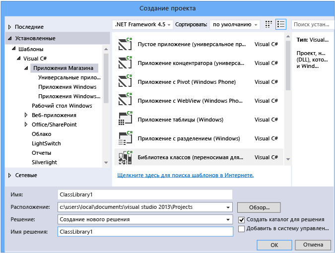
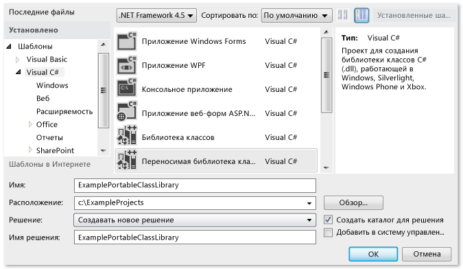
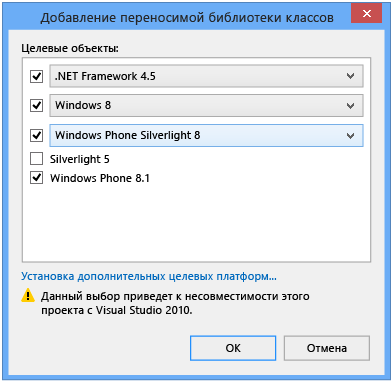
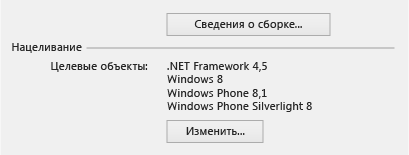
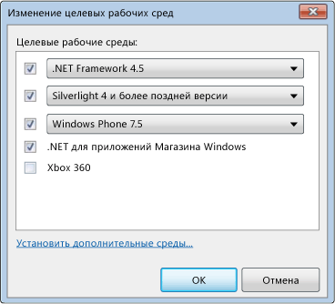
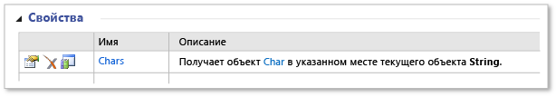

# <a name="cross-platform-development-with-the-portable-class-library"></a>Кроссплатформенная разработка с переносной библиотекой классов
Тип проекта "Переносимая библиотека классов .NET Framework" в Visual Studio позволяет быстро и легко создавать межплатформенные приложения и библиотеки для платформ Майкрософт.  

[!INCLUDE[standard](../../../includes/pcl-to-standard.md)]

 Переносимые библиотеки классов уменьшают временные и трудовые затраты на разработку и тестирования кода. Используйте такой тип проекта для создания переносимых сборок .NET Framework, а затем ссылайтесь на них из приложений, предназначенных для различных платформ, таких как Windows и Windows Phone.  
  
 Даже после создания проекта переносимой библиотеки классов в Visual Studio и начала работы над проектом вы сможете изменить целевые платформы. Visual Studio скомпилирует вашу библиотеку с новыми сборками, что поможет определить, какие изменения следует внести в код.  
  
 В этой статье описывается разработка в Visual Studio, но корпорация Майкрософт также предоставляет ссылочные сборки переносимых библиотек классов, с помощью которые можно разрабатывать приложения и библиотеки в других средствах, таких как Xamarin. Их можно использовать в любой среде выполнения на основе .NET Framework даже на платформах других поставщиков. Дополнительные сведения о ссылочных сборок см. в записи блога [переносимой библиотеки классов (PCL) теперь доступна на всех платформах](https://blogs.msdn.com/b/dotnet/archive/2013/10/14/portable-class-library-pcl-now-available-on-all-platforms.aspx). Чтобы загрузить сборки, см. в разделе [ссылочные сборки Microsoft .NET переносимой библиотеки](https://www.microsoft.com/download/details.aspx?id=40727) в центре загрузки Майкрософт. Дополнительные сведения о том, как использовать сборки с помощью Xamarin см. в записи блога [PCL и библиотеки .NET NuGet теперь доступны для Xamarin](https://blogs.msdn.com/b/dotnet/archive/2013/11/13/pcl-and-net-nuget-libraries-are-now-enabled-for-xamarin.aspx).  
  
 Visual Studio предоставляет шаблоны, которые облегчают разработку с использованием переносимой библиотеки классов. В зависимости от используемой версии Visual Studio доступные шаблоны и меню могут отличаться от тех, что описаны в этой статье.  
  
> [!WARNING]
>  Visual Studio 2013 с обновлением 2 содержит обновления для шаблонов переносимой библиотеки классов. Если у вас есть более ранняя версия Visual Studio и Visual Studio 2013 установлен на том же компьютере, и вы установили обновление 2, изменения **требуемой версии .NET Framework** варианты, которые будут применяться к обеим версиям Visual Studio.  
  
 В этом разделе.  
  
 [Поддержка Visual Studio](#vs_support)  
 [Создание проекта переносимой библиотеки классов](#create_pcl)  
 [Целевые параметры](#platforms)  
 [Изменение целевой платформы](#change_targets)  
 [Поддерживаемые функции](#features)  
 [Поддерживаемые типы и члены](#members)  
 [Отличия API в переносимой библиотеке классов](#API_diff)  
 [Использование переносимой библиотеки классов](#using)  
  
<a name="vs_support"></a>   
## <a name="visual-studio-support"></a>Поддержка Visual Studio  
 Поддержка переносимой библиотеки классов в Visual Studio зависит от используемой версии Visual Studio. В некоторых случаях у вас будут все необходимые компоненты, а в других случаях потребуется установить дополнительные компоненты, как показано в следующей таблице.  
  
|Visual Studio SKU|Поддержка создания переносимой библиотеки классов|  
|-----------------------|---------------------------------------------------|  
|Visual Studio 2010 Professional, Premium или Ultimate|Да, при установке [Portable Library Tools](https://marketplace.visualstudio.com/items?itemName=BCLTeam.PortableLibraryTools2).|  
|Версии Visual Studio Express 2010|Нет.|  
|Visual Studio 2012 Professional, Premium или Ultimate|Да. Для поддержки Windows Phone 8.0 установите [Windows Phone SDK 8.0](https://www.microsoft.com/download/details.aspx?id=35471).|  
|Версии Visual Studio Express 2012|Нет.|  
|Visual Studio 2013 Professional, Premium или Ultimate|Да. Для поддержки Windows Phone 8.1 установите [последнюю версию Visual Studio 2013](https://visualstudio.microsoft.com/vs/older-downloads/).|  
|Visual Studio Community 2013 для Windows|Да, при установке [последнюю версию Visual Studio Community 2013](https://visualstudio.microsoft.com/vs/older-downloads/), который включает обновления 2.|  
  
<a name="create_pcl"></a>   
## <a name="creating-a-portable-class-library-project"></a>Создание проекта переносимой библиотеки классов  
 Для создания переносимой библиотеки классов следует использовать один из шаблонов в Visual Studio. Создайте новый проект, а затем в **новый проект** диалогового **шаблоны**, выберите целевой язык (C# или Visual Basic) и затем выберите один из целевых платформ. Другие платформы можно выбрать на следующем шаге.  
  
 В Visual Studio 2013 с обновлением 2, вы можете выбрать **библиотека классов (переносимая)** шаблон для выбранных языка и платформы, чтобы создать переносимую библиотеку классов. Этот шаблон отображается для следующих платформ:  
  
-   Приложения Магазина  
  
-   Настольный компьютер Windows  
  
-   Silverlight  
  
 Если вы хотите создать библиотеку, предназначенные для Windows Phone 8.1 и Windows 8.1 на языке C#, вы можете **Store приложения**, а затем выберите **библиотека классов (переносимая для универсальных приложений)**.  
  
   
  
 При использовании этого шаблона Windows 8.1 и Windows Phone 8.1 автоматически выбираются как целевые платформы. Если создать библиотеку только для Windows Phone 8.1 или Windows 8.1, вы сможете изменить и добавить целевые платформы позднее.  
  
 Если вы используете Visual Studio 2012 или Visual Studio 2013 без обновления 2, создайте новый проект и выберите **переносимой библиотеки классов** шаблона в разделе Visual C# или Visual Basic.  
  
   
  
 **Добавление переносимой библиотеки классов** откроется диалоговое окно, и можно выбрать дополнительные платформы. В зависимости от выбранных платформ могут отображаться предупреждения о совместимости.  
  
   
Диалоговое окно добавления переносимой библиотеки классов для Visual Studio 2013 с обновлением 2  
  
 Независимо от того, используете ли вы Visual Studio 2012 или Visual Studio 2013, вы можете выбрать платформы при создании проекта переносимой библиотеки классов или изменить целевые платформы в свойствах проекта после его создания.  
  
<a name="platforms"></a>   
## <a name="target-options"></a>Доступные целевые платформы  
 При создании проекта переносимой библиотеки классов можно выбрать операционную систему и целевую версию .NET Framework. Если вы используете Visual Studio 2013 и установили обновление 2 или более поздней версии, вы можете **библиотека классов (переносимая для универсальных приложений)** шаблон, чтобы создать переносимую библиотеку классов, ориентированный на Windows 8.1 и Windows Phone 8.1. В следующей таблице показаны доступные целевые платформы, зависящие от используемой версии Visual Studio.  
  
|Целевая платформа|Visual Studio 2012|Visual Studio 2013|Visual Studio 2013 с обновлением 2 или более поздняя версия|  
|-|-|-|-|  
|.NET Framework|— .NET framework 4 и более поздних версий<br /><br /> — .NET framework 4.0.3 и более поздних версий<br /><br /> — .NET framework 4.5|— .NET framework 4 и более поздних версий<br /><br /> — .NET framework 4.0.3 и более поздних версий<br /><br /> — .NET framework 4.5 и более поздних версий<br /><br /> — .NET framework 4.5.1|— .NET framework 4<br /><br /> — .NET framework 4.0.3<br /><br /> — .NET framework 4.5<br /><br /> — .NET framework 4.5.1|  
|Windows Phone|-Windows Phone 7 и более поздних версий<br /><br /> -Windows Phone 7.5 и более поздних версий<br /><br /> -Windows Phone 8|-Windows Phone 8|-Windows Phone Silverlight 8<br /><br /> -Windows Phone Silverlight 8.1<br /><br /> Для поддержки среды выполнения Windows и XAML выберите:<br /><br /> -Windows Phone 8.1|  
|Магазин Windows|-.NET для приложений Windows Store|-Windows Store Apps (Windows 8) и более поздних версий<br /><br /> -Windows Store Apps (Windows 8.1)|— Windows 8<br /><br /> — Windows 8.1|  
|-Silverlight|-Silverlight 4 и более поздних версий<br /><br /> -Silverlight 5|-Silverlight 5|-Silverlight 5|  
|Xbox|-Xbox 360|Н/Д|Н/Д|  
  
<a name="change_targets"></a>   
## <a name="changing-targets"></a>Изменение целевой платформы  
 После выбора шаблона переносимой библиотеки классов платформы по умолчанию выбираются автоматически, но они зависят от установленной версии Visual Studio и ранее выбираемых платформ. Вы можете изменить платформы при создании переносимой библиотеки классов или после начала разработки библиотеки.  
  
 Если вы хотите изменить целевые платформы после создания проекта, в **обозревателе решений**, откройте контекстное меню для проекта переносимой библиотеки классов (не решение) и затем выберите **свойства** . На странице свойств проекта **библиотеки** вкладке отображается платформ, в данный момент нацелен проект.  
  
   
Страница свойств переносимой библиотеки классов для Visual Studio 2013 с обновлением 2  
  
 Чтобы добавить или удалить целевые объекты, выберите **изменение** кнопку и затем установите или снимите соответствующие флажки.  
  
 При изменении целевых платформ API-интерфейсы, доступные для разработки проекта, изменятся в соответствии с выбранными платформами. Visual Studio отображает ошибки и предупреждения после изменения целевых платформ.  
  
 Если вы хотите оценить переносимость сборки до можно внести изменения в Visual Studio, можно использовать [анализатор переносимости .NET](https://visualstudiogallery.msdn.microsoft.com/1177943e-cfb7-4822-a8a6-e56c7905292b).  
  
 Пункты меню зависят от используемой версии Visual Studio.  
  
   
Диалоговое окно изменения целевых платформ в Visual Studio 2012  
  
<a name="features"></a>   
## <a name="supported-features"></a>Поддерживаемые функции  
 В следующей таблице показано, какие функции поддерживаются различными платформами и версиями. В некоторых случаях корпорация Майкрософт добавила поддержку пакета NuGet, это обозначено в уведомлении. Дополнительные сведения о пакетах NuGet для платформы .NET Framework, см. в разделе [.NET Framework и Out-выпуски](../../../docs/framework/get-started/the-net-framework-and-out-of-band-releases.md).  
  
|Функция|.NET Framework|.NET Framework|.NET Framework|Магазин Windows|Магазин Windows|Магазин Windows Phone|Windows Phone Silverlight|Windows Phone Silverlight|Windows Phone Silverlight|Silverlight|Silverlight|Xbox 360|  
|-------------|--------------------|--------------------|--------------------|-------------------|-------------------|-------------------------|-------------------------------|-------------------------------|-------------------------------|-----------------|-----------------|--------------|  
||**4**|**4.0.3**|**4.5**|**8**|**8.1**|**8.1**|**7.5**|**8**|**8.1**|**4**|**5**||  
|Основные библиотеки|✓|✓|✓|✓|✓|✓|✓|✓|✓|✓|✓|✓|  
|Поддержка асинхронного выполнения|➊|➊|✓|✓|✓|✓|➊|➊|✓|➊|➊||  
|Сжатие|||✓|✓|✓|✓||➋|➋||||  
|Заметки к данным||✓|✓|✓|✓|||||✓|✓||  
|Ключевое слово dynamic|✓|✓|✓|✓|✓|||||✓|✓||  
|HTTPClient|➌|➌|✓|✓|✓|✓|➌|➌|➌|➌|➌||  
|IQueryable|✓|✓|✓|✓|✓|✓|✓|✓|✓|✓|✓||  
|LINQ|✓|✓|✓|✓|✓|✓|✓|✓|✓|✓|✓||  
|Managed Extensibility Network (MEF)|✓|✓|✓|✓|✓|||||✓|✓||  
|Сетевая библиотека классов (NCL)|✓|✓|✓|✓|✓|✓|✓|✓|✓|✓|✓||  
|Сериализация (контракт данных, XML и JSON)|✓|✓|✓|✓|✓|✓|✓|✓|✓|✓|✓||  
|System.Numerics|✓|✓|✓|✓|✓|||||✓|✓||  
|Модели представлений (MVVM)|||✓|✓|✓|✓|✓|✓|✓|✓|✓||  
|Windows Communication Foundation (WCF)|✓|✓|✓|✓|✓||✓|✓|✓|✓|✓||  
|API среды выполнения Windows|||||✓|✓|||||||  
|Windows.UI.XAML|||||✓|✓|||||||  
|XLINQ||✓|✓|✓|✓|✓|✓|✓|✓|✓|✓|✓|  
  
 ➊ Требуется [Microsoft Async](https://www.nuget.org/packages/Microsoft.Bcl.Async/) пакета  
 ➋ Требуется [Microsoft Compression](https://www.nuget.org/packages/Microsoft.Bcl.Compression) пакета  
 ➌ Требуется [клиентских библиотек HTTP Майкрософт](https://www.nuget.org/packages/Microsoft.Net.Http) пакета  
  
> [!WARNING]
>  Могут возникнуть ошибки при ссылке на [Microsoft Compression](https://www.nuget.org/packages/Microsoft.Bcl.Compression) и [клиентских библиотек HTTP Майкрософт](https://www.nuget.org/packages/Microsoft.Net.Http) пакеты из переносимой библиотеки, используемой приложением Windows Phone Silverlight 8.1. Дополнительные сведения см. в разделе [совместимость платформ и критические изменения для приложений Windows Phone Silverlight 8.1](https://docs.microsoft.com/previous-versions/windows/apps/dn642084(v=vs.105)).  
  
<a name="members"></a>   
## <a name="supported-types-and-members"></a>Поддерживаемые типы и члены  
 Типы и члены, доступные в проектах переносимой библиотеки классов, ограничены несколькими факторами совместимости:  
  
-   они должны быть общими для выбранных целевых платформ;  
  
-   они должны вести себя аналогичным образом на всех этих платформах;  
  
-   они не должны быть кандидатами на вывод из употребления;  
  
-   они должны иметь смысл в переносимой среде, особенно если вспомогательные члены не являются переносимыми.  
  
 Например, переносимая библиотека классов содержит типы, связанные с пользовательским интерфейсом, только если в качестве целевых платформ выбраны Windows 8.1 и Windows Phone 8.1. Кроме того, столкнуться с ограничениями также можно при нацеливании на платформы (такие как Xbox, .NET Framework 4 и Windows Phone 7), выпущенные до выхода переносимой библиотеки классов. Через NuGet выпускаются пакеты .NET Framework, которые улучшает поддержку переносимой библиотеки классов для некоторых из более старых платформ. Дополнительные сведения и список пакетов NuGet, см. в разделе [.NET Framework и Out-выпуски](../../../docs/framework/get-started/the-net-framework-and-out-of-band-releases.md).  
  
 Если член поддерживается в переносимой библиотеке классов и для выбранных целевых платформ, он будет показан в IntelliSense в вашем проекте. Кроме того, значок переносимой библиотеки классов  отображается в таблицах членов в [библиотекиклассов.NETFramework](https://msdn.microsoft.com/library/mt472912.aspx) рядом с поддерживаемыми членами. Например, в следующей таблице показано, что свойство <xref:System.String.Chars%2A> класса <xref:System.String> поддерживается в переносимой библиотеке классов:  
  
   
Значок переносимой библиотеки классов  
  
 Можно также обратиться к подразделу **сведения о версии** разделе справочного раздела на предмет примечанием, что тип или член поддерживается в проекте переносимой библиотеки классов:  
  
   
Пример сведений о версии  
  
 Однако помните, что интерфейс API может поддерживаться в переносимой библиотеки классов, но возможность его использования зависит от выбранных целевых платформ.  
  
<a name="API_diff"></a>   
## <a name="api-differences-in-the-portable-class-library"></a>Отличия API в переносимой библиотеке классов  
 Для обеспечения совместимости сборок переносимой библиотеки классов на всех поддерживаемых платформах некоторые члены в переносимой библиотеке классов были немного изменены.  
  
<a name="using"></a>   
## <a name="using-the-portable-class-library"></a>Использование переносимой библиотеки классов  
 После построения проекта переносимой библиотеки классов просто добавьте ссылку на нее в других проектах. Можно сделать ссылку на проект или на конкретные сборки, содержащие классы, к которым требуется доступ.  
  
 Для запуска приложения, ссылающегося на сборку переносимой библиотеки классов, на компьютере должны быть установлены требуемые (или более поздние) версии целевых платформ. Visual Studio содержит все необходимые платформы, поэтому приложение можно запустить без дальнейших изменений на компьютере, который использовался для его разработки.  
  
### <a name="deploying-a-windows-store-or-windows-phone-app"></a>Развертывание приложения Магазина Windows или Windows Phone  
 При создании приложения Магазина Windows или Windows Phone, которое ссылается на сборку переносимой библиотеки классов, все необходимые компоненты для развертывания приложения уже включены в пакет приложения, другие действия не требуются.  
  
### <a name="deploying-a-net-framework-app"></a>Развертывание приложения .NET Framework  
 При развертывании приложения .NET Framework, в котором имеется ссылка на сборку переносимой библиотеки классов, необходимо задать зависимость от нужной версии платформы .NET Framework. Задание этой зависимости обеспечивает установку нужной версии вместе с приложением. Если вы платформу .NET Framework 4 или более поздней версии, на компьютере должен быть .NET Framework 4 с [обновление](https://www.microsoft.com/download/details.aspx?id=3556), 4.0.3 для .NET Framework 4 или .NET Framework 4.5.  
  
-   Чтобы создать зависимость с развертыванием ClickOnce: В **обозревателе решений**, выберите узел проекта для проекта, необходимо опубликовать. (Это проект, в котором имеется ссылка на проект переносимой библиотеки классов.) В строке меню выберите **проекта**, **свойства**и нажмите кнопку **публикации** вкладки. На **публикации** выберите **предварительные требования**. Отметьте требуемую версию платформы .NET Framework (или обновление платформы .NET Framework 4) как необходимый компонент.  
  
-   Чтобы создать зависимость с проектом установки: В **обозревателе решений**, выберите проект установки. В строке меню выберите **проекта**, **свойства**, **предварительные требования**. Отметьте требуемую версию платформы .NET Framework как необходимый компонент.  
  
 Дополнительные сведения о развертывании приложений .NET Framework, см. в разделе [руководство по развертыванию для разработчиков](../../../docs/framework/deployment/deployment-guide-for-developers.md).  
  
### <a name="deploying-a-silverlight-based-app"></a>Развертывание приложения Silverlight  
 При развертывании приложения Silverlight, ссылающегося на сборку переносимой библиотеки классов, необходимо убедиться, что минимальная версия среды выполнения, требуемая приложению, соответствует его целевой версии. В случае Silverlight 4 версия должна быть 4.0.60129.0 или более поздняя. Версия указывается путем включения параметра `<param name="minRuntimeVersion" value="4.0.60129.0" />` в веб-страницу, на которой размещено приложение Silverlight, следующим образом:  
  
```xaml  
<div id="silverlightControlHost">  
    <object data="data:application/x-silverlight-2,"   
           type="application/x-silverlight-2" width="100%" height="100%">  
    <param name="source" value="ClientBin/SilverlightApplication.xap"/>  
    <param name="onError" value="onSilverlightError" />  
    <param name="background" value="white" />  
    <param name="minRuntimeVersion" value="4.0.60129.0" />  
    <param name="autoUpgrade" value="true" />  
    <a href="https://www.microsoft.com/getsilverlight/get-started/install/"   
             style="text-decoration:none">  
        
    </a>  
  </object>  
   <iframe id="_sl_historyFrame"   
              style="visibility:hidden;height:0px;width:0px;border:0px">  
   </iframe>  
</div>  
```  
  
## <a name="see-also"></a>См. также

- [Использование переносимой библиотеки классов с MVVM](../../../docs/standard/cross-platform/using-portable-class-library-with-model-view-view-model.md)  
- [Ресурсы приложений для библиотек, предназначенных для нескольких платформ](../../../docs/standard/cross-platform/app-resources-for-libraries-that-target-multiple-platforms.md)  
- [Анализатор переносимости .NET](https://visualstudiogallery.msdn.microsoft.com/1177943e-cfb7-4822-a8a6-e56c7905292b)  
- [Поддержка платформы .NET Framework для приложений магазина Windows и среды выполнения Windows](../../../docs/standard/cross-platform/support-for-windows-store-apps-and-windows-runtime.md)  
- [Развертывание](../../../docs/framework/deployment/net-framework-applications.md)
