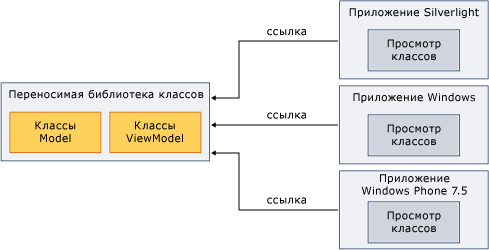

# Использование переносимой библиотеки классов с шаблоном "модель-представление-модель представления"Using Portable Class Library with Model-View-View Model
Можно использовать .NET Framework [переносимой библиотеки классов](../../../docs/standard/cross-platform/cross-platform-development-with-the-portable-class-library.md) для реализации шаблона Model-View-View Model (MVVM) и совместного использования сборок на нескольких платформах.You can use the .NET Framework [Portable Class Library](../../../docs/standard/cross-platform/cross-platform-development-with-the-portable-class-library.md) to implement the Model-View-View Model (MVVM) pattern and share assemblies across multiple platforms.  
  
 MVVM — это шаблон приложения, который изолирует интерфейс пользователя от основной бизнес-логики.MVVM is an application pattern that isolates the user interface from the underlying business logic. Можно реализовать классы модели и модели представления в проекте [!INCLUDE[net_portable](../../../includes/net-portable-md.md)] в [!INCLUDE[vs_dev11_long](../../../includes/vs-dev11-long-md.md)], а затем создать представления, которые учитывают особенности разных платформ.You can implement the model and view model classes in a [!INCLUDE[net_portable](../../../includes/net-portable-md.md)] project in [!INCLUDE[vs_dev11_long](../../../includes/vs-dev11-long-md.md)], and then create views that are customized for different platforms. Такой подход позволяет создавать модель и бизнес-логику данных только один раз и использовать этот код в платформе .NET Framework, приложениях Silverlight, Windows Phone и [!INCLUDE[win8_appname_long](../../../includes/win8-appname-long-md.md)], как показано на следующей иллюстрации.This approach enables you to write the data model and business logic only once, and use that code from .NET Framework, Silverlight, Windows Phone, and [!INCLUDE[win8_appname_long](../../../includes/win8-appname-long-md.md)] apps, as shown in the following illustration.  
  
   
  
 В этом разделе не предоставляет общие сведения о шаблоне MVVM.This topic does not provide general information about the MVVM pattern. Он только предоставляет сведения об использовании [!INCLUDE[net_portable](../../../includes/net-portable-md.md)] для реализации MVVM.It only provides information about how to use [!INCLUDE[net_portable](../../../includes/net-portable-md.md)] to implement MVVM. Дополнительные сведения о MVVM см. в разделе [краткое руководство MVVM](https://msdn.microsoft.com/library/gg430869(v=PandP.40).aspx).For more information about MVVM, see the [MVVM Quickstart](https://msdn.microsoft.com/library/gg430869(v=PandP.40).aspx).  
  
## Классы, поддерживающие MVVMClasses That Support MVVM  
 При разработке [!INCLUDE[net_v45](../../../includes/net-v45-md.md)], [!INCLUDE[net_win8_profile](../../../includes/net-win8-profile-md.md)], Silverlight или Windows Phone 7.5 для вашего [!INCLUDE[net_portable](../../../includes/net-portable-md.md)] проекта, следующие классы доступны для реализации шаблона MVVM:When you target the [!INCLUDE[net_v45](../../../includes/net-v45-md.md)], [!INCLUDE[net_win8_profile](../../../includes/net-win8-profile-md.md)], Silverlight, or Windows Phone 7.5 for your [!INCLUDE[net_portable](../../../includes/net-portable-md.md)] project, the following classes are available for implementing the MVVM pattern:  
  
-   Класс <xref:System.Collections.ObjectModel.ObservableCollection%601?displayProperty=nameWithType><xref:System.Collections.ObjectModel.ObservableCollection%601?displayProperty=nameWithType> class  
  
-   Класс <xref:System.Collections.ObjectModel.ReadOnlyObservableCollection%601?displayProperty=nameWithType><xref:System.Collections.ObjectModel.ReadOnlyObservableCollection%601?displayProperty=nameWithType> class  
  
-   Класс <xref:System.Collections.Specialized.INotifyCollectionChanged?displayProperty=nameWithType><xref:System.Collections.Specialized.INotifyCollectionChanged?displayProperty=nameWithType> class  
  
-   Класс <xref:System.Collections.Specialized.NotifyCollectionChangedAction?displayProperty=nameWithType><xref:System.Collections.Specialized.NotifyCollectionChangedAction?displayProperty=nameWithType> class  
  
-   Класс <xref:System.Collections.Specialized.NotifyCollectionChangedEventArgs?displayProperty=nameWithType><xref:System.Collections.Specialized.NotifyCollectionChangedEventArgs?displayProperty=nameWithType> class  
  
-   Класс <xref:System.Collections.Specialized.NotifyCollectionChangedEventHandler?displayProperty=nameWithType><xref:System.Collections.Specialized.NotifyCollectionChangedEventHandler?displayProperty=nameWithType> class  
  
-   Класс <xref:System.ComponentModel.DataErrorsChangedEventArgs?displayProperty=nameWithType><xref:System.ComponentModel.DataErrorsChangedEventArgs?displayProperty=nameWithType> class  
  
-   Класс <xref:System.ComponentModel.INotifyDataErrorInfo?displayProperty=nameWithType><xref:System.ComponentModel.INotifyDataErrorInfo?displayProperty=nameWithType> class  
  
-   Класс <xref:System.ComponentModel.INotifyPropertyChanged?displayProperty=nameWithType><xref:System.ComponentModel.INotifyPropertyChanged?displayProperty=nameWithType> class  
  
-   Класс <xref:System.Windows.Input.ICommand?displayProperty=nameWithType><xref:System.Windows.Input.ICommand?displayProperty=nameWithType> class  
  
-   Все классы в <xref:System.ComponentModel.DataAnnotations?displayProperty=nameWithType> пространства именAll classes in the <xref:System.ComponentModel.DataAnnotations?displayProperty=nameWithType> namespace  
  
## Реализация MVVMImplementing MVVM  
 Чтобы реализовать MVVM, обычно создаются модели и модели представления в [!INCLUDE[net_portable](../../../includes/net-portable-md.md)] проект, поскольку [!INCLUDE[net_portable](../../../includes/net-portable-md.md)] Непереносимый проект не может ссылаться на проект.To implement MVVM, you typically create both the model and the view model in a [!INCLUDE[net_portable](../../../includes/net-portable-md.md)] project, because a [!INCLUDE[net_portable](../../../includes/net-portable-md.md)] project cannot reference a non-portable project. Модели и модели представления может быть в том же проекте или в виде отдельных проектов.The model and view model can be in the same project or in separate projects. Если вы используете отдельные проекты, добавьте ссылку из проекта модели представления в проект модели.If you use separate projects, add a reference from the view model project to the model project.  
  
 После компиляции модели и просматривать проекты модели, можно ссылаться на эти сборки в приложении, которая содержит представление.After you compile the model and view model projects, you reference those assemblies in the app that contains the view. Если представление взаимодействует только с помощью модели представления, имеется ссылка на сборку, содержащую модель представления.If the view interacts only with the view model, you only have to reference the assembly that contains the view model.  
  
### МодельModel  
 В следующем примере показано упрощенная модель класс, который может находиться в [!INCLUDE[net_portable](../../../includes/net-portable-md.md)] проекта.The following example shows a simplified model class that could reside in a [!INCLUDE[net_portable](../../../includes/net-portable-md.md)] project.  
  
 [!code-csharp[PortableClassLibraryMVVM#1](../../../samples/snippets/csharp/VS_Snippets_CLR/portableclasslibrarymvvm/cs/customer.cs#1)]
 [!code-vb[PortableClassLibraryMVVM#1](../../../samples/snippets/visualbasic/VS_Snippets_CLR/portableclasslibrarymvvm/vb/customer.vb#1)]  
  
 В следующем примере показано простой способ заполнения, получения и обновления данных в [!INCLUDE[net_portable](../../../includes/net-portable-md.md)] проекта.The following example shows a simple way to populate, retrieve, and update the data in a [!INCLUDE[net_portable](../../../includes/net-portable-md.md)] project. В реальном приложении будет получать данные из источника, например службы Windows Communication Foundation (WCF).In a real app, you would retrieve the data from a source such as a Windows Communication Foundation (WCF) service.  
  
 [!code-csharp[PortableClassLibraryMVVM#2](../../../samples/snippets/csharp/VS_Snippets_CLR/portableclasslibrarymvvm/cs/customerrepository.cs#2)]
 [!code-vb[PortableClassLibraryMVVM#2](../../../samples/snippets/visualbasic/VS_Snippets_CLR/portableclasslibrarymvvm/vb/customerrepository.vb#2)]  
  
### Модель представленияView Model  
 Базовый класс для представления моделей часто добавляется при реализации шаблона MVVM.A base class for view models is frequently added when implementing the MVVM pattern. В следующем примере базовый класс.The following example shows a base class.  
  
 [!code-csharp[PortableClassLibraryMVVM#3](../../../samples/snippets/csharp/VS_Snippets_CLR/portableclasslibrarymvvm/cs/viewmodelbase.cs#3)]
 [!code-vb[PortableClassLibraryMVVM#3](../../../samples/snippets/visualbasic/VS_Snippets_CLR/portableclasslibrarymvvm/vb/viewmodelbase.vb#3)]  
  
 Реализация <xref:System.Windows.Input.ICommand> часто используется интерфейс с шаблоном MVVM.An implementation of the <xref:System.Windows.Input.ICommand> interface is frequently used with the MVVM pattern. В следующем примере показана реализация интерфейса <xref:System.Windows.Input.ICommand>.The following example shows an implementation of the <xref:System.Windows.Input.ICommand> interface.  
  
 [!code-csharp[PortableClassLibraryMVVM#4](../../../samples/snippets/csharp/VS_Snippets_CLR/portableclasslibrarymvvm/cs/relaycommand.cs#4)]
 [!code-vb[PortableClassLibraryMVVM#4](../../../samples/snippets/visualbasic/VS_Snippets_CLR/portableclasslibrarymvvm/vb/relaycommand.vb#4)]  
  
 В следующем примере показано упрощенное представление модели.The following example shows a simplified view model.  
  
 [!code-csharp[PortableClassLibraryMVVM#5](../../../samples/snippets/csharp/VS_Snippets_CLR/portableclasslibrarymvvm/cs/mainpageviewmodel.cs#5)]
 [!code-vb[PortableClassLibraryMVVM#5](../../../samples/snippets/visualbasic/VS_Snippets_CLR/portableclasslibrarymvvm/vb/customerviewmodel.vb#5)]  
  
### ПросмотрView  
 Из [!INCLUDE[net_v45](../../../includes/net-v45-md.md)] приложения, [!INCLUDE[win8_appname_long](../../../includes/win8-appname-long-md.md)] приложения, приложения Silverlight или приложения Windows Phone 7.5, могут ссылаться на сборку, содержащую проекты модели и представления модели.From a [!INCLUDE[net_v45](../../../includes/net-v45-md.md)] app, [!INCLUDE[win8_appname_long](../../../includes/win8-appname-long-md.md)] app, Silverlight-based app, or Windows Phone 7.5 app, you can reference the assembly that contains the model and view model projects.  Затем создается представление, которое взаимодействует с модели представления.You then create a view that interacts with the view model. В следующем примере показано упрощенное приложения Windows Presentation Foundation (WPF), который получает и обновляет данные из модели представления.The following example shows a simplified Windows Presentation Foundation (WPF) app that retrieves and updates data from the view model. Вы можете создать сходные представления в Silverlight, Windows Phone или [!INCLUDE[win8_appname_long](../../../includes/win8-appname-long-md.md)] приложений.You could create similar views in Silverlight, Windows Phone, or [!INCLUDE[win8_appname_long](../../../includes/win8-appname-long-md.md)] apps.  
  
 [!code-xaml[PortableClassLibraryMVVM#6](../../../samples/snippets/csharp/VS_Snippets_CLR/portableclasslibrarymvvm/cs/mainwindow.xaml#6)]  
  
## См. такжеSee Also  
 [Переносимая библиотека классовPortable Class Library](../../../docs/standard/cross-platform/cross-platform-development-with-the-portable-class-library.md)
