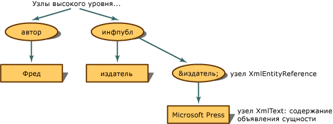

# <a name="entity-references-are-preserved"></a><span data-ttu-id="f1ecc-102">Сохраняемые ссылки на сущности</span><span class="sxs-lookup"><span data-stu-id="f1ecc-102">Entity References are Preserved</span></span>
<span data-ttu-id="f1ecc-103">Если ссылки на сущности не разворачиваются, а сохраняются, модель XML DOM строит узел **XmlEntityReference**, когда обнаруживает ссылку на сущность.</span><span class="sxs-lookup"><span data-stu-id="f1ecc-103">When the entity reference is not expanded, but preserved, the XML Document Object Model (DOM) builds an **XmlEntityReference** node when it encounters an entity reference.</span></span>  
  
 <span data-ttu-id="f1ecc-104">Используя следующий XML-код,</span><span class="sxs-lookup"><span data-stu-id="f1ecc-104">Using the following XML,</span></span>  
  
```xml  
<author>Fred</author>  
<pubinfo>Published by &publisher;</pubinfo>  
```  
  
 <span data-ttu-id="f1ecc-105">Модель DOM строит узел **XmlEntityReference**, когда встречает ссылку `&publisher;`.</span><span class="sxs-lookup"><span data-stu-id="f1ecc-105">the DOM builds an **XmlEntityReference** node when it encounters the `&publisher;` reference.</span></span> <span data-ttu-id="f1ecc-106">Узел **XmlEntityReference** содержит дочерние узлы, которые копируются из содержимого декларации сущности.</span><span class="sxs-lookup"><span data-stu-id="f1ecc-106">The **XmlEntityReference** contains child nodes copied from the content in the entity declaration.</span></span> <span data-ttu-id="f1ecc-107">В предыдущем примере присутствует текст в декларации сущности, поэтому узел **XmlText** создается как дочерний узел для узла ссылки на сущность.</span><span class="sxs-lookup"><span data-stu-id="f1ecc-107">The preceding code example contains text in the entity declaration, so an **XmlText** node is created as the child node of the entity reference node.</span></span>  
  
 <span data-ttu-id="f1ecc-108"></span><span class="sxs-lookup"><span data-stu-id="f1ecc-108"></span></span>  
<span data-ttu-id="f1ecc-109">Древовидная структура для сохраняемых ссылок на сущности</span><span class="sxs-lookup"><span data-stu-id="f1ecc-109">Tree structure for entity references that are preserved</span></span>  
  
 <span data-ttu-id="f1ecc-110">Дочерние узлы **XmlEntityReference** являются копиями всех дочерних узлов, созданных из узла **XmlEntity** в момент, когда была обнаружена декларация сущности.</span><span class="sxs-lookup"><span data-stu-id="f1ecc-110">The child nodes of the **XmlEntityReference** are copies of all the child nodes created from the **XmlEntity** node when the entity declaration was encountered.</span></span>  
  
> [!NOTE]
> <span data-ttu-id="f1ecc-111">Узлы, копируемые из **XmlEntity**, не всегда остаются точными копиями после помещения в узел ссылки на сущность.</span><span class="sxs-lookup"><span data-stu-id="f1ecc-111">The nodes copied from the **XmlEntity** are not always exact copies once placed under the entity reference node.</span></span> <span data-ttu-id="f1ecc-112">Могут существовать пространства имен, лежащие в области узла ссылки на сущность, которые оказывают влияние на конечную конфигурацию дочерних узлов.</span><span class="sxs-lookup"><span data-stu-id="f1ecc-112">There can be namespaces that are in scope at the entity reference node, and that affects the final configuration of the child nodes.</span></span>  
  
 <span data-ttu-id="f1ecc-113">По умолчанию сохраняются сущности общего вида, такие как `&abc;`, и всегда создаются узлы **XmlEntityReference**.</span><span class="sxs-lookup"><span data-stu-id="f1ecc-113">By default, general entities like `&abc;` are preserved and **XmlEntityReference** nodes always created.</span></span>  
  
## <a name="see-also"></a><span data-ttu-id="f1ecc-114">См. также:</span><span class="sxs-lookup"><span data-stu-id="f1ecc-114">See also</span></span>

- [<span data-ttu-id="f1ecc-115">Модель объектов документов XML (DOM)</span><span class="sxs-lookup"><span data-stu-id="f1ecc-115">XML Document Object Model (DOM)</span></span>](../../../../docs/standard/data/xml/xml-document-object-model-dom.md)
