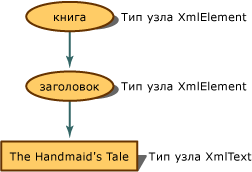

# <a name="mapping-the-object-hierarchy-to-xml-data"></a>Сопоставление объектной иерархии с XML-данными
Когда XML-документ находится в памяти, его концептуальным представлением является дерево. В распоряжении программиста имеется объектная иерархия для доступа к узлам этого дерева. Следующий пример показывает, как XML-содержимое становится узлами.  
  
 При считывании XML в модель DOM, его фрагменты преобразуются в узлы, и эти узлы сохраняют дополнительные метаданные о себе, в частности, тип узла и значения. Тип узла - это его объект и характеристики, определяющие выполняемые действия и свойства, которые можно установить и получить.  
  
 Если имеется следующий простой XML:  
  
 **Ввод**  
  
```xml  
<book>  
    <title>The Handmaid's Tale</title>  
</book>  
```  
  
 Входные данные представлены в памяти следующим деревом узлов с назначенным свойством типа узлов:  
  
   
Представление дерева узлов book и title  
  
 Элемент `book` становится объектом **XmlElement**, следующий элемент `title` также становится объектом **XmlElement**, а элемент content становится объектом **XmlText**. Методы и свойства объекта **XmlElement** отличаются от методов и свойств, доступных для объекта **XmlText**. Поэтому очень важно знать, какой тип узла получает XML, так как тип узла определяет действия, которые можно выполнить.  
  
 В следующих примерах выполняется считывание XML-данных и запись другого текста, в зависимости от типа узла. Использование следующего XML-файла **items.xml** для получения входных данных.  
  
 **Ввод**  
  
```xml  
<?xml version="1.0"?>  
<!-- This is a sample XML document -->  
<!DOCTYPE Items [<!ENTITY number "123">]>  
<Items>  
  <Item>Test with an entity: &number;</Item>  
  <Item>test with a child element <more/> stuff</Item>  
  <Item>test with a CDATA section <![CDATA[<456>]]> def</Item>  
  <Item>Test with a char entity: A</Item>  
  <!-- Fourteen chars in this element.-->  
  <Item>1234567890ABCD</Item>  
</Items>  
```  
  
 Следующий пример кода считывает файл **items.xml** и отображает сведения о типах узлов.  
  
```vb  
Imports System  
Imports System.IO  
Imports System.Xml  
  
Public Class Sample  
    Private Const filename As String = "items.xml"  
  
    Public Shared Sub Main()  
  
        Dim reader As XmlTextReader = Nothing  
  
        Try  
            ' Load the reader with the data file and
            'ignore all white space nodes.
            reader = New XmlTextReader(filename)  
            reader.WhitespaceHandling = WhitespaceHandling.None  
  
            ' Parse the file and display each of the nodes.  
            While reader.Read()  
                Select Case reader.NodeType  
                    Case XmlNodeType.Element  
                        Console.Write("<{0}>", reader.Name)  
                    Case XmlNodeType.Text  
                        Console.Write(reader.Value)  
                    Case XmlNodeType.CDATA  
                        Console.Write("<![CDATA[{0}]]>", reader.Value)  
                    Case XmlNodeType.ProcessingInstruction  
                        Console.Write("<?{0} {1}?>", reader.Name, reader.Value)  
                    Case XmlNodeType.Comment  
                        Console.Write("<!--{0}-->", reader.Value)  
                    Case XmlNodeType.XmlDeclaration  
                        Console.Write("<?xml version='1.0'?>")  
                    Case XmlNodeType.Document  
                    Case XmlNodeType.DocumentType  
                        Console.Write("<!DOCTYPE {0} [{1}]", reader.Name, reader.Value)  
                    Case XmlNodeType.EntityReference  
                        Console.Write(reader.Name)  
                    Case XmlNodeType.EndElement  
                        Console.Write("</{0}>", reader.Name)  
                End Select  
            End While  
  
        Finally  
            If Not (reader Is Nothing) Then  
                reader.Close()  
            End If  
        End Try  
    End Sub 'Main ' End class  
End Class 'Sample  
```  
  
```csharp  
using System;  
using System.IO;  
using System.Xml;  
  
public class Sample  
{  
    private const String filename = "items.xml";  
  
    public static void Main()  
    {  
        XmlTextReader reader = null;  
  
        try  
        {  
            // Load the reader with the data file and ignore
            // all white space nodes.  
            reader = new XmlTextReader(filename);  
            reader.WhitespaceHandling = WhitespaceHandling.None;  
  
            // Parse the file and display each of the nodes.  
            while (reader.Read())  
            {  
                switch (reader.NodeType)  
                {  
                    case XmlNodeType.Element:  
                        Console.Write("<{0}>", reader.Name);  
                        break;  
                    case XmlNodeType.Text:  
                        Console.Write(reader.Value);  
                        break;  
                    case XmlNodeType.CDATA:  
                        Console.Write("<![CDATA[{0}]]>", reader.Value);  
                        break;  
                    case XmlNodeType.ProcessingInstruction:  
                        Console.Write("<?{0} {1}?>", reader.Name, reader.Value);  
                        break;  
                    case XmlNodeType.Comment:  
                        Console.Write("<!--{0}-->", reader.Value);  
                        break;  
                    case XmlNodeType.XmlDeclaration:  
                        Console.Write("<?xml version='1.0'?>");  
                        break;  
                    case XmlNodeType.Document:  
                        break;  
                    case XmlNodeType.DocumentType:  
                        Console.Write("<!DOCTYPE {0} [{1}]", reader.Name, reader.Value);  
                        break;  
                    case XmlNodeType.EntityReference:  
                        Console.Write(reader.Name);  
                        break;  
                    case XmlNodeType.EndElement:  
                        Console.Write("</{0}>", reader.Name);  
                        break;  
                }  
            }  
        }  
  
        finally  
        {  
            if (reader != null)  
                reader.Close();  
        }  
    }  
} // End class  
```  
  
 Вывод примера содержит сопоставление данных типам узлов.  
  
 **Выходные данные**  
  
```xml  
<?xml version='1.0'?><!--This is a sample XML document --><!DOCTYPE Items [<!ENTITY number "123">]<Items><Item>Test with an entity: 123</Item><Item>test with a child element <more> stuff</Item><Item>test with a CDATA section <![CDATA[<456>]]> def</Item><Item>Test with a char entity: A</Item><--Fourteen chars in this element.--><Item>1234567890ABCD</Item></Items>  
```  
  
 Рассматривая входные данные построчно и используя выход, сформированный кодом, можно использовать следующую таблицу для анализа того, какой узел сформировал конкретные строки результата, и понять, какие XML-данные стали соответствующими типами узлов.  
  
|Входные данные|Выходные данные|Проверка типа узла|  
|-----------|------------|--------------------|  
|\<?xml version="1.0"?>|\<?xml version='1.0'?>|XmlNodeType.XmlDeclaration|  
|\<!-- Это пример XML-документа -->|\<!-- Это пример XML-документа -->|XmlNodeType.Comment|  
|\<!DOCTYPE Items [\<!ENTITY number "123">]>|\<!DOCTYPE Items [\<!ENTITY number "123">]>|XmlNodeType.DocumentType|  
|\<Items>|\<Items>|XmlNodeType.Element|  
|\<Item>|\<Item>|XmlNodeType.Element|  
|Проверка с помощью сущности: &number;|Test with an entity: 123|XmlNodeType.Text|  
|\</Item>|\</Item>|XmlNodeType.EndElement|  
|\<Item>|\<Item>|XmNodeType.Element|  
|test with a child element|test with a child element|XmlNodeType.Text|  
|\<more>|\<more>|XmlNodeType.Element|  
|stuff|stuff|XmlNodeType.Text|  
|\</Item>|\</Item>|XmlNodeType.EndElement|  
|\<Item>|\<Item>|XmlNodeType.Element|  
|test with a CDATA section|test with a CDATA section|XmlTest.Text|  
|<![CDATA[\<456>]]\>|<![CDATA[\<456>]]\>|XmlTest.CDATA|  
|def|def|XmlNodeType.Text|  
|\</Item>|\</Item>|XmlNodeType.EndElement|  
|\<Item>|\<Item>|XmlNodeType.Element|  
|Проверка с помощью сущности char: &\#65;|Test with a char entity: A|XmlNodeType.Text|  
|\</Item>|\</Item>|XmlNodeType.EndElement|  
|\<!-- В этом элементе 14 элементов типа char.-->|\<-- В этом элементе 14 элементов типа char.-->|XmlNodeType.Comment|  
|\<Item>|\<Item>|XmlNodeType.Element|  
|1234567890ABCD|1234567890ABCD|XmlNodeType.Text|  
|\</Item>|\</Item>|XmlNodeType.EndElement|  
|\</Items>|\</Items>|XmlNodeType.EndElement|  
  
 Необходимо знать, какой тип узла назначен, так как от типа узла зависят допустимые типы действий и типы свойств, которые можно установить и получить.  
  
 Управление созданием узлов для пробелов при загрузке данных в модель DOM осуществляется флагом **PreserveWhitespace**. Дополнительные сведения см. в руководстве по [обработке незначимых и значимых пробелов при загрузке модели DOM](../../../../docs/standard/data/xml/white-space-and-significant-white-space-handling-when-loading-the-dom.md).  
  
 Чтобы добавить новые узлы в модель DOM, воспользуйтесь руководством [Вставка узлов в XML-документ](../../../../docs/standard/data/xml/inserting-nodes-into-an-xml-document.md). Чтобы удалить узлы из модели DOM, изучите статью [Удаление узлов, содержимого и значений из XML-документа](../../../../docs/standard/data/xml/removing-nodes-content-and-values-from-an-xml-document.md). Чтобы изменить узлы в модели DOM, см. статью [Изменение узлов, содержимого и значений в XML-документе](../../../../docs/standard/data/xml/modifying-nodes-content-and-values-in-an-xml-document.md).  
  
## <a name="see-also"></a>См. также раздел

- [Модель объектов документов XML (DOM)](../../../../docs/standard/data/xml/xml-document-object-model-dom.md)
