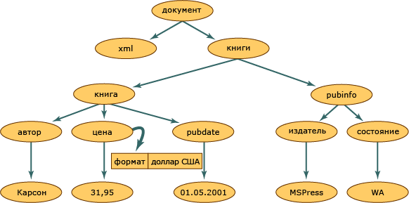

# <a name="xml-document-object-model-dom"></a><span data-ttu-id="0305a-102">Модель объектов XML-документов (DOM)</span><span class="sxs-lookup"><span data-stu-id="0305a-102">XML Document Object Model (DOM)</span></span>

<span data-ttu-id="0305a-103">Класс XML DOM является представлением XML-документа в памяти.</span><span class="sxs-lookup"><span data-stu-id="0305a-103">The XML Document Object Model (DOM) class is an in-memory representation of an XML document.</span></span> <span data-ttu-id="0305a-104">Модель DOM позволяет читать, обрабатывать и изменять XML-документ программным образом.</span><span class="sxs-lookup"><span data-stu-id="0305a-104">The DOM allows you to programmatically read, manipulate, and modify an XML document.</span></span> <span data-ttu-id="0305a-105">Класс **XmlReader** также читает XML, но предоставляет только последовательный доступ для чтения без поддержки кэширования.</span><span class="sxs-lookup"><span data-stu-id="0305a-105">The **XmlReader** class also reads XML; however, it provides non-cached, forward-only, read-only access.</span></span> <span data-ttu-id="0305a-106">Это значит, что **XmlReader** не позволит изменять значения атрибутов или содержимое элемента, а также вставлять и удалять узлы.</span><span class="sxs-lookup"><span data-stu-id="0305a-106">This means that there are no capabilities to edit the values of an attribute or content of an element, or the ability to insert and remove nodes with the **XmlReader**.</span></span> <span data-ttu-id="0305a-107">Изменение - основная функция модели DOM.</span><span class="sxs-lookup"><span data-stu-id="0305a-107">Editing is the primary function of the DOM.</span></span> <span data-ttu-id="0305a-108">Это стандартизованный, структурированный способ представления XML-данных в памяти, хотя на самом деле данные XML хранятся в файлах и пересылаются из других объектов в строковом виде.</span><span class="sxs-lookup"><span data-stu-id="0305a-108">It is the common and structured way that XML data is represented in memory, although the actual XML data is stored in a linear fashion when in a file or coming in from another object.</span></span> <span data-ttu-id="0305a-109">Далее приведен пример XML-данных.</span><span class="sxs-lookup"><span data-stu-id="0305a-109">The following is XML data.</span></span>

## <a name="input"></a><span data-ttu-id="0305a-110">Input</span><span class="sxs-lookup"><span data-stu-id="0305a-110">Input</span></span>

```xml
<?xml version="1.0"?>
  <books>
    <book>
        <author>Carson</author>
        <price format="dollar">31.95</price>
        <pubdate>05/01/2001</pubdate>
    </book>
    <pubinfo>
        <publisher>MSPress</publisher>
        <state>WA</state>
    </pubinfo>
  </books>
```

<span data-ttu-id="0305a-111">Далее показано, какая структура будет создана в памяти, когда эти XML-данные считываются в модель структуры DOM.</span><span class="sxs-lookup"><span data-stu-id="0305a-111">The following illustration shows how memory is structured when this XML data is read into the DOM structure.</span></span>

<span data-ttu-id="0305a-112"> Структура XML-документа</span><span class="sxs-lookup"><span data-stu-id="0305a-112"> XML document structure</span></span>

<span data-ttu-id="0305a-113">Каждый круг на этой иллюстрации представляет собой узел в структуре XML-документа, называемый объектом **XmlNode**.</span><span class="sxs-lookup"><span data-stu-id="0305a-113">Within the XML document structure, each circle in this illustration represents a node, which is called an **XmlNode** object.</span></span> <span data-ttu-id="0305a-114">Объект **XmlNode** является базовым объектом дерева DOM.</span><span class="sxs-lookup"><span data-stu-id="0305a-114">The **XmlNode** object is the basic object in the DOM tree.</span></span> <span data-ttu-id="0305a-115">Класс **XmlDocument**, расширяющий класс **XmlNode**, поддерживает методы для операций над документом в целом (например, для загрузки его в память или сохранения XML в файл).</span><span class="sxs-lookup"><span data-stu-id="0305a-115">The **XmlDocument** class, which extends **XmlNode**, supports methods for performing operations on the document as a whole (for example, loading it into memory or saving the XML to a file.</span></span> <span data-ttu-id="0305a-116">Кроме того, **XmlDocument** предоставляет возможности для просмотра узлов всего XML-документа и выполнения операций над ними.</span><span class="sxs-lookup"><span data-stu-id="0305a-116">In addition, **XmlDocument** provides a means to view and manipulate the nodes in the entire XML document.</span></span> <span data-ttu-id="0305a-117">И **XmlNode**, и **XmlDocument** обладают улучшенной производительностью, расширенной функциональностью и содержат методы и свойства, которые позволяют следующее.</span><span class="sxs-lookup"><span data-stu-id="0305a-117">Both **XmlNode** and **XmlDocument** have performance and usability enhancements and have methods and properties to:</span></span>

- <span data-ttu-id="0305a-118">Получать доступ к DOM-специфичным узлам, например к узлам элементов, узлам ссылок на сущности и т. п., и изменять эти узлы.</span><span class="sxs-lookup"><span data-stu-id="0305a-118">Access and modify nodes specific to the DOM, such as element nodes, entity reference nodes, and so on.</span></span>

- <span data-ttu-id="0305a-119">Получать целые узлы помимо содержащейся в них информации, например текста в узле элемента.</span><span class="sxs-lookup"><span data-stu-id="0305a-119">Retrieve entire nodes, in addition to the information the node contains, such as the text in an element node.</span></span>

  > [!NOTE]
  > <span data-ttu-id="0305a-120">Для приложений, которым не требуется структуризация или изменение, предоставляемые моделью DOM, классы **XmlReader** и **XmlWriter** обеспечат последовательный потоковый доступ к XML без поддержки кэширования.</span><span class="sxs-lookup"><span data-stu-id="0305a-120">If an application does not require the structure or editing capabilities provided by the DOM, the **XmlReader** and **XmlWriter** classes provide non-cached, forward-only stream access to XML.</span></span> <span data-ttu-id="0305a-121">Дополнительные сведения см. в разделах <xref:System.Xml.XmlReader> и <xref:System.Xml.XmlWriter>.</span><span class="sxs-lookup"><span data-stu-id="0305a-121">For more information, see <xref:System.Xml.XmlReader> and <xref:System.Xml.XmlWriter>.</span></span>

<span data-ttu-id="0305a-122">Объекты **Node** обладают набором методов и свойств, а также хорошо определенных базовых характеристик.</span><span class="sxs-lookup"><span data-stu-id="0305a-122">**Node** objects have a set of methods and properties, as well as basic and well-defined characteristics.</span></span> <span data-ttu-id="0305a-123">Вот некоторые из этих характеристик:</span><span class="sxs-lookup"><span data-stu-id="0305a-123">Some of these characteristics are:</span></span>

- <span data-ttu-id="0305a-124">У каждого узла есть один родительский узел, то есть узел, находящийся непосредственно над данным.</span><span class="sxs-lookup"><span data-stu-id="0305a-124">Nodes have a single parent node, a parent node being a node directly above them.</span></span> <span data-ttu-id="0305a-125">Единственный узел, не имеющий родителя - корневой узел документа, так как это узел верхнего уровня, содержащий сам документ и его фрагменты.</span><span class="sxs-lookup"><span data-stu-id="0305a-125">The only nodes that do not have a parent is the Document root, as it is the top-level node and contains the document itself and document fragments.</span></span>

- <span data-ttu-id="0305a-126">У большинства узлов может быть несколько дочерних узлов, то есть узлов, расположенных непосредственно под ними.</span><span class="sxs-lookup"><span data-stu-id="0305a-126">Most nodes can have multiple child nodes, which are nodes directly below them.</span></span> <span data-ttu-id="0305a-127">Далее следует список типов узлов, которые могут иметь дочерние узлы:</span><span class="sxs-lookup"><span data-stu-id="0305a-127">The following is a list of node types that can have child nodes.</span></span>

  - <span data-ttu-id="0305a-128">**Document**</span><span class="sxs-lookup"><span data-stu-id="0305a-128">**Document**</span></span>

  - <span data-ttu-id="0305a-129">**DocumentFragment**</span><span class="sxs-lookup"><span data-stu-id="0305a-129">**DocumentFragment**</span></span>

  - <span data-ttu-id="0305a-130">**EntityReference**</span><span class="sxs-lookup"><span data-stu-id="0305a-130">**EntityReference**</span></span>

  - <span data-ttu-id="0305a-131">**Элемент**</span><span class="sxs-lookup"><span data-stu-id="0305a-131">**Element**</span></span>

  - <span data-ttu-id="0305a-132">**Атрибут**</span><span class="sxs-lookup"><span data-stu-id="0305a-132">**Attribute**</span></span>

  <span data-ttu-id="0305a-133">Узлы **XmlDeclaration**, **Notation**, **Entity**, **CDATASection**, **Text**, **Comment**, **ProcessingInstruction** и **DocumentType** не могут иметь дочерних узлов.</span><span class="sxs-lookup"><span data-stu-id="0305a-133">The **XmlDeclaration**, **Notation**, **Entity**, **CDATASection**, **Text**, **Comment**, **ProcessingInstruction**, and **DocumentType** nodes do not have child nodes.</span></span>

- <span data-ttu-id="0305a-134">Узлы, находящиеся на одном уровне наследования, например узлы **book** и **pubinfo** на нашей схеме, называются одноуровневыми.</span><span class="sxs-lookup"><span data-stu-id="0305a-134">Nodes that are at the same level, represented in the diagram by the **book** and **pubinfo** nodes, are siblings.</span></span>

<span data-ttu-id="0305a-135">Одна из характеристик модели DOM - способ обработки атрибутов.</span><span class="sxs-lookup"><span data-stu-id="0305a-135">One characteristic of the DOM is how it handles attributes.</span></span> <span data-ttu-id="0305a-136">Атрибуты не являются узлами, состоящими в родительских, дочерних и одноуровневых связях.</span><span class="sxs-lookup"><span data-stu-id="0305a-136">Attributes are not nodes that are part of the parent, child, and sibling relationships.</span></span> <span data-ttu-id="0305a-137">Атрибуты считаются собственностью узла элемента и представляют собой пару «имя-значение».</span><span class="sxs-lookup"><span data-stu-id="0305a-137">Attributes are considered a property of the element node and are made up of a name and a value pair.</span></span> <span data-ttu-id="0305a-138">Например, если XML-данные представляют собой конструкцию `format="dollar`, связанную с элементом `price`, слово `format` является именем атрибута, а значением атрибута `format` является `dollar`.</span><span class="sxs-lookup"><span data-stu-id="0305a-138">For example, if you have XML data consisting of `format="dollar`" associated with the element `price`, the word `format` is the name, and the value of the `format` attribute is `dollar`.</span></span> <span data-ttu-id="0305a-139">Чтобы получить атрибут `format="dollar"` узла **price**, воспользуйтесь методом **GetAttribute**, когда курсор расположен в узле элемента `price`.</span><span class="sxs-lookup"><span data-stu-id="0305a-139">To retrieve the `format="dollar"` attribute of the **price** node, you call the **GetAttribute** method when the cursor is located at the `price` element node.</span></span> <span data-ttu-id="0305a-140">Дополнительные сведения см. в статье [Доступ к атрибутам в модели DOM](../../../../docs/standard/data/xml/accessing-attributes-in-the-dom.md).</span><span class="sxs-lookup"><span data-stu-id="0305a-140">For more information, see [Accessing Attributes in the DOM](../../../../docs/standard/data/xml/accessing-attributes-in-the-dom.md).</span></span>

<span data-ttu-id="0305a-141">По мере считывания XML-документа в память создаются узлы.</span><span class="sxs-lookup"><span data-stu-id="0305a-141">As XML is read into memory, nodes are created.</span></span> <span data-ttu-id="0305a-142">Узлы бывают разных типов.</span><span class="sxs-lookup"><span data-stu-id="0305a-142">However, not all nodes are the same type.</span></span> <span data-ttu-id="0305a-143">Правила и синтаксис XML-элемента отличаются от правил и синтаксиса инструкции по обработке.</span><span class="sxs-lookup"><span data-stu-id="0305a-143">An element in XML has different rules and syntax than a processing instruction.</span></span> <span data-ttu-id="0305a-144">Поэтому по мере считывания разнообразных данных каждому узлу присваивается тип.</span><span class="sxs-lookup"><span data-stu-id="0305a-144">Therefore, as various data is read, a node type is assigned to each node.</span></span> <span data-ttu-id="0305a-145">Тип узла определяет его характеристики и функциональность.</span><span class="sxs-lookup"><span data-stu-id="0305a-145">This node type determines the characteristics and functionality of the node.</span></span>

<span data-ttu-id="0305a-146">Дополнительные сведения о типах узлов, создаваемых в памяти, см. в статье [Типы XML-узлов](../../../../docs/standard/data/xml/types-of-xml-nodes.md).</span><span class="sxs-lookup"><span data-stu-id="0305a-146">For more information on the types of nodes generated in memory, see [Types of XML Nodes](../../../../docs/standard/data/xml/types-of-xml-nodes.md).</span></span> <span data-ttu-id="0305a-147">Дополнительные сведения об объектах, создаваемых в дереве узлов, см. в статье [Сопоставление объектной иерархии с XML-данными](../../../../docs/standard/data/xml/mapping-the-object-hierarchy-to-xml-data.md).</span><span class="sxs-lookup"><span data-stu-id="0305a-147">For more information on the objects created in the node tree, see [Mapping the Object Hierarchy to XML Data](../../../../docs/standard/data/xml/mapping-the-object-hierarchy-to-xml-data.md).</span></span>

<span data-ttu-id="0305a-148">Корпорация Майкрософт расширила API-интерфейсы, доступные в DOM уровней 1 и 2 W3C, чтобы облегчить работу с XML-документами.</span><span class="sxs-lookup"><span data-stu-id="0305a-148">Microsoft has extended the APIs that are available in the World Wide Web Consortium (W3C) DOM Level 1 and Level 2 to make it easier to work with an XML document.</span></span> <span data-ttu-id="0305a-149">Дополнительные классы, методы и свойства полностью совместимы со стандартами W3C и добавляют дополнительную функциональность по сравнению с возможностями W3C XML DOM.</span><span class="sxs-lookup"><span data-stu-id="0305a-149">While fully supporting the W3C standards, the additional classes, methods, and properties add functionality beyond what can be done using the W3C XML DOM.</span></span> <span data-ttu-id="0305a-150">Новые классы позволяют получить доступ к реляционным данным, предоставляют методы синхронизации с данными ADO.NET, одновременно делая эти данные доступными в виде XML.</span><span class="sxs-lookup"><span data-stu-id="0305a-150">New classes enable you to access relational data, giving you methods for synchronizing with ADO.NET data, simultaneously exposing data as XML.</span></span> <span data-ttu-id="0305a-151">Дополнительные сведения см. в статье [о синхронизации DataSet с XmlDataDocument](../../../../docs/framework/data/adonet/dataset-datatable-dataview/dataset-and-xmldatadocument-synchronization.md).</span><span class="sxs-lookup"><span data-stu-id="0305a-151">For more information, see [Synchronizing a DataSet with an XmlDataDocument](../../../../docs/framework/data/adonet/dataset-datatable-dataview/dataset-and-xmldatadocument-synchronization.md).</span></span>

<span data-ttu-id="0305a-152">Модель DOM чрезвычайно полезна для считывания XML-данных в память, изменения их структуры, добавления и удаления узлов, изменения данных, принадлежащих узлу (например, текста, содержащегося в документе).</span><span class="sxs-lookup"><span data-stu-id="0305a-152">The DOM is most useful for reading XML data into memory to change its structure, to add or remove nodes, or to modify the data held by a node as in the text contained by an element.</span></span> <span data-ttu-id="0305a-153">Однако существуют и другие классы, которые в некоторых ситуациях работают быстрее модели DOM.</span><span class="sxs-lookup"><span data-stu-id="0305a-153">However, other classes are available that are faster than the DOM in other scenarios.</span></span> <span data-ttu-id="0305a-154">Классы **XmlReader** и **XmlWriter** предоставляют быстрый последовательный потоковый доступ к XML без поддержки кэширования.</span><span class="sxs-lookup"><span data-stu-id="0305a-154">For fast, non-cached, forward-only stream access to XML, use the **XmlReader** and **XmlWriter**.</span></span> <span data-ttu-id="0305a-155">Если вам нужен произвольный доступ с моделью курсора и **XPath**, используйте класс **XPathNavigator**.</span><span class="sxs-lookup"><span data-stu-id="0305a-155">If you need random access with a cursor model and **XPath**, use the **XPathNavigator** class.</span></span>

## <a name="see-also"></a><span data-ttu-id="0305a-156">См. также:</span><span class="sxs-lookup"><span data-stu-id="0305a-156">See also</span></span>

- [<span data-ttu-id="0305a-157">Типы XML-узлов</span><span class="sxs-lookup"><span data-stu-id="0305a-157">Types of XML Nodes</span></span>](../../../../docs/standard/data/xml/types-of-xml-nodes.md)
- [<span data-ttu-id="0305a-158">Сопоставление объектной иерархии с XML-данными</span><span class="sxs-lookup"><span data-stu-id="0305a-158">Mapping the Object Hierarchy to XML Data</span></span>](../../../../docs/standard/data/xml/mapping-the-object-hierarchy-to-xml-data.md)
