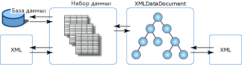

# Интеграция XML с реляционными данными и ADO.NET
**XmlDataDocument** класс является производным классом от **XmlDocument**и XML-данными. Преимущество **XmlDataDocument** организует мост между реляционными и иерархическими данными. Это **XmlDocument** , могут быть привязаны к **набора данных** и оба класса могут синхронизировать изменения, внесенные в данные, содержащиеся в двух классах. **XmlDocument** , привязанный к **DataSet** позволяет интеграцию XML с реляционными данными, и нет данных, предоставленных в виде XML или в реляционном формате. Можно использовать оба формата, не ограничиваясь единым способом представления данных.  
  
 Доступность двух представлений данных дает следующие преимущества.  
  
-   Структурированную часть XML-документа можно сопоставить с набором данных и эффективным образом хранить, индексировать и использовать в поиске.  
  
-   В XML-данных, хранимых в реляционном формате, можно эффективно выполнять преобразования, проверку и навигацию с помощью модели курсора. В некоторых случаях это можно сделать более эффективно в реляционных структурах, чем код XML, хранимый в **XmlDocument** модели.  
  
-   **Набора данных** может хранить часть XML-код. То есть, можно использовать **XPath** или **XslTransform** можно сохранять в **набора данных** элементы и атрибуты. После этого изменения можно внести распространять их на больший объем данных в в меньшем, отфильтрованном подмножестве данных, **XmlDataDocument**.  
  
 Можно также выполнить преобразование данных, загруженных в **DataSet** из SQL Server. Другой возможностью является привязка WinForm управляемых стилем классов .NET Framework и элементы управления WebForm **набора данных** , заполняется из входного потока XML.  
  
 Помимо поддержки **XslTransform**, **XmlDataDocument** обеспечивает доступ к реляционным данным для **XPath** запросов и проверки.  Для реляционных данных, в основном, доступны все XML-службы, а реляционные средства, такие как привязка элементов управления, CodeGen и т. д., доступны с помощью структурированной проекции XML-данных без нарушения их точности.  
  
 Поскольку **XmlDataDocument** наследуется от **XmlDocument**, она предоставляет реализацию модели W3C DOM. Тот факт, **XmlDataDocument** связан с и сохраняет подмножество своих данных, **DataSet** ограничивает и не затрагивает его использование в качестве **XmlDocument** каким-либо образом. Код, написанный для обработки событий **XmlDocument** работает без изменений для **XmlDataDocument**. **DataSet** обеспечивает реляционное представление тех же данных, определяя таблицы, столбцы, связи и ограничения, и представляет собой хранилище данных автономного пользователя в памяти.  
  
 Ниже показаны различные ассоциации между XML-данных с **DataSet** и **XmlDataDocument**.  
  
   
  
 На рисунке показано, что XML-данные могут загружаться непосредственно в **набора данных**, что позволяет работать с XML как реляционными данными. XML можно загрузить в производный класс модели DOM- **XmlDataDocument**и последующей загрузке и синхронизированы с **набора данных**. Поскольку **DataSet** и **XmlDataDocument** синхронизируются по одному набору данных, изменения данных в одном хранилище, отражаются в другом хранилище.  
  
 **XmlDataDocument** наследует все возможности изменения и навигации из **XmlDocument**. Иногда при использовании **XmlDataDocument** и его наследуемыми функциями и синхронизация с **DataSet**, является более предпочтительным вариантом, чем загрузка XML непосредственно в **набораданных**. В следующей таблице показаны элементы, которые нужно учитывать при выборе метода загрузки **набора данных**.  
  
|Причины для загрузки XML-данных непосредственно в объект DataSet|Причины для синхронизации класса XmlDataDocument с объектом DataSet|  
|----------------------------------------------|-----------------------------------------------------------|  
|Запросы к данным в **DataSet** проще с помощью SQL, чем в XPath.|Необходимо использовать запросы XPath к данным в **набора данных**.|  
|Не обязательно сохранять порядок элементов в исходном XML-коде.|Важно сохранять порядок элементов в исходном XML-коде.|  
|Не нужно сохранять пробелы между элементами и форматированием в исходном XML-коде.|Важно сохранять пробелы и форматирование в исходном XML-коде.|  
  
 При загрузке и записи XML непосредственно в и из **DataSet** соответствует поставленным задачам. в разделе [загрузка DataSet из XML](../../../../docs/framework/data/adonet/dataset-datatable-dataview/loading-a-dataset-from-xml.md) и [запись DataSet в виде XML-данных](../../../../docs/framework/data/adonet/dataset-datatable-dataview/writing-dataset-contents-as-xml-data.md).  
  
 При загрузке **DataSet** из **XmlDataDocument** соответствует поставленным задачам. в разделе [синхронизация объекта DataSet XML-документа](../../../../docs/framework/data/adonet/dataset-datatable-dataview/dataset-and-xmldatadocument-synchronization.md).  
  
## См. также  
 [Использование XML в наборах данных](../../../../docs/framework/data/adonet/dataset-datatable-dataview/using-xml-in-a-dataset.md)
