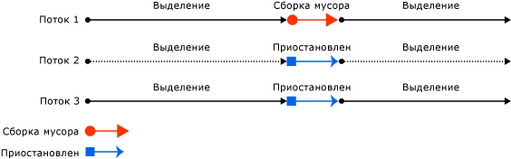
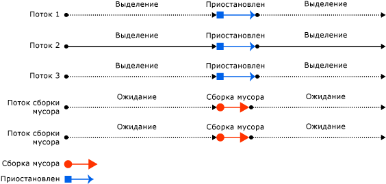
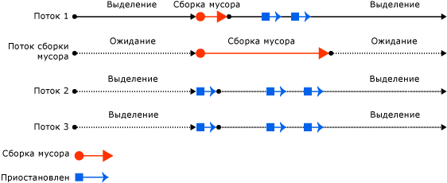

# Основы сборки мусора

 В среде CLR сборщик мусора выполняет функции автоматического диспетчера памяти. Это предоставляет следующие преимущества:

- Позволяет разрабатывать приложение без необходимости вручную освобождать память для создаваемых объектов.

- Эффективно выделяет память для объектов в управляемой куче.

- Уничтожает объекты, которые больше не используются, очищает их память и сохраняет память доступной для будущих распределений. Содержимое создаваемых управляемых объектов автоматически оказывается очищенным, чтобы их конструкторам не было нужно инициализировать каждое поле данных.

- Обеспечивает безопасность памяти, гарантируя, что объект не сможет использовать содержимое другого объекта.

 В этом разделе описаны основные понятия сборки мусора.

## Основы работы с памятью

В следующем списке перечислены важные понятия памяти среды CLR.

- Каждый процесс имеет свое собственное отдельное виртуальное адресное пространство. Все процессы на одном компьютере совместно используют одну и ту же физическую память и один файл подкачки, если он есть.

- По умолчанию на 32-разрядных компьютерах каждому процессу выделяется 2 Гбайт виртуального адресного пространства в пользовательском режиме.

- Разработчики приложений работают только с виртуальным адресным пространством и никогда не управляют физической памятью напрямую. Сборщик мусора выделяет и освобождает виртуальную память для разработчика в управляемой куче.

  При написании машинного кода для работы с виртуальным адресным пространством используются функции Win32. Эти функции выделяют и освобождают виртуальную память для разработчика в собственных кучах.

- Виртуальная память может находиться в трех состояниях.

  - Свободная. Ссылки на блок памяти отсутствуют, и он доступен для выделения.

  - Зарезервировано. Блок памяти доступен для использования разработчиком и не может использоваться для какого-либо другого запроса на выделение. Однако сохранение данных в этот блок памяти невозможно, пока он не будет выделен.

  - Выделена. Блок памяти назначен физическому хранилищу.

- Виртуальное адресное пространство может стать фрагментированным. Это означает, что в адресном пространстве находятся свободные блоки, также известные как пропуски. Когда производится запрос на выделение виртуальной памяти, диспетчер виртуальной памяти должен найти один свободный блок достаточного размера для выполнения этого запроса на выделение. Даже если система имеет 2 Гбайт свободного пространства, операция выделения 2 Гбайт завершится неудачей, если это пространство не расположено в одном адресном блоке.

- Память может закончиться, если закончится виртуальное адресное пространство для резервирования или физическое пространство для выделения.

Файл подкачки используется, даже если нехватка физической памяти (то есть потребность в физической памяти) невелика. При первом возрастании нехватки физической памяти операционная система должна освободить пространство в физической памяти для хранения данных, и она производит резервное копирование некоторых данных, находящихся в физической памяти, в файл подкачки. Эти данные не выгружаются, пока в этом нет необходимости, так что с подкачкой можно столкнуться в ситуациях с очень небольшой нехваткой физической памяти.

[К началу](#top)

## Условия для сборки мусора

Сборка мусора возникает при выполнении одного из следующих условий:

- Недостаточно физической памяти в системе. Это можно определить по уведомлению операционной системы о нехватке памяти или по сообщению узла о нехватке памяти.

- Память, используемая объектами, выделенными в управляемой куче, превышает допустимый порог. Этот порог непрерывно корректируется во время выполнения процесса.

- вызывается метод <xref:System.GC.Collect%2A?displayProperty=nameWithType> . Практически во всех случаях вызов этого метода не потребуется, так как сборщик мусора работает непрерывно. Этот метод в основном используется для уникальных ситуаций и тестирования.

[К началу](#top)

## Управляемая куча

После инициализации средой CLR сборщик мусора выделяет сегмент памяти для хранения объектов и управления ими. Эта память называется управляемой кучей в отличие от собственной кучи операционной системы.

Управляемая куча создается для каждого управляемого процесса. Все потоки в процессе выделяют память для объектов в одной и той же куче.

Для резервирования памяти сборщик мусора вызывает функцию Win32 [VirtualAlloc](/windows/desktop/api/memoryapi/nf-memoryapi-virtualalloc) и резервирует по одному сегменту памяти за раз для управляемых приложений. Сборщик мусора также резервирует сегменты по мере необходимости и возвращает освобожденные сегменты операционной системе (предварительно очистив их от всех объектов), вызывая функцию Win32 [VirtualFree](/windows/desktop/api/memoryapi/nf-memoryapi-virtualfree) .

> [!IMPORTANT]
> Размер сегментов, выделенных сборщиком мусора, зависит от реализации и может быть изменен в любое время, в том числе при периодических обновлениях. Приложение не должно делать никаких допущений относительно размера определенного сегмента, полагаться на него или пытаться настроить объем памяти, доступный для выделения сегментов.

Чем меньше объектов распределено в куче, тем меньше придется работать сборщику мусора. При размещении объектов не используйте округленные значения, превышающие фактические потребности, например не выделяйте 32 байта, когда необходимо только 15 байтов.

Сборка мусора, когда она запущена, освобождает память, занятую неиспользуемыми объектами. Процесс освобождения сжимает используемые объекты, чтобы они перемещались вместе, и удаляет пространство, занятое неиспользуемыми объектами, уменьшая, таким образом, кучу. Это гарантирует, что объекты, распределенные совместно, останутся в управляемой куче рядом, чтобы сохранить их локальность.

Степень вмешательства (частота и длительность) сборок мусора зависит от числа распределений и сохранившейся в управляемой куче памяти.

Кучу можно рассматривать как совокупность двух куч: [куча больших объектов](large-object-heap.md) и куча маленьких объектов.

[Куча больших объектов](large-object-heap.md) содержит очень большие объекты размером от 85 000 байтов. Объекты в куче больших объектов обычно являются массивами. Экземпляр объекта редко бывает очень большим.

[К началу](#top)

## Поколения

Куча организована в виде поколений, что позволяет ей обрабатывать долгоживущие и короткоживущие объекты. Сборка мусора в основном сводится к уничтожению короткоживущих объектов, которые обычно занимают только небольшую часть кучи. В куче существует три поколения объектов.

- **Поколение 0**. Это самое молодое поколение содержит короткоживущие объекты. Примером короткоживущего объекта является временная переменная. Сборка мусора чаще всего выполняется в этом поколении.

  Вновь распределенные объекты образуют новое поколение объектов и неявно являются сборками поколения 0, если они не являются большими объектами, в противном случае они попадают в кучу больших объектов в сборке поколения 2.

  Большинство объектов уничтожаются при сборке мусора для поколения 0 и не доживают до следующего поколения.

- **Поколение 1**. Это поколение содержит коротко живущие объекты и служит буфером между короткоживущими и долгоживущими объектами.

- **Поколение 2**. Это поколение содержит долгоживущие объекты. Примером долгоживущих объектов служит объект в серверном приложении, содержащий статические данные, которые существуют в течение длительности процесса.

Сборки мусора выполняются для конкретных поколений при выполнении соответствующих условий. Сборка поколения означает сбор объектов в этом поколении и во всех соответствующих младших поколениях. Сборка мусора поколения 2 также называется полной сборкой мусора, так как она уничтожает все объекты во всех поколениях (то есть все объекты в управляемой куче).

### Выживание и переходы

Объекты, которые не уничтожаются при сборке мусора, называются выжившими объектами и переходят в следующее поколение. Объекты, пережившие сборку мусора для поколения 0, переходят в поколение 1, объекты, пережившие сборку мусора для поколения 1, переходят в поколение 2, а объекты, пережившие сборку мусора для поколения 2, остаются в поколении 2.

Когда сборщик мусора обнаруживает высокую долю выживания в поколении, он повышает порог распределений для этого поколения, чтобы при следующей сборке мусора освобождалась заметная часть занятой памяти. В среде CLR непрерывно контролируется равновесие двух приоритетов: не позволить рабочему набору приложения стать слишком большим, задерживая сборку мусора, и не позволить сборке мусора выполняться слишком часто.

### Эфемерные поколения и сегменты

Так как объекты в поколениях 0 и 1 являются короткоживущими, эти поколения называются эфемерными поколениями.

Эфемерные поколения должны распределяться в сегменте памяти, который называется эфемерным сегментом. Каждый новый сегмент, полученный сборщиком мусора, становится новым эфемерным сегментом и содержит объекты, пережившие сборку мусора для поколения 0. Старый эфемерный сегмент становится новым сегментом поколения 2.

Размер эфемерного сегмента зависит от того, является ли система 32- или 64-разрядной, и от типа сборщика мусора. В таблице ниже представлены значения по умолчанию.

||32-разрядная версия|64-разрядная версия|
|-|-------------|-------------|
|Сборщик мусора рабочей станции|16 МБ|256 МБ|
|Сборщик мусора сервера|64 МБ|4 Гбайт|
|Сборщик мусора сервера с более чем 4 логическими ЦП|32 МБ|2 ГБ|
|Сборщик мусора сервера с более чем 8 логическими ЦП|16 МБ|1 ГБ|

Этот эфемерный сегмент может содержать объекты поколения 2. Объекты поколения 2 могут использовать несколько сегментов (столько, сколько требуется процессу и сколько разрешает память).

Объем памяти, освобождаемой при эфемерной сборке мусора, ограничен размером эфемерного сегмента. Освобождаемый объем памяти пропорционален пространству, занятому неиспользуемыми объектами.

[К началу](#top)

## Процесс сборки мусора

Сборка мусора состоит из следующих этапов:

- Этап маркировки, выполняющий поиск всех используемых объектов и составляющий их перечень.

- Этап перемещения, обновляющий ссылки на сжимаемые объекты.

- Этап сжатия, освобождающий пространство, занятое неиспользуемыми объектами и сжимающий выжившие объекты. На этапе сжатия объекты, пережившие сборку мусора, перемещаются к более старому концу сегмента.

  Так как сборки поколения 2 могут занимать несколько сегментов, объекты, перешедшие в поколение 2, могут быть перемещены в более старый сегмент. Выжившие объекты поколений 1 и 2 могут быть перемещены в другой сегмент, так как они перешли в поколение 2.

  Как правило, куча больших объектов не сжимается, поскольку копирование больших объектов приводит к снижению производительности. Однако начиная с .NET Framework 4.5.1 можно использовать свойство <xref:System.Runtime.GCSettings.LargeObjectHeapCompactionMode%2A?displayProperty=nameWithType> для сжатия большой кучи объектов по требованию.

Чтобы определить, являются ли объекты используемыми, сборщик мусора задействует следующие сведения.

- **Корни стека**. Переменные стека, предоставленные JIT-компилятором и средством обхода стека. Обратите внимание, что JIT-оптимизация позволяет уменьшить или увеличить области кода, в которых переменные стека сообщаются сборщику мусора.

- **Дескрипторы сборки мусора**. Дескрипторы, которые указывают на управляемые объекты и которые могут быть выделены пользовательским кодом или средой CLR.

- **Статические данные**. Статические объекты в доменах приложений, которые могут ссылаться на другие объекты. Каждый домен приложения следит за своими статическими объектами.

Перед запуском сборки мусора все управляемые потоки, кроме потока, запустившего сборку мусора, приостанавливаются.

На следующем рисунке показан поток, запускающий сборку мусора и вызывающий приостановку других потоков.

[К началу](#top)

## Манипулирование неуправляемыми ресурсами

Если управляемые объекты ссылаются на неуправляемые объекты, используя свои собственные дескрипторы файлов, разработчику необходимо явно освобождать неуправляемые объекты, так как сборщик мусора следит за памятью только в управляемой куче.

Пользователи управляемого объекта не могут удалить неуправляемые ресурсы, используемые объектом. Для выполнения очистки можно сделать управляемый объект подлежащим завершению. Завершение состоит из очищающих действий, выполняемых, когда объект перестает быть нужным. Когда управляемый объект уничтожается, он выполняет очищающие действия, заданные в его методе завершения.

Когда обнаруживается, что подлежащий завершению объект больше не используется, его метод завершения помещается в очередь, чтобы выполнить его очищающие действия, но сам объект переходит в следующее поколение. Следовательно, придется дождаться следующей сборки мусора, выполняемой для этого поколения (которой необязательно будет следующая сборка мусора), чтобы определить, удален ли объект.

[К началу](#top)

## Сборка мусора рабочей станции и сборка мусора сервера

Сборщик мусора является самонастраивающимся и может работать в широком диапазоне сценариев. Для задания типа сборки мусора в зависимости от характеристик рабочей нагрузки можно использовать параметр файла конфигурации. Среда CLR предоставляет следующие виды сборки мусора.

- Сборка мусора рабочей станции, предназначенная для всех клиентских рабочих станций и автономных ПК. Это значение по умолчанию для [элемента \<gcServer>](../../../docs/framework/configure-apps/file-schema/runtime/gcserver-element.md) в схеме конфигурации времени выполнения.

  Сборка мусора рабочей станции может быть параллельной или непараллельной. Параллельная сборка мусора позволяет управляемым потокам продолжать операции во время сборки мусора.

  Начиная с .NET Framework 4, фоновая сборка мусора заменяет параллельную сборку мусора.

- Сборка мусора сервера, предназначенная для серверных приложений, которым нужны высокое быстродействие и масштабируемость. Серверная сборка мусора может быть непараллельной или фоновой.

На рисунке ниже показаны выделенные потоки, выполняющие сборку мусора на сервере.

### Настройка сборки мусора

Для задания типа сборки мусора, которую должна выполнять среда CLR, можно использовать [элемент \<gcServer>](../../../docs/framework/configure-apps/file-schema/runtime/gcserver-element.md) схемы конфигурации времени выполнения. Когда для атрибута `enabled` этого элемента установлено значение `false` (по умолчанию), среда CLR выполняет сборку мусора рабочей станции. Когда для атрибута `enabled` задано значение `true`, среда CLR выполняет сборку мусора сервера.

Параллельная сборка мусора задается с помощью [элемента \<gcConcurrent>](../../../docs/framework/configure-apps/file-schema/runtime/gcconcurrent-element.md) схемы конфигурации времени выполнения. Значением по умолчанию является `enabled`. Этот параметр контролирует одновременную и фоновую сборку мусора.

Сборку мусора сервера также можно задать, используя неуправляемые интерфейсы размещения. Обратите внимание, что ASP.NET и SQL Server автоматически включают сборку мусора сервера, если приложение размещено в одной из этих сред.

### Сравнение сборки мусора рабочей станции и сборки мусора сервера

Ниже приведены замечания по сборке мусора рабочей станции, касающиеся потоков и производительности.

- Сборка выполняется для пользовательского потока, запустившего сборку мусора, и сохраняет тот же приоритет. Так как пользовательские потоки обычно выполняются с обычным приоритетом, сборщик мусора (выполняемый для потока с обычным приоритетом) должен конкурировать с другими потоками за время процессора.

  Потоки, выполняющие машинный код, не приостанавливаются.

- Для компьютера с одним процессором всегда используется сборка мусора рабочей станции, независимо от значения [элемента \<gcServer>](../../../docs/framework/configure-apps/file-schema/runtime/gcserver-element.md). Если задана сборка мусора сервера, среда CLR использует сборку мусора рабочей станции с выключенным параллелизмом.

Ниже приведены замечания по сборке мусора сервера, касающиеся потоков и производительности.

- Сборка выполняется в нескольких выделенных потоках, выполняемых с приоритетом `THREAD_PRIORITY_HIGHEST` .

- Для каждого процессора предоставляется куча и выделенный поток, выполняющий сборку мусора, и сборка куч выполняется одновременно. Каждая куча содержит кучу небольших объектов и кучу больших объектов, и все кучи доступны из пользовательского кода. Объекты из различных куч могут ссылаться друг на друга.

- Так как несколько потоков сборки мусора работают совместно, для кучи одного и того же размера сборка мусора сервера выполняется быстрее сборки мусора рабочей станции.

- В сборке мусора сервера часто используются сегменты большего размера. Однако обратите внимание, что это только обобщение: размер сегмента зависит от реализации и может изменяться. При настройке приложения не следует делать никаких предположений относительно размера сегментов, выделенных сборщиком мусора.

- Сборка мусора сервера может оказаться ресурсоемкой операцией. Например, если на компьютере с 4 процессорами выполняется 12 процессов, в каждом из которых применяется сборка мусора сервера, будут использоваться 48 выделенных потоков сборки мусора. В случае высокой загрузки памяти, если все процессы запускают сборку мусора, сборщику мусора понадобится выполнить планирование работы 48 потоков.

При запуске сотен экземпляров приложения рассмотрите возможность использования сборки мусора рабочей станции с отключенной параллельной сборкой мусора. Это уменьшит число переключений контекста, что может повысить быстродействие.

[К началу](#top)

## Параллельная сборка мусора

При сборке мусора рабочей станции или сервера можно включить параллельную сборку мусора, что позволит потокам работать параллельно с выделенным потоком, выполняющим сборку мусора, в течение большей части продолжительности сборки мусора. Этот вариант влияет только на сборки мусора для поколения 2, сборки для поколений 0 и 1 всегда выполняется непараллельно, так как они заканчиваются очень быстро.

Параллельная сборка мусора позволяет интерактивным приложениям лучше реагировать, минимизируя паузы для сборки. В течение большей части времени выполнения потока параллельной сборки мусора управляемые потоки могут продолжить выполнение. Это приведет к сокращению пауз во время выполнения сборки мусора.

Чтобы повысить быстродействие во время выполнения нескольких процессов, отключите параллельную сборку мусора. Это можно сделать, добавив [элемент \<gcConcurrent>](../../../docs/framework/configure-apps/file-schema/runtime/gcconcurrent-element.md) в файл конфигурации приложения и установив для его атрибута `enabled` значение `"false"`.

Параллельная сборка мусора выполняется в выделенном потоке. По умолчанию среда CLR выполняет сборку мусора рабочей станции с выключенной параллельной сборкой мусора. Это справедливо для однопроцессорных и многопроцессорных компьютеров.

Возможность разработчика распределять небольшие объекты в куче во время параллельной сборки мусора ограничена объектами, оставшимися в эфемерном сегменте во время запуска параллельной сборки мусора. Как только будет достигнут конец сегмента, придется подождать окончания параллельной сборки мусора, и управляемые потоки, которым нужно выполнить распределение небольших объектов, приостанавливаются.

Параллельная сборка мусора использует немного больший рабочий набор (по сравнению с непараллельной сборкой мусора), так как во время параллельной обработки можно распределять объекты. Но это может повлиять на быстродействие, так как распределяемые объекты становятся частью рабочего набора. По существу, параллельная сборка мусора меняет часть ресурсов процессора и памяти на сокращение пауз.

На следующем рисунке показана параллельная сборка мусора на отдельном выделенном потоке.

[К началу](#top)

## Фоновая сборка мусора рабочей станции

Фоновая сборка мусора заменяет параллельную сборку мусора рабочей станции, начиная с .NET Framework 4, и заменяет параллельную сборку мусора сервера, начиная с .NET Framework 4.5.  При фоновой сборке мусора сборка эфемерных поколений (0 и 1) выполняется по мере надобности, пока выполняется сборка поколения 2. Она выполняется в выделенном потоке и применима только к сборкам поколения 2. Фоновая сборка мусора автоматически включается по умолчанию и может быть включена или отключена с помощью параметра конфигурации [\<gcConcurrent>](../../../docs/framework/configure-apps/file-schema/runtime/gcconcurrent-element.md) в приложениях .NET Framework. 

> [!NOTE]
> Фоновая сборка мусора доступна только в .NET Framework 4 и более поздних версиях. В .NET Framework 4 она поддерживается только для сборки мусора рабочей станции. Начиная с .NET Framework 4.5 фоновая сборка мусора доступна как для сборки мусора рабочей станции, так и для сборки мусора сервера.

Сборка для эфемерных поколений во время фоновой сборки мусора называется высокоприоритетной сборкой мусора. Во время выполнения высокоприоритетных сборок мусора все управляемые потоки приостанавливаются.

Если выполняется фоновая сборка мусора и в поколении 0 размещено достаточное количество объектов, среда CLR выполняет высокоприоритетную сборку мусора для поколения 0 или поколения 1. Выделенный поток фоновой сборки мусора проверяет в частых точках, безопасных для сбора мусора, чтобы определить, не появился ли запрос выполнения высокоприоритетной сборки мусора. В этом случае фоновая сборка мусора приостанавливается, чтобы позволить выполниться высокоприоритетной сборке мусора. После выполнения высокоприоритетной сборки мусора работа выделенного потока фоновой сборки мусора и пользовательских потоков возобновляется.

Фоновая сборка мусора удаляет ограничения на распределение, наложенные параллельной сборкой мусора, так как эфемерные сборки мусора могут выполняться во время фоновой сборки мусора. Это означает, что фоновая сборка мусора может удалить неиспользуемые объекты в эфемерных поколениях, а также при необходимости может расширить во время сборки мусора для поколения 1.

На следующем рисунке показана фоновая сборка мусора в отдельном выделенном потоке на рабочей станции.

[К началу](#top)

## Фоновая сборка мусора сервера

Начиная с .NET Framework 4.5 фоновая сборка мусора сервера является режимом по умолчанию для сборки мусора сервера. Чтобы выбрать этот режим, установите атрибут `enabled` [элемента \<gcServer>](../../../docs/framework/configure-apps/file-schema/runtime/gcserver-element.md) в значение `true` в схеме конфигурации времени выполнения. Этот режим функционирует аналогично фоновой сборке мусора рабочей станции, описанной в предыдущем разделе, однако с некоторыми отличиями. Для фоновой сборки мусора рабочей станции используется один выделенной поток фоновой сборки мусора, тогда как для фоновой сборки мусора сервера используется несколько потоков, — обычно по одному выделенному потоку для каждого логического процессора. В отличие от потока фоновой сборки мусора рабочей станции у этих потоков время ожидания не истекает.

На следующем рисунке показана фоновая сборка мусора в отдельном выделенном потоке на сервере.

## См. также

- [Сборка мусора](../../../docs/standard/garbage-collection/index.md)
