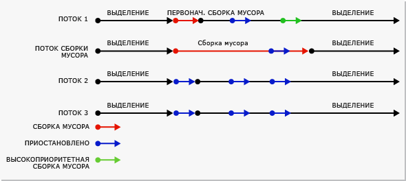
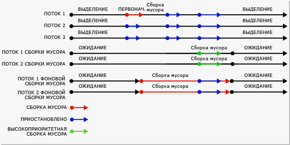

# Основы сборки мусораFundamentals of Garbage Collection
 В среде CLR сборщик мусора выполняет функции автоматического диспетчера памяти.In the common language runtime (CLR), the garbage collector serves as an automatic memory manager. Это предоставляет следующие преимущества:It provides the following benefits:  
  
-   Позволяет разрабатывать приложение без необходимости освобождать память.Enables you to develop your application without having to free memory.  
  
-   Эффективно выделяет память для объектов в управляемой куче.Allocates objects on the managed heap efficiently.  
  
-   Уничтожает объекты, которые больше не используются, очищает их память и сохраняет память доступной для будущих распределений.Reclaims objects that are no longer being used, clears their memory, and keeps the memory available for future allocations. Содержимое создаваемых управляемых объектов автоматически оказывается очищенным, чтобы их конструкторам не было нужно инициализировать каждое поле данных.Managed objects automatically get clean content to start with, so their constructors do not have to initialize every data field.  
  
-   Обеспечивает безопасность памяти, гарантируя, что объект не сможет использовать содержимое другого объекта.Provides memory safety by making sure that an object cannot use the content of another object.  
  
 В этом разделе описаны основные понятия сборки мусора.This topic describes the core concepts of garbage collection. Он содержит следующие подразделы:It contains the following sections:  
  
-   [Основы работы с памятьюFundamentals of memory](#fundamentals_of_memory)  
  
-   [Условия для сборки мусораConditions for a garbage collection](#conditions_for_a_garbage_collection)  
  
-   [Управляемая кучаThe managed heap](#the_managed_heap)  
  
-   [ПоколенияGenerations](#generations)  
  
-   [Процесс сборки мусораWhat happens during a garbage collection](#what_happens_during_a_garbage_collection)  
  
-   [Манипулирование неуправляемыми ресурсамиManipulating unmanaged resources](#manipulating_unmanaged_resources)  
  
-   [Сборка мусора рабочей станции и сборка мусора сервераWorkstation and server garbage collection](#workstation_and_server_garbage_collection)  
  
-   [Параллельная сборка мусораConcurrent garbage collection](#concurrent_garbage_collection)  
  
-   [Фоновая сборка мусора рабочей станцииBackground workstation garbage collection](#background_garbage_collection)  
  
-   [Фоновая сборка мусора сервераBackground server garbage collection](#background_server_garbage_collection)  
  
   
## Основы работы с памятьюFundamentals of memory  
 В следующем списке перечислены важные понятия памяти среды CLR.The following list summarizes important CLR memory concepts.  
  
-   Каждый процесс имеет свое собственное отдельное виртуальное адресное пространство.Each process has its own, separate virtual address space. Все процессы на одном компьютере совместно используют одну и ту же физическую память и один файл подкачки, если он есть.All processes on the same computer share the same physical memory, and share the page file if there is one.  
  
-   По умолчанию на 32-разрядных компьютерах каждому процессу выделяется 2 Гбайт виртуального адресного пространства в пользовательском режиме.By default, on 32-bit computers, each process has a 2-GB user-mode virtual address space.  
  
-   Разработчики приложений работают только с виртуальным адресным пространством и никогда не управляют физической памятью напрямую.As an application developer, you work only with virtual address space and never manipulate physical memory directly. Сборщик мусора выделяет и освобождает виртуальную память для разработчика в управляемой куче.The garbage collector allocates and frees virtual memory for you on the managed heap.  
  
     При написании машинного кода для работы с виртуальным адресным пространством используются функции Win32.If you are writing native code, you use Win32 functions to work with the virtual address space. Эти функции выделяют и освобождают виртуальную память для разработчика в собственных кучах.These functions allocate and free virtual memory for you on native heaps.  
  
-   Виртуальная память может находиться в трех состояниях.Virtual memory can be in three states:  
  
    -   Свободная.Free. Ссылки на блок памяти отсутствуют, и он доступен для выделения.The block of memory has no references to it and is available for allocation.  
  
    -   Зарезервировано.Reserved. Блок памяти доступен для использования разработчиком и не может использоваться для какого-либо другого запроса на выделение.The block of memory is available for your use and cannot be used for any other allocation request. Однако сохранение данных в этот блок памяти невозможно, пока он не будет выделен.However, you cannot store data to this memory block until it is committed.  
  
    -   Выделена.Committed. Блок памяти назначен физическому хранилищу.The block of memory is assigned to physical storage.  
  
-   Виртуальное адресное пространство может стать фрагментированным.Virtual address space can get fragmented. Это означает, что в адресном пространстве находятся свободные блоки, также известные как пропуски.This means that there are free blocks, also known as holes, in the address space. Когда производится запрос на выделение виртуальной памяти, диспетчер виртуальной памяти должен найти один свободный блок достаточного размера для выполнения этого запроса на выделение.When a virtual memory allocation is requested, the virtual memory manager has to find a single free block that is large enough to satisfy that allocation request. Даже если система имеет 2 Гбайт свободного пространства, операция выделения 2 Гбайт завершится неудачей, если это пространство не расположено в одном адресном блоке.Even if you have 2 GB of free space, the allocation that requires 2 GB will be unsuccessful unless all of that free space is in a single address block.  
  
-   Память может закончиться, если закончится виртуальное адресное пространство для резервирования или физическое пространство для выделения.You can run out of memory if you run out of virtual address space to reserve or physical space to commit.  
  
 Файл подкачки используется, даже если нехватка физической памяти (то есть потребность в физической памяти) невелика.Your page file is used even if physical memory pressure (that is, demand for physical memory) is low. При первом возрастании нехватки физической памяти операционная система должна освободить пространство в физической памяти для хранения данных, и она производит резервное копирование некоторых данных, находящихся в физической памяти, в файл подкачки.The first time your physical memory pressure is high, the operating system must make room in physical memory to store data, and it backs up some of the data that is in physical memory to the page file. Эти данные не выгружаются, пока в этом нет необходимости, так что с подкачкой можно столкнуться в ситуациях с очень небольшой нехваткой физической памяти.That data is not paged until it is needed, so it is possible to encounter paging in situations where the physical memory pressure is very low. 
 
 [К началуBack to top](#top)  
  
   
## Условия для сборки мусораConditions for a garbage collection  
 Сборка мусора возникает при выполнении одного из следующих условий:Garbage collection occurs when one of the following conditions is true:  
  
-   Недостаточно физической памяти в системе.The system has low physical memory. Это можно определить по уведомлению операционной системы о нехватке памяти или по сообщению узла о нехватке памяти.This is detected by either the low memory notification from the OS or low memory indicated by the host.
  
-   Память, используемая объектами, выделенными в управляемой куче, превышает допустимый порог.The memory that is used by allocated objects on the managed heap surpasses an acceptable threshold. Этот порог непрерывно корректируется во время выполнения процесса.This threshold is continuously adjusted as the process runs.  
  
-   вызывается метод <xref:System.GC.Collect%2A?displayProperty=nameWithType> .The <xref:System.GC.Collect%2A?displayProperty=nameWithType> method is called. Практически во всех случаях вызов этого метода не потребуется, так как сборщик мусора работает непрерывно.In almost all cases, you do not have to call this method, because the garbage collector runs continuously. Этот метод в основном используется для уникальных ситуаций и тестирования.This method is primarily used for unique situations and testing.  
  
 [К началуBack to top](#top)  
  
   
## Управляемая кучаThe managed heap  
 После инициализации средой CLR сборщик мусора выделяет сегмент памяти для хранения объектов и управления ими.After the garbage collector is initialized by the CLR, it allocates a segment of memory to store and manage objects. Эта память называется управляемой кучей в отличие от собственной кучи операционной системы.This memory is called the managed heap, as opposed to a native heap in the operating system.  
  
 Управляемая куча создается для каждого управляемого процесса.There is a managed heap for each managed process. Все потоки в процессе выделяют память для объектов в одной и той же куче.All threads in the process allocate memory for objects on the same heap.  
  
 Для резервирования памяти сборщик мусора вызывает функцию Win32 [VirtualAlloc](https://msdn.microsoft.com/library/aa366887.aspx) и резервирует по одному сегменту памяти за раз для управляемых приложений.To reserve memory, the garbage collector calls the Win32 [VirtualAlloc](https://msdn.microsoft.com/library/aa366887.aspx) function, and reserves one segment of memory at a time for managed applications. Сборщик мусора также резервирует сегменты по мере необходимости и возвращает освобожденные сегменты операционной системе (предварительно очистив их от всех объектов), вызывая функцию Win32 [VirtualFree](https://msdn.microsoft.com/library/aa366892.aspx) .The garbage collector also reserves segments as needed, and releases segments back to the operating system (after clearing them of any objects) by calling the Win32 [VirtualFree](https://msdn.microsoft.com/library/aa366892.aspx) function.  
  
> [!IMPORTANT]
>  Размер сегментов, выделенных сборщиком мусора, зависит от реализации и может быть изменен в любое время, в том числе при периодических обновлениях.The size of segments allocated by the garbage collector is implementation-specific and is subject to change at any time, including in periodic updates. Приложение не должно делать никаких допущений относительно размера определенного сегмента, полагаться на него или пытаться настроить объем памяти, доступный для выделения сегментов.Your app should never make assumptions about or depend on a particular segment size, nor should it attempt to configure the amount of memory available for segment allocations.  
  
 Чем меньше объектов распределено в куче, тем меньше придется работать сборщику мусора.The fewer objects allocated on the heap, the less work the garbage collector has to do. При размещении объектов не используйте округленные значения, превышающие фактические потребности, например не выделяйте 32 байта, когда необходимо только 15 байтов. When you allocate objects, do not use rounded-up values that exceed your needs, such as allocating an array of 32 bytes when you need only 15 bytes.  
  
 Сборка мусора, когда она запущена, освобождает память, занятую неиспользуемыми объектами.When a garbage collection is triggered, the garbage collector reclaims the memory that is occupied by dead objects. Процесс освобождения сжимает используемые объекты, чтобы они перемещались вместе, и удаляет пространство, занятое неиспользуемыми объектами, уменьшая, таким образом, кучу.The reclaiming process compacts live objects so that they are moved together, and the dead space is removed, thereby making the heap smaller. Это гарантирует, что объекты, распределенные совместно, останутся в управляемой куче рядом, чтобы сохранить их локальность.This ensures that objects that are allocated together stay together on the managed heap, to preserve their locality.  
  
 Степень вмешательства (частота и длительность) сборок мусора зависит от числа распределений и сохранившейся в управляемой куче памяти.The intrusiveness (frequency and duration) of garbage collections is the result of the volume of allocations and the amount of survived memory on the managed heap.  
  
 Кучу можно рассматривать как совокупность двух куч: куча больших объектов и куча маленьких объектов.The heap can be considered as the accumulation of two heaps: the large object heap and the small object heap.  
  
 Куча больших объектов содержит очень большие объекты размером от 85 000 байт.The large object heap contains very large objects that are 85,000 bytes and larger. Объекты в куче больших объектов обычно являются массивами.The objects on the large object heap are usually arrays. Экземпляр объекта редко бывает очень большим.It is rare for an instance object to be extremely large.  
  
 [К началуBack to top](#top)  
  
   
## ПоколенияGenerations  
 Куча организована в виде поколений, что позволяет ей обрабатывать долгоживущие и короткоживущие объекты.The heap is organized into generations so it can handle long-lived and short-lived objects. Сборка мусора в основном сводится к уничтожению короткоживущих объектов, которые обычно занимают только небольшую часть кучи.Garbage collection primarily occurs with the reclamation of short-lived objects that typically occupy only a small part of the heap. В куче существует три поколения объектов.There are three generations of objects on the heap:  
  
-   **Поколение 0**.**Generation 0**. Это самое молодое поколение содержит короткоживущие объекты.This is the youngest generation and contains short-lived objects. Примером короткоживущего объекта является временная переменная.An example of a short-lived object is a temporary variable. Сборка мусора чаще всего выполняется в этом поколении.Garbage collection occurs most frequently in this generation.  
  
     Вновь распределенные объекты образуют новое поколение объектов и неявно являются сборками поколения 0, если они не являются большими объектами, в противном случае они попадают в кучу больших объектов в сборке поколения 2.Newly allocated objects form a new generation of objects and are implicitly generation 0 collections, unless they are large objects, in which case they go on the large object heap in a generation 2 collection.  
  
     Большинство объектов уничтожаются при сборке мусора для поколения 0 и не доживают до следующего поколения.Most objects are reclaimed for garbage collection in generation 0 and do not survive to the next generation.  
  
-   **Поколение 1**.**Generation 1**. Это поколение содержит коротко живущие объекты и служит буфером между короткоживущими и долгоживущими объектами.This generation contains short-lived objects and serves as a buffer between short-lived objects and long-lived objects.  
  
-   **Поколение 2**.**Generation 2**. Это поколение содержит долгоживущие объекты.This generation contains long-lived objects. Примером долгоживущих объектов служит объект в серверном приложении, содержащий статические данные, которые существуют в течение длительности процесса.An example of a long-lived object is an object in a server application that contains static data that is live for the duration of the process.  
  
 Сборки мусора выполняются для конкретных поколений при выполнении соответствующих условий.Garbage collections occur on specific generations as conditions warrant. Сборка поколения означает сбор объектов в этом поколении и во всех соответствующих младших поколениях.Collecting a generation means collecting objects in that generation and all its younger generations. Сборка мусора поколения 2 также называется полной сборкой мусора, так как она уничтожает все объекты во всех поколениях (то есть все объекты в управляемой куче).A generation 2 garbage collection is also known as a full garbage collection, because it reclaims all objects in all generations (that is, all objects in the managed heap).  
  
### Выживание и переходыSurvival and promotions  
 Объекты, которые не уничтожаются при сборке мусора, называются выжившими объектами и переходят в следующее поколение.Objects that are not reclaimed in a garbage collection are known as survivors, and are promoted to the next generation. Объекты, пережившие сборку мусора для поколения 0, переходят в поколение 1, объекты, пережившие сборку мусора для поколения 1, переходят в поколение 2, а объекты, пережившие сборку мусора для поколения 2, остаются в поколении 2.Objects that survive a generation 0 garbage collection are promoted to generation 1; objects that survive a generation 1 garbage collection are promoted to generation 2; and objects that survive a generation 2 garbage collection remain in generation 2.  
  
 Когда сборщик мусора обнаруживает высокую долю выживания в поколении, он повышает порог распределений для этого поколения, чтобы при следующей сборке мусора освобождалась заметная часть занятой памяти.When the garbage collector detects that the survival rate is high in a generation, it increases the threshold of allocations for that generation, so the next collection gets a substantial size of reclaimed memory. В среде CLR непрерывно контролируется равновесие двух приоритетов: не позволить рабочему набору приложения стать слишком большим и не позволить сборке мусора занимать слишком много времени.The CLR continually balances two priorities: not letting an application's working set get too big and not letting the garbage collection take too much time.  
  
### Эфемерные поколения и сегментыEphemeral generations and segments  
 Так как объекты в поколениях 0 и 1 являются короткоживущими, эти поколения называются эфемерными поколениями.Because objects in generations 0 and 1 are short-lived, these generations are known as the ephemeral generations.  
  
 Эфемерные поколения должны распределяться в сегменте памяти, который называется эфемерным сегментом.Ephemeral generations must be allocated in the memory segment that is known as the ephemeral segment. Каждый новый сегмент, полученный сборщиком мусора, становится новым эфемерным сегментом и содержит объекты, пережившие сборку мусора для поколения 0.Each new segment acquired by the garbage collector becomes the new ephemeral segment and contains the objects that survived a generation 0 garbage collection. Старый эфемерный сегмент становится новым сегментом поколения 2.The old ephemeral segment becomes the new generation 2 segment.  
  
 Размер эфемерного сегмента зависит от того, является ли система 32- или 64-разрядной, и от типа сборщика мусора.The size of the ephemeral segment varies depending on whether a system is 32- or 64-bit, and on the type of garbage collector it is running. В таблице ниже представлены значения по умолчанию.Default values are shown in the following table.  
  
||32-разрядная версия32-bit|64-разрядная версия64-bit|  
|-|-------------|-------------|  
|Сборщик мусора рабочей станцииWorkstation GC|16 МБ16 MB|256 МБ256 MB|  
|Сборщик мусора сервераServer GC|64 МБ64 MB|4 Гбайт4 GB|  
|Сборщик мусора сервера с более чем 4 логическими ЦПServer GC with > 4 logical CPUs|32 МБ32 MB|2 ГБ2 GB|  
|Сборщик мусора сервера с более чем 8 логическими ЦПServer GC with > 8 logical CPUs|16 МБ16 MB|1 ГБ1 GB|  
  
 Этот эфемерный сегмент может содержать объекты поколения 2.The ephemeral segment can include generation 2 objects. Объекты поколения 2 могут использовать несколько сегментов (столько, сколько требуется процессу и сколько разрешает память).Generation 2 objects can use multiple segments (as many as your process requires and memory allows for).  
  
 Объем памяти, освобождаемой при эфемерной сборке мусора, ограничен размером эфемерного сегмента.The amount of freed memory from an ephemeral garbage collection is limited to the size of the ephemeral segment. Освобождаемый объем памяти пропорционален пространству, занятому неиспользуемыми объектами.The amount of memory that is freed is proportional to the space that was occupied by the dead objects.  
  
 [К началуBack to top](#top)  
  
   
## Процесс сборки мусораWhat happens during a garbage collection  
 Сборка мусора состоит из следующих этапов:A garbage collection has the following phases:  
  
-   Этап маркировки, выполняющий поиск всех используемых объектов и составляющий их перечень.A marking phase that finds and creates a list of all live objects.  
  
-   Этап перемещения, обновляющий ссылки на сжимаемые объекты.A relocating phase that updates the references to the objects that will be compacted.  
  
-   Этап сжатия, освобождающий пространство, занятое неиспользуемыми объектами и сжимающий выжившие объекты.A compacting phase that reclaims the space occupied by the dead objects and compacts the surviving objects. На этапе сжатия объекты, пережившие сборку мусора, перемещаются к более старому концу сегмента.The compacting phase moves objects that have survived a garbage collection toward the older end of the segment.  
  
     Так как сборки поколения 2 могут занимать несколько сегментов, объекты, перешедшие в поколение 2, могут быть перемещены в более старый сегмент.Because generation 2 collections can occupy multiple segments, objects that are promoted into generation 2 can be moved into an older segment. Выжившие объекты поколений 1 и 2 могут быть перемещены в другой сегмент, так как они перешли в поколение 2.Both generation 1 and generation 2 survivors can be moved to a different segment, because they are promoted to generation 2.  
  
     Как правило, куча больших объектов не сжимается, поскольку копирование больших объектов приводит к снижению производительности.Ordinarily, the large object heap is not compacted, because copying large objects imposes a performance penalty. Однако начиная с [!INCLUDE[net_v451](../../../includes/net-v451-md.md)]можно использовать свойство <xref:System.Runtime.GCSettings.LargeObjectHeapCompactionMode%2A?displayProperty=nameWithType> для сжатия большой кучи объектов по требованию.However, starting with the [!INCLUDE[net_v451](../../../includes/net-v451-md.md)], you can use the <xref:System.Runtime.GCSettings.LargeObjectHeapCompactionMode%2A?displayProperty=nameWithType> property to compact the large object heap on demand.  
  
 Чтобы определить, являются ли объекты используемыми, сборщик мусора задействует следующие сведения.The garbage collector uses the following information to determine whether objects are live:  
  
-   **Корни стека**.**Stack roots**. Переменные стека, предоставленные JIT-компилятором и средством обхода стека.Stack variables provided by the just-in-time (JIT) compiler and stack walker.  
  
-   **Дескрипторы сборки мусора**.**Garbage collection handles**. Дескрипторы, которые указывают на управляемые объекты и которые могут быть выделены пользовательским кодом или средой CLR.Handles that point to managed objects and that can be allocated by user code or by the common language runtime.  
  
-   **Статические данные**.**Static data**. Статические объекты в доменах приложений, которые могут ссылаться на другие объекты.Static objects in application domains that could be referencing other objects. Каждый домен приложения следит за своими статическими объектами.Each application domain keeps track of its static objects.  
  
 Перед запуском сборки мусора все управляемые потоки, кроме потока, запустившего сборку мусора, приостанавливаются.Before a garbage collection starts, all managed threads are suspended except for the thread that triggered the garbage collection.  
  
 На следующем рисунке показан поток, запускающий сборку мусора и вызывающий приостановку других потоков.The following illustration shows a thread that triggers a garbage collection and causes the other threads to be suspended.  
  
   
Поток, запускающий сборку мусораThread that triggers a garbage collection  
  
 [К началуBack to top](#top)  
  
   
## Манипулирование неуправляемыми ресурсамиManipulating unmanaged resources  
 Если управляемые объекты ссылаются на неуправляемые объекты, используя свои собственные дескрипторы файлов, разработчику необходимо явно освобождать неуправляемые объекты, так как сборщик мусора следит за памятью только в управляемой куче.If your managed objects reference unmanaged objects by using their native file handles, you have to explicitly free the unmanaged objects, because the garbage collector tracks memory only on the managed heap.  
  
 Пользователи управляемого объекта не могут удалить неуправляемые ресурсы, используемые объектом.Users of your managed object may not dispose the native resources used by the object. Для выполнения очистки можно сделать управляемый объект подлежащим завершению.To perform the cleanup, you can make your managed object finalizable. Завершение состоит из очищающих действий, выполняемых, когда объект перестает быть нужным.Finalization consists of cleanup actions that you execute when the object is no longer in use. Когда управляемый объект уничтожается, он выполняет очищающие действия, заданные в его методе завершения.When your managed object dies, it performs cleanup actions that are specified in its finalizer method.  
  
 Когда обнаруживается, что подлежащий завершению объект больше не используется, его метод завершения помещается в очередь, чтобы выполнить его очищающие действия, но сам объект переходит в следующее поколение.When a finalizable object is discovered to be dead, its finalizer is put in a queue so that its cleanup actions are executed, but the object itself is promoted to the next generation. Следовательно, придется дождаться следующей сборки мусора, выполняемой для этого поколения (которой необязательно будет следующая сборка мусора), чтобы определить, удален ли объект.Therefore, you have to wait until the next garbage collection that occurs on that generation (which is not necessarily the next garbage collection) to determine whether the object has been reclaimed.  
  
 [К началуBack to top](#top)  
  
   
## Сборка мусора рабочей станции и сборка мусора сервераWorkstation and server garbage collection  
 Сборщик мусора является самонастраивающимся и может работать в широком диапазоне сценариев.The garbage collector is self-tuning and can work in a wide variety of scenarios. Для задания типа сборки мусора в зависимости от характеристик рабочей нагрузки можно использовать параметр файла конфигурации.You can use a configuration file setting to set the type of garbage collection based on the characteristics of the workload. Среда CLR предоставляет следующие виды сборки мусора.The CLR provides the following types of garbage collection:  
  
-   Сборка мусора рабочей станции, предназначенная для всех клиентских рабочих станций и автономных ПК.Workstation garbage collection, which is for all client workstations and stand-alone PCs. Это значение по умолчанию для [элемента \<gcServer>](../../../docs/framework/configure-apps/file-schema/runtime/gcserver-element.md) в схеме конфигурации времени выполнения.This is the default setting for the [\<gcServer> element](../../../docs/framework/configure-apps/file-schema/runtime/gcserver-element.md) in the runtime configuration schema.  
  
     Сборка мусора рабочей станции может быть параллельной или непараллельной.Workstation garbage collection can be concurrent or non-concurrent. Параллельная сборка мусора позволяет управляемым потокам продолжать операции во время сборки мусора.Concurrent garbage collection enables managed threads to continue operations during a garbage collection.  
  
     Начиная с [!INCLUDE[net_v40_long](../../../includes/net-v40-long-md.md)], фоновая сборка мусора заменяет параллельную сборку мусора.Starting with the [!INCLUDE[net_v40_long](../../../includes/net-v40-long-md.md)], background garbage collection replaces concurrent garbage collection.  
  
-   Сборка мусора сервера, предназначенная для серверных приложений, которым нужны высокое быстродействие и масштабируемость.Server garbage collection, which is intended for server applications that need high throughput and scalability. Серверная сборка мусора может быть непараллельной или фоновой.Server garbage collection can be non-concurrent or background.  
  
 На рисунке ниже показаны выделенные потоки, выполняющие сборку мусора на сервере.The following illustration shows the dedicated threads that perform the garbage collection on a server.  
  
   
Серверная сборка мусораServer garbage collection  
  
### Настройка сборки мусораConfiguring garbage collection  
 Для задания типа сборки мусора, которую должна выполнять среда CLR, можно использовать [элемент \<gcServer>](../../../docs/framework/configure-apps/file-schema/runtime/gcserver-element.md) схемы конфигурации времени выполнения.You can use the [\<gcServer> element](../../../docs/framework/configure-apps/file-schema/runtime/gcserver-element.md) of the runtime configuration schema to specify the type of garbage collection you want the CLR to perform. Когда для атрибута `enabled` этого элемента установлено значение `false` (по умолчанию), среда CLR выполняет сборку мусора рабочей станции.When this element's `enabled` attribute is set to `false` (the default), the CLR performs workstation garbage collection. Когда для атрибута `enabled` задано значение `true`, среда CLR выполняет сборку мусора сервера.When you set the `enabled` attribute to `true`, the CLR performs server garbage collection.  
  
 Параллельная сборка мусора задается с помощью [элемента \<gcConcurrent>](../../../docs/framework/configure-apps/file-schema/runtime/gcconcurrent-element.md) схемы конфигурации времени выполнения.Concurrent garbage collection is specified with the [\<gcConcurrent> element](../../../docs/framework/configure-apps/file-schema/runtime/gcconcurrent-element.md) of the runtime configuration schema. Значением по умолчанию является `enabled`.The default setting is `enabled`. Этот параметр контролирует одновременную и фоновую сборку мусора.This setting controls both concurrent and background garbage collection.  
  
 Сборку мусора сервера также можно задать, используя неуправляемые интерфейсы размещения.You can also specify server garbage collection with unmanaged hosting interfaces. Обратите внимание, что ASP.NET и SQL Server автоматически включают сборку мусора сервера, если приложение размещено в одной из этих сред.Note that ASP.NET and SQL Server enable server garbage collection automatically if your application is hosted inside one of these environments.  
  
### Сравнение сборки мусора рабочей станции и сборки мусора сервераComparing workstation and server garbage collection  
 Ниже приведены замечания по сборке мусора рабочей станции, касающиеся потоков и производительности.The following are threading and performance considerations for workstation garbage collection:  
  
-   Сборка выполняется для пользовательского потока, запустившего сборку мусора, и сохраняет тот же приоритет.The collection occurs on the user thread that triggered the garbage collection and remains at the same priority. Так как пользовательские потоки обычно выполняются с обычным приоритетом, сборщик мусора (выполняемый для потока с обычным приоритетом) должен конкурировать с другими потоками за время процессора.Because user threads typically run at normal priority, the garbage collector (which runs on a normal priority thread) must compete with other threads for CPU time.  
  
     Потоки, выполняющие машинный код, не приостанавливаются.Threads that are running native code are not suspended.  
  
-   Для компьютера с одним процессором всегда используется сборка мусора рабочей станции, независимо от значения [элемента \<gcServer>](../../../docs/framework/configure-apps/file-schema/runtime/gcserver-element.md).Workstation garbage collection is always used on a computer that has only one processor, regardless of the [\<gcServer>](../../../docs/framework/configure-apps/file-schema/runtime/gcserver-element.md) setting. Если задана сборка мусора сервера, среда CLR использует сборку мусора рабочей станции с выключенным параллелизмом.If you specify server garbage collection, the CLR uses workstation garbage collection with concurrency disabled.  
  
 Ниже приведены замечания по сборке мусора сервера, касающиеся потоков и производительности.The following are threading and performance considerations for server garbage collection:  
  
-   Сборка выполняется в нескольких выделенных потоках, выполняемых с приоритетом `THREAD_PRIORITY_HIGHEST` .The collection occurs on multiple dedicated threads that are running at `THREAD_PRIORITY_HIGHEST` priority level.  
  
-   Для каждого процессора предоставляется куча и выделенный поток, выполняющий сборку мусора, и сборка куч выполняется одновременно.A heap and a dedicated thread to perform garbage collection are provided for each CPU, and the heaps are collected at the same time. Каждая куча содержит кучу небольших объектов и кучу больших объектов, и все кучи доступны из пользовательского кода.Each heap contains a small object heap and a large object heap, and all heaps can be accessed by user code. Объекты из различных куч могут ссылаться друг на друга.Objects on different heaps can refer to each other.  
  
-   Так как несколько потоков сборки мусора работают совместно, для кучи одного и того же размера сборка мусора сервера выполняется быстрее сборки мусора рабочей станции.Because multiple garbage collection threads work together, server garbage collection is faster than workstation garbage collection on the same size heap.  
  
-   В сборке мусора сервера часто используются сегменты большего размера.Server garbage collection often has larger size segments. Однако обратите внимание, что это только обобщение: размер сегмента зависит от реализации и может изменяться.Note, however, that this is only a generalization: segment size is implementation-specific and is subject to change. При настройке приложения не следует делать никаких предположений относительно размера сегментов, выделенных сборщиком мусора.You should make no assumptions about the size of segments allocated by the garbage collector when tuning your app.  
  
-   Сборка мусора сервера может оказаться ресурсоемкой операцией.Server garbage collection can be resource-intensive. Например, если на компьютере с 4 процессорами выполняется 12 процессов, в каждом из которых применяется сборка мусора сервера, будут использоваться 48 выделенных потоков сборки мусора.For example, if you have 12 processes running on a computer that has 4 processors, there will be 48 dedicated garbage collection threads if they are all using server garbage collection. В случае высокой загрузки памяти, если все процессы запускают сборку мусора, сборщику мусора понадобится выполнить планирование работы 48 потоков.In a high memory load situation, if all the processes start doing garbage collection, the garbage collector will have 48 threads to schedule.  
  
 При запуске сотен экземпляров приложения рассмотрите возможность использования сборки мусора рабочей станции с отключенной параллельной сборкой мусора.If you are running hundreds of instances of an application, consider using workstation garbage collection with concurrent garbage collection disabled. Это уменьшит число переключений контекста, что может повысить быстродействие.This will result in less context switching, which can improve performance.  
  
 [К началуBack to top](#top)  
  
   
## Параллельная сборка мусораConcurrent garbage collection  
 При сборке мусора рабочей станции или сервера можно включить параллельную сборку мусора, что позволит потокам работать параллельно с выделенным потоком, выполняющим сборку мусора, в течение большей части продолжительности сборки мусора.In workstation or server garbage collection, you can enable concurrent garbage collection, which enables threads to run concurrently with a dedicated thread that performs the garbage collection for most of the duration of the collection. Этот вариант влияет только на сборки мусора для поколения 2, сборки для поколений 0 и 1 всегда выполняется непараллельно, так как они заканчиваются очень быстро.This option affects only garbage collections in generation 2; generations 0 and 1 are always non-concurrent because they finish very fast.  
  
 Параллельная сборка мусора позволяет интерактивным приложениям лучше реагировать, минимизируя паузы для сборки.Concurrent garbage collection enables interactive applications to be more responsive by minimizing pauses for a collection. В течение большей части времени выполнения потока параллельной сборки мусора управляемые потоки могут продолжить выполнение.Managed threads can continue to run most of the time while the concurrent garbage collection thread is running. Это приведет к сокращению пауз во время выполнения сборки мусора.This results in shorter pauses while a garbage collection is occurring.  
  
 Чтобы повысить быстродействие во время выполнения нескольких процессов, отключите параллельную сборку мусора.To improve performance when several processes are running, disable concurrent garbage collection. Это можно сделать, добавив [элемент \<gcConcurrent>](../../../docs/framework/configure-apps/file-schema/runtime/gcconcurrent-element.md) в файл конфигурации приложения и установив для его атрибута `enabled` значение `"false"`.You can do this by adding a [\<gcConcurrent> element](../../../docs/framework/configure-apps/file-schema/runtime/gcconcurrent-element.md) to the app's configuration file and setting the value of its `enabled` attribute to `"false"`.  
  
 Параллельная сборка мусора выполняется в выделенном потоке.Concurrent garbage collection is performed on a dedicated thread. По умолчанию среда CLR выполняет сборку мусора рабочей станции с выключенной параллельной сборкой мусора.By default, the CLR runs workstation garbage collection with concurrent garbage collection enabled. Это справедливо для однопроцессорных и многопроцессорных компьютеров.This is true for single-processor and multi-processor computers.  
  
 Возможность разработчика распределять небольшие объекты в куче во время параллельной сборки мусора ограничена объектами, оставшимися в эфемерном сегменте во время запуска параллельной сборки мусора.Your ability to allocate small objects on the heap during a concurrent garbage collection is limited by the objects left on the ephemeral segment when a concurrent garbage collection starts. Как только будет достигнут конец сегмента, придется подождать окончания параллельной сборки мусора, и управляемые потоки, которым нужно выполнить распределение небольших объектов, приостанавливаются.As soon as you reach the end of the segment, you will have to wait for the concurrent garbage collection to finish while managed threads that have to make small object allocations are suspended.  
  
 Параллельная сборка мусора использует немного больший рабочий набор (по сравнению с непараллельной сборкой мусора), так как во время параллельной обработки можно распределять объекты.Concurrent garbage collection has a slightly bigger working set (compared with non-concurrent garbage collection), because you can allocate objects during concurrent collection. Но это может повлиять на быстродействие, так как распределяемые объекты становятся частью рабочего набора.However, this can affect performance, because the objects that you allocate become part of your working set. По существу, параллельная сборка мусора меняет часть ресурсов процессора и памяти на сокращение пауз.Essentially, concurrent garbage collection trades some CPU and memory for shorter pauses.  
  
 На следующем рисунке показана параллельная сборка мусора на отдельном выделенном потоке.The following illustration shows concurrent garbage collection performed on a separate dedicated thread.  
  
   
Параллельная сборка мусораConcurrent garbage collection  
  
 [К началуBack to top](#top)  
  
   
## Фоновая сборка мусора рабочей станцииBackground workstation garbage collection  
 При фоновой сборке мусора сборка эфемерных поколений (0 и 1) выполняется по мере надобности, пока выполняется сборка поколения 2.In background garbage collection, ephemeral generations (0 and 1) are collected as needed while the collection of generation 2 is in progress. Параметр для фоновой сборки мусора отсутствует, она включается автоматически с параллельной сборкой мусора.There is no setting for background garbage collection; it is automatically enabled with concurrent garbage collection. Фоновая сборка мусора — это замена для параллельной сборки мусора.Background garbage collection is a replacement for concurrent garbage collection. Как и в случае параллельной сборки мусора, фоновая сборка мусора выполняется в выделенном потоке и применима только к сборкам поколения 2.As with concurrent garbage collection, background garbage collection is performed on a dedicated thread and is applicable only to generation 2 collections.  
  
> [!NOTE]
>  Фоновая сборка мусора доступна только в [!INCLUDE[net_v40_short](../../../includes/net-v40-short-md.md)] и более поздних версиях.Background garbage collection is available only in the [!INCLUDE[net_v40_short](../../../includes/net-v40-short-md.md)] and later versions. В [!INCLUDE[net_v40_short](../../../includes/net-v40-short-md.md)]она поддерживается только для сборки мусора рабочей станции.In the [!INCLUDE[net_v40_short](../../../includes/net-v40-short-md.md)], it is supported only for workstation garbage collection. Начиная с .NET Framework 4.5 фоновая сборка мусора доступна как для сборки мусора рабочей станции, так и для сборки мусора сервера.Starting with the .NET Framework 4.5, background garbage collection is available for both workstation and server garbage collection.  
  
 Сборка для эфемерных поколений во время фоновой сборки мусора называется высокоприоритетной сборкой мусора.A collection on ephemeral generations during background garbage collection is known as foreground garbage collection. Во время выполнения высокоприоритетных сборок мусора все управляемые потоки приостанавливаются.When foreground garbage collections occur, all managed threads are suspended.  
  
 Если выполняется фоновая сборка мусора и в поколении 0 размещено достаточное количество объектов, среда CLR выполняет высокоприоритетную сборку мусора для поколения 0 или поколения 1.When background garbage collection is in progress and you have allocated enough objects in generation 0, the CLR performs a generation 0 or generation 1 foreground garbage collection. Выделенный поток фоновой сборки мусора проверяет в частых точках, безопасных для сбора мусора, чтобы определить, не появился ли запрос выполнения высокоприоритетной сборки мусора.The dedicated background garbage collection thread checks at frequent safe points to determine whether there is a request for foreground garbage collection. В этом случае фоновая сборка мусора приостанавливается, чтобы позволить выполниться высокоприоритетной сборке мусора.If there is, the background collection suspends itself so that foreground garbage collection can occur. После выполнения высокоприоритетной сборки мусора работа выделенного потока фоновой сборки мусора и пользовательских потоков возобновляется.After the foreground garbage collection is completed, the dedicated background garbage collection thread and user threads resume.  
  
 Фоновая сборка мусора удаляет ограничения на распределение, наложенные параллельной сборкой мусора, так как эфемерные сборки мусора могут выполняться во время фоновой сборки мусора.Background garbage collection removes allocation restrictions imposed by concurrent garbage collection, because ephemeral garbage collections can occur during background garbage collection. Это означает, что фоновая сборка мусора может удалить неиспользуемые объекты в эфемерных поколениях, а также при необходимости может расширить во время сборки мусора для поколения 1.This means that background garbage collection can remove dead objects in ephemeral generations and can also expand the heap if needed during a generation 1 garbage collection.  
  
 На следующем рисунке показана фоновая сборка мусора в отдельном выделенном потоке на рабочей станции.The following illustration shows background garbage collection performed on a separate dedicated thread on a workstation.  
  
   
Фоновая сборка мусора рабочей станцииBackground workstation garbage collection  
  
 [К началуBack to top](#top)  
  
   
## Фоновая сборка мусора сервераBackground server garbage collection  
 Начиная с .NET Framework 4.5 фоновая сборка мусора сервера является режимом по умолчанию для сборки мусора сервера.Starting with the .NET Framework 4.5, background server garbage collection is the default mode for server garbage collection. Чтобы выбрать этот режим, установите атрибут `enabled` [элемента \<gcServer>](../../../docs/framework/configure-apps/file-schema/runtime/gcserver-element.md) в значение `true` в схеме конфигурации времени выполнения.To choose this mode, set the `enabled` attribute of the [\<gcServer> element](../../../docs/framework/configure-apps/file-schema/runtime/gcserver-element.md) to `true` in the runtime configuration schema. Этот режим функционирует аналогично фоновой сборке мусора рабочей станции, описанной в предыдущем разделе, однако с некоторыми отличиями.This mode functions similarly to background workstation garbage collection, described in the previous section, but there are a few differences. Для фоновой сборки мусора рабочей станции используется один выделенной поток фоновой сборки мусора, тогда как для фоновой сборки мусора сервера используется несколько потоков, — обычно по одному выделенному потоку для каждого логического процессора.Background workstation garbage collection uses one dedicated background garbage collection thread, whereas background server garbage collection uses multiple threads, typically a dedicated thread for each logical processor. В отличие от потока фоновой сборки мусора рабочей станции у этих потоков время ожидания не истекает.Unlike the workstation background garbage collection thread, these threads do not time out.  
  
 На следующем рисунке показана фоновая сборка мусора в отдельном выделенном потоке на сервере.The following illustration shows background garbage collection performed on a separate dedicated thread on a server.  
  
   
Фоновая сборка мусора сервераBackground server garbage collection  
  
## См. такжеSee also

- [Сборка мусораGarbage Collection](../../../docs/standard/garbage-collection/index.md)
