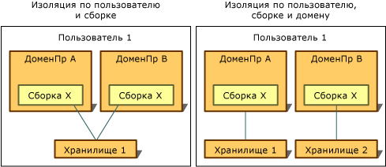

# Типы изоляцииTypes of Isolation
Доступ к изолированному хранилищу всегда предоставляется только пользователю, который его создал.Access to isolated storage is always restricted to the user who created it. Чтобы поддерживать изоляцию такого типа, общеязыковая среда выполнения использует тот же подход к идентификации пользователя, что и операционная система, применяя идентификатор, связанный с процессом, в котором выполнялся код при открытии хранилища.To implement this type of isolation, the common language runtime uses the same notion of user identity that the operating system recognizes, which is the identity associated with the process in which the code is running when the store is opened. Этот идентификатор обозначает аутентифицированного пользователя, но использование функции олицетворения может привести к тому, что идентификатор текущего пользователя изменится в ходе выполнения приложения.This identity is an authenticated user identity, but impersonation can cause the identity of the current user to change dynamically.  
  
 Доступ к изолированному хранилищу также ограничивается идентификатором, связанным с доменом приложения и сборкой, или только со сборкой.Access to isolated storage is also restricted according to the identity associated with the application's domain and assembly, or with the assembly alone. Среда выполнения получает идентификаторы следующими способами:The runtime obtains these identities in the following ways:  
  
-   Идентификатор домена является свидетельством приложения. Например, для веб-приложения это может быть полный URL-адрес.Domain identity represents the evidence of the application, which in the case of a web application might be the full URL. Для кода, запускаемого в оболочке, в качестве идентификатора домена может использовать путь к каталогу приложения.For shell-hosted code, the domain identity might be based on the application directory path. Например, если исполняемый файл размещается по пути C:\Office\MyApp.exe, для него будет установлен идентификатор домена "C:\Office\MyApp.exe".For example, if the executable runs from the path C:\Office\MyApp.exe, the domain identity would be C:\Office\MyApp.exe.  
  
-   Удостоверение сборки является свидетельством сборки.Assembly identity is the evidence of the assembly. Оно может извлекаться из криптографической цифровой подписи, роль которой может выполнять [строгое имя](../../../docs/framework/app-domains/strong-named-assemblies.md) сборки, обозначение издателя программного обеспечения или идентификатор URL-адреса.This might come from a cryptographic digital signature, which can be the assembly's [strong name](../../../docs/framework/app-domains/strong-named-assemblies.md), the software publisher of the assembly, or its URL identity. Если сборка имеет и строгое имя, и идентификатор издателя программного обеспечения, то используется идентификатор издателя программного обеспечения.If an assembly has both a strong name and a software publisher identity, then the software publisher identity is used. Если сборка получена из Интернета и не имеет подписи, используется идентификатор URL-адреса.If the assembly comes from the Internet and is unsigned, the URL identity is used. Дополнительные сведения о сборках и строгих именах вы найдете в статье [Программирование с использованием сборок](../../../docs/framework/app-domains/programming-with-assemblies.md).For more information about assemblies and strong names, see [Programming with Assemblies](../../../docs/framework/app-domains/programming-with-assemblies.md).  
  
-   Перемещаемые хранилища перемещаются с пользователем, который имеет перемещаемый профиль пользователя.Roaming stores move with a user that has a roaming user profile. Файлы записываются в сетевую папку и скачиваются на каждый компьютер, с которого этот пользователь выполняет вход.Files are written to a network directory and are downloaded to any computer the user logs into. Дополнительные сведения о перемещаемых профилях пользователей см. в статье <xref:System.IO.IsolatedStorage.IsolatedStorageScope.Roaming?displayProperty=nameWithType>.For more information about roaming user profiles, see <xref:System.IO.IsolatedStorage.IsolatedStorageScope.Roaming?displayProperty=nameWithType>.  
  
 Объединяя концепции идентификаторов пользователя, домена и сборки, изолированное хранилище может изолировать данные несколькими разными способами, для каждого из которых есть применимые сценарии использования:By combining the concepts of user, domain, and assembly identity, isolated storage can isolate data in the following ways, each of which has its own usage scenarios:  
  
-   [изоляция по пользователям и сборкам](#UserAssembly);[Isolation by user and assembly](#UserAssembly)  
  
-   [изоляция по пользователям, доменам и сборкам](#UserDomainAssembly).[Isolation by user, domain, and assembly](#UserDomainAssembly)  
  
 Каждый из этих способов изоляции можно объединить с перемещаемым профилем пользователя.Either of these isolations can be combined with a roaming user profile. Дополнительные сведения см. в разделе об [изолированном хранении и перемещении](#Roaming).For more information, see the section [Isolated Storage and Roaming](#Roaming).  
  
 На следующем изображении показано, как хранилища изолируются в разных областях:The following illustration demonstrates how stores are isolated in different scopes.  
  
   
Типы изолированного хранилищаTypes of isolated storage  
  
 Обратите внимание, что изолированные хранилища, за исключением перемещаемых, всегда неявно изолируются по компьютерам, так как для них применяются локальные средства хранения конкретного компьютера.Note that except for roaming stores, isolated storage is always implicitly isolated by computer because it uses the storage facilities that are local to a given computer.  
  
> [!IMPORTANT]
>  Изолированное хранилище недоступно для приложений Windows [!INCLUDE[win8_appname_long](../../../includes/win8-appname-long-md.md)] .Isolated storage is not available for [!INCLUDE[win8_appname_long](../../../includes/win8-appname-long-md.md)] apps. Вместо этого используйте классы данных приложений в пространствах имен `Windows.Storage` , включенных в API [!INCLUDE[wrt](../../../includes/wrt-md.md)] для хранения локальных данных и файлов.Instead, use the application data classes in the `Windows.Storage` namespaces included in the [!INCLUDE[wrt](../../../includes/wrt-md.md)] API to store local data and files. Дополнительные сведения см. в статье [Данные приложения](https://docs.microsoft.com/previous-versions/windows/apps/hh464917(v=win.10)) в Центре разработки для Windows.For more information, see [Application data](https://docs.microsoft.com/previous-versions/windows/apps/hh464917(v=win.10)) in the Windows Dev Center.  
  
   
## Изоляция по пользователям и сборкамIsolation by User and Assembly  
 Изоляция по пользователям и сборкам подходит в тех случаях, когда использующая это хранилище сборка должна быть доступна из любого домена приложения.When the assembly that uses the data store needs to be accessible from any application's domain, isolation by user and assembly is appropriate. Обычно таким образом изолированное хранилище используется для хранения данных, применяющихся в несколькими приложениях и не привязанных к любому из них, например имен пользователей и (или) сведений о лицензиях.Typically, in this situation, isolated storage is used to store data that applies across multiple applications and is not tied to any particular application, such as the user's name or license information. Для доступа к хранилищу, изолированному по пользователю и сборке, код должен иметь доверие на передачу данных между приложениями.To access storage isolated by user and assembly, code must be trusted to transfer information between applications. Как правило, изоляция по пользователям и сборкам допускается только в интрасетях, но не в Интернете.Typically, isolation by user and assembly is allowed on intranets but not on the Internet. Чтобы получить хранилище с этим типом изоляции, вызовите статический метод <xref:System.IO.IsolatedStorage.IsolatedStorageFile.GetStore%2A?displayProperty=nameWithType> и передайте в него <xref:System.IO.IsolatedStorage.IsolatedStorageScope> с указанием пользователя и сборки.Calling the static <xref:System.IO.IsolatedStorage.IsolatedStorageFile.GetStore%2A?displayProperty=nameWithType> method and passing in a user and an assembly <xref:System.IO.IsolatedStorage.IsolatedStorageScope> returns storage with this kind of isolation.  
  
 Приведенный ниже код возвращает хранилище, изолированное по пользователю, сборке и домену.The following code example retrieves a store that is isolated by user and assembly. Доступ к этому хранилищу может осуществляться через объект `isoFile`.The store can be accessed through the `isoFile` object.  
  
 [!code-cpp[Conceptual.IsolatedStorage#17](../../../samples/snippets/cpp/VS_Snippets_CLR/conceptual.isolatedstorage/cpp/source11.cpp#17)]
 [!code-csharp[Conceptual.IsolatedStorage#17](../../../samples/snippets/csharp/VS_Snippets_CLR/conceptual.isolatedstorage/cs/source11.cs#17)]
 [!code-vb[Conceptual.IsolatedStorage#17](../../../samples/snippets/visualbasic/VS_Snippets_CLR/conceptual.isolatedstorage/vb/source11.vb#17)]  
  
 Пример использования параметров свидетельства см. в разделе <xref:System.IO.IsolatedStorage.IsolatedStorageFile.GetStore%28System.IO.IsolatedStorage.IsolatedStorageScope%2CSystem.Security.Policy.Evidence%2CSystem.Type%2CSystem.Security.Policy.Evidence%2CSystem.Type%29>.For an example that uses the evidence parameters, see <xref:System.IO.IsolatedStorage.IsolatedStorageFile.GetStore%28System.IO.IsolatedStorage.IsolatedStorageScope%2CSystem.Security.Policy.Evidence%2CSystem.Type%2CSystem.Security.Policy.Evidence%2CSystem.Type%29>.  
  
 Можно также использовать метод <xref:System.IO.IsolatedStorage.IsolatedStorageFile.GetUserStoreForAssembly%2A>, как показано в следующем примере кода.The <xref:System.IO.IsolatedStorage.IsolatedStorageFile.GetUserStoreForAssembly%2A> method is available as a shortcut, as shown in the following code example. Этот упрощенный вариант не позволяет открывать хранилища с поддержкой перемещения. В таких случаях используется <xref:System.IO.IsolatedStorage.IsolatedStorageFile.GetStore%2A>.This shortcut cannot be used to open stores that are capable of roaming; use <xref:System.IO.IsolatedStorage.IsolatedStorageFile.GetStore%2A> in such cases.  
  
 [!code-cpp[Conceptual.IsolatedStorage#18](../../../samples/snippets/cpp/VS_Snippets_CLR/conceptual.isolatedstorage/cpp/source11.cpp#18)]
 [!code-csharp[Conceptual.IsolatedStorage#18](../../../samples/snippets/csharp/VS_Snippets_CLR/conceptual.isolatedstorage/cs/source11.cs#18)]
 [!code-vb[Conceptual.IsolatedStorage#18](../../../samples/snippets/visualbasic/VS_Snippets_CLR/conceptual.isolatedstorage/vb/source11.vb#18)]  
  
   
## Изоляция по пользователям, доменам и сборкамIsolation by User, Domain, and Assembly  
 Если приложение использует сборку стороннего поставщика, для которой нужно закрытое хранилище данных, вы можете применить изолированное хранилище.If your application uses a third-party assembly that requires a private data store, you can use isolated storage to store the private data. Изоляция по пользователям, доменам и сборкам гарантирует, что доступ к данным получит только код из определенной сборки и только в том случае, если эту сборку использует приложение, запущенное в момент создания хранилища. Это приложение должно работать от имени пользователя, для которого было создано хранилище.Isolation by user, domain, and assembly ensures that only code in a given assembly can access the data, and only when the assembly is used by the application that was running when the assembly created the store, and only when the user for whom the store was created runs the application. Изоляция по пользователям, доменам и сборкам не позволяет сторонним сборкам влиять на данные других приложений.Isolation by user, domain, and assembly keeps the third-party assembly from leaking data to other applications. По умолчанию следует использовать именно этот тип изоляции, если вы намерены использовать изолированное хранилище, но не уверены в выборе его типа.This isolation type should be your default choice if you know that you want to use isolated storage but are not sure which type of isolation to use. Чтобы получить хранилище с этим типом изоляции, вызовите статический метод <xref:System.IO.IsolatedStorage.IsolatedStorageFile.GetStore%2A> из <xref:System.IO.IsolatedStorage.IsolatedStorageFile> и передайте в него <xref:System.IO.IsolatedStorage.IsolatedStorageScope> с указанием пользователя, домена и сборки.Calling the static <xref:System.IO.IsolatedStorage.IsolatedStorageFile.GetStore%2A> method of <xref:System.IO.IsolatedStorage.IsolatedStorageFile> and passing in a user, domain, and assembly <xref:System.IO.IsolatedStorage.IsolatedStorageScope> returns storage with this kind of isolation.  
  
 После выполнения приведенного ниже кода возвращается хранилище, изолированное по пользователю, домену и сборке.The following code example retrieves a store isolated by user, domain, and assembly. Доступ к этому хранилищу может осуществляться через объект `isoFile`.The store can be accessed through the `isoFile` object.  
  
 [!code-cpp[Conceptual.IsolatedStorage#14](../../../samples/snippets/cpp/VS_Snippets_CLR/conceptual.isolatedstorage/cpp/source10.cpp#14)]
 [!code-csharp[Conceptual.IsolatedStorage#14](../../../samples/snippets/csharp/VS_Snippets_CLR/conceptual.isolatedstorage/cs/source10.cs#14)]
 [!code-vb[Conceptual.IsolatedStorage#14](../../../samples/snippets/visualbasic/VS_Snippets_CLR/conceptual.isolatedstorage/vb/source10.vb#14)]  
  
 Можно использовать другой метод, как показано в приведенном ниже примере кода.Another method is available as a shortcut, as shown in the following code example. Этот упрощенный вариант не позволяет открывать хранилища с поддержкой перемещения. В таких случаях используется <xref:System.IO.IsolatedStorage.IsolatedStorageFile.GetStore%2A>.This shortcut cannot be used to open stores that are capable of roaming; use <xref:System.IO.IsolatedStorage.IsolatedStorageFile.GetStore%2A> in such cases.  
  
 [!code-cpp[Conceptual.IsolatedStorage#15](../../../samples/snippets/cpp/VS_Snippets_CLR/conceptual.isolatedstorage/cpp/source10.cpp#15)]
 [!code-csharp[Conceptual.IsolatedStorage#15](../../../samples/snippets/csharp/VS_Snippets_CLR/conceptual.isolatedstorage/cs/source10.cs#15)]
 [!code-vb[Conceptual.IsolatedStorage#15](../../../samples/snippets/visualbasic/VS_Snippets_CLR/conceptual.isolatedstorage/vb/source10.vb#15)]  
  
   
## Изолированное хранилище и роумингIsolated Storage and Roaming  
 Перемещаемые профили пользователя — это функция Windows, которая позволяет пользователю настроить и использовать сетевой идентификатор, чтобы при входе на любой сетевой компьютер применялись одинаковые персональные настройки.Roaming user profiles are a Windows feature that enables a user to set up an identity on a network and use that identity to log into any network computer, carrying over all personalized settings. Сборка, которая использует изолированное хранилище, может потребовать переноса изолированного хранилища вместе с перемещаемым профилем пользователя.An assembly that uses isolated storage can specify that the user's isolated storage should move with the roaming user profile. Роуминг можно использовать в сочетании с изоляцией по пользователям и сборкам или с изоляцией по пользователям, доменам и сборкам.Roaming can be used in conjunction with isolation by user and assembly or with isolation by user, domain, and assembly. Если функция перемещения не используется, хранилище будет сохраняться только локально даже для пользователей с перемещаемым профилем.If a roaming scope is not used, stores will not roam even if a roaming user profile is used.  
  
 После выполнения приведенного ниже кода возвращается перемещаемое хранилище, изолированное по пользователю и сборке.The following code example retrieves a roaming store isolated by user and assembly. Доступ к этому хранилищу можно осуществлять через объект `isoFile`.The store can be accessed through the `isoFile` object.  
  
 [!code-cpp[Conceptual.IsolatedStorage#11](../../../samples/snippets/cpp/VS_Snippets_CLR/conceptual.isolatedstorage/cpp/source9.cpp#11)]
 [!code-csharp[Conceptual.IsolatedStorage#11](../../../samples/snippets/csharp/VS_Snippets_CLR/conceptual.isolatedstorage/cs/source9.cs#11)]
 [!code-vb[Conceptual.IsolatedStorage#11](../../../samples/snippets/visualbasic/VS_Snippets_CLR/conceptual.isolatedstorage/vb/source9.vb#11)]  
  
 Добавив к нему область домена, вы получите перемещаемое хранилище, изолированное по пользователю, домену и приложению.A domain scope can be added to create a roaming store isolated by user, domain, and application. Это действие представлено в следующем примере кода:The following code example demonstrates this.  
  
 [!code-cpp[Conceptual.IsolatedStorage#12](../../../samples/snippets/cpp/VS_Snippets_CLR/conceptual.isolatedstorage/cpp/source9.cpp#12)]
 [!code-csharp[Conceptual.IsolatedStorage#12](../../../samples/snippets/csharp/VS_Snippets_CLR/conceptual.isolatedstorage/cs/source9.cs#12)]
 [!code-vb[Conceptual.IsolatedStorage#12](../../../samples/snippets/visualbasic/VS_Snippets_CLR/conceptual.isolatedstorage/vb/source9.vb#12)]  
  
## См. такжеSee Also  
 <xref:System.IO.IsolatedStorage.IsolatedStorageScope>  
 [Изолированное хранилищеIsolated Storage](../../../docs/standard/io/isolated-storage.md)
