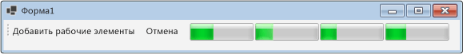

# Практическое руководство. Отмена блока потока данныхHow to: Cancel a Dataflow Block
В этом документе показано, как включить отмену в приложении.This document demonstrates how to enable cancellation in your application. В этом примере используется Windows Forms для отображения позиции активности рабочих элементов в конвейере потока данных, а также последствий отмены.This example uses Windows Forms to show where work items are active in a dataflow pipeline and also the effects of cancellation.  

[!INCLUDE [tpl-install-instructions](../../../includes/tpl-install-instructions.md)]
  
## Создание приложения Windows FormsTo Create the Windows Forms Application  
  
1. Создайте проект **Приложение Windows Forms** на C# или Visual Basic.Create a C# or Visual Basic **Windows Forms Application** project. На следующих этапах проекту дается название `CancellationWinForms`.In the following steps, the project is named `CancellationWinForms`.  
  
2. В конструкторе форм главной формы Form1.cs (Form1.vb для Visual Basic) добавьте элемент управления <xref:System.Windows.Forms.ToolStrip>.On the form designer for the main form, Form1.cs (Form1.vb for Visual Basic), add a <xref:System.Windows.Forms.ToolStrip> control.  
  
3. Добавьте элемент управления <xref:System.Windows.Forms.ToolStripButton> к элементу управления <xref:System.Windows.Forms.ToolStrip>.Add a <xref:System.Windows.Forms.ToolStripButton> control to the <xref:System.Windows.Forms.ToolStrip> control. Задайте свойству <xref:System.Windows.Forms.ToolStripItem.DisplayStyle%2A> значение <xref:System.Windows.Forms.ToolStripItemDisplayStyle.Text>, а свойству <xref:System.Windows.Forms.ToolStripItem.Text%2A> — **Добавить рабочие элементы**.Set the <xref:System.Windows.Forms.ToolStripItem.DisplayStyle%2A> property to <xref:System.Windows.Forms.ToolStripItemDisplayStyle.Text> and the <xref:System.Windows.Forms.ToolStripItem.Text%2A> property to **Add Work Items**.  
  
4. Добавьте второй элемент управления <xref:System.Windows.Forms.ToolStripButton> к элементу управления <xref:System.Windows.Forms.ToolStrip>.Add a second <xref:System.Windows.Forms.ToolStripButton> control to the <xref:System.Windows.Forms.ToolStrip> control. Задайте свойству <xref:System.Windows.Forms.ToolStripItem.DisplayStyle%2A>значение <xref:System.Windows.Forms.ToolStripItemDisplayStyle.Text>, свойству <xref:System.Windows.Forms.ToolStripItem.Text%2A> значение **Отмена**, а свойству <xref:System.Windows.Forms.ToolStripItem.Enabled%2A> — значение `False`.Set the <xref:System.Windows.Forms.ToolStripItem.DisplayStyle%2A> property to <xref:System.Windows.Forms.ToolStripItemDisplayStyle.Text>, the <xref:System.Windows.Forms.ToolStripItem.Text%2A> property to **Cancel**, and the <xref:System.Windows.Forms.ToolStripItem.Enabled%2A> property to `False`.  
  
5. Добавьте четыре объекта <xref:System.Windows.Forms.ToolStripProgressBar> в элемент управления <xref:System.Windows.Forms.ToolStrip>.Add four <xref:System.Windows.Forms.ToolStripProgressBar> objects to the <xref:System.Windows.Forms.ToolStrip> control.  
  
## Создание конвейера потока данныхCreating the Dataflow Pipeline  
 В этом разделе описано, как создать конвейер потока данных, который обрабатывает рабочие элементы и обновляет индикаторы выполнения.This section describes how to create the dataflow pipeline that processes work items and updates the progress bars.  
  
### Создание конвейера потока данныхTo Create the Dataflow Pipeline  
  
1. В проекте добавьте ссылку на System.Threading.Tasks.Dataflow.dll.In your project, add a reference to System.Threading.Tasks.Dataflow.dll.  
  
2. Убедитесь, что Form1.cs (Form1.vb для Visual Basic) содержит следующие операторы `using` (`Imports` в Visual Basic).Ensure that Form1.cs (Form1.vb for Visual Basic) contains the following `using` statements (`Imports` in Visual Basic).  
  
     [!code-csharp[TPLDataflow_CancellationWinForms#1](../../../samples/snippets/csharp/VS_Snippets_Misc/tpldataflow_cancellationwinforms/cs/cancellationwinforms/form1.cs#1)]
     [!code-vb[TPLDataflow_CancellationWinForms#1](../../../samples/snippets/visualbasic/VS_Snippets_Misc/tpldataflow_cancellationwinforms/vb/cancellationwinforms/form1.vb#1)]  
  
3. Добавьте класс `WorkItem` как внутренний тип класса `Form1`.Add the `WorkItem` class as an inner type of the `Form1` class.  
  
     [!code-csharp[TPLDataflow_CancellationWinForms#2](../../../samples/snippets/csharp/VS_Snippets_Misc/tpldataflow_cancellationwinforms/cs/cancellationwinforms/form1.cs#2)]
     [!code-vb[TPLDataflow_CancellationWinForms#2](../../../samples/snippets/visualbasic/VS_Snippets_Misc/tpldataflow_cancellationwinforms/vb/cancellationwinforms/form1.vb#2)]  
  
4. Добавьте в класс `Form1` следующие данные-члены.Add the following data members to the `Form1` class.  
  
     [!code-csharp[TPLDataflow_CancellationWinForms#3](../../../samples/snippets/csharp/VS_Snippets_Misc/tpldataflow_cancellationwinforms/cs/cancellationwinforms/form1.cs#3)]
     [!code-vb[TPLDataflow_CancellationWinForms#3](../../../samples/snippets/visualbasic/VS_Snippets_Misc/tpldataflow_cancellationwinforms/vb/cancellationwinforms/form1.vb#3)]  
  
5. Добавьте в класс `CreatePipeline` метод `Form1`.Add the following method, `CreatePipeline`, to the `Form1` class.  
  
     [!code-csharp[TPLDataflow_CancellationWinForms#4](../../../samples/snippets/csharp/VS_Snippets_Misc/tpldataflow_cancellationwinforms/cs/cancellationwinforms/form1.cs#4)]
     [!code-vb[TPLDataflow_CancellationWinForms#4](../../../samples/snippets/visualbasic/VS_Snippets_Misc/tpldataflow_cancellationwinforms/vb/cancellationwinforms/form1.vb#4)]  
  
 Поскольку блоки потоков данных `incrementProgress` и `decrementProgress` работают с интерфейсом пользователя, важно, чтобы эти действия происходили в потоке пользовательского интерфейса.Because the `incrementProgress` and `decrementProgress` dataflow blocks act on the user interface, it is important that these actions occur on the user-interface thread. Для этого в процессе создания каждый из этих объектов предоставляет объект <xref:System.Threading.Tasks.Dataflow.ExecutionDataflowBlockOptions>, в котором свойству <xref:System.Threading.Tasks.Dataflow.DataflowBlockOptions.TaskScheduler%2A> задано значение <xref:System.Threading.Tasks.TaskScheduler.FromCurrentSynchronizationContext%2A?displayProperty=nameWithType>.To accomplish this, during construction these objects each provide a <xref:System.Threading.Tasks.Dataflow.ExecutionDataflowBlockOptions> object that has the <xref:System.Threading.Tasks.Dataflow.DataflowBlockOptions.TaskScheduler%2A> property set to <xref:System.Threading.Tasks.TaskScheduler.FromCurrentSynchronizationContext%2A?displayProperty=nameWithType>. Метод <xref:System.Threading.Tasks.TaskScheduler.FromCurrentSynchronizationContext%2A?displayProperty=nameWithType> создает объект <xref:System.Threading.Tasks.TaskScheduler>, выполняющий работу в текущем контексте синхронизации.The <xref:System.Threading.Tasks.TaskScheduler.FromCurrentSynchronizationContext%2A?displayProperty=nameWithType> method creates a <xref:System.Threading.Tasks.TaskScheduler> object that performs work on the current synchronization context. Поскольку конструктор `Form1` вызывается из потока пользовательского интерфейса, действия для блоков потоков данных `incrementProgress` и `decrementProgress` также выполняются в потоке пользовательского интерфейса.Because the `Form1` constructor is called from the user-interface thread, the actions for the `incrementProgress` and `decrementProgress` dataflow blocks also run on the user-interface thread.  
  
 В этом примере задается свойство <xref:System.Threading.Tasks.Dataflow.DataflowBlockOptions.CancellationToken%2A> при создании частей конвейера.This example sets the <xref:System.Threading.Tasks.Dataflow.DataflowBlockOptions.CancellationToken%2A> property when it constructs the members of the pipeline. Поскольку свойство <xref:System.Threading.Tasks.Dataflow.DataflowBlockOptions.CancellationToken%2A> полностью отменяет выполнение блока потока данных, весь конвейер должен быть заново создан после того, как пользователь отменит операцию и затем захочет добавить нескольких рабочих элементов в конвейер.Because the <xref:System.Threading.Tasks.Dataflow.DataflowBlockOptions.CancellationToken%2A> property permanently cancels dataflow block execution, the whole pipeline must be recreated after the user cancels the operation and then wants to add more work items to the pipeline. Пример, демонстрирующий альтернативный способ отмены блока потока данных, чтобы другие работы могли выполняться после отмены операции, см. в разделе [Пошаговое руководство. Использование потока данных в приложении Windows Forms](../../../docs/standard/parallel-programming/walkthrough-using-dataflow-in-a-windows-forms-application.md).For an example that demonstrates an alternative way to cancel a dataflow block so that other work can be performed after an operation is canceled, see [Walkthrough: Using Dataflow in a Windows Forms Application](../../../docs/standard/parallel-programming/walkthrough-using-dataflow-in-a-windows-forms-application.md).  
  
## Подключение конвейера потока данных к пользовательскому интерфейсуConnecting the Dataflow Pipeline to the User Interface  
 В этом разделе описывается, как подключить конвейер потока данных к интерфейсу пользователя.This section describes how to connect the dataflow pipeline to the user interface. Как созданием конвейера, так и добавлением рабочих элементов в конвейере управляет обработчик событий для кнопки **Добавление рабочих элементов**.Both creating the pipeline and adding work items to the pipeline are controlled by the event handler for the **Add Work Items** button. Отмена инициируется кнопкой **Отмена**.Cancellation is initiated by the **Cancel** button. Когда пользователь нажимает какую-либо из этих кнопок, соответствующее действие выполняется асинхронным образом.When the user clicks either of these buttons, the appropriate action is initiated in an asynchronous manner.  
  
### Подключение конвейера потока данных к пользовательскому интерфейсуTo Connect the Dataflow Pipeline to the User Interface  
  
1. В конструкторе форм главной формы создайте обработчик событий для события <xref:System.Windows.Forms.ToolStripItem.Click> кнопки **Добавить рабочие элементы**.On the form designer for the main form, create an event handler for the <xref:System.Windows.Forms.ToolStripItem.Click> event for the **Add Work Items** button.  
  
2. Реализуйте событие <xref:System.Windows.Forms.ToolStripItem.Click> для кнопки **Добавить рабочие элементы**.Implement the <xref:System.Windows.Forms.ToolStripItem.Click> event for the **Add Work Items** button.  
  
     [!code-csharp[TPLDataflow_CancellationWinForms#5](../../../samples/snippets/csharp/VS_Snippets_Misc/tpldataflow_cancellationwinforms/cs/cancellationwinforms/form1.cs#5)]
     [!code-vb[TPLDataflow_CancellationWinForms#5](../../../samples/snippets/visualbasic/VS_Snippets_Misc/tpldataflow_cancellationwinforms/vb/cancellationwinforms/form1.vb#5)]  
  
3. В конструкторе форм главной формы создайте обработчик событий для события <xref:System.Windows.Forms.ToolStripItem.Click> кнопки **Отмена**.On the form designer for the main form, create an event handler for the <xref:System.Windows.Forms.ToolStripItem.Click> event handler for the **Cancel** button.  
  
4. Реализуйте обработчик события <xref:System.Windows.Forms.ToolStripItem.Click> для кнопки **Отмена**.Implement the <xref:System.Windows.Forms.ToolStripItem.Click> event handler for the **Cancel** button.  
  
     [!code-csharp[TPLDataflow_CancellationWinForms#6](../../../samples/snippets/csharp/VS_Snippets_Misc/tpldataflow_cancellationwinforms/cs/cancellationwinforms/form1.cs#6)]
     [!code-vb[TPLDataflow_CancellationWinForms#6](../../../samples/snippets/visualbasic/VS_Snippets_Misc/tpldataflow_cancellationwinforms/vb/cancellationwinforms/form1.vb#6)]  
  
## ПримерExample  
 В следующем примере приведен полный код Form1.cs (Form1.vb для Visual Basic).The following example shows the complete code for Form1.cs (Form1.vb for Visual Basic).  
  
 [!code-csharp[TPLDataflow_CancellationWinForms#100](../../../samples/snippets/csharp/VS_Snippets_Misc/tpldataflow_cancellationwinforms/cs/cancellationwinforms/form1.cs#100)]
 [!code-vb[TPLDataflow_CancellationWinForms#100](../../../samples/snippets/visualbasic/VS_Snippets_Misc/tpldataflow_cancellationwinforms/vb/cancellationwinforms/form1.vb#100)]  
  
 Ниже показано запущенное приложение.The following illustration shows the running application.  
  
   

## См. также разделSee also

- [Поток данныхDataflow](../../../docs/standard/parallel-programming/dataflow-task-parallel-library.md)
