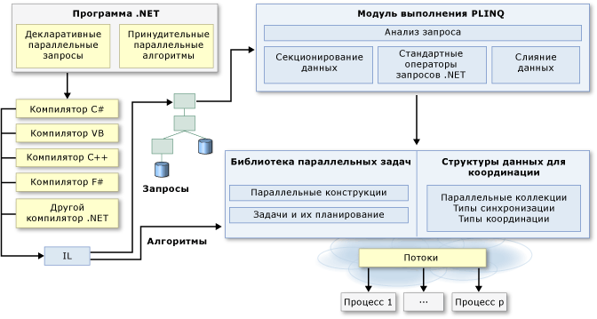

# Параллельное программирование в .NET

Многие персональные компьютеры и рабочие станции имеют несколько ядер ЦП, которые позволяют одновременно выполнять несколько потоков. Чтобы воспользоваться преимуществами оборудования, можно параллелизовать код для распределения работы между несколькими процессорами.

В прошлом распараллеливание требовало управления потоками и взаимоблокировками на низком уровне. Visual Studio и .NET Framework обеспечивают расширенную поддержку параллельного программирования, предоставляя среду выполнения, типы библиотек классов и средства диагностики. Эти возможности, которые впервые появились в .NET Framework 4, упрощают параллельную разработку. Это позволяет разработчикам писать эффективный, детализированный и масштабируемый параллельный код с помощью естественных выразительных средств без необходимости непосредственной работы с потоками или пулом потоков.

На рисунке ниже представлен общий обзор архитектуры параллельного программирования на платформе .NET Framework.

## См. также

|Технология|Описание:|
|----------------|-----------------|
|[Библиотека параллельных задач (TPL)](../../../docs/standard/parallel-programming/task-parallel-library-tpl.md)|Предоставляет документацию для класса <xref:System.Threading.Tasks.Parallel?displayProperty=nameWithType>, который содержит параллельные версии цикла `For`, цикла `ForEach`; а также для класса <xref:System.Threading.Tasks.Task?displayProperty=nameWithType>, который предоставляет предпочитаемый способ для выражения асинхронных операций.|
|[Parallel LINQ (PLINQ)](../../../docs/standard/parallel-programming/parallel-linq-plinq.md)|Параллельная реализация LINQ to Objects, которая значительно улучшает производительность во множестве сценариев.|
|[Структуры данных для параллельного программирования](../../../docs/standard/parallel-programming/data-structures-for-parallel-programming.md)|Предоставляет ссылки на документацию для потокобезопасные классы коллекций, упрощенные типы синхронизации, типы для "ленивой" инициализации.|
|[Средства диагностики параллельного выполнения](../../../docs/standard/parallel-programming/parallel-diagnostic-tools.md)|Предоставляет ссылки на документацию для окон отладчика Visual Studio для задач и параллельных стеков, а также для [Визуализатора параллелизма](/visualstudio/profiling/concurrency-visualizer).|
|[Пользовательские разделители для PLINQ и TPL](../../../docs/standard/parallel-programming/custom-partitioners-for-plinq-and-tpl.md)|Описывает работу модулей разделения, порядок настройки модулей разделения по умолчанию, порядок создания нового модуля разделения.|
|[Планировщики задач](xref:System.Threading.Tasks.TaskScheduler)|Описывает порядок работы модуля планирования и порядок их настройки.|
|[Лямбда-выражения в PLINQ и TPL](../../../docs/standard/parallel-programming/lambda-expressions-in-plinq-and-tpl.md)|Предоставляет краткие общие сведения по лямбда выражениям в C# и Visual Basic, показывает, как они используются в PLINQ и в библиотеке параллельных задач.|
|[Дополнительные сведения](../../../docs/standard/parallel-programming/for-further-reading-parallel-programming.md)|Предоставляет ссылки на дополнительные сведения и примеры ресурсов для параллельного программирования с помощью .NET.|

## См. также раздел

- [Обзор асинхронной модели](../async.md)
- [Управляемая поточность](../threading/index.md)
