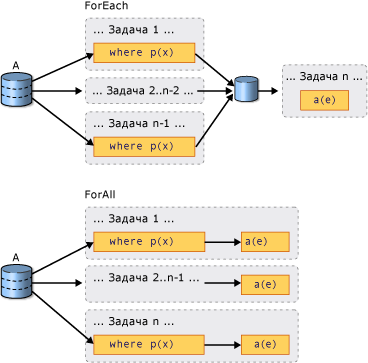

# Введение в PLINQIntroduction to PLINQ

## Что такое параллельный запрос?What is a Parallel Query?

Встроенный язык запросов (LINQ) был впервые представлен в .NET Framework 3.5.Language-Integrated Query (LINQ) was introduced in the .NET Framework 3.5. Он поддерживает унифицированную модель для запросов к любому источнику данных <xref:System.Collections.IEnumerable?displayProperty=nameWithType> или <xref:System.Collections.Generic.IEnumerable%601?displayProperty=nameWithType> типобезопасным образом.It features a unified model for querying any <xref:System.Collections.IEnumerable?displayProperty=nameWithType> or <xref:System.Collections.Generic.IEnumerable%601?displayProperty=nameWithType> data source in a type-safe manner. LINQ to Objects — это запросы LINQ, выполняемые с коллекциями в памяти (например, <xref:System.Collections.Generic.List%601>) или массивами.LINQ to Objects is the name for LINQ queries that are run against in-memory collections such as <xref:System.Collections.Generic.List%601> and arrays. В этой статье предполагается, что у вас уже есть общие представления о LINQ.This article assumes that you have a basic understanding of LINQ. Дополнительные сведения см. в разделе [LINQ — C#](../../csharp/programming-guide/concepts/linq/index.md) или [LINQ — Visual Basic](../../visual-basic/programming-guide/concepts/linq/index.md).For more information, see [Language-Integrated Query (LINQ) - C#](../../csharp/programming-guide/concepts/linq/index.md) or [Language-Integrated Query (LINQ) - Visual Basic](../../visual-basic/programming-guide/concepts/linq/index.md).

Parallel LINQ (PLINQ) является параллельной реализацией шаблона LINQ.Parallel LINQ (PLINQ) is a parallel implementation of the LINQ pattern. Запрос PLINQ во многом напоминает непараллельный запрос LINQ to Objects.A PLINQ query in many ways resembles a non-parallel LINQ to Objects query. Запросы PLINQ, как и последовательные запросы [!INCLUDE[vbteclinq](../../../includes/vbteclinq-md.md)], работают с любым источником данных <xref:System.Collections.IEnumerable> или <xref:System.Collections.Generic.IEnumerable%601> в памяти и поддерживают отложенное выполнение, т. е. выполнение только по завершении перечисления запроса.PLINQ queries, just like sequential [!INCLUDE[vbteclinq](../../../includes/vbteclinq-md.md)] queries, operate on any in-memory <xref:System.Collections.IEnumerable> or <xref:System.Collections.Generic.IEnumerable%601> data source, and have deferred execution, which means they do not begin executing until the query is enumerated. Основное различие состоит в том, что PLINQ пытается задействовать сразу все процессоры в системе.The primary difference is that PLINQ attempts to make full use of all the processors on the system. Для этого он разбивает источник данных на сегменты, а затем запрашивается каждый сегмент в отдельном рабочем потоке сразу, используя сразу несколько процессоров.It does this by partitioning the data source into segments, and then executing the query on each segment on separate worker threads in parallel on multiple processors. Во многих случаях параллельное выполнение значительно сокращает время выполнения запроса.In many cases, parallel execution means that the query runs significantly faster.

Благодаря параллельному выполнению PLINQ позволяет существенно повысить производительность некоторых видов запросов по сравнению с устаревшим кодом. Часто для этого достаточно добавить к источнику данных оператор запроса <xref:System.Linq.ParallelEnumerable.AsParallel%2A>.Through parallel execution, PLINQ can achieve significant performance improvements over legacy code for certain kinds of queries, often just by adding the <xref:System.Linq.ParallelEnumerable.AsParallel%2A> query operation to the data source. Тем не менее параллелизм может представлять свои собственные сложности, и не все операции запросов в PLINQ выполняются быстрее.However, parallelism can introduce its own complexities, and not all query operations run faster in PLINQ. Некоторые запросы при применении параллелизма только замедляются.In fact, parallelization actually slows down certain queries. В связи с этим необходимо понимать, как влияют на параллельные запросы такие аспекты, как упорядочение.Therefore, you should understand how issues such as ordering affect parallel queries. Дополнительные сведения см. в разделе [Общее представление об ускорении выполнения в PLINQ](../../../docs/standard/parallel-programming/understanding-speedup-in-plinq.md).For more information, see [Understanding Speedup in PLINQ](../../../docs/standard/parallel-programming/understanding-speedup-in-plinq.md).

> [!NOTE]
> В этой документации для определения делегатов в PLINQ используются лямбда-выражения.This documentation uses lambda expressions to define delegates in PLINQ. Если вы не знакомы с лямбда-выражениями в C# или Visual Basic, см. раздел [Лямбда-выражения в PLINQ и TPL](../../../docs/standard/parallel-programming/lambda-expressions-in-plinq-and-tpl.md).If you are not familiar with lambda expressions in C# or Visual Basic, see [Lambda Expressions in PLINQ and TPL](../../../docs/standard/parallel-programming/lambda-expressions-in-plinq-and-tpl.md).

Далее в этой статье приводится обзор основных классов PLINQ и обсуждаются способы создания запросов PLINQ.The remainder of this article gives an overview of the main PLINQ classes, and discusses how to create PLINQ queries. Каждый раздел содержит ссылки на более подробные сведения и примеры кода.Each section contains links to more detailed information and code examples.

## Класс ParallelEnumerableThe ParallelEnumerable Class

Класс <xref:System.Linq.ParallelEnumerable?displayProperty=nameWithType> предоставляет почти все функциональные возможности PLINQ.The <xref:System.Linq.ParallelEnumerable?displayProperty=nameWithType> class exposes almost all of PLINQ's functionality. Этот класс и остальные типы пространства имен <xref:System.Linq?displayProperty=nameWithType> компилируются в сборку System.Core.dll.It and the rest of the <xref:System.Linq?displayProperty=nameWithType> namespace types are compiled into the System.Core.dll assembly. Проекты C# и Visual Basic по умолчанию в Visual Studio ссылаются на сборку и импортируют пространство имен.The default C# and Visual Basic projects in Visual Studio both reference the assembly and import the namespace.

<xref:System.Linq.ParallelEnumerable> содержит реализации всех стандартных операторов запроса, поддерживаемых LINQ to Objects, но не все из них пытается выполнять параллельно.<xref:System.Linq.ParallelEnumerable> includes implementations of all the standard query operators that LINQ to Objects supports, although it does not attempt to parallelize each one. Если вы не знакомы с [!INCLUDE[vbteclinq](../../../includes/vbteclinq-md.md)], см. разделы [Введение в LINQ (C#)](../../csharp/programming-guide/concepts/linq/index.md) и [Введение в LINQ (Visual Basic)](../../visual-basic/programming-guide/concepts/linq/introduction-to-linq.md).If you are not familiar with [!INCLUDE[vbteclinq](../../../includes/vbteclinq-md.md)], see [Introduction to LINQ (C#)](../../csharp/programming-guide/concepts/linq/index.md) and [Introduction to LINQ (Visual Basic)](../../visual-basic/programming-guide/concepts/linq/introduction-to-linq.md).

Помимо стандартных операторов запроса, класс <xref:System.Linq.ParallelEnumerable> содержит набор методов для реализации функций, характерных для параллельного выполнения.In addition to the standard query operators, the <xref:System.Linq.ParallelEnumerable> class contains a set of methods that enable behaviors specific to parallel execution. Методы, характерные для PLINQ, перечислены в следующей таблице.These PLINQ-specific methods are listed in the following table.

|Класс ParallelEnumerableParallelEnumerable Operator|ОПИСАНИЕDescription|
|---------------------------------|-----------------|
|<xref:System.Linq.ParallelEnumerable.AsParallel%2A>|Точка входа для PLINQ.The entry point for PLINQ. Указывает, что по возможности остальная часть запроса должна быть параллелизована.Specifies that the rest of the query should be parallelized, if it is possible.|
|<xref:System.Linq.ParallelEnumerable.AsSequential%2A>|Указывает, что остальная часть запроса должна выполняться последовательно, как непараллельный запрос LINQ.Specifies that the rest of the query should be run sequentially, as a non-parallel LINQ query.|
|<xref:System.Linq.ParallelEnumerable.AsOrdered%2A>|Указывает, что PLINQ должен сохранить порядок исходной последовательности до конца запроса либо до тех пор, пока порядок не изменится, что может произойти, например, при использовании предложения orderby (Order By в Visual Basic).Specifies that PLINQ should preserve the ordering of the source sequence for the rest of the query, or until the ordering is changed, for example by the use of an orderby (Order By in Visual Basic) clause.|
|<xref:System.Linq.ParallelEnumerable.AsUnordered%2A>|Указывает, что PLINQ для остальной части запроса не обязан сохранять порядок исходной последовательности.Specifies that PLINQ for the rest of the query is not required to preserve the ordering of the source sequence.|
|<xref:System.Linq.ParallelEnumerable.WithCancellation%2A>|Указывает, что PLINQ должен периодически отслеживать состояние предоставленного токена отмены и отменить выполнение, если он будет запрошен.Specifies that PLINQ should periodically monitor the state of the provided cancellation token and cancel execution if it is requested.|
|<xref:System.Linq.ParallelEnumerable.WithDegreeOfParallelism%2A>|Указывает максимальное количество процессоров, которое PLINQ должен использовать для параллелизации запроса.Specifies the maximum number of processors that PLINQ should use to parallelize the query.|
|<xref:System.Linq.ParallelEnumerable.WithMergeOptions%2A>|Предоставляет подсказку о том, каким образом PLINQ должен объединять параллельные результаты в одну последовательность в потоке-потребителе, если это возможно.Provides a hint about how PLINQ should, if it is possible, merge parallel results back into just one sequence on the consuming thread.|
|<xref:System.Linq.ParallelEnumerable.WithExecutionMode%2A>|Указывает, должен ли PLINQ параллелизовать запрос, даже если по умолчанию он должен выполняться последовательно.Specifies whether PLINQ should parallelize the query even when the default behavior would be to run it sequentially.|
|<xref:System.Linq.ParallelEnumerable.ForAll%2A>|Многопоточный метод перечисления в отличие от итерации результатов запроса может обрабатываться параллельно без предварительного объединения с потоком-потребителем.A multithreaded enumeration method that, unlike iterating over the results of the query, enables results to be processed in parallel without first merging back to the consumer thread.|
|Перегрузка <xref:System.Linq.ParallelEnumerable.Aggregate%2A><xref:System.Linq.ParallelEnumerable.Aggregate%2A> overload|Перегрузка, которая является уникальной для PLINQ и обеспечивает промежуточное агрегирование локальных разделов потока, а также функцию окончательного агрегирования, позволяющую объединять результаты всех разделов.An overload that is unique to PLINQ and enables intermediate aggregation over thread-local partitions, plus a final aggregation function to combine the results of all partitions.|

## Модель с явным согласиемThe Opt-in Model

Когда вы создаете запрос, подтвердите согласие на использование PLINQ вызовом метода расширения <xref:System.Linq.ParallelEnumerable.AsParallel%2A?displayProperty=nameWithType> для источника данных, как показано в следующем примере.When you write a query, opt in to PLINQ by invoking the <xref:System.Linq.ParallelEnumerable.AsParallel%2A?displayProperty=nameWithType> extension method on the data source, as shown in the following example.

[!code-csharp[PLINQ#1](../../../samples/snippets/csharp/VS_Snippets_Misc/plinq/cs/plinq2_cs.cs#1)]
[!code-vb[PLINQ#1](../../../samples/snippets/visualbasic/VS_Snippets_Misc/plinq/vb/plinq2_vb.vb#1)]

Метод расширения <xref:System.Linq.ParallelEnumerable.AsParallel%2A> привязывает последующие операторы запросов (в нашем примере это `where` и `select`) к реализациям <xref:System.Linq.ParallelEnumerable?displayProperty=nameWithType>.The <xref:System.Linq.ParallelEnumerable.AsParallel%2A> extension method binds the subsequent query operators, in this case, `where` and `select`, to the <xref:System.Linq.ParallelEnumerable?displayProperty=nameWithType> implementations.

## Режимы выполненияExecution Modes

По умолчанию PLINQ является консервативным.By default, PLINQ is conservative. Во время выполнения инфраструктура PLINQ анализирует общую структуру запроса.At run time, the PLINQ infrastructure analyzes the overall structure of the query. Если параллелизация может ускорить выполнение запроса, PLINQ разбивает исходную последовательность на задачи, которые выполняются одновременно.If the query is likely to yield speedups by parallelization, PLINQ partitions the source sequence into tasks that can be run concurrently. Если параллелизовать запрос небезопасно, PLINQ просто выполняет его последовательно.If it is not safe to parallelize a query, PLINQ just runs the query sequentially. Если PLINQ может выбирать между потенциально затратным параллельным алгоритмом или нетребовательным последовательным алгоритмом, по умолчанию он выбирает алгоритм последовательной обработки.If PLINQ has a choice between a potentially expensive parallel algorithm or an inexpensive sequential algorithm, it chooses the sequential algorithm by default. Метод <xref:System.Linq.ParallelEnumerable.WithExecutionMode%2A> и перечисление <xref:System.Linq.ParallelExecutionMode?displayProperty=nameWithType> позволяют указать, что PLINQ следует выбрать параллельный алгоритм.You can use the <xref:System.Linq.ParallelEnumerable.WithExecutionMode%2A> method and the <xref:System.Linq.ParallelExecutionMode?displayProperty=nameWithType> enumeration to instruct PLINQ to select the parallel algorithm. Это пригодится в том случае, если тестирование и измерение показали, что в параллельном режиме определенный запрос будет выполнять быстрее.This is useful when you know by testing and measurement that a particular query executes faster in parallel. Дополнительные сведения см. в разделе [Практическое руководство. Задание режима выполнения в PLINQ](../../../docs/standard/parallel-programming/how-to-specify-the-execution-mode-in-plinq.md).For more information, see [How to: Specify the Execution Mode in PLINQ](../../../docs/standard/parallel-programming/how-to-specify-the-execution-mode-in-plinq.md).

## Степень параллелизмаDegree of Parallelism

По умолчанию PLINQ использует все процессоры на главном компьютере.By default, PLINQ uses all of the processors on the host computer. Вы можете ограничить число процессоров, используемых PLINQ, с помощью метода <xref:System.Linq.ParallelEnumerable.WithDegreeOfParallelism%2A>.You can instruct PLINQ to use no more than a specified number of processors by using the <xref:System.Linq.ParallelEnumerable.WithDegreeOfParallelism%2A> method. Это пригодится в том случае, если вам нужно, чтобы другие процессы, выполняемые на том же компьютере, получали определенное количество процессорного времени.This is useful when you want to make sure that other processes running on the computer receive a certain amount of CPU time. Следующий фрагмент кода позволяет запросу использовать не более двух процессоров.The following snippet limits the query to utilizing a maximum of two processors.

[!code-csharp[PLINQ#5](../../../samples/snippets/csharp/VS_Snippets_Misc/plinq/cs/plinqsamples.cs#5)]
[!code-vb[PLINQ#5](../../../samples/snippets/visualbasic/VS_Snippets_Misc/plinq/vb/plinq2_vb.vb#5)]

В случаях, когда запрос выполняет значительный объем работы, не связанной с вычислениями, такой как ввод-вывод файлов, степень параллелизма может быть больше количества ядер на соответствующем компьютере.In cases where a query is performing a significant amount of non-compute-bound work such as File I/O, it might be beneficial to specify a degree of parallelism greater than the number of cores on the machine.

## Упорядоченные и неупорядоченные параллельные запросыOrdered Versus Unordered Parallel Queries

В некоторых случаях оператор запроса должен выдавать результаты с сохранением порядка исходной последовательности.In some queries, a query operator must produce results that preserve the ordering of the source sequence. Для этого PLINQ предоставляет оператор <xref:System.Linq.ParallelEnumerable.AsOrdered%2A>.PLINQ provides the <xref:System.Linq.ParallelEnumerable.AsOrdered%2A> operator for this purpose. <xref:System.Linq.ParallelEnumerable.AsOrdered%2A> отличается от <xref:System.Linq.ParallelEnumerable.AsSequential%2A>.<xref:System.Linq.ParallelEnumerable.AsOrdered%2A> is distinct from <xref:System.Linq.ParallelEnumerable.AsSequential%2A>. Последовательность <xref:System.Linq.ParallelEnumerable.AsOrdered%2A> по-прежнему обрабатывается параллельно, но ее результаты помещаются в буфер и сортируются.An <xref:System.Linq.ParallelEnumerable.AsOrdered%2A> sequence is still processed in parallel, but its results are buffered and sorted. Поскольку сохранение порядка обычно требует дополнительной работы, последовательность <xref:System.Linq.ParallelEnumerable.AsOrdered%2A> может обрабатываться медленнее, чем стандартная последовательность <xref:System.Linq.ParallelEnumerable.AsUnordered%2A>.Because order preservation typically involves extra work, an <xref:System.Linq.ParallelEnumerable.AsOrdered%2A> sequence might be processed more slowly than the default <xref:System.Linq.ParallelEnumerable.AsUnordered%2A> sequence. Будет ли та или иная упорядоченная параллельная операция выполняться быстрее, чем ее последовательная версия, зависит от многих факторов.Whether a particular ordered parallel operation is faster than a sequential version of the operation depends on many factors.

В следующем примере кода показано, как разрешить сохранение порядка.The following code example shows how to opt in to order preservation.

[!code-csharp[PLINQ#3](../../../samples/snippets/csharp/VS_Snippets_Misc/plinq/cs/plinq2_cs.cs#3)]
[!code-vb[PLINQ#3](../../../samples/snippets/visualbasic/VS_Snippets_Misc/plinq/vb/plinq2_vb.vb#3)]

Дополнительные сведения см. в разделе [Сохранение порядка в PLINQ](../../../docs/standard/parallel-programming/order-preservation-in-plinq.md).For more information, see [Order Preservation in PLINQ](../../../docs/standard/parallel-programming/order-preservation-in-plinq.md).

## Сравнение параллельных и последовательных запросовParallel vs. Sequential Queries

Некоторые операции требуют, чтобы исходные данные доставлялись последовательно.Some operations require that the source data be delivered in a sequential manner. При необходимости операторы запроса <xref:System.Linq.ParallelEnumerable> автоматически переходят в последовательный режим.The <xref:System.Linq.ParallelEnumerable> query operators revert to sequential mode automatically when it is required. Для пользовательских операторов запроса и делегатов, которые требуют последовательного выполнения, PLINQ предоставляет метод <xref:System.Linq.ParallelEnumerable.AsSequential%2A>.For user-defined query operators and user delegates that require sequential execution, PLINQ provides the <xref:System.Linq.ParallelEnumerable.AsSequential%2A> method. При использовании метода <xref:System.Linq.ParallelEnumerable.AsSequential%2A> все операторы, содержащиеся в запросе, будут выполняться последовательно вплоть до следующего вызова <xref:System.Linq.ParallelEnumerable.AsParallel%2A>.When you use <xref:System.Linq.ParallelEnumerable.AsSequential%2A>, all subsequent operators in the query are executed sequentially until <xref:System.Linq.ParallelEnumerable.AsParallel%2A> is called again. Дополнительные сведения см. в разделе [Практическое руководство. Объединение параллельных и последовательных запросов LINQ](../../../docs/standard/parallel-programming/how-to-combine-parallel-and-sequential-linq-queries.md).For more information, see [How to: Combine Parallel and Sequential LINQ Queries](../../../docs/standard/parallel-programming/how-to-combine-parallel-and-sequential-linq-queries.md).

## Параметры для слияния результатов запросаOptions for Merging Query Results

При параллельном выполнении запроса PLINQ его результаты из каждого рабочего потока должны быть снова объединены с основным потоком для использования циклом `foreach` (`For Each` в Visual Basic) либо вставки в список или массив.When a PLINQ query executes in parallel, its results from each worker thread must be merged back onto the main thread for consumption by a `foreach` loop (`For Each` in Visual Basic), or insertion into a list or array. В некоторых случаях может быть полезно указать конкретный вид операции слияния, например для того, чтобы получать результаты быстрее.In some cases, it might be beneficial to specify a particular kind of merge operation, for example, to begin producing results more quickly. Для этого PLINQ поддерживает метод <xref:System.Linq.ParallelEnumerable.WithMergeOptions%2A> и перечисление <xref:System.Linq.ParallelMergeOptions>.For this purpose, PLINQ supports the <xref:System.Linq.ParallelEnumerable.WithMergeOptions%2A> method, and the <xref:System.Linq.ParallelMergeOptions> enumeration. Дополнительные сведения см. в разделе [Параметры слияние в PLINQ](../../../docs/standard/parallel-programming/merge-options-in-plinq.md).For more information, see [Merge Options in PLINQ](../../../docs/standard/parallel-programming/merge-options-in-plinq.md).

## Оператор ForAllThe ForAll Operator

В последовательных запросах [!INCLUDE[vbteclinq](../../../includes/vbteclinq-md.md)] выполнение откладывается до того момента, когда завершится перечисление запроса в цикле `foreach` (`For Each` в Visual Basic) или будет вызван метод <xref:System.Linq.ParallelEnumerable.ToList%2A>, <xref:System.Linq.ParallelEnumerable.ToArray%2A> или <xref:System.Linq.ParallelEnumerable.ToDictionary%2A>.In sequential [!INCLUDE[vbteclinq](../../../includes/vbteclinq-md.md)] queries, execution is deferred until the query is enumerated either in a `foreach` (`For Each` in Visual Basic) loop or by invoking a method such as <xref:System.Linq.ParallelEnumerable.ToList%2A> , <xref:System.Linq.ParallelEnumerable.ToArray%2A> , or <xref:System.Linq.ParallelEnumerable.ToDictionary%2A>. Кроме того, для выполнения запроса и итерации результатов в PLINQ можно использовать `foreach`.In PLINQ, you can also use `foreach` to execute the query and iterate through the results. При этом сам оператор `foreach` параллельно не выполняется, а значит результаты всех параллельных задач необходимо снова объединить с тем потоком, в котором выполняется цикл.However, `foreach` itself does not run in parallel, and therefore, it requires that the output from all parallel tasks be merged back into the thread on which the loop is running. Оператор `foreach` можно использовать в PLINQ, если вам нужно сохранить окончательный порядок результатов запроса, а также при любой последовательной обработке результатов (например, при вызове `Console.WriteLine` для каждого элемента).In PLINQ, you can use `foreach` when you must preserve the final ordering of the query results, and also whenever you are processing the results in a serial manner, for example when you are calling `Console.WriteLine` for each element. Чтобы ускорить выполнение запроса в ситуации, когда сохранение порядка не требуется и обработка результатов допускает параллелизацию, используйте для выполнения запроса PLINQ метод <xref:System.Linq.ParallelEnumerable.ForAll%2A>.For faster query execution when order preservation is not required and when the processing of the results can itself be parallelized, use the <xref:System.Linq.ParallelEnumerable.ForAll%2A> method to execute a PLINQ query. <xref:System.Linq.ParallelEnumerable.ForAll%2A> не выполняет этот заключительный шаг слияния.<xref:System.Linq.ParallelEnumerable.ForAll%2A> does not perform this final merge step. В следующем примере кода показано применение метода <xref:System.Linq.ParallelEnumerable.ForAll%2A>.The following code example shows how to use the <xref:System.Linq.ParallelEnumerable.ForAll%2A> method. <xref:System.Collections.Concurrent.ConcurrentBag%601?displayProperty=nameWithType> используется здесь потому, что он оптимизирован для одновременного добавления данных из нескольких потоков и не пытается удалять элементы.<xref:System.Collections.Concurrent.ConcurrentBag%601?displayProperty=nameWithType> is used here because it is optimized for multiple threads adding concurrently without attempting to remove any items.

[!code-csharp[PLINQ#4](../../../samples/snippets/csharp/VS_Snippets_Misc/plinq/cs/plinq2_cs.cs#4)]
[!code-vb[PLINQ#4](../../../samples/snippets/visualbasic/VS_Snippets_Misc/plinq/vb/plinq2_vb.vb#4)]

Ниже демонстрируется разница между `foreach` и <xref:System.Linq.ParallelEnumerable.ForAll%2A> в выполнении запросов.The following illustration shows the difference between `foreach` and <xref:System.Linq.ParallelEnumerable.ForAll%2A> with regard to query execution.

## ОтменаCancellation

PLINQ интегрирован с типами отмены в .NET Framework 4.PLINQ is integrated with the cancellation types in .NET Framework 4. (Дополнительные сведения см. в разделе [Отмена в управляемых потоках](../../../docs/standard/threading/cancellation-in-managed-threads.md).) Это значит, что в отличие от последовательных запросов LINQ to Objects запросы PLINQ можно отменять.(For more information, see [Cancellation in Managed Threads](../../../docs/standard/threading/cancellation-in-managed-threads.md).) Therefore, unlike sequential LINQ to Objects queries, PLINQ queries can be canceled. Чтобы создать запрос PLINQ с возможностью отмены, примените в запросе оператор <xref:System.Linq.ParallelEnumerable.WithCancellation%2A> и предоставьте ему экземпляр <xref:System.Threading.CancellationToken> в качестве аргумента.To create a cancelable PLINQ query, use the <xref:System.Linq.ParallelEnumerable.WithCancellation%2A> operator on the query and provide a <xref:System.Threading.CancellationToken> instance as the argument. Когда свойство <xref:System.Threading.CancellationToken.IsCancellationRequested%2A> для маркера примет значение TRUE, PLINQ заметит это и остановит обработку всех потоков, а затем создаст исключение <xref:System.OperationCanceledException>.When the <xref:System.Threading.CancellationToken.IsCancellationRequested%2A> property on the token is set to true, PLINQ will notice it, stop processing on all threads, and throw an <xref:System.OperationCanceledException>.

Существует вероятность, что запрос PLINQ продолжит обработку некоторых элементов после того, как будет задан маркер отмены.It is possible that a PLINQ query might continue to process some elements after the cancellation token is set.

Для повышения скорости реагирования можно также отвечать на запросы отмены в пользовательских делегатах, выполняемых долгое время.For greater responsiveness, you can also respond to cancellation requests in long-running user delegates. Дополнительные сведения см. в разделе [Практическое руководство. Отмена запроса PLINQ](../../../docs/standard/parallel-programming/how-to-cancel-a-plinq-query.md).For more information, see [How to: Cancel a PLINQ Query](../../../docs/standard/parallel-programming/how-to-cancel-a-plinq-query.md).

## ИсключенияExceptions

При выполнении запроса PLINQ могут быть одновременно выданы сразу несколько исключений из разных потоков.When a PLINQ query executes, multiple exceptions might be thrown from different threads simultaneously. Кроме того, код для обработки исключения может находиться не в том потоке, где находится код, который вызвал исключение.Also, the code to handle the exception might be on a different thread than the code that threw the exception. С помощью типа <xref:System.AggregateException> PLINQ инкапсулирует все исключения, созданные запросом, и маршалирует эти исключения в вызывающий поток.PLINQ uses the <xref:System.AggregateException> type to encapsulate all the exceptions that were thrown by a query, and marshal those exceptions back to the calling thread. В вызывающем потоке должен присутствовать только один блок try-catch.On the calling thread, only one try-catch block is required. Но в нем вы можете последовательно просмотреть все инкапсулированные в <xref:System.AggregateException>исключения и обработать те из них, которые допускают безопасное восстановление.However, you can iterate through all of the exceptions that are encapsulated in the <xref:System.AggregateException> and catch any that you can safely recover from. В редких случаях могут создаваться исключения, не упакованные в <xref:System.AggregateException>. Также этот механизм не применяется для <xref:System.Threading.ThreadAbortException>.In rare cases, some exceptions may be thrown that are not wrapped in an <xref:System.AggregateException>, and <xref:System.Threading.ThreadAbortException>s  are also not wrapped.

Если исключения могут всплывать обратно в присоединяемый поток, запрос может продолжить обработку некоторых элементов после создания исключения.When exceptions are allowed to bubble up back to the joining thread, then it is possible that a query may continue to process some items after the exception is raised.

Дополнительные сведения см. в разделе [Практическое руководство. Обработка исключений в запросе PLINQ](../../../docs/standard/parallel-programming/how-to-handle-exceptions-in-a-plinq-query.md).For more information, see [How to: Handle Exceptions in a PLINQ Query](../../../docs/standard/parallel-programming/how-to-handle-exceptions-in-a-plinq-query.md).

## Пользовательские разделителиCustom Partitioners

В некоторых случаях производительность запросов можно улучшить, написав пользовательский модуль разделения, который использует преимущества некоторых характеристик исходных данных.In some cases, you can improve query performance by writing a custom partitioner that takes advantage of some characteristic of the source data. В запросе сам пользовательский модуль разделения является запрашиваемым перечислимым объектом.In the query, the custom partitioner itself is the enumerable object that is queried.

[!code-csharp[PLINQ#2](../../../samples/snippets/csharp/VS_Snippets_Misc/plinq/cs/plinq2_cs.cs#2)]
[!code-vb[PLINQ#2](../../../samples/snippets/visualbasic/VS_Snippets_Misc/plinq/vb/plinq3.vb#2)]

PLINQ поддерживает фиксированное количество разделов (хотя для балансировки нагрузки данные могут динамически переназначаться этим разделам во время выполнения).PLINQ supports a fixed number of partitions (although data may be dynamically reassigned to those partitions during run time for load balancing.). <xref:System.Threading.Tasks.Parallel.For%2A> и <xref:System.Threading.Tasks.Parallel.ForEach%2A> поддерживают только динамическое секционирование, а значит количество секций может изменяться во время выполнения.<xref:System.Threading.Tasks.Parallel.For%2A> and <xref:System.Threading.Tasks.Parallel.ForEach%2A> support only dynamic partitioning, which means that the number of partitions changes at run time. Дополнительные сведения см. в разделе [Пользовательские разделители для PLINQ и TPL](../../../docs/standard/parallel-programming/custom-partitioners-for-plinq-and-tpl.md).For more information, see [Custom Partitioners for PLINQ and TPL](../../../docs/standard/parallel-programming/custom-partitioners-for-plinq-and-tpl.md).

## Измерение производительности PLINQMeasuring PLINQ Performance

Во многих случаях запрос может выполняться параллельно, но на настройку параллельного запроса уходит больше времени, чем будет выиграно в результате.In many cases, a query can be parallelized, but the overhead of setting up the parallel query outweighs the performance benefit gained. Если запрос не выполняет большой объем вычислений или источник данных небольшой, запрос PLINQ может быть медленнее, чем последовательный запрос LINQ to Objects.If a query does not perform much computation or if the data source is small, a PLINQ query may be slower than a sequential LINQ to Objects query. Анализатор параллельной производительности в Visual Studio Team Server позволяет сравнивать производительность различных запросов и таким образом выявлять проблемы обработки и определять, выполняется ли запрос параллельно или последовательно.You can use the Parallel Performance Analyzer in Visual Studio Team Server to compare the performance of various queries, to locate processing bottlenecks, and to determine whether your query is running in parallel or sequentially. Дополнительные сведения см. в статье [Визуализатор параллелизма](/visualstudio/profiling/concurrency-visualizer) и [Практическое руководство. Измерение производительности запросов PLINQ](../../../docs/standard/parallel-programming/how-to-measure-plinq-query-performance.md).For more information, see [Concurrency Visualizer](/visualstudio/profiling/concurrency-visualizer) and [How to: Measure PLINQ Query Performance](../../../docs/standard/parallel-programming/how-to-measure-plinq-query-performance.md).

## См. такжеSee also

- [Parallel LINQ (PLINQ)Parallel LINQ (PLINQ)](../../../docs/standard/parallel-programming/parallel-linq-plinq.md)
- [Общее представление об ускорении выполнения в PLINQUnderstanding Speedup in PLINQ](../../../docs/standard/parallel-programming/understanding-speedup-in-plinq.md)
