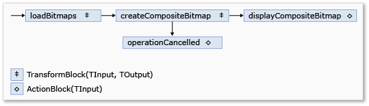

# Пошаговое руководство. Использование потока данных в приложении Windows FormsWalkthrough: Using Dataflow in a Windows Forms Application
В этом документе демонстрируется способ создания сети блоков потока данных, которые выполняют обработку изображений в приложении Windows Forms.This document demonstrates how to create a network of dataflow blocks that perform image processing in a Windows Forms application.  
  
 В этом примере файлы изображения загружаются из указанной папки, из них создается составное изображение, и результат отображается.This example loads image files from the specified folder, creates a composite image, and displays the result. В данном примере для перемещения изображений по сети используется модель потока данных.The example uses the dataflow model to route images through the network. В модели потока данных независимые компоненты программы взаимодействуют друг с другом, отправляя сообщения.In the dataflow model, independent components of a program communicate with one another by sending messages. Когда компонент получает сообщение, он выполняет какое-либо действие и затем передает результат другому компоненту.When a component receives a message, it performs some action and then passes the result to another component. Сравните это с моделью потока управления, в который приложение использует структуры управления, например условные операторы, циклы и т. д., для управления порядком операций в программе.Compare this with the control flow model, in which an application uses control structures, for example, conditional statements, loops, and so on, to control the order of operations in a program.  
  
## Предварительные требованияPrerequisites  
 Прежде чем начать выполнение этого пошагового руководства, ознакомьтесь с документом [Поток данных](../../../docs/standard/parallel-programming/dataflow-task-parallel-library.md).Read [Dataflow](../../../docs/standard/parallel-programming/dataflow-task-parallel-library.md) before you start this walkthrough.  
  
> [!TIP]
>  Библиотека потоков данных TPL (пространство имен <xref:System.Threading.Tasks.Dataflow?displayProperty=nameWithType>) не поставляется с [!INCLUDE[net_v45](../../../includes/net-v45-md.md)].The TPL Dataflow Library (<xref:System.Threading.Tasks.Dataflow?displayProperty=nameWithType> namespace) is not distributed with the [!INCLUDE[net_v45](../../../includes/net-v45-md.md)]. Чтобы установить <xref:System.Threading.Tasks.Dataflow> пространства имен, откройте проект в [!INCLUDE[vs_dev11_long](../../../includes/vs-dev11-long-md.md)], выберите **управление пакетами NuGet** меню проекта и выполните поиск в Интернете `Microsoft.Tpl.Dataflow` пакета.To install the <xref:System.Threading.Tasks.Dataflow> namespace, open your project in [!INCLUDE[vs_dev11_long](../../../includes/vs-dev11-long-md.md)], choose **Manage NuGet Packages** from the Project menu, and search online for the `Microsoft.Tpl.Dataflow` package.  
 
  
## РазделыSections  
 Это пошаговое руководство содержит следующие разделы:This walkthrough contains the following sections:  
  
-   [Создание приложения Windows FormsCreating the Windows Forms Application](#winforms)  
  
-   [Создание сети потока данныхCreating the Dataflow Network](#network)  
  
-   [Подключение сети потока данных к пользовательскому интерфейсуConnecting the Dataflow Network to the User Interface](#ui)  
  
-   [Полный примерThe Complete Example](#complete)  
  
   
## Создание приложения Windows FormsCreating the Windows Forms Application  
 В этом разделе описывается, как создать простое приложение Windows Forms и добавить элементы управления в главную форму.This section describes how to create the basic Windows Forms application and add controls to the main form.  
  
#### Создание приложения Windows FormsTo Create the Windows Forms Application  
  
1.  В [!INCLUDE[vsprvs](../../../includes/vsprvs-md.md)] создайте проект **приложения Windows Forms** на [!INCLUDE[csprcs](../../../includes/csprcs-md.md)] или Visual Basic.In [!INCLUDE[vsprvs](../../../includes/vsprvs-md.md)], create a [!INCLUDE[csprcs](../../../includes/csprcs-md.md)] or Visual Basic **Windows Forms Application** project. В этом документе проект называется `CompositeImages`.In this document, the project is named `CompositeImages`.  
  
2.  В конструкторе форм главной формы Form1.cs (Form1.vb для [!INCLUDE[vbprvb](../../../includes/vbprvb-md.md)]) добавьте элемент управления <xref:System.Windows.Forms.ToolStrip>.On the form designer for the main form, Form1.cs (Form1.vb for [!INCLUDE[vbprvb](../../../includes/vbprvb-md.md)]), add a <xref:System.Windows.Forms.ToolStrip> control.  
  
3.  Добавьте элемент управления <xref:System.Windows.Forms.ToolStripButton> к элементу управления <xref:System.Windows.Forms.ToolStrip>.Add a <xref:System.Windows.Forms.ToolStripButton> control to the <xref:System.Windows.Forms.ToolStrip> control. Задать <xref:System.Windows.Forms.ToolStripItem.DisplayStyle%2A> свойства <xref:System.Windows.Forms.ToolStripItemDisplayStyle.Text> и <xref:System.Windows.Forms.ToolStripItem.Text%2A> свойства **выбрать папку**.Set the <xref:System.Windows.Forms.ToolStripItem.DisplayStyle%2A> property to <xref:System.Windows.Forms.ToolStripItemDisplayStyle.Text> and the <xref:System.Windows.Forms.ToolStripItem.Text%2A> property to **Choose Folder**.  
  
4.  Добавьте второй элемент управления <xref:System.Windows.Forms.ToolStripButton> к элементу управления <xref:System.Windows.Forms.ToolStrip>.Add a second <xref:System.Windows.Forms.ToolStripButton> control to the <xref:System.Windows.Forms.ToolStrip> control. Задать <xref:System.Windows.Forms.ToolStripItem.DisplayStyle%2A> свойства <xref:System.Windows.Forms.ToolStripItemDisplayStyle.Text>, <xref:System.Windows.Forms.ToolStripItem.Text%2A> свойства **отменить**и <xref:System.Windows.Forms.ToolStripItem.Enabled%2A> свойства `False`.Set the <xref:System.Windows.Forms.ToolStripItem.DisplayStyle%2A> property to <xref:System.Windows.Forms.ToolStripItemDisplayStyle.Text>, the <xref:System.Windows.Forms.ToolStripItem.Text%2A> property to **Cancel**, and the <xref:System.Windows.Forms.ToolStripItem.Enabled%2A> property to `False`.  
  
5.  Добавьте объект <xref:System.Windows.Forms.PictureBox> на главную форму.Add a <xref:System.Windows.Forms.PictureBox> object to the main form. Задайте для свойства <xref:System.Windows.Forms.Control.Dock%2A> значение <xref:System.Windows.Forms.DockStyle.Fill>.Set the <xref:System.Windows.Forms.Control.Dock%2A> property to <xref:System.Windows.Forms.DockStyle.Fill>.  
  
   
## Создание сети потока данныхCreating the Dataflow Network  
 В этом разделе описывается способ создания сети потока данных, которая выполняет обработку изображений.This section describes how to create the dataflow network that performs image processing.  
  
#### Создание сети потока данныхTo Create the Dataflow Network  
  
1.  В своем проекте добавьте ссылку на System.Threading.Tasks.Dataflow.dll.Add a reference to System.Threading.Tasks.Dataflow.dll to your project.  
  
2.  Убедитесь, что Form1.cs (Form1.vb для [!INCLUDE[vbprvb](../../../includes/vbprvb-md.md)]) содержит следующие операторы `using` (`Using` в [!INCLUDE[vbprvb](../../../includes/vbprvb-md.md)]).Ensure that Form1.cs (Form1.vb for [!INCLUDE[vbprvb](../../../includes/vbprvb-md.md)]) contains the following `using` (`Using` in [!INCLUDE[vbprvb](../../../includes/vbprvb-md.md)]) statements:  
  
     [!code-csharp[TPLDataflow_CompositeImages#1](../../../samples/snippets/csharp/VS_Snippets_Misc/tpldataflow_compositeimages/cs/compositeimages/form1.cs#1)]  
  
3.  Добавьте в класс `Form1` следующие данные-члены.Add the following data members to the `Form1` class:  
  
     [!code-csharp[TPLDataflow_CompositeImages#2](../../../samples/snippets/csharp/VS_Snippets_Misc/tpldataflow_compositeimages/cs/compositeimages/form1.cs#2)]  
  
4.  Добавьте в класс `CreateImageProcessingNetwork` метод `Form1`.Add the following method, `CreateImageProcessingNetwork`, to the `Form1` class. Этот метод создает сеть обработки изображений.This method creates the image processing network.  
  
     [!code-csharp[TPLDataflow_CompositeImages#3](../../../samples/snippets/csharp/VS_Snippets_Misc/tpldataflow_compositeimages/cs/compositeimages/form1.cs#3)]  
  
5.  Выполните метод `LoadBitmaps`.Implement the `LoadBitmaps` method.  
  
     [!code-csharp[TPLDataflow_CompositeImages#4](../../../samples/snippets/csharp/VS_Snippets_Misc/tpldataflow_compositeimages/cs/compositeimages/form1.cs#4)]  
  
6.  Выполните метод `CreateCompositeBitmap`.Implement the `CreateCompositeBitmap` method.  
  
     [!code-csharp[TPLDataflow_CompositeImages#5](../../../samples/snippets/csharp/VS_Snippets_Misc/tpldataflow_compositeimages/cs/compositeimages/form1.cs#5)]  
  
    > [!NOTE]
    >  Версия метода `CreateCompositeBitmap` в C# использует указатели для обеспечения эффективной обработки объектов <xref:System.Drawing.Bitmap?displayProperty=nameWithType>.The C# version of the `CreateCompositeBitmap` method uses pointers to enable efficient processing of the <xref:System.Drawing.Bitmap?displayProperty=nameWithType> objects. Поэтому необходимо включить параметр **Разрешить небезопасный код** в проекте для использования ключевого слова [небезопасный](~/docs/csharp/language-reference/keywords/unsafe.md).Therefore, you must enable the **Allow unsafe code** option in your project in order to use the [unsafe](~/docs/csharp/language-reference/keywords/unsafe.md) keyword. Дополнительные сведения о том, как включить небезопасный код в [!INCLUDE[csprcs](../../../includes/csprcs-md.md)] проекта см. в разделе [Страница построения, конструктор проектов (C#)] https://msdn.microsoft.com/library/kb4wyys2).For more information about how to enable unsafe code in a [!INCLUDE[csprcs](../../../includes/csprcs-md.md)] project, see [Build Page, Project Designer (C#)]https://msdn.microsoft.com/library/kb4wyys2).  
  
 Следующая таблица описывает члены сети.The following table describes the members of the network.  
  
|ЧленMember|ТипType|ОписаниеDescription|  
|------------|----------|-----------------|  
|`loadBitmaps`|<xref:System.Threading.Tasks.Dataflow.TransformBlock%602>|Принимает путь папки на входе и создает коллекцию объектов <xref:System.Drawing.Bitmap> на выходе.Takes a folder path as input and produces a collection of <xref:System.Drawing.Bitmap> objects as output.|  
|`createCompositeBitmap`|<xref:System.Threading.Tasks.Dataflow.TransformBlock%602>|Принимает коллекцию объектов <xref:System.Drawing.Bitmap> на входе и подает составной точечный рисунок на выход.Takes a collection of <xref:System.Drawing.Bitmap> objects as input and produces a composite bitmap as output.|  
|`displayCompositeBitmap`|<xref:System.Threading.Tasks.Dataflow.ActionBlock%601>|Отображает составной точечный рисунок на форме.Displays the composite bitmap on the form.|  
|`operationCancelled`|<xref:System.Threading.Tasks.Dataflow.ActionBlock%601>|Отображает изображение, чтобы указать, что операция отменена, и позволяет пользователю выбрать другую папку.Displays an image to indicate that the operation is canceled and enables the user to select another folder.|  
  
 Для подключения блоков потока данных для формирования сети в этом примере используется метод <xref:System.Threading.Tasks.Dataflow.ISourceBlock%601.LinkTo%2A>.To connect the dataflow blocks to form a network, this example uses the <xref:System.Threading.Tasks.Dataflow.ISourceBlock%601.LinkTo%2A> method. Метод <xref:System.Threading.Tasks.Dataflow.ISourceBlock%601.LinkTo%2A> содержит перегруженную версию, которая принимает объект <xref:System.Predicate%601>, указывающий, допускает или отклоняет блок целевого объекта определенное сообщение.The <xref:System.Threading.Tasks.Dataflow.ISourceBlock%601.LinkTo%2A> method contains an overloaded version that takes a <xref:System.Predicate%601> object that determines whether the target block accepts or rejects a message. Этот механизм фильтрации позволяет блокам сообщений получать только определенные значения.This filtering mechanism enables message blocks to receive only certain values. В этом примере сеть может разветвляться одним из двух способов.In this example, the network can branch in one of two ways. Основная ветвь загружает изображения с диска, создает составное изображение и отображает его на форме.The main branch loads the images from disk, creates the composite image, and displays that image on the form. Другая ветвь отменяет текущую операцию.The alternate branch cancels the current operation. Объекты <xref:System.Predicate%601> позволяют блокам потоков данных, работающим по основной ветви, перейти к альтернативной ветви путем отклонения определенных сообщений.The <xref:System.Predicate%601> objects enable the dataflow blocks along the main branch to switch to the alternative branch by rejecting certain messages. Например, если пользователь отменяет операцию, блок потока данных `createCompositeBitmap` на выход подает `null` (`Nothing` в [!INCLUDE[vbprvb](../../../includes/vbprvb-md.md)]).For example, if the user cancels the operation, the dataflow block `createCompositeBitmap` produces `null` (`Nothing` in [!INCLUDE[vbprvb](../../../includes/vbprvb-md.md)]) as its output. Блок потока данных `displayCompositeBitmap` отклоняет входные значения `null`, и поэтому сообщение передается `operationCancelled`.The dataflow block `displayCompositeBitmap` rejects `null` input values, and therefore, the message is offered to `operationCancelled`. Блок потока данных `operationCancelled` принимает все сообщения и поэтому отображает изображение, чтобы показать, что операция отменена.The dataflow block `operationCancelled` accepts all messages and therefore, displays an image to indicate that the operation is canceled.  
  
 На рисунке ниже показана сеть обработки изображений.The following illustration shows the image processing network.  
  
   
  
 Поскольку блоки потоков данных `displayCompositeBitmap` и `operationCancelled` работают с интерфейсом пользователя, важно, чтобы эти действия происходили в потоке пользовательского интерфейса.Because the `displayCompositeBitmap` and `operationCancelled` dataflow blocks act on the user interface, it is important that these actions occur on the user-interface thread. Для этого в процессе создания каждый из этих объектов предоставляет объект <xref:System.Threading.Tasks.Dataflow.ExecutionDataflowBlockOptions>, который содержит свойство <xref:System.Threading.Tasks.Dataflow.DataflowBlockOptions.TaskScheduler%2A> со значением <xref:System.Threading.Tasks.TaskScheduler.FromCurrentSynchronizationContext%2A?displayProperty=nameWithType>.To accomplish this, during construction, these objects each provide a <xref:System.Threading.Tasks.Dataflow.ExecutionDataflowBlockOptions> object that has the <xref:System.Threading.Tasks.Dataflow.DataflowBlockOptions.TaskScheduler%2A> property set to <xref:System.Threading.Tasks.TaskScheduler.FromCurrentSynchronizationContext%2A?displayProperty=nameWithType>. Метод <xref:System.Threading.Tasks.TaskScheduler.FromCurrentSynchronizationContext%2A?displayProperty=nameWithType> создает объект <xref:System.Threading.Tasks.TaskScheduler>, выполняющий работу в текущем контексте синхронизации.The <xref:System.Threading.Tasks.TaskScheduler.FromCurrentSynchronizationContext%2A?displayProperty=nameWithType> method creates a <xref:System.Threading.Tasks.TaskScheduler> object that performs work on the current synchronization context. Так как метод `CreateImageProcessingNetwork` вызывается из обработчика кнопки **Выбрать папку**, которая выполняется в потоке пользовательского интерфейса, действия для блоков потока данных `displayCompositeBitmap` и `operationCancelled` также выполняются в потоке пользовательского интерфейса.Because the `CreateImageProcessingNetwork` method is called from the handler of the **Choose Folder** button, which runs on the user-interface thread, the actions for the `displayCompositeBitmap` and `operationCancelled` dataflow blocks also run on the user-interface thread.  
  
 В этом примере используется общий токен отмены, а не устанавливается свойство <xref:System.Threading.Tasks.Dataflow.DataflowBlockOptions.CancellationToken%2A>, поскольку свойство <xref:System.Threading.Tasks.Dataflow.DataflowBlockOptions.CancellationToken%2A> окончательно отменяет выполнение блока потока данных.This example uses a shared cancellation token instead of setting the <xref:System.Threading.Tasks.Dataflow.DataflowBlockOptions.CancellationToken%2A> property because the <xref:System.Threading.Tasks.Dataflow.DataflowBlockOptions.CancellationToken%2A> property permanently cancels dataflow block execution. Токен отмены в этом примере позволяет повторно использовать те же сети потоков данных несколько раз, даже если пользователь отменил одну или несколько операций.A cancellation token enables this example to reuse the same dataflow network multiple times, even when the user cancels one or more operations. Пример, использующий <xref:System.Threading.Tasks.Dataflow.DataflowBlockOptions.CancellationToken%2A> окончательно отменить выполнение блока потока данных, в разделе [как: Отмена блока потока данных](../../../docs/standard/parallel-programming/how-to-cancel-a-dataflow-block.md).For an example that uses <xref:System.Threading.Tasks.Dataflow.DataflowBlockOptions.CancellationToken%2A> to permanently cancel the execution of a dataflow block, see [How to: Cancel a Dataflow Block](../../../docs/standard/parallel-programming/how-to-cancel-a-dataflow-block.md).  
  
   
## Подключение сети потока данных к пользовательскому интерфейсуConnecting the Dataflow Network to the User Interface  
 В этом разделе описывается, как подключить сеть потока данных к интерфейсу пользователя.This section describes how to connect the dataflow network to the user interface. Создание составного изображения и отмена операции инициализируются кнопками **Выбрать папку** и **Отмена**.The creation of the composite image and cancellation of the operation are initiated from the **Choose Folder** and **Cancel** buttons. Когда пользователь выбирает какую-либо из этих кнопок, соответствующее действие выполняется асинхронно.When the user chooses either of these buttons, the appropriate action is initiated in an asynchronous manner.  
  
#### Подключение сети потока данных к пользовательскому интерфейсуTo Connect the Dataflow Network to the User Interface  
  
1.  В конструкторе форм главной формы создайте обработчик событий для <xref:System.Windows.Forms.ToolStripItem.Click> событий для **выбрать папку** кнопки.On the form designer for the main form, create an event handler for the <xref:System.Windows.Forms.ToolStripItem.Click> event for the **Choose Folder** button.  
  
2.  Реализуйте <xref:System.Windows.Forms.ToolStripItem.Click> событий для **выбрать папку** кнопки.Implement the <xref:System.Windows.Forms.ToolStripItem.Click> event for the **Choose Folder** button.  
  
     [!code-csharp[TPLDataflow_CompositeImages#6](../../../samples/snippets/csharp/VS_Snippets_Misc/tpldataflow_compositeimages/cs/compositeimages/form1.cs#6)]  
  
3.  В конструкторе форм главной формы создайте обработчик событий для <xref:System.Windows.Forms.ToolStripItem.Click> событий для **отменить** кнопки.On the form designer for the main form, create an event handler for the <xref:System.Windows.Forms.ToolStripItem.Click> event for the **Cancel** button.  
  
4.  Реализуйте <xref:System.Windows.Forms.ToolStripItem.Click> событий для **отменить** кнопки.Implement the <xref:System.Windows.Forms.ToolStripItem.Click> event for the **Cancel** button.  
  
     [!code-csharp[TPLDataflow_CompositeImages#7](../../../samples/snippets/csharp/VS_Snippets_Misc/tpldataflow_compositeimages/cs/compositeimages/form1.cs#7)]  
  
   
## Полный примерThe Complete Example  
 В следующем примере приведен полный код для этого руководства.The following example shows the complete code for this walkthrough.  
  
 [!code-csharp[TPLDataflow_CompositeImages#100](../../../samples/snippets/csharp/VS_Snippets_Misc/tpldataflow_compositeimages/cs/compositeimages/form1.cs#100)]  
  
 На следующем рисунке показаны типовые выходные данные для общей папки \Sample Pictures\.The following illustration shows typical output for the common \Sample Pictures\ folder.  
  
   
  
## Дальнейшие действияNext Steps  
  
## См. такжеSee Also  
 [Поток данныхDataflow](../../../docs/standard/parallel-programming/dataflow-task-parallel-library.md)
