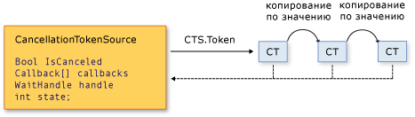

# Отмена в управляемых потокахCancellation in Managed Threads
В .NET Framework 4 введена новая универсальная модель совместной отмены асинхронных или долго выполняющихся синхронных операций.Starting with the .NET Framework 4, the .NET Framework uses a unified model for cooperative cancellation of asynchronous or long-running synchronous operations. Эта модель построена на простом объекте, называемом токеном отмены.This model is based on a lightweight object called a cancellation token. Объект, который вызывает одну или несколько отменяемых операций, например, путем создания новых потоков или задач, передает этот токен в каждую операцию.The object that invokes one or more cancelable operations, for example by creating new threads or tasks, passes the token to each operation. Операция, в свою очередь, передает копии этого токена в другие операции.Individual operations can in turn pass copies of the token to other operations. Некоторое время спустя объект, создавший токен, может использовать его для запроса остановки выполнения операции.At some later time, the object that created the token can use it to request that the operations stop what they are doing. Запрос на отмену может создавать только запрашивающий объект, и каждый прослушиватель должен обнаружить этот запрос, чтобы правильно и своевременно отреагировать на него.Only the requesting object can issue the cancellation request, and each listener is responsible for noticing the request and responding to it in an appropriate and timely manner.  
  
 Общая схема реализации модели совместной отмены выглядит следующим образом:The general pattern for implementing the cooperative cancellation model is:  
  
- Создается экземпляр объекта <xref:System.Threading.CancellationTokenSource>, который управляет уведомлениями об отмене и передает их отдельным токенам отмены.Instantiate a <xref:System.Threading.CancellationTokenSource> object, which manages and sends cancellation notification to the individual cancellation tokens.  
  
- В каждую задачу или поток, ожидающий отмены, передается токен, возвращенный свойством <xref:System.Threading.CancellationTokenSource.Token%2A?displayProperty=nameWithType>.Pass the token returned by the <xref:System.Threading.CancellationTokenSource.Token%2A?displayProperty=nameWithType> property to each task or thread that listens for cancellation.  
  
- Каждой задачи или каждому потоку предоставляется механизм реагирования на отмену.Provide a mechanism for each task or thread to respond to cancellation.  
  
- Вызывается метод <xref:System.Threading.CancellationTokenSource.Cancel%2A?displayProperty=nameWithType> для предоставления уведомления об отмене.Call the <xref:System.Threading.CancellationTokenSource.Cancel%2A?displayProperty=nameWithType> method to provide notification of cancellation.  
  
> [!IMPORTANT]
> Класс <xref:System.Threading.CancellationTokenSource> реализует интерфейс <xref:System.IDisposable>.The <xref:System.Threading.CancellationTokenSource> class implements the <xref:System.IDisposable> interface. По завершении использования источника токена отмены обязательно вызовите метод <xref:System.Threading.CancellationTokenSource.Dispose%2A?displayProperty=nameWithType>, чтобы освободить все занятые неуправляемые ресурсы.You should be sure to call the <xref:System.Threading.CancellationTokenSource.Dispose%2A?displayProperty=nameWithType> method when you have finished using the cancellation token source to free any unmanaged resources it holds.  
  
 На рисунке ниже показана связь между источником токена и всеми копиями токена.The following illustration shows the relationship between a token source and all the copies of its token.  
  
   
  
 Новая модель отмены упрощает создание приложений и библиотек, поддерживающих отмену. Она также поддерживает перечисленные ниже возможности.The new cancellation model makes it easier to create cancellation-aware applications and libraries, and it supports the following features:  
  
- Отмена является совместной и не осуществляется принудительно на прослушивателе.Cancellation is cooperative and is not forced on the listener. Прослушиватель сам определяет порядок корректного завершения в ответ на запрос отмены.The listener determines how to gracefully terminate in response to a cancellation request.  
  
- Запрос осуществляется отдельно от прослушивания.Requesting is distinct from listening. Объект, который вызывает отменяемую операцию, может управлять временем создания запроса отмены (а также самим фактом создания подобного запроса).An object that invokes a cancelable operation can control when (if ever) cancellation is requested.  
  
- Запрашивающий объект создает запрос на отмену для всех копий токена, используя только один вызов метода.The requesting object issues the cancellation request to all copies of the token by using just one method call.  
  
- Прослушиватель может одновременно ожидать несколько маркеров, объединив их в один *связанный маркер*.A listener can listen to multiple tokens simultaneously by joining them into one *linked token*.  
  
- Пользовательский код может отслеживать запросы на отмену из кода библиотеки и реагировать на них, а код библиотеки, в свою очередь, может отслеживать запросы на отмену из пользовательского кода и реагировать на них.User code can notice and respond to cancellation requests from library code, and library code can notice and respond to cancellation requests from user code.  
  
- Для уведомления прослушивателей о запросах на отмену может использоваться опрос, регистрация обратных вызовов или ожидание дескрипторов ожидания.Listeners can be notified of cancellation requests by polling, callback registration, or waiting on wait handles.  
  
## Типы отменыCancellation Types  
 Инфраструктура отмены реализована в виде набора связанных типов, приведенных в таблице ниже.The cancellation framework is implemented as a set of related types, which are listed in the following table.  
  
|Имя типаType name|ОписаниеDescription|  
|---------------|-----------------|  
|<xref:System.Threading.CancellationTokenSource>|Объект, который создает токен отмены и запрос на отмену для всех копий этого токена.Object that creates a cancellation token, and also issues the cancellation request for all copies of that token.|  
|<xref:System.Threading.CancellationToken>|Простой тип значения, передаваемый одному или нескольким прослушивателям, обычно в виде параметра метода.Lightweight value type passed to one or more listeners, typically as a method parameter. Прослушиватели отслеживают значение свойства `IsCancellationRequested` токена посредством опроса, обратного вызова или дескриптора ожидания.Listeners monitor the value of the `IsCancellationRequested` property of the token by polling, callback, or wait handle.|  
|<xref:System.OperationCanceledException>|Перегрузки конструктора этого исключения принимают <xref:System.Threading.CancellationToken> в качестве параметра.Overloads of this exception's constructor accept a <xref:System.Threading.CancellationToken> as a parameter. Прослушиватели могут также создавать это исключение для проверки источника отмены и уведомления остальных прослушивателей об ответе на запрос отмены.Listeners can optionally throw this exception to verify the source of the cancellation and notify others that it has responded to a cancellation request.|  
  
 Новая модель отмены интегрирована в несколько типов .NET Framework.The new cancellation model is integrated into the .NET Framework in several types. Наиболее важные из них — <xref:System.Threading.Tasks.Parallel?displayProperty=nameWithType>, <xref:System.Threading.Tasks.Task?displayProperty=nameWithType>, <xref:System.Threading.Tasks.Task%601?displayProperty=nameWithType> и <xref:System.Linq.ParallelEnumerable?displayProperty=nameWithType>.The most important ones are <xref:System.Threading.Tasks.Parallel?displayProperty=nameWithType>, <xref:System.Threading.Tasks.Task?displayProperty=nameWithType>, <xref:System.Threading.Tasks.Task%601?displayProperty=nameWithType> and <xref:System.Linq.ParallelEnumerable?displayProperty=nameWithType>. Мы рекомендуем использовать именно эту новую модель отмены в коде всех новых библиотек и приложений.We recommend that you use this new cancellation model for all new library and application code.  
  
## Пример кодаCode Example  
 В примере ниже запрашивающий объект создает объект <xref:System.Threading.CancellationTokenSource>, а затем передает его свойство <xref:System.Threading.CancellationTokenSource.Token%2A> в отменяемую операцию.In the following example, the requesting object creates a <xref:System.Threading.CancellationTokenSource> object, and then passes its <xref:System.Threading.CancellationTokenSource.Token%2A> property to the cancelable operation. Операция, получающая запрос, отслеживает значение свойства <xref:System.Threading.CancellationToken.IsCancellationRequested%2A> токена путем опроса.The operation that receives the request monitors the value of the <xref:System.Threading.CancellationToken.IsCancellationRequested%2A> property of the token by polling. Когда свойство принимает значение `true`, прослушиватель может завершить операцию любым приемлемым способом.When the value becomes `true`, the listener can terminate in whatever manner is appropriate. В этом примере просто выполняется выход из метода. Во многих случаях этого достаточно.In this example, the method just exits, which is all that is required in many cases.  
  
> [!NOTE]
> В этом примере метод <xref:System.Threading.ThreadPool.QueueUserWorkItem%2A> используется для демонстрации совместимости новой инфраструктуры отмены с устаревшими интерфейсами API.The example uses the <xref:System.Threading.ThreadPool.QueueUserWorkItem%2A> method to demonstrate that the new cancellation framework is compatible with legacy APIs. Пример, в котором используется новый предпочтительный тип <xref:System.Threading.Tasks.Task?displayProperty=nameWithType>, см. в разделе [Руководство. Отмена задачи и ее дочерних элементов](../../../docs/standard/parallel-programming/how-to-cancel-a-task-and-its-children.md).For an example that uses the new, preferred <xref:System.Threading.Tasks.Task?displayProperty=nameWithType> type, see [How to: Cancel a Task and Its Children](../../../docs/standard/parallel-programming/how-to-cancel-a-task-and-its-children.md).  
  
 [!code-csharp[Cancellation#1](../../../samples/snippets/csharp/VS_Snippets_Misc/cancellation/cs/cancellationex1.cs#1)]
 [!code-vb[Cancellation#1](../../../samples/snippets/visualbasic/VS_Snippets_Misc/cancellation/vb/cancellationex1.vb#1)]  
  
## Отмена операции и отмена объектаOperation Cancellation Versus Object Cancellation  
 В рамках новой инфраструктуры отмены осуществляется отмена операций, а не объектов.In the new cancellation framework, cancellation refers to operations, not objects. Запрос на отмену означает, что операция должна быть остановлена как можно скорее после выполнения всех необходимых очисток.The cancellation request means that the operation should stop as soon as possible after any required cleanup is performed. Один токен отмены должен относиться к одной отменяемой операции, однако эта операция может быть реализована в программе.One cancellation token should refer to one "cancelable operation," however that operation may be implemented in your program. После того как свойство <xref:System.Threading.CancellationToken.IsCancellationRequested%2A> токена примет значение `true`, для него невозможно будет восстановить значение `false`.After the <xref:System.Threading.CancellationToken.IsCancellationRequested%2A> property of the token has been set to `true`, it cannot be reset to `false`. Поэтому токены отмены нельзя использовать повторно после отмены.Therefore, cancellation tokens cannot be reused after they have been canceled.  
  
 Если вам необходим механизм отмены объектов, его можно построить на основе механизма отмены операций путем вызова метода <xref:System.Threading.CancellationToken.Register%2A?displayProperty=nameWithType>, как показано в примере ниже.If you require an object cancellation mechanism, you can base it on the operation cancellation mechanism by calling the <xref:System.Threading.CancellationToken.Register%2A?displayProperty=nameWithType> method, as shown in the following example.  
  
 [!code-csharp[Cancellation#2](../../../samples/snippets/csharp/VS_Snippets_Misc/cancellation/cs/objectcancellation1.cs#2)]
 [!code-vb[Cancellation#2](../../../samples/snippets/visualbasic/VS_Snippets_Misc/cancellation/vb/objectcancellation1.vb#2)]  
  
 Если объект поддерживает несколько параллельных отменяемых операций, в каждую отменяемую операцию следует передавать отдельный токен.If an object supports more than one concurrent cancelable operation, pass a separate token as input to each distinct cancelable operation. Это позволяет отменить одну операцию, не затрагивая при этом остальные.That way, one operation can be cancelled without affecting the others.  
  
## Прослушивание запросов на отмену и ответ на нихListening and Responding to Cancellation Requests  
 Объект, реализующий отменяемую операцию, в пользовательском делегате определяет способ завершения операции в ответ на запрос отмены.In the user delegate, the implementer of a cancelable operation determines how to terminate the operation in response to a cancellation request. Во многих случаях пользовательский делегат может выполнить необходимую очистку, а затем немедленный возврат.In many cases, the user delegate can just perform any required cleanup and then return immediately.  
  
 Однако в более сложных случаях может потребоваться, чтобы пользовательский делегат уведомлял код библиотеки об отмене.However, in more complex cases, it might be necessary for the user delegate to notify library code that cancellation has occurred. В таких случаях, чтобы правильно завершить операцию, следует вызвать из делегата метод <xref:System.Threading.CancellationToken.ThrowIfCancellationRequested%2A>, который создает исключение <xref:System.OperationCanceledException>.In such cases, the correct way to terminate the operation is for the delegate to call the <xref:System.Threading.CancellationToken.ThrowIfCancellationRequested%2A>, method, which will cause an <xref:System.OperationCanceledException> to be thrown. Код библиотеки может перехватить это исключение в потоке пользовательского делегата и проверить токен исключения, чтобы определить, указывает ли исключение на совместную отмену или возникновение другой исключительной ситуации.Library code can catch this exception on the user delegate thread and examine the exception's token to determine whether the exception indicates cooperative cancellation or some other exceptional situation.  
  
 Класс <xref:System.Threading.Tasks.Task> обрабатывает <xref:System.OperationCanceledException> таким образом.The <xref:System.Threading.Tasks.Task> class handles <xref:System.OperationCanceledException> in this way. Дополнительные сведения см. в разделе [Отмена задач](../../../docs/standard/parallel-programming/task-cancellation.md).For more information, see [Task Cancellation](../../../docs/standard/parallel-programming/task-cancellation.md).  
  
### Прослушивание с помощью опросовListening by Polling  
 Для длительных циклических или рекурсивных вычислений можно прослушивать запрос на отмену путем периодического опроса значения свойства <xref:System.Threading.CancellationToken.IsCancellationRequested%2A?displayProperty=nameWithType>.For long-running computations that loop or recurse, you can listen for a cancellation request by periodically polling the value of the <xref:System.Threading.CancellationToken.IsCancellationRequested%2A?displayProperty=nameWithType> property. Если его значение равно `true`, метод должен максимально быстро выполнить очистку и завершение.If its value is `true`, the method should clean up and terminate as quickly as possible. Оптимальная частота опроса зависит от типа приложения.The optimal frequency of polling depends on the type of application. Разработчик должен определить оптимальную частоту опроса для конкретной программы.It is up to the developer to determine the best polling frequency for any given program. Сам по себе опрос не оказывает значительного влияния на производительность.Polling itself does not significantly impact performance. В примере ниже показан один из возможных способов опроса.The following example shows one possible way to poll.  
  
 [!code-csharp[Cancellation#3](../../../samples/snippets/csharp/VS_Snippets_Misc/cancellation/cs/cancellationex11.cs#3)]
 [!code-vb[Cancellation#3](../../../samples/snippets/visualbasic/VS_Snippets_Misc/cancellation/vb/cancellationex11.vb#3)]  
  
 Более полный пример см. в подразделе [Практическое руководство. Прослушивание запросов на отмену посредством опросов](../../../docs/standard/threading/how-to-listen-for-cancellation-requests-by-polling.md).For a more complete example, see [How to: Listen for Cancellation Requests by Polling](../../../docs/standard/threading/how-to-listen-for-cancellation-requests-by-polling.md).  
  
### Прослушивание путем регистрации обратного вызоваListening by Registering a Callback  
 Некоторые операции могут быть заблокированы таким образом, при котором невозможно своевременно проверить значение токена отмены.Some operations can become blocked in such a way that they cannot check the value of the cancellation token in a timely manner. В этих случаях можно зарегистрировать метод обратного вызова, который разблокирует метод при получении запроса на отмену.For these cases, you can register a callback method that unblocks the method when a cancellation request is received.  
  
 Метод <xref:System.Threading.CancellationToken.Register%2A> возвращает объект <xref:System.Threading.CancellationTokenRegistration>, который используется специально в этих целях.The <xref:System.Threading.CancellationToken.Register%2A> method returns a <xref:System.Threading.CancellationTokenRegistration> object that is used specifically for this purpose. В примере ниже показано, как использовать метод <xref:System.Threading.CancellationToken.Register%2A> для отмены асинхронного веб-запроса.The following example shows how to use the <xref:System.Threading.CancellationToken.Register%2A> method to cancel an asynchronous Web request.  
  
 [!code-csharp[Cancellation#4](../../../samples/snippets/csharp/VS_Snippets_Misc/cancellation/cs/cancellationex4.cs#4)]
 [!code-vb[Cancellation#4](../../../samples/snippets/visualbasic/VS_Snippets_Misc/cancellation/vb/cancellationex4.vb#4)]  
  
 Объект <xref:System.Threading.CancellationTokenRegistration> управляет синхронизацией потока и обеспечивает прекращение выполнения обратного вызова в определенный момент времени.The <xref:System.Threading.CancellationTokenRegistration> object manages thread synchronization and ensures that the callback will stop executing at a precise point in time.  
  
 Чтобы обеспечить отклик системы и предотвратить взаимоблокировки, при регистрации обратных вызовов необходимо следовать приведенным ниже рекомендациям.In order to ensure system responsiveness and to avoid deadlocks, the following guidelines must be followed when registering callbacks:  
  
- Метод обратного вызова должен быть быстрым, так как он вызывается синхронно и поэтому возврат вызова <xref:System.Threading.CancellationTokenSource.Cancel%2A> будет выполнен после возврата из функции обратного вызова.The callback method should be fast because it is called synchronously and therefore the call to <xref:System.Threading.CancellationTokenSource.Cancel%2A> does not return until the callback returns.  
  
- Если вы вызываете <xref:System.Threading.CancellationTokenRegistration.Dispose%2A> во время выполнения обратного вызова и удерживаете блокировку, которую ожидает функция обратного вызова, в программе может произойти взаимоблокировка.If you call <xref:System.Threading.CancellationTokenRegistration.Dispose%2A> while the callback is running, and you hold a lock that the callback is waiting on, your program can deadlock. После завершения работы метода `Dispose` можно освобождать любые ресурсы, которые необходимы для обратного вызова.After `Dispose` returns, you can free any resources required by the callback.  
  
- Обратные вызовы не должны обрабатывать какие-либо ручные потоки или использовать <xref:System.Threading.SynchronizationContext> в обратном вызове.Callbacks should not perform any manual thread or <xref:System.Threading.SynchronizationContext> usage in a callback. Если обратный вызов должен выполняться в определенном потоке, используйте конструктор <xref:System.Threading.CancellationTokenRegistration?displayProperty=nameWithType>, который позволяет задать активный объект <xref:System.Threading.SynchronizationContext.Current%2A?displayProperty=nameWithType> в качестве целевого объекта syncContext.If a callback must run on a particular thread, use the <xref:System.Threading.CancellationTokenRegistration?displayProperty=nameWithType> constructor that enables you to specify that the target syncContext is the active <xref:System.Threading.SynchronizationContext.Current%2A?displayProperty=nameWithType>. Выполнение ручного потока в обратном вызове может привести к взаимоблокировке.Performing manual threading in a callback can cause deadlock.  
  
 Более полный пример см. в подразделе [Практическое руководство. Регистрация обратных вызовов для запросов на отмену](../../../docs/standard/threading/how-to-register-callbacks-for-cancellation-requests.md).For a more complete example, see [How to: Register Callbacks for Cancellation Requests](../../../docs/standard/threading/how-to-register-callbacks-for-cancellation-requests.md).  
  
### Прослушивание с помощью дескриптора ожиданияListening by Using a Wait Handle  
 В случаях, когда отменяемая операция может блокироваться на время ожидания примитива синхронизации, такого как <xref:System.Threading.ManualResetEvent?displayProperty=nameWithType> или <xref:System.Threading.Semaphore?displayProperty=nameWithType>, можно с помощью свойства <xref:System.Threading.CancellationToken.WaitHandle%2A?displayProperty=nameWithType> включить ожидание операцией как этого события, так и запроса на отмену.When a cancelable operation can block while it waits on a synchronization primitive such as a <xref:System.Threading.ManualResetEvent?displayProperty=nameWithType> or <xref:System.Threading.Semaphore?displayProperty=nameWithType>, you can use the <xref:System.Threading.CancellationToken.WaitHandle%2A?displayProperty=nameWithType> property to enable the operation to wait on both the event and the cancellation request. Дескриптору ожидания токена отмены будет отправлен сигнал в ответ на запрос отмены, и метод сможет с помощью возвращаемого значения метода <xref:System.Threading.WaitHandle.WaitAny%2A> определить, был ли этот сигнал отправлен токеном отмены.The wait handle of the cancellation token will become signaled in response to a cancellation request, and the method can use the return value of the <xref:System.Threading.WaitHandle.WaitAny%2A> method to determine whether it was the cancellation token that signaled. Затем операция может выполнить выход или создать исключение <xref:System.OperationCanceledException> в зависимости от ситуации.The operation can then just exit, or throw a <xref:System.OperationCanceledException>, as appropriate.  
  
 [!code-csharp[Cancellation#5](../../../samples/snippets/csharp/VS_Snippets_Misc/cancellation/cs/cancellationex9.cs#5)]
 [!code-vb[Cancellation#5](../../../samples/snippets/visualbasic/VS_Snippets_Misc/cancellation/vb/cancellationex9.vb#5)]  
  
 В новом коде, предназначенном для .NET Framework 4, классы <xref:System.Threading.ManualResetEventSlim?displayProperty=nameWithType> и <xref:System.Threading.SemaphoreSlim?displayProperty=nameWithType> обеспечивают поддержку новой инфраструктуры отмены в методах `Wait`.In new code that targets the .NET Framework 4, <xref:System.Threading.ManualResetEventSlim?displayProperty=nameWithType> and <xref:System.Threading.SemaphoreSlim?displayProperty=nameWithType> both support the new cancellation framework in their `Wait` methods. Вы можете передать этому методу <xref:System.Threading.CancellationToken>, и тогда это событие активируется и создает исключение <xref:System.OperationCanceledException>, когда поступает запрос на отмену.You can pass the <xref:System.Threading.CancellationToken> to the method, and when the cancellation is requested, the event wakes up and throws an <xref:System.OperationCanceledException>.  
  
 [!code-csharp[Cancellation#6](../../../samples/snippets/csharp/VS_Snippets_Misc/cancellation/cs/cancellationex10.cs#6)]
 [!code-vb[Cancellation#6](../../../samples/snippets/visualbasic/VS_Snippets_Misc/cancellation/vb/cancellationex10.vb#6)]  
  
 Более полный пример см. в подразделе [Практическое руководство. Прослушивание запросов на отмену, содержащих дескрипторы ожидания](../../../docs/standard/threading/how-to-listen-for-cancellation-requests-that-have-wait-handles.md).For a more complete example, see [How to: Listen for Cancellation Requests That Have Wait Handles](../../../docs/standard/threading/how-to-listen-for-cancellation-requests-that-have-wait-handles.md).  
  
### Одновременное прослушивание нескольких токеновListening to Multiple Tokens Simultaneously  
 В некоторых случаях прослушивателю может требоваться одновременного прослушивать несколько токенов отмены.In some cases, a listener may have to listen to multiple cancellation tokens simultaneously. Например, отменяемая операция может в дополнение к токену отмены, переданному извне в качестве аргумента в параметр метода, отслеживать также внутренний токен отмены.For example, a cancelable operation may have to monitor an internal cancellation token in addition to a token passed in externally as an argument to a method parameter. Для этого создайте источник связанных токенов, который может объединять два или более токенов в один, как показано в примере ниже.To accomplish this, create a linked token source that can join two or more tokens into one token, as shown in the following example.  
  
 [!code-csharp[Cancellation#7](../../../samples/snippets/csharp/VS_Snippets_Misc/cancellation/cs/cancellationex13.cs#7)]
 [!code-vb[Cancellation#7](../../../samples/snippets/visualbasic/VS_Snippets_Misc/cancellation/vb/cancellationex13.vb#7)]  
  
 Следует отметить, что после выполнения источником связанных токенов всех возложенных на него функций необходимо вызвать для него метод `Dispose`.Notice that you must call `Dispose` on the linked token source when you are done with it. Более полный пример см. в подразделе [Практическое руководство. Прослушивание нескольких запросов на отмену](../../../docs/standard/threading/how-to-listen-for-multiple-cancellation-requests.md).For a more complete example, see [How to: Listen for Multiple Cancellation Requests](../../../docs/standard/threading/how-to-listen-for-multiple-cancellation-requests.md).  
  
## Совместная работа кода библиотеки и пользовательского кодаCooperation Between Library Code and User Code  
 Унифицированная инфраструктура отмены позволяет коду библиотеки отменять пользовательский код, а пользовательскому коду — отменять код библиотеки по принципу совместной работы.The unified cancellation framework makes it possible for library code to cancel user code, and for user code to cancel library code in a cooperative manner. Успешная совместная работа зависит от соблюдения каждой стороной перечисленных ниже рекомендаций.Smooth cooperation depends on each side following these guidelines:  
  
- Если код библиотеки предоставляет отменяемые операции, он также должен предоставить общие методы, принимающие внешний токен отмены, чтобы пользовательский код мог запрашивать отмену.If library code provides cancelable operations, it should also provide public methods that accept an external cancellation token so that user code can request cancellation.  
  
- Если код библиотеки вызывает пользовательский код, он должен уметь обрабатывать исключение OperationCanceledException(externalToken) как *совместную отмену*, а не только как исключение сбоя.If library code calls into user code, the library code should interpret an OperationCanceledException(externalToken) as *cooperative cancellation*, and not necessarily as a failure exception.  
  
- Пользовательские делегаты должны пытаться своевременно отвечать на запросы отмены от кода библиотеки.User-delegates should attempt to respond to cancellation requests from library code in a timely manner.  
  
 <xref:System.Threading.Tasks.Task?displayProperty=nameWithType> и <xref:System.Linq.ParallelEnumerable?displayProperty=nameWithType> — примеры классов, соответствующих этим рекомендациям.<xref:System.Threading.Tasks.Task?displayProperty=nameWithType> and <xref:System.Linq.ParallelEnumerable?displayProperty=nameWithType> are examples of classes that follow these guidelines. Дополнительные сведения см. в разделах [Отмена задач](../../../docs/standard/parallel-programming/task-cancellation.md) и [Практическое руководство. Отмена запроса PLINQ](../../../docs/standard/parallel-programming/how-to-cancel-a-plinq-query.md).For more information, see [Task Cancellation](../../../docs/standard/parallel-programming/task-cancellation.md) and [How to: Cancel a PLINQ Query](../../../docs/standard/parallel-programming/how-to-cancel-a-plinq-query.md).  
  
## См. такжеSee also

- [Основы управляемых потоковManaged Threading Basics](../../../docs/standard/threading/managed-threading-basics.md)
